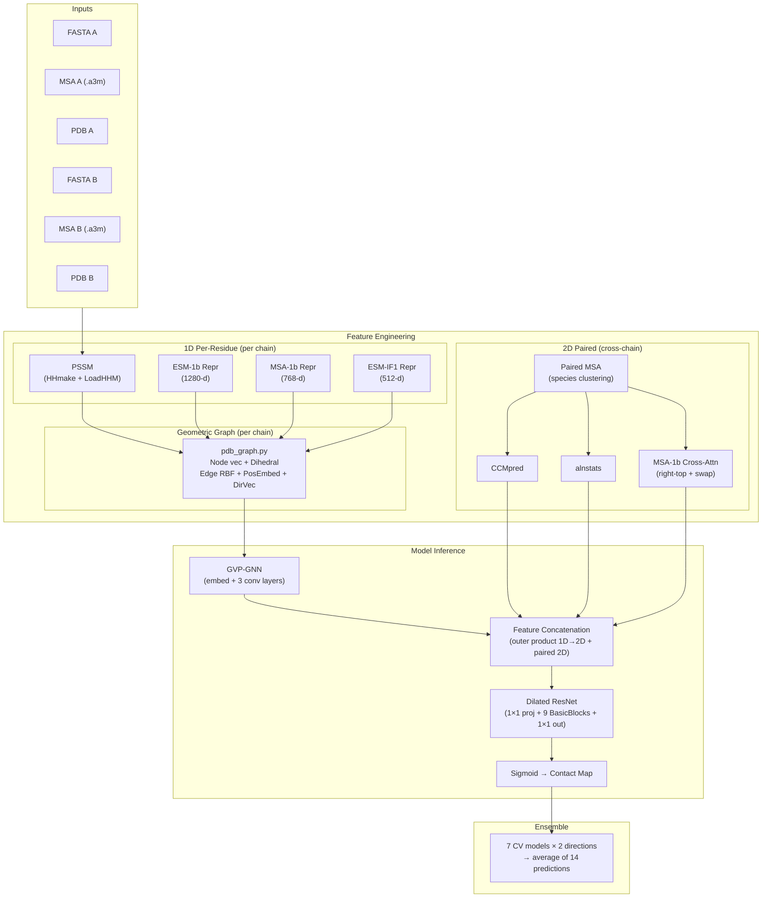
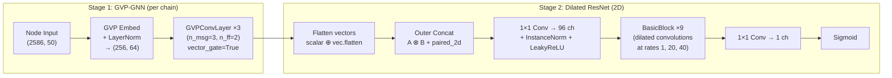

---
slug:4-architecture-overview
blog_type:normal
---


PLMGraph-Inter 是一个用于**蛋白质间接触预测**的深度学习系统——给定两个相互作用蛋白质的结构，它预测跨蛋白质界面的哪些残基对处于接触状态。该架构融合了三个正交信息来源：捕获进化与结构先验的**蛋白质语言模型嵌入**、编码三维空间上下文的**几何图神经网络表示**，以及揭示链间进化约束的**配对 MSA 共进化信号**。这些异构特征被投射到共享的二维接触图空间中，并通过一个空洞残差网络进行精炼，最终生成逐残基对的接触概率矩阵。


来源: [README.md](/README.md#L1-L3), [model.py](/model.py#L1-L12)

## 系统数据流

预测流程遵循严格的**特征准备 → 特征加载 → 模型推理 → 集成**顺序。每个阶段都是模块化的，可以独立验证或替换。下图追踪了从原始输入到最终接触图的完整数据路径。



来源: [predict.py](/predict.py#L40-L200), [load_feature.py](/load_feature.py#L42-L95), [model.py](/model.py#L155-L254)

## 特征架构：三个正交通道

该系统的独特能力源于组合了捕获蛋白质相互作用**独立方面**的特征。每个通道都解决了其他通道无法单独克服的局限性。

| 特征通道 | 维度 | 来源模块 | 捕获内容 | 缺失时的关键局限 |
|---|---|---|---|---|
| **PLM 嵌入** | 1D 逐残基 (1280+768+512+20 = 2580-d) | `plm/esm1b_repr.py`, `plm/msa1b_repr.py`, `plm/esmif_repr.py` | 进化上下文 (ESM-1b, MSA-1b)，结构逆折叠先验 (ESM-IF1) | 缺乏学习到的进化或结构先验 |
| **几何图** | 1D 节点 (6-d 二面角 + 50×3 方向) + 边 (RBF + 位置 + 方向) | `pdb_graph.py` | 局部三维几何，骨架方向框架，空间邻域 | 缺乏空间推理或旋转等变性 |
| **配对 MSA / 共进化** | 2D 成对 (CCMpred + alnstats + 交叉注意力) | `paired/pair_msa.py`, `plm/msa1b_attn.py` | 链间进化耦合，直接共进化信号 | 缺乏链间进化约束的证据 |

<CgxTip>一维逐残基特征（PLM + 图节点标量/向量）通过**外积展开**转换为二维接触图空间——链 A 的每个残基平铺至所有列，链 B 的每个残基平铺至所有行，随后与原生的二维配对特征进行拼接。这对应 `model.py` 中的 `concat()` 函数。</CgxTip>

来源: [load_feature.py](/load_feature.py#L42-L62), [pdb_graph.py](/pdb_graph.py#L197-L265), [model.py](/model.py#L14-L26)

## 模型架构：GVP-GNN + 空洞 ResNet

`ResNet` 类（通过 `resnet18()` 实例化）实现了**两阶段架构**：几何向量感知机图神经网络独立处理每条链的结构图，随后空洞二维残差网络对拼接后的二维特征图进行运算。这种分离确保了在塌缩至旋转不变的二维预测空间之前，对三维结构进行**SE(3)-等变**处理。



### GVP-GNN 配置

图神经网络在**等变向量-标量对**上运行。每个节点和边都携带一个标量特征向量（旋转不变）和一个向量特征张量（等变——在旋转下可预测地变换）。

| 参数 | 值 | 描述 |
|---|---|---|
| `node_input_dim` | (2586, 50) | 2586 个标量特征 + 50 个向量特征（每个为三维） |
| `node_hidden_dim` | (256, 64) | GVP 嵌入后的隐藏维度 |
| `edge_input_dim` | (432, 25) | 432 个标量边特征 + 25 个向量边特征 |
| `edge_hidden_dim` | (432, 25) | 穿过 GVP 层保持不变的边维度 |
| GVP layers | 3 | `GVPConvLayer` 块的数量 |
| `n_message` | 3 | 每个 GVPConvLayer 的消息传递子层数 |
| `n_feedforward` | 2 | 每个 GVPConvLayer 的前馈子层数 |
| `vector_gate` | True | 使用向量门控（而非标量门控） |
| `drop_rate` | 0.1 | GVP 层中的 Dropout 率 |

### 空洞 ResNet 配置

在 GVP 阶段生成逐残基嵌入后，外积拼接产生一个二维特征张量。空洞 ResNet 将其精炼为单通道接触概率图。

| 参数 | 值 | 描述 |
|---|---|---|
| `in_channel` | 96 | 二维卷积的隐藏通道数 |
| BasicBlocks | 9 | 残差块的数量 |
| Dilated rates | {1, 20, 40} | 激活 1×15 和 15×1 空洞卷积的扩张率 |
| Kernel sizes | 3×3, 1×15, 15×1 | 多尺度感受野模式 |
| InstanceNorm | Yes | 逐样本归一化（不依赖批次） |
| Activation | LeakyReLU(0.01) | 贯穿两个阶段 |
| Initialization | Kaiming normal | 用于所有 Conv2d 层 |

<CgxTip>`BasicBlock` **仅**在扩张率属于 `{1, 20, 40}` 时激活其空洞 1×15 和 15×1 卷积。在其他扩张率下，仅触发 3×3 卷积。这形成了一个多尺度感受野，能够在二维图内同时捕获局部接触模式和长程蛋白质间接触。</CgxTip>

来源: [model.py](/model.py#L79-L261), [model.py](/model.py#L155-L198)

## 集成策略：交叉验证 × 对称性

预测集成利用了模型多样性的两个正交来源：**交叉验证折**与**输入链顺序**。对于 7 个训练模型（来自 7 折交叉验证），系统在 (A→B) 和 (B→A) 两个方向上运行推理，共产生 14 个预测。最终接触图为所有 14 个预测的平均值。

两个方向的预测之所以不同，是因为配对的二维特征**不对称**：“右上”交叉注意力（A 注意 B）与“交换”交叉注意力（B 注意 A）捕获了不同的共进化信号。类似地，当链顺序交换时，CCMpred 和 alnstats 矩阵会被转置。

| 方向 | 模型输入 | 配对特征 | 输出形状 |
|---|---|---|---|
| A→B | `(nodeA, edgeA, idxA, nodeB, edgeB, idxB)` | `rt_p2d` (右上注意力) | L_A × L_B |
| B→A | `(nodeB, edgeB, idxB, nodeA, edgeA, idxA)` | `sw_p2d` (交换注意力) | L_B × L_A → 转置为 L_A × L_B |

来源: [predict.py](/predict.py#L176-L201), [load_feature.py](/load_feature.py#L65-L95)

## 项目结构

```
PLMGraph-Inter/
├── model.py              # ResNet + BasicBlock + concat — 核心模型定义
├── predict.py            # 端到端预测流程 (特征准备 → 推理 → 集成)
├── train.py              # 包含 ppi_loss、top-k 统计与模型选择的训练循环
├── load_feature.py       # 特征加载：graph_feature() + paired_feature()
├── pdb_graph.py          # 从 PDB 构建几何图 (节点、边、方向)
├── plm/                  # 蛋白质语言模型特征提取器
│   ├── esm1b_repr.py     # ESM-1b 逐残基表示 (1280-d)
│   ├── esm1b_attn.py     # ESM-1b 注意力 (最终流程中未使用)
│   ├── msa1b_repr.py     # ESM-MSA-1b 逐残基表示 (768-d)
│   ├── msa1b_attn.py     # ESM-MSA-1b 跨链注意力 (二维配对)
│   ├── esmif_repr.py     # ESM-IF1 逆折叠表示 (512-d)
│   └── LoadHHM.py        # HHM → PSSM/PSFM 提取
├── paired/               # 配对 MSA 构建
│   ├── pair_msa.py       # 基于物种的 MSA 配对流程
│   ├── cluster_species.py# 常见分类识别 + 相似度排序
│   └── rw_a2m.py         # A2M/MSA 文件读取、解析、编码
├── data/                 # 数据集与模型回归权重
│   ├── trainset/         # 7362 个训练二聚体
│   ├── HomoPDB/          # 400 个同源二聚体测试集
│   ├── HeteroPDB/        # 200 个异源二聚体测试集
│   ├── DB5.5/            # 59 个 Docking Benchmark 5.5 测试二聚体
│   ├── DHTest/           # 130 个 DeepHomo 测试二聚体
│   └── regression/       # ESM 接触回归模型权重
├── example/              # 示例输入文件 (1GL1 复合物)
└── model/                # 训练好的模型权重 (7 个 CV 折，需单独下载)
```

来源: [data/README.md](/data/README.md#L1-L10), [README.md](/README.md#L1-L63)

## 关键设计原则

**等变与不变处理的分离。** GVP-GNN 在完整的 SE(3)-等变空间（标量-向量对）中运行，通过三个消息传递层保留旋转信息。仅在此阶段之后，向量特征才被展平并与旋转不变的二维配对特征结合。这确保了几何推理永远不会被过早的投影破坏。

**多尺度二维感受野。** 空洞 ResNet 在扩张率 {1, 20, 40} 下组合 3×3、1×15 和 15×1 卷积核，形成了从局部接触块到跨整个接触图的长程蛋白质间关联的感受野——这至关重要，因为蛋白质间接触常表现出非局部模式（例如，跨界面的 β-折叠配对）。

**共进化作为一等信号。** 与将 MSA 衍生特征视为可选补充的方法不同，PLMGraph-Inter 将配对的共进化特征（CCMpred、alnstats、MSA-1b 交叉注意力）置于与 PLM 及几何特征同等的地位。基于物种的 MSA 配对策略（`paired/pair_msa.py`）专为构建保留真实进化耦合信号的链间 MSA 而设计。

来源: [model.py](/model.py#L225-L254), [paired/pair_msa.py](/paired/pair_msa.py#L35-L84)

## 推荐阅读路径

为加深对每个架构组件的理解，请按照以下顺序阅读文档：

1. **[蛋白质语言模型嵌入](5-protein-language-model-embeddings)** — 如何调用 ESM-1b、ESM-MSA-1b 和 ESM-IF1，以及它们的表示编码了什么
2. **[几何图构建](6-geometric-graph-construction)** — `pdb_graph.py` 中的三维结构 → 等变图流程
3. **[配对 MSA 与共进化](7-paired-msa-and-coevolution)** — 基于物种的配对与共进化特征提取
4. **[GVP 图神经网络](8-gvp-graph-neural-network)** — 等变消息传递阶段的细节
5. **[用于接触图的空洞 ResNet](9-dilated-resnet-for-contact-maps)** — 二维精炼网络架构
6. **[特征拼接策略](10-feature-concatenation-strategy)** — 如何通过外积展开组合一维和二维特征
7. **[预测流程](11-prediction-pipeline)** — 完整的端到端推理流
8. **[训练与损失设计](12-training-and-loss-design)** — 加权交叉熵损失与训练过程
9. **[交叉验证集成](13-cross-validation-ensemble)** — 7 折 CV × 2 方向集成策略