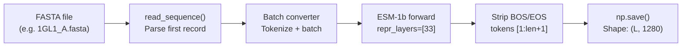
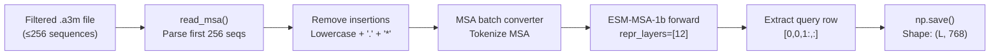
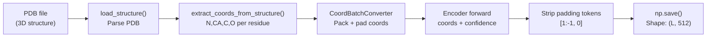
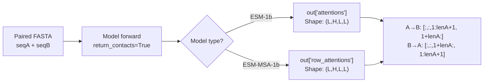
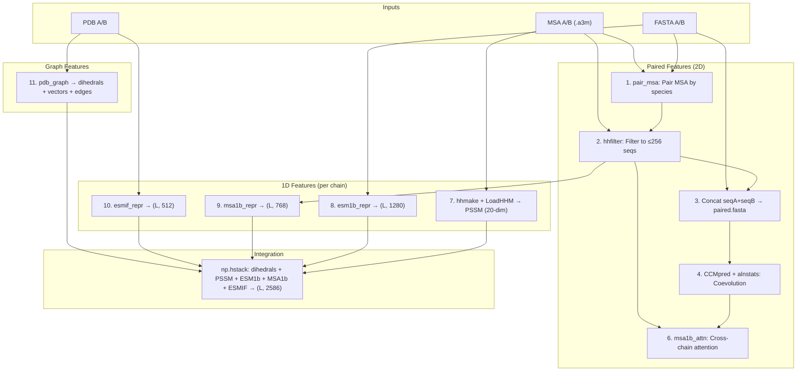

---
slug:5-protein-language-model-embeddings
blog_type:normal
---


PLMGraph-Inter 利用 Meta 的 ESM (Evolutionary Scale Modeling) 系列中的**三个预训练蛋白质语言模型**来生成逐残基嵌入，这些嵌入捕获了蛋白质序列、进化和结构信息的互补视图。这些嵌入 —— 来自 **ESM-1b**、**ESM-MSA-1b** 和 **ESM-IF1** —— 由 `plm/` 目录下的脚本生成，随后与几何图特征拼接，形成输入到 GVP-GNN 的 1D 节点特征。本页面解释了每个模型背后的架构原理、提取逻辑、输出形状，以及它们如何整合到完整的特征流水线中。

来源: [predict.py](predict.py#L1-L20), [plm/](plm)

## 三模型策略

每个语言模型专精于蛋白质信息的不同模态。下表总结了它们各自的角色：

| 模型 | 输入 | 捕获的信息 | 每残基输出 | 脚本 | 层 |
|-------|-------|----------------------|---------------------|--------|-------|
| **ESM-1b** | 单条 FASTA 序列 | 序列级语义与长程接触 | 1280 维表示 | `esm1b_repr.py` | 33 (最终层) |
| **ESM-MSA-1b** | 多序列比对 (`.a3m`) | 进化共变与保守性 | 768 维表示 | `msa1b_repr.py` | 12 (最终层) |
| **ESM-IF1** | 3D PDB 结构 (坐标) | 逆折叠结构上下文 | 512 维表示 | `esmif_repr.py` | 编码器最终层 |

其设计哲学是**正交信息融合**：ESM-1b 从原始序列中学习残基的*语义*，ESM-MSA-1b 学习残基在同源物间的*共进化*方式，而 ESM-IF1 学习残基在 3D 空间中的*外观*。拼接后，这些嵌入为下游的 GVP-GNN 提供了丰富的、多模态的逐残基描述符，而无需对语言模型本身进行任何微调。

来源: [plm/esm1b_repr.py](plm/esm1b_repr.py#L39-L54), [plm/msa1b_repr.py](plm/msa1b_repr.py#L41-L58), [plm/esmif_repr.py](plm/esmif_repr.py#L13-L31)

## ESM-1b：序列级表示

ESM-1b (`esm1b_t33_650M_UR50S`) 是一个拥有 6.5 亿参数的 BERT 风格 Transformer，在来自 UniRef50 的 2.5 亿条蛋白质序列上训练而成。它接收**单条氨基酸序列** (FASTA)，并从其第 33 层（最终层）表示层生成逐残基嵌入。

### 提取流水线



`esm1b_repr.py` 中的 `main()` 函数执行以下步骤：(1) 通过 `esm.pretrained.load_model_and_alphabet_local()` 加载预训练模型和字母表；(2) 使用 `read_sequence()` 从 FASTA 文件中读取第一条序列；(3) 通过批量转换器将其转换为分词后的张量；(4) 在 `torch.no_grad()` 下运行前向传播，请求 `repr_layers=[33]`；(5) 通过截断 BOS/EOS 特殊标记来提取逐残基表示 —— `out['representations'][33][0, 1:(len_seq+1), :]` —— 生成形状为 **(L, 1280)** 的 NumPy 数组，其中 L 为序列长度。

<CgxTip>索引 `[0, 1:(len_seq+1), :]` 至关重要：索引 0 选取批次项，索引 `1:(len_seq+1)` 跳过位于位置 0 的开头 BOS 标记和末尾的 EOS 标记，从而确保残基位置与嵌入行之间的对齐。</CgxTip>

来源: [plm/esm1b_repr.py](plm/esm1b_repr.py#L39-L54)

## ESM-MSA-1b：进化表示

ESM-MSA-1b (`esm_msa1b_t12_100M_UR50S`) 是一个拥有 1 亿参数的 **MSA Transformer**，它处理整个多序列比对而非单条序列。它捕获共变信号 —— 即哪些残基对在同源物中协同突变 —— 这对于蛋白质间接触预测至关重要。

### 提取流水线



与 ESM-1b 的主要区别在于：(1) 输入是一个 **MSA 文件**（`.a3m` 格式，通过 `hhfilter -diff 256` 过滤至最多 256 条序列），而非单条 FASTA。(2) `read_msa()` 函数从 MSA 中读取前 `nseq=256` 条序列，并通过 `remove_insertions()` 自动剥离小写插入字符和空位标记。(3) 表示从 MSA 的**查询（第一）行**提取：`out['representations'][12][0, 0, 1:, :]` —— 其中 `[0,0]` 选取批次 0 和 MSA 行 0（即查询序列），`1:` 剥离 BOS 标记，最终生成形状为 **(L, 768)** 的输出。

<CgxTip>将 MSA 过滤至 256 条序列 (`max_msa = 256`) 是在共变信号质量与 GPU 显存之间做出的权衡。`predict.py` 中的 `hhfilter -diff 256` 步骤确保了 MSA 在送入模型前已被预过滤，从而避免了推理时基于冗余多样性的重复过滤。</CgxTip>

来源: [plm/msa1b_repr.py](plm/msa1b_repr.py#L41-L58), [predict.py](predict.py#L64-L74)

## ESM-IF1：逆折叠结构表示

ESM-IF1 (`esm_if1_gvp4_t16_142M_UR50`) 是一个拥有 1.42 亿参数的**逆折叠**模型，它将 3D 骨架坐标编码为残基级嵌入。与 ESM-1b 和 ESM-MSA-1b 这些序列到序列的 Transformer 不同，ESM-IF1 使用了一个 **GVP-GNN 编码器**，直接接收结构坐标作为输入。

### 提取流水线



`esmif_repr.py` 中的 `main()` 函数使用了 ESM 逆折叠工具：`load_structure()` 解析 PDB 文件，`extract_coords_from_structure()` 提取逐残基骨架坐标（N, CA, C, O 原子），`CoordBatchConverter` 负责处理带有填充掩码和置信度分数的坐标批次。编码器输出通过 `encoder_out['encoder_out'][0][1:-1, 0]` 进行切片以移除边界填充标记，最终生成形状为 **(L, 512)** 的输出。

这是唯一需要 **3D 结构**作为输入的嵌入，这使得它成为几何图特征与语言模型表示之间的桥梁 —— 它编码了相同的结构信息，但视角是一个被训练来预测哪些序列能折叠成给定结构的模型。

来源: [plm/esmif_repr.py](plm/esmif_repr.py#L13-L31)

## 来自配对 MSA 的跨链注意力

除了逐残基表示之外，当 ESM-1b 和 ESM-MSA-1b 应用于**拼接的配对序列** (seqA + seqB) 时，它们还会生成捕获蛋白质间残基对关系的**注意力图**。这些注意力图由 `esm1b_attn.py` 和 `msa1b_attn.py` 提取。

### 注意力提取逻辑

配对序列是通过将链 A 和链 B 的序列拼接成单个 FASTA 条目来形成的。当模型处理这一拼接输入时，链 A 与链 B 位置之间的注意力权重编码了**跨链耦合信号**。提取过程使用了精确的位置切片：



对于 `esm1b_attn.py`，跨链注意力提取方式为：
- **A→B 注意力** (`rt_attn`)：`out['attentions'][:,:,1:(lenA+1), 1+lenA:(len_seq+1)]` —— 对应于链 A 残基关注链 B 残基的行
- **B→A 注意力** (`sw_attn`)：`out['attentions'][:,:,1+lenA:(len_seq+1), 1:(lenA+1)]` —— 对应于链 B 残基关注链 A 残基的行

对于 `msa1b_attn.py`，应用相同的切片逻辑，但使用 `out['row_attentions']`，因为 MSA Transformer 输出的是逐行注意力模式。生成的注意力张量形状为 **(layers, heads, lenA, lenB)**，随后在 `load_feature.paired_feature()` 中被重塑为 **(layers×heads, lenA, lenB)** 以构成 2D 成对特征。

| 注意力脚本 | 模型 | 来源键 | 输入 | 是否配对？ |
|-----------------|-------|-----------|-------|---------|
| `esm1b_attn.py` | ESM-1b | `attentions` | 配对 FASTA (seqA+seqB) | 是 |
| `msa1b_attn.py` | ESM-MSA-1b | `row_attentions` | 配对过滤后的 `.a3m` | 是 |

来源: [plm/esm1b_attn.py](plm/esm1b_attn.py#L39-L61), [plm/msa1b_attn.py](plm/msa1b_attn.py#L40-L64)

## 插入删除工具

`plm/` 目录下的五个脚本中有四个共享一个用于 MSA 预处理的通用插入删除模式：

```python
deletekeys = dict.fromkeys(string.ascii_lowercase)
deletekeys["."] = None
deletekeys["*"] = None
translation = str.maketrans(deletekeys)

def remove_insertions(sequence: str) -> str:
    return sequence.translate(translation)
```

此操作删除：(1) **小写字母** —— 在 `.a3m` 格式中代表相对于查询的插入（参考序列中缺失的比对列）；(2) **`.`** —— HH-suite 格式中的空位字符；(3) **`*`** —— 终止密码子。`read_msa()` 函数在分词前将此操作应用于比对中的每条序列，以确保模型接收到干净、无空位的序列。

来源: [plm/esm1b_repr.py](plm/esm1b_repr.py#L19-L36), [plm/msa1b_repr.py](plm/msa1b_repr.py#L20-L37)

## HMM 特征谱 (PSSM)

虽然不是语言模型，但通过 `LoadHHM.py` 提取的 **HMM 特征谱**是第四个 1D 逐残基特征，与 PLM 嵌入同位于 `plm/` 目录中。其流水线为：

1. `hhmake` 将 `.a3m` MSA 转换为 `.hhm` 特征谱 HMM 文件
2. `LoadHHM.py` 解析 `.hhm` 文件以生成形状为 **(L, 20)** 的 **PSSM**（位置特异性评分矩阵） —— 每个残基对应一个 20 维的评分向量，编码了每种氨基酸的对数发生比发射分数

`ReadHHM()` 函数实现了完整的解析流水线：它从 HMM 块中读取发射分数，应用 **Neff 加权转移概率平滑**，通过 `2^(emission_score)` 计算**位置特异性频率矩阵 (PSFM)**，添加 **Gonnet 矩阵伪计数**以处理稀疏位置，并推导出最终的 PSSM 为 `log2(PSFM) + HMMNull/1000`。Gonnet 替换矩阵和 HMMNull 背景分数为保持数值稳定性而进行了硬编码。

| 特征 | 键 | 形状 | 描述 |
|---------|-----|-------|-------------|
| `hmm1` | 发射对数发生比 | (L, 20) | 原始 log₂ 发射分数 |
| `hmm1_prob` | PSFM | (L, 20) | 位置特异性频率（总和为 1） |
| `hmm1_score` | PSSM | (L, 20) | 带有背景校正的分数 |
| `hmm2` | 转移 | (L, 10) | 状态转移概率 + Neff 值 |

来源: [plm/LoadHHM.py](plm/LoadHHM.py#L97-L204), [plm/LoadHHM.py](plm/LoadHHM.py#L207-L317)

## 特征整合：拼接

`load_feature.graph_feature()` 函数编排了最终的 1D 特征组装。对于每条链，它加载并水平堆叠所有逐残基特征：

```python
feature_1d = np.hstack((graph['nodes_sact'], PSSM, esm1b_repr, msa1b_repr, esmif_repr))
```

这生成了供 GVP-GNN 消费的**完整 1D 节点特征向量**：

| 组件 | 来源 | 维度 | 起源 |
|-----------|--------|-----------|--------|
| `nodes_sact` | `pdb_graph.py` | 6 | 骨架二面角 (φ, ψ, ω → cos, sin) |
| PSSM | `LoadHHM.py` | 20 | HMM 特征谱分数 |
| ESM-1b repr | `esm1b_repr.py` | 1280 | 序列 Transformer |
| ESM-MSA-1b repr | `msa1b_repr.py` | 768 | MSA Transformer |
| ESM-IF1 repr | `esmif_repr.py` | 512 | 逆折叠编码器 |
| **总计** | — | **2586** | — |

总计 **2586** 的 1D 特征维度与 `model.py` 中声明的 `node_input_dim = (2586, 50)` 相匹配，其中第二个维度 (50) 来源于几何向量特征 (`nodes_vec`)。GVP 嵌入层在送入 GVP 卷积层之前，将此 `(2586, 50)` 对投影到 `(256, 64)` 的隐藏维度。

来源: [load_feature.py](load_feature.py#L42-L62), [model.py](model.py#L159-L168)

## 完整特征生产流水线

`predict.py` 脚本按顺序执行所有 PLM 嵌入步骤。下图展示了完整的特征准备流程，其中与 PLM 相关 的步骤已高亮显示：



注意步骤编号遵循 `predict.py` 中的注释 —— 源码中省略了第 5 步，且该流水线自然地分离为**配对的 2D 特征**（来自拼接输入的跨链注意力）和**逐链 1D 特征**（来自独立输入的单独嵌入）。

来源: [predict.py](predict.py#L38-L161), [load_feature.py](load_feature.py#L42-L95)

## 模型权重需求

所有三个 ESM 模型都需要从 Meta 的 ESM 仓库下载预训练权重。回归检查点文件（`data/regression/` 中的 `.pt` 文件）必须与主模型权重共存于同一目录，因为 ESM 的接触预测头依赖于它们。所需文件及其在 `predict.py` 中配置的路径如下：

| 模型 | 权重文件 | 大小 | 回归文件 |
|-------|------------|------|-----------------|
| ESM-1b | `esm1b_t33_650M_UR50S.pt` | ~2.5 GB | `esm1b_t33_650M_UR50S-contact-regression.pt` |
| ESM-MSA-1b | `esm_msa1b_t12_100M_UR50S.pt` | ~800 MB | `esm_msa1b_t12_100M_UR50S-contact-regression.pt` |
| ESM-IF1 | `esm_if1_gvp4_t16_142M_UR50.pt` | ~560 MB | (无需) |

来源: [predict.py](predict.py#L25-L35), [data/regression/](data/regression)

## 接下来去哪

此处描述的 PLM 嵌入生成了 1D 逐残基特征。要了解这些特征如何与 3D 几何信息相结合，请参阅[几何图构建](6-geometric-graph-construction)。至于作为注意力图补充的跨链 2D 特征，请参阅[配对 MSA 与共变](7-paired-msa-and-coevolution)。要查看拼接后的特征如何流经 GVP-GNN 和 Dilated ResNet，请参阅[GVP 图神经网络](8-gvp-graph-neural-network)和[特征拼接策略](10-feature-concatenation-strategy)。