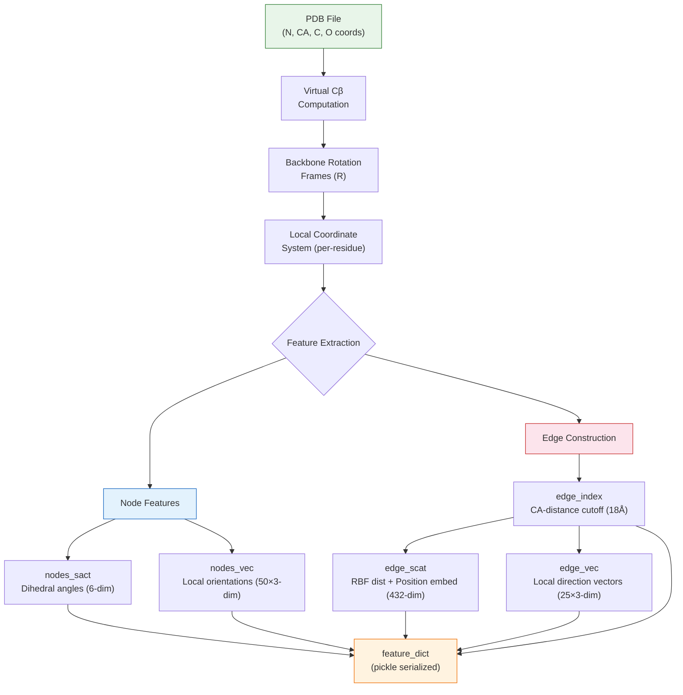
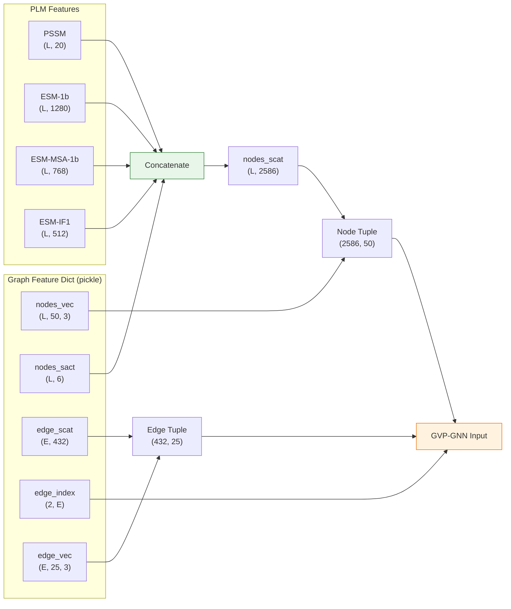

---
slug:6-geometric-graph-construction
blog_type:normal
---

PLMGraph-Inter 从蛋白质 3D 结构中构建**等变几何图**，将每个残基编码为同时具有标量和向量特征的节点，并通过空间感知边进行连接。这是输入到 [GVP 图神经网络](8-gvp-graph-neural-network) 的结构主干，其设计赋予了 PLMGraph-Inter 旋转和平移等变性——这是相对于纯标量图表示的核心优势。整个流程位于单个模块 `pdb_graph.py` 中，将 PDB 文件转换为包含五个几何张量的特征字典。

来源：[pdb_graph.py](pdb_graph.py#L1-L265)

## 架构概述

几何图的构建遵循严格的依赖链：原始坐标 → 局部坐标系 → 节点特征 + 边拓扑 → 边特征 → 序列化。每个阶段都建立在前一阶段的输出之上，任何阶段都不可跳过。

来源：[pdb_graph.py](pdb_graph.py#L197-L265)

## 坐标提取与虚拟 Cβ

该流程首先使用 BioPython 的 `PDBParser` 解析 PDB 文件，并提取链 A 中残基的主链原子坐标。每个残基读取四个原子——**N, CA, C, O**——生成形状为 `(L, 4, 3)` 的坐标张量，其中 L 是蛋白质长度。

由于 Cβ 原子并不普遍存在于 PDB 文件中（甘氨酸缺乏该原子；某些结构存在原子缺失），系统使用代数公式从 N-CA-C 主链计算**虚拟 Cβ** 位置：

$$C_\beta^{virtual} = -0.5827 \cdot \mathbf{a} + 0.5680 \cdot \mathbf{b} - 0.5407 \cdot \mathbf{c} + C_\alpha$$

其中 **b** = Cα − N，**c** = C − Cα，**a** = **b** × **c**。这些系数是由理想化的主链几何形状经验推导得出的。然后将虚拟 Cβ 拼接起来，生成形状为 `(L, 5, 3)` 的最终坐标张量，五个原子的排列顺序为 **N, CA, C, O, Cβ**。

来源：[pdb_graph.py](pdb_graph.py#L160-L216)

## 局部旋转坐标系

每个残基都被分配一个**局部右手正交坐标系**，该坐标系由其 N、CA 和 C 位置构建而成。该坐标系定义了一个以残基为中心的坐标系，消除了对全局蛋白质方向的依赖——这是实现等变性的关键。

该坐标系的计算方式如下，使用 CA 位置作为锚点：

| 基向量 | 计算 | 几何意义 |
|---|---|---|
| **e₁** | normalize(CA − C) | 沿着多肽主链从 C 指向 CA |
| **e₂** | normalize(**v₂** − (**e₁** · **v₂**)·**e₁**)，其中 **v₂** = CA − N | N→CA 方向上与 **e₁** 正交的分量 |
| **e₃** | **e₁** × **e₂** | 构成右手坐标系 |

生成的形状为 `(L, 3, 3)` 的旋转矩阵 **R** 将基向量作为行进行堆叠。此构造遵循 Facebook Research 的 ESM 逆折叠模块的方法，确保与预训练的 ESM-IF1 表示保持一致性。

来源：[pdb_graph.py](pdb_graph.py#L41-L59)

## 局部坐标系

有了每个残基的旋转坐标系后，所有原子坐标都被转换到**残基局部坐标系**中。这是计算上最具意义的步骤，也是所有后续向量特征的基础。

该转换分两个阶段进行：

1. **平移**：从所有坐标中减去每个残基的 CA 位置，将坐标系中心置于该残基的 Alpha 碳上：`trans_coords[b,i,a,:] = coords[i,a,:] - coords[b,CA,:]`
2. **旋转**：使用爱因斯坦求和约定将平移后的坐标旋转到局部坐标系中：`local_coords[b,i,a,:] = R[b,:,:] @ trans_coords[b,i,a,:]`

生成的 `local_coords` 张量形状为 `(L, L, 5, 3)`。第一个索引选择**参考残基**（使用其局部坐标系），第二个索引选择**目标残基**（其原子在该坐标系中表示）。这意味着 `local_coords[b, b]` 给出了残基 b 在其自身局部坐标系中的**自坐标**——由于主链的规律性，这对于所有残基在几何上将是完全相同的。

<CgxTip>(L, L, 5, 3) 的 local_coords 张量是核心数据结构。所有节点向量特征和边向量特征均由此推导而来。理解其双索引语义——参考残基与目标残基——对于掌握后续的方向与边向量计算至关重要。</CgxTip>

来源：[pdb_graph.py](pdb_graph.py#L224-L228)

## 节点特征

节点特征编码每个残基的局部几何形状，并被分为**标量特征**（`nodes_sact`）和**向量特征**（`nodes_vec`），这与 GVP 架构的双通道设计相匹配。

### 标量特征：主链二面角

标量通道通过三个标准二面角——**φ (phi), ψ (psi), ω (omega)**——捕获主链构象，这些二面角由连续的 N、CA、C 原子位置计算得出。每个角通过 **(cos θ, sin θ)** 编码提升到圆上，而不是使用原始角度（在 ±π 处具有不连续性），从而为每个残基生成 6 个标量特征（3 个角度 × 2 个三角函数分量）。这种编码是连续且无歧义的，使其适合作为神经网络的输入。

| 二面角 | 涉及原子 | 编码 |
|---|---|---|
| φ (phi) | Cᵢ₋₁ → Nᵢ → CAᵢ → Cᵢ | (cos φ, sin φ) |
| ψ (psi) | Nᵢ → CAᵢ → Cᵢ → Nᵢ₊₁ | (cos ψ, sin ψ) |
| ω (omega) | CAᵢ → Cᵢ → Nᵢ₊₁ → CAᵢ₊₁ | (cos ω, sin ω) |

### 向量特征：局部方向

向量通道编码每个残基与其序列相邻残基之间的**方向关系**。对于残基 b，计算两组向量：

- **前向向量**：从下一个残基 (b+1) 到当前残基 (b) 的方向，在残基 b 的局部坐标系中表示——捕获主链向前延伸的方式
- **后向向量**：从上一个残基 (b-1) 到当前残基 (b) 的方向，在残基 b 的局部坐标系中表示——捕获主链向后延伸的方式

相邻残基中的 5 个原子（N, CA, C, O, Cβ）各自贡献一个 3D 向量，得到 5 个前向 + 5 个后向 = **每残基 10 个方向向量**。随后这些向量被**复制 5 次**（局部坐标系中每个原子一次），生成最终形状为 `(L, 50, 3)` 的 `nodes_vec`——即每个节点 50 个三维向量特征。

来源：[pdb_graph.py](pdb_graph.py#L62-L87), [pdb_graph.py](pdb_graph.py#L169-L193), [pdb_graph.py](pdb_graph.py#L232-L236)

## 边的构建

边表示残基之间的空间邻近关系，同时携带标量和向量特征。图的拓扑结构由 **Cα 原子的距离截断**决定。

### 边索引：空间邻居

如果残基 i 和 j 的 Cα–Cα 距离在 **18 Å 截断值**内，则在它们之间创建一条边。该阈值是经过刻意选取的宽泛值——它不仅捕获直接接触的邻居，还捕获第二壳层的空间上下文，这对于 GVP 消息传递超越直接邻居传播几何信息非常重要。计算成对距离图后，在截断值处进行二值化，并通过 PyTorch Geometric 的 `dense_to_sparse` 转换为稀疏边索引，生成形状为 `(2, num_edges)` 的 `edge_index`。

### 标量边特征：RBF 距离 + 位置嵌入

标量边通道拼接了两种互补的编码：

**径向基函数 (RBF) 编码**将两个端点残基之间所有 5×5 = 25 个原子对的成对欧氏距离扩展到高斯基中。每个距离 d 被映射到 16 个 RBF 核，这些核的中心均匀分布在 2 Å 到 18 Å 之间：

$$\text{RBF}(d) = \exp\left(-\left(\frac{d - \mu_k}{\sigma}\right)^2\right), \quad \mu_k \in [2, 18], \quad k = 1, \ldots, 16$$

这为每条边生成 25 × 16 = **400 个 RBF 特征**，提供了一种平滑、可微的距离表示，能够同时捕获局部和长程空间关系。

**正弦位置嵌入**使用与 Transformer 位置编码相同的方案，通过 16 个频带编码沿链的**序列间隔** |i − j|。这为每条边生成 16 × 2 = **32 个位置特征**，使模型能够区分在空间上邻近但在序列上相近与遥远的残基。

最终的 `edge_scat` 维度为 **432**（400 + 32）每条边。

### 向量边特征：局部方向向量

对于每条边 (i → j)，向量通道在残基 i 的局部坐标系中捕获**从残基 i 到残基 j 的方向**。具体而言，残基 j 的 5 个原子在残基 i 的局部坐标系中表示，并通过从残基 j 的 5 个原子中分别减去残基 i 的 5 个局部原子来计算方向向量，为每条边生成 5 × 5 = **25 个方向向量**。经过 L2 归一化后，`edge_vec` 张量的形状为 `(num_edges, 25, 3)`。

<CgxTip>18 Å 的 Cα 截断值是一个关键超参数。较小的截断值会遗漏长程几何上下文；较大的截断值则会以二次方级增加计算成本。所选值平衡了空间邻域的覆盖范围与图的密度，并与 RBF 的 D_max 参数对齐——超过 18 Å 的距离其 RBF 激活值微乎其微。</CgxTip>

来源：[pdb_graph.py](pdb_graph.py#L104-L157), [pdb_graph.py](pdb_graph.py#L239-L253)

## 特征字典与下游消费

`main()` 函数将所有计算出的特征序列化为一个 Python pickle 文件，包含以下字典：

| 键 | 形状 | 类型 | 描述 |
|---|---|---|---|
| `nodes_vec` | (L, 50, 3) | 向量 | 每个残基的局部方向向量 |
| `nodes_sact` | (L, 6) | 标量 | 主链二面角特征 (cos/sin) |
| `edge_scat` | (num_edges, 432) | 标量 | RBF 距离 + 位置嵌入 |
| `edge_index` | (2, num_edges) | 索引 | 稀疏边列表 (COO 格式) |
| `edge_vec` | (num_edges, 25, 3) | 向量 | 局部坐标系中每条边的方向向量 |

在特征加载时（在 `load_feature.py` 中），标量节点特征 `nodes_sact` 会被二面角与 PLM 衍生特征（PSSM, ESM-1b, ESM-MSA-1b, ESM-IF1）的拼接所**替换**，并存储在键 `nodes_scat` 下。向量节点特征 `nodes_vec` 保持不变。这生成了最终与 GVP 兼容的节点元组 `(nodes_scat, nodes_vec)`，维度为 **(2586, 50)**，以及边元组 `(edge_scat, edge_vec)`，维度为 **(432, 25)**——与模型的 `node_input_dim` 和 `edge_input_dim` 配置完全匹配。

来源：[pdb_graph.py](pdb_graph.py#L256-L263), [load_feature.py](load_feature.py#L42-L62), [model.py](model.py#L159-L164)

## 设计理念：为何使用几何图？

几何图表示解决了蛋白质结构编码中的一个根本问题：**对刚体变换的等变性**。如果蛋白质结构在 3D 空间中被旋转或平移，其蛋白质间接触不会发生改变。使用原始 3D 坐标作为特征的朴素图会对处于不同方向的同一结构产生不同的输出——这要求模型从数据中隐式学习旋转不变性。

通过在**每个残基的局部坐标系**中表示所有向量特征，PLMGraph-Inter 通过构造实现了精确的等变性：旋转整个蛋白质会相同地旋转每个局部坐标系，而在这些坐标系中表示的向量保持不变。这正是 [几何向量感知机 (GVP)](8-gvp-graph-neural-network) 设计所要保持的属性，使得几何图成为 GVP-GNN 的自然输入表示。

标量/向量特征的双重分离不仅仅是组织上的——它反映了一种几何上的区别。标量特征（二面角、RBF 距离、位置嵌入）根据定义在旋转下是**不变的**。向量特征（方向、方向向量）进行**等变旋转**。GVP 架构使用独立的通路处理这两个流，仅对向量通道应用旋转感知操作，这比将所有特征视为通用标量更加高效且更具原则性。

来源：[pdb_graph.py](pdb_graph.py#L41-L58), [model.py](model.py#L192-L197)

## 下一步

几何图为模型提供了结构输入。要了解这些图如何被等变 GVP 层处理，请前往 [GVP 图神经网络](8-gvp-graph-neural-network)。要全面了解标量节点特征在进入 GVP 之前如何用蛋白质语言模型嵌入进行增强，请参阅[蛋白质语言模型嵌入](5-protein-language-model-embeddings)。对于捕获链间共进化信号的互补成对特征，请参阅[配对 MSA 与共进化](7-paired-msa-and-coevolution)。