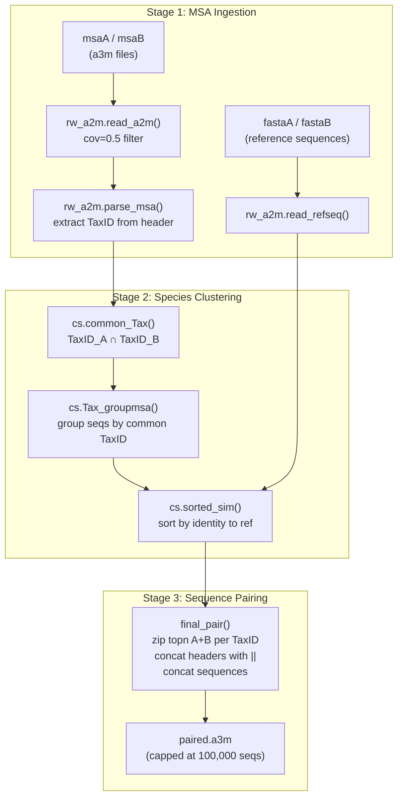
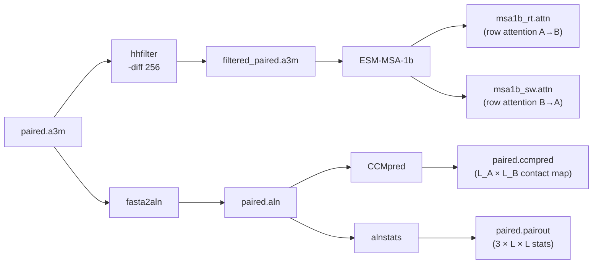

---
slug:7-paired-msa-and-coevolution
blog_type:normal
---


配对多序列比对（MSA）构建与共进化特征提取构成了 PLMGraph-Inter 的**蛋白质间信息主干**。虽然单链 MSA 捕获了蛋白质内进化约束，但通过连接来自两条链且具有相同分类学起源的同源序列而构建的*配对* MSA，揭示了**跨蛋白质-蛋白质界面相互作用残基之间的共进化耦合**。本页将梳理从两个未配对的 a3m 文件出发，历经物种感知配对、共进化信号计算（CCMpred + alnstats）以及 MSA-1b 跨链注意力提取，最终生成供 Dilated ResNet 使用的有向 2D 特征张量的完整流程。

## 配对的必要性：蛋白质内与蛋白质间共进化

对单链 MSA 的共进化分析可以检测出在该链*内部*协同突变的残基对——这对折叠预测很有用，但对蛋白质间接触却无能为力。**配对 MSA** 将同一生物体的链 A 和链 B 的已比对序列进行拼接，创建一个联合比对，其中 A 的列与 B 的列之间的统计耦合直接标志着蛋白质间的共进化。核心挑战在于**如何配对**：简单地将所有序列拼接在一起会破坏共进化信号，因为大多数（A 序列，B 序列）组合在自然界中从未共现过。PLMGraph-Inter 通过仅配对共享相同 **NCBI 分类学 ID** 的序列来解决此问题，然后按与参考序列的序列同一性对每个物种内的序列进行排序。

来源: [pair_msa.py](/paired/pair_msa.py#L1-L101), [cluster_species.py](/paired/cluster_species.py#L1-L111)

## 架构：配对 MSA 构建流程

配对流程是一个通过 `pair_msa.main()` 调用的三阶段协调器。每个阶段委托给一个专门的模块：



### 阶段 1 — MSA 摄取与解析

`rw_a2m.read_a2m()` 以二进制模式（8 KB 缓冲区）流式读取 a3m 文件，并应用**覆盖度过滤**：空格比例超过 `1 - cov` 的任何序列均被丢弃。在默认的 `cov=0.5` 设置下，空格比例 >50% 的序列将被移除。读取后，第一个条目（查询序列）被弹出，随后 `rw_a2m.parse_msa()` 将每个 HHblits 生成的头部分解为结构化元数据：

| 头部字段 | 提取模式 | 用途 |
|---|---|---|
| `UqID` | `>` 之后的第一个标记 | UniRef 簇标识符 |
| `Molecule` | `n=` 标记之前 | 来源分子注释 |
| `Members` | `n=<int>` | 簇成员计数 |
| `Tax` | `Tax=<string>` | 物种名称 |
| `TaxID` | `TaxID=<int>` | NCBI 分类学标识符（配对的关键） |
| `RepID` | `RepID=<string>` | 代表序列 ID |

包含非标准氨基酸（即 `ARNDCQEGHILKMFPSTWYV-` 之外的任何字符）的序列会被静默跳过。头部无法解析（缺少 `n=` 或 `TaxID=` 字段）的条目也会通过 `try/except` 保护机制予以排除。

来源: [rw_a2m.py](/paired/rw_a2m.py#L12-L92)

### 阶段 2 — 物种聚类与相似度排序

`cs.common_Tax()` 计算两个已解析 MSA 中存在的 TaxID 的**集合交集**，并丢弃 TaxID `-1`（未注释条目）。此交集定义了*可配对物种池*。随后，`cs.Tax_groupmsa()` 将每个 MSA 的序列划分为以共有 TaxID 为键的字典，其中每个值是一个包含两个元素的列表 `[seqs_A, seqs_B]`。

在每个物种组内，`cs.sorted_sim()` 按**与参考序列（来自 FASTA 文件的查询序列）的序列同一性**对序列进行排序。相似度计算使用 `rw_a2m.encode_a2m()`，该函数将每个残基映射为一个整数（0–20，空格=0），并通过 NumPy 逐元素相等性对照参考序列计算同一性。序列按**同一性降序**排列，确保与参考序列最相似的同源序列优先配对——这是一个关键启发式方法，因为高同一性序列携带更强的进化信号，且更有可能代表真正的直系同源物。

来源: [cluster_species.py](/paired/cluster_species.py#L22-L109), [rw_a2m.py](/paired/rw_a2m.py#L36-L51)

### 阶段 3 — 跨链序列拼接

`final_pair()` 遍历每个 TaxID 组，从每一侧提取前 `topn` 条序列（生产环境中默认为 100,000 条），并按位置将它们**配对**。配对策略是基于位置的：某一物种内链 A 的第 i 条序列与同一物种内链 B 的第 i 条序列配对。配对后的头部使用 `||` 分隔符连接；配对后的序列进行**直接拼接**（不插入空格），生成长度为 `len(refA) + len(refB)` 的联合序列。输出上限为 100,000 条配对序列，并写入 `paired.a3m` 文件，其中参考序列对作为第一个条目（头部使用 `&` 连接）。

<CgxTip>基于位置的拉链式配对（`zip(faA_list, faB_list)`）意味着**在一个物种内，配对序列的数量等于 `min(len(faA_list), len(faB_list))`**——来自较大一侧的多余序列将被丢弃。这是有意为之：强制进行不平衡配对会在共进化统计中引入噪声。</CgxTip>

来源: [pair_msa.py](/paired/pair_msa.py#L15-L84)

## 共进化特征提取

一旦 `paired.a3m` 构建完成，就会从中计算三个不同的共进化特征通道。它们构成了与源自 GVP 的 1D 特征一起输入到 Dilated ResNet 的**2D 蛋白质间特征图**。



### CCMpred — 伪似然耦合

配对 MSA 被重新格式化为 `.aln` 格式（通过 `fasta2aln` 将 A3M 转换为比对格式），然后输入到 **CCMpred**，后者计算一个**伪似然最大化**的耦合矩阵。对于联合长度为 `L = L_A + L_B` 的配对 MSA，CCMpred 输出一个完整的 `L × L` 耦合矩阵。代码提取了**蛋白质间象限** `[:L_A, L_A:]`——即捕获链 A 残基与链 B 残基之间耦合的 `L_A × L_B` 子矩阵。该单通道图是用于蛋白质间接触预测的最直接共进化信号。

来源: [predict.py](/predict.py#L64-L95), [load_feature.py](/load_feature.py#L65-L95)

### alnstats — 比对统计量

`alnstats` 工具（来自 metapsicov-2）计算**成对比对统计量**，包括互信息和 APC 校正得分。它输出一个稀疏格式文件 `paired.pairout`，其中每对残基包含三个统计量。`read_alnstats()` 将其稠密化为一个 `3 × L × L` 张量，并提取蛋白质间切片 `[:, :L_A, L_A:]`，从而生成一个 **3 通道**的 `L_A × L_B` 特征图，用信息论度量补充了 CCMpred 的单通道。

来源: [load_feature.py](/load_feature.py#L31-L38)

### ESM-MSA-1b 跨链行注意力

当将 **ESM-MSA-1b** Transformer 应用于配对 MSA 时，会产生*行注意力*——即一条链中的查询位置关注另一链中键位置的注意力模式。在 `msa1b_attn.main()` 中的提取非常精确：

1. 经过滤的配对 MSA（通过 `hhfilter -diff 256` 限制最多 256 条序列）被分词并传入 ESM-MSA-1b
2. 从模型输出中，在最后一层（第 12 层）提取**行注意力**
3. 注意力张量被切分为两个**有向**子张量：
   - **右注意力**（`rt_attn`）：`[:, :, 1:L_A+1, 1+L_A:]`——查询来自链 A，键来自链 B
   - **交换注意力**（`sw_attn`）：`[:, :, 1+L_A:, 1:L_A+1]`——查询来自链 B，键来自链 A

索引偏移量 `1` 和 `1+L_A` 用于处理 ESM 分词器预置的 BOS 标记。每个有向张量的形状为 `(L, H, L_A, L_B)`，其中 L 为 MSA 深度，H 为头数，随后被重塑为 `(L×H, L_A, L_B)`——即把层和头维度展平为单一的通道维度。

<CgxTip>注意力的**非对称**性质（A→B ≠ B→A）被刻意保留，而非取平均。这为模型提供了跨链信息流的两个互补视角——每个预测方向对应一个——该特性在集成策略中得到了利用，即模型运行一次使用 `rt_p2d` (A→B)，再运行一次使用 `sw_p2d` (B→A)。</CgxTip>

来源: [msa1b_attn.py](/plm/msa1b_attn.py#L40-L64)

## 有向 2D 特征组装

`load_feature.paired_feature()` 将三个共进化通道组装为两个与 A→B 和 B→A 预测方向相对应的**有向特征张量**：

| 特征 | `rt_feature_2d` (A→B) | `sw_feature_2d` (B→A) | 通道数 |
|---|---|---|---|
| CCMpred | `ccmpred[:L_A, L_A:]` | `ccmpred[:L_A, L_A:].T` | 1 |
| alnstats | `alnstats[:, :L_A, L_A:]` | `alnstats[:, :L_A, L_A:].swapaxes(-2,-1)` | 3 |
| MSA-1b Attention | `rt_attn` (A 查询 → B 键) | `sw_attn` (B 查询 → A 键) | L×H |

在交换方向上对 CCMpred 和 alnstats 执行的转置/交换操作在数学上是必要的：这些对称或近对称矩阵必须重新定向，以使其空间维度与 (B, A) 预测几何结构对齐。MSA-1b 注意力由于固有地具有方向性，因此只需使用反向切片即可，无需转置。

每个有向张量的最终通道数为 `1 + 3 + (L × H)`，其中 L 和 H 由 ESM-MSA-1b 架构决定（标准模型为 12 层 × 12 头 = 144 个通道，从而每个方向产生**148 个总通道**）。

来源: [load_feature.py](/load_feature.py#L65-L95), [predict.py](/predict.py#L159-L198)

## 与预测流程的集成

在 `predict.py` 中，配对特征按如下方式流入模型：

```python
rt_p2d, sw_p2d = load_feature.paired_feature(result_path)
# 方向 1: A→B 预测
pred_ab = model(nodeA, edgeA, edge_indexA, nodeB, edgeB, edge_indexB, rt_p2d)
# 方向 2: B→A 预测 (交换链顺序 + 交换特征)
pred_ba = model(nodeB, edgeB, edge_indexB, nodeA, edgeA, edge_indexA, sw_p2d)
all_preds = pred_ab + pred_ba.T
```

7 个交叉验证模型各自贡献两个预测（每个方向一个），共计 **14 个预测**，将其求和并除以 14 即可生成最终的 `[0, 1]` 缩放接触概率图。

来源: [predict.py](/predict.py#L159-L201)

## 模块参考

| 模块 | 关键函数 | 职责 |
|---|---|---|
| `paired/pair_msa.py` | `main()`, `final_pair()` | 流程协调与序列拼接 |
| `paired/cluster_species.py` | `common_Tax()`, `Tax_groupmsa()`, `sorted_sim()`, `cal_similarity()` | 物种交集、分组及基于同一性的排序 |
| `paired/rw_a2m.py` | `read_a2m()`, `parse_msa()`, `encode_a2m()`, `read_refseq()` | a3m I/O、头部解析、数值编码 |
| `plm/msa1b_attn.py` | `main()` | ESM-MSA-1b 跨链行注意力提取 |
| `load_feature.py` | `paired_feature()`, `read_alnstats()` | 有向 2D 特征组装与 alnstats 稠密化 |

## 外部工具依赖

共进化流程需要四个外部工具，其路径在 `predict.py` 顶部配置：

| 工具 | 来源 | 输入 | 输出 | 作用 |
|---|---|---|---|---|
| **CCMpred** | [soedinglab/CCMpred](https://github.com/soedinglab/CCMpred) | `paired.aln` | `paired.ccmpred` | 伪似然耦合矩阵 |
| **alnstats** | [psipred/metapsicov](https://github.com/psipred/metapsicov) | `paired.aln` | `paired.singout`, `paired.pairout` | 比对统计量 (MI, APC) |
| **hhfilter** | [soedinglab/hh-suite](https://github.com/soedinglab/hh-suite) | `.a3m` 文件 | 过滤后的 `.a3m` | MSA 冗余缩减 (`-diff 256`) |
| **fasta2aln** | [kad-ecoli/hhsuite2](https://github.com/kad-ecoli/hhsuite2) | `paired.a3m` | `paired.aln` | A3M → 比对格式转换 |

来源: [predict.py](/predict.py#L25-L30), [predict.py](/predict.py#L64-L95)

---

**下一步**：此处组装的 2D 配对特征将被[用于接触图的 Dilated ResNet](9-dilated-resnet-for-contact-maps) 消耗，而单链 1D 特征则流经 [GVP 图神经网络](8-gvp-graph-neural-network)。两者通过[特征拼接策略](10-feature-concatenation-strategy)进行统一。