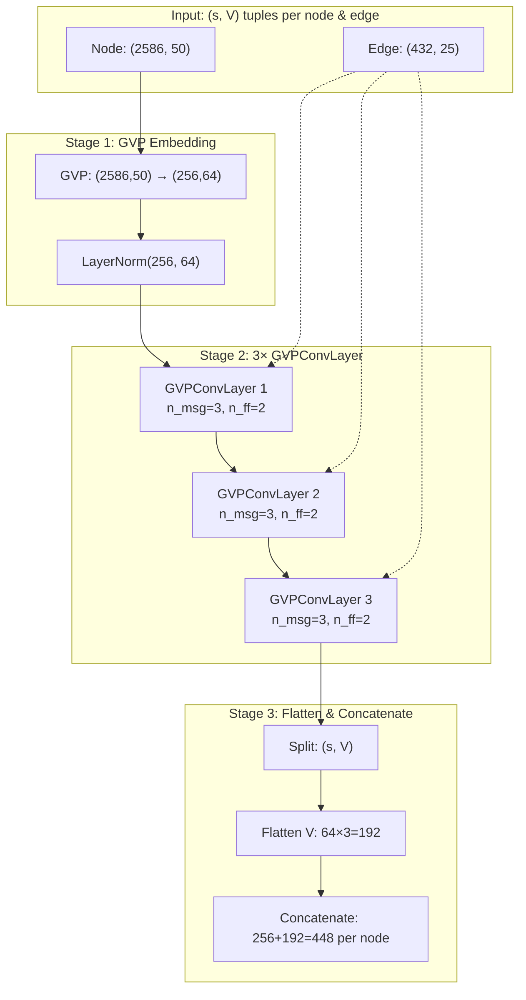
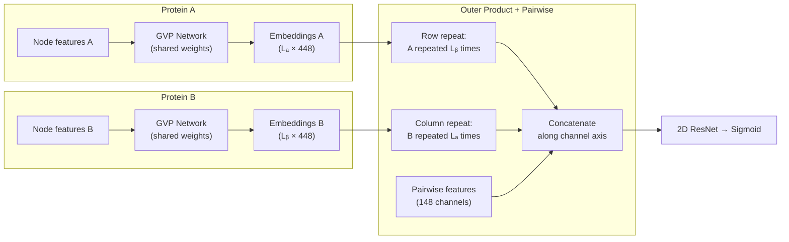

---
slug:8-gvp-graph-neural-network
blog_type:normal
---


**几何向量感知机 (GVP)** 图神经网络是 PLMGraph-Inter 的结构编码骨干。它通过等变消息传递，将蛋白质残基的旋转等变几何表示——结合了标量不变量和 3D 向量特征——转换为固定维度的节点嵌入。与仅在标量特征上运行的传统 GNN 不同，GVP 通过在所有层中维持独立的标量和向量通道，显式地保留了蛋白质骨架的几何结构，确保学习到的表示在输入坐标的旋转和平移下能够正确变换。

## 几何向量感知机：核心概念

几何向量感知机将标准感知机推广至在混合标量-向量元组 **(s, V)** 上进行运算，其中 **s** ∈ ℝⁿ 是标量不变量的堆叠，**V** ∈ ℝᵐˣ³ 是 3D 向量的堆叠。GVP 的计算方式为：

- **标量通路**：`s_out = σ(W_s · [s; ‖V₁‖; ‖V₂‖; ...; ‖Vₘ‖])` — 标量输出依赖于标量输入和向量范数
- **向量通路**：`V_out = σ_v(‖W_v · V‖) · (W_v · V)` — 向量输出由输入向量的学习线性变换产生，可选择由其范数的标量函数进行门控

此设计保证了 **SO(3) 等变性**：当输入向量被旋转 R 时，输出向量也随之旋转 R，而标量输出保持不变。本项目使用 [gvp-pytorch](https://github.com/drorlab/gvp-pytorch) 库（导入为 `gvp`），全程启用 `vector_gate=True`，这意味着向量激活是由向量范数上的学习型 sigmoid 门进行调制，而非固定的激活函数。

来源：[model.py](model.py#L11-L11)，[README.md](README.md#L10-L10)

## 图特征表示：标量-向量元组

GVP 网络接收一个异构特征图，其中每个节点和边都携带一个 **(标量, 向量)** 元组。这些元组在[几何图构建](6-geometric-graph-construction)中构造，并在[蛋白质语言模型嵌入](5-protein-language-model-embeddings)中通过蛋白质语言模型嵌入进行增强。

### 节点特征

每个残基节点由 `(nodes_scat, nodes_vec)` 表示，其组成如下：

| 特征来源 | 标量维度 | 向量维度 | 描述 |
|---|---|---|---|
| 骨架二面角 (φ, ψ, ω) | 6 | — | 三个二面角的 sin/cos 值 |
| PSSM (HHM profile) | 20 | — | 位置特异性得分矩阵 |
| ESM-1b 表示 | 1280 | — | 单序列 PLM 嵌入 |
| ESM-MSA-1b 表示 | 768 | — | 基于 MSA 的 PLM 嵌入 |
| ESM-IF1 表示 | 512 | — | 逆折叠 PLM 嵌入 |
| 局部方向 | — | 50 | 正向/反向方向向量 |
| **总计** | **2586** | **50** | `node_input_dim = (2586, 50)` |

每个节点的 50 个向量特征源自局部方向：对于每个残基，5 个骨架原子 (N, CA, C, O, Cβ) 定义了 5 个正向方向向量（指向下一个残基）和 5 个反向方向向量（指向上一个残基），每个在 5 个原子上重复，产生 25 + 25 = 50 个 ℝ³ 中的单位向量。

来源：[pdb_graph.py](pdb_graph.py#L62-L87)，[load_feature.py](load_feature.py#L42-L62)，[model.py](model.py#L160-L163)

### 边特征

每条边（连接 Cα–Cα 距离在 18Å 内的残基）携带 `(edge_scat, edge_vec)`：

| 特征来源 | 标量维度 | 向量维度 | 描述 |
|---|---|---|---|
| RBF 编码的距离 | 400 | — | 25 对原子间距离 × 16 个 RBF 中心 |
| 位置嵌入 | 32 | — | 序列间距的正弦编码 |
| 边方向向量 | — | 25 | 局部坐标系中的相对位置 |
| **总计** | **432** | **25** | `edge_input_dim = (432, 25)` |

25 个边向量特征编码了目标残基的 5 个骨架原子（重复 5 次）减去源残基的 5 个骨架原子的相对位置，所有这些均在源残基的局部旋转坐标系中表示，并进行 L2 归一化。

来源：[pdb_graph.py](pdb_graph.py#L90-L157)，[model.py](model.py#L161-L164)

## 架构：嵌入 → 消息传递 → 展平

PLMGraph-Inter 内的 GVP 模块遵循三阶段流水线：**嵌入**、**传播**、**展平**。每条蛋白质链独立地通过相同的 GVP 网络进行处理，生成随后与成对特征结合的逐残基嵌入。



### 阶段 1：节点嵌入

高维输入元组 `(2586, 50)` 通过单个 GVP 层及随后的 LayerNorm 投影为紧凑的隐藏表示 `(256, 64)`。在此阶段，标量和向量激活均被设为 `None`（线性投影），使网络能够在不受过早非线性饱和影响的情况下学习合适的特征子空间：

```python
self.embed_node = nn.Sequential(
    gvp.GVP(node_input_dim, node_hidden_dim,
            activations=(None, None), vector_gate=True),
    gvp.LayerNorm(node_hidden_dim))
```

这一设计选择——在嵌入层禁用激活——允许范数门控的向量通路在归一化之前计算纯线性的旋转等变投影，当输入向量空间（50 个向量）远大于隐藏向量空间（64 个向量）时，这一点尤为重要。

来源：[model.py](model.py#L192-L195)

### 阶段 2：等变消息传递

三个 `GVPConvLayer` 实例在残基图上执行消息传递。每一层执行一个结构化的子流水线：

| 子模块 | 数量 | 作用 |
|---|---|---|
| **消息 GVP** | 3 (`n_message=3`) | 从邻居计算等变消息 |
| **前馈 GVP** | 2 (`n_feedforward=2`) | 非线性变换聚合后的消息 |
| **Dropout** | rate=0.1 | 标量和向量通道上的正则化 |

每个 `GVPConvLayer` 的运行方式如下：
1. **消息计算**：对于每条边 (i→j)，使用 `n_message=3` 个堆叠的 GVP，根据边特征和源节点特征计算消息
2. **聚合**：对每个目标节点的所有邻居的消息求和（求和操作下保持旋转等变）
3. **更新**：通过残差连接将聚合后的消息与目标节点的当前表示结合
4. **前馈**：应用 `n_feedforward=2` 个 GVP 以增加非线性，层间应用 Dropout

`vector_gate=True` 参数确保向量输出由根据向量范数计算的学习型 sigmoid 门进行调制，提供平滑且有界的激活，同时保持等变性。

```python
self.gvp_layers = self._make_gvpconv_layer(node_hidden_dim, edge_hidden_dim, gvp_num)
# 其中 gvp_num=3，产生 3 个 GVPConvLayer 实例
```

<CgxTip>边的隐藏维度 `(432, 25)` 保持与边的输入维度相等，这意味着边特征在消息传递层中不会被压缩——它们作为计算消息的固定几何上下文，而非自身被更新。这是一个刻意的架构选择：边特征编码的是不可变的几何量（距离、方向），不应被学习到的表示所覆盖。</CgxTip>

来源：[model.py](model.py#L213-L222)

### 阶段 3：向量展平与拼接

在最终的 GVP 卷积层之后，每个节点携带一个隐藏元组 `(s, V)`，其中 `s` ∈ ℝ²⁵⁶，`V` ∈ ℝ⁶⁴ˣ³。由于下游的 2D ResNet 仅在标量特征上运算，向量分量通过将 `V` 从形状 `(64, 3)` 重塑为 `(192,)` 被**展平**为标量，随后与标量特征拼接：

```python
strucsA, strucvA = strucA                    # 分离 (标量, 向量)
nodesA = torch.hstack((strucsA, strucvA.flatten(-2,-1)))  # 256 + 192 = 448
```

这种展平操作**破坏了等变性**——这是网络从旋转等变的几何处理向旋转不变的标量预测过渡的转折点。关键洞察在于，到这一阶段时，GVP 层已经通过等变操作提取了所有几何上有意义的信息；展平后的向量现在编码了学习到的方向特征，这些特征作为特定输入方向的固定标量描述符是有用的。

来源：[model.py](model.py#L236-L240)

## 双链处理与外积拼接

GVP 网络通过相同的共享权重**独立处理每条蛋白质链**，然后通过类外积拼接将生成的逐残基嵌入与成对特征结合：



拼接函数创建了一个 `Lₐ × Lᵦ` 的接触图表示，其中每个位置 (i, j) 包含：

| 组件 | 通道数 | 内容 |
|---|---|---|
| 行重复 (来自 A) | 448 | 残基 i 的嵌入，在所有 j 上广播 |
| 列重复 (来自 B) | 448 | 残基 j 的嵌入，在所有 i 上广播 |
| 成对特征 | 148 | 残基对 (i, j) 的共进化 + 注意力特征 |
| **总输入通道数** | **1044** | 输入至 1×1 投影层 |

此设计确保 2D ResNet 同时接收**单体**信息（每个残基在结构上“看起来如何”）和**成对**信息（两个残基如何共进化或相互注意），使卷积层能够学习接触图上的空间模式。

来源：[model.py](model.py#L225-L254)，[model.py](model.py#L14-L26)

## 维度流转摘要

GVP 路径的完整维度变换总结如下：

| 阶段 | 标量维度 | 向量维度 | 总维度 (展平) | 备注 |
|---|---|---|---|---|
| 节点输入 | 2586 | 50×3=150 | 2736 | PLM + 几何特征 |
| 嵌入后 | 256 | 64×3=192 | 448 | GVP + LayerNorm |
| 3 层 GVPConvLayer 后 | 256 | 64×3=192 | 448 | 消息传递 (维度不变) |
| 展平后 | 448 | — | 448 | 向量坍缩为标量 |
| 外积拼接后 (×2 链 + p2d) | 1044 | — | 1044 | 2×448 + 148 成对特征 |
| 1×1 投影后 | 96 | — | 96 | ResNet 输入通道 |

<CgxTip>标量 (2586) 和向量 (50) 输入通道之间的不对称维度反映了一个刻意的设计原则：标量特征（PLM 嵌入、PSSM）编码了丰富的进化和语义信息，这些信息没有自然的 3D 几何解释；而向量特征则排他性地表示物理方向量。GVP 的标量通路可以在不受等变性约束的情况下摄入所有可用的标量信息，而向量通路则被限制为仅处理具有真正几何意义的特征。</CgxTip>

来源：[model.py](model.py#L160-L176)

## 与整体架构的关系

GVP 图神经网络在 PLMGraph-Inter 流水线中占据特定的生态位——它是将 3D 骨架几何转换为学习到的残基表示的**结构编码器**。它并非孤立运行：其输入依赖于[几何图构建](6-geometric-graph-construction)提供的向量/标量图特征，以及[蛋白质语言模型嵌入](5-protein-language-model-embeddings)提供的标量 PLM 维度。其输出直接馈入[特征拼接策略](10-feature-concatenation-strategy)（外积）和[用于接触图的扩张 ResNet](9-dilated-resnet-for-contact-maps)（2D 卷积解码器）。在拼接步骤中伴随 GVP 输出的成对共进化特征在[配对 MSA 与共进化](7-paired-msa-and-coevolution)中描述。