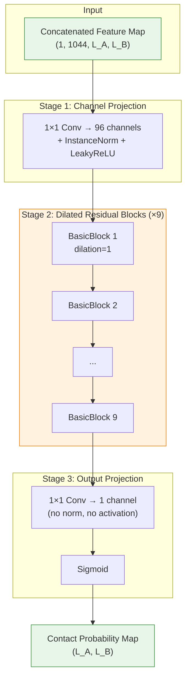
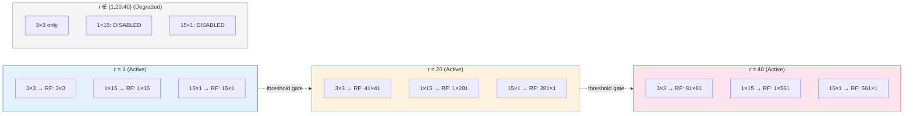
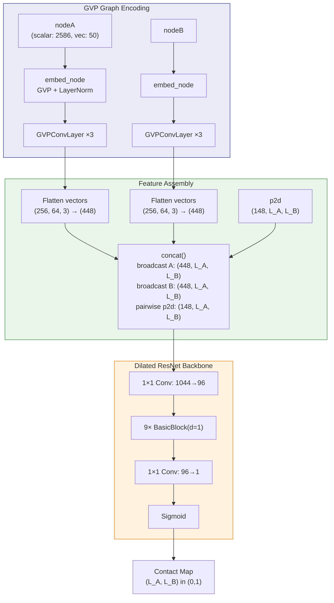

---
slug:9-dilated-resnet-for-contact-maps
blog_type:normal
---


**膨胀残差网络** 是核心的2D卷积骨干网络，负责将拼接后的逐链特征图和逐对特征图转换为蛋白质间接触概率矩阵。该网络在 L<sub>A</sub> × L<sub>B</sub> 的特征网格（其中 L<sub>A</sub> 和 L<sub>B</sub> 分别为两条链的残基数量）上进行操作，应用多尺度膨胀残差卷积来捕获局部和长距离的空间模式，这对于识别蛋白质间接触至关重要。本页面详细解释了其架构、多核膨胀策略，以及该残差网络如何与GVP图编码器和特征拼接管线集成。

来源: [model.py](/model.py#L1-L261), [predict.py](/predict.py#L175-L200)

## 架构概述

膨胀残差网络遵循三阶段设计：**投影 → 残差优化 → 输出投影**。输入是由 `concat` 函数从GVP编码的节点特征和逐对共演化特征组装而成的形状为 `(1, C_in, L_A, L_B)` 的4D张量。首先，1×1卷积将高维输入通道降维至紧凑的96通道表示。随后，9个 `BasicBlock` 残差单元通过膨胀多核卷积优化该表示。最后，1×1卷积将96个通道压缩为单通道，并通过Sigmoid激活函数生成逐残基对的接触概率。



工厂函数 `resnet18()` 将网络实例化为 `ResNet(blocks_num=9, gvp_num=3)`，在隐藏层中生成9个BasicBlock，以及3个用于图编码的GVP卷积层。

来源: [model.py](/model.py#L155-L259)

## BasicBlock：多核膨胀残差单元

`BasicBlock` 是残差网络的基础构建块。每个块实现了一个带有跳跃连接的**多分支膨胀卷积**。该设计基于以下原则：蛋白质间接触在多种空间尺度上展现模式——短距离接触得益于标准的3×3卷积核，而长距离接触则能更好地被带有膨胀的细长1×15和15×1卷积核捕获。

### 分支结构

每个 `BasicBlock` 始终包含一个**3×3膨胀卷积分支** (`conv_3x3`)。当膨胀率处于**阈值集合** `{1, 20, 40}` 内时，将激活两个额外分支：

| 分支 | 卷积核尺寸 | 填充 | 膨胀模式 | 感受野 |
|--------|-----------|---------|-----------------|----------------|
| `conv_3x3` | (3, 3) | (1, 1) | (r, r) | (2r+1) × (2r+1) |
| `conv_1xn` | (1, 15) | (0, 7r) | (1, r) | 1 × (14r+1) |
| `conv_nx1` | (15, 1) | (7r, 0) | (r, 1) | (14r+1) × 1 |

其中 **r** 为膨胀率。当 r=1 时，感受野分别为 3×3、1×15 和 15×1。当 r=20 时，它们将急剧扩展至 41×41、1×281 和 281×1，使得网络能够在不引发参数爆炸的情况下感知大范围的模式。

### 分支聚合

三个分支通过**逐元素相加**进行组合（默认的 `self.concatenate = False` 模式）：

```
identity = conv_3x3(x) + conv_1xn(x) + conv_nx1(x)
```

代码中还定义了另一种拼接模式（`self.concatenate = True`），但在默认配置中未激活。启用时，该模式会沿通道维度拼接三个分支的输出，并应用1×1卷积将其融合回 `out_channels`。

### 残差连接

该块以恒等跳跃连接和非线性激活结束：

```
out = x + identity
out = LeakyReLU(out)
```

这确保了梯度在网络中的流动，并稳定了深度9块堆栈的训练。

来源: [model.py](/model.py#L79-L152)

## 双卷积子块：`make_conv_layer`

`BasicBlock` 中的每个分支均由 `make_conv_layer` 构建，该函数组装了一个**双卷积序列**，并在两次卷积之间可选地插入归一化和激活操作：

```
Conv2d → [InstanceNorm2d] → [LeakyReLU] → Conv2d → [InstanceNorm2d]
```

关键实现细节：

- **InstanceNorm2d** 在应用时使用了 `momentum=0.1`、`affine=True`（可学习的缩放/偏移）和 `track_running_stats=False`（仅使用实例级统计量，不进行运行估计）。这对于尺寸可变的接触图至关重要，因为在此类场景下批次级统计量是不可靠的。
- **LeakyReLU** 使用了 `negative_slope=0.01`，为负输入提供微小梯度以防止神经元死亡。
- 所有卷积均**无偏置** (`bias=False`)，这是后接归一化层时的标准做法。
- 最终配置中**未应用dropout**（`Dropout2d` 代码行已被注释掉）。

来源: [model.py](/model.py#L29-L56)

## 1×1 投影层：`make_1x1_layer`

`make_1x1_layer` 函数构建了用于输入投影和输出投影阶段的逐点卷积块。与 `make_conv_layer` 不同，它仅应用**单次卷积**而非双卷积：

```
Conv2d(1×1) → [InstanceNorm2d] → [LeakyReLU]
```

输入投影层（阶段1）将1044个输入通道映射到96个隐藏通道，并启用InstanceNorm和LeakyReLU。输出投影层（阶段3）将96个通道映射到1个通道，并**禁用归一化和激活**（`non_linearity=False, instance_norm=False`），生成随后在 `ResNet` 层级传入Sigmoid函数的原始logit。

来源: [model.py](/model.py#L59-L77), [model.py](/model.py#L170-L187)

## 膨胀率策略与感受野分析

膨胀率控制着每次卷积的有效感受野，使得网络能够在不增加参数量的情况下捕获不同尺度的模式。该架构采用了**阈值门控膨胀**机制：仅当膨胀率属于集合 `{1, 20, 40}` 时，才会实例化细长的1×15和15×1分支。



### 默认配置

`resnet18()` 工厂函数创建了一个隐藏层，所有9个BasicBlock的 `dilated_rate=1`。在此配置下，每个块均使用单位膨胀的三个卷积核分支，产生的感受野分别为 3×3、1×15 和 15×1。**组合感受野**随深度增加——经过9个块后，仅3×3分支即可实现19×19的有效感受野，而细长卷积核则提供了各向异性覆盖，与此各向同性感受野形成互补。

### 为何使用细长卷积核？

蛋白质间接触常沿接触图的一个维度形成**条纹模式**——例如，链A的β-链与链B的β-片层接触会产生对角条纹。1×15和15×1卷积核专为检测这类细长的接触模式而设计。结合膨胀操作，它们能够在不引起参数量成比例增长的情况下，捕获跨越数百个残基的条纹。

<CgxTip>膨胀率的阈值集合 {1, 20, 40} 在架构上具有重要意义：它定义了激活多尺度细长卷积核的确切膨胀值。虽然默认的 `resnet18()` 专使用 r=1，但底层基础设施支持异构膨胀调度——例如，跨层使用渐进式膨胀 (1, 20, 40) 以在残差块内构建空洞空间金字塔。</CgxTip>

来源: [model.py](/model.py#L79-L117), [model.py](/L203-L210)

## 完整前向传播：从图特征到接触图

`ResNet.forward` 方法编排了从GVP编码的结构特征到最终接触概率图的完整管线：



### 逐步数据流

1. **GVP嵌入**：每条链的节点特征通过 `embed_node`（一个将 (2586, 50) → (256, 64) 映射并设置 `vector_gate=True` 的GVP映射）处理，随后进行 `LayerNorm`。
2. **GVP消息传递**：3轮 `GVPConvLayer` 为每条链独立地沿几何图边传播信息。
3. **向量展平**：GVP输出 `(标量: 256, 向量: 64×3)` 通过 `torch.hstack((strucsA, strucvA.flatten(-2,-1)))` 被展平为448维的逐节点特征。
4. **2D特征组装**：`concat` 函数将链A特征沿行广播，链B特征沿列广播，然后与148通道的逐对特征拼接，生成 (1, 1044, L<sub>A</sub>, L<sub>B</sub>) 的输入张量。
5. **残差网络处理**：1×1投影、9个BasicBlock和输出投影对特征图进行优化。
6. **概率输出**：Sigmoid激活生成最终的 L<sub>A</sub> × L<sub>B</sub> 接触概率图。

### 通道维度推导

**1044** 的输入通道数计算如下：

| 组件 | 公式 | 通道数 |
|-----------|---------|----------|
| 链A节点 (标量) | 1 × 256 | 256 |
| 链A节点 (向量) | 1 × 64 × 3 | 192 |
| 链B节点 (标量) | 1 × 256 | 256 |
| 链B节点 (向量) | 1 × 64 × 3 | 192 |
| 逐对特征 (共演化 + 注意力) | 1 × (144 + 4) | 148 |
| **总计** | **2 × (256 + 192) + 148** | **1044** |

148通道的逐对特征包含 CCMpred (1通道)、alnstats (3通道) 和 MSA-1b 注意力 (144通道 = 12头 × 12层)。

来源: [model.py](/model.py#L155-L254), [model.py](/model.py#L14-L26)

## 权重初始化

网络中所有的 `Conv2d` 层均使用**Kaiming正态初始化**（He初始化）进行初始化，其参数针对LeakyReLU进行了校准：

```python
nn.init.kaiming_normal_(m.weight, a=0.01, mode='fan_in', nonlinearity='leaky_relu')
```

`a=0.01` 参数与整个网络中LeakyReLU激活函数的 `negative_slope` 相匹配。`fan_in` 模式在前向传播过程中保留了输入方差的幅度，这是使用ReLU族激活函数网络的推荐策略。

<CgxTip>Kaiming初始化使用 `mode='fan_in'`，其中 `a=0.01` 与LeakyReLU的负斜率相匹配。这对于9块残差堆栈至关重要——若没有适当的方差缩放，通过重复的 `x + identity` 加法累积的信号将在深度方向上消失或爆炸。</CgxTip>

来源: [model.py](/model.py#L199-L201)

## 具有跨链对称性的推理

在预测阶段，残差网络以**对称集成**的方式应用，利用了链顺序的可互换性。对于7个交叉验证模型中的每一个，会进行两次预测：

1. **A→B 方向**：`model(nodeA, edgeA, edge_indexA, nodeB, edgeB, edge_indexB, rt_p2d)` —— 使用“原始”逐对特征
2. **B→A 方向**：`model(nodeB, edgeB, edge_indexB, nodeA, edgeA, edge_indexA, sw_p2d)` —— 使用“交换”的逐对特征，并将结果转置

这14次预测的结果被求和以生成最终的接触图。这种对称化减少了预测方差，并确保链A残基i与链B残基j之间的接触概率能够综合来自特征对两种方向的信息。

来源: [predict.py](/predict.py#L176-L200)

## 架构设计原理

用于接触图的膨胀残差网络体现了多项区别于标准图像分类残差网络的设计原则：

| 设计选择 | 原理 |
|---------------|-----------|
| **InstanceNorm 优于 BatchNorm** | 接触图具有可变尺寸 (L<sub>A</sub> × L<sub>B</sub>)；批次级统计量在不同尺寸的输入间毫无意义 |
| **各向异性卷积核 (1×15, 15×1)** | 蛋白质间接触形成细长模式（β-链配对、螺旋-螺旋堆叠），仅靠各向同性的3×3卷积核难以有效捕获 |
| **膨胀阈值门控** | 防止在无用的膨胀率下进行不必要的参数分配；三个激活的膨胀率 {1, 20, 40} 提供了几何级数间隔的感受野 |
| **无步幅 / 池化** | 接触预测需要密集的逐像素输出——任何空间下采样都会破坏特征图位置与残基对之间的一一对应关系 |
| **1×1 输入投影** | 1044通道的输入是不同尺度特征的异构拼接；一种可学习的投影在空间处理前对它们进行线性融合 |
| **9个浅层块优于较少的深层块** | 每个BasicBlock在每个分支包含2次卷积（r=1时每块共6次），产生54个卷积层——残差连接确保了在此深度下梯度流的稳定 |

来源: [model.py](/model.py#L29-L259)

## 与其他组件的关系

膨胀残差网络位于PLMGraph-Inter管线的核心。它接收来自[特征拼接策略](10-feature-concatenation-strategy)的预处理输入（通过 `concat` 函数将GVP编码的节点特征与逐对共演化特征相结合），其权重通过[训练与损失设计](12-training-and-loss-design)中的加权交叉熵 `ppi_loss` 进行优化。输入残差网络的GVP节点嵌入由[GVP图神经网络](8-gvp-graph-neural-network)生成，最终的集成预测遵循[交叉验证集成](13-cross-validation-ensemble)中描述的协议。