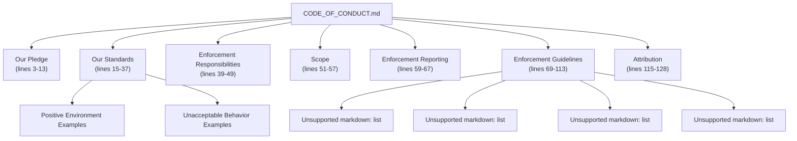
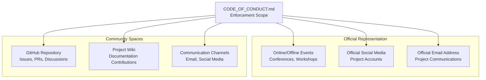
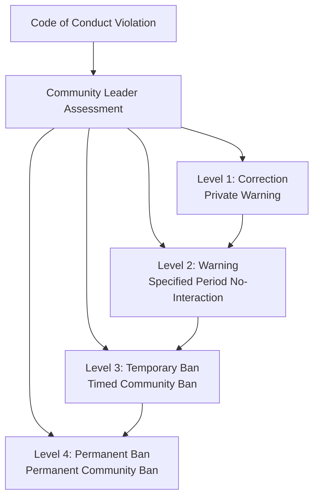
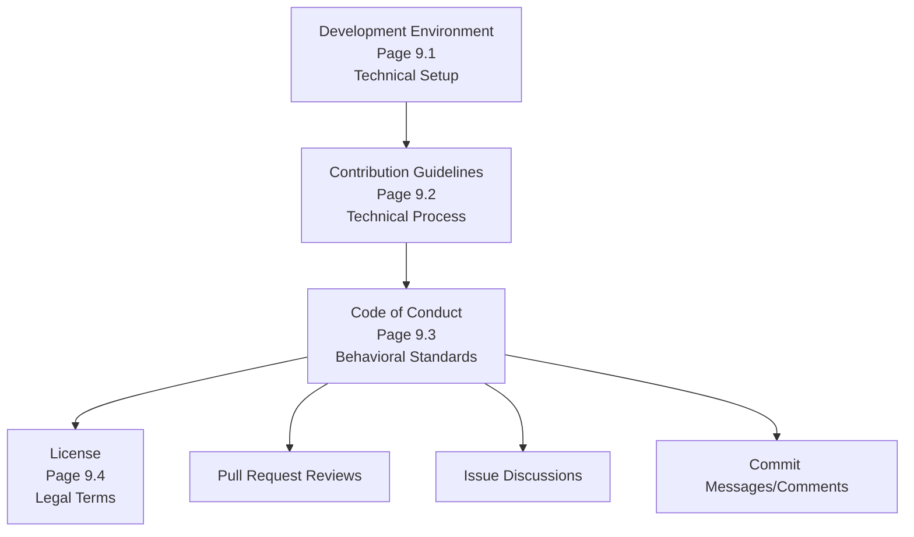

# Code of Conduct

> **Relevant source files**
> * [CODE_OF_CONDUCT.md](https://github.com/PeptoneLtd/PepTron/blob/8123ab15/CODE_OF_CONDUCT.md?plain=1)

**Purpose**: This document defines community standards, behavioral expectations, and enforcement procedures for contributors to the PepTron project. The Code of Conduct applies to all project spaces including GitHub repositories, issues, pull requests, discussions, and official communication channels.

For information about technical contribution procedures, see [Contribution Guidelines](/PeptoneLtd/PepTron/9.2-contribution-guidelines). For licensing terms, see [License](/PeptoneLtd/PepTron/9.4-license).

---

## Overview

The PepTron project adopts the Contributor Covenant Code of Conduct version 2.0 to ensure a harassment-free, welcoming environment for all participants. This standard establishes baseline behavioral expectations and provides a transparent enforcement process for violations.

The document is located at [CODE_OF_CONDUCT.md L1-L128](https://github.com/PeptoneLtd/PepTron/blob/8123ab15/CODE_OF_CONDUCT.md?plain=1#L1-L128)

 in the repository root.

**Sources**: [CODE_OF_CONDUCT.md L1-L128](https://github.com/PeptoneLtd/PepTron/blob/8123ab15/CODE_OF_CONDUCT.md?plain=1#L1-L128)

---

## Pledge and Commitment

The project pledges to make participation harassment-free regardless of personal characteristics including age, disability, ethnicity, gender identity, experience level, education, socio-economic status, nationality, appearance, race, religion, or sexual identity.

The community commits to acting in ways that contribute to an open, welcoming, diverse, inclusive, and healthy environment.

**Key Principle**: Focus on what is best for the overall community, not just individual preferences.

**Sources**: [CODE_OF_CONDUCT.md L3-L13](https://github.com/PeptoneLtd/PepTron/blob/8123ab15/CODE_OF_CONDUCT.md?plain=1#L3-L13)

---

## Behavioral Standards

### Positive Behaviors

The following behaviors contribute to a positive community environment:

| Behavior | Description |
| --- | --- |
| **Empathy and Kindness** | Demonstrating consideration toward other people in all interactions |
| **Respect for Differences** | Being respectful of differing opinions, viewpoints, and experiences |
| **Constructive Feedback** | Giving and gracefully accepting constructive criticism |
| **Accountability** | Accepting responsibility and apologizing to those affected by mistakes |
| **Learning Orientation** | Learning from experiences and focusing on improvement |
| **Community Focus** | Prioritizing what is best for the overall community |

**Sources**: [CODE_OF_CONDUCT.md L17-L26](https://github.com/PeptoneLtd/PepTron/blob/8123ab15/CODE_OF_CONDUCT.md?plain=1#L17-L26)

### Unacceptable Behaviors

The following behaviors are explicitly prohibited:

| Violation Type | Examples |
| --- | --- |
| **Sexual Misconduct** | Use of sexualized language or imagery, sexual attention or advances of any kind |
| **Harassment** | Trolling, insulting or derogatory comments, personal or political attacks |
| **Privacy Violations** | Publishing others' private information (physical address, email) without explicit permission |
| **Professional Misconduct** | Other conduct reasonably considered inappropriate in a professional setting |

**Sources**: [CODE_OF_CONDUCT.md L28-L37](https://github.com/PeptoneLtd/PepTron/blob/8123ab15/CODE_OF_CONDUCT.md?plain=1#L28-L37)

---

## Enforcement Responsibilities

Community leaders are responsible for:

1. **Clarifying Standards**: Interpreting and communicating acceptable behavior standards
2. **Enforcement**: Taking appropriate corrective action in response to violations
3. **Content Moderation**: Removing, editing, or rejecting contributions not aligned with the Code of Conduct
4. **Transparency**: Communicating reasons for moderation decisions when appropriate

Community leaders have the authority to moderate comments, commits, code, wiki edits, issues, and other contributions.

**Sources**: [CODE_OF_CONDUCT.md L39-L49](https://github.com/PeptoneLtd/PepTron/blob/8123ab15/CODE_OF_CONDUCT.md?plain=1#L39-L49)

---

## Scope of Application

The Code of Conduct applies in the following contexts:

The Code of Conduct applies within all community spaces and when individuals officially represent the project in public spaces.

**Sources**: [CODE_OF_CONDUCT.md L51-L57](https://github.com/PeptoneLtd/PepTron/blob/8123ab15/CODE_OF_CONDUCT.md?plain=1#L51-L57)

---

## Reporting Violations

### Contact Information

Instances of abusive, harassing, or otherwise unacceptable behavior should be reported to:

* **Email**: `carlo@peptone.io`

### Reporting Process Guarantees

1. **Prompt Review**: All complaints will be reviewed and investigated promptly and fairly
2. **Privacy**: Community leaders are obligated to respect the privacy and security of the reporter
3. **Confidentiality**: Reporter identity is protected unless disclosure is required for enforcement

**Sources**: [CODE_OF_CONDUCT.md L59-L67](https://github.com/PeptoneLtd/PepTron/blob/8123ab15/CODE_OF_CONDUCT.md?plain=1#L59-L67)

---

## Enforcement Guidelines

Community leaders follow a four-level escalation ladder based on Community Impact Guidelines:

**Sources**: [CODE_OF_CONDUCT.md L69-L113](https://github.com/PeptoneLtd/PepTron/blob/8123ab15/CODE_OF_CONDUCT.md?plain=1#L69-L113)

### Enforcement Level Details

| Level | Community Impact | Consequence | Escalation Risk |
| --- | --- | --- | --- |
| **1. Correction** | Use of inappropriate language or unprofessional behavior | Private written warning from leaders; clarity on violation nature; possible public apology request | Continued behavior leads to Level 2 |
| **2. Warning** | Single incident or series of actions violating standards | No interaction with involved parties for specified period; includes community spaces and external channels (social media) | Violating terms leads to temporary or permanent ban |
| **3. Temporary Ban** | Serious violation including sustained inappropriate behavior | Temporary ban from interaction/communication for specified period; no public or private interaction with involved parties | Violating terms leads to permanent ban |
| **4. Permanent Ban** | Pattern of violations, sustained inappropriate behavior, harassment, or disparagement of groups | Permanent ban from all public interaction within the community | Final enforcement level |

**Key Enforcement Principle**: No interaction with people involved or those enforcing the Code of Conduct during warning/ban periods. Violations of these terms result in escalation.

**Sources**: [CODE_OF_CONDUCT.md L74-L113](https://github.com/PeptoneLtd/PepTron/blob/8123ab15/CODE_OF_CONDUCT.md?plain=1#L74-L113)

---

## Attribution and Resources

The PepTron Code of Conduct is adapted from the Contributor Covenant version 2.0:

* **Source Document**: [https://www.contributor-covenant.org/version/2/0/code_of_conduct.html](https://www.contributor-covenant.org/version/2/0/code_of_conduct.html)
* **Enforcement Guidelines Inspiration**: Mozilla's code of conduct enforcement ladder
* **FAQ**: [https://www.contributor-covenant.org/faq](https://www.contributor-covenant.org/faq)
* **Translations**: [https://www.contributor-covenant.org/translations](https://www.contributor-covenant.org/translations)

This is a widely adopted standard used across thousands of open source projects to establish baseline community expectations.

**Sources**: [CODE_OF_CONDUCT.md L115-L128](https://github.com/PeptoneLtd/PepTron/blob/8123ab15/CODE_OF_CONDUCT.md?plain=1#L115-L128)

---

## Integration with Development Workflow

The Code of Conduct integrates with other development documentation:

* For technical setup procedures, see [Development Environment](/PeptoneLtd/PepTron/9.1-development-environment)
* For code contribution procedures, see [Contribution Guidelines](/PeptoneLtd/PepTron/9.2-contribution-guidelines)
* For legal terms, see [License](/PeptoneLtd/PepTron/9.4-license)

**Sources**: [CODE_OF_CONDUCT.md L1-L128](https://github.com/PeptoneLtd/PepTron/blob/8123ab15/CODE_OF_CONDUCT.md?plain=1#L1-L128)