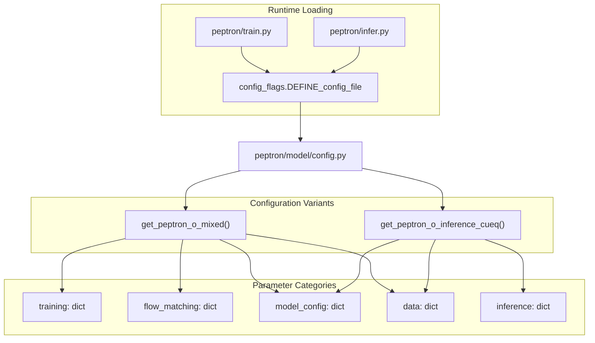
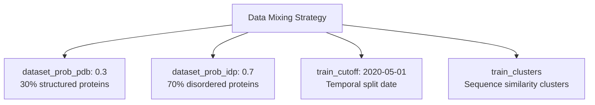
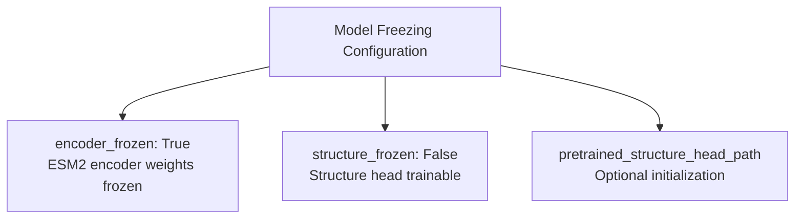
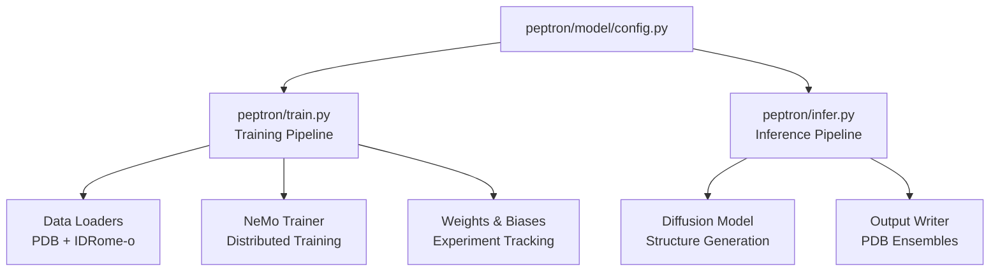

# Configuration System

> **Relevant source files**
> * [README.md](https://github.com/PeptoneLtd/PepTron/blob/8123ab15/README.md?plain=1)

## Purpose and Scope

This document describes PepTron's centralized configuration system, which manages all parameters for both training and inference workflows through a single `config.py` file. The configuration system uses Python's ML Collections library with config flags to define multiple configuration variants that can be selected at runtime.

For information about specific training parameters and their effects, see [Training Configuration](/PeptoneLtd/PepTron/5.1-training-configuration). For inference-specific parameter tuning, see [Inference Configuration](/PeptoneLtd/PepTron/6.1-inference-configuration).

**Sources:** [README.md L1-L263](https://github.com/PeptoneLtd/PepTron/blob/8123ab15/README.md?plain=1#L1-L263)

---

## Configuration System Architecture

PepTron implements a hierarchical, variant-based configuration system where all parameters are centralized in a single file but organized into multiple named configurations for different use cases.

### Configuration File Structure



**Sources:** [README.md L41-L46](https://github.com/PeptoneLtd/PepTron/blob/8123ab15/README.md?plain=1#L41-L46)

 [README.md L110-L113](https://github.com/PeptoneLtd/PepTron/blob/8123ab15/README.md?plain=1#L110-L113)

### Configuration Loading Mechanism

The configuration system is loaded using the `ml_collections.config_flags` module, which allows selection of specific configuration variants by name:

**Training Configuration Selection:**

```markdown
# In peptron/train.pyEXEC_CONFIG = config_flags.DEFINE_config_file(    'config',     'peptron/model/config.py:peptron_o_mixed')
```

**Inference Configuration Selection:**

```markdown
# In peptron/infer.pyEXEC_CONFIG = config_flags.DEFINE_config_file(    'config',     'peptron/model/config.py:peptron_o_inference_cueq')
```

The syntax `filename:function_name` specifies both the configuration file path and the getter function that returns the desired configuration variant.

**Sources:** [README.md L110-L113](https://github.com/PeptoneLtd/PepTron/blob/8123ab15/README.md?plain=1#L110-L113)

 [README.md L41-L46](https://github.com/PeptoneLtd/PepTron/blob/8123ab15/README.md?plain=1#L41-L46)

---

## Configuration Variants

PepTron provides two primary configuration variants, each optimized for different workflows:

### Configuration Variant Comparison

| Variant | Function Name | Primary Use Case | Key Characteristics |
| --- | --- | --- | --- |
| `peptron_o_mixed` | `get_peptron_o_mixed()` | Training with mixed PDB and IDRome-o datasets | Includes training parameters, data mixing ratios, freezing settings |
| `peptron_o_inference_cueq` | `get_peptron_o_inference_cueq()` | Inference/structure generation | Includes sampling parameters, GPU allocation, batch sizing |

**Sources:** [README.md L41-L46](https://github.com/PeptoneLtd/PepTron/blob/8123ab15/README.md?plain=1#L41-L46)

 [README.md L110-L113](https://github.com/PeptoneLtd/PepTron/blob/8123ab15/README.md?plain=1#L110-L113)

---

## Training Configuration Parameters

The training configuration (`peptron_o_mixed`) contains all parameters necessary for model training, organized into logical sections.

### Training Configuration Structure

```mermaid
flowchart TD

ExpConfig["Experiment Configuration"]
CompConfig["Compute Configuration"]
DataPaths["Data Paths"]
DataMixing["Data Mixing Strategy"]
ModelFreezing["Model Freezing"]
experiment_dir["experiment_dir"]
wandb_project["wandb_project"]
experiment_name["experiment_name"]
num_nodes["num_nodes"]
devices["devices"]
micro_batch_size["micro_batch_size"]
precision["precision"]
train_data_dir_pdb["train_data_dir_pdb"]
train_data_dir_idp["train_data_dir_idp"]
train_msa_dir_pdb["train_msa_dir_pdb"]
train_msa_dir_idp["train_msa_dir_idp"]
dataset_prob_pdb["dataset_prob_pdb: 0.3"]
dataset_prob_idp["dataset_prob_idp: 0.7"]
encoder_frozen["encoder_frozen: True"]
structure_frozen["structure_frozen: False"]

ExpConfig --> experiment_dir
ExpConfig --> wandb_project
ExpConfig --> experiment_name
CompConfig --> num_nodes
CompConfig --> devices
CompConfig --> micro_batch_size
CompConfig --> precision
DataPaths --> train_data_dir_pdb
DataPaths --> train_data_dir_idp
DataPaths --> train_msa_dir_pdb
DataPaths --> train_msa_dir_idp
DataMixing --> dataset_prob_pdb
DataMixing --> dataset_prob_idp
ModelFreezing --> encoder_frozen
ModelFreezing --> structure_frozen

subgraph subGraph0 ["training dictionary"]
    ExpConfig
    CompConfig
    DataPaths
    DataMixing
    ModelFreezing
end
```



### Core Training Parameters

| Parameter | Type | Purpose | Default/Example |
| --- | --- | --- | --- |
| `experiment_dir` | string | Directory for saving checkpoints and logs | `/path/to/experiment/dir` |
| `wandb_project` | string | Weights & Biases project name | `peptron-stable` |
| `experiment_name` | string | Name for the training run | `your-experiment-name` |
| `n_steps_train` | int | Total number of training steps | `2500` |
| `warmup_steps_percentage` | float | Percentage of steps for learning rate warmup | `0.10` |
| `train_epoch_len` | int | Number of batches per training epoch | `80000` |
| `val_epoch_len` | int | Number of batches per validation epoch | `5` |

**Sources:** [README.md L119-L162](https://github.com/PeptoneLtd/PepTron/blob/8123ab15/README.md?plain=1#L119-L162)

### Compute Configuration Parameters

| Parameter | Type | Purpose | Default/Example |
| --- | --- | --- | --- |
| `num_nodes` | int | Number of compute nodes for distributed training | `1` |
| `devices` | int | Number of GPUs per node | `8` |
| `micro_batch_size` | int | Batch size per GPU | `8` |
| `tensor_model_parallel_size` | int | Tensor parallelism degree | `1` |
| `pipeline_model_parallel_size` | int | Pipeline parallelism degree | `1` |
| `accumulate_grad_batches` | int | Gradient accumulation steps | `1` |
| `precision` | string | Training precision mode | `bf16-mixed` |

**Sources:** [README.md L119-L162](https://github.com/PeptoneLtd/PepTron/blob/8123ab15/README.md?plain=1#L119-L162)

### Data Path Configuration

The training configuration requires separate paths for PDB and IDRome-o datasets:

| Parameter | Purpose |
| --- | --- |
| `train_data_dir_pdb` | Directory containing PDB NPZ files |
| `val_data_dir_pdb` | Directory containing PDB validation NPZ files |
| `train_msa_dir_pdb` | Directory containing PDB MSA files |
| `val_msa_dir_pdb` | Directory containing validation MSA files (e.g., CAMEO2022) |
| `train_chains_pdb` | CSV file listing PDB training chains |
| `valid_chains_pdb` | CSV file listing PDB validation chains |
| `train_data_dir_idp` | Directory containing IDRome-o NPZ files |
| `train_msa_dir_idp` | Directory containing IDRome-o MSA files |
| `train_chains_idp` | CSV file listing IDRome-o training chains |
| `mmcif_dir` | Directory containing raw mmCIF files |
| `train_clusters` | Path to sequence clustering file |

**Sources:** [README.md L140-L157](https://github.com/PeptoneLtd/PepTron/blob/8123ab15/README.md?plain=1#L140-L157)

### Data Mixing Strategy Parameters



| Parameter | Type | Purpose | Default |
| --- | --- | --- | --- |
| `dataset_prob_pdb` | float | Probability of sampling from PDB dataset | `0.3` |
| `dataset_prob_idp` | float | Probability of sampling from IDRome-o dataset | `0.7` |
| `train_cutoff` | string | Temporal cutoff date for train/val split | `2020-05-01` |
| `train_clusters` | string | Path to sequence clustering file for avoiding leakage | `/path/to/pdb_clusters` |

For detailed information on the data mixing strategy rationale, see [Data Mixing Strategy](/PeptoneLtd/PepTron/5.2-data-mixing-strategy).

**Sources:** [README.md L154-L157](https://github.com/PeptoneLtd/PepTron/blob/8123ab15/README.md?plain=1#L154-L157)

### Model Freezing Parameters



| Parameter | Type | Purpose | Default |
| --- | --- | --- | --- |
| `encoder_frozen` | bool | Whether to freeze the encoder during training | `True` |
| `structure_frozen` | bool | Whether to freeze the structure head during training | `False` |
| `pretrained_structure_head_path` | string | Optional path to pretrained structure head weights | `""` |

The typical configuration freezes the encoder (ESM2) while training the structure head, enabling efficient fine-tuning on new datasets.

**Sources:** [README.md L159-L161](https://github.com/PeptoneLtd/PepTron/blob/8123ab15/README.md?plain=1#L159-L161)

### Checkpoint Management Parameters

| Parameter | Type | Purpose | Default |
| --- | --- | --- | --- |
| `steps_to_save_ckpt` | int | Frequency of checkpoint saving (in steps) | `100` |
| `val_check_interval` | int | Frequency of validation runs (in steps) | `100` |
| `limit_val_batches` | int | Number of validation batches to run | `3` |
| `initial_nemo_ckpt_path` | string | Path to initial checkpoint for resuming/fine-tuning | `/path/to/checkpoint` |

**Sources:** [README.md L134-L138](https://github.com/PeptoneLtd/PepTron/blob/8123ab15/README.md?plain=1#L134-L138)

---

## Inference Configuration Parameters

The inference configuration (`peptron_o_inference_cueq`) contains parameters specific to ensemble generation and structure sampling.

### Inference Parameter Structure


### Key Inference Parameters

| Parameter | Type | Purpose | Default | Notes |
| --- | --- | --- | --- | --- |
| `samples` | int | Number of ensemble conformations to generate | `10` | Total ensemble size per protein |
| `steps` | int | Number of diffusion denoising steps | `10` | More steps = higher quality, slower |
| `max_batch_size` | int | Number of structures generated in parallel | `1` | Increase for faster generation if GPU memory allows |
| `num_gpus` | int | Number of GPUs to use during inference | `1` | Must be ≤ number of sequences in CSV file |

**Sources:** [README.md L177-L191](https://github.com/PeptoneLtd/PepTron/blob/8123ab15/README.md?plain=1#L177-L191)

### Memory Management Considerations

The relationship between `max_batch_size` and GPU memory:

| Sequence Length | Recommended `max_batch_size` | GPU Memory |
| --- | --- | --- |
| < 200 residues | 4-8 | 40GB (A100) |
| 200-400 residues | 2-4 | 40GB (A100) |
| 400-800 residues | 1-2 | 40GB (A100) |
| > 800 residues | 1 | 40GB (A100) |

**Important:** The default `max_batch_size=1` is a conservative setting to avoid out-of-memory errors. Users are encouraged to increase this parameter based on their GPU memory and maximum sequence length for faster ensemble generation.

**Sources:** [README.md L188-L190](https://github.com/PeptoneLtd/PepTron/blob/8123ab15/README.md?plain=1#L188-L190)

### GPU Allocation Constraint

The `num_gpus` parameter has a constraint: it must be less than or equal to the number of sequences in the input CSV file. This is because PepTron distributes sequences across GPUs, with each GPU processing at least one complete sequence.

**Sources:** [README.md L186](https://github.com/PeptoneLtd/PepTron/blob/8123ab15/README.md?plain=1#L186-L186)

---

## Flow Matching Configuration

The flow matching configuration controls the diffusion process during training:

| Parameter | Type | Purpose | Typical Value |
| --- | --- | --- | --- |
| `noise_prob` | float | Probability of adding noise during training | Configuration-dependent |
| `self_cond_prob` | float | Self-conditioning probability | Configuration-dependent |

**Sources:** [README.md L196-L198](https://github.com/PeptoneLtd/PepTron/blob/8123ab15/README.md?plain=1#L196-L198)

---

## Configuration Best Practices

### Training Configuration Guidelines

1. **Start with Conservative Settings:** * Keep `micro_batch_size=1` initially to avoid memory issues * Use default parallelism settings (`tensor_model_parallel_size=1`, `pipeline_model_parallel_size=1`) * Monitor GPU utilization and increase batch size if memory allows
2. **Data Path Verification:** * Ensure all data paths exist before starting training * Verify CSV files contain valid entries with correct column names * Check that MSA directories contain files in expected `.a3m` format
3. **Checkpoint Management:** * Set `experiment_dir` to a location with sufficient disk space * Use descriptive `experiment_name` values for easy identification * Consider checkpoint frequency vs. disk space trade-offs with `steps_to_save_ckpt`

**Sources:** [README.md L211-L225](https://github.com/PeptoneLtd/PepTron/blob/8123ab15/README.md?plain=1#L211-L225)

### Inference Configuration Guidelines

1. **Memory Optimization:** * Start with `max_batch_size=1` for unknown sequence lengths * Gradually increase `max_batch_size` based on GPU memory availability * Monitor GPU memory usage during initial runs
2. **Quality vs. Speed Trade-offs:** * Increase `steps` for higher quality at the cost of speed * Increase `samples` for larger ensembles * Balance `max_batch_size` and `samples` based on total generation time requirements
3. **Multi-GPU Considerations:** * Set `num_gpus` to match available hardware * Ensure input CSV has at least `num_gpus` sequences * Distribute long sequences across multiple GPUs for better load balancing

**Sources:** [README.md L177-L191](https://github.com/PeptoneLtd/PepTron/blob/8123ab15/README.md?plain=1#L177-L191)

---

## Configuration File Location and Modification

The centralized configuration file is located at `peptron/model/config.py`. This file contains all configuration getter functions that return `ml_collections.ConfigDict` objects.

### Modifying Configurations

To modify configurations:

1. **Edit Configuration Values:** Directly modify parameter values in the getter function (e.g., `get_peptron_o_mixed()`)
2. **Create New Variants:** Define new getter functions following the existing pattern
3. **Select Variant at Runtime:** Update the `DEFINE_config_file` call in `train.py` or `infer.py` to reference your variant

```python
# Example: Creating a custom training configurationdef get_custom_training_config():    config = get_peptron_o_mixed()  # Start from base config    config.training.n_steps_train = 5000  # Modify specific parameters    config.training.micro_batch_size = 16    return config
```

**Sources:** [README.md L110-L113](https://github.com/PeptoneLtd/PepTron/blob/8123ab15/README.md?plain=1#L110-L113)

 [README.md L41-L46](https://github.com/PeptoneLtd/PepTron/blob/8123ab15/README.md?plain=1#L41-L46)

---

## Troubleshooting Configuration Issues

### Common Configuration Errors

| Issue | Cause | Solution |
| --- | --- | --- |
| Checkpoint Loading Error | Incompatible `initial_nemo_ckpt_path` | Verify checkpoint compatibility with model configuration |
| Training Convergence Issues | Incorrect data paths or CSV formats | Check all paths exist and CSV files have correct structure |
| CUDA Out of Memory | `micro_batch_size` or `max_batch_size` too large | Reduce batch sizes; start with `micro_batch_size=1` |
| Import errors during training | Missing dependencies or incorrect environment | Verify Docker environment setup per [Installation](/PeptoneLtd/PepTron/2.1-installation-and-environment-setup) |

**Sources:** [README.md L211-L224](https://github.com/PeptoneLtd/PepTron/blob/8123ab15/README.md?plain=1#L211-L224)

---

## Configuration System Dependencies

The configuration system integrates with several PepTron components:



The configuration system serves as the single source of truth for all pipeline parameters, ensuring consistency across training runs and reproducibility of inference results.

**Sources:** [README.md L1-L263](https://github.com/PeptoneLtd/PepTron/blob/8123ab15/README.md?plain=1#L1-L263)