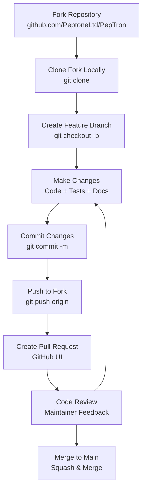
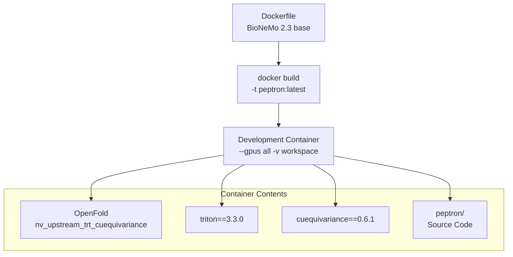
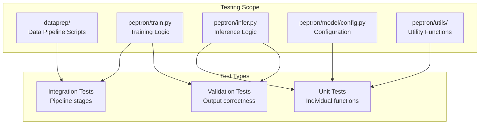
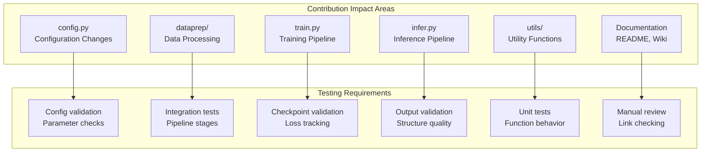

# Contribution Guidelines

> **Relevant source files**
> * [CONTRIBUTING.md](https://github.com/PeptoneLtd/PepTron/blob/8123ab15/CONTRIBUTING.md?plain=1)

## Purpose and Scope

This document provides technical guidelines for contributing code, documentation, and other improvements to the PepTron repository. It covers the contribution workflow, development environment setup, code standards, testing requirements, and pull request procedures.

For information about setting up a development environment with Docker and development tools, see [Development Environment](/PeptoneLtd/PepTron/9.1-development-environment). For community standards and behavioral expectations, see [Code of Conduct](/PeptoneLtd/PepTron/9.3-code-of-conduct).

---

## Contribution Workflow

The PepTron project follows a standard fork-and-pull-request workflow. All contributions must be submitted through GitHub pull requests and undergo review before merging.

### Workflow Diagram



**Sources:** [CONTRIBUTING.md L1-L49](https://github.com/PeptoneLtd/PepTron/blob/8123ab15/CONTRIBUTING.md?plain=1#L1-L49)

---

## Getting Started

### Fork and Clone

1. Fork the repository at `https://github.com/PeptoneLtd/PepTron` using the GitHub UI
2. Clone your fork locally: ``` git clone https://github.com/YOUR_USERNAME/peptron.gitcd peptron ```
3. Add the upstream repository as a remote: ``` git remote add upstream https://github.com/PeptoneLtd/PepTron.git ```

### Branch Naming Conventions

Create descriptive branches following these patterns:

| Branch Type | Naming Pattern | Example |
| --- | --- | --- |
| New Feature | `feature/description` | `feature/add-ensemble-filtering` |
| Bug Fix | `bugfix/description` | `bugfix/fix-msa-indexing` |
| Documentation | `docs/description` | `docs/update-inference-guide` |
| Performance | `perf/description` | `perf/optimize-batch-processing` |
| Refactoring | `refactor/description` | `refactor/cleanup-data-pipeline` |

**Sources:** [CONTRIBUTING.md L8-L16](https://github.com/PeptoneLtd/PepTron/blob/8123ab15/CONTRIBUTING.md?plain=1#L8-L16)

---

## Development Environment Setup

### Docker-Based Development

The recommended development environment uses the Docker container defined in the repository. This ensures consistency with the production environment and includes all required dependencies.



Build and run the development container:

```javascript
# Build the Docker imagedocker build -t peptron:latest . # Run container with GPU access and mounted workspacedocker run --gpus all -it --rm -v $(pwd):/workspace peptron:latest # Inside container, verify environmentpython -c "import peptron; print('PepTron imported successfully')"
```

For detailed environment setup instructions, see [Development Environment](/PeptoneLtd/PepTron/9.1-development-environment).

**Sources:** [CONTRIBUTING.md L18-L24](https://github.com/PeptoneLtd/PepTron/blob/8123ab15/CONTRIBUTING.md?plain=1#L18-L24)

 Dockerfile

---

## Code Standards and Best Practices

### Python Style Guidelines

PepTron follows Python best practices with specific standards:

| Guideline | Requirement | Rationale |
| --- | --- | --- |
| Python Version | 3.8+ | Compatible with NVIDIA BioNeMo Framework |
| Style Guide | PEP 8 | Industry standard for Python code |
| Line Length | 88 characters | Black formatter default |
| Type Hints | Required for functions | Improves code clarity and IDE support |
| Docstrings | Required for public APIs | Essential for documentation generation |

### Type Hints Example

Functions should include type hints for parameters and return values:

```python
# Good: Clear type annotationsdef process_sequences(    sequences: List[str],    max_length: int,    device: torch.device) -> Dict[str, torch.Tensor]:    """Process protein sequences for model input."""    ... # Bad: No type informationdef process_sequences(sequences, max_length, device):    ...
```

### Docstring Format

Use Google-style docstrings for consistency with the existing codebase:

```python
def generate_ensemble(    sequence: str,    num_samples: int = 10,    diffusion_steps: int = 10) -> List[np.ndarray]:    """Generate ensemble conformations for a protein sequence.        Args:        sequence: Amino acid sequence (single-letter code)        num_samples: Number of ensemble members to generate        diffusion_steps: Number of diffusion sampling steps            Returns:        List of coordinate arrays with shape (n_residues, 3)            Raises:        ValueError: If sequence contains invalid amino acids    """    ...
```

**Sources:** [CONTRIBUTING.md L58-L63](https://github.com/PeptoneLtd/PepTron/blob/8123ab15/CONTRIBUTING.md?plain=1#L58-L63)

---

## Testing Guidelines

### Test Requirements

All contributions that modify core functionality must include tests. The testing strategy varies by component:



### Testing Checklist

Before submitting a pull request:

* Unit tests pass for modified utility functions
* Integration tests pass for modified pipeline stages
* Manual validation performed for structural outputs
* Memory usage tested on representative datasets
* GPU memory requirements documented if changed

### Running Tests

```markdown
# Inside Docker containercd /workspace # Run unit tests (if test suite exists)python -m pytest tests/ # Manual validation for inference changespython peptron/infer.py --input test_sequences.csv \    --checkpoint peptron_checkpoint.pt \    --output test_output/ # Verify outputspython peptron/pt_to_structure.py --results_path test_output/
```

**Sources:** [CONTRIBUTING.md L26-L31](https://github.com/PeptoneLtd/PepTron/blob/8123ab15/CONTRIBUTING.md?plain=1#L26-L31)

---

## Pull Request Process

### PR Requirements

Each pull request must include:

1. **Clear description** of changes made
2. **Rationale** explaining why the change is needed
3. **Testing evidence** demonstrating the change works
4. **Documentation updates** for user-facing changes

### PR Template Structure

```sql
## DescriptionBrief summary of what changed and why ## Type of Change- [ ] Bug fix (non-breaking change fixing an issue)- [ ] New feature (non-breaking change adding functionality)- [ ] Breaking change (fix or feature causing existing functionality to change)- [ ] Documentation update ## Testing Performed- [ ] Unit tests added/updated- [ ] Integration tests pass- [ ] Manual validation completed ## Related IssuesCloses #<issue_number>
```

### Commit Message Format

Use conventional commit format for clarity:

```
<type>: <description>

[optional body]

[optional footer]
```

Valid types:

* `feat`: New feature
* `fix`: Bug fix
* `docs`: Documentation changes
* `perf`: Performance improvement
* `refactor`: Code restructuring without functional changes
* `test`: Adding or updating tests
* `chore`: Maintenance tasks

Example:

```
git commit -m "feat: add ensemble filtering based on physics validation"git commit -m "fix: correct MSA indexing for chains with missing residues"git commit -m "docs: clarify diffusion sampling parameters in inference"
```

**Sources:** [CONTRIBUTING.md L33-L49](https://github.com/PeptoneLtd/PepTron/blob/8123ab15/CONTRIBUTING.md?plain=1#L33-L49)

---

## Contribution Types and Scope

### Contribution Categories

The following table outlines common contribution types and their typical scope:

| Category | Description | Example Changes | Impact Areas |
| --- | --- | --- | --- |
| **Bug Fixes** | Fix errors, memory issues, compatibility | Fix OOM errors in batch processing | `peptron/train.py`, `peptron/infer.py` |
| **New Features** | Add model improvements, data formats | Add new filtering method | `peptron/utils/`, new modules |
| **Documentation** | Improve README, add examples, fix typos | Update training guide | `README.md`, wiki pages |
| **Performance** | Optimize speed, memory, GPU utilization | Parallelize structure conversion | `peptron/pt_to_structure.py` |
| **Data Pipeline** | Improve data preparation scripts | Add new dataset support | `dataprep/*.py` |
| **Configuration** | Add or modify training/inference params | New checkpoint strategy | `peptron/model/config.py` |

### Code Impact Map



### High-Impact Areas

Contributions affecting these components require additional scrutiny:

1. **Configuration System** ([peptron/model/config.py](https://github.com/PeptoneLtd/PepTron/blob/8123ab15/peptron/model/config.py) ): Changes affect all downstream training and inference
2. **Training Loop** ([peptron/train.py](https://github.com/PeptoneLtd/PepTron/blob/8123ab15/peptron/train.py) ): Must maintain compatibility with NeMo distributed training
3. **Data Loading** ([peptron/data/](https://github.com/PeptoneLtd/PepTron/blob/8123ab15/peptron/data/) ): Performance-critical path affecting training efficiency
4. **Checkpoint Format**: Changes must maintain backward compatibility or provide migration path

**Sources:** [CONTRIBUTING.md L51-L56](https://github.com/PeptoneLtd/PepTron/blob/8123ab15/CONTRIBUTING.md?plain=1#L51-L56)

---

## Getting Help

### Before Contributing

1. **Check existing issues**: Search [GitHub Issues](https://github.com/PeptoneLtd/PepTron/blob/8123ab15/GitHub Issues)  for related discussions
2. **Review documentation**: Ensure the contribution aligns with project goals
3. **Open a discussion**: For large changes, create an issue first to discuss the approach

### During Development

* **Ask questions early**: Comment on related issues or create a new issue
* **Share progress**: Draft pull requests are encouraged for early feedback
* **Be responsive**: Address review comments promptly and respectfully

### Community Standards

All contributors must follow the project's [Code of Conduct](/PeptoneLtd/PepTron/9.3-code-of-conduct). Key principles:

* Be respectful and patient with reviewers and other contributors
* Provide constructive feedback in code reviews
* Acknowledge others' contributions and expertise
* Focus on technical merit rather than personal preferences

**Sources:** [CONTRIBUTING.md L65-L71](https://github.com/PeptoneLtd/PepTron/blob/8123ab15/CONTRIBUTING.md?plain=1#L65-L71)

---

## Review Process

### What Reviewers Check

Pull requests are evaluated on:

1. **Correctness**: Does the code work as intended?
2. **Testing**: Are changes adequately tested?
3. **Documentation**: Are user-facing changes documented?
4. **Style**: Does the code follow project conventions?
5. **Performance**: Are there any performance regressions?
6. **Compatibility**: Does it maintain backward compatibility?

### Response Time Expectations

| Review Stage | Expected Response Time |
| --- | --- |
| Initial triage | 1-3 business days |
| First review | 3-7 business days |
| Follow-up reviews | 2-5 business days |
| Final approval | 1-2 business days |

Response times may vary based on maintainer availability and PR complexity.

### After Merge

Once merged:

* Your contribution becomes part of the Apache License 2.0 codebase (see [License](/PeptoneLtd/PepTron/9.4-license))
* Changes will be included in the next release
* You'll be credited in release notes and contributor lists

**Sources:** [CONTRIBUTING.md L1-L72](https://github.com/PeptoneLtd/PepTron/blob/8123ab15/CONTRIBUTING.md?plain=1#L1-L72)

---

## Summary

Contributing to PepTron requires:

1. **Fork and clone** the repository
2. **Create a feature branch** with descriptive naming
3. **Set up Docker environment** for consistent development
4. **Follow Python best practices**: PEP 8, type hints, docstrings
5. **Add tests** for new functionality
6. **Submit pull request** with clear description and rationale
7. **Respond to reviews** respectfully and promptly

For questions or assistance, open an issue on GitHub or refer to the [Development Environment](/PeptoneLtd/PepTron/9.1-development-environment) page for technical setup details.

**Sources:** [CONTRIBUTING.md L1-L72](https://github.com/PeptoneLtd/PepTron/blob/8123ab15/CONTRIBUTING.md?plain=1#L1-L72)