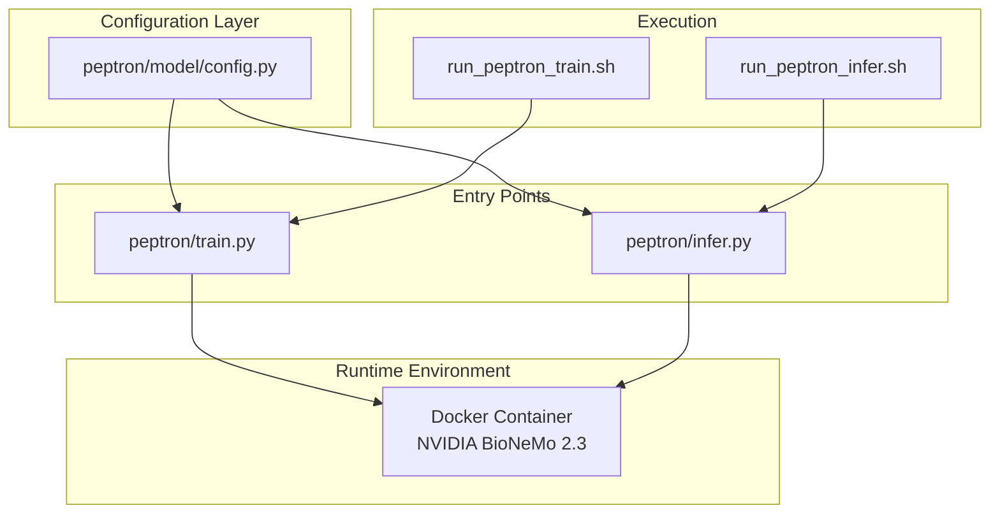
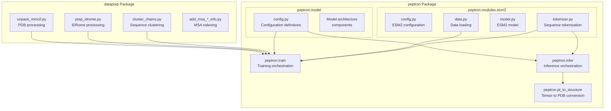
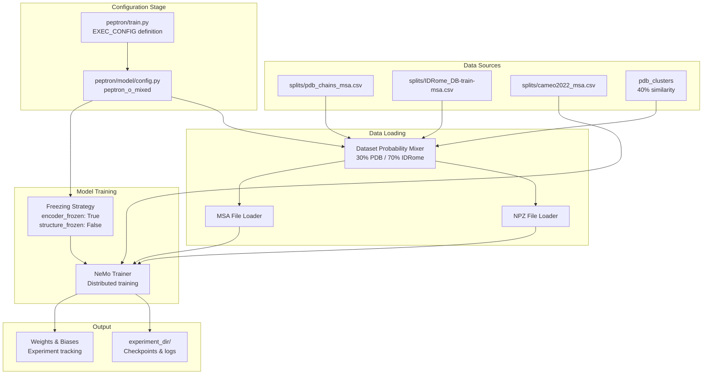
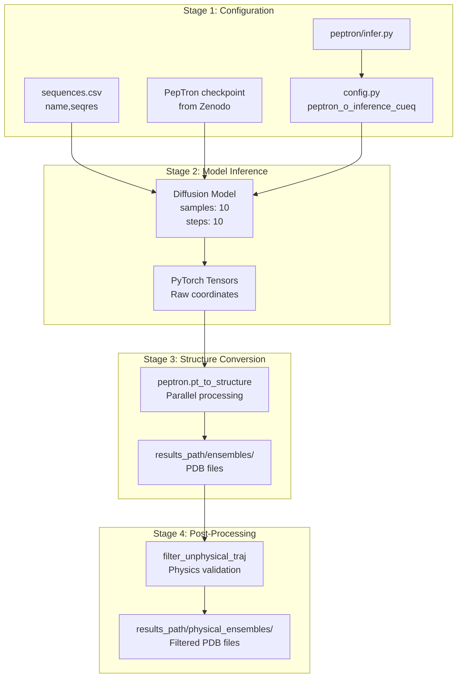
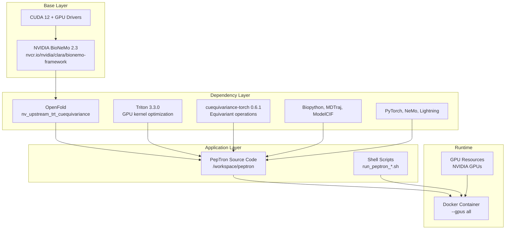
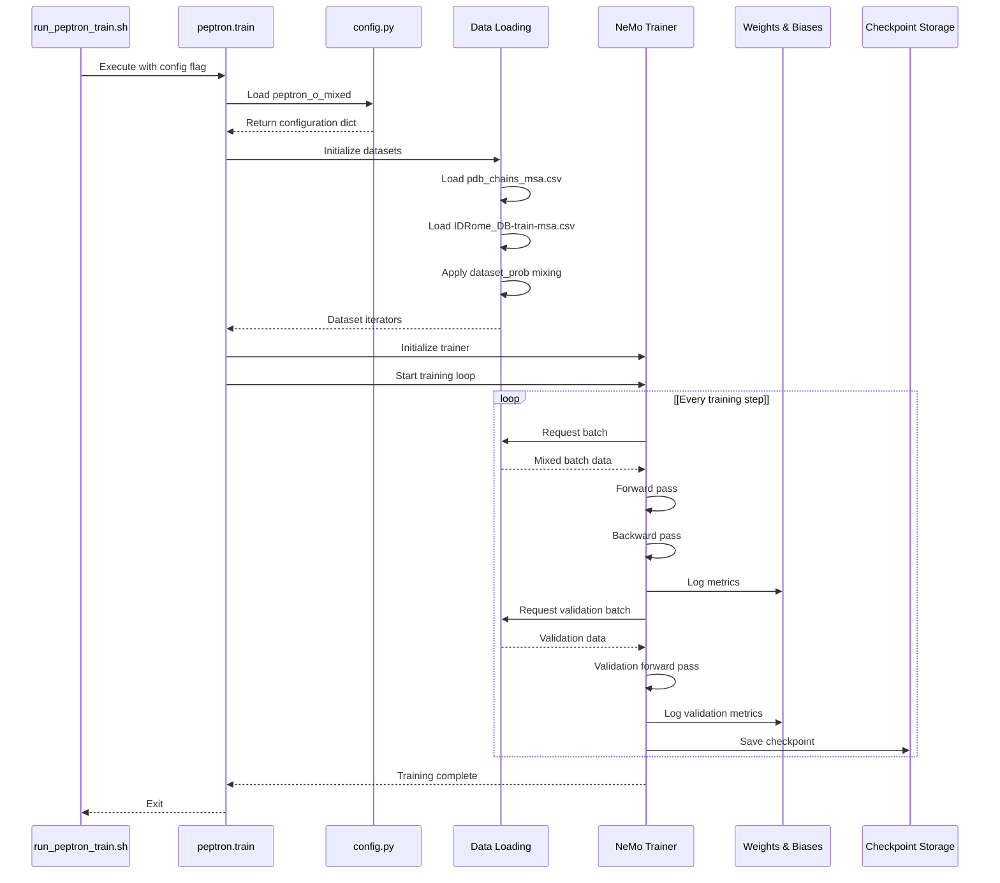
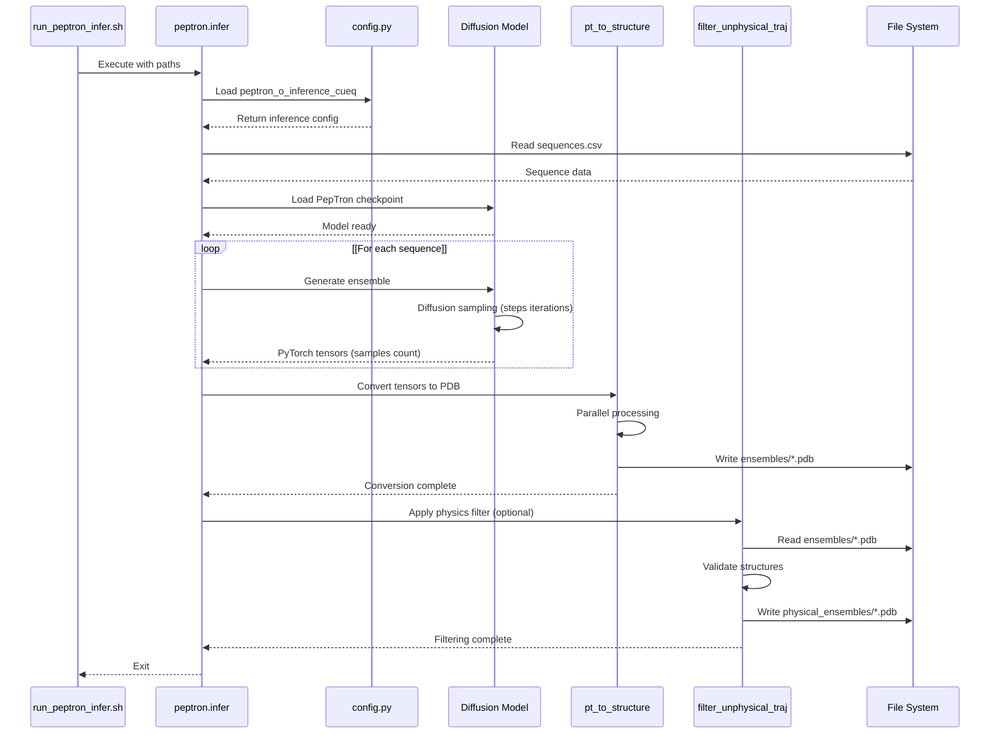

# Core Architecture

> **Relevant source files**
> * [README.md](https://github.com/PeptoneLtd/PepTron/blob/8123ab15/README.md?plain=1)

## Purpose and Scope

This document provides a comprehensive overview of PepTron's core architecture, design decisions, and system organization. It explains how the major components—training, inference, configuration, and models—interact to form a complete protein ensemble generation system.

For specific details on:

* Configuration parameters and settings, see [Configuration System](/PeptoneLtd/PepTron/3.1-configuration-system)
* Model checkpoints and lineage, see [Model Checkpoints](/PeptoneLtd/PepTron/3.2-model-checkpoints)
* Data preparation workflows, see [Data Preparation Pipeline](/PeptoneLtd/PepTron/4-data-preparation-pipeline)
* Training execution details, see [Training](/PeptoneLtd/PepTron/5-training)
* Inference execution details, see [Inference](/PeptoneLtd/PepTron/6-inference)

---

## System Overview

PepTron is architected as a dual-mode system supporting both training and inference workflows. The system operates within a containerized environment built on NVIDIA BioNeMo Framework 2.3, leveraging GPU acceleration for both model training and ensemble generation.

The architecture follows a modular design with clear separation of concerns:

**Core Modes**



**Sources:** [README.md L1-L263](https://github.com/PeptoneLtd/PepTron/blob/8123ab15/README.md?plain=1#L1-L263)

 [peptron/train.py](https://github.com/PeptoneLtd/PepTron/blob/8123ab15/peptron/train.py)

 [peptron/infer.py](https://github.com/PeptoneLtd/PepTron/blob/8123ab15/peptron/infer.py)

---

## System Components

### Component Hierarchy

The codebase is organized into distinct functional layers, each responsible for specific aspects of the system:

| Component | Location | Primary Responsibility |
| --- | --- | --- |
| **Entry Points** | `peptron/train.py`, `peptron/infer.py` | Main execution entry for training and inference modes |
| **Configuration** | `peptron/model/config.py` | Centralized parameter management for all system modes |
| **Model Definition** | `peptron/model/` | Neural network architecture and model components |
| **Data Pipeline** | `dataprep/` | Data preprocessing and preparation scripts |
| **ESM2 Integration** | `peptron/modules/esm2/` | Sequence processing and tokenization utilities |
| **Orchestration** | `run_peptron_*.sh` | Shell scripts for execution management |
| **Environment** | `Dockerfile` | Container definition and dependency specification |

**Sources:** [README.md L14-L26](https://github.com/PeptoneLtd/PepTron/blob/8123ab15/README.md?plain=1#L14-L26)

---

### Module Structure

The following diagram maps the primary Python modules to their roles in the system architecture:



**Sources:** [peptron/train.py](https://github.com/PeptoneLtd/PepTron/blob/8123ab15/peptron/train.py)

 [peptron/infer.py](https://github.com/PeptoneLtd/PepTron/blob/8123ab15/peptron/infer.py)

 [peptron/pt_to_structure.py](https://github.com/PeptoneLtd/PepTron/blob/8123ab15/peptron/pt_to_structure.py)

 [dataprep/unpack_mmcif.py](https://github.com/PeptoneLtd/PepTron/blob/8123ab15/dataprep/unpack_mmcif.py)

 [dataprep/prep_idrome.py](https://github.com/PeptoneLtd/PepTron/blob/8123ab15/dataprep/prep_idrome.py)

---

## Core Workflows

### Training Pipeline Architecture

The training workflow orchestrates data loading, model training, and checkpoint management through a hierarchical pipeline:



**Key Implementation Details:**

| Component | Configuration Parameter | Code Location |
| --- | --- | --- |
| Entry point | `EXEC_CONFIG` | [peptron/train.py L45-L46](https://github.com/PeptoneLtd/PepTron/blob/8123ab15/peptron/train.py#L45-L46) |
| Data mixing | `dataset_prob_pdb`, `dataset_prob_idp` | [peptron/model/config.py L154-L155](https://github.com/PeptoneLtd/PepTron/blob/8123ab15/peptron/model/config.py#L154-L155) |
| Model freezing | `encoder_frozen`, `structure_frozen` | [peptron/model/config.py L159-L160](https://github.com/PeptoneLtd/PepTron/blob/8123ab15/peptron/model/config.py#L159-L160) |
| Training steps | `n_steps_train` | [peptron/model/config.py L123](https://github.com/PeptoneLtd/PepTron/blob/8123ab15/peptron/model/config.py#L123-L123) |
| Checkpointing | `experiment_dir`, `steps_to_save_ckpt` | [peptron/model/config.py L121-L134](https://github.com/PeptoneLtd/PepTron/blob/8123ab15/peptron/model/config.py#L121-L134) |

**Sources:** [README.md L75-L173](https://github.com/PeptoneLtd/PepTron/blob/8123ab15/README.md?plain=1#L75-L173)

 [peptron/train.py](https://github.com/PeptoneLtd/PepTron/blob/8123ab15/peptron/train.py)

 [peptron/model/config.py L120-L162](https://github.com/PeptoneLtd/PepTron/blob/8123ab15/peptron/model/config.py#L120-L162)

---

### Inference Pipeline Architecture

The inference workflow implements a three-stage pipeline for generating and post-processing protein structure ensembles:



**Key Implementation Details:**

| Stage | Configuration Parameter | Default Value | Purpose |
| --- | --- | --- | --- |
| Model inference | `samples` | 10 | Number of ensemble conformations |
| Model inference | `steps` | 10 | Diffusion denoising steps |
| Model inference | `max_batch_size` | 1 | Parallel structure generation |
| Model inference | `num_gpus` | 1 | GPU allocation |
| Post-processing | `filter_unphysical_traj` | Optional | Remove invalid structures |

**Sources:** [README.md L37-L73](https://github.com/PeptoneLtd/PepTron/blob/8123ab15/README.md?plain=1#L37-L73)

 [README.md L177-L190](https://github.com/PeptoneLtd/PepTron/blob/8123ab15/README.md?plain=1#L177-L190)

 [peptron/infer.py L43-L46](https://github.com/PeptoneLtd/PepTron/blob/8123ab15/peptron/infer.py#L43-L46)

 [run_peptron_infer.sh](https://github.com/PeptoneLtd/PepTron/blob/8123ab15/run_peptron_infer.sh)

---

## Runtime Environment

### Containerization Strategy

PepTron operates exclusively within a Docker container to ensure reproducible execution across different hardware and software environments. The container encapsulates all dependencies, including the NVIDIA BioNeMo framework and GPU drivers.



**Container Build Process:**

The [Dockerfile L1-L50](https://github.com/PeptoneLtd/PepTron/blob/8123ab15/Dockerfile#L1-L50)

 defines the multi-stage build:

1. **Base image:** NVIDIA BioNeMo Framework 2.3 (`nvcr.io/nvidia/clara/bionemo-framework:2.3`)
2. **OpenFold installation:** Custom fork with TensorRT and cuequivariance integration
3. **Dependency installation:** Triton 3.3.0, cuequivariance-torch 0.6.1, scientific libraries
4. **Source code mounting:** `/workspace/peptron` directory

**Execution Commands:**

```markdown
# Build containerdocker build -t peptron:latest . # Run with GPU accessdocker run --gpus all -it --rm peptron:latest
```

**Sources:** [README.md L14-L26](https://github.com/PeptoneLtd/PepTron/blob/8123ab15/README.md?plain=1#L14-L26)

 [Dockerfile](https://github.com/PeptoneLtd/PepTron/blob/8123ab15/Dockerfile)

---

## Key Design Decisions

### 1. Centralized Configuration Management

All training and inference parameters are centralized in [peptron/model/config.py](https://github.com/PeptoneLtd/PepTron/blob/8123ab15/peptron/model/config.py)

 with specific configuration profiles accessed by name:

* `peptron_o_mixed`: Training configuration for mixed PDB + IDRome-o data
* `peptron_o_inference_cueq`: Inference configuration with cuequivariance backend

This design allows:

* Version-controlled parameter tracking
* Reproducible experiment configuration
* Easy switching between training and inference modes
* Consistent parameter naming across workflows

**Sources:** [README.md L108-L113](https://github.com/PeptoneLtd/PepTron/blob/8123ab15/README.md?plain=1#L108-L113)

 [README.md L175-L199](https://github.com/PeptoneLtd/PepTron/blob/8123ab15/README.md?plain=1#L175-L199)

 [peptron/model/config.py](https://github.com/PeptoneLtd/PepTron/blob/8123ab15/peptron/model/config.py)

---

### 2. Two-Stage Training Methodology

PepTron implements a curriculum learning approach with distinct training stages:

| Stage | Checkpoint | Training Data | Purpose |
| --- | --- | --- | --- |
| Pre-training | `PepTron-base` | PDB (structured proteins) | Learn folded protein structure prediction |
| Fine-tuning | `PepTron` | 30% PDB + 70% IDRome-o | Extend to disordered proteins and full proteome |

The fine-tuning stage employs transfer learning with selective freezing:

* `encoder_frozen: True` - ESM2-based sequence encoder remains fixed
* `structure_frozen: False` - Structure prediction head is trainable

This strategy enables the model to leverage pre-trained structural knowledge while adapting to disordered protein ensembles.

**Sources:** [README.md L28-L34](https://github.com/PeptoneLtd/PepTron/blob/8123ab15/README.md?plain=1#L28-L34)

 [README.md L159-L161](https://github.com/PeptoneLtd/PepTron/blob/8123ab15/README.md?plain=1#L159-L161)

---

### 3. Multi-Dataset Probabilistic Mixing

Training data is sampled from multiple sources using configurable probabilities:

```markdown
"dataset_prob_pdb": 0.3,  # 30% PDB structured proteins"dataset_prob_idp": 0.7,  # 70% IDRome-o disordered proteins
```

This probabilistic mixing ensures:

* Balanced representation of protein disorder spectrum
* Controlled exposure to structured vs. disordered conformations
* Flexibility to adjust training distribution based on application needs

The mixing strategy is implemented at the dataset level, with temporal clustering used for train/validation splitting to prevent data leakage ([README.md L156-L157](https://github.com/PeptoneLtd/PepTron/blob/8123ab15/README.md?plain=1#L156-L157)

).

**Sources:** [README.md L154-L157](https://github.com/PeptoneLtd/PepTron/blob/8123ab15/README.md?plain=1#L154-L157)

---

### 4. Modular Data Preparation Pipeline

Data preparation is deliberately separated from training and inference workflows. The [dataprep/](https://github.com/PeptoneLtd/PepTron/blob/8123ab15/dataprep/)

 package contains standalone scripts for:

* PDB mmCIF file processing ([dataprep/unpack_mmcif.py](https://github.com/PeptoneLtd/PepTron/blob/8123ab15/dataprep/unpack_mmcif.py) )
* IDRome-o trajectory preprocessing ([dataprep/prep_idrome.py](https://github.com/PeptoneLtd/PepTron/blob/8123ab15/dataprep/prep_idrome.py) )
* Sequence clustering ([dataprep/cluster_chains.py](https://github.com/PeptoneLtd/PepTron/blob/8123ab15/dataprep/cluster_chains.py) )
* MSA generation and indexing ([dataprep/add_msa_*_info.py](https://github.com/PeptoneLtd/PepTron/blob/8123ab15/dataprep/add_msa_*_info.py) )

This modular design allows:

* Data preparation as a one-time preprocessing step
* Independent updates to data sources without code changes
* Parallel processing for large-scale datasets
* Reusable data artifacts across multiple training runs

**Sources:** [README.md L77-L106](https://github.com/PeptoneLtd/PepTron/blob/8123ab15/README.md?plain=1#L77-L106)

---

### 5. GPU Memory Management Strategy

The system implements multiple strategies for managing GPU memory constraints:

**Training:**

* `micro_batch_size`: Per-GPU batch size (default: 8)
* `accumulate_grad_batches`: Gradient accumulation for effective larger batches
* `crop_size`: Sequence length cropping for memory efficiency
* `tensor_model_parallel_size`: Model parallelism across GPUs

**Inference:**

* `max_batch_size`: Parallel ensemble generation (default: 1, adjustable based on sequence length)
* `num_gpus`: Explicit GPU allocation (must be ≤ number of sequences)

The default conservative settings (`micro_batch_size=1`, `max_batch_size=1`) prevent out-of-memory errors, with documentation encouraging users to increase based on their hardware capabilities.

**Sources:** [README.md L186-L190](https://github.com/PeptoneLtd/PepTron/blob/8123ab15/README.md?plain=1#L186-L190)

 [README.md L212-L215](https://github.com/PeptoneLtd/PepTron/blob/8123ab15/README.md?plain=1#L212-L215)

 [peptron/model/config.py L130-L133](https://github.com/PeptoneLtd/PepTron/blob/8123ab15/peptron/model/config.py#L130-L133)

---

### 6. Docker-First Deployment

The system requires Docker execution rather than supporting native installation. This design decision ensures:

* **Reproducibility:** Identical execution environment across development, training, and inference
* **Dependency isolation:** Complex NVIDIA BioNeMo and OpenFold dependencies are pre-configured
* **GPU compatibility:** Automatic CUDA and driver compatibility through NVIDIA base images
* **Version control:** Container tags lock specific dependency versions

The [Dockerfile](https://github.com/PeptoneLtd/PepTron/blob/8123ab15/Dockerfile)

 uses NVIDIA's official BioNeMo 2.3 image as the base, providing pre-optimized GPU libraries and frameworks.

**Sources:** [README.md L14-L26](https://github.com/PeptoneLtd/PepTron/blob/8123ab15/README.md?plain=1#L14-L26)

 [Dockerfile](https://github.com/PeptoneLtd/PepTron/blob/8123ab15/Dockerfile)

---

## Component Interactions

### Training Execution Flow

The following sequence diagram illustrates the interaction between components during a training run:



**Sources:** [README.md L165-L173](https://github.com/PeptoneLtd/PepTron/blob/8123ab15/README.md?plain=1#L165-L173)

 [peptron/train.py](https://github.com/PeptoneLtd/PepTron/blob/8123ab15/peptron/train.py)

 [run_peptron_train.sh](https://github.com/PeptoneLtd/PepTron/blob/8123ab15/run_peptron_train.sh)

---

### Inference Execution Flow

The following sequence diagram shows the interaction between components during inference:



**Sources:** [README.md L37-L73](https://github.com/PeptoneLtd/PepTron/blob/8123ab15/README.md?plain=1#L37-L73)

 [peptron/infer.py](https://github.com/PeptoneLtd/PepTron/blob/8123ab15/peptron/infer.py)

 [run_peptron_infer.sh](https://github.com/PeptoneLtd/PepTron/blob/8123ab15/run_peptron_infer.sh)

---

## Summary

PepTron's architecture achieves flexibility and reproducibility through:

1. **Dual-mode design** with separate training and inference entry points
2. **Centralized configuration** enabling version-controlled experiment management
3. **Modular data preparation** decoupled from model execution
4. **Containerized runtime** ensuring consistent execution environments
5. **Transfer learning strategy** with curriculum-based checkpoint progression
6. **Multi-dataset mixing** for comprehensive proteome coverage
7. **GPU memory optimization** with configurable parallelism and batching

The system leverages NVIDIA BioNeMo and NeMo frameworks for distributed training, while maintaining a clear separation between data preparation ([Data Preparation Pipeline](/PeptoneLtd/PepTron/4-data-preparation-pipeline)), model training ([Training](/PeptoneLtd/PepTron/5-training)), and inference ([Inference](/PeptoneLtd/PepTron/6-inference)) workflows.

**Sources:** [README.md L1-L263](https://github.com/PeptoneLtd/PepTron/blob/8123ab15/README.md?plain=1#L1-L263)