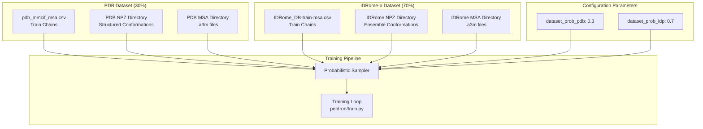
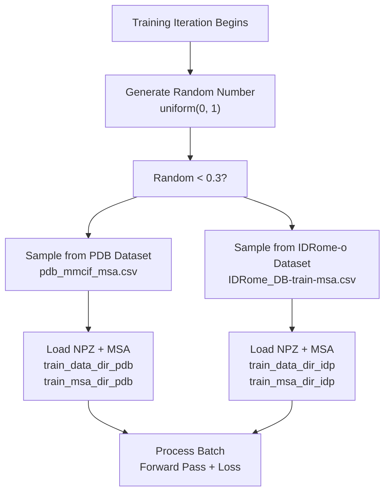
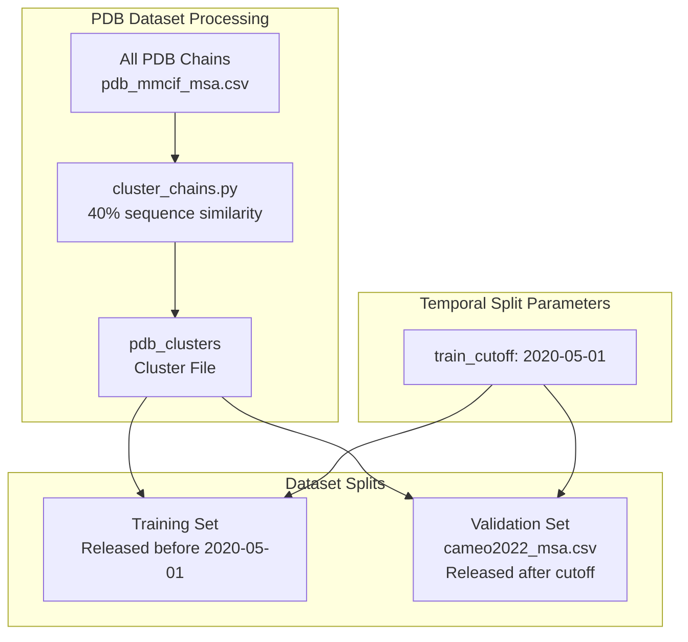
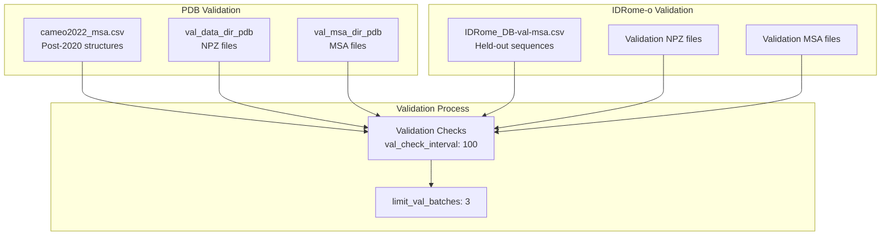
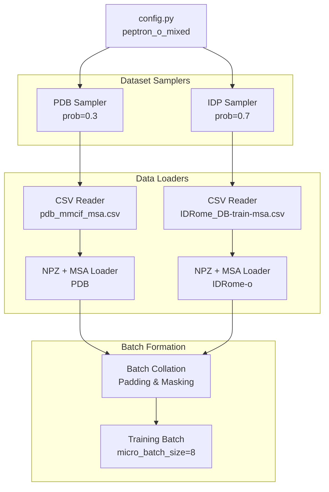
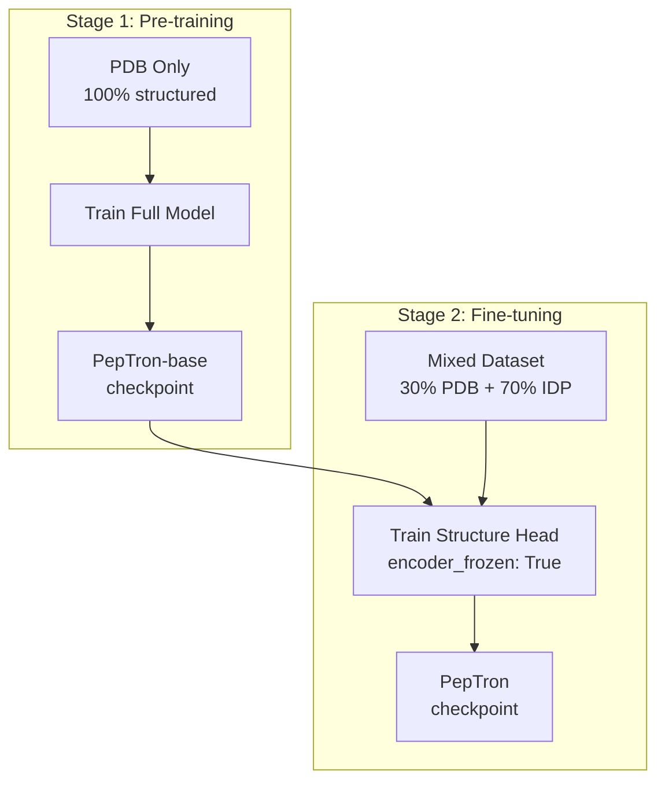

# Data Mixing Strategy

> **Relevant source files**
> * [README.md](https://github.com/PeptoneLtd/PepTron/blob/8123ab15/README.md?plain=1)

## Purpose and Scope

This document describes the data mixing strategy used during PepTron training, which combines structured protein data from the PDB with disordered protein ensemble data from IDRome-o. The strategy employs probabilistic sampling to balance these heterogeneous datasets and uses cluster-based temporal splitting to ensure proper validation.

For overall training configuration parameters, see [Training Configuration](/PeptoneLtd/PepTron/5.1-training-configuration). For details on data preparation pipelines that produce the datasets used here, see [Data Preparation Pipeline](/PeptoneLtd/PepTron/4-data-preparation-pipeline).

---

## Overview

PepTron's data mixing strategy addresses the challenge of training a single model to handle both highly structured proteins and intrinsically disordered proteins (IDPs). The strategy combines two complementary datasets with a fixed sampling probability:

* **30% PDB data**: Structured protein conformations from the Protein Data Bank
* **70% IDRome-o data**: Ensemble conformations of intrinsically disordered proteins

This asymmetric mixing ratio reflects the training objective of fine-tuning a structure-focused base model (PepTron-base) to also handle disordered regions, creating the full-proteome PepTron model.

**Sources:** [README.md L154-L156](https://github.com/PeptoneLtd/PepTron/blob/8123ab15/README.md?plain=1#L154-L156)

---

## Dataset Composition

### Two-Dataset Training Architecture



**Sources:** [README.md L141-L156](https://github.com/PeptoneLtd/PepTron/blob/8123ab15/README.md?plain=1#L141-L156)

### Dataset Properties

| Dataset | Source | Content Type | Sampling Probability | Chain File | Data Directory | MSA Directory |
| --- | --- | --- | --- | --- | --- | --- |
| PDB | Protein Data Bank | Single structured conformations | 0.3 (30%) | `splits/pdb_mmcif_msa.csv` | `train_data_dir_pdb` | `train_msa_dir_pdb` |
| IDRome-o | IDP-o predictions | Ensemble trajectories | 0.7 (70%) | `splits/IDRome_DB-train-msa.csv` | `train_data_dir_idp` | `train_msa_dir_idp` |

**Sources:** [README.md L147-L156](https://github.com/PeptoneLtd/PepTron/blob/8123ab15/README.md?plain=1#L147-L156)

---

## Probabilistic Sampling Mechanism

### Configuration Parameters

The mixing strategy is controlled by two configuration parameters in `peptron/model/config.py`:

```
"dataset_prob_pdb": 0.3,"dataset_prob_idp": 0.7,
```

These probabilities determine the likelihood of sampling from each dataset during each training iteration. The values must sum to 1.0.

**Sources:** [README.md L154-L155](https://github.com/PeptoneLtd/PepTron/blob/8123ab15/README.md?plain=1#L154-L155)

### Sampling Flow During Training



**Sources:** [README.md L141-L156](https://github.com/PeptoneLtd/PepTron/blob/8123ab15/README.md?plain=1#L141-L156)

### Rationale for 30/70 Split

The asymmetric 30/70 ratio serves multiple purposes:

1. **Transfer Learning Focus**: PepTron training starts from PepTron-base (pre-trained on PDB). The higher IDP sampling probability (70%) emphasizes learning disordered protein behavior while maintaining structured protein capabilities.
2. **Dataset Size Balance**: IDRome-o contains ensemble trajectories with multiple conformations per protein, while PDB contains single conformations. The 70% sampling partially compensates for the difference in effective data volume per protein.
3. **Target Distribution**: The ratio biases the model toward better performance on the full proteome, including intrinsically disordered regions which are underrepresented in single-structure datasets.

**Sources:** [README.md L32-L33](https://github.com/PeptoneLtd/PepTron/blob/8123ab15/README.md?plain=1#L32-L33)

 [README.md L154-L156](https://github.com/PeptoneLtd/PepTron/blob/8123ab15/README.md?plain=1#L154-L156)

---

## Cluster-Based Temporal Splitting

### Temporal Split Strategy

To prevent data leakage and ensure valid performance evaluation, PepTron uses temporal splitting for the PDB dataset:



**Sources:** [README.md L93](https://github.com/PeptoneLtd/PepTron/blob/8123ab15/README.md?plain=1#L93-L93)

 [README.md L156-L157](https://github.com/PeptoneLtd/PepTron/blob/8123ab15/README.md?plain=1#L156-L157)

### Clustering Configuration

| Parameter | Value | Purpose |
| --- | --- | --- |
| `train_clusters` | `/path/to/pdb_clusters` | Path to pre-computed cluster file at 40% sequence similarity |
| `train_cutoff` | `"2020-05-01"` | Temporal split date for train/validation separation |
| Similarity threshold | 40% | MMseqs2 clustering threshold for sequence redundancy reduction |

The clustering ensures that proteins in the validation set (`cameo2022_msa.csv`) are not sequence-similar to any proteins in the training set, preventing the model from memorizing similar structures.

**Sources:** [README.md L93](https://github.com/PeptoneLtd/PepTron/blob/8123ab15/README.md?plain=1#L93-L93)

 [README.md L156-L157](https://github.com/PeptoneLtd/PepTron/blob/8123ab15/README.md?plain=1#L156-L157)

### Validation Split Composition



The validation pipeline evaluates the model on both PDB structures (using CAMEO 2022 targets) and IDRome-o validation splits, ensuring performance is assessed across both structured and disordered proteins.

**Sources:** [README.md L94](https://github.com/PeptoneLtd/PepTron/blob/8123ab15/README.md?plain=1#L94-L94)

 [README.md L148](https://github.com/PeptoneLtd/PepTron/blob/8123ab15/README.md?plain=1#L148-L148)

---

## Implementation Details

### Configuration Structure

The data mixing strategy is implemented through the training configuration in `peptron/model/config.py` under the `"training"` section:

```yaml
training:
  # Dataset paths
  train_data_dir_pdb: /path/to/pdb_mmcif_npz_dir
  train_msa_dir_pdb: /path/to/pdb_msa_dir
  train_chains_pdb: splits/pdb_mmcif_msa.csv
  
  train_data_dir_idp: /path/to/IDRome_train_dir
  train_msa_dir_idp: /path/to/IDRome_train_msa_dir
  train_chains_idp: splits/IDRome_DB-train-msa.csv
  
  # Mixing probabilities
  dataset_prob_pdb: 0.3
  dataset_prob_idp: 0.7
  
  # Temporal split
  train_clusters: /path/to/pdb_clusters
  train_cutoff: "2020-05-01"
  
  # Validation
  val_data_dir_pdb: /path/to/pdb_mmcif_npz_dir
  val_msa_dir_pdb: /path/to/cameo2022_msa_dir
  valid_chains_pdb: splits/cameo2022_msa.csv
```

**Sources:** [README.md L119-L162](https://github.com/PeptoneLtd/PepTron/blob/8123ab15/README.md?plain=1#L119-L162)

### Training Epoch Configuration

The mixing strategy operates within the context of epoch and batch configuration:

| Parameter | Default Value | Impact on Mixing |
| --- | --- | --- |
| `train_epoch_len` | 80000 | Total samples per epoch; distributed across datasets according to probabilities |
| `micro_batch_size` | 8 | Batch size for each forward pass |
| `accumulate_grad_batches` | 1 | Gradient accumulation steps |

With `train_epoch_len: 80000` and the 30/70 split, each epoch samples approximately:

* 24,000 PDB structures (30% × 80,000)
* 56,000 IDRome-o conformations (70% × 80,000)

**Sources:** [README.md L126](https://github.com/PeptoneLtd/PepTron/blob/8123ab15/README.md?plain=1#L126-L126)

 [README.md L128](https://github.com/PeptoneLtd/PepTron/blob/8123ab15/README.md?plain=1#L128-L128)

 [README.md L133](https://github.com/PeptoneLtd/PepTron/blob/8123ab15/README.md?plain=1#L133-L133)

### Data Loading Pipeline



**Sources:** [README.md L141-L156](https://github.com/PeptoneLtd/PepTron/blob/8123ab15/README.md?plain=1#L141-L156)

---

## Transfer Learning Context

The data mixing strategy is designed specifically for the transfer learning phase where PepTron-base is fine-tuned to create PepTron:

### Model Freezing Configuration

```yaml
encoder_frozen: True
structure_frozen: False
```

During mixed-dataset training:

* The **encoder** (sequence processing) remains frozen, preserving learned sequence representations from PDB pre-training
* The **structure head** (coordinate prediction) is trained on both datasets, learning to handle disorder while maintaining structured protein capabilities

**Sources:** [README.md L159-L160](https://github.com/PeptoneLtd/PepTron/blob/8123ab15/README.md?plain=1#L159-L160)

### Two-Stage Training Pipeline



The 30/70 mixing ratio in Stage 2 ensures the model learns disordered protein behavior (70% emphasis) while maintaining structured protein performance through continued exposure to PDB data (30% maintenance).

**Sources:** [README.md L32-L33](https://github.com/PeptoneLtd/PepTron/blob/8123ab15/README.md?plain=1#L32-L33)

 [README.md L159-L160](https://github.com/PeptoneLtd/PepTron/blob/8123ab15/README.md?plain=1#L159-L160)

---

## Summary

PepTron's data mixing strategy implements a probabilistic 30/70 split between PDB and IDRome-o datasets during fine-tuning. This strategy, combined with cluster-based temporal splitting and selective model freezing, enables training a single model that performs well across the full spectrum of protein disorder. The configuration is centralized in `peptron/model/config.py` under the `peptron_o_mixed` configuration and executed by `peptron/train.py`.

**Sources:** [README.md L76-L163](https://github.com/PeptoneLtd/PepTron/blob/8123ab15/README.md?plain=1#L76-L163)