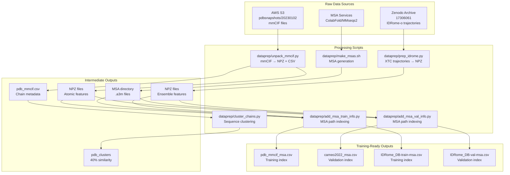
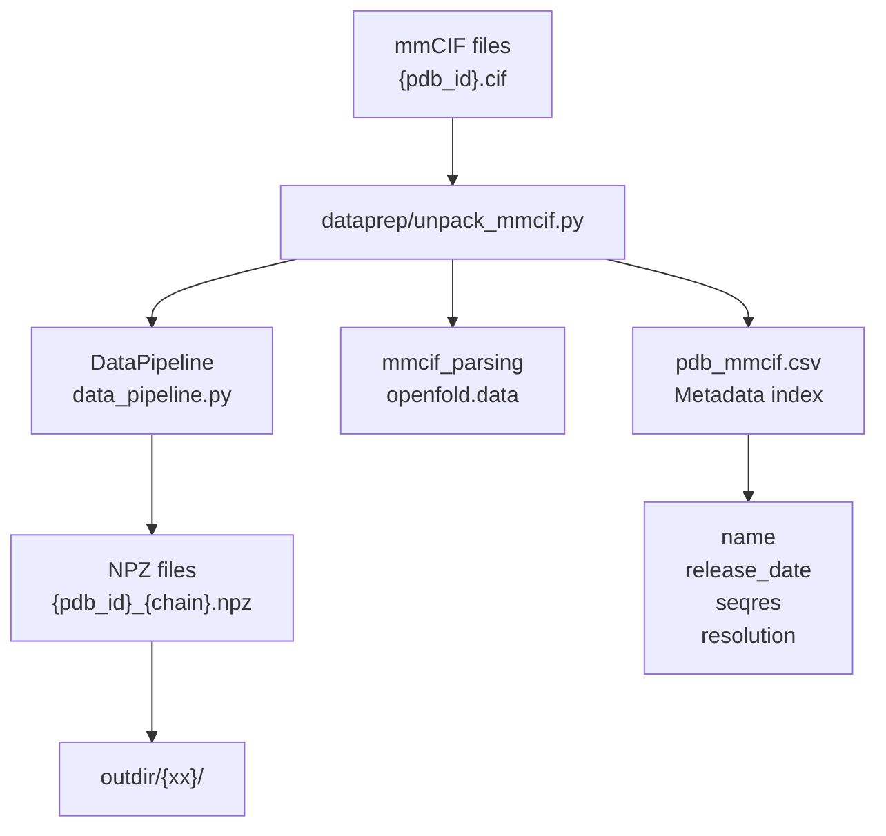
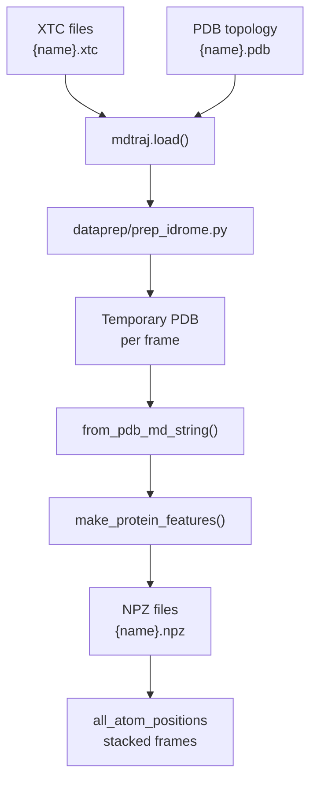
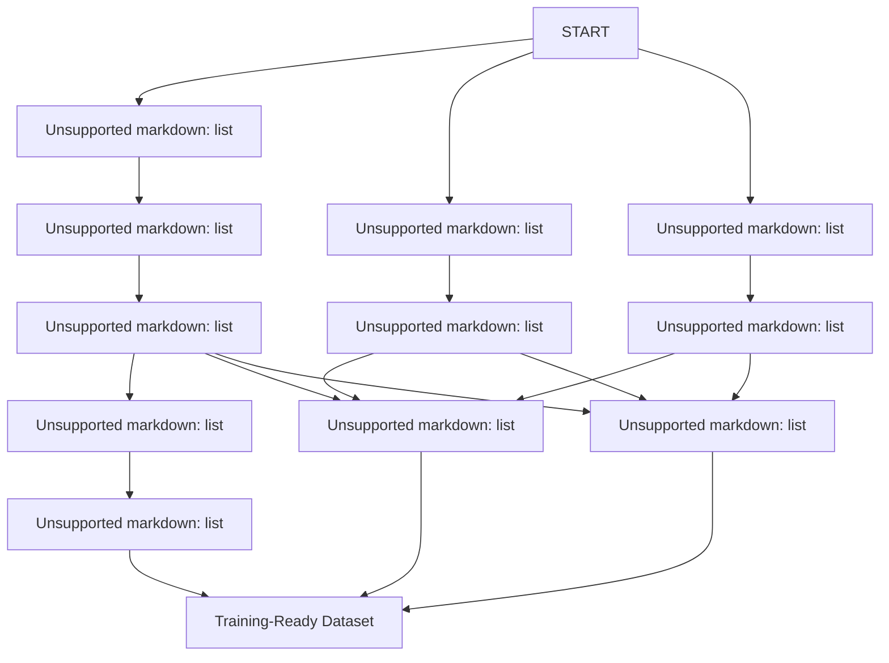

# Data Preparation Pipeline

> **Relevant source files**
> * [README.md](https://github.com/PeptoneLtd/PepTron/blob/8123ab15/README.md?plain=1)
> * [dataprep/prep_idrome.py](https://github.com/PeptoneLtd/PepTron/blob/8123ab15/dataprep/prep_idrome.py)
> * [dataprep/unpack_mmcif.py](https://github.com/PeptoneLtd/PepTron/blob/8123ab15/dataprep/unpack_mmcif.py)

## Purpose and Scope

The Data Preparation Pipeline transforms raw biological data into training-ready formats for PepTron models. This pipeline is a prerequisite for training and must be executed before any model training begins. It processes two primary data sources (PDB and IDRome-o), generates multiple sequence alignments (MSAs), and produces structured outputs including NPZ feature files, CSV metadata indexes, and sequence clustering information.

This document provides an overview of the entire pipeline architecture and execution flow. For detailed information on specific processing stages, see:

* PDB-specific processing: [PDB Dataset Processing](/PeptoneLtd/PepTron/4.1-pdb-dataset-processing)
* IDRome-o-specific processing: [IDRome-o Dataset Processing](/PeptoneLtd/PepTron/4.2-idrome-o-dataset-processing)
* MSA generation procedures: [Multiple Sequence Alignment (MSA) Generation](/PeptoneLtd/PepTron/4.3-multiple-sequence-alignment-(msa)-generation)
* Database downloads and setup: [Database Setup and Management](/PeptoneLtd/PepTron/4.4-database-setup-and-management)
* Supporting utilities: [Dataset Utilities](/PeptoneLtd/PepTron/4.5-dataset-utilities)

**Sources:** [README.md L77-L107](https://github.com/PeptoneLtd/PepTron/blob/8123ab15/README.md?plain=1#L77-L107)

---

## Pipeline Architecture

The data preparation system implements a directed acyclic graph (DAG) workflow where multiple independent data sources are processed through parallel pipelines that eventually converge for training data assembly.

### Overall Data Flow



**Sources:** [README.md L77-L107](https://github.com/PeptoneLtd/PepTron/blob/8123ab15/README.md?plain=1#L77-L107)

 Diagram 2 from high-level architecture

---

## Data Sources and Input Formats

### PDB Dataset Source

The PDB dataset is sourced from AWS S3 using a snapshot dated 2023-01-02:

| Attribute | Value |
| --- | --- |
| **Source** | `s3://pdbsnapshots/20230102/pub/pdb/data/structures/divided/mmCIF` |
| **Format** | mmCIF (Macromolecular Crystallographic Information File) |
| **Structure** | Gzip-compressed `.cif.gz` files organized in two-letter subdirectories |
| **Access** | Public, no authentication required (`--no-sign-request`) |

**Sources:** [README.md L85](https://github.com/PeptoneLtd/PepTron/blob/8123ab15/README.md?plain=1#L85-L85)

### IDRome-o Dataset Source

The IDRome-o dataset contains predicted ensemble structures for intrinsically disordered proteins:

| Attribute | Value |
| --- | --- |
| **Source** | Zenodo record 17306061 |
| **Format** | MDTraj-compatible trajectories: `.xtc` (trajectory) + `.pdb` (topology) |
| **Splits** | Pre-defined train/val splits in `splits/IDRome_DB-train.csv` and `splits/IDRome_DB-val.csv` |
| **Content** | Ensemble predictions from IDP-o model for IDRome sequences |

**Sources:** [README.md L96-L104](https://github.com/PeptoneLtd/PepTron/blob/8123ab15/README.md?plain=1#L96-L104)

---

## Processing Stages

### Stage 1: PDB mmCIF Unpacking

The `unpack_mmcif.py` script transforms raw mmCIF files into NPZ feature files suitable for training.



**Key Processing Steps:**

1. Parse mmCIF files using `mmcif_parsing.parse()` from OpenFold
2. Extract per-chain sequence information from `mmcif.chain_to_seqres`
3. Process each chain through `DataPipeline.process_mmcif()` to generate features
4. Save features as compressed NPZ files with naming convention `{pdb_id}_{chain}.npz`
5. Aggregate metadata into a CSV index with fields: `name`, `release_date`, `seqres`, `resolution`

**Command Line Interface:**

* `--mmcif_dir`: Directory containing mmCIF files
* `--outdir`: Output directory for NPZ files (default: `./data`)
* `--outcsv`: Output CSV path (default: `./pdb_mmcif.csv`)
* `--num_workers`: Parallel processing workers (default: 15)

**Sources:** [dataprep/unpack_mmcif.py L1-L73](https://github.com/PeptoneLtd/PepTron/blob/8123ab15/dataprep/unpack_mmcif.py#L1-L73)

### Stage 2: IDRome-o Trajectory Processing

The `prep_idrome.py` script converts molecular dynamics trajectories into the same NPZ format as PDB structures.



**Key Processing Steps:**

1. Load trajectory using `mdtraj.load(traj_path, top=top_path)`
2. For each frame in the trajectory: * Save frame as temporary PDB file [dataprep/prep_idrome.py L160-L166](https://github.com/PeptoneLtd/PepTron/blob/8123ab15/dataprep/prep_idrome.py#L160-L166) * Parse PDB using `from_pdb_md_string()` [dataprep/prep_idrome.py L69-L141](https://github.com/PeptoneLtd/PepTron/blob/8123ab15/dataprep/prep_idrome.py#L69-L141) * Generate protein features using `make_protein_features()` [dataprep/prep_idrome.py L170](https://github.com/PeptoneLtd/PepTron/blob/8123ab15/dataprep/prep_idrome.py#L170-L170) * Extract `all_atom_positions` from features
3. Stack all frame positions into single array
4. Save combined features as compressed NPZ file

**Protein Dataclass Structure:**
The `Protein` dataclass [dataprep/prep_idrome.py L34-L67](https://github.com/PeptoneLtd/PepTron/blob/8123ab15/dataprep/prep_idrome.py#L34-L67)

 contains:

* `atom_positions`: `[num_res, num_atom_type, 3]` Cartesian coordinates
* `aatype`: `[num_res]` amino acid type integers (0-20)
* `atom_mask`: `[num_res, num_atom_type]` presence indicators
* `residue_index`: `[num_res]` PDB residue numbering
* `chain_index`: `[num_res]` chain identifiers
* `b_factors`: `[num_res, num_atom_type]` temperature factors

**Command Line Interface:**

* `--split`: CSV file with names column (e.g., `splits/IDRome_DB-val.csv`)
* `--ensembles_dir`: Directory containing `.pdb` and `.xtc` files
* `--outdir`: Output directory for NPZ files
* `--num_workers`: Parallel processing workers

**Sources:** [dataprep/prep_idrome.py L1-L201](https://github.com/PeptoneLtd/PepTron/blob/8123ab15/dataprep/prep_idrome.py#L1-L201)

### Stage 3: Sequence Clustering

The `cluster_chains.py` script generates sequence clustering at 40% similarity for temporal train/validation splitting.

**Purpose:** Ensures validation data doesn't leak into training by clustering sequences and using cluster membership to define splits. The clustering respects temporal boundaries (e.g., `train_cutoff: "2020-05-01"` in config).

**Output:** `pdb_clusters` file containing cluster assignments used during training data loading.

**Sources:** [README.md L93](https://github.com/PeptoneLtd/PepTron/blob/8123ab15/README.md?plain=1#L93-L93)

### Stage 4: MSA Path Indexing

The `add_msa_train_info.py` and `add_msa_val_info.py` scripts augment CSV indexes with MSA file paths.

**Function:** These scripts:

1. Read the base CSV index (e.g., `pdb_mmcif.csv`)
2. Locate corresponding MSA files in the MSA directory
3. Add MSA path column to the CSV
4. Output updated CSV (e.g., `pdb_mmcif_msa.csv`)

**Expected MSA Directory Structure:**

```
{alignment_dir}/{name}/a3m/{name}.a3m
```

**Sources:** [README.md L92](https://github.com/PeptoneLtd/PepTron/blob/8123ab15/README.md?plain=1#L92-L92)

 [README.md L104-L106](https://github.com/PeptoneLtd/PepTron/blob/8123ab15/README.md?plain=1#L104-L106)

---

## Output File Structure

### NPZ Feature Files

NPZ files contain featurized protein structures as numpy arrays. The exact feature set depends on the processing script:

**PDB NPZ Contents:**

* Generated by `DataPipeline.process_mmcif()` [dataprep/unpack_mmcif.py L63](https://github.com/PeptoneLtd/PepTron/blob/8123ab15/dataprep/unpack_mmcif.py#L63-L63)
* Contains standard protein features from OpenFold data pipeline
* Stored in subdirectories: `{outdir}/{xx}/{pdb_id}_{chain}.npz`

**IDRome-o NPZ Contents:**

* Generated by `make_protein_features()` [dataprep/prep_idrome.py L170](https://github.com/PeptoneLtd/PepTron/blob/8123ab15/dataprep/prep_idrome.py#L170-L170)
* Key field: `all_atom_positions` with shape `[num_frames, num_res, num_atom_type, 3]`
* Contains ensemble information from all trajectory frames
* Stored flat: `{outdir}/{name}.npz`

### CSV Index Files

CSV indexes serve as metadata catalogs and training manifests:

| File | Description | Key Columns |
| --- | --- | --- |
| `pdb_mmcif.csv` | Raw PDB chain catalog | name, release_date, seqres, resolution |
| `pdb_mmcif_msa.csv` | PDB training index with MSA paths | name, release_date, seqres, resolution, msa_path |
| `cameo2022_msa.csv` | PDB validation index | name, seqres, msa_path |
| `IDRome_DB-train-msa.csv` | IDRome-o training index | name, seqres, msa_path |
| `IDRome_DB-val-msa.csv` | IDRome-o validation index | name, seqres, msa_path |

All indexes use `name` as the primary key linking to NPZ files.

**Sources:** [dataprep/unpack_mmcif.py L35-L36](https://github.com/PeptoneLtd/PepTron/blob/8123ab15/dataprep/unpack_mmcif.py#L35-L36)

 [README.md L92](https://github.com/PeptoneLtd/PepTron/blob/8123ab15/README.md?plain=1#L92-L92)

 [README.md L106](https://github.com/PeptoneLtd/PepTron/blob/8123ab15/README.md?plain=1#L106-L106)

### MSA Files

MSA files are stored in A3M format (compressed FASTA variant):

**Path Convention:** `{msa_dir}/{name}/a3m/{name}.a3m`

**Format:** A3M format with gap characters for alignment representation

**Sources:** [README.md L87](https://github.com/PeptoneLtd/PepTron/blob/8123ab15/README.md?plain=1#L87-L87)

---

## Execution Order

The pipeline stages must be executed in dependency order. The following diagram shows the recommended execution sequence:



**Critical Dependencies:**

1. `unpack_mmcif.py` must complete before `cluster_chains.py` (requires CSV index)
2. `prep_idrome.py` must complete before MSA indexing (requires NPZ files)
3. MSA generation must complete before MSA indexing (requires `.a3m` files)
4. All stages must complete before training configuration [README.md L119-L162](https://github.com/PeptoneLtd/PepTron/blob/8123ab15/README.md?plain=1#L119-L162)

**Sources:** [README.md L82-L106](https://github.com/PeptoneLtd/PepTron/blob/8123ab15/README.md?plain=1#L82-L106)

---

## Parallelization and Performance

Both primary processing scripts support parallel execution:

### Worker Configuration

```markdown
# unpack_mmcif.pyparser.add_argument('--num_workers', type=int, default=15)
```

```markdown
# prep_idrome.py  parser.add_argument('--num_workers', type=int, default=1)
```

**Implementation:**

* Uses Python `multiprocessing.Pool` for parallel processing
* Each worker processes one file/chain independently
* Progress tracking via `tqdm` [dataprep/unpack_mmcif.py L29](https://github.com/PeptoneLtd/PepTron/blob/8123ab15/dataprep/unpack_mmcif.py#L29-L29)  [dataprep/prep_idrome.py L193](https://github.com/PeptoneLtd/PepTron/blob/8123ab15/dataprep/prep_idrome.py#L193-L193)
* Single-threaded mode available for debugging (`num_workers=1`)

**Performance Considerations:**

* PDB processing: I/O-bound (reading mmCIF, writing NPZ)
* IDRome-o processing: CPU-bound (trajectory parsing, frame iteration)
* MSA generation: Network/compute-bound depending on method (ColabFold vs local MMseqs2)

**Sources:** [dataprep/unpack_mmcif.py L7](https://github.com/PeptoneLtd/PepTron/blob/8123ab15/dataprep/unpack_mmcif.py#L7-L7)

 [dataprep/prep_idrome.py L26](https://github.com/PeptoneLtd/PepTron/blob/8123ab15/dataprep/prep_idrome.py#L26-L26)

 [dataprep/unpack_mmcif.py L23-L31](https://github.com/PeptoneLtd/PepTron/blob/8123ab15/dataprep/unpack_mmcif.py#L23-L31)

 [dataprep/prep_idrome.py L191-L196](https://github.com/PeptoneLtd/PepTron/blob/8123ab15/dataprep/prep_idrome.py#L191-L196)

---

## Integration with Training Pipeline

The data preparation outputs directly feed into the training configuration [README.md L119-L162](https://github.com/PeptoneLtd/PepTron/blob/8123ab15/README.md?plain=1#L119-L162)

 Key configuration parameters that reference prepared data:

```css
"training": {    # PDB paths    "train_data_dir_pdb": "/path/to/pdb_mmcif_npz_dir",    "val_data_dir_pdb": "/path/to/pdb_mmcif_npz_dir",    "train_msa_dir_pdb": "/path/to/pdb_msa_dir",    "val_msa_dir_pdb": "/path/to/cameo2022_msa_dir",        # Chain CSV indexes    "train_chains_pdb": "splits/pdb_mmcif_msa.csv",    "valid_chains_pdb": "splits/cameo2022_msa.csv",        # IDRome-o paths    "train_data_dir_idp": "/path/to/IDRome_train_dir",    "train_msa_dir_idp": "/path/to/IDRome_train_msa_dir",     "train_chains_idp": "splits/IDRome_DB-train-msa.csv",        # Clustering    "train_clusters": "/path/to/pdb_clusters",    "train_cutoff": "2020-05-01",        # Data mixing    "dataset_prob_pdb": 0.3,    "dataset_prob_idp": 0.7,}
```

This configuration enables the probabilistic mixing strategy (30% PDB / 70% IDRome-o) and cluster-based temporal validation splitting used during training. For details on training configuration, see [Training Configuration](/PeptoneLtd/PepTron/5.1-training-configuration) and [Data Mixing Strategy](/PeptoneLtd/PepTron/5.2-data-mixing-strategy).

**Sources:** [README.md L119-L162](https://github.com/PeptoneLtd/PepTron/blob/8123ab15/README.md?plain=1#L119-L162)

---

## Error Handling and Validation

### Processing Failures

Both processing scripts implement try-catch error handling to skip problematic entries:

```css
# unpack_mmcif.py approachif mmcif.mmcif_object is None:    logging.info(f"Could not parse {name}. Skipping...")    return []
```

```css
# prep_idrome.py approachexcept Exception as e:    logger.error(f'Could not process {name}. Error: {e}. Skipping.')    pass
```

**Implications:**

* Failed entries are logged but don't halt the pipeline
* Final CSV indexes only contain successfully processed entries
* Downstream training handles missing entries gracefully

**Sources:** [dataprep/unpack_mmcif.py L48-L50](https://github.com/PeptoneLtd/PepTron/blob/8123ab15/dataprep/unpack_mmcif.py#L48-L50)

 [dataprep/prep_idrome.py L180-L182](https://github.com/PeptoneLtd/PepTron/blob/8123ab15/dataprep/prep_idrome.py#L180-L182)

### Data Validation

The `from_pdb_md_string()` function [dataprep/prep_idrome.py L69-L141](https://github.com/PeptoneLtd/PepTron/blob/8123ab15/dataprep/prep_idrome.py#L69-L141)

 performs validation:

* Enforces single-model PDB structures [dataprep/prep_idrome.py L87-L89](https://github.com/PeptoneLtd/PepTron/blob/8123ab15/dataprep/prep_idrome.py#L87-L89)
* Rejects insertion codes [dataprep/prep_idrome.py L103-L106](https://github.com/PeptoneLtd/PepTron/blob/8123ab15/dataprep/prep_idrome.py#L103-L106)
* Skips residues with insufficient atom coverage [dataprep/prep_idrome.py L119-L121](https://github.com/PeptoneLtd/PepTron/blob/8123ab15/dataprep/prep_idrome.py#L119-L121)
* Validates chain count against PDB format limits (max 62 chains) [dataprep/prep_idrome.py L63-L66](https://github.com/PeptoneLtd/PepTron/blob/8123ab15/dataprep/prep_idrome.py#L63-L66)

**Sources:** [dataprep/prep_idrome.py L69-L141](https://github.com/PeptoneLtd/PepTron/blob/8123ab15/dataprep/prep_idrome.py#L69-L141)

---

## Summary

The Data Preparation Pipeline is a multi-stage system that:

1. Downloads and extracts raw biological data from AWS S3 and Zenodo
2. Transforms mmCIF and trajectory files into standardized NPZ feature files
3. Generates and indexes multiple sequence alignments
4. Produces CSV manifests linking sequences to features and MSAs
5. Creates sequence clustering for temporal validation splitting

All outputs follow standardized naming conventions and directory structures, enabling seamless integration with the training pipeline's data loading system. The pipeline's modular design allows parallel execution and graceful handling of processing failures.

**Sources:** [README.md L77-L107](https://github.com/PeptoneLtd/PepTron/blob/8123ab15/README.md?plain=1#L77-L107)

 [dataprep/unpack_mmcif.py L1-L73](https://github.com/PeptoneLtd/PepTron/blob/8123ab15/dataprep/unpack_mmcif.py#L1-L73)

 [dataprep/prep_idrome.py L1-L201](https://github.com/PeptoneLtd/PepTron/blob/8123ab15/dataprep/prep_idrome.py#L1-L201)