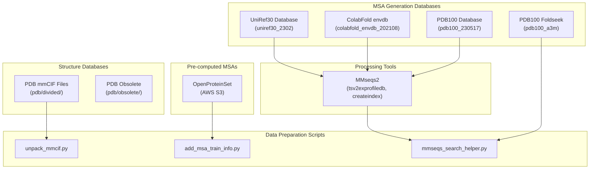
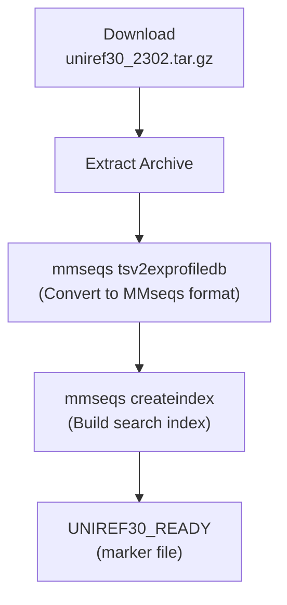
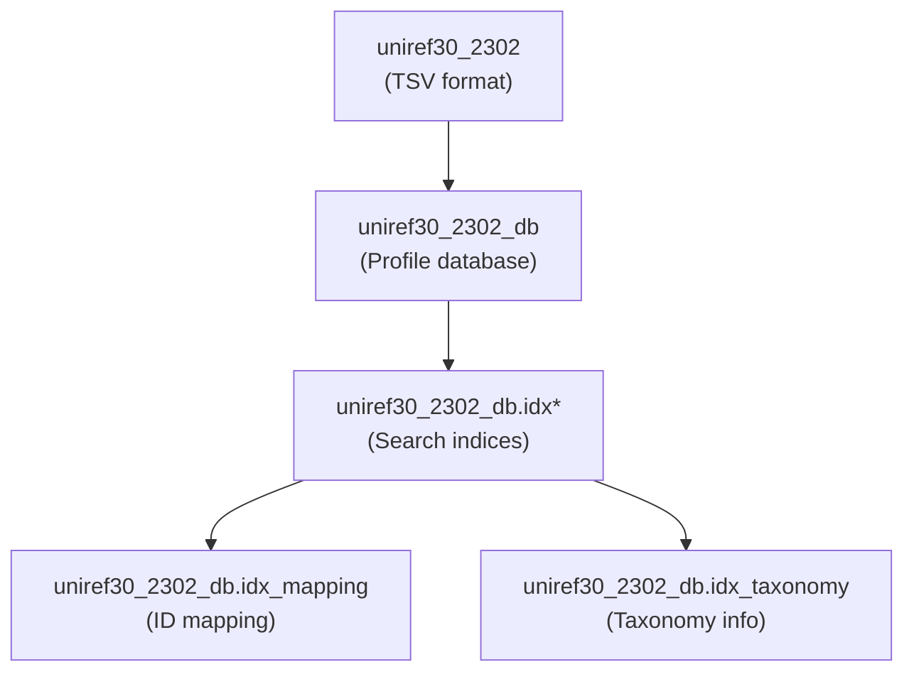
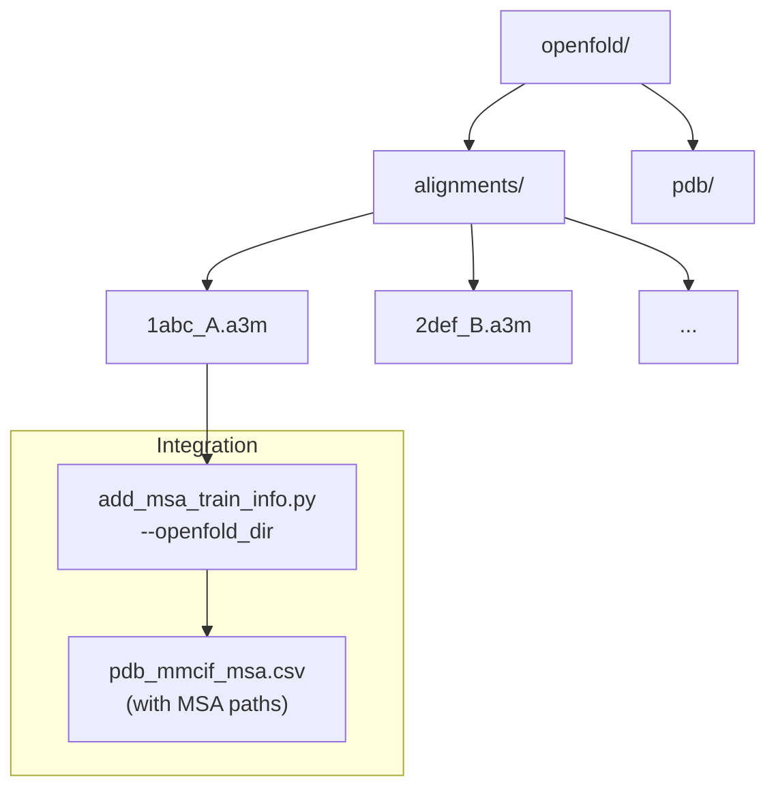
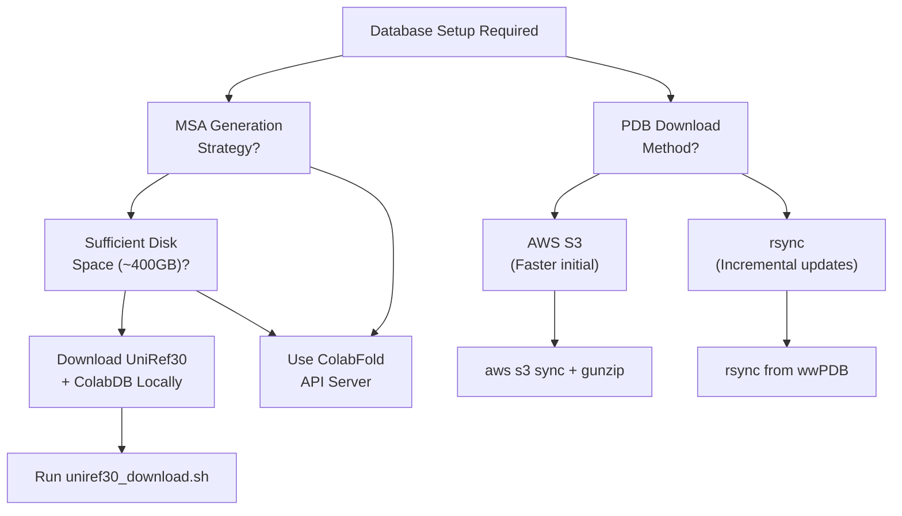
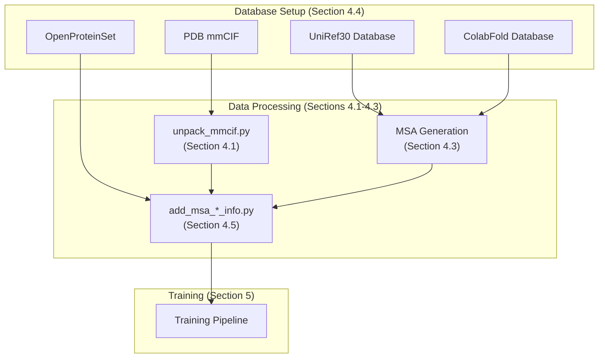

# Database Setup and Management

> **Relevant source files**
> * [README.md](https://github.com/PeptoneLtd/PepTron/blob/8123ab15/README.md?plain=1)
> * [dataprep/uniref30_download.sh](https://github.com/PeptoneLtd/PepTron/blob/8123ab15/dataprep/uniref30_download.sh)

## Purpose and Scope

This page documents the setup and management of the external databases required for PepTron training and MSA (Multiple Sequence Alignment) generation. These databases provide the raw biological data that feeds the data preparation pipeline described in [section 4](/PeptoneLtd/PepTron/4-data-preparation-pipeline).

For information about processing PDB structures after download, see [PDB Dataset Processing](/PeptoneLtd/PepTron/4.1-pdb-dataset-processing). For MSA generation procedures that use these databases, see [MSA Generation](/PeptoneLtd/PepTron/4.3-multiple-sequence-alignment-(msa)-generation).

## Overview

PepTron's data preparation pipeline requires four primary databases:

| Database | Purpose | Size (approx.) | Access Method |
| --- | --- | --- | --- |
| **UniRef30** | Sequence database for local MSA searches | ~100 GB compressed | HTTP download |
| **ColabFold envdb** | Environmental sequences for MSA enrichment | ~100 GB compressed | HTTP download |
| **PDB mmCIF** | Protein structure files | ~200 GB | AWS S3 or rsync |
| **OpenProteinSet** | Pre-computed MSA alignments for PDB chains | ~1 TB | AWS S3 |

These databases enable two MSA generation strategies:

1. **Local search**: Using downloaded UniRef30 and ColabFold databases with MMseqs2
2. **Remote search**: Querying the ColabFold API server (no database download required)

## Database Architecture



**Sources:** [README.md L83-L107](https://github.com/PeptoneLtd/PepTron/blob/8123ab15/README.md?plain=1#L83-L107)

 [dataprep/uniref30_download.sh L1-L144](https://github.com/PeptoneLtd/PepTron/blob/8123ab15/dataprep/uniref30_download.sh#L1-L144)

## UniRef30 Database Setup

### Download and Preparation

The UniRef30 database (`uniref30_2302`) provides the primary sequence database for local MSA generation. The automated setup script handles download and indexing.



### Setup Procedure

The `uniref30_download.sh` script automates UniRef30 setup:

| Step | Command | Output |
| --- | --- | --- |
| Download | Downloads from `https://wwwuser.gwdg.de/~compbiol/colabfold/` | `uniref30_2302.tar.gz` |
| Extract | `tar xzvf` | `uniref30_2302/` directory |
| Convert | `mmseqs tsv2exprofiledb` | `uniref30_2302_db` (MMseqs format) |
| Index | `mmseqs createindex` | `uniref30_2302_db.idx` files |

```python
# Run from desired database directorybash dataprep/uniref30_download.sh /path/to/database/workdir
```

The script creates the following marker files to track completion:

* `DOWNLOADS_READY`: Download phase complete
* `UNIREF30_READY`: Processing complete

**Sources:** [dataprep/uniref30_download.sh L62-L115](https://github.com/PeptoneLtd/PepTron/blob/8123ab15/dataprep/uniref30_download.sh#L62-L115)

 [README.md L89](https://github.com/PeptoneLtd/PepTron/blob/8123ab15/README.md?plain=1#L89-L89)

### Database Format Conversion

The `mmseqs tsv2exprofiledb` command converts the raw UniRef30 TSV format to an MMseqs-compatible profile database:



The conversion enables efficient sequence searches with optional GPU acceleration via `--gpu 1` flag.

**Sources:** [dataprep/uniref30_download.sh L103-L114](https://github.com/PeptoneLtd/PepTron/blob/8123ab15/dataprep/uniref30_download.sh#L103-L114)

## ColabFold Environment Database Setup

### Download and Indexing

The ColabFold environmental database (`colabfold_envdb_202108`) supplements UniRef30 with metagenomic sequences:

```markdown
# Automated by uniref30_download.shdownloadFile "https://wwwuser.gwdg.de/~compbiol/colabfold/colabfold_envdb_202108.tar.gz"tar xzvf colabfold_envdb_202108.tar.gzmmseqs tsv2exprofiledb "colabfold_envdb_202108" "colabfold_envdb_202108_db"mmseqs createindex "colabfold_envdb_202108_db" tmp2 --remove-tmp-files 1
```

The script tracks completion with the `COLABDB_READY` marker file.

### Database Structure

| Component | Path | Description |
| --- | --- | --- |
| Raw data | `colabfold_envdb_202108/` | Original TSV files |
| Profile DB | `colabfold_envdb_202108_db` | MMseqs profile database |
| Index files | `colabfold_envdb_202108_db.idx*` | Search acceleration structures |

**Sources:** [dataprep/uniref30_download.sh L117-L125](https://github.com/PeptoneLtd/PepTron/blob/8123ab15/dataprep/uniref30_download.sh#L117-L125)

 [dataprep/uniref30_download.sh L64](https://github.com/PeptoneLtd/PepTron/blob/8123ab15/dataprep/uniref30_download.sh#L64-L64)

## PDB Structure Database Setup

### Download Methods

The PDB mmCIF database can be acquired via two methods:

#### Method 1: AWS S3 (Faster Initial Download)

```markdown
# Download PDB snapshotaws s3 sync --no-sign-request \  s3://pdbsnapshots/20230102/pub/pdb/data/structures/divided/mmCIF \  pdb_mmcif # Extract compressed filesfind pdb_mmcif -name '*.gz' | xargs gunzip
```

#### Method 2: rsync (Incremental Updates)

The `uniref30_download.sh` script uses rsync for PDB synchronization:

```sql
rsync -rlpt -v -z --delete \  --port=33444 \  rsync.wwpdb.org::ftp/data/structures/divided/mmCIF/ \  pdb/divided
```

**Sources:** [README.md L85-L86](https://github.com/PeptoneLtd/PepTron/blob/8123ab15/README.md?plain=1#L85-L86)

 [dataprep/uniref30_download.sh L70-L80](https://github.com/PeptoneLtd/PepTron/blob/8123ab15/dataprep/uniref30_download.sh#L70-L80)

### Directory Structure

```

```

The PDB organizes mmCIF files in subdirectories based on the middle two characters of the PDB ID (e.g., `1abc` → `pdb/divided/ab/1abc.cif.gz`).

**Sources:** [dataprep/uniref30_download.sh L71-L79](https://github.com/PeptoneLtd/PepTron/blob/8123ab15/dataprep/uniref30_download.sh#L71-L79)

### Automated Setup Script

The `uniref30_download.sh` script manages PDB downloads with optional AWS acceleration:

| Variable | Purpose | Default |
| --- | --- | --- |
| `PDB_SERVER` | rsync server address | `rsync.wwpdb.org::ftp` |
| `PDB_PORT` | rsync port | `33444` |
| `PDB_AWS_DOWNLOAD` | Enable S3 initial download | (empty, disabled) |
| `PDB_AWS_SNAPSHOT` | S3 snapshot date | `20240101` |

```markdown
# With AWS accelerationPDB_AWS_DOWNLOAD=1 bash dataprep/uniref30_download.sh /path/to/workdir # rsync onlybash dataprep/uniref30_download.sh /path/to/workdir
```

Completion is marked by the `PDB_MMCIF_READY` file.

**Sources:** [dataprep/uniref30_download.sh L7-L80](https://github.com/PeptoneLtd/PepTron/blob/8123ab15/dataprep/uniref30_download.sh#L7-L80)

## OpenProteinSet MSA Database

### Overview

OpenProteinSet provides pre-computed MSAs for PDB training data, eliminating the need to regenerate alignments during data preparation.

### Download Procedure

```python
# Download from AWS S3 (no sign-in required)aws s3 sync --no-sign-request \  s3://openfold/openfold \  /path/to/openfold_dir
```

### Directory Structure



### Integration with Data Pipeline

After downloading OpenProteinSet, integrate it using `add_msa_train_info.py`:

```
python -m dataprep.add_msa_train_info --openfold_dir /path/to/openfold
```

This updates `pdb_mmcif.csv` to `pdb_mmcif_msa.csv` with MSA file path references.

**Sources:** [README.md L91-L92](https://github.com/PeptoneLtd/PepTron/blob/8123ab15/README.md?plain=1#L91-L92)

## PDB100 Databases

### PDB100 Sequence Database

The PDB100 database contains representative PDB sequences for additional MSA features:

```markdown
# Created by uniref30_download.shmmseqs createdb pdb100_230517.fasta.gz pdb100_230517mmseqs createindex pdb100_230517 tmp3 --remove-tmp-files 1
```

### PDB100 Foldseek Database

Pre-computed PDB100 alignments in A3M format:

```markdown
# Extracted by uniref30_download.shtar xzvf pdb100_foldseek_230517.tar.gz pdb100_a3m.ffdata pdb100_a3m.ffindex
```

| File | Description |
| --- | --- |
| `pdb100_a3m.ffdata` | Alignment data (binary) |
| `pdb100_a3m.ffindex` | Alignment index |

**Sources:** [dataprep/uniref30_download.sh L127-L144](https://github.com/PeptoneLtd/PepTron/blob/8123ab15/dataprep/uniref30_download.sh#L127-L144)

 [dataprep/uniref30_download.sh L65-L66](https://github.com/PeptoneLtd/PepTron/blob/8123ab15/dataprep/uniref30_download.sh#L65-L66)

## Database Management

### Download Strategy Selection



**Sources:** [README.md L88-L89](https://github.com/PeptoneLtd/PepTron/blob/8123ab15/README.md?plain=1#L88-L89)

 [dataprep/uniref30_download.sh L33-L37](https://github.com/PeptoneLtd/PepTron/blob/8123ab15/dataprep/uniref30_download.sh#L33-L37)

### Environment Variables

The `uniref30_download.sh` script accepts configuration via environment variables:

| Variable | Purpose | Default |
| --- | --- | --- |
| `MMSEQS_NO_INDEX` | Skip index creation (saves time/disk) | (empty) |
| `DOWNLOADS_ONLY` | Download files without processing | (empty) |
| `GPU` | Enable GPU acceleration for MMseqs | (empty) |
| `MMSEQS_FORCE_MERGE` | Force database merging | `1` |
| `ARIA_NUM_CONN` | aria2c download connections | `8` |

```markdown
# Example: Download only, skip processingDOWNLOADS_ONLY=1 bash dataprep/uniref30_download.sh /workdir # Example: Enable GPU accelerationGPU=1 bash dataprep/uniref30_download.sh /workdir
```

**Sources:** [dataprep/uniref30_download.sh L1-L100](https://github.com/PeptoneLtd/PepTron/blob/8123ab15/dataprep/uniref30_download.sh#L1-L100)

### Directory Organization

Recommended database layout for PepTron training:

```markdown
/data/
├── databases/
│   ├── uniref30_2302_db           # UniRef30 MMseqs DB
│   ├── colabfold_envdb_202108_db  # ColabFold MMseqs DB
│   ├── pdb100_230517              # PDB100 MMseqs DB
│   ├── pdb100_a3m.ffdata          # PDB100 Foldseek alignments
│   └── pdb100_a3m.ffindex
├── pdb/
│   ├── divided/                    # PDB mmCIF files
│   │   ├── ab/
│   │   ├── cd/
│   │   └── ...
│   └── obsolete/
├── openfold/                       # OpenProteinSet
│   └── alignments/
│       ├── 1abc_A.a3m
│       └── ...
└── processed/
    ├── pdb_mmcif_npz/              # Processed NPZ files
    ├── pdb_mmcif_msa.csv           # PDB index with MSA paths
    └── pdb_clusters                 # Sequence clustering
```

**Sources:** [README.md L140-L157](https://github.com/PeptoneLtd/PepTron/blob/8123ab15/README.md?plain=1#L140-L157)

### Storage Requirements

| Database | Compressed | Uncompressed | After MMseqs Processing |
| --- | --- | --- | --- |
| UniRef30 | ~50 GB | ~100 GB | ~150 GB (with index) |
| ColabFold envdb | ~50 GB | ~100 GB | ~150 GB (with index) |
| PDB mmCIF | ~60 GB | ~200 GB | ~200 GB |
| OpenProteinSet | N/A | ~1 TB | ~1 TB |
| **Total** | ~160 GB | ~1.4 TB | ~1.65 TB |

### Verification and Troubleshooting

Check database setup completion using marker files:

```markdown
# Verify all databases are readyls -la /database/workdir/*_READY # Expected output:# DOWNLOADS_READY   - Download phase complete# UNIREF30_READY    - UniRef30 processing complete  # COLABDB_READY     - ColabFold processing complete# PDB_READY         - PDB100 processing complete# PDB100_READY      - PDB100 Foldseek extraction complete# PDB_MMCIF_READY   - PDB mmCIF download complete
```

Common issues:

| Issue | Cause | Solution |
| --- | --- | --- |
| Download failures | Network interruption | Script auto-retries with aria2c/curl/wget |
| Insufficient disk space | Large database sizes | Use `DOWNLOADS_ONLY=1` and process incrementally |
| Missing MMseqs GPU support | Old MMseqs version | Update to MMseqs2 release 16+ |
| Index creation timeout | Limited memory | Set `MMSEQS_NO_INDEX=1` to skip indexing |

**Sources:** [dataprep/uniref30_download.sh L62-L144](https://github.com/PeptoneLtd/PepTron/blob/8123ab15/dataprep/uniref30_download.sh#L62-L144)

 [dataprep/uniref30_download.sh L95-L100](https://github.com/PeptoneLtd/PepTron/blob/8123ab15/dataprep/uniref30_download.sh#L95-L100)

## Integration with Data Preparation Pipeline



Once databases are set up, proceed to:

* [PDB Dataset Processing](/PeptoneLtd/PepTron/4.1-pdb-dataset-processing) for structure file processing
* [MSA Generation](/PeptoneLtd/PepTron/4.3-multiple-sequence-alignment-(msa)-generation) for alignment generation
* [Dataset Utilities](/PeptoneLtd/PepTron/4.5-dataset-utilities) for final data preparation

**Sources:** [README.md L84-L107](https://github.com/PeptoneLtd/PepTron/blob/8123ab15/README.md?plain=1#L84-L107)