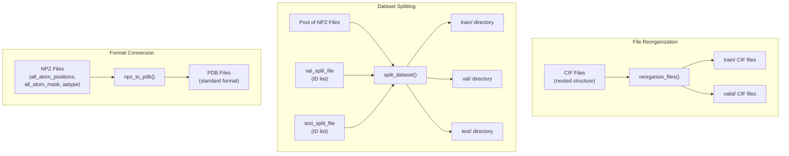
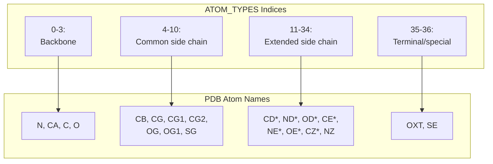
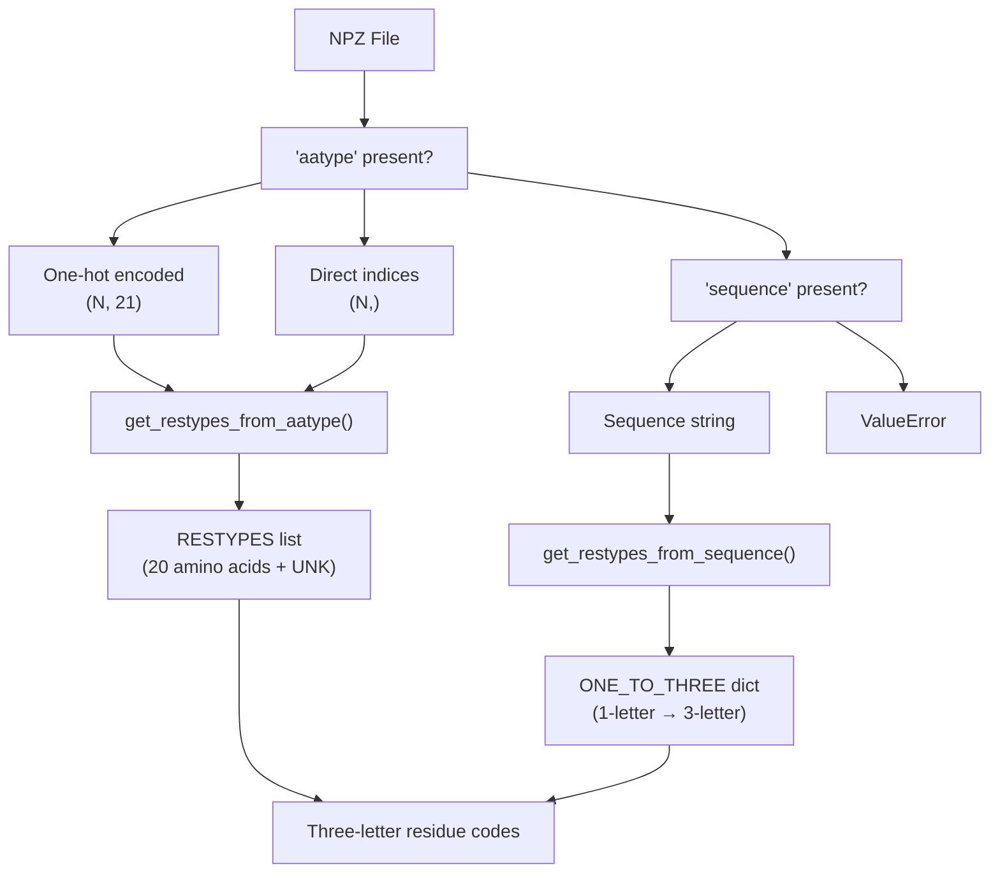
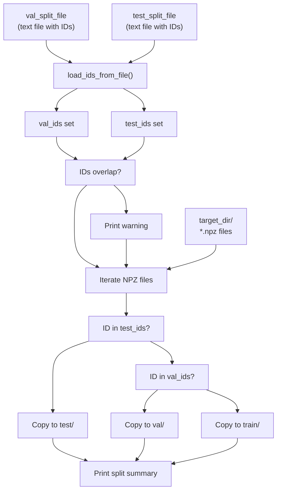
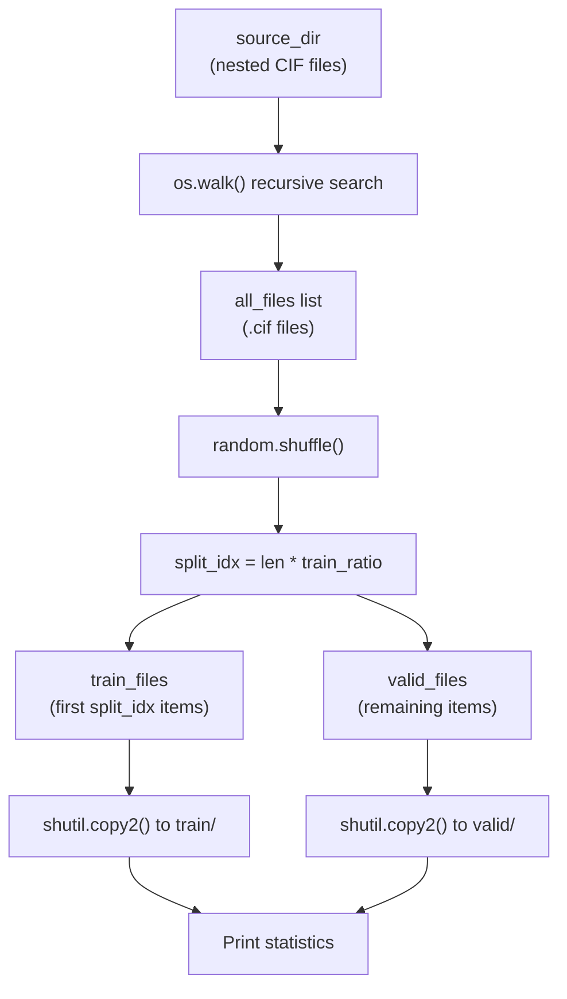
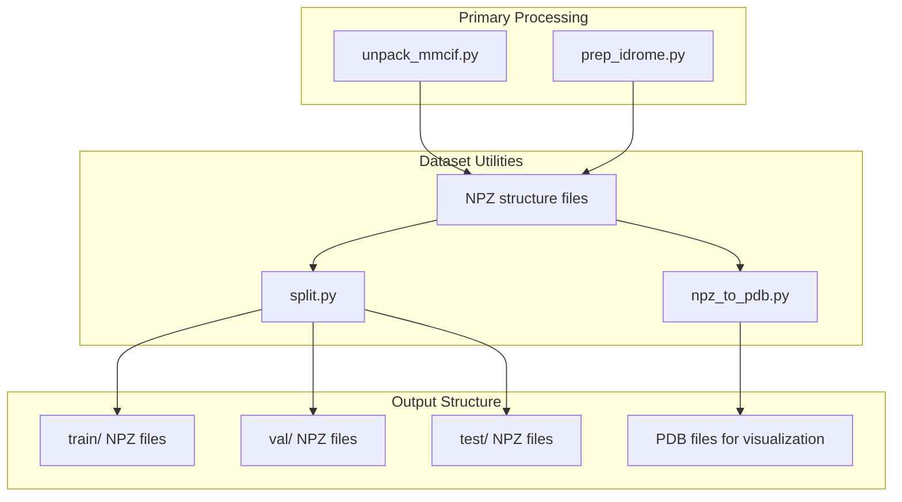

# Dataset Utilities

> **Relevant source files**
> * [dataprep/npz_to_pdb.py](https://github.com/PeptoneLtd/PepTron/blob/8123ab15/dataprep/npz_to_pdb.py)
> * [dataprep/preprocess.py](https://github.com/PeptoneLtd/PepTron/blob/8123ab15/dataprep/preprocess.py)
> * [dataprep/split.py](https://github.com/PeptoneLtd/PepTron/blob/8123ab15/dataprep/split.py)

## Purpose and Scope

This page documents helper scripts and utilities for data manipulation, format conversion, and dataset organization within the PepTron data preparation pipeline. These utilities support the processed outputs from PDB processing ([4.1](/PeptoneLtd/PepTron/4.1-pdb-dataset-processing)), IDRome-o processing ([4.2](/PeptoneLtd/PepTron/4.2-idrome-o-dataset-processing)), and MSA generation ([4.3](/PeptoneLtd/PepTron/4.3-multiple-sequence-alignment-(msa)-generation)) by providing tools for:

* Converting between NPZ and PDB file formats
* Splitting datasets into train/validation/test sets
* Reorganizing file structures for training pipelines

For information about the primary data processing workflows, see the respective dataset processing pages ([4.1](/PeptoneLtd/PepTron/4.1-pdb-dataset-processing), [4.2](/PeptoneLtd/PepTron/4.2-idrome-o-dataset-processing)). For training data configuration, see [5.2](/PeptoneLtd/PepTron/5.2-data-mixing-strategy).

---

## Utility Scripts Overview

The dataset utilities consist of three primary scripts located in the `dataprep/` directory:

| Script | Purpose | Key Function |
| --- | --- | --- |
| `npz_to_pdb.py` | Format conversion | Convert NPZ structure files to standard PDB format |
| `split.py` | Dataset organization | Split NPZ files into train/val/test directories based on ID lists |
| `preprocess.py` | File reorganization | Random train/valid split of CIF files |



**Sources:** [dataprep/npz_to_pdb.py L1-L172](https://github.com/PeptoneLtd/PepTron/blob/8123ab15/dataprep/npz_to_pdb.py#L1-L172)

 [dataprep/split.py L1-L109](https://github.com/PeptoneLtd/PepTron/blob/8123ab15/dataprep/split.py#L1-L109)

 [dataprep/preprocess.py L1-L50](https://github.com/PeptoneLtd/PepTron/blob/8123ab15/dataprep/preprocess.py#L1-L50)

---

## Format Conversion: NPZ to PDB

### Purpose

The `npz_to_pdb.py` script converts protein structure data from the NPZ format (used internally by PepTron for efficient I/O) to standard PDB format for visualization and analysis with external tools.

### NPZ Structure Requirements

The script expects NPZ files with the following keys:

| Key | Shape | Description |
| --- | --- | --- |
| `all_atom_positions` | `(N, 37, 3)` | Cartesian coordinates for all atoms |
| `all_atom_mask` | `(N, 37)` | Binary mask indicating atom presence |
| `aatype` or `sequence` | `(N, 21)` or `(N,)` | Residue type information (one-hot or indices) |
| `residue_index` | `(N,)` | Optional: residue numbering |
| `domain_name` | `(1,)` | Optional: structure identifier |
| `resolution` | `(1,)` | Optional: experimental resolution |

Where `N` is the number of residues and `37` represents the maximum number of atoms per residue in the standard representation.

### Atom Type Mapping

The converter uses predefined atom type mappings defined at [dataprep/npz_to_pdb.py L11-L20](https://github.com/PeptoneLtd/PepTron/blob/8123ab15/dataprep/npz_to_pdb.py#L11-L20)

:



**Sources:** [dataprep/npz_to_pdb.py L11-L20](https://github.com/PeptoneLtd/PepTron/blob/8123ab15/dataprep/npz_to_pdb.py#L11-L20)

### Residue Type Resolution

The script supports two methods for determining residue types:

1. **One-hot encoded `aatype`**: [dataprep/npz_to_pdb.py L86-L91](https://github.com/PeptoneLtd/PepTron/blob/8123ab15/dataprep/npz_to_pdb.py#L86-L91) * Uses `get_restypes_from_aatype()` function [dataprep/npz_to_pdb.py L44-L46](https://github.com/PeptoneLtd/PepTron/blob/8123ab15/dataprep/npz_to_pdb.py#L44-L46) * Converts 21-dimensional one-hot vectors to three-letter codes via `RESTYPES` [dataprep/npz_to_pdb.py L24-L30](https://github.com/PeptoneLtd/PepTron/blob/8123ab15/dataprep/npz_to_pdb.py#L24-L30)
2. **Direct `sequence` string**: [dataprep/npz_to_pdb.py L92-L95](https://github.com/PeptoneLtd/PepTron/blob/8123ab15/dataprep/npz_to_pdb.py#L92-L95) * Uses `get_restypes_from_sequence()` function [dataprep/npz_to_pdb.py L48-L50](https://github.com/PeptoneLtd/PepTron/blob/8123ab15/dataprep/npz_to_pdb.py#L48-L50) * Converts one-letter codes to three-letter codes via `ONE_TO_THREE` mapping [dataprep/npz_to_pdb.py L42](https://github.com/PeptoneLtd/PepTron/blob/8123ab15/dataprep/npz_to_pdb.py#L42-L42)



**Sources:** [dataprep/npz_to_pdb.py L44-L50](https://github.com/PeptoneLtd/PepTron/blob/8123ab15/dataprep/npz_to_pdb.py#L44-L50)

 [dataprep/npz_to_pdb.py L86-L97](https://github.com/PeptoneLtd/PepTron/blob/8123ab15/dataprep/npz_to_pdb.py#L86-L97)

### Conversion Function

The main conversion is performed by the `npz_to_pdb()` function [dataprep/npz_to_pdb.py L52-L156](https://github.com/PeptoneLtd/PepTron/blob/8123ab15/dataprep/npz_to_pdb.py#L52-L156)

:

**Function Signature:**

```python
def npz_to_pdb(npz_path, output_path=None, chain_id="A")
```

**Parameters:**

* `npz_path`: Path to input NPZ file
* `output_path`: Optional output PDB path (defaults to input path with `.pdb` extension)
* `chain_id`: Chain identifier for PDB file (default: `"A"`)

**Conversion Process:**

1. **Load NPZ data** [dataprep/npz_to_pdb.py L75-L76](https://github.com/PeptoneLtd/PepTron/blob/8123ab15/dataprep/npz_to_pdb.py#L75-L76)
2. **Extract atom positions and masks** [dataprep/npz_to_pdb.py L82-L83](https://github.com/PeptoneLtd/PepTron/blob/8123ab15/dataprep/npz_to_pdb.py#L82-L83)
3. **Determine residue types** [dataprep/npz_to_pdb.py L86-L97](https://github.com/PeptoneLtd/PepTron/blob/8123ab15/dataprep/npz_to_pdb.py#L86-L97)
4. **Generate or extract residue indices** [dataprep/npz_to_pdb.py L100-L103](https://github.com/PeptoneLtd/PepTron/blob/8123ab15/dataprep/npz_to_pdb.py#L100-L103)
5. **Write PDB header** [dataprep/npz_to_pdb.py L107-L117](https://github.com/PeptoneLtd/PepTron/blob/8123ab15/dataprep/npz_to_pdb.py#L107-L117)
6. **Write ATOM records** [dataprep/npz_to_pdb.py L119-L150](https://github.com/PeptoneLtd/PepTron/blob/8123ab15/dataprep/npz_to_pdb.py#L119-L150) * Iterate through residues and atoms * Skip masked atoms (where `all_atom_mask[i, j] < 0.5`) * Format coordinates and atom names according to PDB specification
7. **Write END marker** [dataprep/npz_to_pdb.py L152-L153](https://github.com/PeptoneLtd/PepTron/blob/8123ab15/dataprep/npz_to_pdb.py#L152-L153)

**Command-line Usage:**

```
python dataprep/npz_to_pdb.py <npz_file> [--output OUTPUT] [--chain CHAIN]
```

**Sources:** [dataprep/npz_to_pdb.py L52-L172](https://github.com/PeptoneLtd/PepTron/blob/8123ab15/dataprep/npz_to_pdb.py#L52-L172)

---

## Dataset Splitting

### Split Script Overview

The `split.py` script [dataprep/split.py L1-L109](https://github.com/PeptoneLtd/PepTron/blob/8123ab15/dataprep/split.py#L1-L109)

 provides functionality to split a pool of NPZ structure files into train, validation, and test sets based on predefined ID lists. This is the primary method for creating structured dataset splits with explicit control over which structures go into each partition.

### Split Function

The core function is `split_dataset()` [dataprep/split.py L16-L90](https://github.com/PeptoneLtd/PepTron/blob/8123ab15/dataprep/split.py#L16-L90)

:

**Function Signature:**

```python
def split_dataset(    target_dir: Path,    output_dir: Path,    val_split_file: Optional[Path] = None,    test_split_file: Optional[Path] = None,) -> tuple[list[str], list[str], list[str]]
```

**Parameters:**

* `target_dir`: Directory containing source NPZ files
* `output_dir`: Destination directory (will create `train/`, `val/`, `test/` subdirectories)
* `val_split_file`: Optional file containing validation set IDs (one per line)
* `test_split_file`: Optional file containing test set IDs (one per line)

**Returns:** Tuple of `(train_records, val_records, test_records)` containing the IDs assigned to each split



**Sources:** [dataprep/split.py L16-L90](https://github.com/PeptoneLtd/PepTron/blob/8123ab15/dataprep/split.py#L16-L90)

### ID Loading Helper

The `load_ids_from_file()` helper function [dataprep/split.py L8-L13](https://github.com/PeptoneLtd/PepTron/blob/8123ab15/dataprep/split.py#L8-L13)

 reads ID lists from text files:

**Implementation Details:**

* Reads one ID per line
* Converts all IDs to lowercase for case-insensitive matching
* Strips whitespace
* Returns a Python `set` for efficient lookup
* Returns empty set if file path is `None`

### Split Assignment Logic

The split assignment follows this priority order [dataprep/split.py L74-L82](https://github.com/PeptoneLtd/PepTron/blob/8123ab15/dataprep/split.py#L74-L82)

:

1. If structure ID (filename stem) is in `test_ids` → assign to test set
2. Else if structure ID is in `val_ids` → assign to validation set
3. Else → assign to training set (default)

**Overlap Detection:** The script checks for IDs present in both validation and test sets and prints a warning if found [dataprep/split.py L59-L62](https://github.com/PeptoneLtd/PepTron/blob/8123ab15/dataprep/split.py#L59-L62)

 but does not prevent the split from proceeding.

### Command-line Usage

```
python dataprep/split.py <target_dir> <output_dir> \    [--val-split-file VAL_IDS.txt] \    [--test-split-file TEST_IDS.txt]
```

**Example:**

```
python dataprep/split.py \    /data/pdb_npz \    /data/pdb_split \    --val-split-file cameo2022_ids.txt \    --test-split-file casp15_ids.txt
```

**Sources:** [dataprep/split.py L93-L108](https://github.com/PeptoneLtd/PepTron/blob/8123ab15/dataprep/split.py#L93-L108)

---

## File Reorganization

### Preprocess Script

The `preprocess.py` script [dataprep/preprocess.py L1-L50](https://github.com/PeptoneLtd/PepTron/blob/8123ab15/dataprep/preprocess.py#L1-L50)

 provides a simpler alternative for creating train/validation splits using random sampling, primarily designed for CIF file organization.

### Reorganization Function

The `reorganize_files()` function [dataprep/preprocess.py L5-L40](https://github.com/PeptoneLtd/PepTron/blob/8123ab15/dataprep/preprocess.py#L5-L40)

 performs random train/validation splitting:

**Function Signature:**

```python
def reorganize_files(source_dir, dest_dir, train_ratio=0.7)
```

**Parameters:**

* `source_dir`: Root directory containing CIF files (searched recursively)
* `dest_dir`: Destination directory (creates `train/` and `valid/` subdirectories)
* `train_ratio`: Fraction of files to assign to training set (default: 0.7)

**Process Flow:**



**Sources:** [dataprep/preprocess.py L5-L40](https://github.com/PeptoneLtd/PepTron/blob/8123ab15/dataprep/preprocess.py#L5-L40)

### Implementation Details

1. **File Collection** [dataprep/preprocess.py L12-L17](https://github.com/PeptoneLtd/PepTron/blob/8123ab15/dataprep/preprocess.py#L12-L17) : * Uses `os.walk()` for recursive directory traversal * Filters for files ending with `.cif` * Collects full paths to all matching files
2. **Random Shuffling** [dataprep/preprocess.py L19-L20](https://github.com/PeptoneLtd/PepTron/blob/8123ab15/dataprep/preprocess.py#L19-L20) : * Applies in-place shuffle to file list * Can set random seed for reproducibility [dataprep/preprocess.py L48](https://github.com/PeptoneLtd/PepTron/blob/8123ab15/dataprep/preprocess.py#L48-L48)
3. **Split Calculation** [dataprep/preprocess.py L22-L27](https://github.com/PeptoneLtd/PepTron/blob/8123ab15/dataprep/preprocess.py#L22-L27) : * Computes split index as `int(len(all_files) * train_ratio)` * Partitions list at split index
4. **File Copying** [dataprep/preprocess.py L29-L36](https://github.com/PeptoneLtd/PepTron/blob/8123ab15/dataprep/preprocess.py#L29-L36) : * Uses `shutil.copy2()` to preserve metadata * Flattens directory structure (all files go to top level of train/valid)

### Usage Example

The script includes a hardcoded usage example [dataprep/preprocess.py L43-L50](https://github.com/PeptoneLtd/PepTron/blob/8123ab15/dataprep/preprocess.py#L43-L50)

:

```markdown
source_directory = "/mnt/data/datasets/pdb_mmcif"destination_directory = "/mnt/data/datasets/pdb_mmcif_full"random.seed(42)  # For reproducibilityreorganize_files(source_directory, destination_directory)
```

**Note:** This script is designed for initial file organization and does not provide the fine-grained control of `split.py`. For production splits with specific validation/test sets, use `split.py` instead.

**Sources:** [dataprep/preprocess.py L1-L50](https://github.com/PeptoneLtd/PepTron/blob/8123ab15/dataprep/preprocess.py#L1-L50)

---

## Utility Comparison

| Feature | `split.py` | `preprocess.py` |
| --- | --- | --- |
| **File Format** | NPZ | CIF |
| **Split Method** | ID list-based (deterministic) | Random sampling |
| **Split Types** | Train / Val / Test | Train / Valid |
| **Directory Structure** | Flat input → flat output | Nested input → flat output |
| **Use Case** | Production splits with explicit control | Quick random splits for experimentation |
| **Reproducibility** | Based on ID lists | Based on random seed |
| **Temporal Splits** | Supported (via ID lists) | Not supported |

**Sources:** [dataprep/split.py L1-L109](https://github.com/PeptoneLtd/PepTron/blob/8123ab15/dataprep/split.py#L1-L109)

 [dataprep/preprocess.py L1-L50](https://github.com/PeptoneLtd/PepTron/blob/8123ab15/dataprep/preprocess.py#L1-L50)

---

## Integration with Data Pipeline

These utilities are typically used after the primary data processing stages:



**Typical Workflow:**

1. Process raw data using `unpack_mmcif.py` or `prep_idrome.py` (see [4.1](/PeptoneLtd/PepTron/4.1-pdb-dataset-processing), [4.2](/PeptoneLtd/PepTron/4.2-idrome-o-dataset-processing))
2. Generate cluster-based split IDs using `cluster_chains.py` for temporal validation (see [4.1](/PeptoneLtd/PepTron/4.1-pdb-dataset-processing))
3. Apply `split.py` to organize NPZ files into train/val/test directories
4. Optionally convert samples to PDB format using `npz_to_pdb.py` for visualization

**Sources:** [dataprep/npz_to_pdb.py L1-L172](https://github.com/PeptoneLtd/PepTron/blob/8123ab15/dataprep/npz_to_pdb.py#L1-L172)

 [dataprep/split.py L1-L109](https://github.com/PeptoneLtd/PepTron/blob/8123ab15/dataprep/split.py#L1-L109)

 [dataprep/preprocess.py L1-L50](https://github.com/PeptoneLtd/PepTron/blob/8123ab15/dataprep/preprocess.py#L1-L50)