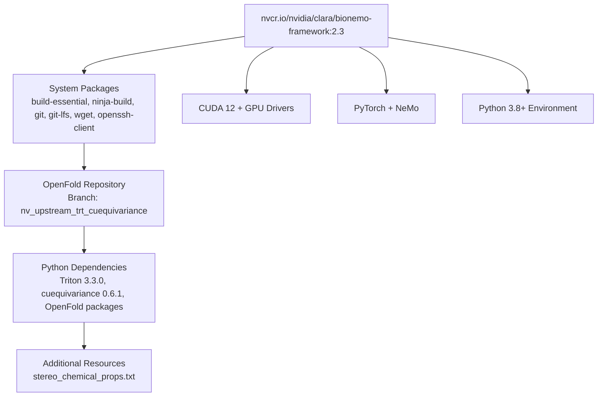
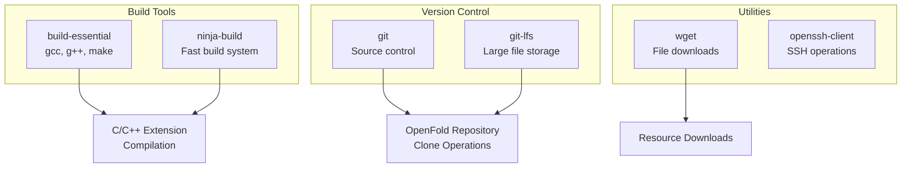
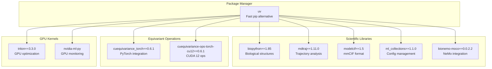
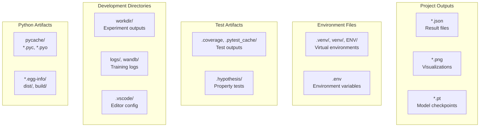
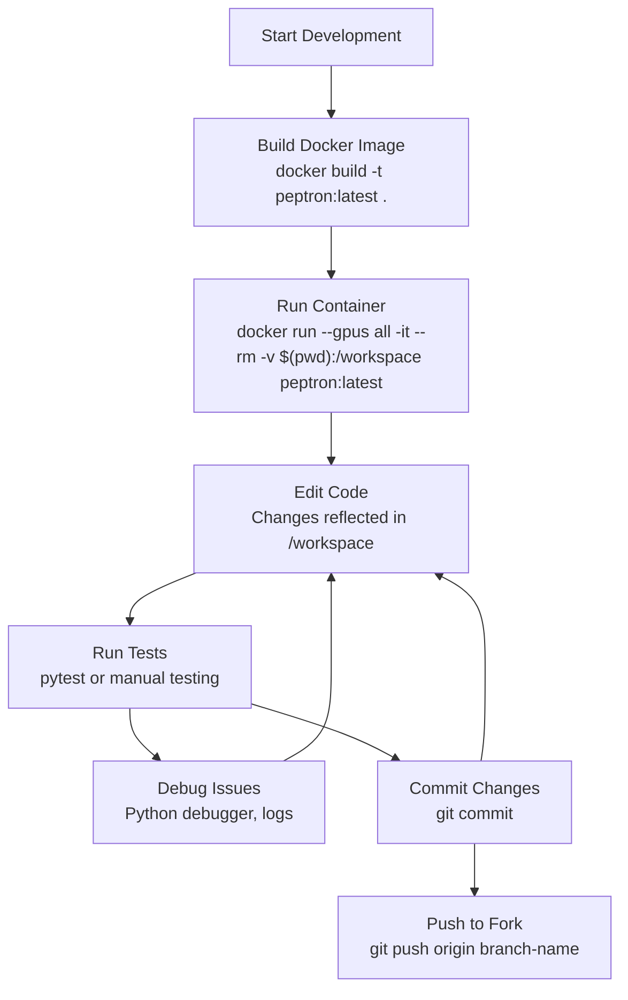

# Development Environment

> **Relevant source files**
> * [.gitignore](https://github.com/PeptoneLtd/PepTron/blob/8123ab15/.gitignore)
> * [CONTRIBUTING.md](https://github.com/PeptoneLtd/PepTron/blob/8123ab15/CONTRIBUTING.md?plain=1)
> * [Dockerfile](https://github.com/PeptoneLtd/PepTron/blob/8123ab15/Dockerfile)

## Purpose and Scope

This page documents how to set up a development environment for contributing to PepTron. It covers the Docker-based containerized environment, all required dependencies, development tools, and the process of building and running the development container.

For general installation and usage instructions, see [Installation and Environment Setup](/PeptoneLtd/PepTron/2.1-installation-and-environment-setup). For the contribution process (branching, testing, pull requests), see [Contribution Guidelines](/PeptoneLtd/PepTron/9.2-contribution-guidelines).

---

## Overview

PepTron development uses a containerized environment built on NVIDIA BioNeMo Framework 2.3. This approach ensures:

* **Reproducibility**: All developers work with identical dependencies and configurations
* **GPU Support**: Pre-configured CUDA 12 and GPU drivers
* **Dependency Management**: Complex dependencies (OpenFold, Triton, cuequivariance) are pre-built
* **Isolation**: Development work does not interfere with host system packages

The entire development environment is defined in a single Dockerfile that orchestrates multiple installation stages.

**Sources**: [Dockerfile L1-L45](https://github.com/PeptoneLtd/PepTron/blob/8123ab15/Dockerfile#L1-L45)

 [CONTRIBUTING.md L18-L24](https://github.com/PeptoneLtd/PepTron/blob/8123ab15/CONTRIBUTING.md?plain=1#L18-L24)

---

## Docker-Based Environment Architecture

### Base Image and Layers



**Sources**: [Dockerfile L1-L45](https://github.com/PeptoneLtd/PepTron/blob/8123ab15/Dockerfile#L1-L45)

---

### Dockerfile Build Stages

The development environment is constructed through a sequential build process:

| Stage | Lines | Purpose | Key Operations |
| --- | --- | --- | --- |
| **Base Setup** | [Dockerfile L1-L4](https://github.com/PeptoneLtd/PepTron/blob/8123ab15/Dockerfile#L1-L4) | Import BioNeMo framework, switch to root | `FROM`, `USER root` |
| **System Dependencies** | [Dockerfile L5-L14](https://github.com/PeptoneLtd/PepTron/blob/8123ab15/Dockerfile#L5-L14) | Install build tools and utilities | `apt-get install build-essential ninja-build git git-lfs wget openssh-client` |
| **OpenFold Clone** | [Dockerfile L15-L20](https://github.com/PeptoneLtd/PepTron/blob/8123ab15/Dockerfile#L15-L20) | Clone specific OpenFold branch, set PYTHONPATH | `git clone -b nv_upstream_trt_cuequivariance` |
| **UV Installer** | [Dockerfile L21-L22](https://github.com/PeptoneLtd/PepTron/blob/8123ab15/Dockerfile#L21-L22) | Install fast Python package manager | `pip install uv` |
| **Triton Replacement** | [Dockerfile L23-L28](https://github.com/PeptoneLtd/PepTron/blob/8123ab15/Dockerfile#L23-L28) | Uninstall old Triton, install 3.3.0 | `pip uninstall -y triton && pip install triton==3.3.0` |
| **cuequivariance** | [Dockerfile L29-L31](https://github.com/PeptoneLtd/PepTron/blob/8123ab15/Dockerfile#L29-L31) | Install equivariant neural network library | `pip install cuequivariance_torch==0.6.1` |
| **Python Packages** | [Dockerfile L32-L36](https://github.com/PeptoneLtd/PepTron/blob/8123ab15/Dockerfile#L32-L36) | Install all Python dependencies | `uv pip install` with multiple packages |
| **Resources** | [Dockerfile L38-L40](https://github.com/PeptoneLtd/PepTron/blob/8123ab15/Dockerfile#L38-L40) | Download stereo chemical properties file | `wget stereo_chemical_props.txt` |
| **Verification** | [Dockerfile L41-L43](https://github.com/PeptoneLtd/PepTron/blob/8123ab15/Dockerfile#L41-L43) | Verify imports work correctly | `python -c "import openfold"` |

**Sources**: [Dockerfile L1-L45](https://github.com/PeptoneLtd/PepTron/blob/8123ab15/Dockerfile#L1-L45)

---

## Core Dependencies

### System-Level Packages



**Sources**: [Dockerfile L6-L13](https://github.com/PeptoneLtd/PepTron/blob/8123ab15/Dockerfile#L6-L13)

---

### OpenFold Integration

PepTron depends on a specific fork and branch of OpenFold:

* **Repository**: `https://github.com/borisfom/openfold.git`
* **Branch**: `nv_upstream_trt_cuequivariance`
* **Clone Location**: `/openfold2`
* **PYTHONPATH**: Set to `/openfold2` [Dockerfile L18](https://github.com/PeptoneLtd/PepTron/blob/8123ab15/Dockerfile#L18-L18)

This branch includes:

* TensorRT integration for inference optimization
* cuequivariance support for equivariant operations
* NVIDIA-specific optimizations

**Installation Steps**:

1. Initialize Git LFS [Dockerfile L16](https://github.com/PeptoneLtd/PepTron/blob/8123ab15/Dockerfile#L16-L16)
2. Clone single branch [Dockerfile L17](https://github.com/PeptoneLtd/PepTron/blob/8123ab15/Dockerfile#L17-L17)
3. Set PYTHONPATH environment variable [Dockerfile L18](https://github.com/PeptoneLtd/PepTron/blob/8123ab15/Dockerfile#L18-L18)
4. Install OpenFold in editable mode [Dockerfile L35](https://github.com/PeptoneLtd/PepTron/blob/8123ab15/Dockerfile#L35-L35)
5. Create `__init__.py` marker file [Dockerfile L37](https://github.com/PeptoneLtd/PepTron/blob/8123ab15/Dockerfile#L37-L37)

**Sources**: [Dockerfile L15-L37](https://github.com/PeptoneLtd/PepTron/blob/8123ab15/Dockerfile#L15-L37)

---

### Python Dependencies

#### Critical Version Constraints



#### Installation Sequence

The order of installation is critical due to dependency conflicts:

1. **Uninstall conflicts**: Remove old `triton` and `pynvml` [Dockerfile L25-L26](https://github.com/PeptoneLtd/PepTron/blob/8123ab15/Dockerfile#L25-L26)
2. **Install Triton 3.3.0**: Required version for CUDA kernel compatibility [Dockerfile L27](https://github.com/PeptoneLtd/PepTron/blob/8123ab15/Dockerfile#L27-L27)
3. **Install nvidia-ml-py**: Modern replacement for deprecated pynvml [Dockerfile L28](https://github.com/PeptoneLtd/PepTron/blob/8123ab15/Dockerfile#L28-L28)
4. **Install cuequivariance**: Core library for equivariant operations [Dockerfile L30-L31](https://github.com/PeptoneLtd/PepTron/blob/8123ab15/Dockerfile#L30-L31)
5. **Install base packages**: pip, wheel, setuptools [Dockerfile L33-L34](https://github.com/PeptoneLtd/PepTron/blob/8123ab15/Dockerfile#L33-L34)
6. **Install OpenFold**: Editable install with `--no-build-isolation` [Dockerfile L35](https://github.com/PeptoneLtd/PepTron/blob/8123ab15/Dockerfile#L35-L35)
7. **Install scientific packages**: Biopython, MDTraj, ModelCIF, etc. [Dockerfile L36](https://github.com/PeptoneLtd/PepTron/blob/8123ab15/Dockerfile#L36-L36)

**Sources**: [Dockerfile L21-L36](https://github.com/PeptoneLtd/PepTron/blob/8123ab15/Dockerfile#L21-L36)

---

### Additional Resources

The development environment downloads external resource files:

| Resource | Source | Destination | Purpose |
| --- | --- | --- | --- |
| `stereo_chemical_props.txt` | OpenStructure GitLab | `/openfold2/openfold/resources/` | Stereochemical validation parameters |

**Download Command**:

```
wget https://git.scicore.unibas.ch/schwede/openstructure/-/raw/7102c63615b64735c4941278d92b554ec94415f8/modules/mol/alg/src/stereo_chemical_props.txt
```

**Sources**: [Dockerfile L39-L40](https://github.com/PeptoneLtd/PepTron/blob/8123ab15/Dockerfile#L39-L40)

---

## Development Tools and Configuration

### Version Control Exclusions

The `.gitignore` file defines what development artifacts are excluded from version control:



**Key Exclusions**:

* **Experiment outputs**: `workdir/`, `logs/`, `wandb/` [.gitignore L166-L169](https://github.com/PeptoneLtd/PepTron/blob/8123ab15/.gitignore#L166-L169)
* **IDE configurations**: `.vscode/`, `.idea/` [.gitignore L162-L179](https://github.com/PeptoneLtd/PepTron/blob/8123ab15/.gitignore#L162-L179)
* **Data files**: `*.json`, `*.png` [.gitignore L180-L181](https://github.com/PeptoneLtd/PepTron/blob/8123ab15/.gitignore#L180-L181)
* **Environment files**: `.env`, `venv/`, `ENV/` [.gitignore L125-L131](https://github.com/PeptoneLtd/PepTron/blob/8123ab15/.gitignore#L125-L131)
* **Python artifacts**: `__pycache__/`, `*.egg-info/` [.gitignore L1-L27](https://github.com/PeptoneLtd/PepTron/blob/8123ab15/.gitignore#L1-L27)

**Sources**: [.gitignore L1-L183](https://github.com/PeptoneLtd/PepTron/blob/8123ab15/.gitignore#L1-L183)

---

## Building the Development Container

### Build Command

```
docker build -t peptron:latest .
```

This command:

* Reads the `Dockerfile` in the current directory
* Executes all build stages sequentially
* Tags the resulting image as `peptron:latest`
* Caches intermediate layers for faster rebuilds

**Build Time**: Initial build takes approximately 15-30 minutes depending on network speed and hardware.

**Sources**: [CONTRIBUTING.md L22](https://github.com/PeptoneLtd/PepTron/blob/8123ab15/CONTRIBUTING.md?plain=1#L22-L22)

---

### Running the Development Container

#### Basic Interactive Shell

```
docker run --gpus all -it --rm -v $(pwd):/workspace peptron:latest
```

**Parameter Breakdown**:

* `--gpus all`: Expose all GPU devices to the container
* `-it`: Interactive terminal with TTY
* `--rm`: Remove container on exit (keeps images, removes container instance)
* `-v $(pwd):/workspace`: Mount current directory to `/workspace` in container
* `peptron:latest`: Image name and tag

**Sources**: [CONTRIBUTING.md L23](https://github.com/PeptoneLtd/PepTron/blob/8123ab15/CONTRIBUTING.md?plain=1#L23-L23)

---

#### Advanced Run Options

For development workflows, you may need additional options:

| Option | Purpose | Example |
| --- | --- | --- |
| `--name peptron-dev` | Named container for reattachment | `docker run --name peptron-dev ...` |
| `-p 8888:8888` | Port forwarding for Jupyter/TensorBoard | `docker run -p 8888:8888 ...` |
| `--shm-size=8g` | Shared memory for multi-process data loading | `docker run --shm-size=8g ...` |
| `-e WANDB_API_KEY=...` | Environment variables | `docker run -e WANDB_API_KEY=xyz ...` |
| `--ipc=host` | Shared IPC namespace for PyTorch multiprocessing | `docker run --ipc=host ...` |

**Complete Development Command**:

```
docker run --gpus all -it --rm \  --name peptron-dev \  --shm-size=8g \  --ipc=host \  -v $(pwd):/workspace \  -e WANDB_API_KEY=$WANDB_API_KEY \  peptron:latest
```

**Sources**: [CONTRIBUTING.md L23](https://github.com/PeptoneLtd/PepTron/blob/8123ab15/CONTRIBUTING.md?plain=1#L23-L23)

---

## Verifying the Installation

The Dockerfile includes verification steps that run during build:

### Verification Commands

```javascript
# Verify Python path configurationpython -c "import sys; print(sys.path)" # Verify OpenFold importpython -c "import openfold; print(openfold.__file__)"
```

**Expected Output**:

* `sys.path` should include `/openfold2`
* `openfold.__file__` should point to `/openfold2/openfold/__init__.py`

**Sources**: [Dockerfile L42-L43](https://github.com/PeptoneLtd/PepTron/blob/8123ab15/Dockerfile#L42-L43)

---

### Manual Verification After Container Start

Once inside the container, verify all components:

```javascript
# Check GPU availabilitynvidia-smi # Verify cuequivariance installationpython -c "import cuequivariance_torch; print(cuequivariance_torch.__version__)" # Verify Triton versionpython -c "import triton; print(triton.__version__)" # Verify scientific librariespython -c "import Bio, mdtraj, modelcif; print('All imports successful')" # Check NeMo availabilitypython -c "from nemo.collections import llm; print('NeMo LLM collections available')"
```

**Sources**: [Dockerfile L42-L43](https://github.com/PeptoneLtd/PepTron/blob/8123ab15/Dockerfile#L42-L43)

---

## Development Workflow

### Typical Development Cycle



**Sources**: [CONTRIBUTING.md L1-L72](https://github.com/PeptoneLtd/PepTron/blob/8123ab15/CONTRIBUTING.md?plain=1#L1-L72)

---

### Working Directory Structure

Inside the container, your development workspace is organized as:

```python
/workspace/                    # Mounted from host $(pwd)
├── peptron/                   # Main Python package
├── dataprep/                  # Data preparation scripts
├── Dockerfile                 # Container definition
├── README.md                  # Documentation
├── .gitignore                 # Version control exclusions
└── (other project files)

/openfold2/                    # OpenFold installation (read-only)
└── openfold/                  # OpenFold package
```

**Key Points**:

* Edit files in `/workspace` - changes persist on host
* OpenFold lives in `/openfold2` - typically not modified
* Experiment outputs go to `workdir/` (gitignored)

**Sources**: [Dockerfile L19-L20](https://github.com/PeptoneLtd/PepTron/blob/8123ab15/Dockerfile#L19-L20)

 [.gitignore L166](https://github.com/PeptoneLtd/PepTron/blob/8123ab15/.gitignore#L166-L166)

---

## Troubleshooting Development Setup

### Common Build Issues

| Issue | Cause | Solution |
| --- | --- | --- |
| **Git LFS timeout** | Large files fail to download | Run `git lfs install` before build, or use cached layer |
| **Triton version conflict** | Old triton cached | Add `--no-cache` flag to docker build |
| **OpenFold import fails** | Missing `__init__.py` | Verified by [Dockerfile L37](https://github.com/PeptoneLtd/PepTron/blob/8123ab15/Dockerfile#L37-L37) |
| **Out of disk space** | Docker images accumulate | Run `docker system prune -a` |
| **CUDA version mismatch** | Wrong base image | Ensure using BioNeMo Framework 2.3 |

**Sources**: [Dockerfile L16-L43](https://github.com/PeptoneLtd/PepTron/blob/8123ab15/Dockerfile#L16-L43)

---

### Runtime Issues

| Issue | Cause | Solution |
| --- | --- | --- |
| **GPU not visible** | Missing `--gpus all` | Add flag to docker run command |
| **Out of shared memory** | Default 64MB too small | Add `--shm-size=8g` flag |
| **Port already in use** | Previous container running | Stop old container or change port mapping |
| **Permission denied on /workspace** | Host directory permissions | Check host directory ownership |
| **Module not found** | PYTHONPATH not set | Verify PYTHONPATH includes `/openfold2` |

**Sources**: [CONTRIBUTING.md L23](https://github.com/PeptoneLtd/PepTron/blob/8123ab15/CONTRIBUTING.md?plain=1#L23-L23)

 [Dockerfile L18](https://github.com/PeptoneLtd/PepTron/blob/8123ab15/Dockerfile#L18-L18)

---

## Next Steps

After setting up your development environment:

1. **Review contribution process**: See [Contribution Guidelines](/PeptoneLtd/PepTron/9.2-contribution-guidelines) for branching strategy and pull request workflow
2. **Understand the codebase**: Start with [Overview](/PeptoneLtd/PepTron/1-overview) and [Core Architecture](/PeptoneLtd/PepTron/3-core-architecture)
3. **Run existing tests**: Validate your environment works correctly
4. **Start contributing**: Fix bugs, add features, or improve documentation

**Sources**: [CONTRIBUTING.md L1-L72](https://github.com/PeptoneLtd/PepTron/blob/8123ab15/CONTRIBUTING.md?plain=1#L1-L72)