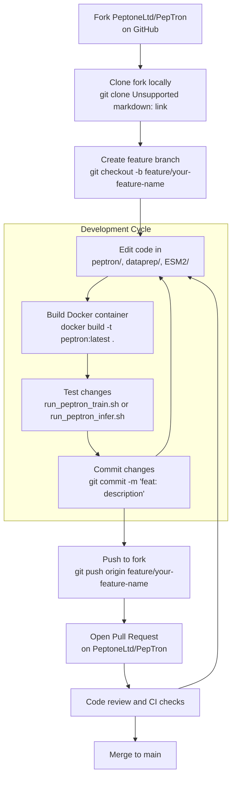
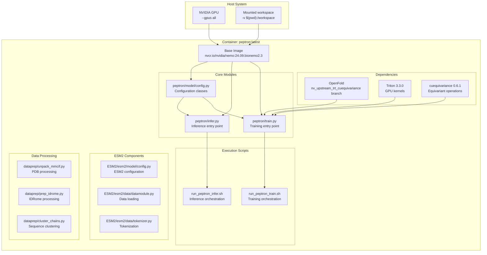

# Development and Contributing

> **Relevant source files**
> * [CODE_OF_CONDUCT.md](https://github.com/PeptoneLtd/PepTron/blob/8123ab15/CODE_OF_CONDUCT.md?plain=1)
> * [CONTRIBUTING.md](https://github.com/PeptoneLtd/PepTron/blob/8123ab15/CONTRIBUTING.md?plain=1)

This section provides guidance for developers who wish to contribute to the PepTron project. It covers setting up a development environment, understanding the contribution workflow, and adhering to community standards. This page serves as an overview; detailed information on specific topics can be found in the subsections:

* For detailed development environment setup, see [Development Environment](/PeptoneLtd/PepTron/9.1-development-environment)
* For the complete contribution process and guidelines, see [Contribution Guidelines](/PeptoneLtd/PepTron/9.2-contribution-guidelines)
* For community standards and behavior expectations, see [Code of Conduct](/PeptoneLtd/PepTron/9.3-code-of-conduct)
* For licensing terms, see [License](/PeptoneLtd/PepTron/9.4-license)

**Sources**: [CONTRIBUTING.md L1-L72](https://github.com/PeptoneLtd/PepTron/blob/8123ab15/CONTRIBUTING.md?plain=1#L1-L72)

 [CODE_OF_CONDUCT.md L1-L128](https://github.com/PeptoneLtd/PepTron/blob/8123ab15/CODE_OF_CONDUCT.md?plain=1#L1-L128)

---

## Contribution Overview

PepTron welcomes contributions across multiple areas of the codebase. Contributions fall into four primary categories:

| Category | Examples | Primary Files/Directories |
| --- | --- | --- |
| **Bug Fixes** | Memory issues, import errors, compatibility problems | All modules, particularly `peptron/train.py`, `peptron/infer.py` |
| **New Features** | Model improvements, new data formats, utilities | `peptron/model/`, `dataprep/`, `ESM2/` |
| **Documentation** | README improvements, examples, docstrings | `README.md`, Python docstrings, wiki pages |
| **Performance** | Speed optimization, memory usage, GPU utilization | `peptron/train.py`, `peptron/infer.py`, CUDA kernels |

**Sources**: [CONTRIBUTING.md L51-L57](https://github.com/PeptoneLtd/PepTron/blob/8123ab15/CONTRIBUTING.md?plain=1#L51-L57)

---

## Development Workflow

The contribution process follows a standard fork-and-pull-request model on GitHub. The diagram below illustrates the complete workflow from forking to merging:

### Development Workflow Diagram



**Sources**: [CONTRIBUTING.md L5-L49](https://github.com/PeptoneLtd/PepTron/blob/8123ab15/CONTRIBUTING.md?plain=1#L5-L49)

---

## Development Environment Architecture

Understanding the development environment structure is essential for effective contributions. The following diagram maps the containerized development environment to specific code entities:

### Environment Architecture and Code Entities



The development environment is containerized using Docker, with the base image built from `Dockerfile`. All development work occurs within this container to ensure consistency across environments.

**Sources**: [CONTRIBUTING.md L18-L24](https://github.com/PeptoneLtd/PepTron/blob/8123ab15/CONTRIBUTING.md?plain=1#L18-L24)

 Dockerfile cluster from architecture diagrams

---

## Development Environment Setup

Setting up the development environment requires Docker with GPU support. The basic setup process:

1. **Prerequisites**: Docker with NVIDIA Container Toolkit, CUDA-compatible GPU
2. **Build container**: Execute `docker build -t peptron:latest .` from repository root
3. **Launch container**: Execute `docker run --gpus all -it --rm -v $(pwd):/workspace peptron:latest`
4. **Verify setup**: Inside container, ensure access to `peptron/`, `dataprep/`, and `ESM2/` modules

For comprehensive setup instructions, including dependency installation and troubleshooting, see [Development Environment](/PeptoneLtd/PepTron/9.1-development-environment).

**Sources**: [CONTRIBUTING.md L18-L24](https://github.com/PeptoneLtd/PepTron/blob/8123ab15/CONTRIBUTING.md?plain=1#L18-L24)

---

## Testing and Validation Workflow

Contributors should test changes before submitting pull requests. The testing workflow depends on the type of contribution:

### Testing Workflow by Contribution Type

```mermaid
flowchart TD

ESM2Edit["Edit ESM2/<br>components"]
ESM2Test["Run integration test<br>with peptron/train.py"]
ESM2Verify["Verify tokenization<br>and data loading"]
InferEdit["Edit peptron/infer.py<br>or pt_to_structure.py"]
InferTest["Run run_peptron_infer.sh<br>with test sequences"]
InferVerify["Validate PDB output<br>and ensemble quality"]
TrainEdit["Edit peptron/train.py<br>or peptron/model/"]
TrainTest["Run run_peptron_train.sh<br>with small config"]
TrainVerify["Check checkpoint<br>generation and metrics"]
DataEdit["Edit dataprep/<br>scripts"]
DataTest["Run script with<br>sample data"]
DataVerify["Verify NPZ output<br>format and content"]

subgraph subGraph3 ["ESM2 Module Changes"]
    ESM2Edit
    ESM2Test
    ESM2Verify
    ESM2Edit --> ESM2Test
    ESM2Test --> ESM2Verify
end

subgraph subGraph2 ["Inference Changes"]
    InferEdit
    InferTest
    InferVerify
    InferEdit --> InferTest
    InferTest --> InferVerify
end

subgraph subGraph1 ["Training Changes"]
    TrainEdit
    TrainTest
    TrainVerify
    TrainEdit --> TrainTest
    TrainTest --> TrainVerify
end

subgraph subGraph0 ["Data Processing Changes"]
    DataEdit
    DataTest
    DataVerify
    DataEdit --> DataTest
    DataTest --> DataVerify
end
```



**Testing guidelines**:

* **Data processing**: Test with small subsets of PDB or IDRome-o data (1-10 samples)
* **Training**: Use reduced training steps (e.g., `max_steps: 100`) and smaller batch sizes
* **Inference**: Test with short sequences (<100 residues) and fewer samples (`samples: 2`)
* **ESM2 module**: Verify integration with main training/inference pipelines

**Sources**: [CONTRIBUTING.md L28-L33](https://github.com/PeptoneLtd/PepTron/blob/8123ab15/CONTRIBUTING.md?plain=1#L28-L33)

---

## Code Style Guidelines

PepTron follows Python best practices to maintain code quality and readability:

| Guideline | Specification | Rationale |
| --- | --- | --- |
| **Python Version** | 3.8+ with type hints | Compatibility with NeMo/BioNeMo framework |
| **Style Guide** | PEP 8 | Standard Python style |
| **Line Length** | 88 characters (Black formatter) | Readability on various displays |
| **Documentation** | Docstrings for all functions/classes | Code maintainability |
| **Type Hints** | Required for function signatures | Static analysis and IDE support |
| **Imports** | Organized: stdlib, third-party, local | Code organization |

**Example docstring format** (from typical patterns in the codebase):

```python
def process_protein_structure(pdb_path: str, output_dir: str) -> dict:    """    Process a protein structure file and extract coordinates.        Args:        pdb_path: Path to input PDB file        output_dir: Directory for output files            Returns:        Dictionary containing processed structure data with keys:        - 'coords': numpy array of atomic coordinates        - 'sequence': protein sequence string    """
```

**Sources**: [CONTRIBUTING.md L58-L64](https://github.com/PeptoneLtd/PepTron/blob/8123ab15/CONTRIBUTING.md?plain=1#L58-L64)

---

## Commit Message Conventions

Use semantic commit messages to clearly communicate the nature of changes:

| Prefix | Usage | Example |
| --- | --- | --- |
| `feat:` | New features | `feat: add AlphaFold2 comparison script` |
| `fix:` | Bug fixes | `fix: resolve memory leak in inference pipeline` |
| `docs:` | Documentation only | `docs: update MSA generation instructions` |
| `perf:` | Performance improvements | `perf: optimize batch processing in train.py` |
| `refactor:` | Code restructuring | `refactor: reorganize config parameter groups` |
| `test:` | Test additions | `test: add unit tests for tokenizer` |
| `style:` | Formatting changes | `style: apply Black formatter to dataprep/` |

**Sources**: [CONTRIBUTING.md L35-L39](https://github.com/PeptoneLtd/PepTron/blob/8123ab15/CONTRIBUTING.md?plain=1#L35-L39)

---

## Pull Request Guidelines

When submitting a pull request, include the following information:

1. **Clear description**: What changes were made and why
2. **Testing performed**: Commands run and results observed
3. **Related issues**: Link to any relevant GitHub issues
4. **Breaking changes**: Note any API or behavior changes
5. **Documentation updates**: List updated docs or wiki pages

**Pull request template structure**:

```markdown
## DescriptionBrief summary of changes ## Type of Change- [ ] Bug fix- [ ] New feature- [ ] Documentation- [ ] Performance improvement ## Testing- Commands executed: `run_peptron_train.sh` with config X- Results: Checkpoint generated successfully at step 100 ## Checklist- [ ] Code follows style guidelines- [ ] Documentation updated- [ ] Tests pass
```

**Sources**: [CONTRIBUTING.md L46-L49](https://github.com/PeptoneLtd/PepTron/blob/8123ab15/CONTRIBUTING.md?plain=1#L46-L49)

---

## Community Standards

PepTron adheres to the Contributor Covenant Code of Conduct. All contributors must:

* Demonstrate empathy and respect toward other contributors
* Accept constructive feedback gracefully
* Focus on what is best for the community
* Avoid harassment, trolling, or personal attacks

Violations should be reported to [carlo@peptone.io](mailto:carlo@peptone.io). For complete details on standards and enforcement, see [Code of Conduct](/PeptoneLtd/PepTron/9.3-code-of-conduct).

**Sources**: [CODE_OF_CONDUCT.md L1-L128](https://github.com/PeptoneLtd/PepTron/blob/8123ab15/CODE_OF_CONDUCT.md?plain=1#L1-L128)

---

## Key Repository Structure for Contributors

Understanding the repository structure helps identify where to make changes:

```markdown
PepTron/
├── peptron/                   # Core training and inference modules
│   ├── train.py              # Training entry point
│   ├── infer.py              # Inference entry point
│   ├── pt_to_structure.py    # Tensor to PDB conversion
│   └── model/                # Model architecture and config
│       ├── config.py         # Configuration classes
│       └── ...
├── dataprep/                 # Data processing pipeline
│   ├── unpack_mmcif.py       # PDB processing
│   ├── prep_idrome.py        # IDRome-o processing
│   ├── cluster_chains.py     # Sequence clustering
│   └── ...
├── ESM2/                     # ESM2 module components
│   └── esm2/
│       ├── model/            # ESM2 model definitions
│       ├── data/             # ESM2 data pipeline
│       └── ...
├── run_peptron_train.sh      # Training orchestration script
├── run_peptron_infer.sh      # Inference orchestration script
├── Dockerfile                # Container definition
├── CONTRIBUTING.md           # Contribution guidelines
└── CODE_OF_CONDUCT.md        # Code of conduct
```

**Common contribution targets**:

* **Model improvements**: `peptron/model/`, particularly architecture definitions
* **Training pipeline**: `peptron/train.py`, `peptron/model/config.py`
* **Inference pipeline**: `peptron/infer.py`, `peptron/pt_to_structure.py`
* **Data processing**: `dataprep/` scripts
* **ESM2 integration**: `ESM2/esm2/` modules
* **Orchestration**: `run_peptron_train.sh`, `run_peptron_infer.sh`

**Sources**: Repository structure from architecture diagrams

---

## Getting Help

Contributors can access support through multiple channels:

1. **GitHub Issues**: Search existing issues at [https://github.com/PeptoneLtd/PepTron/issues](https://github.com/PeptoneLtd/PepTron/issues)
2. **New Issues**: Open new issues for bugs or feature requests
3. **Pull Request Comments**: Ask questions in PR discussions
4. **Email**: Contact maintainers at [carlo@peptone.io](mailto:carlo@peptone.io) for code of conduct issues

Before opening an issue:

* Search existing issues for similar problems
* Include relevant error messages and stack traces
* Specify your environment (OS, GPU, Docker version)
* Provide minimal reproducible examples when possible

**Sources**: [CONTRIBUTING.md L65-L69](https://github.com/PeptoneLtd/PepTron/blob/8123ab15/CONTRIBUTING.md?plain=1#L65-L69)

---

## License

PepTron is released under the Apache License 2.0. Contributors must agree to license their contributions under the same terms. For complete license text and implications, see [License](/PeptoneLtd/PepTron/9.4-license).

**Sources**: Inferred from standard open-source practices