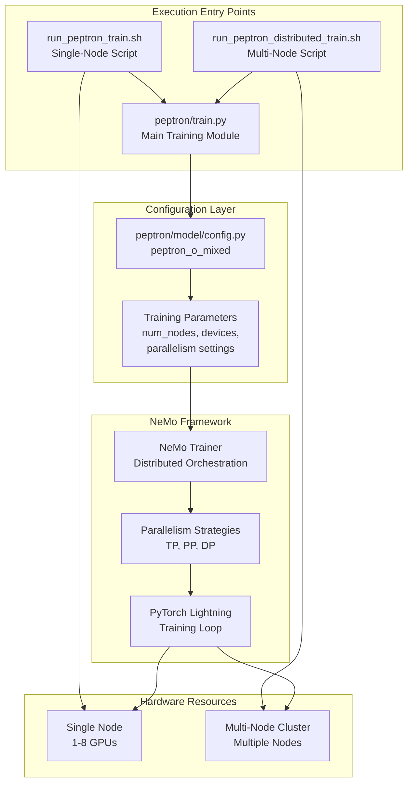
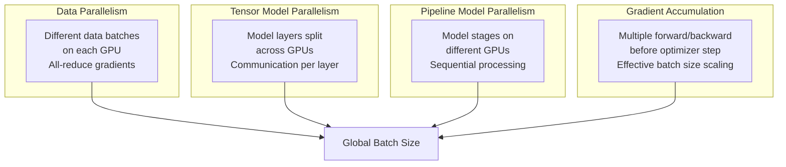
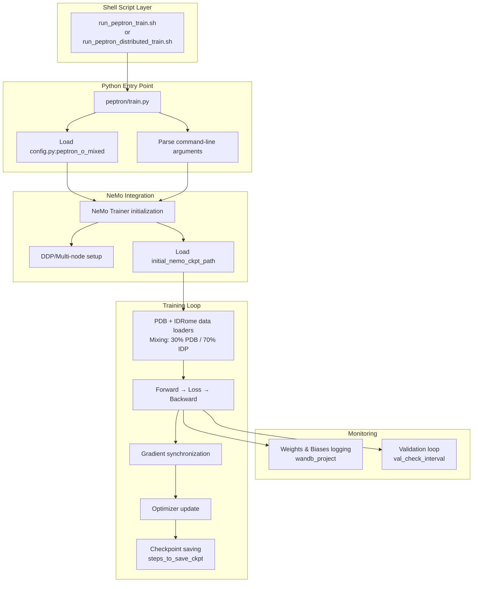

# Distributed Training Setup

> **Relevant source files**
> * [README.md](https://github.com/PeptoneLtd/PepTron/blob/8123ab15/README.md?plain=1)

## Purpose and Scope

This document explains how to configure and execute distributed training for PepTron models across single-node and multi-node GPU environments. It covers parallelism strategies, hardware configuration, and the orchestration scripts that launch training jobs.

For details on training configuration parameters, see [Training Configuration](/PeptoneLtd/PepTron/5.1-training-configuration). For information about data preparation requirements before training, see [Data Preparation Pipeline](/PeptoneLtd/PepTron/4-data-preparation-pipeline).

**Sources:** [README.md L75-L173](https://github.com/PeptoneLtd/PepTron/blob/8123ab15/README.md?plain=1#L75-L173)

---

## Training Execution Overview

PepTron leverages NVIDIA NeMo's distributed training framework to scale training across multiple GPUs and nodes. The training system supports three execution modes controlled through configuration parameters and shell scripts:



**Sources:** [README.md L167-L173](https://github.com/PeptoneLtd/PepTron/blob/8123ab15/README.md?plain=1#L167-L173)

 [README.md L110-L113](https://github.com/PeptoneLtd/PepTron/blob/8123ab15/README.md?plain=1#L110-L113)

---

## Single-Node Training

Single-node training executes on a single machine with multiple GPUs. This is the default configuration and suitable for most training scenarios.

### Execution Script

The `run_peptron_train.sh` script orchestrates single-node training:

```
sh run_peptron_train.sh
```

This script launches the training process with configuration specified in [peptron/train.py

NaN-NaN](https://github.com/PeptoneLtd/PepTron/blob/8123ab15/peptron/train.py#LNaN-LNaN)

 which defaults to `peptron_o_mixed` configuration.

### Configuration Parameters

Key parameters for single-node training in [peptron/model/config.py](https://github.com/PeptoneLtd/PepTron/blob/8123ab15/peptron/model/config.py)

:

| Parameter | Default | Description |
| --- | --- | --- |
| `num_nodes` | 1 | Number of compute nodes (single-node = 1) |
| `devices` | 8 | Number of GPUs per node |
| `micro_batch_size` | 8 | Batch size per GPU before gradient accumulation |
| `accumulate_grad_batches` | 1 | Number of batches to accumulate gradients |
| `precision` | "bf16-mixed" | Training precision (bfloat16 mixed precision) |

**Sources:** [README.md L167-L169](https://github.com/PeptoneLtd/PepTron/blob/8123ab15/README.md?plain=1#L167-L169)

 [README.md L119-L139](https://github.com/PeptoneLtd/PepTron/blob/8123ab15/README.md?plain=1#L119-L139)

---

## Multi-Node Distributed Training

Multi-node training distributes computation across multiple machines, each with multiple GPUs. This enables training on larger datasets or with larger batch sizes.

### Execution Script

The `run_peptron_distributed_train.sh` script orchestrates multi-node training:

```
sh run_peptron_distributed_train.sh
```

### Configuration Requirements

To enable multi-node training, modify the configuration:

```css
"training": {    "num_nodes": 4,           # Number of compute nodes    "devices": 8,              # GPUs per node (total: 32 GPUs)    # ... other parameters}
```

### Node Communication

Multi-node training requires:

* Network connectivity between all nodes
* Shared filesystem access for checkpoint storage
* Consistent environment setup across all nodes (handled by Docker)
* NeMo's automatic node discovery and synchronization

**Sources:** [README.md L171-L173](https://github.com/PeptoneLtd/PepTron/blob/8123ab15/README.md?plain=1#L171-L173)

---

## Parallelism Strategies

PepTron supports three parallelism strategies that can be combined to optimize training throughput and memory usage:



### Data Parallelism (DP)

**Default mode** when `tensor_model_parallel_size=1` and `pipeline_model_parallel_size=1`. Each GPU processes different data batches with identical model copies. Gradients are synchronized across GPUs after each backward pass.

**Configuration:**

* Automatically enabled when parallelism sizes = 1
* Effective batch size = `micro_batch_size × devices × num_nodes × accumulate_grad_batches`

### Tensor Model Parallelism (TP)

Splits individual model layers across multiple GPUs. Each GPU holds a portion of the model's weights for each layer.

**Configuration:**

```markdown
"tensor_model_parallel_size": 1  # Default: no tensor parallelism
```

**Use case:** When model layers don't fit in single GPU memory. Increases communication overhead.

### Pipeline Model Parallelism (PP)

Splits the model into sequential stages, with each stage on a different GPU. Microbatches flow through the pipeline sequentially.

**Configuration:**

```markdown
"pipeline_model_parallel_size": 1  # Default: no pipeline parallelism
```

**Use case:** Very deep models that don't fit in memory. Introduces pipeline bubbles.

### Gradient Accumulation

Accumulates gradients over multiple forward/backward passes before updating weights, effectively increasing batch size without increasing memory.

**Configuration:**

```markdown
"accumulate_grad_batches": 1  # Number of batches to accumulate
```

**Effective global batch size calculation:**

```
global_batch_size = micro_batch_size × devices × num_nodes × accumulate_grad_batches
                                     ÷ tensor_model_parallel_size
                                     ÷ pipeline_model_parallel_size
```

**Sources:** [README.md L128-L133](https://github.com/PeptoneLtd/PepTron/blob/8123ab15/README.md?plain=1#L128-L133)

---

## Hardware Configuration

### GPU Allocation

The `devices` parameter controls GPU allocation per node:

```markdown
"devices": 8  # Use 8 GPUs per node
```

PepTron requires the Docker container to be launched with GPU access:

```
docker run --gpus all -it --rm peptron:latest
```

### Memory Management

Training memory usage depends on:

| Factor | Impact | Configuration |
| --- | --- | --- |
| Sequence length | Linear memory growth | `crop_size` in config |
| Batch size | Linear memory growth | `micro_batch_size` |
| Precision | 2× memory savings | `precision="bf16-mixed"` |
| Model parallelism | Divides model memory | `tensor_model_parallel_size` |
| Gradient accumulation | No memory increase | `accumulate_grad_batches` |

**Default safe configuration:**

```
"micro_batch_size": 8,"precision": "bf16-mixed","crop_size": 768,
```

### Troubleshooting Memory Issues

If encountering CUDA Out of Memory errors:

1. **Reduce `micro_batch_size`**: Start with 1 and increase
2. **Enable gradient accumulation**: Increase `accumulate_grad_batches` to maintain effective batch size
3. **Enable tensor parallelism**: Set `tensor_model_parallel_size=2` or higher
4. **Reduce crop size**: Decrease `crop_size` for shorter sequences

**Sources:** [README.md L215](https://github.com/PeptoneLtd/PepTron/blob/8123ab15/README.md?plain=1#L215-L215)

---

## Training Script Architecture



**Sources:** [README.md L110-L113](https://github.com/PeptoneLtd/PepTron/blob/8123ab15/README.md?plain=1#L110-L113)

 [README.md L167-L173](https://github.com/PeptoneLtd/PepTron/blob/8123ab15/README.md?plain=1#L167-L173)

---

## Example Configurations

### Configuration 1: Single Node, 8 GPUs (Default)

Suitable for most training scenarios, including the full PepTron training pipeline.

```
"training": {    "num_nodes": 1,    "devices": 8,    "tensor_model_parallel_size": 1,    "pipeline_model_parallel_size": 1,    "accumulate_grad_batches": 1,    "micro_batch_size": 8,    "precision": "bf16-mixed",}
```

**Effective batch size:** 8 × 8 × 1 = 64 samples per optimization step

### Configuration 2: Multi-Node, 32 GPUs

For faster training or larger batch sizes across 4 nodes:

```
"training": {    "num_nodes": 4,    "devices": 8,    "tensor_model_parallel_size": 1,    "pipeline_model_parallel_size": 1,    "accumulate_grad_batches": 1,    "micro_batch_size": 8,    "precision": "bf16-mixed",}
```

**Effective batch size:** 8 × 8 × 4 = 256 samples per optimization step

### Configuration 3: Memory-Constrained Setup

For training on GPUs with limited memory (e.g., 16GB):

```css
"training": {    "num_nodes": 1,    "devices": 4,    "tensor_model_parallel_size": 1,    "pipeline_model_parallel_size": 1,    "accumulate_grad_batches": 4,  # Maintain effective batch size    "micro_batch_size": 1,          # Minimal per-GPU batch    "precision": "bf16-mixed",    "crop_size": 512,               # Shorter sequences}
```

**Effective batch size:** 1 × 4 × 1 × 4 = 16 samples per optimization step

### Configuration 4: Tensor Parallelism for Large Models

When model layers don't fit in single GPU memory:

```css
"training": {    "num_nodes": 1,    "devices": 8,    "tensor_model_parallel_size": 2,  # Split layers across 2 GPUs    "pipeline_model_parallel_size": 1,    "accumulate_grad_batches": 1,    "micro_batch_size": 8,    "precision": "bf16-mixed",}
```

**Effective batch size:** 8 × 8 ÷ 2 = 32 samples per optimization step (4 data parallel groups)

**Sources:** [README.md L119-L162](https://github.com/PeptoneLtd/PepTron/blob/8123ab15/README.md?plain=1#L119-L162)

---

## Checkpoint Management in Distributed Training

### Checkpoint Saving

Checkpoints are saved to `experiment_dir` at intervals specified by `steps_to_save_ckpt`:

```css
"training": {    "experiment_dir": "/path/to/experiment",    "steps_to_save_ckpt": 100,  # Save every 100 steps}
```

**Directory structure:**

```
experiment_dir/
├── checkpoints/
│   ├── step_100.ckpt
│   ├── step_200.ckpt
│   └── ...
└── logs/
```

### Loading Initial Checkpoints

To resume training or fine-tune from a checkpoint:

```
"training": {    "initial_nemo_ckpt_path": "/path/to/peptron-checkpoint",}
```

**Use cases:**

* **Resume training:** Continue from last checkpoint after interruption
* **Fine-tuning:** Start from PepTron-base to train PepTron (see [Model Checkpoints](/PeptoneLtd/PepTron/3.2-model-checkpoints))
* **Transfer learning:** Adapt to custom datasets

### Distributed Checkpoint Considerations

In multi-node training:

* Only **rank 0** (master node) saves checkpoints
* All nodes must have access to shared filesystem
* Checkpoint loading automatically distributes weights across nodes/GPUs
* NeMo handles weight sharding for model parallel configurations

**Sources:** [README.md L134-L138](https://github.com/PeptoneLtd/PepTron/blob/8123ab15/README.md?plain=1#L134-L138)

---

## Monitoring and Validation

### Weights & Biases Integration

Training metrics are logged to Weights & Biases:

```
"training": {    "wandb_project": "peptron-stable",    "experiment_name": "your-experiment-name",}
```

**Logged metrics:**

* Training loss per step
* Learning rate schedule
* Validation metrics at `val_check_interval`
* GPU memory usage
* Throughput (samples/second)

### Validation Schedule

Validation runs periodically during training:

```css
"training": {    "val_check_interval": 100,     # Run validation every 100 steps    "limit_val_batches": 3,         # Number of validation batches    "val_epoch_len": 5,             # Validation samples per epoch}
```

**Validation datasets:**

* **PDB validation:** CAMEO 2022 test set ([splits/cameo2022_msa.csv](https://github.com/PeptoneLtd/PepTron/blob/8123ab15/splits/cameo2022_msa.csv) )
* **IDRome validation:** IDRome-o validation split ([splits/IDRome_DB-val-msa.csv](https://github.com/PeptoneLtd/PepTron/blob/8123ab15/splits/IDRome_DB-val-msa.csv) )

**Sources:** [README.md L125-L136](https://github.com/PeptoneLtd/PepTron/blob/8123ab15/README.md?plain=1#L125-L136)

---

## Common Issues and Solutions

### Issue: Training Doesn't Start

**Symptoms:** Script hangs or fails to initialize

**Solutions:**

1. Verify all data paths exist and are accessible
2. Check that `train_chains_pdb` and `train_chains_idp` CSV files are valid
3. Ensure MSA directories contain .a3m files
4. Verify checkpoint path if using `initial_nemo_ckpt_path`

### Issue: Out of Memory Errors

**Symptoms:** `CUDA out of memory` error during training

**Solutions:**

1. Reduce `micro_batch_size` to 1
2. Increase `accumulate_grad_batches` to maintain effective batch size
3. Enable `tensor_model_parallel_size=2` or higher
4. Reduce `crop_size` parameter

See [README.md L215](https://github.com/PeptoneLtd/PepTron/blob/8123ab15/README.md?plain=1#L215-L215)

 for general memory troubleshooting.

### Issue: Multi-Node Training Not Synchronizing

**Symptoms:** Training starts on only one node, or nodes can't communicate

**Solutions:**

1. Verify network connectivity between nodes
2. Ensure all nodes have access to shared filesystem for `experiment_dir`
3. Check that Docker containers on all nodes can communicate
4. Verify consistent NeMo version across all nodes

### Issue: Checkpoint Loading Failures

**Symptoms:** `Checkpoint loading error` when resuming training

**Solutions:**

1. Verify checkpoint path matches directory structure
2. Ensure model configuration matches checkpoint (don't change parallelism settings)
3. Check that checkpoint was saved completely (not interrupted)

See [README.md L217](https://github.com/PeptoneLtd/PepTron/blob/8123ab15/README.md?plain=1#L217-L217)

 for checkpoint troubleshooting.

**Sources:** [README.md L211-L224](https://github.com/PeptoneLtd/PepTron/blob/8123ab15/README.md?plain=1#L211-L224)

---

## Performance Optimization

### Throughput Optimization

To maximize training throughput:

| Strategy | Configuration | Trade-off |
| --- | --- | --- |
| Larger batch size | Increase `micro_batch_size` | More memory, may affect convergence |
| Gradient accumulation | Increase `accumulate_grad_batches` | Delays optimizer updates |
| More GPUs | Increase `devices` or `num_nodes` | Linear scaling (data parallel) |
| Mixed precision | Use `"bf16-mixed"` | Minimal accuracy impact, 2× faster |

### Convergence Optimization

To maintain training stability:

| Parameter | Recommended Value | Reason |
| --- | --- | --- |
| `warmup_steps_percentage` | 0.10 | Gradual learning rate warmup |
| `micro_batch_size` | 8 | Stable gradient estimates |
| `accumulate_grad_batches` | ≥1 | Effective batch size for convergence |
| `precision` | "bf16-mixed" | Balance speed and numerical stability |

### Data Loading Optimization

The data mixing strategy affects training dynamics:

```css
"training": {    "dataset_prob_pdb": 0.3,   # 30% structured proteins    "dataset_prob_idp": 0.7,   # 70% disordered proteins}
```

This ratio is optimized for the full proteome model. See [Data Mixing Strategy](/PeptoneLtd/PepTron/5.2-data-mixing-strategy) for details.

**Sources:** [README.md L119-L162](https://github.com/PeptoneLtd/PepTron/blob/8123ab15/README.md?plain=1#L119-L162)