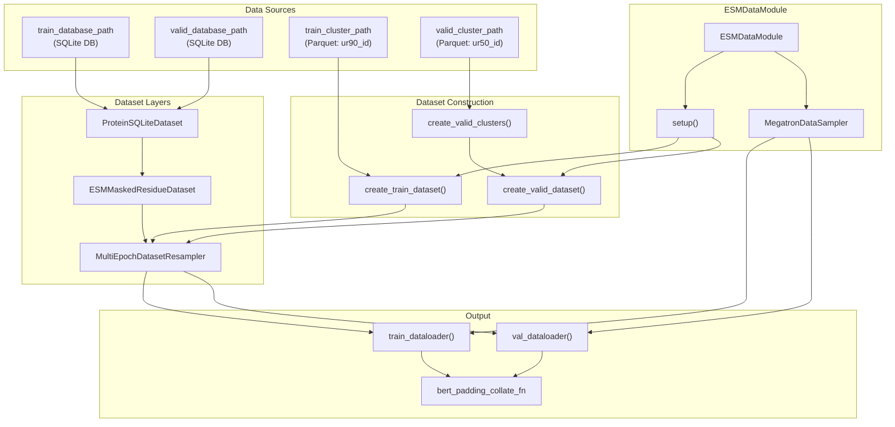
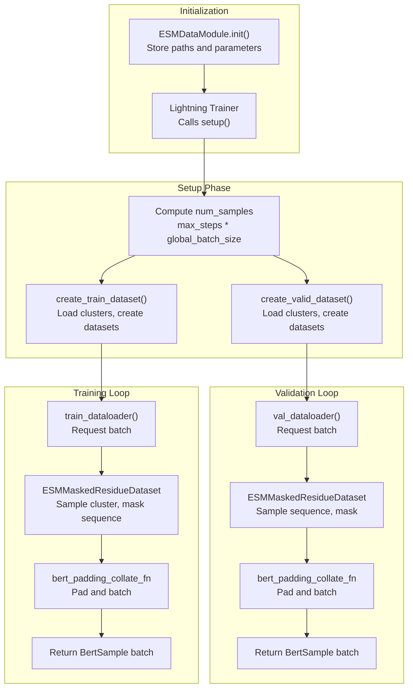

# ESM2 Data Pipeline

> **Relevant source files**
> * [esm2/data/__init__.py](https://github.com/PeptoneLtd/PepTron/blob/8123ab15/esm2/data/__init__.py)
> * [esm2/data/datamodule.py](https://github.com/PeptoneLtd/PepTron/blob/8123ab15/esm2/data/datamodule.py)
> * [esm2/data/dataset.py](https://github.com/PeptoneLtd/PepTron/blob/8123ab15/esm2/data/dataset.py)

## Purpose and Scope

This document describes the ESM2 data pipeline components responsible for loading, processing, and batching protein sequence data for ESM2 model training and validation. The pipeline implements cluster-based sampling of UniRef protein sequences from SQLite databases, applies BERT-style masking for self-supervised pretraining, and integrates with NeMo's distributed training framework.

For information about the ESM2 model architecture and configuration, see [ESM2 Model Configuration](/PeptoneLtd/PepTron/7.1-esm2-model-configuration). For details about sequence tokenization, see [ESM2 Tokenizer](/PeptoneLtd/PepTron/7.3-esm2-tokenizer).

---

## Overview

The ESM2 data pipeline consists of three primary components:

1. **ESMDataModule** - A PyTorch Lightning DataModule that orchestrates data loading for training and validation
2. **Dataset Classes** - `ProteinSQLiteDataset` for database access and `ESMMaskedResidueDataset` for masked language modeling
3. **Factory Functions** - Helper functions that construct datasets with appropriate sampling and masking configurations

The pipeline processes protein sequences stored in SQLite databases and organized by UniRef cluster membership, applying BERT-style masking to create self-supervised learning objectives.

**Sources:** [esm2/data/datamodule.py L1-L222](https://github.com/PeptoneLtd/PepTron/blob/8123ab15/esm2/data/datamodule.py#L1-L222)

 [esm2/data/dataset.py L1-L370](https://github.com/PeptoneLtd/PepTron/blob/8123ab15/esm2/data/dataset.py#L1-L370)

---

## Architecture Overview



**Diagram: ESM2 Data Pipeline Architecture**

This diagram shows how data flows from raw SQLite databases and cluster files through the dataset construction pipeline to produce batched, masked sequences for training. The `ESMDataModule` orchestrates the entire pipeline, using `MegatronDataSampler` for distributed training compatibility.

**Sources:** [esm2/data/datamodule.py L35-L222](https://github.com/PeptoneLtd/PepTron/blob/8123ab15/esm2/data/datamodule.py#L35-L222)

 [esm2/data/dataset.py L49-L370](https://github.com/PeptoneLtd/PepTron/blob/8123ab15/esm2/data/dataset.py#L49-L370)

---

## ESMDataModule

The `ESMDataModule` class extends `MegatronDataModule` to provide a Lightning-compatible interface for ESM2 data loading.

### Class Definition

[esm2/data/datamodule.py L35-L222](https://github.com/PeptoneLtd/PepTron/blob/8123ab15/esm2/data/datamodule.py#L35-L222)

### Initialization Parameters

| Parameter | Type | Default | Description |
| --- | --- | --- | --- |
| `train_cluster_path` | str \| PathLike | Required | Path to Parquet file with UniRef90 training clusters |
| `train_database_path` | str \| PathLike | Required | Path to SQLite DB mapping UniRef90 IDs to sequences |
| `valid_cluster_path` | str \| PathLike | Required | Path to Parquet file with UniRef50 validation clusters |
| `valid_database_path` | str \| PathLike | Required | Path to SQLite DB mapping UniRef50 IDs to sequences |
| `seed` | int \| None | 42 | Random seed for reproducibility |
| `min_seq_length` | int \| None | None | Minimum sequence length for padding |
| `max_seq_length` | int | 1024 | Maximum context length (sequences are cropped) |
| `micro_batch_size` | int | 4 | Batch size per GPU |
| `global_batch_size` | int | 8 | Total batch size across all GPUs |
| `num_workers` | int | 10 | Number of DataLoader worker processes |
| `persistent_workers` | bool | True | Keep workers alive between epochs |
| `pin_memory` | bool | True | Pin memory for faster GPU transfer |
| `mask_prob` | float | 0.15 | Overall masking probability |
| `mask_token_prob` | float | 0.8 | Proportion masked with `<MASK>` token |
| `mask_random_prob` | float | 0.1 | Proportion masked with random token |
| `random_mask_strategy` | RandomMaskStrategy | ALL_TOKENS | Random token sampling strategy |
| `tokenizer` | BioNeMoESMTokenizer | get_tokenizer() | ESM2 tokenizer instance |
| `dataloader_type` | Literal["single", "cyclic"] | "single" | Megatron dataloader type |

**Sources:** [esm2/data/datamodule.py L38-L109](https://github.com/PeptoneLtd/PepTron/blob/8123ab15/esm2/data/datamodule.py#L38-L109)

### Key Methods

#### setup(stage: str)

Initializes training and validation datasets based on trainer configuration. Called automatically by PyTorch Lightning.

* Validates that `trainer.max_steps` is set (required for determining `num_train_samples`)
* Computes `num_train_samples = max_train_steps * global_batch_size`
* Creates training dataset using `create_train_dataset()`
* Creates validation dataset using `create_valid_dataset()` if validation is enabled
* Issues a warning if `max_epochs > 1` (not recommended due to shuffle behavior)

[esm2/data/datamodule.py L116-L183](https://github.com/PeptoneLtd/PepTron/blob/8123ab15/esm2/data/datamodule.py#L116-L183)

#### train_dataloader() → WrappedDataLoader

Returns the training dataloader with:

* `WrappedDataLoader` configured for "train" mode
* `bert_padding_collate_fn` for batching and padding
* Persistent workers and pinned memory if enabled

[esm2/data/datamodule.py L211-L213](https://github.com/PeptoneLtd/PepTron/blob/8123ab15/esm2/data/datamodule.py#L211-L213)

#### val_dataloader() → WrappedDataLoader

Returns the validation dataloader with identical configuration to training but in "validation" mode.

[esm2/data/datamodule.py L215-L217](https://github.com/PeptoneLtd/PepTron/blob/8123ab15/esm2/data/datamodule.py#L215-L217)

**Sources:** [esm2/data/datamodule.py L116-L217](https://github.com/PeptoneLtd/PepTron/blob/8123ab15/esm2/data/datamodule.py#L116-L217)

---

## Dataset Classes

### ProteinSQLiteDataset

A simple `torch.utils.data.Dataset` that provides indexed access to protein sequences stored in a SQLite database.

[esm2/data/dataset.py L49-L90](https://github.com/PeptoneLtd/PepTron/blob/8123ab15/esm2/data/dataset.py#L49-L90)

#### Database Schema

The SQLite database must contain a `protein` table with the following schema:

| Column | Type | Description |
| --- | --- | --- |
| `id` | TEXT | UniRef90 or UniRef50 identifier (primary key) |
| `sequence` | TEXT | Amino acid sequence string |

#### Key Methods

| Method | Returns | Description |
| --- | --- | --- |
| `__len__()` | int | Total number of proteins in database (cached) |
| `__getitem__(idx: str)` | str | Returns sequence string for given UniRef ID |

**Sources:** [esm2/data/dataset.py L49-L90](https://github.com/PeptoneLtd/PepTron/blob/8123ab15/esm2/data/dataset.py#L49-L90)

### ESMMaskedResidueDataset

Implements cluster-based sampling with BERT-style masking for ESM2 pretraining.

[esm2/data/dataset.py L92-L221](https://github.com/PeptoneLtd/PepTron/blob/8123ab15/esm2/data/dataset.py#L92-L221)

#### Architecture

```mermaid
flowchart TD

Index["index: EpochIndex<br>(epoch, idx)"]
Clusters["clusters: Sequence[Sequence[str]]"]
ProteinDB["protein_dataset:<br>ProteinSQLiteDataset"]
InitRNG["Initialize RNG<br>seed=[dataset_seed, epoch, idx]"]
SampleCluster["Sample UniRef90 ID<br>from cluster[idx]"]
FetchSeq["Fetch sequence<br>from ProteinSQLiteDataset"]
Tokenize["Tokenize sequence<br>_tokenize()"]
Crop["Random crop<br>_random_crop()"]
Mask["Apply BERT masking<br>apply_bert_pretraining_mask()"]
BertSample["BertSample:<br>text, types, attention_mask,<br>labels, loss_mask, is_random"]

Index --> InitRNG
Clusters --> SampleCluster
ProteinDB --> FetchSeq
Mask --> BertSample

subgraph Output ["Output"]
    BertSample
end

subgraph ESMMaskedResidueDataset.__getitem__() ["ESMMaskedResidueDataset.getitem()"]
    InitRNG
    SampleCluster
    FetchSeq
    Tokenize
    Crop
    Mask
    InitRNG --> SampleCluster
    SampleCluster --> FetchSeq
    FetchSeq --> Tokenize
    Tokenize --> Crop
    Crop --> Mask
end

subgraph Input ["Input"]
    Index
    Clusters
    ProteinDB
end
```

**Diagram: ESMMaskedResidueDataset Processing Flow**

**Sources:** [esm2/data/dataset.py L169-L221](https://github.com/PeptoneLtd/PepTron/blob/8123ab15/esm2/data/dataset.py#L169-L221)

#### Initialization Parameters

| Parameter | Type | Default | Description |
| --- | --- | --- | --- |
| `protein_dataset` | Dataset | Required | `ProteinSQLiteDataset` for sequence lookup |
| `clusters` | Sequence[Sequence[str]] | Required | List of UniRef90 ID lists, grouped by cluster |
| `seed` | int | Random | Base seed for deterministic randomization |
| `max_seq_length` | int | 1024 | Maximum sequence length after cropping |
| `mask_prob` | float | 0.15 | Probability token is included in loss |
| `mask_token_prob` | float | 0.8 | Proportion masked with `<MASK>` |
| `mask_random_prob` | float | 0.1 | Proportion masked with random token |
| `random_mask_strategy` | RandomMaskStrategy | ALL_TOKENS | Random token selection strategy |
| `tokenizer` | BioNeMoESMTokenizer | get_tokenizer() | Tokenizer instance |

**Sources:** [esm2/data/dataset.py L114-L163](https://github.com/PeptoneLtd/PepTron/blob/8123ab15/esm2/data/dataset.py#L114-L163)

#### Multi-Epoch Training

The dataset implements deterministic pseudo-epochs by accepting `EpochIndex` objects instead of simple integers:

```python
class EpochIndex:    epoch: int  # Current epoch number    idx: int    # Index within epoch
```

The random number generator is seeded with `[dataset_seed, epoch, idx]` to ensure:

1. The same `(epoch, idx)` always produces identical outputs (required by Megatron)
2. Different epochs produce different cluster samples and mask patterns
3. Distributed training maintains deterministic synchronization

[esm2/data/dataset.py L169-L208](https://github.com/PeptoneLtd/PepTron/blob/8123ab15/esm2/data/dataset.py#L169-L208)

**Sources:** [esm2/data/dataset.py L102-L111](https://github.com/PeptoneLtd/PepTron/blob/8123ab15/esm2/data/dataset.py#L102-L111)

 [esm2/data/dataset.py L169-L208](https://github.com/PeptoneLtd/PepTron/blob/8123ab15/esm2/data/dataset.py#L169-L208)

---

## Dataset Factory Functions

### create_train_dataset()

Constructs a complete training dataset pipeline.

[esm2/data/dataset.py L223-L280](https://github.com/PeptoneLtd/PepTron/blob/8123ab15/esm2/data/dataset.py#L223-L280)

**Parameters:**

* `cluster_file`: Path to Parquet with `ur90_id` column (list of UniRef90 IDs per cluster)
* `db_path`: Path to SQLite database
* `total_samples`: Total samples to generate (for multi-epoch upsampling)
* `seed`: Random seed
* Additional masking and tokenization parameters (same as `ESMMaskedResidueDataset`)

**Returns:** `MultiEpochDatasetResampler` wrapping the masked dataset

**Pipeline:**

1. Load cluster file as DataFrame
2. Validate `ur90_id` column exists
3. Create `ProteinSQLiteDataset(db_path)`
4. Create `ESMMaskedResidueDataset` with clusters from `cluster_df["ur90_id"]`
5. Wrap in `MultiEpochDatasetResampler` with shuffling enabled

**Sources:** [esm2/data/dataset.py L223-L280](https://github.com/PeptoneLtd/PepTron/blob/8123ab15/esm2/data/dataset.py#L223-L280)

### create_valid_clusters()

Loads validation clusters from Parquet file.

[esm2/data/dataset.py L283-L302](https://github.com/PeptoneLtd/PepTron/blob/8123ab15/esm2/data/dataset.py#L283-L302)

**Parameters:**

* `cluster_file`: Path to Parquet with `ur50_id` column

**Returns:** `pd.Series` where each entry is a single-element list `[ur50_id]`

This transformation converts validation UniRef50 IDs into the same cluster format used for training, where each cluster contains one sequence.

**Sources:** [esm2/data/dataset.py L283-L302](https://github.com/PeptoneLtd/PepTron/blob/8123ab15/esm2/data/dataset.py#L283-L302)

### create_valid_dataset()

Constructs validation dataset pipeline.

[esm2/data/dataset.py L305-L357](https://github.com/PeptoneLtd/PepTron/blob/8123ab15/esm2/data/dataset.py#L305-L357)

**Parameters:**

* `clusters`: Either a `pd.Series` or path to cluster file
* `db_path`: Path to SQLite database
* `total_samples`: Total validation samples (can be limited for faster evaluation)
* Additional parameters same as training

**Returns:** `MultiEpochDatasetResampler` wrapping the masked dataset

**Pipeline:**

1. Load clusters using `create_valid_clusters()` if path provided
2. Create `ProteinSQLiteDataset(db_path)`
3. Create `ESMMaskedResidueDataset` with validation clusters
4. Wrap in `MultiEpochDatasetResampler` with shuffling

**Sources:** [esm2/data/dataset.py L305-L357](https://github.com/PeptoneLtd/PepTron/blob/8123ab15/esm2/data/dataset.py#L305-L357)

---

## Masking Strategy

The pipeline implements BERT-style masked language modeling through the `BertMaskConfig` class from BioNeMo.

[esm2/data/dataset.py L153-L161](https://github.com/PeptoneLtd/PepTron/blob/8123ab15/esm2/data/dataset.py#L153-L161)

### Masking Parameters

| Parameter | Default | Description |
| --- | --- | --- |
| `mask_prob` | 0.15 | Overall probability a token is masked (appears in loss) |
| `mask_token_prob` | 0.8 | Of masked tokens, proportion replaced with `<MASK>` |
| `mask_random_prob` | 0.1 | Of masked tokens, proportion replaced with random token |
| Remaining | 0.1 | Of masked tokens, proportion kept unchanged |

### RandomMaskStrategy

Controls the set of tokens used for random masking:

[esm2/data/dataset.py L35-L47](https://github.com/PeptoneLtd/PepTron/blob/8123ab15/esm2/data/dataset.py#L35-L47)

| Strategy | Token Range | Description |
| --- | --- | --- |
| `ALL_TOKENS` | `range(len(tokenizer.all_tokens))` | All tokens including special tokens, padding, non-canonical AAs |
| `AMINO_ACIDS_ONLY` | `range(4, 24)` | Only canonical amino acid tokens (indices 4-23) |

The strategy is configured via the `random_mask_strategy` parameter in dataset initialization.

**Sources:** [esm2/data/dataset.py L35-L47](https://github.com/PeptoneLtd/PepTron/blob/8123ab15/esm2/data/dataset.py#L35-L47)

 [esm2/data/dataset.py L153-L161](https://github.com/PeptoneLtd/PepTron/blob/8123ab15/esm2/data/dataset.py#L153-L161)

### Masking Process

The actual masking is performed by `apply_bert_pretraining_mask()` from BioNeMo:

[esm2/data/dataset.py L195-L199](https://github.com/PeptoneLtd/PepTron/blob/8123ab15/esm2/data/dataset.py#L195-L199)

**Outputs:**

* `masked_sequence`: Input with some tokens replaced according to masking strategy
* `labels`: Original token IDs for computing loss
* `loss_mask`: Binary mask indicating which positions contribute to loss

**Sources:** [esm2/data/dataset.py L195-L199](https://github.com/PeptoneLtd/PepTron/blob/8123ab15/esm2/data/dataset.py#L195-L199)

---

## Cluster Sampling Strategy

### Training: UniRef90 Cluster Sampling

Training data uses **weighted cluster sampling** where each batch sample:

1. Selects a UniRef50 cluster deterministically based on `index % num_clusters`
2. Randomly samples one UniRef90 sequence from that cluster
3. Applies random cropping and masking

This ensures:

* Sequence diversity within each cluster
* Different mask patterns on repeated sampling
* Deterministic outputs for the same `(epoch, idx)` pair

[esm2/data/dataset.py L98-L111](https://github.com/PeptoneLtd/PepTron/blob/8123ab15/esm2/data/dataset.py#L98-L111)

 [esm2/data/dataset.py L180-L188](https://github.com/PeptoneLtd/PepTron/blob/8123ab15/esm2/data/dataset.py#L180-L188)

### Validation: UniRef50 Direct Sampling

Validation data uses **direct sampling** where each cluster contains exactly one UniRef50 sequence:

```
clusters = cluster_df["ur50_id"].apply(lambda x: [x])
```

This simpler strategy:

* Evaluates each validation sequence once per epoch
* Applies consistent masking patterns via seeded RNG
* Enables reproducible validation metrics

[esm2/data/dataset.py L301](https://github.com/PeptoneLtd/PepTron/blob/8123ab15/esm2/data/dataset.py#L301-L301)

**Sources:** [esm2/data/dataset.py L98-L111](https://github.com/PeptoneLtd/PepTron/blob/8123ab15/esm2/data/dataset.py#L98-L111)

 [esm2/data/dataset.py L180-L188](https://github.com/PeptoneLtd/PepTron/blob/8123ab15/esm2/data/dataset.py#L180-L188)

 [esm2/data/dataset.py L283-L302](https://github.com/PeptoneLtd/PepTron/blob/8123ab15/esm2/data/dataset.py#L283-L302)

---

## Data Flow Diagram



**Diagram: Complete ESM2 Data Pipeline Flow**

This diagram shows the complete lifecycle from initialization through training and validation batch generation.

**Sources:** [esm2/data/datamodule.py L38-L217](https://github.com/PeptoneLtd/PepTron/blob/8123ab15/esm2/data/datamodule.py#L38-L217)

 [esm2/data/dataset.py L223-L357](https://github.com/PeptoneLtd/PepTron/blob/8123ab15/esm2/data/dataset.py#L223-L357)

---

## BertSample Output Format

Each batch from the dataloader contains `BertSample` dictionaries with the following tensors:

| Field | Shape | Dtype | Description |
| --- | --- | --- | --- |
| `text` | `[seq_len]` | int64 | Masked sequence with some tokens replaced |
| `types` | `[seq_len]` | int64 | Token type IDs (all zeros for ESM) |
| `attention_mask` | `[seq_len]` | int64 | Attention mask (all ones before padding) |
| `labels` | `[seq_len]` | int64 | Original token IDs for loss computation |
| `loss_mask` | `[seq_len]` | int64 | Binary mask indicating which positions contribute to loss |
| `is_random` | `[seq_len]` | int64 | Not used for ESM (all zeros) |

After collation, these tensors are padded and batched to shape `[batch_size, max_seq_len]`.

[esm2/data/dataset.py L201-L208](https://github.com/PeptoneLtd/PepTron/blob/8123ab15/esm2/data/dataset.py#L201-L208)

**Sources:** [esm2/data/dataset.py L201-L208](https://github.com/PeptoneLtd/PepTron/blob/8123ab15/esm2/data/dataset.py#L201-L208)

 [esm2/data/datamodule.py L196-L209](https://github.com/PeptoneLtd/PepTron/blob/8123ab15/esm2/data/datamodule.py#L196-L209)