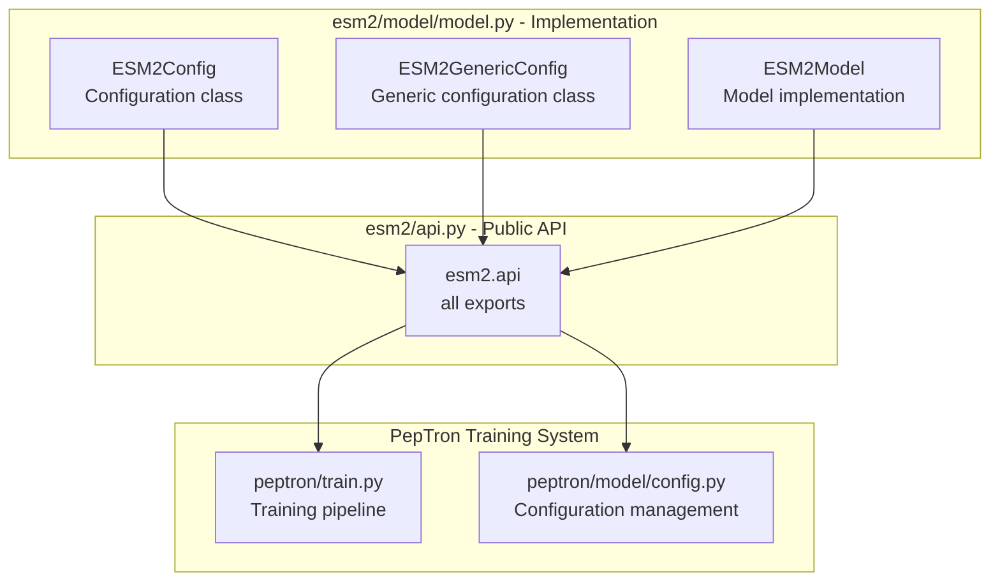
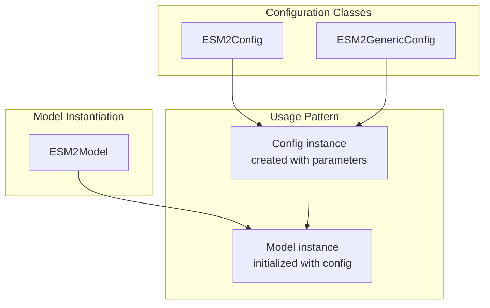
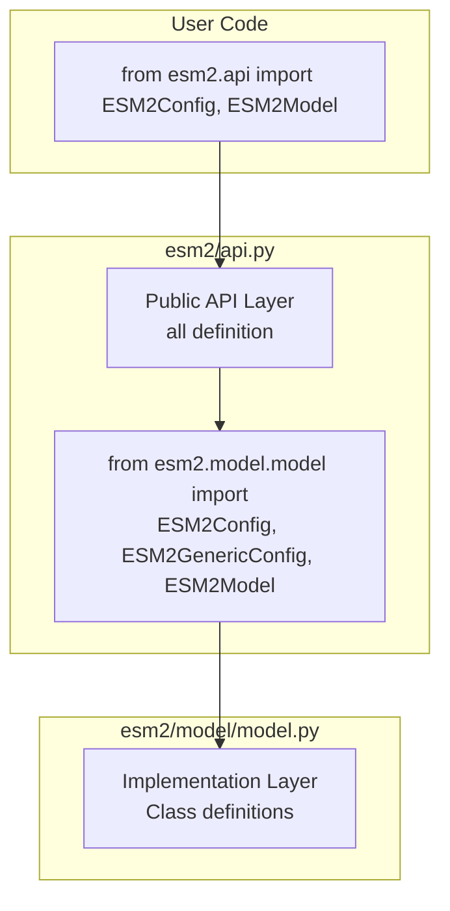
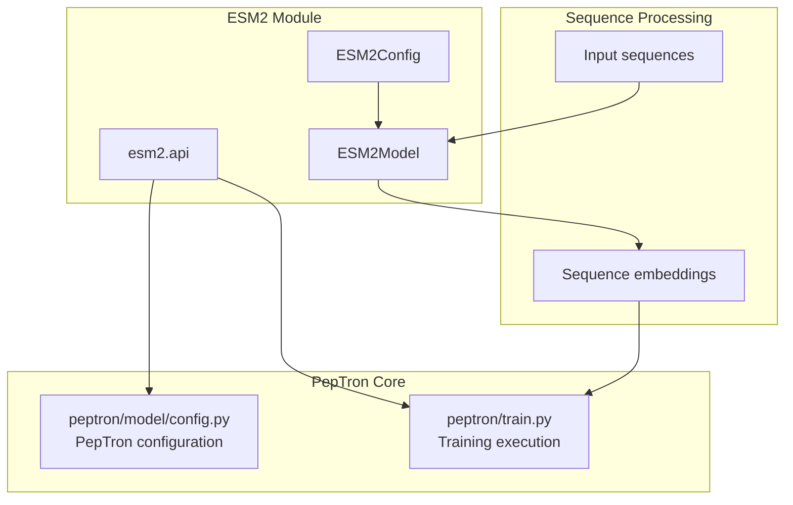

# ESM2 Model Configuration

> **Relevant source files**
> * [esm2/api.py](https://github.com/PeptoneLtd/PepTron/blob/8123ab15/esm2/api.py)

## Purpose and Scope

This document explains the ESM2 model configuration system integrated into PepTron. It covers the configuration classes (`ESM2Config`, `ESM2GenericConfig`) and the `ESM2Model` class that define the ESM2 protein language model components used for sequence embedding and processing within the PepTron pipeline.

For information about ESM2 data loading and processing, see [ESM2 Data Pipeline](/PeptoneLtd/PepTron/7.2-esm2-data-pipeline). For details on sequence tokenization, see [ESM2 Tokenizer](/PeptoneLtd/PepTron/7.3-esm2-tokenizer).

**Sources:** [esm2/api.py L1-L28](https://github.com/PeptoneLtd/PepTron/blob/8123ab15/esm2/api.py#L1-L28)

## Overview

ESM2 (Evolutionary Scale Modeling 2) is a protein language model that provides learned representations of protein sequences. PepTron integrates ESM2 components to process input protein sequences and extract sequence features that inform the structure prediction process. The ESM2 module provides a self-contained implementation with configuration management, model definitions, and data handling utilities.

The ESM2 configuration system consists of two primary configuration classes and a model class that work together to define and instantiate ESM2 models with specific architectural parameters.

**Sources:** [esm2/api.py L1-L28](https://github.com/PeptoneLtd/PepTron/blob/8123ab15/esm2/api.py#L1-L28)

 README.md (ESM2 integration context)

## ESM2 Module Architecture

The following diagram illustrates the organization of the ESM2 module and its exported API surface:



**Sources:** [esm2/api.py L17-L27](https://github.com/PeptoneLtd/PepTron/blob/8123ab15/esm2/api.py#L17-L27)

## Configuration Classes

### ESM2Config

The `ESM2Config` class defines the configuration parameters for instantiating ESM2 models. This class encapsulates architectural hyperparameters that control the model's structure, capacity, and behavior.

**Key Characteristics:**

* Imported from `esm2.model.model` module
* Publicly exported through the `esm2.api` interface
* Used to specify model architecture parameters

**Location:** [esm2/model/model.py](https://github.com/PeptoneLtd/PepTron/blob/8123ab15/esm2/model/model.py)

 (imported at [esm2/api.py L19](https://github.com/PeptoneLtd/PepTron/blob/8123ab15/esm2/api.py#L19-L19)

)

### ESM2GenericConfig

The `ESM2GenericConfig` class provides a generic or flexible configuration interface for ESM2 models. This configuration class likely supports multiple ESM2 model variants or provides a more adaptable configuration schema.

**Key Characteristics:**

* Imported from `esm2.model.model` module
* Publicly exported through the `esm2.api` interface
* Complements `ESM2Config` with additional flexibility

**Location:** [esm2/model/model.py](https://github.com/PeptoneLtd/PepTron/blob/8123ab15/esm2/model/model.py)

 (imported at [esm2/api.py L19](https://github.com/PeptoneLtd/PepTron/blob/8123ab15/esm2/api.py#L19-L19)

)

### Configuration Class Relationship



**Sources:** [esm2/api.py L19-L25](https://github.com/PeptoneLtd/PepTron/blob/8123ab15/esm2/api.py#L19-L25)

## ESM2Model Class

The `ESM2Model` class implements the ESM2 protein language model. This class provides the forward pass implementation, weight initialization, and model architecture definition based on the configuration provided by `ESM2Config` or `ESM2GenericConfig`.

**Key Characteristics:**

* Core model implementation for ESM2 architecture
* Initialized using configuration objects
* Provides sequence embedding and representation learning
* Publicly exported through the `esm2.api` interface

**Location:** [esm2/model/model.py](https://github.com/PeptoneLtd/PepTron/blob/8123ab15/esm2/model/model.py)

 (imported at [esm2/api.py L20](https://github.com/PeptoneLtd/PepTron/blob/8123ab15/esm2/api.py#L20-L20)

)

**Sources:** [esm2/api.py L20-L26](https://github.com/PeptoneLtd/PepTron/blob/8123ab15/esm2/api.py#L20-L26)

## API Export Structure

The ESM2 module follows Python best practices by defining a clear public API through the `__all__` variable. This explicit export list controls which symbols are available when users import from the `esm2` package.

### Exported Symbols

The following table lists all publicly exported symbols from the ESM2 API:

| Symbol | Type | Purpose |
| --- | --- | --- |
| `ESM2Config` | Class | Standard configuration for ESM2 models |
| `ESM2GenericConfig` | Class | Generic/flexible configuration interface |
| `ESM2Model` | Class | ESM2 model implementation |

**Implementation:**

```yaml
__all__: Sequence[str] = (    "ESM2Config",    "ESM2GenericConfig",    "ESM2Model",)
```

**Location:** [esm2/api.py L23-L27](https://github.com/PeptoneLtd/PepTron/blob/8123ab15/esm2/api.py#L23-L27)

**Sources:** [esm2/api.py L23-L27](https://github.com/PeptoneLtd/PepTron/blob/8123ab15/esm2/api.py#L23-L27)

## Import Structure

The ESM2 API follows a clean separation between public interface and implementation details:



**Sources:** [esm2/api.py L17-L27](https://github.com/PeptoneLtd/PepTron/blob/8123ab15/esm2/api.py#L17-L27)

## Integration with PepTron

The ESM2 module integrates into the PepTron system as a utility component that provides sequence processing capabilities. The integration points include:

### Training Pipeline Integration

During training, ESM2 components may be used to:

* Process input protein sequences
* Extract sequence embeddings for downstream tasks
* Provide learned representations that complement structural features

### Configuration Integration

The ESM2 configuration classes may be referenced or integrated within the broader PepTron configuration system documented in [Configuration System](/PeptoneLtd/PepTron/3.1-configuration-system).



**Sources:** [esm2/api.py L1-L28](https://github.com/PeptoneLtd/PepTron/blob/8123ab15/esm2/api.py#L1-L28)

 High-level architecture diagrams

## Usage Pattern

While the specific usage patterns depend on the PepTron implementation, the typical workflow for using ESM2 configuration involves:

1. **Import configuration and model classes:** ```javascript from esm2.api import ESM2Config, ESM2Model ```
2. **Create a configuration instance:** * Instantiate `ESM2Config` with desired parameters * Or use `ESM2GenericConfig` for flexible configuration
3. **Initialize the model:** * Pass the configuration to `ESM2Model` * Load pre-trained weights if available
4. **Use the model for sequence processing:** * Forward pass through the model with tokenized sequences * Extract embeddings or predictions

**Sources:** [esm2/api.py L19-L27](https://github.com/PeptoneLtd/PepTron/blob/8123ab15/esm2/api.py#L19-L27)

## Related Components

The ESM2 model configuration works in conjunction with other ESM2 module components:

| Component | Purpose | Documentation |
| --- | --- | --- |
| Data Pipeline | Loads and batches protein sequences for ESM2 processing | [ESM2 Data Pipeline](/PeptoneLtd/PepTron/7.2-esm2-data-pipeline) |
| Tokenizer | Converts protein sequences to token IDs for model input | [ESM2 Tokenizer](/PeptoneLtd/PepTron/7.3-esm2-tokenizer) |
| Training Config | Overall PepTron training configuration | [Training Configuration](/PeptoneLtd/PepTron/5.1-training-configuration) |

**Sources:** Table of contents, [esm2/api.py L1-L28](https://github.com/PeptoneLtd/PepTron/blob/8123ab15/esm2/api.py#L1-L28)