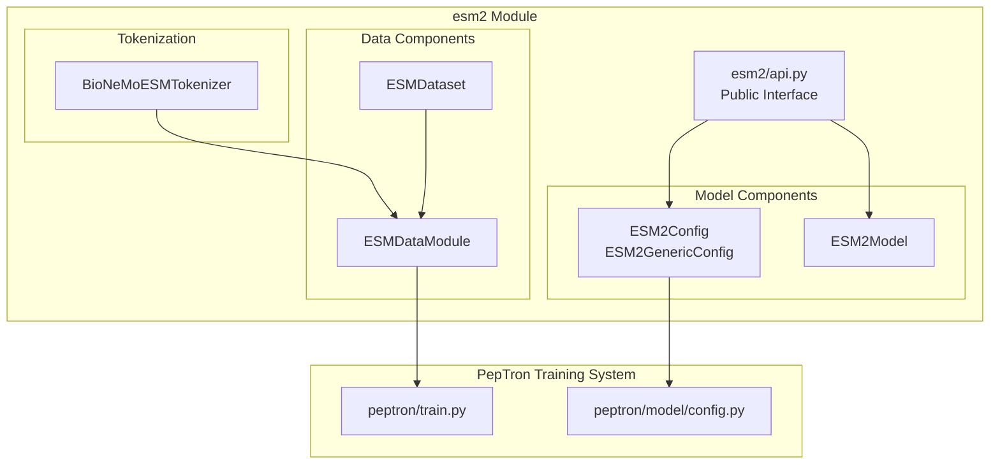
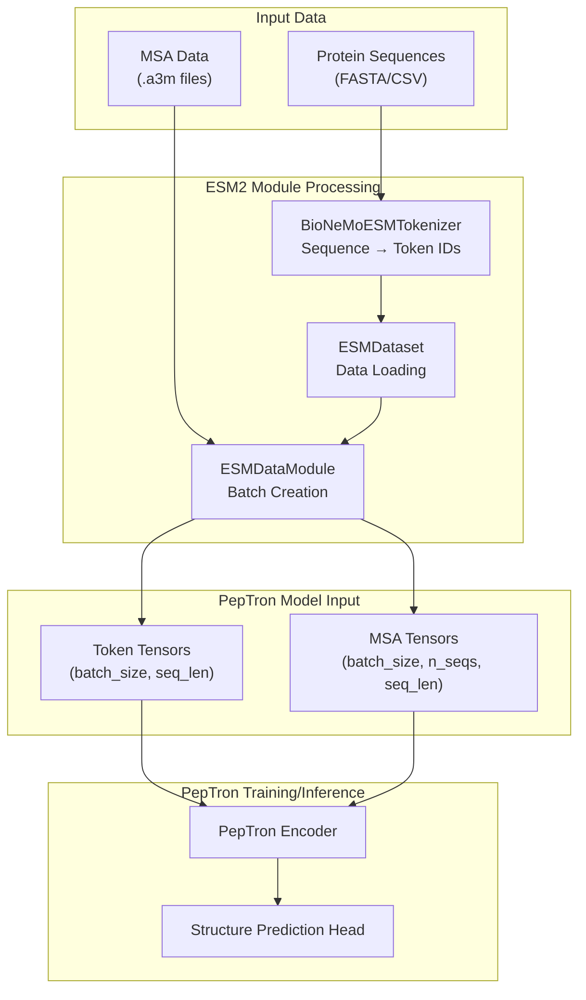
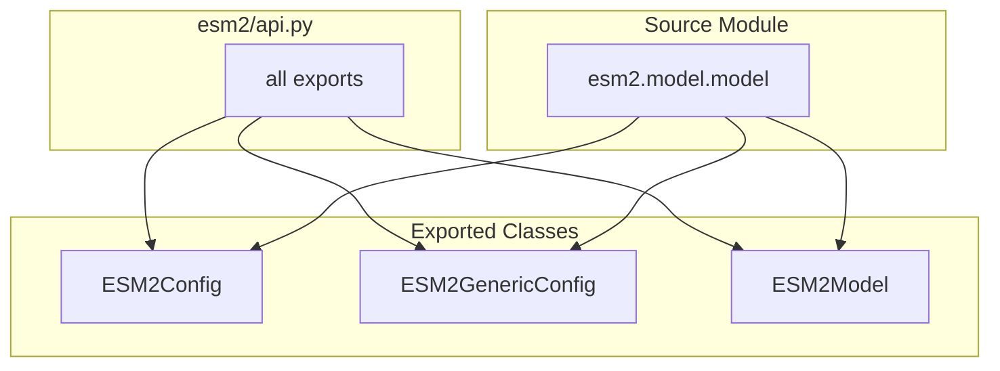

# ESM2 Module

> **Relevant source files**
> * [esm2/__init__.py](https://github.com/PeptoneLtd/PepTron/blob/8123ab15/esm2/__init__.py)
> * [esm2/api.py](https://github.com/PeptoneLtd/PepTron/blob/8123ab15/esm2/api.py)

## Purpose and Scope

The ESM2 Module provides sequence processing utilities for the PepTron system, including tokenization, data loading, and model configuration components adapted from the ESM2 (Evolutionary Scale Modeling 2) protein language model architecture. This module serves as a bridge between raw protein sequences and the neural network representations required by PepTron's training and inference pipelines.

This document covers the overall architecture and role of the ESM2 module within PepTron. For detailed information about specific components, see:

* ESM2 Model Configuration ([7.1](/PeptoneLtd/PepTron/7.1-esm2-model-configuration))
* ESM2 Data Pipeline ([7.2](/PeptoneLtd/PepTron/7.2-esm2-data-pipeline))
* ESM2 Tokenizer ([7.3](/PeptoneLtd/PepTron/7.3-esm2-tokenizer))

## Overview

The ESM2 module is derived from NVIDIA BioNeMo's ESM2 implementation and provides essential sequence processing capabilities for PepTron. While PepTron is a structure prediction model, it leverages ESM2's tokenization scheme and data handling infrastructure to process protein sequences consistently with established protein language modeling standards.

The module is not used to perform ESM2 model inference directly, but rather provides:

* Standardized protein sequence tokenization
* Data pipeline components for batch loading
* Configuration templates compatible with NeMo's training framework
* Utilities for handling special tokens (padding, masking, beginning/end markers)

**Sources:** [esm2/api.py L1-L28](https://github.com/PeptoneLtd/PepTron/blob/8123ab15/esm2/api.py#L1-L28)

## Module Architecture

The ESM2 module is organized into distinct functional components, each serving a specific role in the sequence-to-tensor transformation pipeline:

**Sources:** [esm2/api.py L19-L27](https://github.com/PeptoneLtd/PepTron/blob/8123ab15/esm2/api.py#L19-L27)

## Integration with PepTron

The ESM2 module integrates into PepTron's training and inference pipelines as a sequence preprocessing layer. The following diagram illustrates the data flow from raw sequences through ESM2 components to model input:

**Sources:** [esm2/api.py L1-L28](https://github.com/PeptoneLtd/PepTron/blob/8123ab15/esm2/api.py#L1-L28)

## Core Components

The ESM2 module exposes three primary component types through its public API:

### Configuration Classes

| Class | Purpose | Location |
| --- | --- | --- |
| `ESM2Config` | Standard ESM2 model configuration | `esm2.model.model` |
| `ESM2GenericConfig` | Generic configuration wrapper | `esm2.model.model` |

These configuration classes provide templates for model architecture parameters compatible with NeMo's distributed training framework. See [7.1](/PeptoneLtd/PepTron/7.1-esm2-model-configuration) for detailed documentation.

### Model Class

| Class | Purpose | Location |
| --- | --- | --- |
| `ESM2Model` | ESM2 model implementation | `esm2.model.model` |

The model class provides the neural network architecture, though PepTron primarily uses its tokenization and data handling rather than the model weights directly. See [7.1](/PeptoneLtd/PepTron/7.1-esm2-model-configuration) for detailed documentation.

### Data Pipeline Components

The data pipeline components (not directly exposed in `api.py` but available throughout the module) include:

* `ESMDataModule`: PyTorch Lightning data module for batch creation and data loading
* `ESMDataset`: Dataset class for protein sequences
* `BioNeMoESMTokenizer`: Tokenizer implementing ESM2's vocabulary and special tokens

See [7.2](/PeptoneLtd/PepTron/7.2-esm2-data-pipeline) for data pipeline documentation and [7.3](/PeptoneLtd/PepTron/7.3-esm2-tokenizer) for tokenizer documentation.

**Sources:** [esm2/api.py L19-L27](https://github.com/PeptoneLtd/PepTron/blob/8123ab15/esm2/api.py#L19-L27)

## Module Interface

The ESM2 module's public interface is defined in `esm2/api.py`, which exports three key classes:

This design pattern provides a clean separation between the public API and internal implementation details, allowing users to import from `esm2.api` without needing to know the internal module structure.

**Sources:** [esm2/api.py L17-L27](https://github.com/PeptoneLtd/PepTron/blob/8123ab15/esm2/api.py#L17-L27)

## Relationship to NVIDIA BioNeMo

The ESM2 module is derived from NVIDIA BioNeMo Framework 2.3's ESM2 implementation. As indicated in Diagram 6 of the high-level system architecture, PepTron builds on top of the BioNeMo base environment, which provides:

* Pre-configured ESM2 model implementations
* Distributed training infrastructure via NeMo
* GPU-optimized operations through Triton and cuequivariance
* Integration with PyTorch Lightning for training orchestration

PepTron adapts these components to its specific use case of structure prediction with disorder modeling, maintaining compatibility with BioNeMo's ecosystem while extending functionality for ensemble generation.

**Sources:** [esm2/api.py L1-L28](https://github.com/PeptoneLtd/PepTron/blob/8123ab15/esm2/api.py#L1-L28)

## Usage Context

Within PepTron's workflow, the ESM2 module is primarily utilized during:

1. **Training Data Preparation**: Tokenizing sequences from PDB and IDRome-o datasets
2. **Batch Loading**: Creating training batches with proper padding and masking
3. **Sequence Encoding**: Converting raw amino acid sequences to numerical representations
4. **MSA Processing**: Handling multiple sequence alignment data alongside primary sequences

The module is invoked automatically by PepTron's training pipeline ([5](/PeptoneLtd/PepTron/5-training)) and does not typically require direct user interaction. Configuration parameters related to ESM2 components are managed through PepTron's centralized configuration system ([3.1](/PeptoneLtd/PepTron/3.1-configuration-system)).

**Sources:** [esm2/__init__.py L1-L15](https://github.com/PeptoneLtd/PepTron/blob/8123ab15/esm2/__init__.py#L1-L15)

 [esm2/api.py L1-L28](https://github.com/PeptoneLtd/PepTron/blob/8123ab15/esm2/api.py#L1-L28)