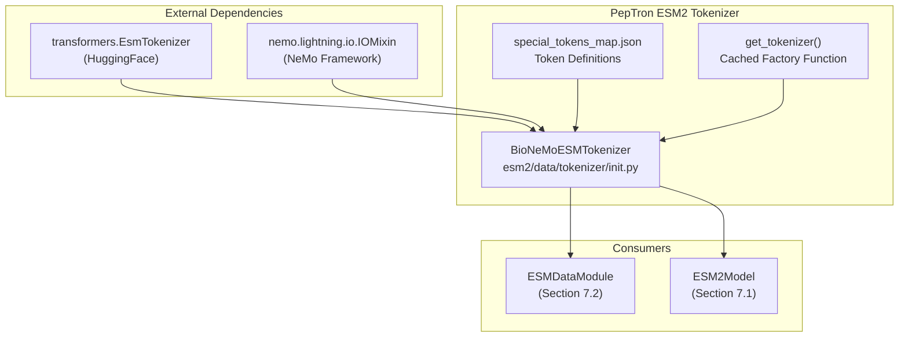
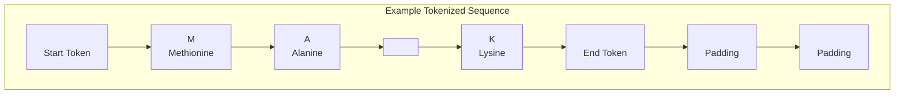
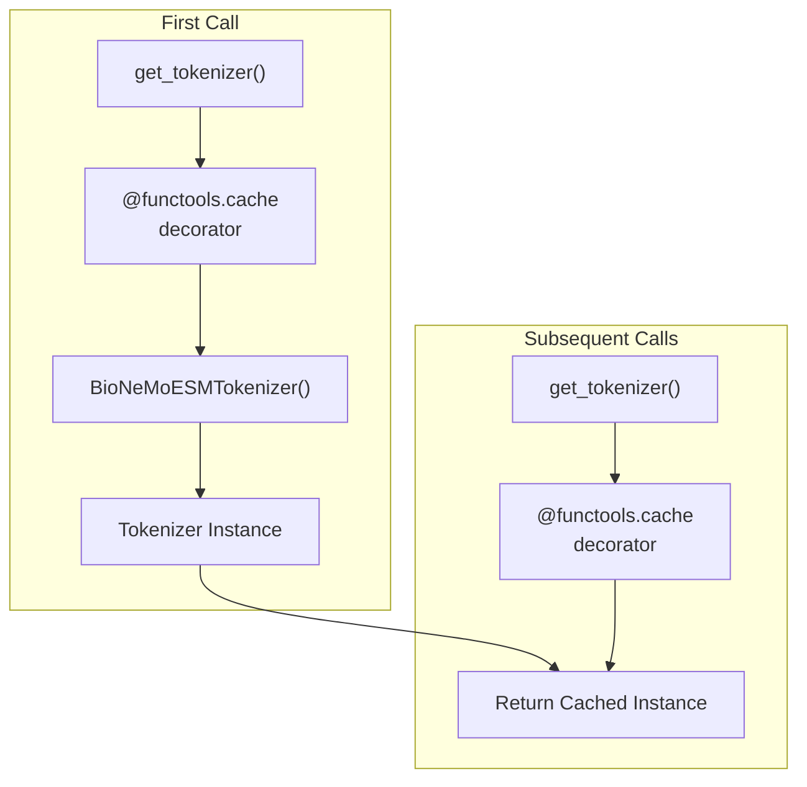
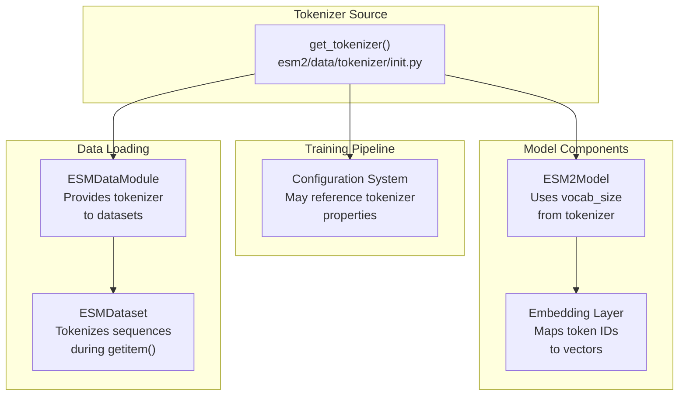

# ESM2 Tokenizer

> **Relevant source files**
> * [esm2/data/tokenizer/__init__.py](https://github.com/PeptoneLtd/PepTron/blob/8123ab15/esm2/data/tokenizer/__init__.py)
> * [esm2/data/tokenizer/special_tokens_map.json](https://github.com/PeptoneLtd/PepTron/blob/8123ab15/esm2/data/tokenizer/special_tokens_map.json)

## Purpose and Scope

This document describes the ESM2 tokenizer implementation used in PepTron for converting protein sequences into token representations that can be processed by the ESM2 model. The tokenizer handles amino acid sequence encoding, special token management, and provides a serializable interface compatible with NeMo's distributed training framework.

For information about the broader ESM2 model architecture and configuration, see [ESM2 Model Configuration](/PeptoneLtd/PepTron/7.1-esm2-model-configuration). For details on how tokenized sequences are loaded and processed during training, see [ESM2 Data Pipeline](/PeptoneLtd/PepTron/7.2-esm2-data-pipeline).

## Architecture Overview

The ESM2 tokenizer system consists of a thin wrapper around HuggingFace's `transformers.EsmTokenizer` that adds NeMo serialization capabilities and caches tokenizer instances for efficient reuse.



**Sources:** [esm2/data/tokenizer/__init__.py L1-L34](https://github.com/PeptoneLtd/PepTron/blob/8123ab15/esm2/data/tokenizer/__init__.py#L1-L34)

## BioNeMoESMTokenizer Class

The `BioNeMoESMTokenizer` class extends both `transformers.EsmTokenizer` and `nemo.lightning.io.IOMixin` to provide a serializable tokenizer compatible with NeMo's distributed training infrastructure.

### Class Definition

The tokenizer is implemented as a dual-inheritance class that combines HuggingFace tokenization functionality with NeMo I/O capabilities:

| Class | Purpose | Source |
| --- | --- | --- |
| `transformers.EsmTokenizer` | Base tokenizer implementing ESM2 vocabulary and encoding logic | HuggingFace Transformers |
| `nemo.lightning.io.IOMixin` | Provides serialization/deserialization for distributed training | NeMo Framework |
| `BioNeMoESMTokenizer` | Combines both with initialization from local resources | [esm2/data/tokenizer/__init__.py L23-L28](https://github.com/PeptoneLtd/PepTron/blob/8123ab15/esm2/data/tokenizer/__init__.py#L23-L28) |

### Initialization Process

```mermaid
sequenceDiagram
  participant Client
  participant BioNeMoESMTokenizer
  participant AutoTokenizer
  participant importlib.resources.files()
  participant special_tokens_map.json

  Client->>BioNeMoESMTokenizer: __init__()
  BioNeMoESMTokenizer->>importlib.resources.files(): files("esm2.data.tokenizer")
  importlib.resources.files()-->>BioNeMoESMTokenizer: resource path
  BioNeMoESMTokenizer->>AutoTokenizer: from_pretrained(path, use_fast=True)
  AutoTokenizer->>special_tokens_map.json: Load special tokens
  special_tokens_map.json-->>AutoTokenizer: Token mapping
  AutoTokenizer-->>BioNeMoESMTokenizer: configured tokenizer
  BioNeMoESMTokenizer->>BioNeMoESMTokenizer: self.__dict__.update()
  BioNeMoESMTokenizer-->>Client: initialized instance
```

The initialization follows these steps:

1. **Resource Location**: Uses `importlib.resources.files()` to locate the tokenizer configuration directory at `esm2.data.tokenizer`
2. **AutoTokenizer Loading**: Delegates to `transformers.AutoTokenizer.from_pretrained()` with `use_fast=True` for efficient processing
3. **Attribute Transfer**: Copies all attributes from the HuggingFace tokenizer instance using `self.__dict__.update()`

This design pattern ensures the wrapper maintains full compatibility with the underlying HuggingFace tokenizer while adding NeMo-specific functionality.

**Sources:** [esm2/data/tokenizer/__init__.py L24-L27](https://github.com/PeptoneLtd/PepTron/blob/8123ab15/esm2/data/tokenizer/__init__.py#L24-L27)

## Special Tokens

The tokenizer defines five special tokens used for sequence processing and model training. These tokens are loaded from the configuration file during initialization.

### Token Definitions

| Token | Symbol | Purpose | Typical Position |
| --- | --- | --- | --- |
| `cls_token` | `<cls>` | Marks the beginning of a sequence | Start of sequence |
| `eos_token` | `<eos>` | Marks the end of a sequence | End of sequence |
| `mask_token` | `<mask>` | Represents masked positions during training | Variable (masked language modeling) |
| `pad_token` | `<pad>` | Pads sequences to uniform length in batches | End of sequence (after `<eos>`) |
| `unk_token` | `<unk>` | Represents unknown or invalid amino acids | Variable (unknown residues) |



### Special Token Configuration

The special tokens are defined in a JSON configuration file that follows the HuggingFace tokenizer standard format:

```html
{  "cls_token": "<cls>",  "eos_token": "<eos>",  "mask_token": "<mask>",  "pad_token": "<pad>",  "unk_token": "<unk>"}
```

This configuration is automatically loaded when the tokenizer is initialized and the tokens are accessible as attributes on the tokenizer instance (e.g., `tokenizer.cls_token`, `tokenizer.pad_token`).

**Sources:** [esm2/data/tokenizer/special_tokens_map.json L1-L8](https://github.com/PeptoneLtd/PepTron/blob/8123ab15/esm2/data/tokenizer/special_tokens_map.json#L1-L8)

## Token Management

### Cached Tokenizer Factory

The module provides a `get_tokenizer()` function that implements singleton caching to ensure efficient tokenizer reuse across the application:



The factory function uses Python's `functools.cache` decorator to memoize the tokenizer instance:

* **First Invocation**: Creates a new `BioNeMoESMTokenizer` instance and caches it
* **Subsequent Invocations**: Returns the cached instance without re-initialization
* **Thread Safety**: The cache decorator provides thread-safe access in multi-threaded environments

This pattern is particularly important in distributed training scenarios where multiple processes may need tokenizer access, as it prevents redundant initialization overhead.

**Sources:** [esm2/data/tokenizer/__init__.py L30-L33](https://github.com/PeptoneLtd/PepTron/blob/8123ab15/esm2/data/tokenizer/__init__.py#L30-L33)

## Usage Patterns

### Obtaining a Tokenizer Instance

The recommended way to obtain a tokenizer is through the factory function:

```javascript
from esm2.data.tokenizer import get_tokenizer tokenizer = get_tokenizer()
```

This approach ensures:

1. Consistent tokenizer configuration across the application
2. Efficient memory usage through instance caching
3. Compatibility with NeMo's serialization mechanisms

### Integration Points

The tokenizer integrates with several components in the PepTron system:



### Tokenization Workflow

The typical tokenization workflow in PepTron follows this sequence:

1. **Sequence Input**: Raw amino acid sequence (string)
2. **Encoding**: Tokenizer converts sequence to token IDs with special tokens
3. **Padding**: Sequences in a batch are padded to uniform length
4. **Model Input**: Token IDs are passed to embedding layer

The tokenizer handles all these steps through its inherited HuggingFace methods like `encode()`, `encode_plus()`, and `batch_encode_plus()`.

**Sources:** [esm2/data/tokenizer/__init__.py L1-L34](https://github.com/PeptoneLtd/PepTron/blob/8123ab15/esm2/data/tokenizer/__init__.py#L1-L34)

 [esm2/data/tokenizer/special_tokens_map.json L1-L8](https://github.com/PeptoneLtd/PepTron/blob/8123ab15/esm2/data/tokenizer/special_tokens_map.json#L1-L8)

## Implementation Details

### Serialization for Distributed Training

The inheritance from `nemo.lightning.io.IOMixin` enables the tokenizer to be serialized and distributed across multiple GPUs or nodes during training. This is critical for:

* **Checkpoint Saving**: Tokenizer configuration is saved with model checkpoints
* **Multi-Process Training**: Each process can deserialize its own tokenizer instance
* **Reproducibility**: Ensures consistent tokenization across training runs

### Fast Tokenizer Configuration

The tokenizer is initialized with `use_fast=True`, which enables:

* Rust-based tokenization for improved performance
* Parallel processing of batches
* Reduced memory overhead during tokenization

This optimization is particularly important when processing large protein datasets during training.

**Sources:** [esm2/data/tokenizer/__init__.py L23-L28](https://github.com/PeptoneLtd/PepTron/blob/8123ab15/esm2/data/tokenizer/__init__.py#L23-L28)