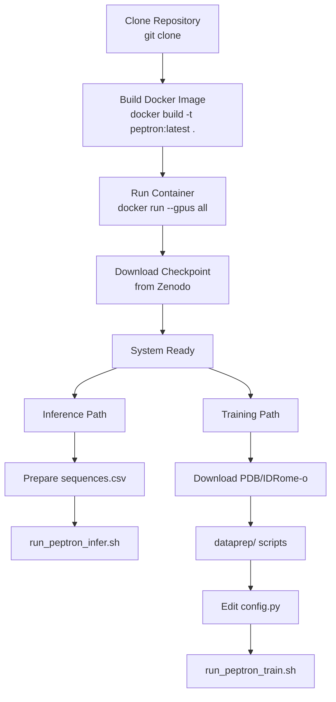
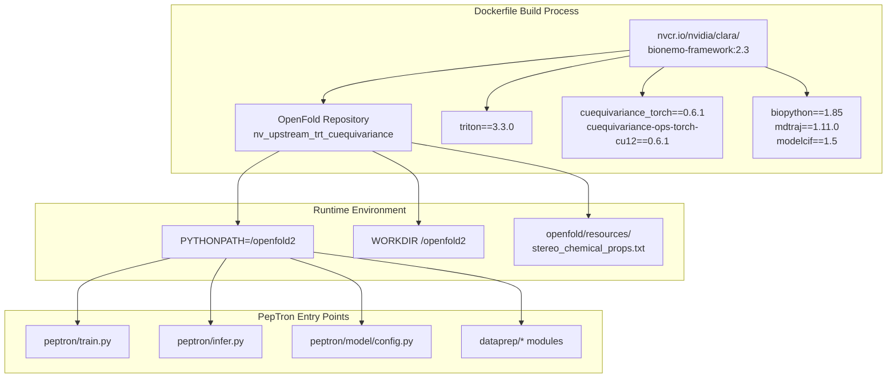

# Getting Started

> **Relevant source files**
> * [Dockerfile](https://github.com/PeptoneLtd/PepTron/blob/8123ab15/Dockerfile)
> * [README.md](https://github.com/PeptoneLtd/PepTron/blob/8123ab15/README.md?plain=1)

This page provides an overview of the initial setup process and basic workflows for using PepTron. It is designed to orient new users to the system and guide them through their first steps, whether running inference on pre-trained models or training custom models.

For detailed installation instructions, see [Installation and Environment Setup](/PeptoneLtd/PepTron/2.1-installation-and-environment-setup). For a minimal working example to immediately generate protein structures, see [Quick Start: Running Inference](/PeptoneLtd/PepTron/2.2-quick-start:-running-inference).

---

## Prerequisites

Before beginning, ensure you have:

| Requirement | Description |
| --- | --- |
| **NVIDIA GPU** | CUDA-capable GPU with sufficient memory (recommended: 24GB+ VRAM) |
| **Docker** | Docker Engine with NVIDIA Container Toolkit for GPU support |
| **Git** | For cloning the repository |
| **Disk Space** | Minimum 50GB for container and checkpoints; more for training datasets |

---

## Setup Workflow Overview

The following diagram illustrates the complete setup process from repository clone to ready-to-use system:



**Sources:** [README.md L14-L26](https://github.com/PeptoneLtd/PepTron/blob/8123ab15/README.md?plain=1#L14-L26)

 [README.md L35-L73](https://github.com/PeptoneLtd/PepTron/blob/8123ab15/README.md?plain=1#L35-L73)

 [README.md L75-L173](https://github.com/PeptoneLtd/PepTron/blob/8123ab15/README.md?plain=1#L75-L173)

---

## Container Architecture

PepTron operates within a containerized environment built on NVIDIA BioNeMo Framework 2.3. The following diagram maps the container components to their source code entities:



**Sources:** [Dockerfile L1-L45](https://github.com/PeptoneLtd/PepTron/blob/8123ab15/Dockerfile#L1-L45)

---

## Pre-trained Model Checkpoints

Two checkpoint variants are available from [Zenodo](https://zenodo.org/records/17306061):

| Checkpoint | Training Data | Use Case |
| --- | --- | --- |
| **PepTron** | PDB + IDRome-o (mixed) | Recommended for all predictions; handles full proteome including disordered regions |
| **PepTron-base** | PDB only (structured) | Pre-training checkpoint; use for structured-only inference or as initialization for custom fine-tuning |

After downloading, extract the `.tar.gz` file. The resulting `peptron-checkpoint/` directory is the checkpoint path used in configuration files.

For detailed information on checkpoint lineage and use cases, see [Model Checkpoints](/PeptoneLtd/PepTron/3.2-model-checkpoints).

**Sources:** [README.md L28-L33](https://github.com/PeptoneLtd/PepTron/blob/8123ab15/README.md?plain=1#L28-L33)

 [README.md L57-L61](https://github.com/PeptoneLtd/PepTron/blob/8123ab15/README.md?plain=1#L57-L61)

---

## Basic Workflows

PepTron supports two primary workflows: **inference** (generating structure ensembles) and **training** (creating custom models). The following diagram shows the execution paths and key files for each workflow:

```mermaid
flowchart TD

Datasets["PDB + IDRome-o datasets<br>(pdb_mmcif/, IDRome_DB-*)"]
DataPrepScripts["dataprep/unpack_mmcif.py<br>dataprep/prep_idrome.py<br>dataprep/cluster_chains.py"]
TrainConfig["peptron/train.py<br>EXEC_CONFIG<br>peptron/model/config.py"]
TrainShell["run_peptron_train.sh"]
TrainRun["python -m peptron.train"]
Checkpoint["experiment_dir/checkpoints/"]
CSVFile["sequences.csv<br>(name, seqres columns)"]
InferShell["run_peptron_infer.sh<br>CKPT_PATH, RESULTS_PATH, CSV_FILE"]
InferConfig["peptron/infer.py<br>EXEC_CONFIG"]
InferRun["python -m peptron.infer"]
Output["results_path/<br>ensembles/, physical_ensembles/"]

subgraph subGraph1 ["Training Workflow"]
    Datasets
    DataPrepScripts
    TrainConfig
    TrainShell
    TrainRun
    Checkpoint
    Datasets --> DataPrepScripts
    DataPrepScripts --> TrainConfig
    TrainConfig --> TrainShell
    TrainShell --> TrainRun
    TrainRun --> Checkpoint
end

subgraph subGraph0 ["Inference Workflow"]
    CSVFile
    InferShell
    InferConfig
    InferRun
    Output
    CSVFile --> InferShell
    InferConfig --> InferShell
    InferShell --> InferRun
    InferRun --> Output
end
```



**Sources:** [README.md L35-L73](https://github.com/PeptoneLtd/PepTron/blob/8123ab15/README.md?plain=1#L35-L73)

 [README.md L75-L173](https://github.com/PeptoneLtd/PepTron/blob/8123ab15/README.md?plain=1#L75-L173)

---

## Configuration System

PepTron uses a centralized configuration system in `peptron/model/config.py`. Both training and inference workflows select a configuration profile using the `config_flags.DEFINE_config_file()` mechanism:

```markdown
# In peptron/infer.pyEXEC_CONFIG = config_flags.DEFINE_config_file(    'config',     'peptron/model/config.py:peptron_o_inference_cueq') # In peptron/train.pyEXEC_CONFIG = config_flags.DEFINE_config_file(    'config',    'peptron/model/config.py:peptron_o_mixed')
```

The configuration file contains named profiles (e.g., `peptron_o_inference_cueq`, `peptron_o_mixed`) that define all parameters for their respective workflows.

For complete documentation of configuration parameters, see [Configuration System](/PeptoneLtd/PepTron/3.1-configuration-system).

**Sources:** [README.md L41-L46](https://github.com/PeptoneLtd/PepTron/blob/8123ab15/README.md?plain=1#L41-L46)

 [README.md L110-L113](https://github.com/PeptoneLtd/PepTron/blob/8123ab15/README.md?plain=1#L110-L113)

---

## Shell Script Orchestration

PepTron provides convenience shell scripts for common operations:

| Script | Purpose | Key Environment Variables |
| --- | --- | --- |
| `run_peptron_infer.sh` | Execute inference pipeline | `CKPT_PATH`, `RESULTS_PATH`, `CSV_FILE` |
| `run_peptron_train.sh` | Single-node training | Configuration via `config.py` |
| `run_peptron_distributed_train.sh` | Multi-node distributed training | Configuration via `config.py` |

These scripts handle the invocation of the Python modules with appropriate flags and environment setup.

**Sources:** [README.md L65-L73](https://github.com/PeptoneLtd/PepTron/blob/8123ab15/README.md?plain=1#L65-L73)

 [README.md L166-L173](https://github.com/PeptoneLtd/PepTron/blob/8123ab15/README.md?plain=1#L166-L173)

---

## Key Parameters for First-Time Users

When starting with PepTron, the most important parameters to understand are:

### Inference Parameters

| Parameter | Default | Description |
| --- | --- | --- |
| `samples` | 10 | Number of conformations per ensemble |
| `steps` | 10 | Diffusion denoising steps |
| `max_batch_size` | 1 | Structures generated in parallel; increase for faster inference if GPU memory allows |
| `num_gpus` | 1 | Number of GPUs to use; must be ≤ number of sequences in CSV |

**Note:** Longer sequences require smaller `max_batch_size` to avoid OOM errors. Start with `max_batch_size=1` and increase based on GPU memory.

### Training Parameters

| Parameter | Description |
| --- | --- |
| `experiment_dir` | Directory for checkpoints and logs |
| `train_data_dir_pdb` | Path to PDB NPZ files |
| `train_data_dir_idp` | Path to IDRome-o NPZ files |
| `train_chains_pdb` | CSV index for PDB chains |
| `train_chains_idp` | CSV index for IDRome-o chains |
| `dataset_prob_pdb` | Probability of sampling PDB (default: 0.3) |
| `dataset_prob_idp` | Probability of sampling IDRome-o (default: 0.7) |

**Sources:** [README.md L175-L199](https://github.com/PeptoneLtd/PepTron/blob/8123ab15/README.md?plain=1#L175-L199)

---

## Next Steps

After completing the setup, proceed to:

1. **For Inference Users:** Follow [Quick Start: Running Inference](/PeptoneLtd/PepTron/2.2-quick-start:-running-inference) to generate your first protein ensemble, then see [Inference](/PeptoneLtd/PepTron/6-inference) for comprehensive documentation.
2. **For Training Users:** Review [Data Preparation Pipeline](/PeptoneLtd/PepTron/4-data-preparation-pipeline) to understand dataset requirements, then see [Training](/PeptoneLtd/PepTron/5-training) for full training documentation.
3. **For Configuration:** Study [Configuration System](/PeptoneLtd/PepTron/3.1-configuration-system) to understand all available parameters and their effects.
4. **For Troubleshooting:** Consult [Troubleshooting](/PeptoneLtd/PepTron/8-troubleshooting) if you encounter issues during setup or execution.

---

## Common Initial Issues

The following table lists frequent issues encountered during initial setup:

| Issue | Solution |
| --- | --- |
| Container fails to access GPU | Verify NVIDIA Container Toolkit installation: `docker run --rm --gpus all nvidia/cuda:11.0-base nvidia-smi` |
| `cuequivariance` import errors | Ignore torchdynamo warnings; errors indicate missing CUDA toolkit in host environment |
| Checkpoint path not found | Ensure checkpoint is extracted and path points to directory containing checkpoint files, not the `.tar.gz` |
| OOM during inference | Reduce `max_batch_size` to 1; for very long sequences (>1000 residues), consider single-GPU inference |

For comprehensive troubleshooting, see [Troubleshooting](/PeptoneLtd/PepTron/8-troubleshooting).

**Sources:** [README.md L211-L224](https://github.com/PeptoneLtd/PepTron/blob/8123ab15/README.md?plain=1#L211-L224)