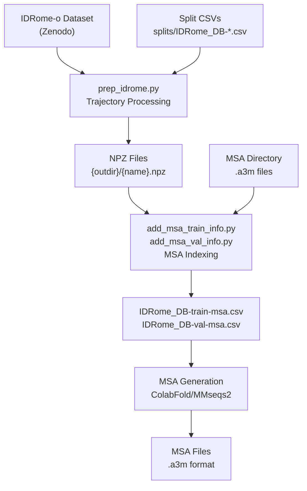
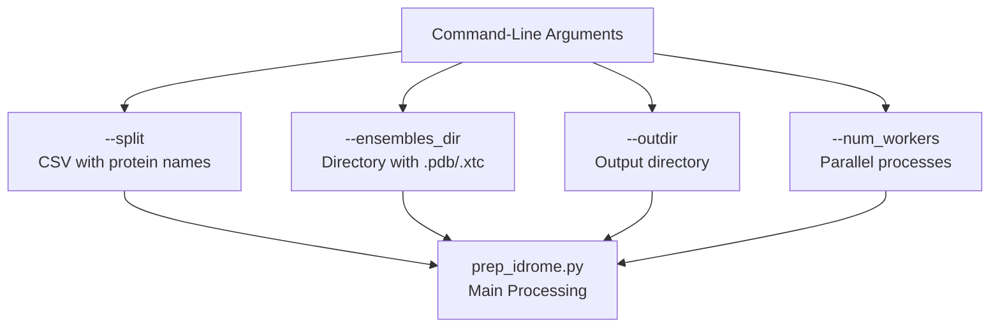
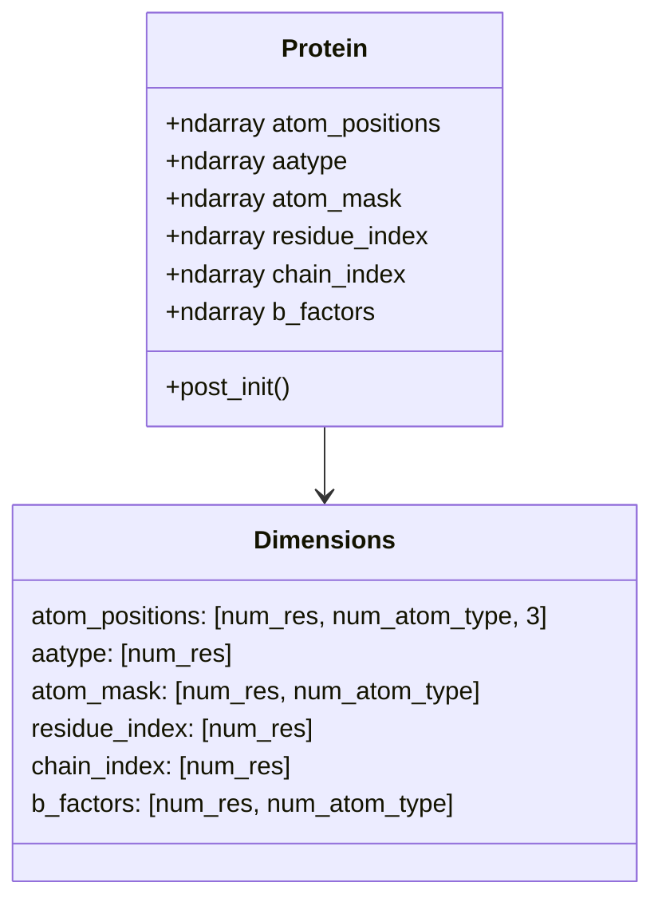
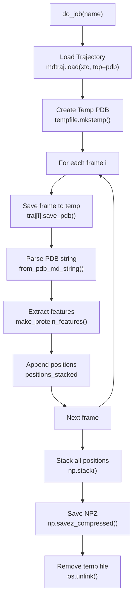
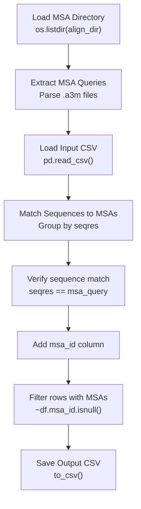
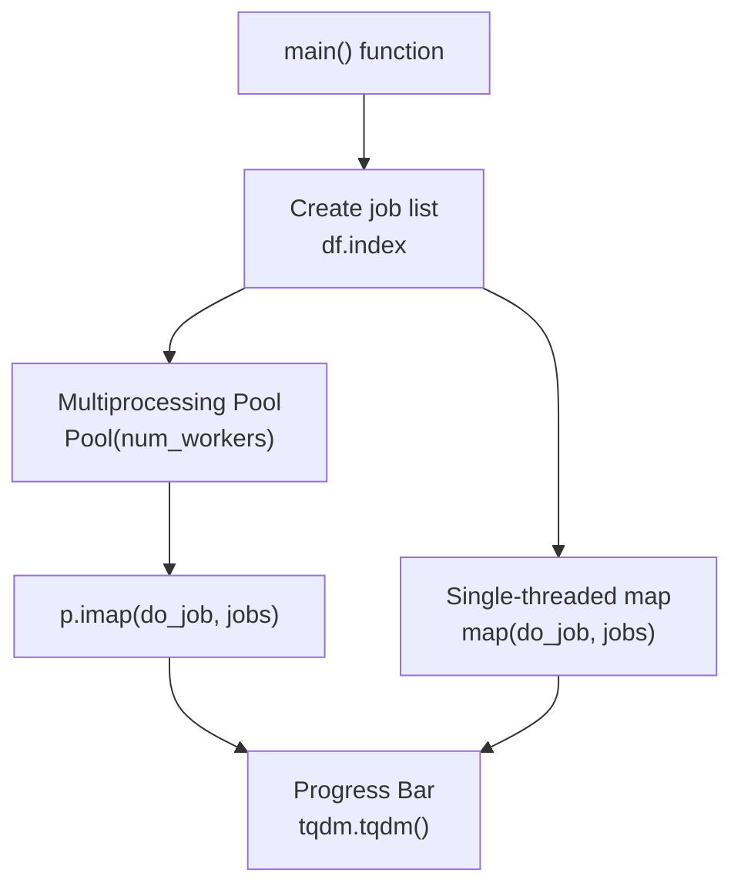

# IDRome-o Dataset Processing

> **Relevant source files**
> * [README.md](https://github.com/PeptoneLtd/PepTron/blob/8123ab15/README.md?plain=1)
> * [dataprep/add_msa_val_info.py](https://github.com/PeptoneLtd/PepTron/blob/8123ab15/dataprep/add_msa_val_info.py)
> * [dataprep/prep_idrome.py](https://github.com/PeptoneLtd/PepTron/blob/8123ab15/dataprep/prep_idrome.py)

## Purpose and Scope

This document describes the processing pipeline for the IDRome-o dataset, which consists of predicted ensemble conformations for intrinsically disordered protein (IDP) sequences. The IDRome-o dataset complements the structured protein data from PDB by providing training examples of proteins with high disorder content.

For information about PDB dataset processing, see [PDB Dataset Processing](/PeptoneLtd/PepTron/4.1-pdb-dataset-processing). For details on MSA generation procedures, see [Multiple Sequence Alignment (MSA) Generation](/PeptoneLtd/PepTron/4.3-multiple-sequence-alignment-(msa)-generation).

**Sources:** [README.md L96-L106](https://github.com/PeptoneLtd/PepTron/blob/8123ab15/README.md?plain=1#L96-L106)

---

## Dataset Overview

The IDRome-o dataset contains predicted ensemble trajectories for sequences sourced from the [IDRome database](https://github.com/PeptoneLtd/PepTron/blob/8123ab15/IDRome database)

 These ensembles were generated using the [IDP-o tool](https://github.com/PeptoneLtd/PepTron/blob/8123ab15/IDP-o tool)

 which specializes in modeling intrinsically disordered proteins.

The dataset is split into two subsets:

* **Training split**: `splits/IDRome_DB-train.csv`
* **Validation split**: `splits/IDRome_DB-val.csv`

The full IDRome-o dataset is available for download from [Zenodo](https://zenodo.org/records/17306061).

**Sources:** [README.md L96-L99](https://github.com/PeptoneLtd/PepTron/blob/8123ab15/README.md?plain=1#L96-L99)

---

## Input Data Format

### Ensemble Files

IDRome-o ensemble predictions are stored as molecular dynamics trajectories with the following structure:

| File Type | Extension | Description |
| --- | --- | --- |
| Topology | `.pdb` | Reference structure defining atom connectivity |
| Trajectory | `.xtc` | Compressed trajectory containing multiple conformations |

Each protein entry consists of a pair of files:

* `{name}.pdb` - Topology file
* `{name}.xtc` - Trajectory file with ensemble conformations

**Sources:** [dataprep/prep_idrome.py L154-L158](https://github.com/PeptoneLtd/PepTron/blob/8123ab15/dataprep/prep_idrome.py#L154-L158)

---

## Processing Pipeline

### Pipeline Stages



**Pipeline Execution Steps:**

1. **Download Dataset**: Retrieve IDRome-o trajectories from Zenodo
2. **Process Trajectories**: Convert `.xtc` trajectories to `.npz` format using `prep_idrome.py`
3. **Index MSAs**: Add MSA lookup information using `add_msa_train_info.py` and `add_msa_val_info.py`
4. **Generate MSAs**: Create multiple sequence alignments for all entries

**Sources:** [README.md L100-L106](https://github.com/PeptoneLtd/PepTron/blob/8123ab15/README.md?plain=1#L100-L106)

---

## Trajectory Processing Script

### prep_idrome.py Command-Line Interface



### Command Syntax

```
python -m dataprep.prep_idrome \    --split splits/IDRome_DB-train.csv \    --ensembles_dir /path/to/IDRome_ensembles \    --outdir /path/to/output \    --num_workers 8
```

### Arguments

| Parameter | Type | Default | Description |
| --- | --- | --- | --- |
| `--split` | str | `splits/IDRome_DB-val.csv` | CSV file containing protein names |
| `--ensembles_dir` | str | Required | Directory with `.pdb` and `.xtc` files |
| `--outdir` | str | `./IDRome_DB-clustered-val` | Output directory for `.npz` files |
| `--num_workers` | int | 1 | Number of parallel worker processes |

**Sources:** [dataprep/prep_idrome.py L18-L27](https://github.com/PeptoneLtd/PepTron/blob/8123ab15/dataprep/prep_idrome.py#L18-L27)

---

## Data Processing Implementation

### Protein Data Structure

The script uses a `Protein` dataclass to represent protein structures with the following fields:



| Field | Shape | Type | Description |
| --- | --- | --- | --- |
| `atom_positions` | `[num_res, num_atom_type, 3]` | float32 | Cartesian coordinates in angstroms |
| `aatype` | `[num_res]` | int32 | Amino acid type (0-20, where 20 is 'X') |
| `atom_mask` | `[num_res, num_atom_type]` | float32 | Binary mask for atom presence (1.0 or 0.0) |
| `residue_index` | `[num_res]` | int32 | PDB residue index (not necessarily continuous) |
| `chain_index` | `[num_res]` | int32 | 0-indexed chain identifier |
| `b_factors` | `[num_res, num_atom_type]` | float32 | Temperature factors in sq. angstroms |

**Sources:** [dataprep/prep_idrome.py L34-L67](https://github.com/PeptoneLtd/PepTron/blob/8123ab15/dataprep/prep_idrome.py#L34-L67)

### Processing Workflow



**Processing Steps:**

1. **Load Trajectory**: Read `.xtc` file with topology from `.pdb` file using MDTraj [dataprep/prep_idrome.py L158](https://github.com/PeptoneLtd/PepTron/blob/8123ab15/dataprep/prep_idrome.py#L158-L158)
2. **Iterate Frames**: Process each conformation in the ensemble [dataprep/prep_idrome.py L165](https://github.com/PeptoneLtd/PepTron/blob/8123ab15/dataprep/prep_idrome.py#L165-L165)
3. **Save to Temp File**: Write frame to temporary PDB file [dataprep/prep_idrome.py L166](https://github.com/PeptoneLtd/PepTron/blob/8123ab15/dataprep/prep_idrome.py#L166-L166)
4. **Parse PDB**: Convert PDB string to `Protein` object using `from_pdb_md_string()` [dataprep/prep_idrome.py L169](https://github.com/PeptoneLtd/PepTron/blob/8123ab15/dataprep/prep_idrome.py#L169-L169)
5. **Extract Features**: Generate OpenFold-compatible features using `make_protein_features()` [dataprep/prep_idrome.py L170](https://github.com/PeptoneLtd/PepTron/blob/8123ab15/dataprep/prep_idrome.py#L170-L170)
6. **Stack Positions**: Accumulate atom positions from all frames [dataprep/prep_idrome.py L171](https://github.com/PeptoneLtd/PepTron/blob/8123ab15/dataprep/prep_idrome.py#L171-L171)
7. **Combine and Save**: Stack all positions and save as compressed NPZ [dataprep/prep_idrome.py L174-L177](https://github.com/PeptoneLtd/PepTron/blob/8123ab15/dataprep/prep_idrome.py#L174-L177)

**Sources:** [dataprep/prep_idrome.py L148-L183](https://github.com/PeptoneLtd/PepTron/blob/8123ab15/dataprep/prep_idrome.py#L148-L183)

### PDB Parsing Function

The `from_pdb_md_string()` function converts PDB format strings to `Protein` objects:

**Key Features:**

* Parses single-model PDB structures [dataprep/prep_idrome.py L86-L90](https://github.com/PeptoneLtd/PepTron/blob/8123ab15/dataprep/prep_idrome.py#L86-L90)
* Converts non-standard residues to 'X' (unknown) [dataprep/prep_idrome.py L107-L109](https://github.com/PeptoneLtd/PepTron/blob/8123ab15/dataprep/prep_idrome.py#L107-L109)
* Ignores non-standard atoms [dataprep/prep_idrome.py L114-L115](https://github.com/PeptoneLtd/PepTron/blob/8123ab15/dataprep/prep_idrome.py#L114-L115)
* Skips residues with no known atom positions [dataprep/prep_idrome.py L119-L121](https://github.com/PeptoneLtd/PepTron/blob/8123ab15/dataprep/prep_idrome.py#L119-L121)
* Maps chain IDs to integer indices [dataprep/prep_idrome.py L130-L132](https://github.com/PeptoneLtd/PepTron/blob/8123ab15/dataprep/prep_idrome.py#L130-L132)

**Constraints:**

* Only single-model PDB files are supported [dataprep/prep_idrome.py L87-L89](https://github.com/PeptoneLtd/PepTron/blob/8123ab15/dataprep/prep_idrome.py#L87-L89)
* Insertion codes are not supported [dataprep/prep_idrome.py L103-L106](https://github.com/PeptoneLtd/PepTron/blob/8123ab15/dataprep/prep_idrome.py#L103-L106)
* Maximum 62 chains (limited by PDB format) [dataprep/prep_idrome.py L30-L31](https://github.com/PeptoneLtd/PepTron/blob/8123ab15/dataprep/prep_idrome.py#L30-L31)

**Sources:** [dataprep/prep_idrome.py L69-L141](https://github.com/PeptoneLtd/PepTron/blob/8123ab15/dataprep/prep_idrome.py#L69-L141)

---

## Output Format

### NPZ File Structure

Each processed protein produces a compressed NumPy archive (`.npz`) with the following arrays:

| Key | Shape | Description |
| --- | --- | --- |
| `all_atom_positions` | `[num_frames, num_res, num_atom_type, 3]` | Stacked atom positions from all ensemble members |
| `aatype` | `[num_res]` | Amino acid sequence encoding |
| `atom_mask` | `[num_res, num_atom_type]` | Atom presence mask |
| `residue_index` | `[num_res]` | PDB residue numbering |
| `chain_index` | `[num_res]` | Chain identifiers |
| `b_factors` | `[num_res, num_atom_type]` | Temperature factors |

**Note:** The first dimension of `all_atom_positions` contains all conformations from the ensemble, allowing the model to learn from the distribution of disordered protein structures.

**Sources:** [dataprep/prep_idrome.py L174-L177](https://github.com/PeptoneLtd/PepTron/blob/8123ab15/dataprep/prep_idrome.py#L174-L177)

---

## MSA Indexing

### add_msa_val_info.py Workflow



### Command Syntax

```
python -m dataprep.add_msa_val_info \    --align_dir /path/to/msa_directory \    --incsv IDRome_DB-val.csv \    --outcsv IDRome_DB-val-msa.csv
```

### Arguments

| Parameter | Type | Default | Description |
| --- | --- | --- | --- |
| `--align_dir` | str | Required | Directory containing MSA files |
| `--incsv` | str | `pdb_chains.csv` | Input CSV with protein information |
| `--outcsv` | str | `pdb_chains_msa.csv` | Output CSV with MSA lookup |

**Sources:** [dataprep/add_msa_val_info.py L6-L10](https://github.com/PeptoneLtd/PepTron/blob/8123ab15/dataprep/add_msa_val_info.py#L6-L10)

### MSA File Structure

The script expects MSA files to be organized as:

```
{align_dir}/{pdb_id}/a3m/{pdb_id}.a3m
```

Each `.a3m` file follows the A3M format:

* First line: Header for query sequence
* Second line: Query sequence [dataprep/add_msa_val_info.py L22-L24](https://github.com/PeptoneLtd/PepTron/blob/8123ab15/dataprep/add_msa_val_info.py#L22-L24)
* Subsequent lines: Aligned sequences

**Sources:** [dataprep/add_msa_val_info.py L16-L24](https://github.com/PeptoneLtd/PepTron/blob/8123ab15/dataprep/add_msa_val_info.py#L16-L24)

### Matching Logic

The script performs sequence-to-MSA matching with the following logic:

1. **Group by Sequence**: Proteins with identical sequences are grouped together [dataprep/add_msa_val_info.py L33](https://github.com/PeptoneLtd/PepTron/blob/8123ab15/dataprep/add_msa_val_info.py#L33-L33)
2. **Find MSA Files**: Search for MSA files matching protein names [dataprep/add_msa_val_info.py L35-L38](https://github.com/PeptoneLtd/PepTron/blob/8123ab15/dataprep/add_msa_val_info.py#L35-L38)
3. **Verify Sequence Match**: Confirm that the query sequence in the MSA matches the protein sequence [dataprep/add_msa_val_info.py L41-L42](https://github.com/PeptoneLtd/PepTron/blob/8123ab15/dataprep/add_msa_val_info.py#L41-L42)
4. **Handle Multiple Matches**: If multiple MSA files exist for the same sequence, verify each one [dataprep/add_msa_val_info.py L45-L52](https://github.com/PeptoneLtd/PepTron/blob/8123ab15/dataprep/add_msa_val_info.py#L45-L52)
5. **Add MSA ID**: Assign the matching MSA ID to all proteins with that sequence [dataprep/add_msa_val_info.py L42-L49](https://github.com/PeptoneLtd/PepTron/blob/8123ab15/dataprep/add_msa_val_info.py#L42-L49)

**Output:** Only proteins with successfully matched MSAs are included in the output CSV [dataprep/add_msa_val_info.py L55](https://github.com/PeptoneLtd/PepTron/blob/8123ab15/dataprep/add_msa_val_info.py#L55-L55)

**Sources:** [dataprep/add_msa_val_info.py L28-L56](https://github.com/PeptoneLtd/PepTron/blob/8123ab15/dataprep/add_msa_val_info.py#L28-L56)

---

## Multiprocessing Support

The trajectory processing supports parallel execution to accelerate large-scale data preparation:



### Implementation Details

**Multi-worker Mode** (`num_workers > 1`):

* Uses `multiprocessing.Pool` for parallel execution [dataprep/prep_idrome.py L192](https://github.com/PeptoneLtd/PepTron/blob/8123ab15/dataprep/prep_idrome.py#L192-L192)
* Applies `Pool.imap()` for memory-efficient iteration [dataprep/prep_idrome.py L193](https://github.com/PeptoneLtd/PepTron/blob/8123ab15/dataprep/prep_idrome.py#L193-L193)
* Progress tracked with `tqdm` [dataprep/prep_idrome.py L193](https://github.com/PeptoneLtd/PepTron/blob/8123ab15/dataprep/prep_idrome.py#L193-L193)

**Single-worker Mode** (`num_workers = 1`):

* Uses simple `map()` for easier debugging [dataprep/prep_idrome.py L196](https://github.com/PeptoneLtd/PepTron/blob/8123ab15/dataprep/prep_idrome.py#L196-L196)
* No process overhead, better for error tracing

**Sources:** [dataprep/prep_idrome.py L185-L200](https://github.com/PeptoneLtd/PepTron/blob/8123ab15/dataprep/prep_idrome.py#L185-L200)

---

## Error Handling

The processing pipeline includes robust error handling to ensure partial failures don't halt the entire batch:

```css
try:    # Processing logic    traj = mdtraj.load(traj_path, top=top_path)    # ... process frames ...    np.savez_compressed(f"{args.outdir}/{name}.npz", **pdb_feats)except Exception as e:    logger.error(f'Could not process {name}. Error: {e}. Skipping.')    pass
```

**Behavior:**

* Individual protein failures are logged but don't stop the batch [dataprep/prep_idrome.py L181-L182](https://github.com/PeptoneLtd/PepTron/blob/8123ab15/dataprep/prep_idrome.py#L181-L182)
* Successfully processed proteins are saved to disk
* Failed proteins are skipped with error messages

**Sources:** [dataprep/prep_idrome.py L180-L182](https://github.com/PeptoneLtd/PepTron/blob/8123ab15/dataprep/prep_idrome.py#L180-L182)

---

## Integration with Training Pipeline

The processed IDRome-o data integrates into the training pipeline through the configuration system:

| Configuration Key | Description |
| --- | --- |
| `train_data_dir_idp` | Directory containing processed IDRome NPZ files |
| `train_msa_dir_idp` | Directory containing MSA files for IDRome sequences |
| `train_chains_idp` | CSV file: `splits/IDRome_DB-train-msa.csv` |
| `dataset_prob_idp` | Sampling probability (default: 0.7 for 70% IDP data) |

The mixed training strategy samples from IDRome-o with 70% probability and PDB with 30% probability, allowing the model to learn from both structured and disordered protein conformations.

For complete training configuration details, see [Training Configuration](/PeptoneLtd/PepTron/5.1-training-configuration).

**Sources:** [README.md L149-L156](https://github.com/PeptoneLtd/PepTron/blob/8123ab15/README.md?plain=1#L149-L156)