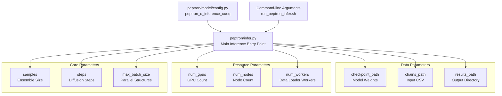
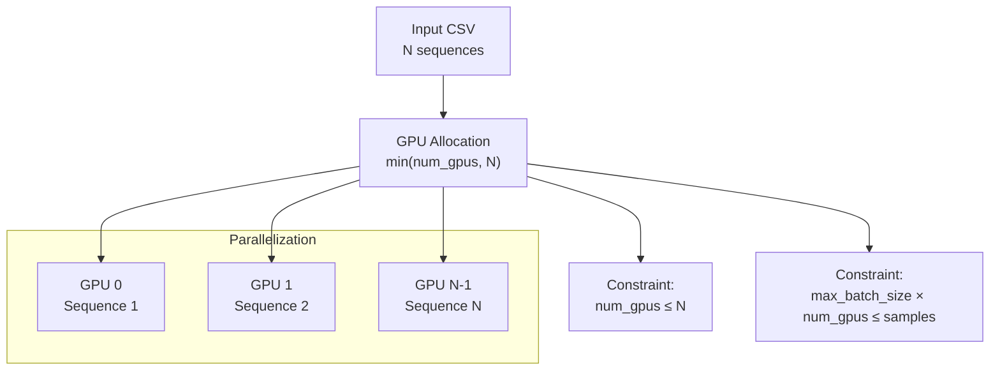
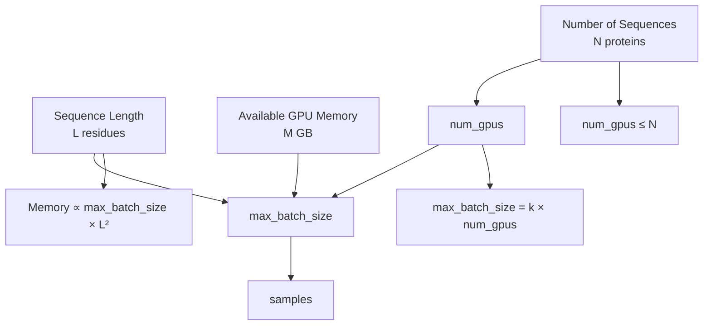
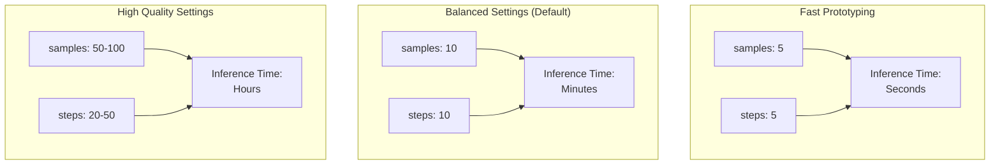

# Inference Configuration

> **Relevant source files**
> * [README.md](https://github.com/PeptoneLtd/PepTron/blob/8123ab15/README.md?plain=1)
> * [run_peptron_infer.sh](https://github.com/PeptoneLtd/PepTron/blob/8123ab15/run_peptron_infer.sh)

This page documents the configuration parameters for running PepTron inference. These parameters control the ensemble generation process, computational resource allocation, and output behavior when generating protein structure ensembles from sequences.

For information about the multi-stage inference pipeline execution, see [Inference Pipeline Stages](/PeptoneLtd/PepTron/6.2-inference-pipeline-stages). For details on output file formats and structure, see [Output Format and Interpretation](/PeptoneLtd/PepTron/6.3-output-format-and-interpretation). For general configuration system architecture, see [Configuration System](/PeptoneLtd/PepTron/3.1-configuration-system).

---

## Overview

PepTron inference configuration is defined through command-line arguments that override default values specified in the configuration file. The primary configuration entry point is `peptron_o_inference_cueq` in [peptron/model/config.py](https://github.com/PeptoneLtd/PepTron/blob/8123ab15/peptron/model/config.py)

 as referenced in [peptron/infer.py L45](https://github.com/PeptoneLtd/PepTron/blob/8123ab15/peptron/infer.py#L45-L45)

### Configuration Flow



**Sources:** [README.md L177-L190](https://github.com/PeptoneLtd/PepTron/blob/8123ab15/README.md?plain=1#L177-L190)

 [run_peptron_infer.sh L16-L25](https://github.com/PeptoneLtd/PepTron/blob/8123ab15/run_peptron_infer.sh#L16-L25)

 [peptron/infer.py L45](https://github.com/PeptoneLtd/PepTron/blob/8123ab15/peptron/infer.py#L45-L45)

---

## Core Inference Parameters

These parameters directly control the generative model's behavior during ensemble generation.

| Parameter | Type | Default | Description | Configuration Path |
| --- | --- | --- | --- | --- |
| `samples` | int | 10 | Number of ensemble conformations to generate per protein sequence | `--config.inference.samples` |
| `steps` | int | 10 | Number of diffusion denoising steps in the reverse process | `--config.inference.steps` |
| `max_batch_size` | int | 1 | Number of conformations generated in parallel for each ensemble | `--config.inference.max_batch_size` |

### Detailed Parameter Descriptions

#### samples

Controls the size of the structural ensemble generated for each input protein sequence. Higher values produce more diverse ensembles that better capture conformational heterogeneity, particularly important for disordered regions. Each sample represents an independent trajectory through the diffusion model's reverse process.

**Typical values:**

* 10: Default for general-purpose inference
* 50-100: High-diversity ensembles for disorder characterization
* 5: Quick prototyping or structured proteins

#### steps

Defines the granularity of the diffusion denoising process. More steps typically improve structural quality by allowing smoother transitions from noise to final structures, but increase computational cost linearly.

**Typical values:**

* 10: Default balanced setting
* 20-50: Higher quality for publication-grade predictions
* 5: Faster inference with acceptable quality loss

#### max_batch_size

Determines GPU memory usage during inference by controlling how many structures are generated simultaneously. This is the primary parameter for managing memory constraints with long sequences.

**Relationship with memory:**

```
GPU Memory ∝ max_batch_size × sequence_length²
```

**Typical values:**

* 1: Safe default for sequences up to 1000 residues on 40GB GPUs
* 2-4: Shorter sequences (<500 residues) on high-memory GPUs
* Must be: `max_batch_size ≤ samples`

**Sources:** [README.md L179-L190](https://github.com/PeptoneLtd/PepTron/blob/8123ab15/README.md?plain=1#L179-L190)

 [run_peptron_infer.sh L9-L10](https://github.com/PeptoneLtd/PepTron/blob/8123ab15/run_peptron_infer.sh#L9-L10)

---

## Resource Management Parameters

These parameters control computational resource allocation during inference execution.

| Parameter | Type | Default | Description | Configuration Path |
| --- | --- | --- | --- | --- |
| `num_gpus` | int | 1 | Number of GPUs to use for parallel inference across sequences | `--config.inference.num_gpus` |
| `num_nodes` | int | 1 | Number of compute nodes for distributed inference | `--config.inference.num_nodes` |
| `num_workers` | int | 8 | Number of CPU workers for data loading | `--config.inference.num_workers` |

### GPU Allocation Strategy



### Key Constraints

**GPU Count Constraint:**

```
num_gpus ≤ number_of_sequences_in_csv
```

As noted in [README.md L186](https://github.com/PeptoneLtd/PepTron/blob/8123ab15/README.md?plain=1#L186-L186)

 the `num_gpus` parameter must not exceed the number of sequences in the input CSV file, as PepTron parallelizes across sequences rather than within a single sequence.

**Batch Size Relationship:**

```
max_batch_size = k × num_gpus
where k is a positive integer and k ≤ samples / num_gpus
```

This relationship, documented in [run_peptron_infer.sh L10](https://github.com/PeptoneLtd/PepTron/blob/8123ab15/run_peptron_infer.sh#L10-L10)

 ensures efficient distribution of ensemble generation across available GPUs.

**Sources:** [README.md L184-L190](https://github.com/PeptoneLtd/PepTron/blob/8123ab15/README.md?plain=1#L184-L190)

 [run_peptron_infer.sh L9-L22](https://github.com/PeptoneLtd/PepTron/blob/8123ab15/run_peptron_infer.sh#L9-L22)

---

## Data Input/Output Parameters

These parameters specify file paths and data sources for the inference pipeline.

| Parameter | Type | Required | Description | Configuration Path |
| --- | --- | --- | --- | --- |
| `checkpoint_path` | str | Yes | Path to the PepTron model checkpoint directory | `--config.inference.checkpoint_path` |
| `chains_path` | str | Yes | Path to input CSV file containing sequences | `--config.inference.chains_path` |
| `results_path` | str | Yes | Directory path for output ensemble files | `--config.inference.results_path` |

### Input CSV Format

The `chains_path` CSV must contain two columns:

```
name,seqresprotein1,MKTAYIAKQRQISFVKSHFSRQLEERLGLIEVQAprotein2,MSHHWGYGKHNGPEHWHKDFPIAKGERQSPVDID
```

* `name`: Unique identifier for the protein sequence
* `seqres`: Amino acid sequence in single-letter code

### Checkpoint Structure

The `checkpoint_path` should point to a directory containing the PepTron checkpoint files. The expected structure after downloading and extracting from Zenodo is:

```
peptron-checkpoint/
├── model weights and configuration files
└── [checkpoint metadata]
```

Download from: [https://zenodo.org/records/17306061](https://zenodo.org/records/17306061)

### Output Directory Organization

The `results_path` directory will contain:

```markdown
results_path/
├── [raw PyTorch tensor outputs]
├── ensembles/               # Created by pt_to_structure
│   └── *.pdb               # PDB format ensembles
└── physical_ensembles/      # Created by filtering step
    └── *_filtered.pdb      # Physically validated ensembles
```

**Sources:** [README.md L50-L73](https://github.com/PeptoneLtd/PepTron/blob/8123ab15/README.md?plain=1#L50-L73)

 [run_peptron_infer.sh L12-L20](https://github.com/PeptoneLtd/PepTron/blob/8123ab15/run_peptron_infer.sh#L12-L20)

---

## Configuration in Practice

### Complete Example Command

The inference configuration is typically specified via the shell script [run_peptron_infer.sh](https://github.com/PeptoneLtd/PepTron/blob/8123ab15/run_peptron_infer.sh)

:

```
python -m peptron.infer \    --config.inference.num_nodes 1 \    --config.inference.checkpoint_path $CKPT_PATH \    --config.inference.chains_path $CSV_FILE \    --config.inference.results_path $RESULTS_PATH \    --config.inference.num_gpus 1 \    --config.inference.max_batch_size 1 \    --config.inference.num_workers 8 \    --config.inference.samples 10 \    --config.inference.steps 10
```

### Parameter Dependencies



**Sources:** [run_peptron_infer.sh L16-L25](https://github.com/PeptoneLtd/PepTron/blob/8123ab15/run_peptron_infer.sh#L16-L25)

 [README.md L186-L190](https://github.com/PeptoneLtd/PepTron/blob/8123ab15/README.md?plain=1#L186-L190)

---

## Tuning Guidelines

### Memory Management

The primary bottleneck in inference is GPU memory, which scales quadratically with sequence length.

| Sequence Length | GPU Memory (40GB) | Recommended max_batch_size |
| --- | --- | --- |
| < 200 residues | Low | 4-8 |
| 200-500 residues | Medium | 2-4 |
| 500-1000 residues | High | 1-2 |
| > 1000 residues | Very High | 1 |

**Strategy:** As stated in [README.md L188-L190](https://github.com/PeptoneLtd/PepTron/blob/8123ab15/README.md?plain=1#L188-L190)

 start with `max_batch_size=1` as a safe configuration, then increase based on your GPU memory and maximum sequence length. The larger the ensemble you want to generate, the more important it is to optimize this parameter.

### Quality vs. Speed Trade-offs



### Multi-Sequence Parallelization

When predicting multiple proteins:

1. **Set `num_gpus` appropriately:** * For N sequences with K available GPUs: `num_gpus = min(N, K)` * Example: 4 sequences on 8 GPUs → `num_gpus=4`
2. **Adjust `max_batch_size` for throughput:** * Each GPU generates `max_batch_size` conformations per inference pass * Total parallel conformations: `max_batch_size × num_gpus` * Must satisfy: `max_batch_size × num_gpus ≤ samples`
3. **Example calculation:** ```yaml Given: 8 sequences, 8 GPUs, want 40 samples per sequence Option 1 (memory conservative): - num_gpus = 8 - max_batch_size = 1 - Total passes needed: 40 (each GPU does 40 passes for its sequence) Option 2 (throughput optimized): - num_gpus = 8 - max_batch_size = 5 - Total passes needed: 8 (5 samples × 8 passes = 40 samples) - Requires: 5× more GPU memory per GPU ```

**Sources:** [README.md L186-L190](https://github.com/PeptoneLtd/PepTron/blob/8123ab15/README.md?plain=1#L186-L190)

 [run_peptron_infer.sh L9-L10](https://github.com/PeptoneLtd/PepTron/blob/8123ab15/run_peptron_infer.sh#L9-L10)

---

## Environment Variables

The inference script sets several environment variables in [run_peptron_infer.sh L3-L7](https://github.com/PeptoneLtd/PepTron/blob/8123ab15/run_peptron_infer.sh#L3-L7)

:

| Variable | Value | Purpose |
| --- | --- | --- |
| `NCCL_TIMEOUT` | 3600 | Extends NCCL timeout for long-running operations |
| `TORCH_NCCL_ENABLE_MONITORING` | 0 | Disables NCCL monitoring to reduce overhead |
| `TORCHDYNAMO_SUPPRESS_ERRORS` | 1 | Suppresses TorchDynamo errors (expected with cuequivariance) |
| `CUDA_LAUNCH_BLOCKING` | 1 | Enables synchronous CUDA operations for debugging |
| `PYTHONPATH` | . | Ensures module imports work from repository root |

These are typically pre-configured and do not require user modification unless troubleshooting specific issues.

**Sources:** [run_peptron_infer.sh L3-L7](https://github.com/PeptoneLtd/PepTron/blob/8123ab15/run_peptron_infer.sh#L3-L7)

---

## Common Configuration Patterns

### Pattern 1: High-Quality Disorder Characterization

```
--config.inference.samples 100 \--config.inference.steps 20 \--config.inference.max_batch_size 1 \--config.inference.num_gpus 4
```

Use for: IDP characterization, publication-quality ensembles

### Pattern 2: Balanced Production Inference

```
--config.inference.samples 10 \--config.inference.steps 10 \--config.inference.max_batch_size 2 \--config.inference.num_gpus 8
```

Use for: Standard structure prediction, routine analysis

### Pattern 3: Rapid Prototyping

```
--config.inference.samples 5 \--config.inference.steps 5 \--config.inference.max_batch_size 1 \--config.inference.num_gpus 1
```

Use for: Testing workflows, preliminary analysis

**Sources:** [README.md L177-L190](https://github.com/PeptoneLtd/PepTron/blob/8123ab15/README.md?plain=1#L177-L190)

 [run_peptron_infer.sh L16-L25](https://github.com/PeptoneLtd/PepTron/blob/8123ab15/run_peptron_infer.sh#L16-L25)