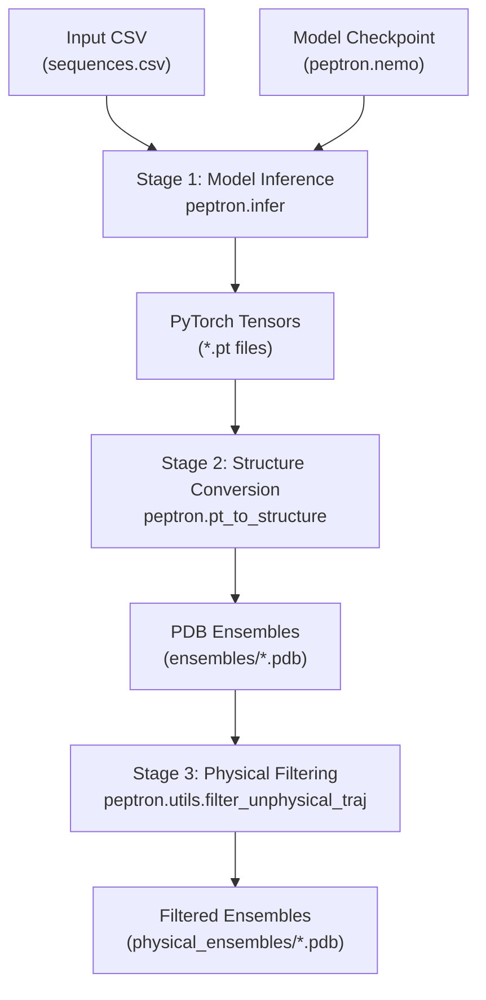
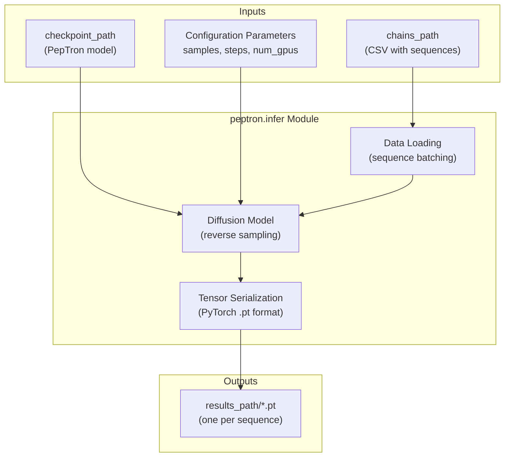
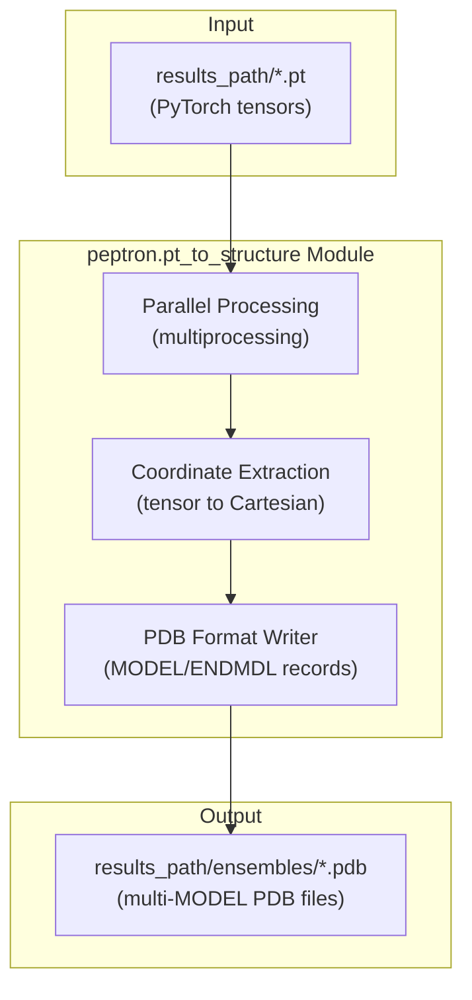
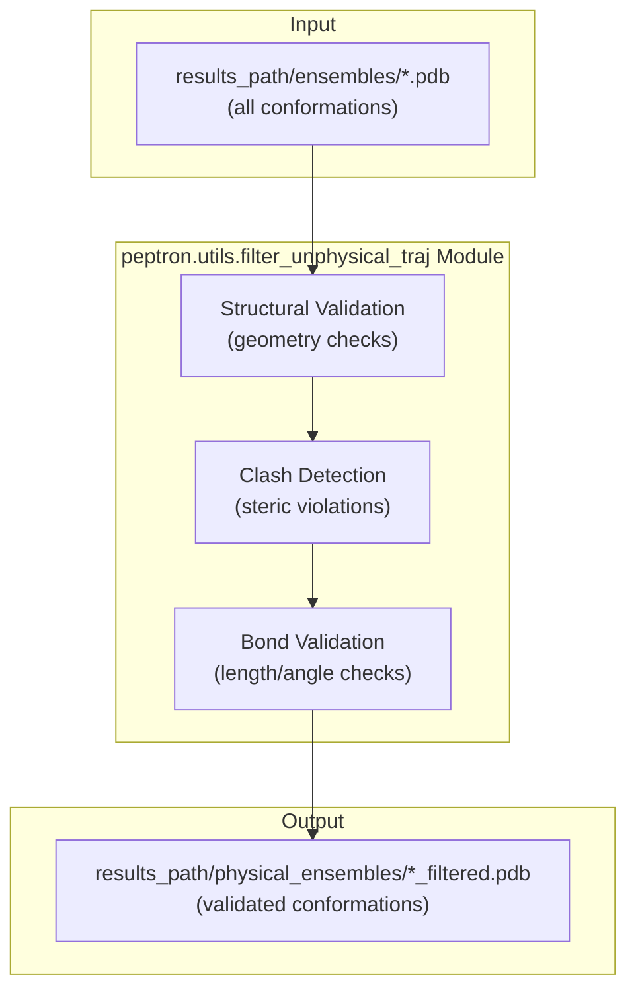
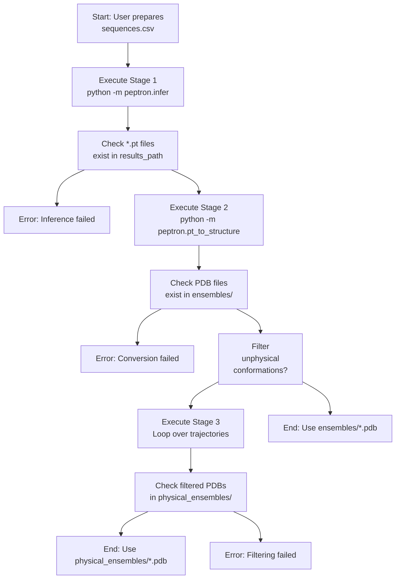

# Inference Pipeline Stages

> **Relevant source files**
> * [run_peptron_infer.sh](https://github.com/PeptoneLtd/PepTron/blob/8123ab15/run_peptron_infer.sh)

## Purpose and Scope

This page documents the three-stage inference pipeline that transforms protein sequences into validated ensemble structures. The pipeline consists of: (1) model inference to generate conformational ensembles, (2) structure conversion to standard PDB format, and (3) optional physical filtering to remove unphysical conformations.

For configuration parameters that control these stages, see [Inference Configuration](/PeptoneLtd/PepTron/6.1-inference-configuration). For details about output file formats and ensemble interpretation, see [Output Format and Interpretation](/PeptoneLtd/PepTron/6.3-output-format-and-interpretation).

**Sources:** [run_peptron_infer.sh L1-L40](https://github.com/PeptoneLtd/PepTron/blob/8123ab15/run_peptron_infer.sh#L1-L40)

---

## Pipeline Overview

The inference pipeline is executed sequentially through three distinct Python modules, each producing outputs consumed by the next stage. The pipeline is designed for clarity and modularity, allowing users to stop after any stage depending on their requirements.



**Execution Pattern:** The pipeline is orchestrated by a shell script that invokes each Python module sequentially. Each stage reads from a defined input location and writes to a defined output location, enabling checkpoint-based recovery and intermediate inspection.

**Sources:** [run_peptron_infer.sh L16-L39](https://github.com/PeptoneLtd/PepTron/blob/8123ab15/run_peptron_infer.sh#L16-L39)

---

## Stage 1: Model Inference

### Module: peptron.infer

The first stage uses the trained PepTron diffusion model to generate conformational ensembles from input sequences. This is the computationally intensive stage that leverages GPU acceleration.



### Invocation

The module is invoked as a Python module with command-line configuration overrides:

```
python -m peptron.infer \    --config.inference.checkpoint_path $CKPT_PATH \    --config.inference.chains_path $CSV_FILE \    --config.inference.results_path $RESULTS_PATH \    --config.inference.samples 10 \    --config.inference.steps 10
```

**Sources:** [run_peptron_infer.sh L16-L25](https://github.com/PeptoneLtd/PepTron/blob/8123ab15/run_peptron_infer.sh#L16-L25)

### Key Parameters

| Parameter | Purpose | Typical Values |
| --- | --- | --- |
| `checkpoint_path` | Path to trained PepTron model | PepTron or PepTron-base checkpoint |
| `chains_path` | CSV file with columns: `name`, `seqres` | User-provided sequences |
| `results_path` | Output directory for `.pt` tensor files | User-defined directory |
| `samples` | Number of conformations per sequence | 10-100 |
| `steps` | Diffusion reverse steps | 10-50 |
| `num_gpus` | GPU allocation | 1-N (based on availability) |
| `max_batch_size` | Batch processing size | Must be multiple of `num_gpus` |

**GPU Allocation Note:** The number of active GPUs is `min(N, num_gpus_available)` where `N` is the number of sequences in the CSV file. The `max_batch_size` must be `k * num_gpus` where `k` is a positive integer satisfying `k <= N`.

**Sources:** [run_peptron_infer.sh L9-L25](https://github.com/PeptoneLtd/PepTron/blob/8123ab15/run_peptron_infer.sh#L9-L25)

### Output Format

Stage 1 produces one `.pt` file per input sequence in the `results_path` directory. Each file contains PyTorch tensors representing the 3D coordinates, atom types, and metadata for the generated ensemble. These binary tensors are efficient for storage but require conversion for visualization and analysis.

**Sources:** [run_peptron_infer.sh L16-L25](https://github.com/PeptoneLtd/PepTron/blob/8123ab15/run_peptron_infer.sh#L16-L25)

---

## Stage 2: Structure Conversion

### Module: peptron.pt_to_structure

The second stage converts raw PyTorch tensors into standard PDB format, enabling visualization, analysis, and downstream processing with standard structural biology tools.



### Invocation

The module uses parallel processing to accelerate conversion:

```
python -m peptron.pt_to_structure \    -i "$RESULTS_PATH" \    -o "$RESULTS_PATH/ensembles" \    -p $(($(nproc) / 2))
```

**Sources:** [run_peptron_infer.sh L27-L29](https://github.com/PeptoneLtd/PepTron/blob/8123ab15/run_peptron_infer.sh#L27-L29)

### Processing Parameters

| Parameter | Purpose | Default Behavior |
| --- | --- | --- |
| `-i` | Input directory containing `.pt` files | Results from Stage 1 |
| `-o` | Output directory for PDB ensembles | `results_path/ensembles/` |
| `-p` | Number of parallel processes | Half of available CPU cores |

**Parallelization Strategy:** The script uses `$(nproc) / 2` to allocate half the available CPU cores for parallel tensor-to-PDB conversion. This balances throughput with system responsiveness, as structure conversion is CPU-bound rather than GPU-bound.

**Sources:** [run_peptron_infer.sh L27-L29](https://github.com/PeptoneLtd/PepTron/blob/8123ab15/run_peptron_infer.sh#L27-L29)

### Output Format

Each input `.pt` file produces a corresponding `.pdb` file in the `ensembles/` subdirectory. The PDB files use the multi-MODEL format, where each `MODEL`/`ENDMDL` block represents one conformation from the ensemble. All conformations for a single sequence are stored in a single PDB trajectory file.

**Sources:** [run_peptron_infer.sh L27-L29](https://github.com/PeptoneLtd/PepTron/blob/8123ab15/run_peptron_infer.sh#L27-L29)

---

## Stage 3: Physical Filtering

### Module: peptron.utils.filter_unphysical_traj

The third stage is optional and performs physics-based validation to remove conformations with structural artifacts or violations of fundamental physical constraints.



### Invocation

The filtering stage iterates over all PDB files in the `ensembles/` directory:

```
mkdir -p "$RESULTS_PATH/physical_ensembles"for trajectory_file in "$RESULTS_PATH/ensembles/"*.pdb; do    base_name=$(basename "$trajectory_file" .pdb)    output_file="$RESULTS_PATH/physical_ensembles/${base_name}_filtered.pdb"    python -m peptron.utils.filter_unphysical_traj \        --trajectory "$trajectory_file" \        --outfile "$output_file"done
```

**Sources:** [run_peptron_infer.sh L32-L39](https://github.com/PeptoneLtd/PepTron/blob/8123ab15/run_peptron_infer.sh#L32-L39)

### Validation Criteria

The filtering module applies structural biology validation rules to identify and remove unphysical conformations. Typical criteria include:

* **Steric Clashes:** Detection of atoms positioned too close together (violating van der Waals radii)
* **Bond Geometry:** Validation of covalent bond lengths and angles
* **Chirality:** Verification of proper stereochemistry at chiral centers
* **Backbone Geometry:** Checking phi/psi angles and peptide bond planarity

**When to Skip:** Users can comment out the filtering loop (lines 32-39) if they want to retain all generated conformations for further analysis, or if they plan to apply custom filtering criteria.

**Sources:** [run_peptron_infer.sh L31-L39](https://github.com/PeptoneLtd/PepTron/blob/8123ab15/run_peptron_infer.sh#L31-L39)

### Output Organization

The filtered ensembles are written to a separate `physical_ensembles/` subdirectory with `_filtered.pdb` suffix. This organizational structure preserves the original unfiltered ensembles while clearly distinguishing validated structures.

**Directory Structure:**

```markdown
results_path/
├── *.pt                              # Stage 1 output
├── ensembles/
│   ├── protein1.pdb                  # Stage 2 output
│   └── protein2.pdb
└── physical_ensembles/
    ├── protein1_filtered.pdb         # Stage 3 output
    └── protein2_filtered.pdb
```

**Sources:** [run_peptron_infer.sh L32-L39](https://github.com/PeptoneLtd/PepTron/blob/8123ab15/run_peptron_infer.sh#L32-L39)

---

## Pipeline Execution Flow

The complete inference workflow integrates all three stages with appropriate data handoffs:



**Sources:** [run_peptron_infer.sh L1-L40](https://github.com/PeptoneLtd/PepTron/blob/8123ab15/run_peptron_infer.sh#L1-L40)

---

## Module Mapping to Code Entities

The following table maps the high-level pipeline stages to their implementation in the codebase:

| Stage | Module | Primary Entry Point | Key Functions/Classes |
| --- | --- | --- | --- |
| 1. Model Inference | `peptron.infer` | `python -m peptron.infer` | Diffusion sampling, GPU batching |
| 2. Structure Conversion | `peptron.pt_to_structure` | `python -m peptron.pt_to_structure` | Tensor-to-PDB conversion, parallel processing |
| 3. Physical Filtering | `peptron.utils.filter_unphysical_traj` | `python -m peptron.utils.filter_unphysical_traj` | Geometry validation, clash detection |

**Orchestration:** The pipeline is orchestrated by [run_peptron_infer.sh L1-L40](https://github.com/PeptoneLtd/PepTron/blob/8123ab15/run_peptron_infer.sh#L1-L40)

 which provides a reference implementation showing proper sequencing, directory management, and error handling patterns.

**Sources:** [run_peptron_infer.sh L16-L39](https://github.com/PeptoneLtd/PepTron/blob/8123ab15/run_peptron_infer.sh#L16-L39)

---

## Best Practices

### Stage Isolation

Each stage can be run independently if intermediate outputs are available. This enables:

* **Incremental Processing:** Rerun only failed stages without repeating expensive computations
* **Parameter Tuning:** Adjust filtering criteria without regenerating ensembles
* **Format Conversion:** Convert the same tensors to multiple output formats

### Resource Management

| Stage | Resource Bottleneck | Optimization Strategy |
| --- | --- | --- |
| Stage 1 | GPU memory and compute | Tune `max_batch_size`, `num_gpus`, reduce `samples` |
| Stage 2 | CPU cores | Adjust `-p` parameter for parallel workers |
| Stage 3 | Sequential I/O | Process multiple sequences in parallel (modify loop) |

### Error Recovery

The shell script structure enables checkpoint-based recovery. If Stage 2 fails, fix the issue and rerun from Stage 2 without repeating Stage 1 inference.

**Sources:** [run_peptron_infer.sh L1-L40](https://github.com/PeptoneLtd/PepTron/blob/8123ab15/run_peptron_infer.sh#L1-L40)

---

## Summary

The PepTron inference pipeline implements a clean separation of concerns:

1. **Stage 1** (`peptron.infer`): Generates raw conformational ensembles using the diffusion model
2. **Stage 2** (`peptron.pt_to_structure`): Converts tensors to standard PDB format
3. **Stage 3** (`peptron.utils.filter_unphysical_traj`): Validates and filters physical conformations

This modular design enables users to customize the pipeline for their specific use cases, from generating large-scale ensembles to producing publication-ready validated structures.

**Sources:** [run_peptron_infer.sh L1-L40](https://github.com/PeptoneLtd/PepTron/blob/8123ab15/run_peptron_infer.sh#L1-L40)