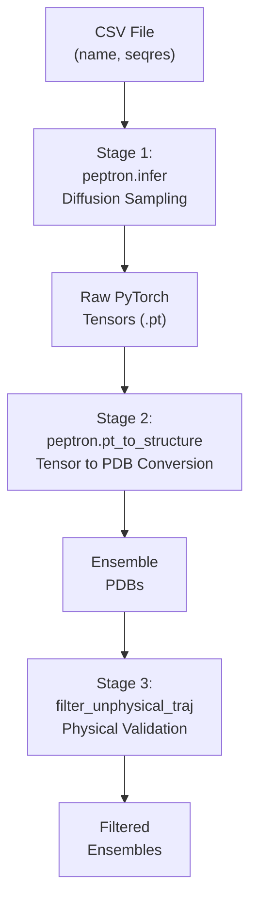
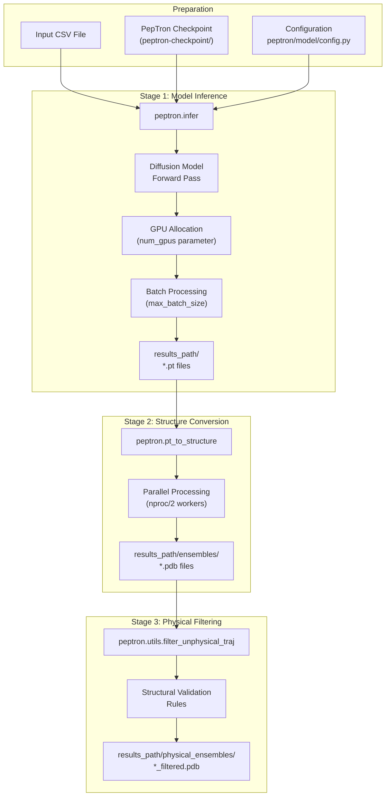
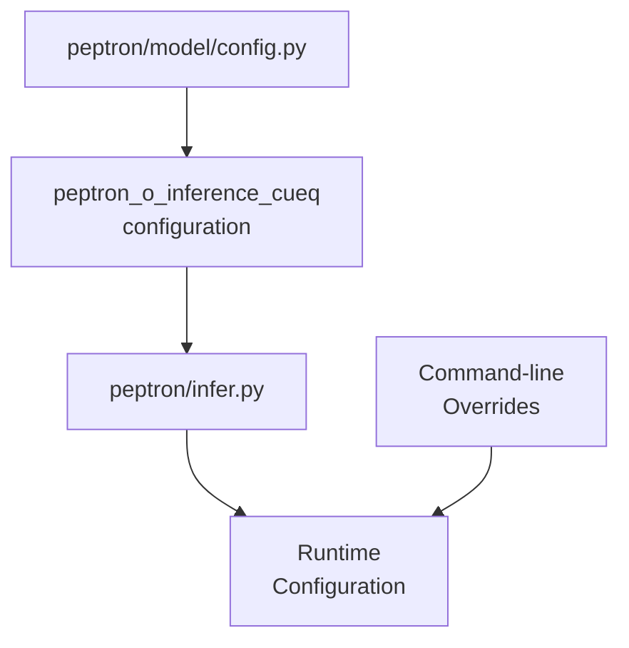
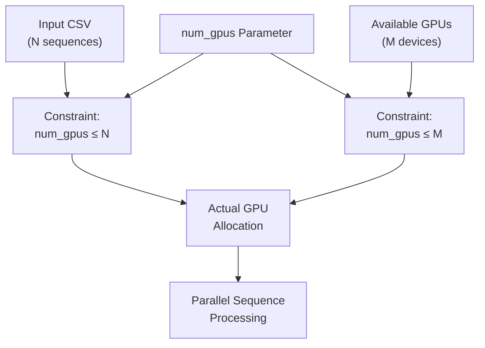

# Inference

> **Relevant source files**
> * [README.md](https://github.com/PeptoneLtd/PepTron/blob/8123ab15/README.md?plain=1)
> * [run_peptron_infer.sh](https://github.com/PeptoneLtd/PepTron/blob/8123ab15/run_peptron_infer.sh)

## Purpose and Scope

This page provides a comprehensive guide to generating protein structure ensembles from amino acid sequences using PepTron's inference system. The inference pipeline takes a CSV file containing protein sequences and produces multiple conformational samples representing the structural ensemble of each protein.

For detailed parameter configuration, see [Inference Configuration](/PeptoneLtd/PepTron/6.1-inference-configuration). For in-depth explanation of pipeline stages, see [Inference Pipeline Stages](/PeptoneLtd/PepTron/6.2-inference-pipeline-stages). For output format details, see [Output Format and Interpretation](/PeptoneLtd/PepTron/6.3-output-format-and-interpretation). For information about model checkpoints, see [Model Checkpoints](/PeptoneLtd/PepTron/3.2-model-checkpoints).

---

## Overview

The PepTron inference system is a three-stage pipeline that transforms sequence data into validated structural ensembles:



**Architecture**: The inference pipeline is orchestrated by the `run_peptron_infer.sh` script, which executes three independent Python modules sequentially. Each stage is decoupled, allowing intermediate results to be inspected or the pipeline to be terminated early if filtering is not required.

**Sources:** [README.md L37-L73](https://github.com/PeptoneLtd/PepTron/blob/8123ab15/README.md?plain=1#L37-L73)

 [run_peptron_infer.sh L1-L40](https://github.com/PeptoneLtd/PepTron/blob/8123ab15/run_peptron_infer.sh#L1-L40)

---

## Input Requirements

### Sequence CSV Format

The inference pipeline requires a CSV file with exactly two columns:

| Column | Description | Requirements |
| --- | --- | --- |
| `name` | Unique protein identifier | Alphanumeric string, used for output file naming |
| `seqres` | Amino acid sequence | Single-letter amino acid codes, no gaps or special characters |

**Example:**

```
name,seqresprotein1,MKTAYIAKQRQISFVKSHFSRQLEERLGLIEVQAprotein2,MSHHWGYGKHNGPEHWHKDFPIAKGERQSPVDID
```

**Sources:** [README.md L50-L55](https://github.com/PeptoneLtd/PepTron/blob/8123ab15/README.md?plain=1#L50-L55)

### Checkpoint Requirement

A pre-trained PepTron checkpoint is required for inference. Two checkpoint variants are available:

* **PepTron**: Recommended for general use across the full proteome (structured and disordered proteins)
* **PepTron-base**: Pre-trained on structured proteins only (PDB dataset)

Checkpoints are downloaded from Zenodo and provided as directories containing the model weights and configuration. The checkpoint path must point to the unzipped `peptron-checkpoint` directory.

**Sources:** [README.md L28-L33](https://github.com/PeptoneLtd/PepTron/blob/8123ab15/README.md?plain=1#L28-L33)

 [README.md L57-L61](https://github.com/PeptoneLtd/PepTron/blob/8123ab15/README.md?plain=1#L57-L61)

---

## Pipeline Execution Flow



**Sources:** [run_peptron_infer.sh L16-L39](https://github.com/PeptoneLtd/PepTron/blob/8123ab15/run_peptron_infer.sh#L16-L39)

---

## Execution Workflow

### Environment Configuration

The inference script sets critical environment variables for GPU execution and error handling:

```javascript
export NCCL_TIMEOUT=3600export TORCH_NCCL_ENABLE_MONITORING=0export TORCHDYNAMO_SUPPRESS_ERRORS=1export CUDA_LAUNCH_BLOCKING=1export PYTHONPATH=.
```

**Variable Purposes:**

* `NCCL_TIMEOUT`: Extended timeout for long-running GPU operations
* `TORCH_NCCL_ENABLE_MONITORING`: Disables NCCL monitoring to avoid overhead
* `TORCHDYNAMO_SUPPRESS_ERRORS`: Suppresses TorchDynamo compilation warnings
* `CUDA_LAUNCH_BLOCKING`: Enables synchronous CUDA kernel launches for debugging
* `PYTHONPATH`: Ensures module imports resolve correctly

**Sources:** [run_peptron_infer.sh L3-L7](https://github.com/PeptoneLtd/PepTron/blob/8123ab15/run_peptron_infer.sh#L3-L7)

### Stage 1: Model Inference

The `peptron.infer` module performs diffusion-based ensemble generation:

```
python -m peptron.infer \    --config.inference.num_nodes 1 \    --config.inference.checkpoint_path $CKPT_PATH \    --config.inference.chains_path $CSV_FILE \    --config.inference.results_path $RESULTS_PATH \    --config.inference.num_gpus 1 \    --config.inference.max_batch_size 1 \    --config.inference.num_workers 8 \    --config.inference.samples 10 \    --config.inference.steps 10
```

**Key Parameters:**

* `checkpoint_path`: Path to the PepTron checkpoint directory
* `chains_path`: Path to the input CSV file
* `results_path`: Output directory for all pipeline stages
* `num_gpus`: Number of GPUs to use (must be ≤ number of sequences)
* `max_batch_size`: Parallel structure generation per ensemble
* `samples`: Total number of conformations per protein
* `steps`: Number of diffusion denoising steps

**Output:** PyTorch tensor files (`.pt`) containing raw model predictions in `$RESULTS_PATH/`.

**Sources:** [run_peptron_infer.sh L16-L25](https://github.com/PeptoneLtd/PepTron/blob/8123ab15/run_peptron_infer.sh#L16-L25)

 [README.md L178-L190](https://github.com/PeptoneLtd/PepTron/blob/8123ab15/README.md?plain=1#L178-L190)

### Stage 2: Structure Conversion

The `peptron.pt_to_structure` module converts PyTorch tensors to standard PDB format:

```
python -m peptron.pt_to_structure -i "$RESULTS_PATH" \    -o "$RESULTS_PATH/ensembles" \    -p $(($(nproc) / 2))
```

**Parameters:**

* `-i`: Input directory containing `.pt` files
* `-o`: Output directory for PDB files
* `-p`: Number of parallel processes (defaults to half the available CPU cores)

**Output:** Multi-model PDB files in `$RESULTS_PATH/ensembles/`, where each file contains all conformations for a single protein.

**Sources:** [run_peptron_infer.sh L27-L29](https://github.com/PeptoneLtd/PepTron/blob/8123ab15/run_peptron_infer.sh#L27-L29)

### Stage 3: Physical Filtering (Optional)

The `peptron.utils.filter_unphysical_traj` module validates and filters structural ensembles:

```
mkdir -p "$RESULTS_PATH/physical_ensembles"for trajectory_file in "$RESULTS_PATH/ensembles/"*.pdb; do    [ -e "$trajectory_file" ] || continue    base_name=$(basename "$trajectory_file" .pdb)    output_file="$RESULTS_PATH/physical_ensembles/${base_name}_filtered.pdb"    python -m peptron.utils.filter_unphysical_traj \        --trajectory "$trajectory_file" \        --outfile "$output_file"done
```

**Function:** Removes conformations that violate physical constraints (e.g., clashes, impossible bond geometries).

**Output:** Filtered PDB ensembles in `$RESULTS_PATH/physical_ensembles/` with `_filtered.pdb` suffix.

**Note:** This stage can be skipped if unfiltered ensembles are acceptable for downstream analysis.

**Sources:** [run_peptron_infer.sh L32-L39](https://github.com/PeptoneLtd/PepTron/blob/8123ab15/run_peptron_infer.sh#L32-L39)

---

## Configuration System



The inference system uses a two-tier configuration approach:

1. **Base Configuration**: Defined in `peptron/model/config.py` with the `peptron_o_inference_cueq` preset
2. **CLI Overrides**: Command-line flags override base configuration values

**Configuration Selection in Code:**

```markdown
# In peptron/infer.py (referenced, not shown)EXEC_CONFIG = config_flags.DEFINE_config_file(    'config',     'peptron/model/config.py:peptron_o_inference_cueq')
```

See [Inference Configuration](/PeptoneLtd/PepTron/6.1-inference-configuration) for detailed parameter documentation.

**Sources:** [README.md L41-L46](https://github.com/PeptoneLtd/PepTron/blob/8123ab15/README.md?plain=1#L41-L46)

---

## GPU and Memory Considerations

### GPU Allocation Strategy



**Critical Constraint:** The `num_gpus` parameter must be less than or equal to the number of sequences in the input CSV. Each GPU processes one sequence at a time.

**Sources:** [README.md L186](https://github.com/PeptoneLtd/PepTron/blob/8123ab15/README.md?plain=1#L186-L186)

 [run_peptron_infer.sh L9-L10](https://github.com/PeptoneLtd/PepTron/blob/8123ab15/run_peptron_infer.sh#L9-L10)

### Batch Size and Memory Trade-offs

| Scenario | Sequence Length | Recommended `max_batch_size` | Rationale |
| --- | --- | --- | --- |
| Short sequences (<100 AA) | < 100 | 4-8 | Parallel generation maximizes throughput |
| Medium sequences (100-300 AA) | 100-300 | 2-4 | Balance memory and speed |
| Long sequences (>300 AA) | > 300 | 1 | Avoids OOM errors |
| Very long sequences (>500 AA) | > 500 | 1 | Critical to prevent memory overflow |

**Memory Formula:**

```
GPU Memory Required ≈ sequence_length × max_batch_size × model_size_constant
```

**Default Safety Setting:** The default `max_batch_size=1` is conservative to prevent out-of-memory errors but can be increased based on available GPU memory.

**Optimization Strategy:** For generating large ensembles (e.g., `samples=100`), increasing `max_batch_size` proportionally reduces wall-clock time.

**Sources:** [README.md L188-L190](https://github.com/PeptoneLtd/PepTron/blob/8123ab15/README.md?plain=1#L188-L190)

---

## Output Directory Structure

After a complete inference run, the results directory contains:

```markdown
$RESULTS_PATH/
├── *.pt                              # Raw PyTorch tensors (Stage 1 output)
├── ensembles/
│   ├── protein1.pdb                  # Multi-model PDB ensemble
│   ├── protein2.pdb
│   └── ...
└── physical_ensembles/
    ├── protein1_filtered.pdb         # Physically validated ensemble
    ├── protein2_filtered.pdb
    └── ...
```

**File Naming Convention:**

* Base name matches the `name` column from the input CSV
* `_filtered.pdb` suffix indicates physical filtering has been applied

See [Output Format and Interpretation](/PeptoneLtd/PepTron/6.3-output-format-and-interpretation) for detailed PDB file structure and analysis guidelines.

**Sources:** [run_peptron_infer.sh L27-L39](https://github.com/PeptoneLtd/PepTron/blob/8123ab15/run_peptron_infer.sh#L27-L39)

---

## Complete Execution Example

```javascript
#!/bin/bash # Set environmentexport NCCL_TIMEOUT=3600export TORCH_NCCL_ENABLE_MONITORING=0export TORCHDYNAMO_SUPPRESS_ERRORS=1export CUDA_LAUNCH_BLOCKING=1export PYTHONPATH=. # Define pathsCKPT_PATH="/data/checkpoints/peptron-checkpoint"RESULTS_PATH="/data/results/protein_ensemble_run"CSV_FILE="/data/inputs/target_proteins.csv" # Stage 1: Model inferencepython -m peptron.infer \    --config.inference.num_nodes 1 \    --config.inference.checkpoint_path $CKPT_PATH \    --config.inference.chains_path $CSV_FILE \    --config.inference.results_path $RESULTS_PATH \    --config.inference.num_gpus 4 \    --config.inference.max_batch_size 2 \    --config.inference.num_workers 8 \    --config.inference.samples 50 \    --config.inference.steps 10 # Stage 2: Convert to PDBpython -m peptron.pt_to_structure \    -i "$RESULTS_PATH" \    -o "$RESULTS_PATH/ensembles" \    -p 16 # Stage 3: Filter unphysical structuresmkdir -p "$RESULTS_PATH/physical_ensembles"for trajectory_file in "$RESULTS_PATH/ensembles/"*.pdb; do    [ -e "$trajectory_file" ] || continue    base_name=$(basename "$trajectory_file" .pdb)    output_file="$RESULTS_PATH/physical_ensembles/${base_name}_filtered.pdb"    python -m peptron.utils.filter_unphysical_traj \        --trajectory "$trajectory_file" \        --outfile "$output_file"done
```

**Execution Parameters:**

* 4 GPUs for parallel sequence processing
* `max_batch_size=2` for moderate-length sequences
* 50 ensemble members per protein
* 10 diffusion steps (default quality)
* 16 CPU cores for parallel PDB conversion

**Sources:** [run_peptron_infer.sh L1-L40](https://github.com/PeptoneLtd/PepTron/blob/8123ab15/run_peptron_infer.sh#L1-L40)

---

## Troubleshooting

Common issues and resolutions:

| Issue | Cause | Solution |
| --- | --- | --- |
| `CUDA Out of Memory` | `max_batch_size` too large | Reduce to 1, then gradually increase |
| `num_gpus` validation error | More GPUs than sequences | Set `num_gpus ≤ len(CSV)` |
| Missing checkpoint files | Incomplete download | Re-download and verify `peptron-checkpoint/` structure |
| Import errors | Incorrect `PYTHONPATH` | Ensure `export PYTHONPATH=.` from repo root |
| Slow conversion stage | Insufficient parallelism | Increase `-p` parameter in `pt_to_structure` |

For additional troubleshooting, see [Troubleshooting](/PeptoneLtd/PepTron/8-troubleshooting).

**Sources:** [README.md L211-L219](https://github.com/PeptoneLtd/PepTron/blob/8123ab15/README.md?plain=1#L211-L219)