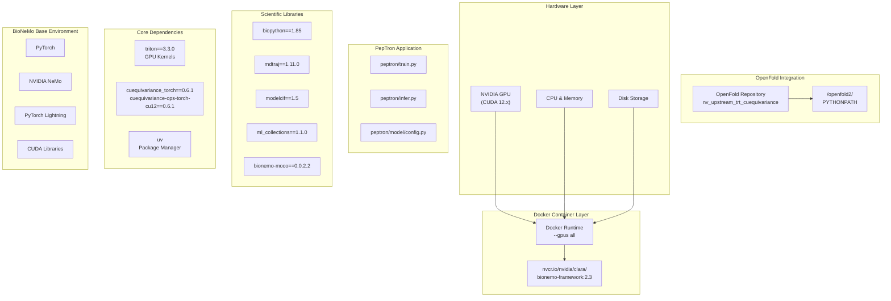
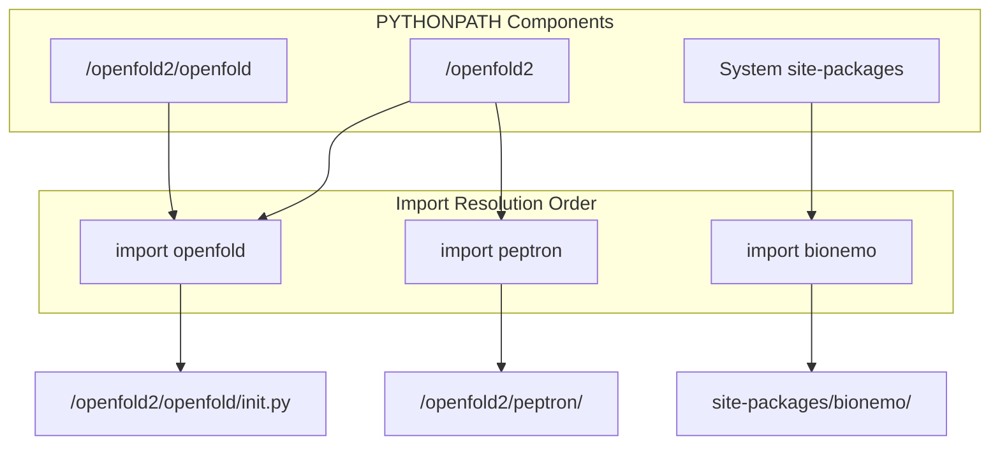

# Installation and Environment Setup

> **Relevant source files**
> * [.gitignore](https://github.com/PeptoneLtd/PepTron/blob/8123ab15/.gitignore)
> * [Dockerfile](https://github.com/PeptoneLtd/PepTron/blob/8123ab15/Dockerfile)
> * [README.md](https://github.com/PeptoneLtd/PepTron/blob/8123ab15/README.md?plain=1)

This page provides detailed instructions for setting up the PepTron development and execution environment. The installation process is containerized using Docker to ensure reproducibility and proper configuration of all dependencies. For information about running inference after installation, see [Quick Start: Running Inference](/PeptoneLtd/PepTron/2.2-quick-start:-running-inference). For training configuration, see [Training Configuration](/PeptoneLtd/PepTron/5.1-training-configuration).

## Purpose and Scope

This document covers:

* Hardware and software prerequisites
* Docker container build process
* Base environment components (NVIDIA BioNeMo Framework)
* Critical dependencies and version requirements
* Container execution and GPU access
* Installation verification procedures

This page does **not** cover data preparation (see [Data Preparation Pipeline](/PeptoneLtd/PepTron/4-data-preparation-pipeline)), model checkpoints (see [Model Checkpoints](/PeptoneLtd/PepTron/3.2-model-checkpoints)), or execution of training or inference workflows.

## Prerequisites

### Hardware Requirements

| Component | Requirement | Notes |
| --- | --- | --- |
| **GPU** | NVIDIA GPU with CUDA capability | Required for training and inference |
| **GPU Memory** | ≥16 GB recommended | Minimum depends on sequence length and batch size |
| **CUDA Version** | CUDA 12.x compatible | Provided by base container |
| **Disk Space** | ≥50 GB | For container, dependencies, and workspace |

### Software Requirements

| Component | Version | Purpose |
| --- | --- | --- |
| **Docker** | ≥20.10 | Container runtime |
| **NVIDIA Container Toolkit** | Latest | GPU access in containers |
| **Git** | Any recent version | Repository cloning |
| **Git LFS** | Latest | Large file support |

**Sources:** [README.md L14-L26](https://github.com/PeptoneLtd/PepTron/blob/8123ab15/README.md?plain=1#L14-L26)

 [Dockerfile L1-L45](https://github.com/PeptoneLtd/PepTron/blob/8123ab15/Dockerfile#L1-L45)

## Environment Architecture



**Diagram: Environment Layer Architecture** - Shows the hierarchical structure from hardware through Docker to the application layer, illustrating dependencies between components.

**Sources:** [Dockerfile L1-L45](https://github.com/PeptoneLtd/PepTron/blob/8123ab15/Dockerfile#L1-L45)

 [README.md L14-L26](https://github.com/PeptoneLtd/PepTron/blob/8123ab15/README.md?plain=1#L14-L26)

## Docker Container Build Process

### Overview

PepTron uses a multi-stage Docker build process that extends the NVIDIA BioNeMo Framework 2.3 base image with specialized dependencies for protein structure prediction.

```mermaid
flowchart TD

Start["Start Build Process"]
BaseImage["Pull Base Image<br>bionemo-framework:2.3"]
SysPackages["Install System Packages<br>build-essential, ninja-build<br>git, git-lfs, wget, openssh-client"]
CloneOF["Clone OpenFold<br>git clone -b nv_upstream_trt_cuequivariance<br>github.com/borisfom/openfold.git"]
SetPythonPath["Set Environment<br>PYTHONPATH=/openfold2"]
InstallUV["Install uv<br>pip install uv"]
UninstallTriton["Uninstall Existing Triton<br>pip uninstall -y triton pynvml"]
InstallTriton["Install Triton 3.3.0<br>pip install triton==3.3.0<br>pip install nvidia-ml-py"]
InstallCuEq["Install cuEquivariance<br>cuequivariance_torch==0.6.1<br>cuequivariance-ops-torch-cu12==0.6.1"]
InstallOF["Install OpenFold Dependencies<br>uv pip install -e ."]
InstallSci["Install Scientific Libraries<br>biopython, mdtraj, modelcif<br>ml_collections, bionemo-moco"]
CreateInit["Create init.py<br>touch /openfold2/openfold/init.py"]
DownloadStereo["Download stereo_chemical_props.txt<br>from OpenStructure repository"]
Verify["Verify Installation<br>python -c 'import openfold'"]
Complete["Build Complete<br>CMD /bin/bash"]

Start --> BaseImage
BaseImage --> SysPackages
SysPackages --> CloneOF
CloneOF --> SetPythonPath
SetPythonPath --> InstallUV
InstallUV --> UninstallTriton
UninstallTriton --> InstallTriton
InstallTriton --> InstallCuEq
InstallCuEq --> InstallOF
InstallOF --> InstallSci
InstallSci --> CreateInit
CreateInit --> DownloadStereo
DownloadStereo --> Verify
Verify --> Complete
```



**Diagram: Docker Build Process Flow** - Sequential steps executed during `docker build`, showing critical dependencies and their installation order.

**Sources:** [Dockerfile L1-L45](https://github.com/PeptoneLtd/PepTron/blob/8123ab15/Dockerfile#L1-L45)

### Step-by-Step Build Instructions

#### 1. Clone the Repository

```
git clone https://github.com/PeptoneLtd/peptron.gitcd peptron
```

The repository contains the `Dockerfile` and all application code required for building the container.

**Sources:** [README.md L17-L19](https://github.com/PeptoneLtd/PepTron/blob/8123ab15/README.md?plain=1#L17-L19)

#### 2. Build the Docker Container

```
docker build -t peptron:latest .
```

This command:

* Uses the `Dockerfile` in the current directory
* Tags the resulting image as `peptron:latest`
* Executes all build stages sequentially (see diagram above)

**Build Time:** The initial build typically takes 15-30 minutes depending on network speed and system performance. Subsequent builds use Docker's layer caching for faster execution.

**Sources:** [README.md L22](https://github.com/PeptoneLtd/PepTron/blob/8123ab15/README.md?plain=1#L22-L22)

#### 3. Run the Container

```
docker run --gpus all -it --rm peptron:latest
```

**Command Breakdown:**

| Flag | Purpose |
| --- | --- |
| `--gpus all` | Exposes all NVIDIA GPUs to the container |
| `-it` | Interactive terminal with TTY allocation |
| `--rm` | Automatically removes container on exit |
| `peptron:latest` | Image name and tag to run |

The container starts with a bash shell at `/openfold2` working directory.

**Sources:** [README.md L25](https://github.com/PeptoneLtd/PepTron/blob/8123ab15/README.md?plain=1#L25-L25)

#### 4. Run with Volume Mounts (Recommended for Production)

```
docker run --gpus all -it --rm \  -v /path/to/data:/data \  -v /path/to/checkpoints:/checkpoints \  -v /path/to/results:/results \  peptron:latest
```

Volume mounts allow:

* Access to local datasets without copying into container
* Persistent storage of checkpoints and results
* Easier data management and workflow integration

**Sources:** [README.md L24-L26](https://github.com/PeptoneLtd/PepTron/blob/8123ab15/README.md?plain=1#L24-L26)

## Critical Dependencies

### Base Framework: NVIDIA BioNeMo 2.3

The foundation of the PepTron environment is the BioNeMo Framework, which provides:

| Component | Description |
| --- | --- |
| **PyTorch** | Deep learning framework with GPU acceleration |
| **NVIDIA NeMo** | Framework for conversational AI, adapted for protein models |
| **PyTorch Lightning** | High-level training orchestration |
| **CUDA Toolkit** | GPU computing platform and APIs |
| **cuDNN** | GPU-accelerated deep neural network library |

**Base Image:** `nvcr.io/nvidia/clara/bionemo-framework:2.3`

**Sources:** [Dockerfile L2](https://github.com/PeptoneLtd/PepTron/blob/8123ab15/Dockerfile#L2-L2)

### OpenFold Integration

PepTron integrates a specialized fork of OpenFold with TensorRT and cuequivariance support.

| Attribute | Value |
| --- | --- |
| **Repository** | `github.com/borisfom/openfold.git` |
| **Branch** | `nv_upstream_trt_cuequivariance` |
| **Installation Path** | `/openfold2` |
| **PYTHONPATH** | `/openfold2` |

The OpenFold integration provides protein structure modeling primitives and is installed in editable mode (`-e .`) for development flexibility.

**Sources:** [Dockerfile L16-L20](https://github.com/PeptoneLtd/PepTron/blob/8123ab15/Dockerfile#L16-L20)

 [Dockerfile L35](https://github.com/PeptoneLtd/PepTron/blob/8123ab15/Dockerfile#L35-L35)

### GPU Acceleration Libraries

#### Triton

**Version:** `3.3.0`

Triton is a language and compiler for writing highly efficient custom deep-learning primitives. Version 3.3.0 is explicitly required due to compatibility constraints with cuequivariance.

**Installation:** [Dockerfile L25-L27](https://github.com/PeptoneLtd/PepTron/blob/8123ab15/Dockerfile#L25-L27)

**Note:** Pre-existing Triton installations are explicitly removed before installing the required version to prevent version conflicts.

**Sources:** [Dockerfile L25-L27](https://github.com/PeptoneLtd/PepTron/blob/8123ab15/Dockerfile#L25-L27)

#### cuEquivariance

**Versions:**

* `cuequivariance_torch==0.6.1`
* `cuequivariance-ops-torch-cu12==0.6.1`

cuEquivariance provides GPU-accelerated equivariant neural network operations, essential for PepTron's SE(3)-equivariant architecture. The `ops` package contains CUDA 12-compiled operations.

**Dependency:** Requires `nvidia-ml-py` (replacement for deprecated `pynvml`) for GPU monitoring.

**Sources:** [Dockerfile L29-L31](https://github.com/PeptoneLtd/PepTron/blob/8123ab15/Dockerfile#L29-L31)

### Scientific Python Libraries

| Library | Version | Purpose |
| --- | --- | --- |
| **biopython** | 1.85 | Biological sequence and structure I/O |
| **mdtraj** | 1.11.0 | Molecular dynamics trajectory analysis |
| **modelcif** | 1.5 | mmCIF file format support |
| **ml_collections** | 1.1.0 | Configuration management utilities |
| **bionemo-moco** | 0.0.2.2 | BioNeMo model configuration objects |

**Installation Method:** Installed via `uv pip install` for faster dependency resolution.

**Sources:** [Dockerfile L36](https://github.com/PeptoneLtd/PepTron/blob/8123ab15/Dockerfile#L36-L36)

### System-Level Dependencies

System packages installed via `apt-get`:

| Package | Purpose |
| --- | --- |
| `build-essential` | C/C++ compilation tools (gcc, g++, make) |
| `ninja-build` | Fast build system for C++ projects |
| `git` | Version control system |
| `git-lfs` | Large file storage extension for Git |
| `wget` | File download utility |
| `openssh-client` | SSH client for remote operations |

**Sources:** [Dockerfile L6-L14](https://github.com/PeptoneLtd/PepTron/blob/8123ab15/Dockerfile#L6-L14)

## Python Path Configuration



**Diagram: Python Import Path Resolution** - Shows how PYTHONPATH is configured to prioritize OpenFold and PepTron modules.

Key Configuration:

* Environment variable `PYTHONPATH` is set to `/openfold2` in [Dockerfile L18](https://github.com/PeptoneLtd/PepTron/blob/8123ab15/Dockerfile#L18-L18)
* Working directory is set to `/openfold2` in [Dockerfile L20](https://github.com/PeptoneLtd/PepTron/blob/8123ab15/Dockerfile#L20-L20)
* Empty `__init__.py` created at `/openfold2/openfold/__init__.py` in [Dockerfile L37](https://github.com/PeptoneLtd/PepTron/blob/8123ab15/Dockerfile#L37-L37)

**Sources:** [Dockerfile L18](https://github.com/PeptoneLtd/PepTron/blob/8123ab15/Dockerfile#L18-L18)

 [Dockerfile L20](https://github.com/PeptoneLtd/PepTron/blob/8123ab15/Dockerfile#L20-L20)

 [Dockerfile L37](https://github.com/PeptoneLtd/PepTron/blob/8123ab15/Dockerfile#L37-L37)

## Resource Files

PepTron requires the `stereo_chemical_props.txt` file for structural validation:

**Source:** OpenStructure repository (Swiss Institute of Bioinformatics)
**Destination:** `/openfold2/openfold/resources/stereo_chemical_props.txt`
**Download URL:** `https://git.scicore.unibas.ch/schwede/openstructure/-/raw/7102c63615b64735c4941278d92b554ec94415f8/modules/mol/alg/src/stereo_chemical_props.txt`

This file is automatically downloaded during the Docker build process.

**Sources:** [Dockerfile L39-L40](https://github.com/PeptoneLtd/PepTron/blob/8123ab15/Dockerfile#L39-L40)

## Installation Verification

### Verify Python Environment

After entering the container, verify the installation:

```javascript
# Check Python path configurationpython -c "import sys; print(sys.path)" # Verify OpenFold importpython -c "import openfold; print(openfold.__file__)" # Verify PepTron modulespython -c "import peptron" # Verify cuequivariancepython -c "import cuequivariance_torch" # Check GPU availabilitypython -c "import torch; print(f'GPUs: {torch.cuda.device_count()}')"
```

**Expected Output:**

* Python path should include `/openfold2`
* OpenFold should resolve to `/openfold2/openfold/__init__.py`
* No import errors for peptron or cuequivariance_torch
* GPU count should match host system GPUs

**Sources:** [Dockerfile L42-L43](https://github.com/PeptoneLtd/PepTron/blob/8123ab15/Dockerfile#L42-L43)

### Verify GPU Access

```
nvidia-smi
```

This command should display GPU information, driver version, and CUDA version. If this fails, verify that:

1. NVIDIA drivers are installed on the host system
2. NVIDIA Container Toolkit is installed
3. `--gpus all` flag was used when starting the container

### Directory Structure Check

```
ls -la /openfold2/
```

**Expected Directories:**

* `openfold/` - OpenFold package
* `peptron/` - PepTron application code
* `dataprep/` - Data preparation scripts
* `splits/` - Dataset split definitions
* `scripts/` - Utility scripts

**Sources:** [Dockerfile L20](https://github.com/PeptoneLtd/PepTron/blob/8123ab15/Dockerfile#L20-L20)

 [README.md L17-L19](https://github.com/PeptoneLtd/PepTron/blob/8123ab15/README.md?plain=1#L17-L19)

## Troubleshooting

### Common Installation Issues

#### Issue: Docker Build Fails at Git Clone Step

**Symptoms:** Error message about Git LFS or repository access

**Solution:**

```markdown
# Ensure Git LFS is installed on the hostgit lfs install # If behind a proxy, configure Gitgit config --global http.proxy http://proxy.example.com:8080
```

**Sources:** [Dockerfile L16-L17](https://github.com/PeptoneLtd/PepTron/blob/8123ab15/Dockerfile#L16-L17)

#### Issue: cuEquivariance Import Errors

**Symptoms:** `ImportError: cannot import name 'cuequivariance_torch'` or TorchDynamo warnings

**Solution:** These errors typically resolve after a container restart. TorchDynamo warnings can be safely ignored as they don't affect functionality.

**Note:** The README explicitly mentions discarding TorchDynamo warnings at [README.md L216](https://github.com/PeptoneLtd/PepTron/blob/8123ab15/README.md?plain=1#L216-L216)

**Sources:** [README.md L216](https://github.com/PeptoneLtd/PepTron/blob/8123ab15/README.md?plain=1#L216-L216)

 [Dockerfile L29-L31](https://github.com/PeptoneLtd/PepTron/blob/8123ab15/Dockerfile#L29-L31)

#### Issue: CUDA Out of Memory During Build

**Symptoms:** Docker build process crashes with memory allocation errors

**Solution:**

```markdown
# Increase Docker memory allocation in Docker Desktop settings# Or add --memory flagdocker build --memory=16g -t peptron:latest .
```

#### Issue: Container Cannot Access GPU

**Symptoms:** `torch.cuda.device_count()` returns 0

**Solution:**

```css
# Verify NVIDIA Container Toolkit installationnvidia-ctk --version # Check Docker daemon configurationcat /etc/docker/daemon.json# Should contain:# {#   "runtimes": {#     "nvidia": {#       "path": "nvidia-container-runtime",#       "runtimeArgs": []#     }#   }# } # Restart Docker daemonsudo systemctl restart docker
```

**Sources:** [README.md L25](https://github.com/PeptoneLtd/PepTron/blob/8123ab15/README.md?plain=1#L25-L25)

#### Issue: Missing stereo_chemical_props.txt

**Symptoms:** Error about missing resource file during structure validation

**Solution:** The file should be automatically downloaded during build. If missing, manually download:

```
cd /openfold2/openfold/resources/wget https://git.scicore.unibas.ch/schwede/openstructure/-/raw/7102c63615b64735c4941278d92b554ec94415f8/modules/mol/alg/src/stereo_chemical_props.txt
```

**Sources:** [Dockerfile L39-L40](https://github.com/PeptoneLtd/PepTron/blob/8123ab15/Dockerfile#L39-L40)

### Build Optimization Tips

**Layer Caching:** Docker caches build layers. To maximize cache efficiency:

* Make code changes after dependency installation
* Avoid modifying early Dockerfile lines unless necessary

**Parallel Builds:** The `ninja-build` package enables parallel compilation of C++ extensions, significantly reducing build time.

**Space Management:** After successful build, clean up Docker build cache:

```
docker builder prune
```

**Sources:** [Dockerfile L9](https://github.com/PeptoneLtd/PepTron/blob/8123ab15/Dockerfile#L9-L9)

## Next Steps

After successful installation:

1. **Download Pre-trained Checkpoints:** See [Model Checkpoints](/PeptoneLtd/PepTron/3.2-model-checkpoints) for checkpoint information
2. **Run Quick Start Inference:** Follow [Quick Start: Running Inference](/PeptoneLtd/PepTron/2.2-quick-start:-running-inference) to generate your first protein structures
3. **Prepare Training Data:** If training from scratch, proceed to [Data Preparation Pipeline](/PeptoneLtd/PepTron/4-data-preparation-pipeline)
4. **Configure Inference/Training:** Review [Configuration System](/PeptoneLtd/PepTron/3.1-configuration-system) for parameter customization

**Sources:** [README.md L28-L34](https://github.com/PeptoneLtd/PepTron/blob/8123ab15/README.md?plain=1#L28-L34)

 [README.md L35-L73](https://github.com/PeptoneLtd/PepTron/blob/8123ab15/README.md?plain=1#L35-L73)