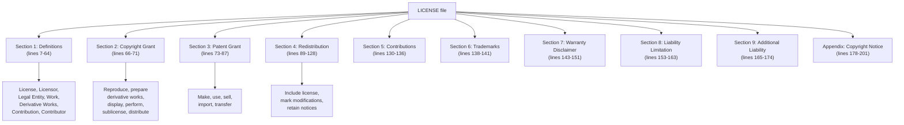
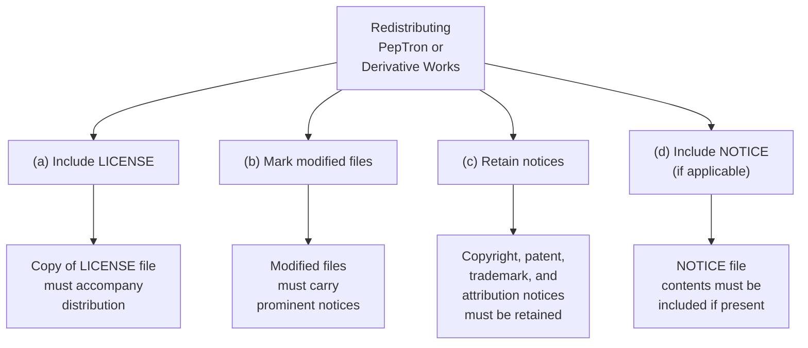
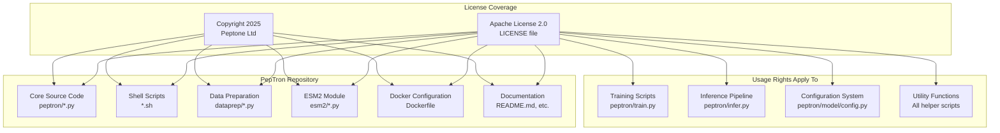
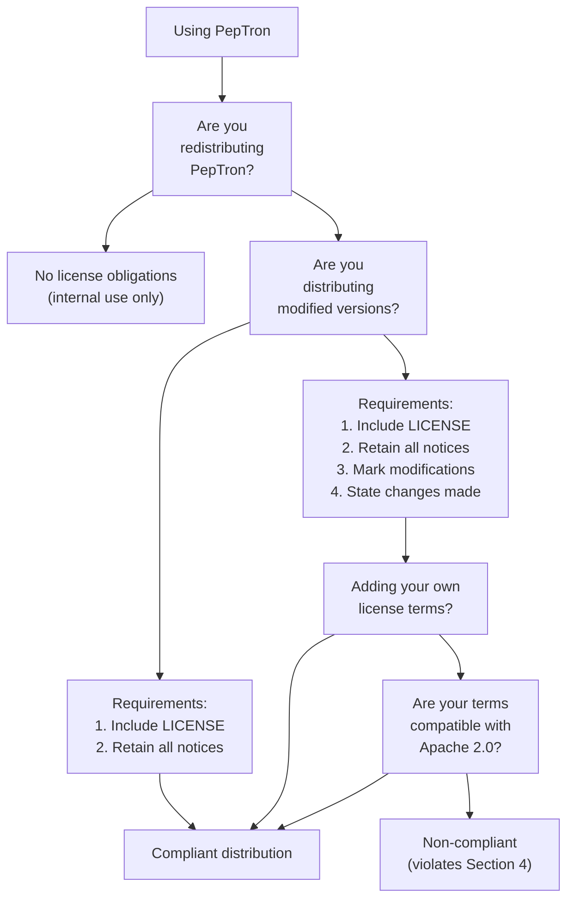

# License

> **Relevant source files**
> * [LICENSE](https://github.com/PeptoneLtd/PepTron/blob/8123ab15/LICENSE)

## Purpose and Scope

This page documents the licensing terms that govern the use, modification, and distribution of the PepTron codebase. PepTron is released under the Apache License 2.0, a permissive open-source license that allows broad usage while requiring attribution and license preservation. This page explains the key terms, rights, obligations, and practical implications of this license for users and contributors.

For information about contributing code to PepTron, see [Contribution Guidelines](/PeptoneLtd/PepTron/9.2-contribution-guidelines).

**Sources:** [LICENSE L1-L202](https://github.com/PeptoneLtd/PepTron/blob/8123ab15/LICENSE#L1-L202)

---

## License Overview

PepTron is licensed under the **Apache License, Version 2.0** (January 2004), with copyright held by **Peptone Ltd** (2025). The full license text is available in the [LICENSE](https://github.com/PeptoneLtd/PepTron/blob/8123ab15/LICENSE)

 file at the repository root.

| Property | Value |
| --- | --- |
| **License Type** | Apache License 2.0 |
| **License Version** | 2.0 (January 2004) |
| **Copyright Holder** | Peptone Ltd |
| **Copyright Year** | 2025 |
| **License URL** | [http://www.apache.org/licenses/LICENSE-2.0](http://www.apache.org/licenses/LICENSE-2.0) |
| **SPDX Identifier** | `Apache-2.0` |

The Apache License 2.0 is a permissive license that allows users to freely use, modify, and distribute the software for commercial or non-commercial purposes, subject to certain conditions regarding attribution and license preservation.

**Sources:** [LICENSE L1-L4](https://github.com/PeptoneLtd/PepTron/blob/8123ab15/LICENSE#L1-L4)

 [LICENSE L189-L201](https://github.com/PeptoneLtd/PepTron/blob/8123ab15/LICENSE#L189-L201)

---

## License Structure and Key Sections

The Apache License 2.0 is organized into nine primary sections that define terms, grant rights, establish obligations, and disclaim warranties:



**Sources:** [LICENSE L1-L176](https://github.com/PeptoneLtd/PepTron/blob/8123ab15/LICENSE#L1-L176)

---

## Key Terms and Definitions

The license defines several critical terms that govern its interpretation and application:

### Core Entities

| Term | Definition | Significance |
| --- | --- | --- |
| **License** | Terms and conditions for use, reproduction, and distribution | The entire Apache 2.0 agreement [LICENSE L9-L10](https://github.com/PeptoneLtd/PepTron/blob/8123ab15/LICENSE#L9-L10) |
| **Licensor** | Copyright owner or authorized entity granting the License | Peptone Ltd in this case [LICENSE L12-L13](https://github.com/PeptoneLtd/PepTron/blob/8123ab15/LICENSE#L12-L13) |
| **You** (or "Your") | Individual or Legal Entity exercising License permissions | Any user of PepTron [LICENSE L23-L24](https://github.com/PeptoneLtd/PepTron/blob/8123ab15/LICENSE#L23-L24) |
| **Work** | Work of authorship made available under the License | The entire PepTron codebase [LICENSE L35-L38](https://github.com/PeptoneLtd/PepTron/blob/8123ab15/LICENSE#L35-L38) |
| **Contributor** | Licensor and any entity whose Contribution is incorporated | Original authors and accepted contributors [LICENSE L62-L64](https://github.com/PeptoneLtd/PepTron/blob/8123ab15/LICENSE#L62-L64) |

### Work Forms

| Term | Definition | Reference |
| --- | --- | --- |
| **Source Form** | Preferred form for modifications (source code, docs, configs) | [LICENSE L26-L28](https://github.com/PeptoneLtd/PepTron/blob/8123ab15/LICENSE#L26-L28) |
| **Object Form** | Result of mechanical transformation (compiled code, generated docs) | [LICENSE L30-L33](https://github.com/PeptoneLtd/PepTron/blob/8123ab15/LICENSE#L30-L33) |
| **Derivative Works** | Work based on or derived from the Work with modifications | [LICENSE L40-L46](https://github.com/PeptoneLtd/PepTron/blob/8123ab15/LICENSE#L40-L46) |
| **Contribution** | Work of authorship intentionally submitted for inclusion | [LICENSE L48-L60](https://github.com/PeptoneLtd/PepTron/blob/8123ab15/LICENSE#L48-L60) |

**Sources:** [LICENSE L7-L64](https://github.com/PeptoneLtd/PepTron/blob/8123ab15/LICENSE#L7-L64)

---

## Rights Granted to Users

The Apache License 2.0 grants two primary categories of rights to all users:

### Copyright License (Section 2)

Each Contributor grants You a **perpetual, worldwide, non-exclusive, no-charge, royalty-free, irrevocable** copyright license to:

* **Reproduce** the Work
* **Prepare Derivative Works** of the Work
* **Publicly display** the Work
* **Publicly perform** the Work
* **Sublicense** the Work
* **Distribute** the Work and Derivative Works in Source or Object form

This means you can use PepTron for any purpose, modify it, and redistribute your modifications under the same or different license terms (subject to redistribution requirements).

**Sources:** [LICENSE L66-L71](https://github.com/PeptoneLtd/PepTron/blob/8123ab15/LICENSE#L66-L71)

### Patent License (Section 3)

Each Contributor grants You a **perpetual, worldwide, non-exclusive, no-charge, royalty-free, irrevocable** (with termination conditions) patent license to:

* **Make, have made** the Work
* **Use** the Work
* **Offer to sell, sell** the Work
* **Import** the Work
* **Otherwise transfer** the Work

The patent license only applies to patent claims necessarily infringed by the Contributor's Contribution(s). If You institute patent litigation alleging the Work infringes, Your patent licenses terminate as of the litigation filing date.

**Sources:** [LICENSE L73-L87](https://github.com/PeptoneLtd/PepTron/blob/8123ab15/LICENSE#L73-L87)

---

## Redistribution Requirements

When redistributing the Work or Derivative Works, you must comply with four mandatory conditions:



### Detailed Redistribution Requirements

| Requirement | Description | Location in License |
| --- | --- | --- |
| **(a) License Inclusion** | Provide a copy of the Apache License 2.0 to all recipients | [LICENSE L94-L95](https://github.com/PeptoneLtd/PepTron/blob/8123ab15/LICENSE#L94-L95) |
| **(b) Modification Notices** | Mark modified files with prominent notices stating changes were made | [LICENSE L97-L98](https://github.com/PeptoneLtd/PepTron/blob/8123ab15/LICENSE#L97-L98) |
| **(c) Attribution Retention** | Retain all copyright, patent, trademark, and attribution notices from Source form (excluding notices not pertaining to Derivative Works) | [LICENSE L100-L104](https://github.com/PeptoneLtd/PepTron/blob/8123ab15/LICENSE#L100-L104) |
| **(d) NOTICE File** | If the Work includes a NOTICE text file, include its readable contents in distributions | [LICENSE L106-L121](https://github.com/PeptoneLtd/PepTron/blob/8123ab15/LICENSE#L106-L121) |

### Flexibility in Derivative Works

You may add Your own copyright statement to modifications and may provide additional or different license terms for Your modifications or Derivative Works as a whole, provided Your use complies with the License conditions.

**Sources:** [LICENSE L89-L128](https://github.com/PeptoneLtd/PepTron/blob/8123ab15/LICENSE#L89-L128)

---

## License Application to PepTron Components

The Apache License 2.0 applies uniformly to all components of the PepTron repository:



**Sources:** [LICENSE L189-L201](https://github.com/PeptoneLtd/PepTron/blob/8123ab15/LICENSE#L189-L201)

---

## Contribution Licensing (Section 5)

All contributions submitted to PepTron are automatically licensed under the Apache License 2.0:

> Unless You explicitly state otherwise, any Contribution intentionally submitted for inclusion in the Work by You to the Licensor shall be under the terms and conditions of this License, without any additional terms or conditions.

This means:

* When you submit a pull request, you grant the same Apache 2.0 license rights to your contribution
* No separate Contributor License Agreement (CLA) is required
* Contributors retain copyright to their contributions while licensing them under Apache 2.0
* Contributions become part of the Work under the same license terms

**Sources:** [LICENSE L130-L136](https://github.com/PeptoneLtd/PepTron/blob/8123ab15/LICENSE#L130-L136)

---

## Trademark Restrictions (Section 6)

The license **does not grant permission** to use:

* Trade names
* Trademarks
* Service marks
* Product names

of the Licensor (Peptone Ltd), except as required for:

* Reasonable and customary use in describing the origin of the Work
* Reproducing the content of the NOTICE file (if applicable)

This means you can state "derived from PepTron by Peptone Ltd" for attribution purposes, but you cannot use Peptone Ltd's trademarks to imply endorsement of your modified version.

**Sources:** [LICENSE L138-L141](https://github.com/PeptoneLtd/PepTron/blob/8123ab15/LICENSE#L138-L141)

---

## Warranty Disclaimer and Liability Limitation

The Apache License 2.0 includes important disclaimers that users must understand:

### No Warranty (Section 7)

The Work is provided **"AS IS"** without warranties of any kind:

| Warranty Type | Status |
| --- | --- |
| **Express Warranties** | NONE |
| **Implied Warranties** | NONE |
| **Title** | NOT WARRANTED |
| **Non-Infringement** | NOT WARRANTED |
| **Merchantability** | NOT WARRANTED |
| **Fitness for Purpose** | NOT WARRANTED |

Users are solely responsible for:

* Determining appropriateness of using or redistributing the Work
* Assuming all risks associated with exercising permissions under the License

**Sources:** [LICENSE L143-L151](https://github.com/PeptoneLtd/PepTron/blob/8123ab15/LICENSE#L143-L151)

### Limited Liability (Section 8)

Contributors are **not liable** for any damages arising from the License or use of the Work, including:

* Direct damages
* Indirect damages
* Special damages
* Incidental damages
* Consequential damages
* Loss of goodwill
* Work stoppage
* Computer failure or malfunction
* Any other commercial damages or losses

This limitation applies under any legal theory (tort, negligence, contract) unless prohibited by applicable law or agreed to in writing.

**Sources:** [LICENSE L153-L163](https://github.com/PeptoneLtd/PepTron/blob/8123ab15/LICENSE#L153-L163)

---

## Practical Usage Scenarios

The following table summarizes how the Apache License 2.0 applies to common PepTron usage scenarios:

| Scenario | Permitted | Requirements |
| --- | --- | --- |
| **Academic Research** | ✓ Use PepTron for research and publish results | Cite PepTron appropriately; no license-specific requirements for publications |
| **Commercial Use** | ✓ Use PepTron in commercial products or services | No restrictions; no royalties required |
| **Modification** | ✓ Modify PepTron source code for your needs | No requirement to share modifications unless redistributing |
| **Internal Use** | ✓ Use modified versions internally without sharing | No requirements; license obligations only apply to redistribution |
| **Redistribution (Unmodified)** | ✓ Redistribute original PepTron | Include LICENSE file; retain all notices |
| **Redistribution (Modified)** | ✓ Redistribute modified versions | Include LICENSE; mark modifications; retain notices; may add own license terms for modifications |
| **Cloud Services** | ✓ Offer PepTron as a cloud service | No specific requirements unless distributing the software itself |
| **Creating Proprietary Derivatives** | ✓ Create closed-source derivatives | Must retain Apache 2.0 license notices and attribution; your additions can have different terms |
| **Sublicensing** | ✓ Sublicense to others | Your sublicense cannot conflict with Apache 2.0 terms for the original Work |
| **Patent Use** | ✓ Implement methods described in PepTron | Patent license granted; terminates if you sue for patent infringement |

**Sources:** [LICENSE L66-L128](https://github.com/PeptoneLtd/PepTron/blob/8123ab15/LICENSE#L66-L128)

---

## License Compliance Workflow

This diagram shows the decision tree for determining license compliance requirements:



**Sources:** [LICENSE L89-L128](https://github.com/PeptoneLtd/PepTron/blob/8123ab15/LICENSE#L89-L128)

---

## Copyright Notice Application

The LICENSE file provides an appendix with a boilerplate copyright notice for application to new work:

```yaml
Copyright [2025] [Peptone Ltd]

Licensed under the Apache License, Version 2.0 (the "License");
you may not use this file except in compliance with the License.
You may obtain a copy of the License at

    http://www.apache.org/licenses/LICENSE-2.0

Unless required by applicable law or agreed to in writing, software
distributed under the License is distributed on an "AS IS" BASIS,
WITHOUT WARRANTIES OR CONDITIONS OF ANY KIND, either express or implied.
See the License for the specific language governing permissions and
limitations under the License.
```

This notice should be included in source files using appropriate comment syntax. Contributors adding new files to PepTron should include this notice with Peptone Ltd as the copyright holder.

**Sources:** [LICENSE L178-L201](https://github.com/PeptoneLtd/PepTron/blob/8123ab15/LICENSE#L178-L201)

---

## Summary

PepTron is licensed under the Apache License 2.0, which provides:

**✓ Broad Permissions:**

* Use for any purpose (commercial or non-commercial)
* Modify and create derivative works
* Distribute original or modified versions
* Sublicense to others
* Patent license for implementations

**✓ Key Requirements When Redistributing:**

* Include copy of LICENSE file
* Retain copyright and attribution notices
* Mark modified files with change notices
* Include NOTICE file contents (if applicable)

**✓ Important Disclaimers:**

* No warranties of any kind
* No liability for damages
* Trademarks not licensed

For questions about licensing or commercial partnerships, contact Peptone Ltd. For technical contributions, see [Contribution Guidelines](/PeptoneLtd/PepTron/9.2-contribution-guidelines).

**Sources:** [LICENSE L1-L202](https://github.com/PeptoneLtd/PepTron/blob/8123ab15/LICENSE#L1-L202)