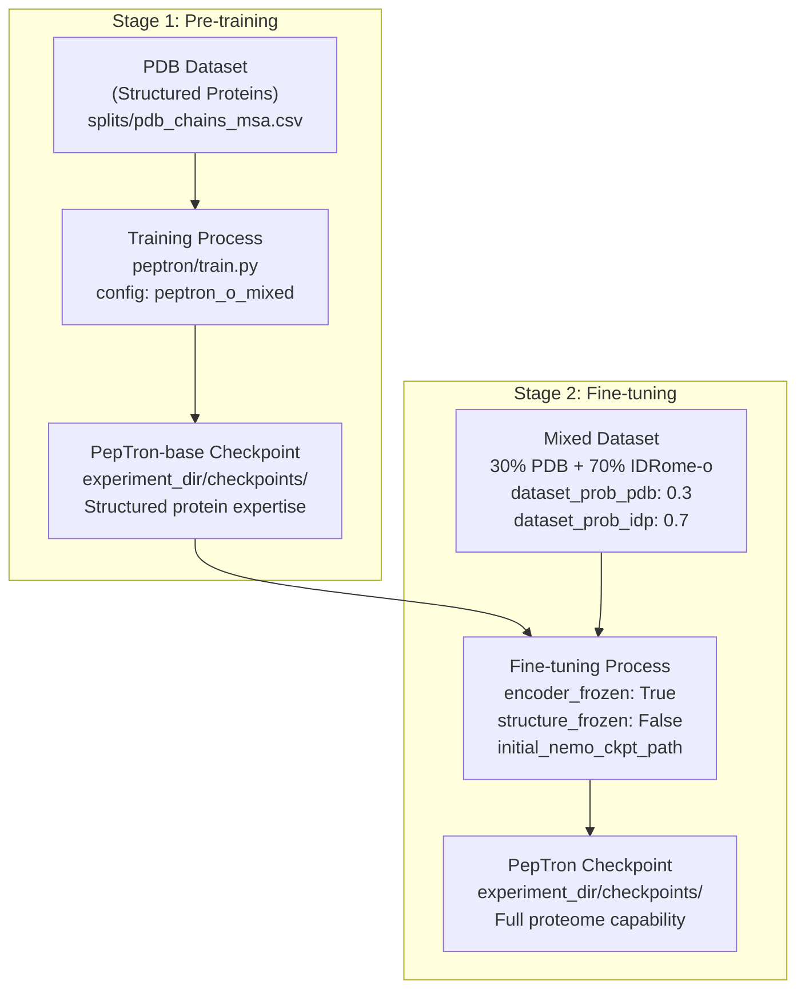
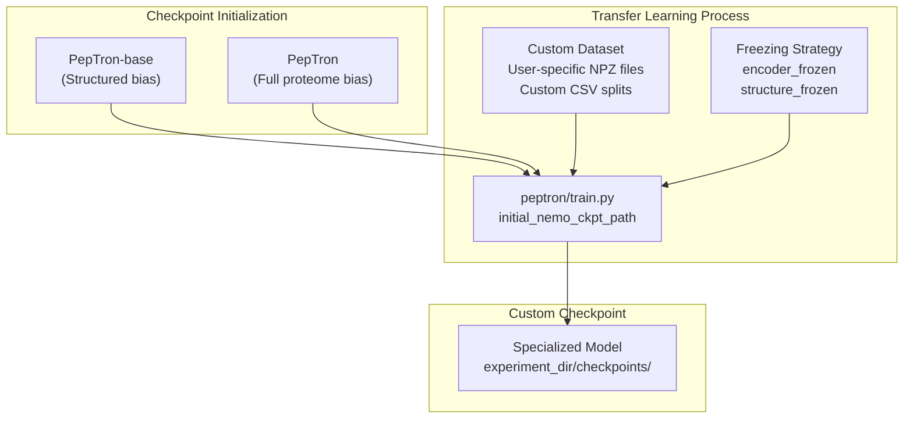
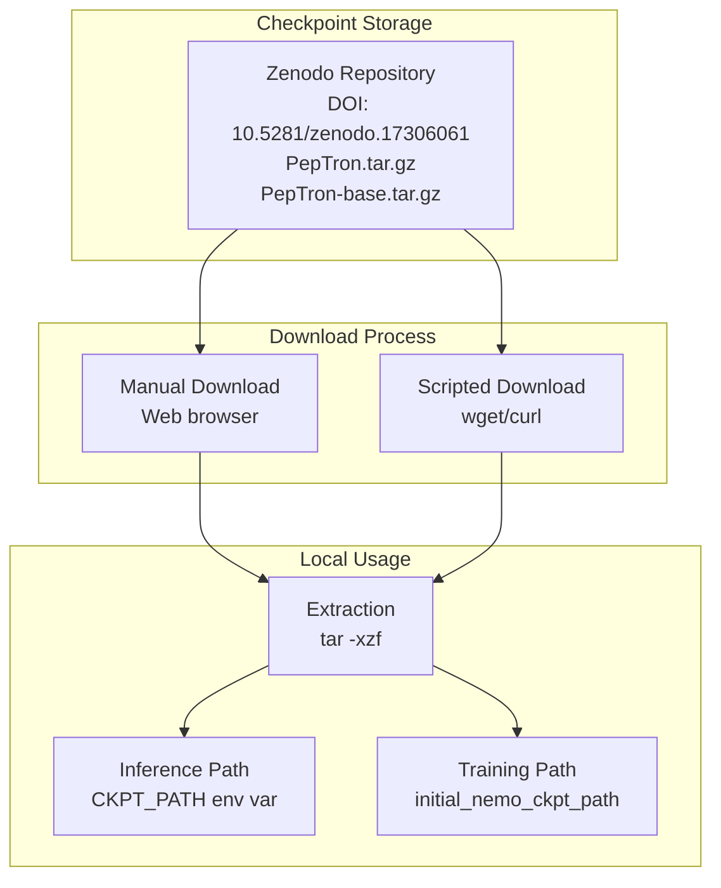

# Model Checkpoints

> **Relevant source files**
> * [README.md](https://github.com/PeptoneLtd/PepTron/blob/8123ab15/README.md?plain=1)

## Purpose and Scope

This document describes the pre-trained model checkpoints available for PepTron, their training lineage, format, and appropriate use cases. It covers the two primary checkpoint variants (`PepTron-base` and `PepTron`), how they are created, and how to use them for inference or transfer learning.

For information about configuring training to produce new checkpoints, see [Training Configuration](/PeptoneLtd/PepTron/5.1-training-configuration). For details on loading checkpoints during inference, see [Inference Pipeline Stages](/PeptoneLtd/PepTron/6.2-inference-pipeline-stages).

## Checkpoint Variants

PepTron provides two pre-trained checkpoint variants, each trained for different purposes and optimal for different use cases:

| Checkpoint Name | Training Data | Primary Use Case | Availability |
| --- | --- | --- | --- |
| `PepTron-base` | PDB (structured proteins only) | Structured protein prediction, transfer learning base | Zenodo |
| `PepTron` | PDB + IDRome-o (structured + disordered) | Full proteome prediction (recommended) | Zenodo |

Both checkpoints are available for download from [Zenodo record 17306061](https://zenodo.org/records/17306061).

**Sources:** [README.md L28-L33](https://github.com/PeptoneLtd/PepTron/blob/8123ab15/README.md?plain=1#L28-L33)

## Checkpoint Training Lineage

The two checkpoint variants follow a sequential training strategy where `PepTron-base` serves as the foundation for the final `PepTron` model:



### Stage 1: PepTron-base Creation

The first stage trains exclusively on structured proteins from the PDB dataset. This establishes the model's understanding of folded protein conformations and domain structures.

**Training Configuration:**

* **Data Source:** PDB mmCIF files processed into NPZ format
* **Training Split:** Temporal split with cutoff `2020-05-01` (parameter `train_cutoff`)
* **Validation:** CAMEO 2022 targets (`splits/cameo2022_msa.csv`)
* **Clustering:** 40% sequence similarity clusters (`pdb_clusters`) to prevent data leakage

**Sources:** [README.md L77-L94](https://github.com/PeptoneLtd/PepTron/blob/8123ab15/README.md?plain=1#L77-L94)

 [README.md L154-L158](https://github.com/PeptoneLtd/PepTron/blob/8123ab15/README.md?plain=1#L154-L158)

### Stage 2: PepTron Creation

The second stage fine-tunes `PepTron-base` on a mixture of structured and disordered proteins to create the final `PepTron` checkpoint.

**Training Configuration:**

* **Data Mix:** 30% PDB (`dataset_prob_pdb: 0.3`) + 70% IDRome-o (`dataset_prob_idp: 0.7`)
* **Transfer Learning:** Encoder frozen (`encoder_frozen: True`), structure module trainable (`structure_frozen: False`)
* **Initial Checkpoint:** Loaded via `initial_nemo_ckpt_path` parameter pointing to `PepTron-base`
* **IDP Data:** IDRome-o ensemble trajectories (`splits/IDRome_DB-train-msa.csv`, `splits/IDRome_DB-val-msa.csv`)

**Sources:** [README.md L96-L106](https://github.com/PeptoneLtd/PepTron/blob/8123ab15/README.md?plain=1#L96-L106)

 [README.md L138-L162](https://github.com/PeptoneLtd/PepTron/blob/8123ab15/README.md?plain=1#L138-L162)

## Checkpoint File Structure

### Download and Extraction

Checkpoints are distributed as compressed tar archives (`.tar.gz`) from Zenodo. After extraction, the checkpoint directory structure follows the NeMo framework format:

```markdown
peptron-checkpoint/
├── model_config.yaml          # Model architecture configuration
├── model_weights.ckpt         # PyTorch state dict with trained parameters
├── optimizer_states.ckpt      # Optimizer state (for resuming training)
├── scheduler_states.ckpt      # Learning rate scheduler state
└── trainer_state.yaml         # Training metadata and step count
```

**Extraction Example:**

```markdown
# From README.md:59-61tar -xzf PepTron.tar.gz# Results in: peptron-checkpoint/
```

**Sources:** [README.md L57-L61](https://github.com/PeptoneLtd/PepTron/blob/8123ab15/README.md?plain=1#L57-L61)

### Configuration Integration

Checkpoints are loaded via the `initial_nemo_ckpt_path` parameter in the training configuration:

[peptron/model/config.py L138](https://github.com/PeptoneLtd/PepTron/blob/8123ab15/peptron/model/config.py#L138-L138)

```
"initial_nemo_ckpt_path": "/path/to/initial/checkpoint",
```

The checkpoint path is also required for inference operations, specified via environment variables in the inference script:

[README.md L68](https://github.com/PeptoneLtd/PepTron/blob/8123ab15/README.md?plain=1#L68-L68)

```javascript
export CKPT_PATH="/path/to/the/peptron-checkpoint"
```

**Sources:** [README.md L68](https://github.com/PeptoneLtd/PepTron/blob/8123ab15/README.md?plain=1#L68-L68)

 [README.md L138](https://github.com/PeptoneLtd/PepTron/blob/8123ab15/README.md?plain=1#L138-L138)

## Usage Scenarios

### Scenario 1: Full Proteome Inference (Recommended)

**Checkpoint:** `PepTron`

Use this checkpoint for generating structure ensembles of any protein sequence, including those with disordered regions, multi-domain architectures, or intrinsically disordered proteins (IDPs).

**Configuration:**

```markdown
# peptron/infer.pyEXEC_CONFIG = config_flags.DEFINE_config_file(    'config',     'peptron/model/config.py:peptron_o_inference_cueq')
```

**Recommended For:**

* General-purpose protein structure prediction
* Multi-domain proteins
* Proteins with disordered regions
* Therapeutic targets

**Sources:** [README.md L32-L33](https://github.com/PeptoneLtd/PepTron/blob/8123ab15/README.md?plain=1#L32-L33)

 [README.md L37-L73](https://github.com/PeptoneLtd/PepTron/blob/8123ab15/README.md?plain=1#L37-L73)

### Scenario 2: Structured Protein Inference

**Checkpoint:** `PepTron-base`

Use this checkpoint when working exclusively with structured, folded proteins where disorder is not expected or relevant.

**Recommended For:**

* Globular protein domains
* Enzyme active site modeling
* Protein engineering of structured scaffolds

**Sources:** [README.md L33-L34](https://github.com/PeptoneLtd/PepTron/blob/8123ab15/README.md?plain=1#L33-L34)

### Scenario 3: Transfer Learning

**Checkpoint:** Either `PepTron-base` or `PepTron`

Both checkpoints can serve as initialization for custom fine-tuning on specialized datasets or experimental conditions.



**Freezing Parameters:**

| Parameter | Purpose | Typical Value for Transfer Learning |
| --- | --- | --- |
| `encoder_frozen` | Freeze ESM2-based sequence encoder | `True` (retain sequence understanding) |
| `structure_frozen` | Freeze structure prediction head | `False` (adapt to new data) |
| `pretrained_structure_head_path` | Optional separate structure head initialization | `""` (empty if using full checkpoint) |

**Transfer Learning Configuration:**
[peptron/model/config.py L159-L162](https://github.com/PeptoneLtd/PepTron/blob/8123ab15/peptron/model/config.py#L159-L162)

```
"encoder_frozen": True,"structure_frozen": False,"pretrained_structure_head_path": "",
```

**Sources:** [README.md L138](https://github.com/PeptoneLtd/PepTron/blob/8123ab15/README.md?plain=1#L138-L138)

 [README.md L159-L162](https://github.com/PeptoneLtd/PepTron/blob/8123ab15/README.md?plain=1#L159-L162)

## Checkpoint Management During Training

### Checkpoint Saving Strategy

Training checkpoints are automatically saved according to the configuration parameters:

| Parameter | Description | Default Value |
| --- | --- | --- |
| `experiment_dir` | Root directory for all training outputs | `/path/to/your/experiment/dir` |
| `steps_to_save_ckpt` | Save checkpoint every N training steps | `100` |
| `val_check_interval` | Validate and potentially save every N steps | `100` |

Checkpoints are saved to: `{experiment_dir}/checkpoints/`

**Configuration Location:** [peptron/model/config.py L121-L136](https://github.com/PeptoneLtd/PepTron/blob/8123ab15/peptron/model/config.py#L121-L136)

**Sources:** [README.md L121-L136](https://github.com/PeptoneLtd/PepTron/blob/8123ab15/README.md?plain=1#L121-L136)

### Checkpoint Loading for Resumption

To resume training from a saved checkpoint, specify the checkpoint directory path:

```
"initial_nemo_ckpt_path": "/path/to/experiment_dir/checkpoints/step_500"
```

The training process will restore:

* Model weights
* Optimizer state
* Learning rate scheduler state
* Training step counter
* Random number generator states (for reproducibility)

**Sources:** [README.md L138](https://github.com/PeptoneLtd/PepTron/blob/8123ab15/README.md?plain=1#L138-L138)

## Checkpoint-Related Configuration Parameters

### Inference Configuration

The inference configuration (`peptron_o_inference_cueq`) requires checkpoint specification via command-line or environment variables:

```javascript
# run_peptron_infer.sh patternexport CKPT_PATH="/path/to/the/peptron-checkpoint"sh run_peptron_infer.sh
```

**Key Inference Parameters:**

* `samples`: Number of ensemble members to generate per sequence
* `steps`: Number of diffusion denoising steps
* `max_batch_size`: Parallel structure generation batch size
* `num_gpus`: GPU allocation for inference

**Sources:** [README.md L66-L73](https://github.com/PeptoneLtd/PepTron/blob/8123ab15/README.md?plain=1#L66-L73)

 [README.md L177-L190](https://github.com/PeptoneLtd/PepTron/blob/8123ab15/README.md?plain=1#L177-L190)

### Training Configuration

The training configuration (`peptron_o_mixed`) includes checkpoint-related parameters:

[peptron/model/config.py L110-L113](https://github.com/PeptoneLtd/PepTron/blob/8123ab15/peptron/model/config.py#L110-L113)

```
EXEC_CONFIG = config_flags.DEFINE_config_file(    'config',     'peptron/model/config.py:peptron_o_mixed')
```

**Sources:** [README.md L110-L113](https://github.com/PeptoneLtd/PepTron/blob/8123ab15/README.md?plain=1#L110-L113)

## Checkpoint Compatibility and Versioning

### Model Architecture Compatibility

Checkpoints are tied to specific model architectures defined in the configuration. Key compatibility requirements:

* **ESM2 Encoder Configuration:** Must match the sequence encoder architecture
* **Structure Module Configuration:** Must match the structure prediction head
* **Diffusion Parameters:** Flow matching configuration must be consistent

**Troubleshooting Checkpoint Loading:**

From [README.md L217](https://github.com/PeptoneLtd/PepTron/blob/8123ab15/README.md?plain=1#L217-L217)

:

> **Checkpoint Loading Error**: Verify checkpoint path and model configuration compatibility

If you encounter checkpoint loading errors:

1. Verify the checkpoint path exists and is accessible
2. Ensure the configuration (`peptron_o_inference_cueq` or `peptron_o_mixed`) matches the checkpoint's training configuration
3. Check that the model architecture parameters (encoder size, structure module size) match

**Sources:** [README.md L217](https://github.com/PeptoneLtd/PepTron/blob/8123ab15/README.md?plain=1#L217-L217)

## Checkpoint Distribution and Access



**Access Information:**

* **Repository:** [https://zenodo.org/records/17306061](https://zenodo.org/records/17306061)
* **DOI:** 10.5281/zenodo.17306061
* **License:** Apache License 2.0 (same as source code)

**File Sizes:**

* `PepTron.tar.gz`: Large (~GB scale)
* `PepTron-base.tar.gz`: Large (~GB scale)

**Sources:** [README.md L3-L4](https://github.com/PeptoneLtd/PepTron/blob/8123ab15/README.md?plain=1#L3-L4)

 [README.md L30-L33](https://github.com/PeptoneLtd/PepTron/blob/8123ab15/README.md?plain=1#L30-L33)

 [README.md L57-L61](https://github.com/PeptoneLtd/PepTron/blob/8123ab15/README.md?plain=1#L57-L61)