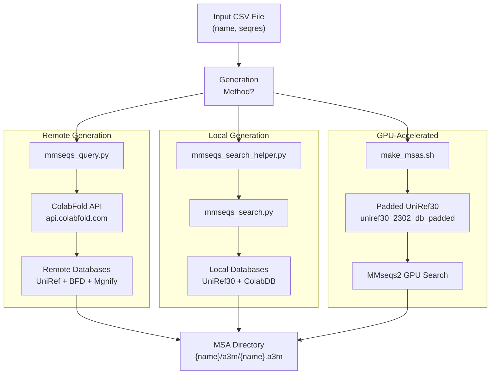
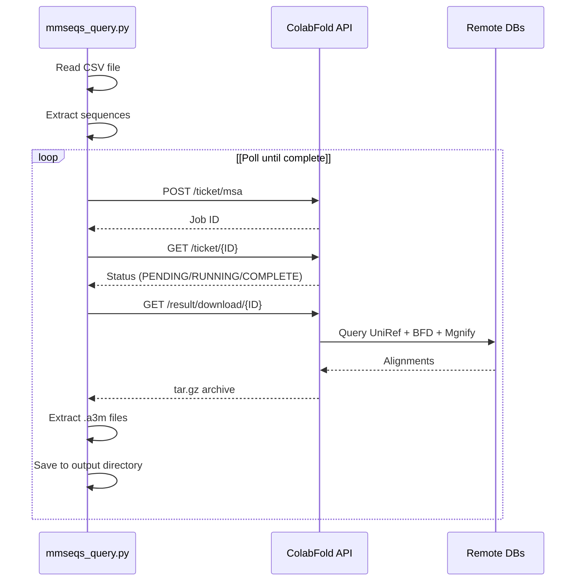
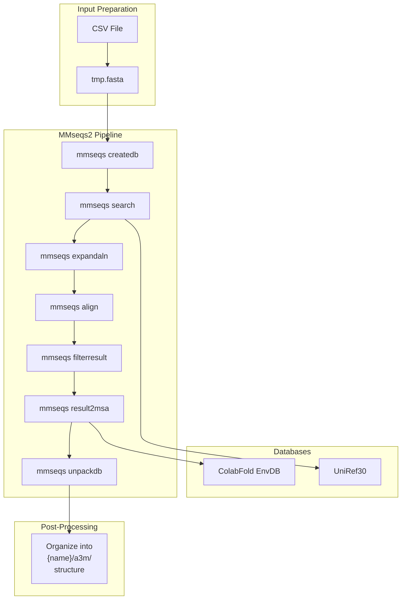
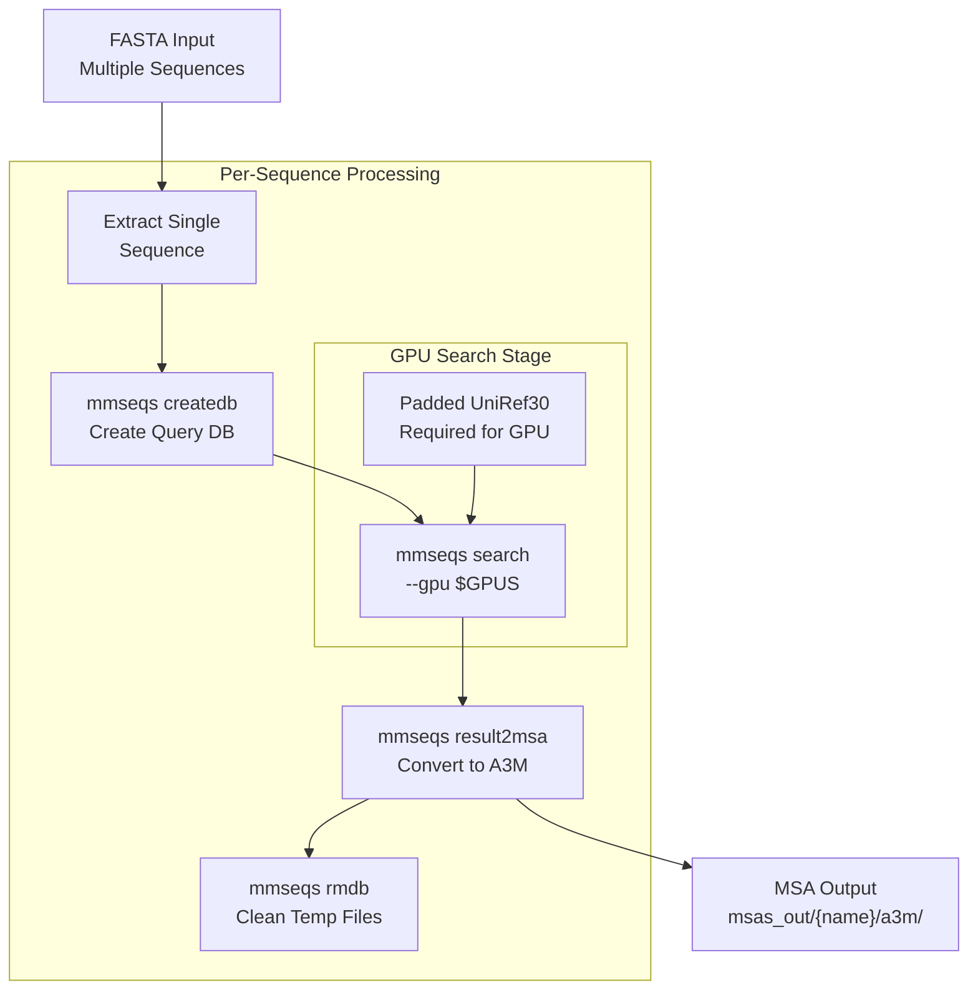
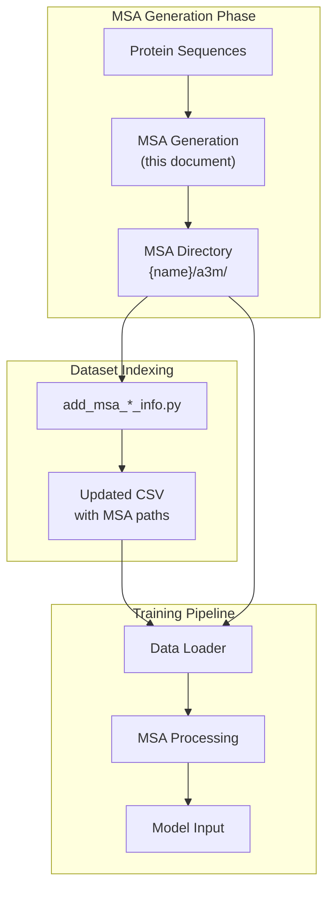

# Multiple Sequence Alignment (MSA) Generation

> **Relevant source files**
> * [README.md](https://github.com/PeptoneLtd/PepTron/blob/8123ab15/README.md?plain=1)
> * [dataprep/make_msas.sh](https://github.com/PeptoneLtd/PepTron/blob/8123ab15/dataprep/make_msas.sh)
> * [dataprep/mmseqs_query.py](https://github.com/PeptoneLtd/PepTron/blob/8123ab15/dataprep/mmseqs_query.py)
> * [dataprep/mmseqs_search.py](https://github.com/PeptoneLtd/PepTron/blob/8123ab15/dataprep/mmseqs_search.py)
> * [dataprep/mmseqs_search_helper.py](https://github.com/PeptoneLtd/PepTron/blob/8123ab15/dataprep/mmseqs_search_helper.py)

This document describes the Multiple Sequence Alignment (MSA) generation system used in PepTron's data preparation pipeline. MSAs provide evolutionary context for protein sequences, which is used during data preprocessing and input pipeline construction, though not directly during model training.

For information about how MSA data is integrated into the processed datasets, see [PDB Dataset Processing](/PeptoneLtd/PepTron/4.1-pdb-dataset-processing) and [IDRome-o Dataset Processing](/PeptoneLtd/PepTron/4.2-idrome-o-dataset-processing). For the database setup required for local MSA generation, see [Database Setup and Management](/PeptoneLtd/PepTron/4.4-database-setup-and-management).

## Overview

PepTron requires MSAs for all protein sequences in both training and validation datasets. The system supports two methods for MSA generation:

1. **Remote generation** via the ColabFold API (suitable for smaller datasets or initial setup)
2. **Local generation** using MMseqs2 with downloaded databases (required for large-scale processing)

Both methods produce alignments in A3M format, stored in a consistent directory structure that integrates with PepTron's data loading pipeline.

**Sources:** [README.md L79-L107](https://github.com/PeptoneLtd/PepTron/blob/8123ab15/README.md?plain=1#L79-L107)

 [dataprep/mmseqs_query.py L1-L294](https://github.com/PeptoneLtd/PepTron/blob/8123ab15/dataprep/mmseqs_query.py#L1-L294)

 [dataprep/make_msas.sh L1-L49](https://github.com/PeptoneLtd/PepTron/blob/8123ab15/dataprep/make_msas.sh#L1-L49)

## MSA Generation Methods Comparison

| Method | Script | Database Required | Use Case | Limitations |
| --- | --- | --- | --- | --- |
| Remote API | `mmseqs_query.py` | None | Small datasets, quick setup | Rate limits, network dependency |
| Local Search | `mmseqs_search_helper.py` | UniRef30 + ColabDB | Large-scale production | ~2.7TB disk space, setup overhead |
| GPU-Accelerated | `make_msas.sh` | UniRef30 (padded) | High-throughput processing | Requires MMseqs2 GPU support |

**Sources:** [README.md L87-L89](https://github.com/PeptoneLtd/PepTron/blob/8123ab15/README.md?plain=1#L87-L89)

 [dataprep/mmseqs_query.py L1-L10](https://github.com/PeptoneLtd/PepTron/blob/8123ab15/dataprep/mmseqs_query.py#L1-L10)

 [dataprep/mmseqs_search_helper.py L1-L10](https://github.com/PeptoneLtd/PepTron/blob/8123ab15/dataprep/mmseqs_search_helper.py#L1-L10)

 [dataprep/make_msas.sh L1-L12](https://github.com/PeptoneLtd/PepTron/blob/8123ab15/dataprep/make_msas.sh#L1-L12)

## MSA Generation Workflow



**Sources:** [README.md L87-L89](https://github.com/PeptoneLtd/PepTron/blob/8123ab15/README.md?plain=1#L87-L89)

 [dataprep/mmseqs_query.py L21-L283](https://github.com/PeptoneLtd/PepTron/blob/8123ab15/dataprep/mmseqs_query.py#L21-L283)

 [dataprep/mmseqs_search_helper.py L1-L30](https://github.com/PeptoneLtd/PepTron/blob/8123ab15/dataprep/mmseqs_search_helper.py#L1-L30)

 [dataprep/make_msas.sh L1-L49](https://github.com/PeptoneLtd/PepTron/blob/8123ab15/dataprep/make_msas.sh#L1-L49)

## Remote MSA Generation (ColabFold API)

### Usage

The `mmseqs_query.py` script queries the ColabFold public API to generate MSAs without requiring local database installation.

```
python -m dataprep.mmseqs_query \    --split [CSV_FILE] \    --outdir [OUTPUT_DIR]
```

### Parameters

| Parameter | Type | Default | Description |
| --- | --- | --- | --- |
| `--split` | str | Required | Path to CSV file with `name` and `seqres` columns |
| `--outdir` | str | `./alignment_dir` | Output directory for MSA files |

**Sources:** [dataprep/mmseqs_query.py L3-L7](https://github.com/PeptoneLtd/PepTron/blob/8123ab15/dataprep/mmseqs_query.py#L3-L7)

 [README.md L88](https://github.com/PeptoneLtd/PepTron/blob/8123ab15/README.md?plain=1#L88-L88)

### API Request Flow



**Sources:** [dataprep/mmseqs_query.py L21-L283](https://github.com/PeptoneLtd/PepTron/blob/8123ab15/dataprep/mmseqs_query.py#L21-L283)

### Implementation Details

The remote generation process is implemented in the `run_mmseqs2()` function [dataprep/mmseqs_query.py L21-L283](https://github.com/PeptoneLtd/PepTron/blob/8123ab15/dataprep/mmseqs_query.py#L21-L283)

 Key steps:

1. **Submission**: Sequences are submitted to the ColabFold API endpoint [dataprep/mmseqs_query.py L33-L63](https://github.com/PeptoneLtd/PepTron/blob/8123ab15/dataprep/mmseqs_query.py#L33-L63)
2. **Polling**: Status is checked periodically with exponential backoff [dataprep/mmseqs_query.py L65-L87](https://github.com/PeptoneLtd/PepTron/blob/8123ab15/dataprep/mmseqs_query.py#L65-L87)
3. **Download**: Results are retrieved as tar.gz archives [dataprep/mmseqs_query.py L89-L106](https://github.com/PeptoneLtd/PepTron/blob/8123ab15/dataprep/mmseqs_query.py#L89-L106)
4. **Extraction**: A3M files are extracted and organized [dataprep/mmseqs_query.py L195-L206](https://github.com/PeptoneLtd/PepTron/blob/8123ab15/dataprep/mmseqs_query.py#L195-L206)

The script handles rate limiting, retries, and network errors automatically [dataprep/mmseqs_query.py L39-L56](https://github.com/PeptoneLtd/PepTron/blob/8123ab15/dataprep/mmseqs_query.py#L39-L56)

**Sources:** [dataprep/mmseqs_query.py L21-L283](https://github.com/PeptoneLtd/PepTron/blob/8123ab15/dataprep/mmseqs_query.py#L21-L283)

## Local MSA Generation (MMseqs2)

### Prerequisites

Local MSA generation requires:

* MMseqs2 binary compiled from source
* UniRef30 database (~500GB)
* ColabFold environmental database (~2.2TB)

See [Database Setup and Management](/PeptoneLtd/PepTron/4.4-database-setup-and-management) for download instructions.

**Sources:** [README.md L89](https://github.com/PeptoneLtd/PepTron/blob/8123ab15/README.md?plain=1#L89-L89)

### Helper Script Usage

The `mmseqs_search_helper.py` script provides a simplified interface to local MMseqs2 searches:

```
python -m dataprep.mmseqs_search_helper \    --split [CSV_FILE] \    --db_dir [DATABASE_DIR] \    --outdir [OUTPUT_DIR]
```

### Parameters

| Parameter | Type | Default | Description |
| --- | --- | --- | --- |
| `--split` | str | Required | Path to CSV with protein sequences |
| `--db_dir` | str | `./dbbase` | Directory containing MMseqs2 databases |
| `--outdir` | str | `./alignment_dir` | Output directory for MSA files |

**Sources:** [dataprep/mmseqs_search_helper.py L1-L30](https://github.com/PeptoneLtd/PepTron/blob/8123ab15/dataprep/mmseqs_search_helper.py#L1-L30)

### Local Search Process



**Sources:** [dataprep/mmseqs_search_helper.py L11-L30](https://github.com/PeptoneLtd/PepTron/blob/8123ab15/dataprep/mmseqs_search_helper.py#L11-L30)

 [dataprep/mmseqs_search.py L25-L146](https://github.com/PeptoneLtd/PepTron/blob/8123ab15/dataprep/mmseqs_search.py#L25-L146)

### MMseqs2 Search Parameters

The local search implementation in `mmseqs_search.py` provides extensive configuration options for the search pipeline:

| Parameter | Default | Purpose |
| --- | --- | --- |
| `s` | 8.0 | Sensitivity (higher = more sensitive, slower) |
| `threads` | 32 | Number of CPU threads |
| `num_iterations` | 3 | Profile search iterations |
| `max_seqs` | 10000 | Maximum sequences per alignment |
| `max_seq_id` | 0.95 | Maximum sequence identity threshold |
| `qsc` | 0.8 | Query sequence coverage threshold (with filter) |
| `db_load_mode` | 2 | Database loading strategy (0=no index, 2=full index) |

**Sources:** [dataprep/mmseqs_search.py L25-L146](https://github.com/PeptoneLtd/PepTron/blob/8123ab15/dataprep/mmseqs_search.py#L25-L146)

### Search Algorithm Flow

The `mmseqs_search_monomer()` function [dataprep/mmseqs_search.py L25-L146](https://github.com/PeptoneLtd/PepTron/blob/8123ab15/dataprep/mmseqs_search.py#L25-L146)

 implements a multi-stage search:

1. **Initial Search**: Query against UniRef30 with iterative profile search [dataprep/mmseqs_search.py L86](https://github.com/PeptoneLtd/PepTron/blob/8123ab15/dataprep/mmseqs_search.py#L86-L86)
2. **Expansion**: Expand alignments to find more homologs [dataprep/mmseqs_search.py L87](https://github.com/PeptoneLtd/PepTron/blob/8123ab15/dataprep/mmseqs_search.py#L87-L87)
3. **Realignment**: Realign with stricter parameters [dataprep/mmseqs_search.py L90](https://github.com/PeptoneLtd/PepTron/blob/8123ab15/dataprep/mmseqs_search.py#L90-L90)
4. **Filtering**: Apply quality filters (qsc, sequence identity) [dataprep/mmseqs_search.py L91-L94](https://github.com/PeptoneLtd/PepTron/blob/8123ab15/dataprep/mmseqs_search.py#L91-L94)
5. **MSA Generation**: Convert results to A3M format [dataprep/mmseqs_search.py L95-L97](https://github.com/PeptoneLtd/PepTron/blob/8123ab15/dataprep/mmseqs_search.py#L95-L97)
6. **Environmental Search**: Optional search against metagenomic databases [dataprep/mmseqs_search.py L108-L122](https://github.com/PeptoneLtd/PepTron/blob/8123ab15/dataprep/mmseqs_search.py#L108-L122)
7. **Merging**: Combine UniRef and environmental results [dataprep/mmseqs_search.py L131](https://github.com/PeptoneLtd/PepTron/blob/8123ab15/dataprep/mmseqs_search.py#L131-L131)

**Sources:** [dataprep/mmseqs_search.py L25-L146](https://github.com/PeptoneLtd/PepTron/blob/8123ab15/dataprep/mmseqs_search.py#L25-L146)

## GPU-Accelerated MSA Generation

### Overview

The `make_msas.sh` script provides GPU-accelerated MSA generation for high-throughput processing. This method is significantly faster than CPU-only searches but requires MMseqs2 compiled with GPU support.

**Sources:** [dataprep/make_msas.sh L1-L49](https://github.com/PeptoneLtd/PepTron/blob/8123ab15/dataprep/make_msas.sh#L1-L49)

### Configuration

Key configuration parameters in `make_msas.sh`:

```
QUERIES=splits/IDRome_DB-clustered-train.fastaDB_PREFIX=uniref30/uniref30_2302_db_paddedTHREADS=64GPUS=1E_VAL=1e-3MAX_SEQ_ID=0.95
```

**Sources:** [dataprep/make_msas.sh L6-L11](https://github.com/PeptoneLtd/PepTron/blob/8123ab15/dataprep/make_msas.sh#L6-L11)

### GPU Search Implementation



**Sources:** [dataprep/make_msas.sh L15-L47](https://github.com/PeptoneLtd/PepTron/blob/8123ab15/dataprep/make_msas.sh#L15-L47)

### GPU Search Process

The shell script processes each sequence individually [dataprep/make_msas.sh L15-L47](https://github.com/PeptoneLtd/PepTron/blob/8123ab15/dataprep/make_msas.sh#L15-L47)

:

1. **Database Padding**: Create padded database for GPU compatibility [dataprep/make_msas.sh L2](https://github.com/PeptoneLtd/PepTron/blob/8123ab15/dataprep/make_msas.sh#L2-L2)
2. **Sequence Extraction**: Read FASTA and extract individual sequences [dataprep/make_msas.sh L15-L19](https://github.com/PeptoneLtd/PepTron/blob/8123ab15/dataprep/make_msas.sh#L15-L19)
3. **Query DB Creation**: Create MMseqs2 query database [dataprep/make_msas.sh L24](https://github.com/PeptoneLtd/PepTron/blob/8123ab15/dataprep/make_msas.sh#L24-L24)
4. **GPU Search**: Run GPU-accelerated search against padded database [dataprep/make_msas.sh L27-L35](https://github.com/PeptoneLtd/PepTron/blob/8123ab15/dataprep/make_msas.sh#L27-L35)
5. **MSA Conversion**: Convert results to A3M format [dataprep/make_msas.sh L37-L43](https://github.com/PeptoneLtd/PepTron/blob/8123ab15/dataprep/make_msas.sh#L37-L43)
6. **Cleanup**: Remove temporary databases [dataprep/make_msas.sh L45-L46](https://github.com/PeptoneLtd/PepTron/blob/8123ab15/dataprep/make_msas.sh#L45-L46)

The GPU search uses these specific parameters:

* `--threads $THREADS`: CPU threads for I/O operations
* `--gpu $GPUS`: Number of GPUs to use
* `-e $E_VAL`: E-value threshold (1e-3)
* `--max-seq-id $MAX_SEQ_ID`: Maximum sequence identity (0.95)

**Sources:** [dataprep/make_msas.sh L1-L49](https://github.com/PeptoneLtd/PepTron/blob/8123ab15/dataprep/make_msas.sh#L1-L49)

## Output Format and Directory Structure

### Standard Directory Layout

All MSA generation methods produce the same standardized output structure:

```
alignment_dir/
├── {protein_name_1}/
│   └── a3m/
│       └── {protein_name_1}.a3m
├── {protein_name_2}/
│   └── a3m/
│       └── {protein_name_2}.a3m
└── ...
```

This structure is referenced throughout PepTron's data loading pipeline and must be maintained for proper integration.

**Sources:** [README.md L87](https://github.com/PeptoneLtd/PepTron/blob/8123ab15/README.md?plain=1#L87-L87)

 [dataprep/mmseqs_query.py L290-L293](https://github.com/PeptoneLtd/PepTron/blob/8123ab15/dataprep/mmseqs_query.py#L290-L293)

 [dataprep/mmseqs_search_helper.py L25-L29](https://github.com/PeptoneLtd/PepTron/blob/8123ab15/dataprep/mmseqs_search_helper.py#L25-L29)

### A3M Format Specification

MSAs are stored in A3M format (a compressed version of A2M), which includes:

* Query sequence (first entry)
* Aligned homologous sequences
* Gap characters for insertions/deletions
* Lowercase letters for insertions

Example A3M structure:

```
>101 query_name
MKTAYIAKQRQISFVKSHFSRQLEERLGLIEVQA
>102 homolog_1
MKTAYIAKQRQISFVKSHFSRQLEERLGLIEVQA
>103 homolog_2
MKTAYIAKQRQISFVKSHFSRQLEERLGLIEVqa
```

**Sources:** [dataprep/mmseqs_query.py L253-L266](https://github.com/PeptoneLtd/PepTron/blob/8123ab15/dataprep/mmseqs_query.py#L253-L266)

## Integration with Data Pipeline

### Adding MSA Information to Datasets

After generating MSAs, they must be indexed in the dataset CSV files using the `add_msa_*_info.py` scripts:

```markdown
# For PDB training datapython -m dataprep.add_msa_train_info \    --openfold_dir [OPENFOLD_DIR] # For validation datapython -m dataprep.add_msa_val_info
```

These scripts add MSA lookup columns to the CSV files, enabling the data loaders to find the corresponding alignment files during training.

**Sources:** [README.md L92-L94](https://github.com/PeptoneLtd/PepTron/blob/8123ab15/README.md?plain=1#L92-L94)

 [README.md L105](https://github.com/PeptoneLtd/PepTron/blob/8123ab15/README.md?plain=1#L105-L105)

### MSA Usage in Training Pipeline



**Sources:** [README.md L79-L107](https://github.com/PeptoneLtd/PepTron/blob/8123ab15/README.md?plain=1#L79-L107)

### Dataset-Specific Requirements

| Dataset | Split | MSA Source | Notes |
| --- | --- | --- | --- |
| PDB Training | `pdb_mmcif_msa.csv` | OpenProteinSet | Pre-generated MSAs from OpenProteinSet |
| PDB Validation | `cameo2022_msa.csv` | Generated | Must generate for CAMEO 2022 sequences |
| IDRome-o Training | `IDRome_DB-train-msa.csv` | Generated | Generate for all training sequences |
| IDRome-o Validation | `IDRome_DB-val-msa.csv` | Generated | Generate for all validation sequences |

**Sources:** [README.md L91-L94](https://github.com/PeptoneLtd/PepTron/blob/8123ab15/README.md?plain=1#L91-L94)

 [README.md L105-L106](https://github.com/PeptoneLtd/PepTron/blob/8123ab15/README.md?plain=1#L105-L106)

## Best Practices

### Choosing the Right Method

**Use Remote API when:**

* Dataset has < 1000 sequences
* Quick prototyping or testing
* No local computational resources available

**Use Local Search when:**

* Processing large datasets (> 1000 sequences)
* Batch processing multiple datasets
* Reproducibility is critical
* Network connectivity is unreliable

**Use GPU-Accelerated when:**

* Processing > 10,000 sequences
* Time constraints are strict
* GPU resources are available
* Database is already set up

**Sources:** [README.md L87-L89](https://github.com/PeptoneLtd/PepTron/blob/8123ab15/README.md?plain=1#L87-L89)

 [dataprep/make_msas.sh L1-L12](https://github.com/PeptoneLtd/PepTron/blob/8123ab15/dataprep/make_msas.sh#L1-L12)

### Performance Considerations

| Method | Sequences/Hour | Setup Time | Resource Requirements |
| --- | --- | --- | --- |
| Remote API | ~50-100 | Minimal | Network bandwidth |
| Local CPU | ~100-500 | Hours (DB download) | ~3TB disk, 32+ cores |
| Local GPU | ~1000-5000 | Hours (DB download) | ~3TB disk, GPU with 8GB+ VRAM |

**Sources:** [dataprep/mmseqs_query.py L146-L148](https://github.com/PeptoneLtd/PepTron/blob/8123ab15/dataprep/mmseqs_query.py#L146-L148)

 [dataprep/make_msas.sh L8-L11](https://github.com/PeptoneLtd/PepTron/blob/8123ab15/dataprep/make_msas.sh#L8-L11)

### Error Handling

The scripts implement robust error handling:

* **API errors**: Automatic retries with exponential backoff [dataprep/mmseqs_query.py L48-L56](https://github.com/PeptoneLtd/PepTron/blob/8123ab15/dataprep/mmseqs_query.py#L48-L56)
* **Network timeouts**: Configurable timeout with retry logic [dataprep/mmseqs_query.py L44-L46](https://github.com/PeptoneLtd/PepTron/blob/8123ab15/dataprep/mmseqs_query.py#L44-L46)
* **Rate limiting**: Automatic detection and wait [dataprep/mmseqs_query.py L153-L158](https://github.com/PeptoneLtd/PepTron/blob/8123ab15/dataprep/mmseqs_query.py#L153-L158)
* **Maintenance windows**: Graceful failure with informative messages [dataprep/mmseqs_query.py L163-L164](https://github.com/PeptoneLtd/PepTron/blob/8123ab15/dataprep/mmseqs_query.py#L163-L164)

**Sources:** [dataprep/mmseqs_query.py L39-L194](https://github.com/PeptoneLtd/PepTron/blob/8123ab15/dataprep/mmseqs_query.py#L39-L194)