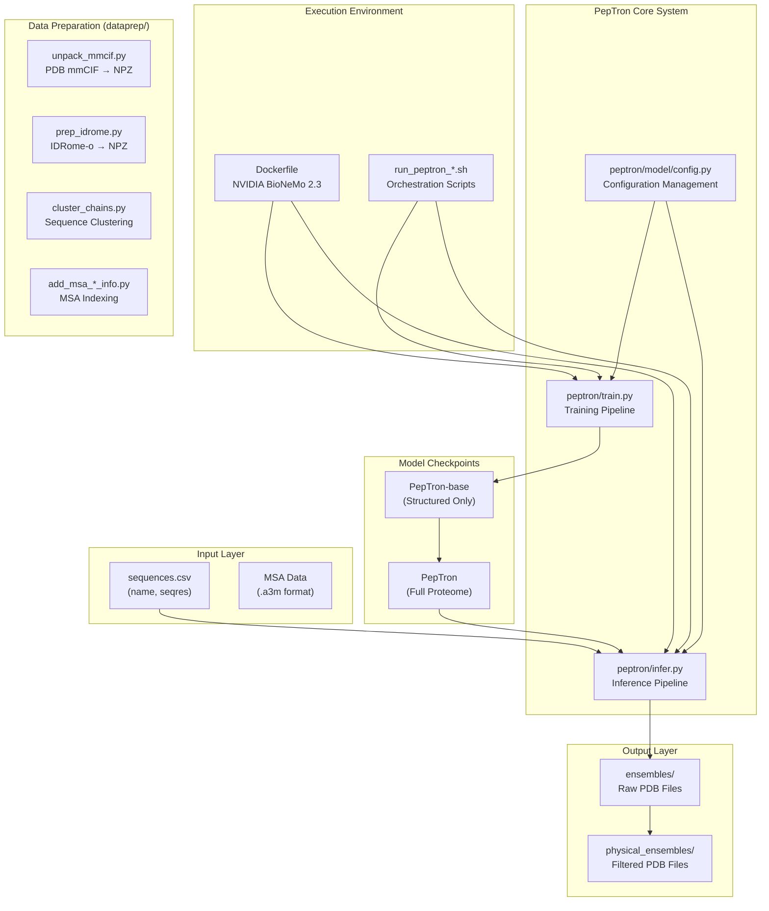
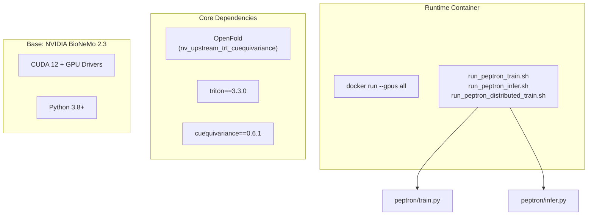
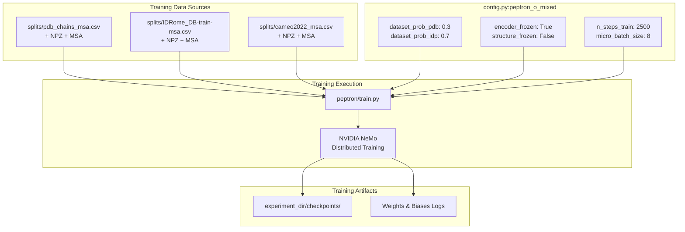
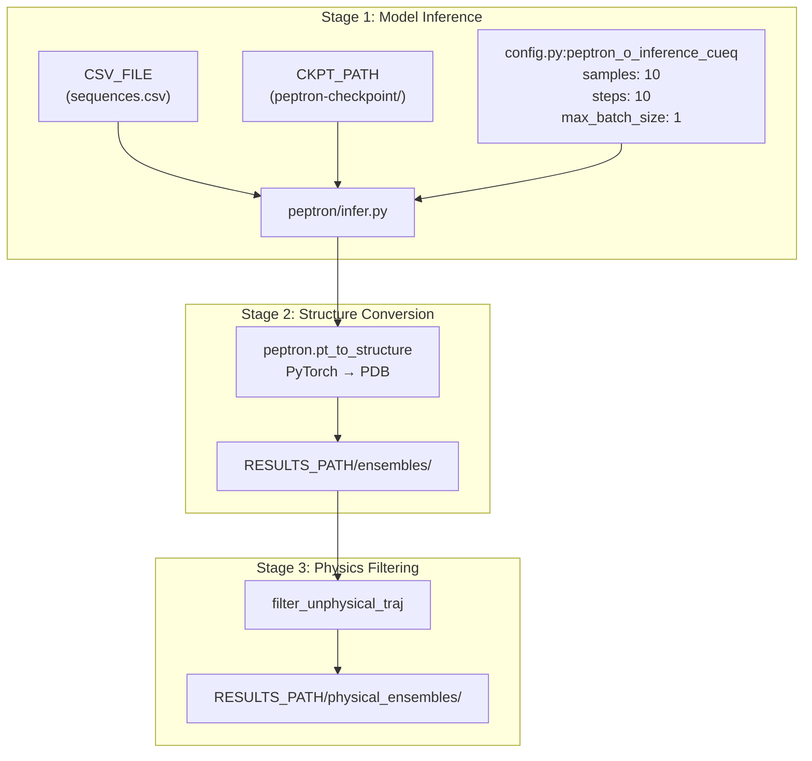

# Overview

> **Relevant source files**
> * [README.md](https://github.com/PeptoneLtd/PepTron/blob/8123ab15/README.md?plain=1)
> * [assets/peptron.gif](https://github.com/PeptoneLtd/PepTron/blob/8123ab15/assets/peptron.gif)

## Purpose and Scope

This page provides a high-level introduction to PepTron, its architecture, and core components. It explains what PepTron is, how its major subsystems interact, and the two operational modes (training and inference). For detailed setup instructions, see [Installation and Environment Setup](/PeptoneLtd/PepTron/2.1-installation-and-environment-setup). For immediate hands-on usage, see [Quick Start: Running Inference](/PeptoneLtd/PepTron/2.2-quick-start:-running-inference).

**Sources:** [README.md L1-L13](https://github.com/PeptoneLtd/PepTron/blob/8123ab15/README.md?plain=1#L1-L13)

---

## What is PepTron?

PepTron is a sequence-to-ensemble generative model designed to predict protein structure ensembles across the full spectrum of protein disorder. Unlike single-structure prediction models, PepTron generates multiple conformations that represent the structural heterogeneity of proteins, making it particularly suited for:

* **Intrinsically Disordered Proteins (IDPs)**: Proteins lacking stable tertiary structure
* **Multi-domain Proteins**: Proteins with both structured and disordered regions
* **Flexible Proteins**: Proteins exhibiting conformational dynamics

The system implements a diffusion-based generative model that accepts protein sequences as input and produces conformational ensembles as output. The model is trained on a mixture of structured proteins from the Protein Data Bank (PDB) and disordered protein ensembles from IDRome-o.

**Sources:** [README.md L7-L10](https://github.com/PeptoneLtd/PepTron/blob/8123ab15/README.md?plain=1#L7-L10)

 [README.md L227-L234](https://github.com/PeptoneLtd/PepTron/blob/8123ab15/README.md?plain=1#L227-L234)

---

## System Architecture Overview

### High-Level Component Structure



**Diagram: PepTron System Architecture with Code Entities**

The system is organized around two primary execution modes (`peptron/train.py` and `peptron/infer.py`), both controlled by a centralized configuration system (`peptron/model/config.py`). Data preparation scripts in the `dataprep/` directory transform raw biological data into training-ready formats. The entire system runs within a Docker container defined by the `Dockerfile`.

**Sources:** [README.md L14-L26](https://github.com/PeptoneLtd/PepTron/blob/8123ab15/README.md?plain=1#L14-L26)

 [README.md L36-L73](https://github.com/PeptoneLtd/PepTron/blob/8123ab15/README.md?plain=1#L36-L73)

 [README.md L75-L173](https://github.com/PeptoneLtd/PepTron/blob/8123ab15/README.md?plain=1#L75-L173)

---

## Core Components

### Configuration System

The `peptron/model/config.py` file serves as the single source of truth for all system parameters. It defines configuration dictionaries for different operational modes:

| Configuration | Purpose | Referenced By |
| --- | --- | --- |
| `peptron_o_inference_cueq` | Inference with cuEquivariance backend | `peptron/infer.py:45` |
| `peptron_o_mixed` | Training on mixed PDB/IDRome-o data | `peptron/train.py:112` |

The configuration system uses the `config_flags.DEFINE_config_file()` pattern to load parameters at runtime.

**Sources:** [README.md L41-L46](https://github.com/PeptoneLtd/PepTron/blob/8123ab15/README.md?plain=1#L41-L46)

 [README.md L108-L113](https://github.com/PeptoneLtd/PepTron/blob/8123ab15/README.md?plain=1#L108-L113)

### Model Checkpoints

PepTron provides two checkpoint variants, each serving distinct use cases:

| Checkpoint | Training Data | Use Case | Zenodo Location |
| --- | --- | --- | --- |
| `PepTron-base` | PDB only (structured) | Structure-focused applications, transfer learning base | `zenodo.org/records/17306061` |
| `PepTron` | PDB + IDRome-o (mixed) | General-purpose ensemble prediction across disorder spectrum | `zenodo.org/records/17306061` |

The relationship between checkpoints follows a two-stage training lineage: `PepTron-base` is first trained on structured proteins, then fine-tuned with disordered protein data to produce `PepTron`.

**Sources:** [README.md L28-L34](https://github.com/PeptoneLtd/PepTron/blob/8123ab15/README.md?plain=1#L28-L34)

 [README.md L57-L62](https://github.com/PeptoneLtd/PepTron/blob/8123ab15/README.md?plain=1#L57-L62)

### Execution Environment

The system requires a specific environment stack:



**Diagram: Environment and Execution Stack**

The `Dockerfile` builds on NVIDIA BioNeMo 2.3 and installs precise dependency versions. Shell scripts (`run_peptron_*.sh`) orchestrate execution within the container environment with GPU access.

**Sources:** [README.md L14-L26](https://github.com/PeptoneLtd/PepTron/blob/8123ab15/README.md?plain=1#L14-L26)

 [README.md L216-L217](https://github.com/PeptoneLtd/PepTron/blob/8123ab15/README.md?plain=1#L216-L217)

---

## System Modes

### Training Mode

Training mode (`peptron/train.py`) implements a multi-dataset training pipeline:



**Diagram: Training Mode Data Flow**

Key characteristics:

* **Data Mixing**: 30% PDB (structured) / 70% IDRome-o (disordered) via `dataset_prob_pdb` and `dataset_prob_idp` parameters
* **Transfer Learning**: Encoder frozen (`encoder_frozen: True`) while structure head trains (`structure_frozen: False`)
* **Temporal Validation**: Uses `train_clusters` with `train_cutoff: "2020-05-01"` to prevent data leakage

**Sources:** [README.md L75-L173](https://github.com/PeptoneLtd/PepTron/blob/8123ab15/README.md?plain=1#L75-L173)

 [README.md L154-L162](https://github.com/PeptoneLtd/PepTron/blob/8123ab15/README.md?plain=1#L154-L162)

### Inference Mode

Inference mode (`peptron/infer.py`) generates protein ensembles through a three-stage pipeline:



**Diagram: Inference Mode Pipeline Stages**

Key parameters:

* `samples`: Number of conformations per ensemble (default: 10)
* `steps`: Diffusion denoising steps (default: 10)
* `max_batch_size`: Parallel structure generation (default: 1, GPU memory dependent)
* `num_gpus`: GPU allocation for inference (default: 1)

**Sources:** [README.md L36-L73](https://github.com/PeptoneLtd/PepTron/blob/8123ab15/README.md?plain=1#L36-L73)

 [README.md L175-L190](https://github.com/PeptoneLtd/PepTron/blob/8123ab15/README.md?plain=1#L175-L190)

---

## Data Preparation Pipeline

The `dataprep/` directory contains scripts that transform raw biological data into training-ready formats:

| Script | Input | Output | Purpose |
| --- | --- | --- | --- |
| `unpack_mmcif.py` | PDB mmCIF files | NPZ + `pdb_mmcif.csv` | Structure preprocessing |
| `prep_idrome.py` | IDRome-o trajectories | NPZ + split CSVs | Ensemble preprocessing |
| `cluster_chains.py` | `pdb_mmcif.csv` | `pdb_clusters` (40% similarity) | Train/val splitting |
| `add_msa_train_info.py` | OpenProteinSet | `pdb_mmcif_msa.csv` | MSA indexing for training |
| `add_msa_val_info.py` | Generated MSAs | `cameo2022_msa.csv` | MSA indexing for validation |

The pipeline must be executed before training. For detailed instructions, see [Data Preparation Pipeline](/PeptoneLtd/PepTron/4-data-preparation-pipeline).

**Sources:** [README.md L77-L107](https://github.com/PeptoneLtd/PepTron/blob/8123ab15/README.md?plain=1#L77-L107)

---

## Technology Stack

### Key Dependencies

| Component | Version/Source | Purpose |
| --- | --- | --- |
| NVIDIA BioNeMo | 2.3 | Base framework for biological AI |
| cuequivariance | 0.6.1 | Equivariant neural network operations |
| OpenFold | `nv_upstream_trt_cuequivariance` branch | Protein structure modeling components |
| triton | 3.3.0 | GPU kernel optimization |
| PyTorch | (via BioNeMo) | Deep learning backend |
| NeMo | (via BioNeMo) | Distributed training framework |

### ESM2 Integration

PepTron integrates ESM2 components for sequence processing. These are located in the `esm2/` directory and provide:

* `esm2/model.py`: ESM2 model architecture components
* `esm2/data.py`: Data loading utilities
* `esm2/tokenizer.py`: Sequence tokenization

For details on ESM2 integration, see [ESM2 Module](/PeptoneLtd/PepTron/7-esm2-module).

**Sources:** [README.md L216-L217](https://github.com/PeptoneLtd/PepTron/blob/8123ab15/README.md?plain=1#L216-L217)

---

## Input/Output Specifications

### Input Format

Inference accepts CSV files with two required columns:

```
name,seqresprotein1,MKTAYIAKQRQISFVKSHFSRQLEERLGLIEVQAprotein2,MSHHWGYGKHNGPEHWHKDFPIAKGERQSPVDID
```

**Sources:** [README.md L50-L55](https://github.com/PeptoneLtd/PepTron/blob/8123ab15/README.md?plain=1#L50-L55)

### Output Format

The inference pipeline produces two output directories:

1. **`results_path/ensembles/`**: Raw ensemble predictions (PDB format) * Contains all generated conformations * File naming: `{protein_name}_{ensemble_id}.pdb`
2. **`results_path/physical_ensembles/`**: Filtered ensembles (PDB format) * Contains only physically valid conformations * Same naming convention as raw ensembles

For detailed output interpretation, see [Output Format and Interpretation](/PeptoneLtd/PepTron/6.3-output-format-and-interpretation).

**Sources:** [README.md L64-L73](https://github.com/PeptoneLtd/PepTron/blob/8123ab15/README.md?plain=1#L64-L73)

---

## Quick Reference: Key File Locations

| Component | File Path | Description |
| --- | --- | --- |
| Training Script | `peptron/train.py` | Main training entry point |
| Inference Script | `peptron/infer.py` | Main inference entry point |
| Configuration | `peptron/model/config.py` | All system parameters |
| Docker Definition | `Dockerfile` | Container build specification |
| Training Orchestration | `run_peptron_train.sh` | Single-node training script |
| Distributed Training | `run_peptron_distributed_train.sh` | Multi-node training script |
| Inference Orchestration | `run_peptron_infer.sh` | Inference execution script |
| PDB Processing | `dataprep/unpack_mmcif.py` | PDB data preparation |
| IDRome-o Processing | `dataprep/prep_idrome.py` | Disorder data preparation |
| Chain Clustering | `dataprep/cluster_chains.py` | Sequence similarity clustering |
| Training Split | `splits/pdb_chains_msa.csv` | PDB training chains |
| Validation Split | `splits/cameo2022_msa.csv` | PDB validation chains |
| IDRome-o Training | `splits/IDRome_DB-train-msa.csv` | IDP training chains |
| IDRome-o Validation | `splits/IDRome_DB-val-msa.csv` | IDP validation chains |

**Sources:** [README.md L1-L263](https://github.com/PeptoneLtd/PepTron/blob/8123ab15/README.md?plain=1#L1-L263)