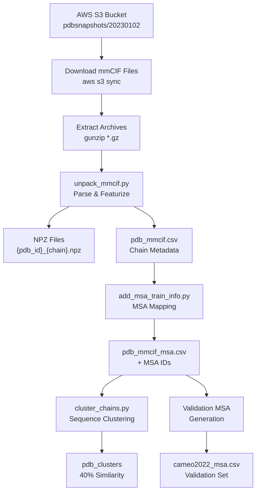
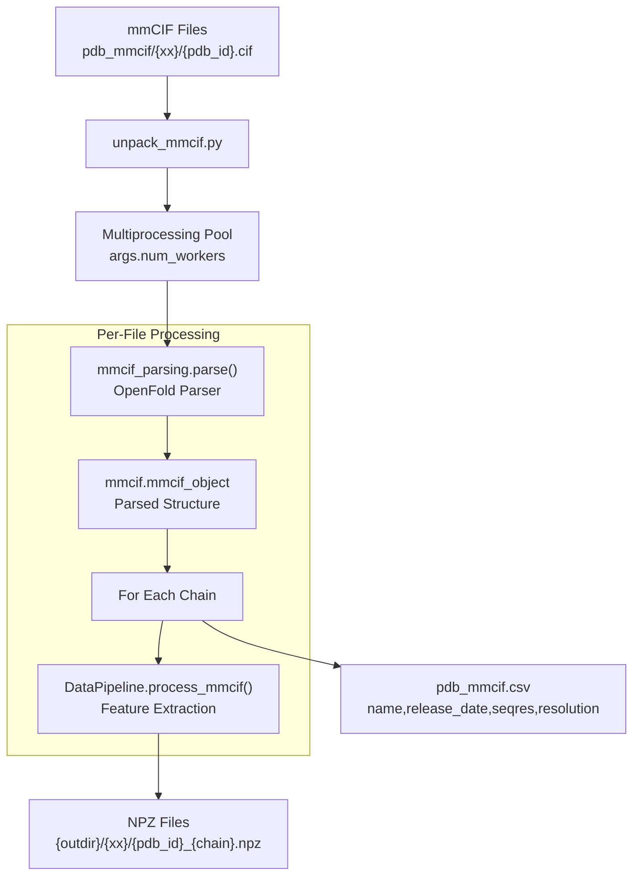
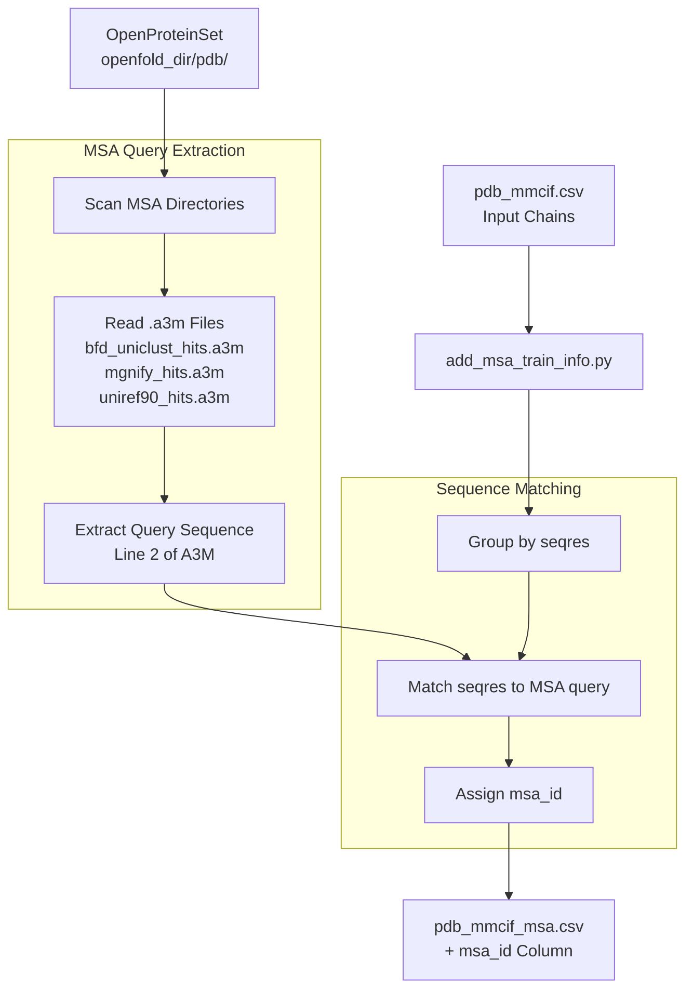
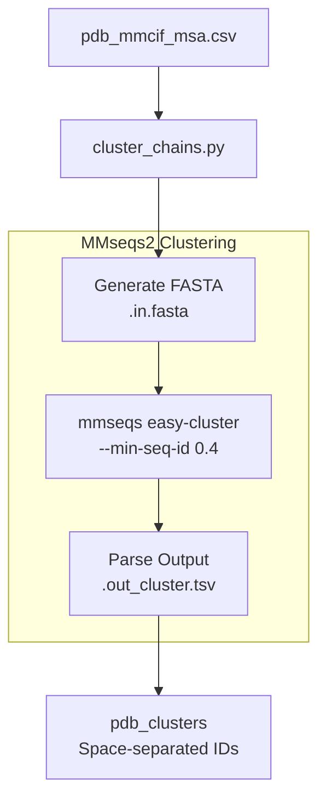
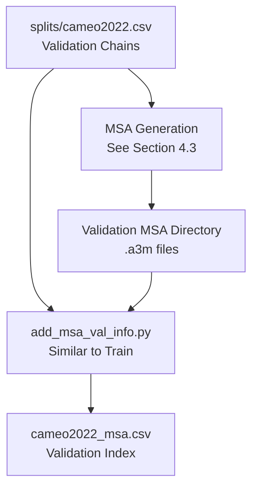
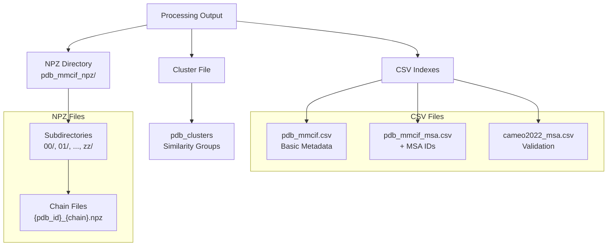
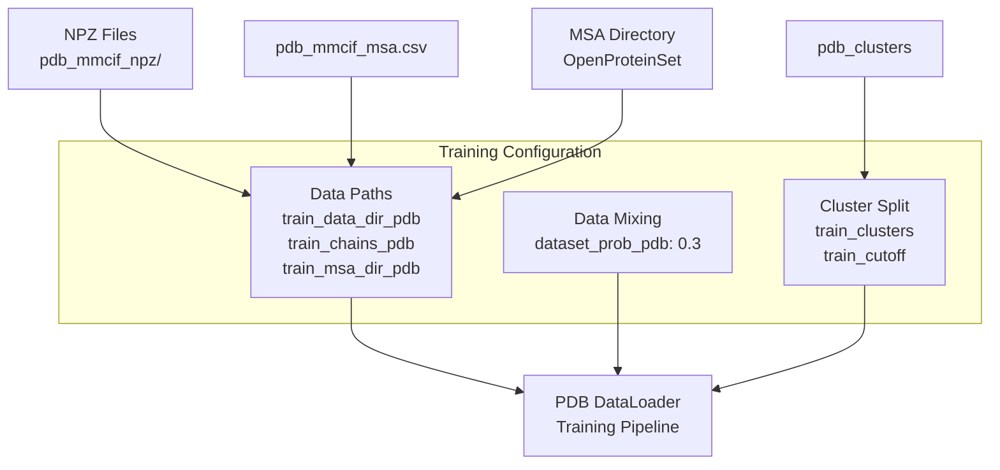

# PDB Dataset Processing

> **Relevant source files**
> * [README.md](https://github.com/PeptoneLtd/PepTron/blob/8123ab15/README.md?plain=1)
> * [dataprep/add_msa_train_info.py](https://github.com/PeptoneLtd/PepTron/blob/8123ab15/dataprep/add_msa_train_info.py)
> * [dataprep/cluster_chains.py](https://github.com/PeptoneLtd/PepTron/blob/8123ab15/dataprep/cluster_chains.py)
> * [dataprep/unpack_mmcif.py](https://github.com/PeptoneLtd/PepTron/blob/8123ab15/dataprep/unpack_mmcif.py)

## Purpose and Scope

This document describes the processing pipeline for converting PDB mmCIF files into training-ready data for PepTron. The pipeline downloads structural data from AWS S3, extracts protein chain information, generates feature representations, and creates metadata indexes with MSA mappings. This processed data serves as the structured protein component of PepTron's training data.

For information about processing disordered protein data, see [IDRome-o Dataset Processing](/PeptoneLtd/PepTron/4.2-idrome-o-dataset-processing). For MSA generation procedures, see [Multiple Sequence Alignment (MSA) Generation](/PeptoneLtd/PepTron/4.3-multiple-sequence-alignment-(msa)-generation).

---

## Pipeline Overview

The PDB dataset processing pipeline transforms raw mmCIF crystallographic structure files into NPZ feature files suitable for PepTron training. The pipeline consists of six sequential stages that prepare both the structural data and metadata necessary for training.

### PDB Processing Pipeline Flow



**Sources:** [README.md L81-L94](https://github.com/PeptoneLtd/PepTron/blob/8123ab15/README.md?plain=1#L81-L94)

 [dataprep/unpack_mmcif.py](https://github.com/PeptoneLtd/PepTron/blob/8123ab15/dataprep/unpack_mmcif.py)

---

## Stage 1: Download mmCIF Files

PepTron uses the PDB snapshot from January 2, 2023 hosted on AWS S3. The mmCIF (macromolecular Crystallographic Information File) format contains atomic coordinates, experimental metadata, and sequence information.

### Download Command

```
aws s3 sync --no-sign-request \  s3://pdbsnapshots/20230102/pub/pdb/data/structures/divided/mmCIF \  pdb_mmcif
```

### Directory Structure

The downloaded files are organized in a two-letter subdirectory structure:

```
pdb_mmcif/
├── 00/
│   ├── 100d.cif.gz
│   ├── 200d.cif.gz
│   └── ...
├── 01/
│   ├── 101m.cif.gz
│   └── ...
└── ...
```

**Sources:** [README.md L85](https://github.com/PeptoneLtd/PepTron/blob/8123ab15/README.md?plain=1#L85-L85)

---

## Stage 2: Extract Compressed Files

After downloading, all gzipped mmCIF files must be extracted:

```
find pdb_mmcif -name '*.gz' | xargs gunzip
```

This produces uncompressed `.cif` files in the same directory structure.

**Sources:** [README.md L86](https://github.com/PeptoneLtd/PepTron/blob/8123ab15/README.md?plain=1#L86-L86)

---

## Stage 3: Preprocess Chains with unpack_mmcif.py

The `unpack_mmcif.py` script is the core processing component that parses mmCIF files, extracts individual protein chains, computes features, and saves them in NPZ format.

### Processing Architecture



**Sources:** [dataprep/unpack_mmcif.py L1-L73](https://github.com/PeptoneLtd/PepTron/blob/8123ab15/dataprep/unpack_mmcif.py#L1-L73)

### Command-Line Interface

| Parameter | Type | Required | Default | Description |
| --- | --- | --- | --- | --- |
| `--mmcif_dir` | str | Yes | - | Directory containing downloaded mmCIF files |
| `--outdir` | str | No | `./data` | Output directory for NPZ files |
| `--outcsv` | str | No | `./pdb_mmcif.csv` | Output CSV index file |
| `--num_workers` | int | No | `15` | Number of parallel worker processes |

**Sources:** [dataprep/unpack_mmcif.py L3-L8](https://github.com/PeptoneLtd/PepTron/blob/8123ab15/dataprep/unpack_mmcif.py#L3-L8)

### Execution Example

```
python -m dataprep.unpack_mmcif \  --mmcif_dir /path/to/pdb_mmcif \  --outdir /path/to/pdb_mmcif_npz \  --num_workers 32
```

### Processing Logic

The `unpack_mmcif()` function [dataprep/unpack_mmcif.py L38-L70](https://github.com/PeptoneLtd/PepTron/blob/8123ab15/dataprep/unpack_mmcif.py#L38-L70)

 performs the following for each mmCIF file:

1. **Parse mmCIF**: Uses `mmcif_parsing.parse()` from OpenFold to read structure data
2. **Chain Extraction**: Iterates over `mmcif.chain_to_seqres` to process each chain independently
3. **Metadata Collection**: Extracts `name`, `release_date`, `seqres`, `resolution` for each chain
4. **Feature Generation**: Calls `pipeline.process_mmcif()` to compute structural features
5. **Save NPZ**: Writes features to `{outdir}/{xx}/{pdb_id}_{chain}.npz`
6. **Build Index**: Aggregates metadata into a DataFrame for CSV output

### NPZ File Contents

Each NPZ file contains processed features from the `DataPipeline` class. The exact fields depend on the pipeline configuration but typically include:

* Atomic coordinates
* Sequence information
* Structural features
* Chain metadata

**Sources:** [dataprep/unpack_mmcif.py L62-L67](https://github.com/PeptoneLtd/PepTron/blob/8123ab15/dataprep/unpack_mmcif.py#L62-L67)

### CSV Index Format

The output CSV file `pdb_mmcif.csv` contains one row per chain:

| Column | Type | Description |
| --- | --- | --- |
| `name` | str | Chain identifier `{pdb_id}_{chain}` (index) |
| `release_date` | str | PDB release date |
| `seqres` | str | Amino acid sequence |
| `resolution` | float | Structure resolution in Ångströms |

**Sources:** [dataprep/unpack_mmcif.py L56-L61](https://github.com/PeptoneLtd/PepTron/blob/8123ab15/dataprep/unpack_mmcif.py#L56-L61)

---

## Stage 4: Add MSA Information with add_msa_train_info.py

This script augments the chain metadata with MSA identifiers by matching sequences to the OpenProteinSet MSA database. The resulting CSV enables efficient MSA lookup during training.

### MSA Matching Architecture



**Sources:** [dataprep/add_msa_train_info.py L1-L59](https://github.com/PeptoneLtd/PepTron/blob/8123ab15/dataprep/add_msa_train_info.py#L1-L59)

### Command-Line Interface

| Parameter | Type | Required | Default | Description |
| --- | --- | --- | --- | --- |
| `--openfold_dir` | str | Yes | - | Path to OpenProteinSet directory |
| `--incsv` | str | No | `pdb_chains.csv` | Input chain metadata CSV |
| `--outcsv` | str | No | `pdb_chains_msa.csv` | Output CSV with MSA IDs |

**Sources:** [dataprep/add_msa_train_info.py L6-L10](https://github.com/PeptoneLtd/PepTron/blob/8123ab15/dataprep/add_msa_train_info.py#L6-L10)

### Execution Example

```
python -m dataprep.add_msa_train_info \  --openfold_dir /path/to/openfold \  --incsv pdb_mmcif.csv \  --outcsv pdb_mmcif_msa.csv
```

### Matching Logic

The script implements a sequence-based matching algorithm [dataprep/add_msa_train_info.py L30-L54](https://github.com/PeptoneLtd/PepTron/blob/8123ab15/dataprep/add_msa_train_info.py#L30-L54)

:

1. **Load MSA Queries**: Read query sequences from OpenProteinSet A3M files
2. **Group Chains**: Group input chains by `seqres`
3. **Find Candidates**: Filter chains where `name` exists in MSA directory
4. **Verify Match**: Compare `seqres` with MSA query sequence
5. **Assign ID**: Set `msa_id` for matching chains
6. **Handle Duplicates**: Resolve cases where multiple chains match

### A3M File Priority

The script searches for MSA files in priority order [dataprep/add_msa_train_info.py L16-L23](https://github.com/PeptoneLtd/PepTron/blob/8123ab15/dataprep/add_msa_train_info.py#L16-L23)

:

1. `bfd_uniclust_hits.a3m` (preferred)
2. `mgnify_hits.a3m`
3. `uniref90_hits.a3m`

The first existing file is used for each PDB entry.

**Sources:** [dataprep/add_msa_train_info.py L12-L26](https://github.com/PeptoneLtd/PepTron/blob/8123ab15/dataprep/add_msa_train_info.py#L12-L26)

---

## Stage 5: Cluster Chains with cluster_chains.py

Sequence clustering creates train/validation splits based on similarity, preventing data leakage where similar sequences appear in both sets. The default 40% sequence identity threshold ensures adequate separation.

### Clustering Architecture



**Sources:** [dataprep/cluster_chains.py L1-L39](https://github.com/PeptoneLtd/PepTron/blob/8123ab15/dataprep/cluster_chains.py#L1-L39)

### Command-Line Interface

| Parameter | Type | Required | Default | Description |
| --- | --- | --- | --- | --- |
| `--chains` | str | No | `pdb_mmcif.csv` | Input chain metadata CSV |
| `--out` | str | No | `pdb_clusters` | Output cluster file |
| `--thresh` | float | No | `0.4` | Sequence identity threshold (40%) |
| `--mmseqs_path` | str | No | `mmseqs` | Path to MMseqs2 binary |

**Sources:** [dataprep/cluster_chains.py L3-L8](https://github.com/PeptoneLtd/PepTron/blob/8123ab15/dataprep/cluster_chains.py#L3-L8)

### Execution Example

```
python -m dataprep.cluster_chains \  --chains pdb_mmcif_msa.csv \  --out pdb_clusters \  --thresh 0.4
```

### Clustering Process

The clustering workflow [dataprep/cluster_chains.py L16-L35](https://github.com/PeptoneLtd/PepTron/blob/8123ab15/dataprep/cluster_chains.py#L16-L35)

:

1. **Read Chains**: Load chain metadata from CSV
2. **Generate FASTA**: Convert sequences to FASTA format with chain names as IDs
3. **Run MMseqs2**: Execute `mmseqs easy-cluster` with alignment mode 1
4. **Parse Results**: Read `.out_cluster.tsv` containing representative-member pairs
5. **Format Output**: Write space-separated cluster members, one cluster per line
6. **Cleanup**: Remove temporary files

### Cluster File Format

The output file contains one line per cluster with space-separated chain names:

```
1abc_A 1def_A 2ghi_B
2jkl_A 3mno_C
...
```

Each line represents a cluster at 40% sequence identity. The first name is the cluster representative.

**Sources:** [dataprep/cluster_chains.py L23-L35](https://github.com/PeptoneLtd/PepTron/blob/8123ab15/dataprep/cluster_chains.py#L23-L35)

---

## Stage 6: Validation MSA Generation

The validation set uses proteins from CAMEO 2022 for temporal separation from training data. MSAs must be generated specifically for these validation chains.

### Validation Set Processing



**Sources:** [README.md L94](https://github.com/PeptoneLtd/PepTron/blob/8123ab15/README.md?plain=1#L94-L94)

### Validation Configuration

The validation dataset serves two purposes:

1. **Temporal Split**: CAMEO 2022 structures ensure no training data contamination
2. **Performance Monitoring**: Track generalization to recent structures during training

The validation MSA generation follows the same procedures as training data (see [Multiple Sequence Alignment (MSA) Generation](/PeptoneLtd/PepTron/4.3-multiple-sequence-alignment-(msa)-generation)) but uses the `splits/cameo2022.csv` chain list.

**Sources:** [README.md L148](https://github.com/PeptoneLtd/PepTron/blob/8123ab15/README.md?plain=1#L148-L148)

---

## Output Artifacts

The PDB processing pipeline produces several output artifacts used throughout PepTron training:

### File Structure Overview



**Sources:** [dataprep/unpack_mmcif.py L64-L67](https://github.com/PeptoneLtd/PepTron/blob/8123ab15/dataprep/unpack_mmcif.py#L64-L67)

 [dataprep/add_msa_train_info.py L57](https://github.com/PeptoneLtd/PepTron/blob/8123ab15/dataprep/add_msa_train_info.py#L57-L57)

 [dataprep/cluster_chains.py L32-L35](https://github.com/PeptoneLtd/PepTron/blob/8123ab15/dataprep/cluster_chains.py#L32-L35)

### Artifact Details

| Artifact | Location | Format | Purpose |
| --- | --- | --- | --- |
| NPZ Files | `{outdir}/{xx}/{pdb_id}_{chain}.npz` | NumPy Archive | Preprocessed structural features |
| Chain Index | `pdb_mmcif.csv` | CSV | Chain metadata (name, date, sequence, resolution) |
| MSA Index | `pdb_mmcif_msa.csv` | CSV | Chain metadata + `msa_id` for MSA lookup |
| Clusters | `pdb_clusters` | Text | Sequence similarity clusters at 40% identity |
| Validation Index | `cameo2022_msa.csv` | CSV | CAMEO 2022 validation chains with MSA IDs |

### Usage in Training

These artifacts are referenced in the training configuration [README.md L141-L148](https://github.com/PeptoneLtd/PepTron/blob/8123ab15/README.md?plain=1#L141-L148)

:

```
"training": {    "train_data_dir_pdb": "/path/to/pdb_mmcif_npz_dir",    "val_data_dir_pdb": "/path/to/pdb_mmcif_npz_dir",     "train_msa_dir_pdb": "/path/to/pdb_msa_dir",    "val_msa_dir_pdb": "/path/to/cameo2022_msa_dir",    "train_chains_pdb": "splits/pdb_chains_msa.csv",    "valid_chains_pdb": "splits/cameo2022_msa.csv",    "train_clusters": "/path/to/pdb_clusters",    "train_cutoff": "2020-05-01",}
```

**Sources:** [README.md L141-L158](https://github.com/PeptoneLtd/PepTron/blob/8123ab15/README.md?plain=1#L141-L158)

---

## Configuration and Parameters

### Storage Requirements

The PDB processing pipeline requires substantial storage:

| Component | Approximate Size | Description |
| --- | --- | --- |
| mmCIF Files (compressed) | ~50 GB | Downloaded from S3 |
| mmCIF Files (uncompressed) | ~180 GB | After extraction |
| NPZ Files | ~200 GB | Processed features |
| MSA Files | Variable | Depends on MSA source |

### Performance Tuning

The `--num_workers` parameter in `unpack_mmcif.py` controls parallelization:

* **Low (1-8)**: Suitable for limited memory systems
* **Medium (16-32)**: Recommended for workstations with 64+ GB RAM
* **High (32+)**: For high-memory servers

Each worker process loads mmCIF files into memory, so monitor RAM usage during processing.

**Sources:** [dataprep/unpack_mmcif.py L24-L28](https://github.com/PeptoneLtd/PepTron/blob/8123ab15/dataprep/unpack_mmcif.py#L24-L28)

### Error Handling

The pipeline includes error handling for common issues:

* **Parse Failures**: Chains that cannot be parsed are skipped with a log message [dataprep/unpack_mmcif.py L48-L50](https://github.com/PeptoneLtd/PepTron/blob/8123ab15/dataprep/unpack_mmcif.py#L48-L50)
* **MSA Mismatches**: Sequences that don't match MSA queries are logged [dataprep/add_msa_train_info.py L46-L54](https://github.com/PeptoneLtd/PepTron/blob/8123ab15/dataprep/add_msa_train_info.py#L46-L54)
* **Missing Files**: The script continues processing if individual files are missing

### Temporal Filtering

The `train_cutoff` parameter enables temporal split of training data:

```
"train_cutoff": "2020-05-01"
```

This ensures all training structures were released before May 1, 2020, preventing contamination with validation data from CAMEO 2022.

**Sources:** [README.md L157](https://github.com/PeptoneLtd/PepTron/blob/8123ab15/README.md?plain=1#L157-L157)

---

## Integration with Training Pipeline

The PDB dataset processing outputs integrate with PepTron's training data loaders. The training configuration uses the processed artifacts to construct mixed datasets combining PDB and IDRome-o data at a 30:70 ratio.

### Data Flow to Training



**Sources:** [README.md L141-L158](https://github.com/PeptoneLtd/PepTron/blob/8123ab15/README.md?plain=1#L141-L158)

For detailed information about the training pipeline and data mixing strategy, see [Data Mixing Strategy](/PeptoneLtd/PepTron/5.2-data-mixing-strategy).