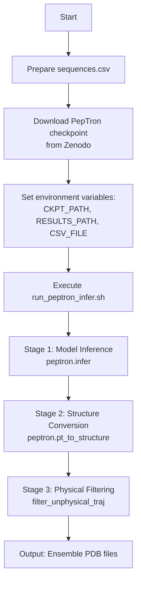
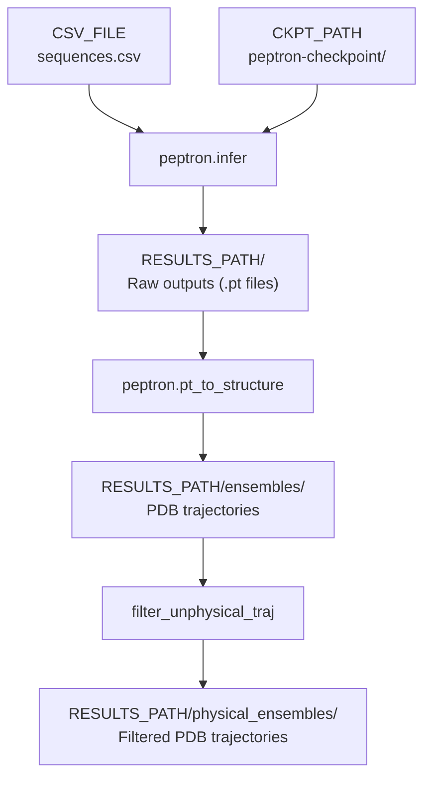
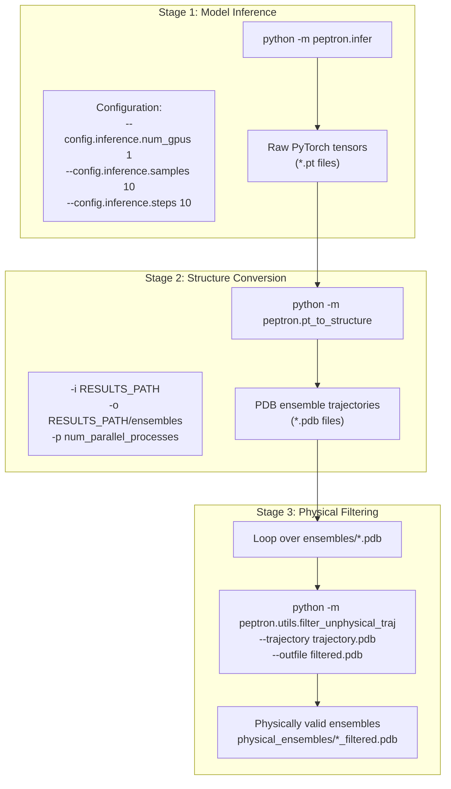

# Quick Start: Running Inference

> **Relevant source files**
> - [README\.md](https://github.com/PeptoneLtd/PepTron/blob/8123ab15/README.md?plain=1)
> - [run\_peptron\_infer\.sh](https://github.com/PeptoneLtd/PepTron/blob/8123ab15/run_peptron_infer.sh)

 This page provides a minimal example to get users generating protein structure ensembles immediately using PepTron's inference pipeline\. It covers the essential steps from preparing input sequences to obtaining predicted structure ensembles\.

 For detailed installation instructions, see [Installation and Environment Setup](https://deepwiki.com/PeptoneLtd/PepTron/2.1-installation-and-environment-setup)\. For comprehensive inference configuration options and advanced usage, see [Inference](https://deepwiki.com/PeptoneLtd/PepTron/6-inference)\.

---

## Purpose and Scope

 This quick start guide walks through the end\-to\-end process of running inference with PepTron in approximately 5\-10 minutes\. It covers:

 - Preparing a CSV input file with protein sequences
- Downloading and configuring a pre\-trained checkpoint
- Executing the inference pipeline
- Understanding the generated output files

 This guide uses default parameters optimized for general use\. For parameter tuning, distributed inference, or batch processing strategies, refer to [Inference Configuration](https://deepwiki.com/PeptoneLtd/PepTron/6.1-inference-configuration)\.

---

## Prerequisites

 Before running inference, ensure you have:

| Requirement | Reference |
| --- | --- |
| Docker container built and running | Installation and Environment Setup |
| GPU\-enabled environment | docker run \-\-gpus all flag |
| Pre\-trained checkpoint downloaded | Available at Zenodo |

 **Sources:** [README\.md?plain=1 L14-L26](https://github.com/PeptoneLtd/PepTron/blob/8123ab15/README.md?plain=1#L14-L26)

---

## Quick Start Workflow



 **Workflow Description:** The inference process follows a linear pipeline with three distinct stages\. Users prepare input, configure paths, and execute a single script that orchestrates all stages automatically\.

 **Sources:** [README\.md?plain=1 L35-L73](https://github.com/PeptoneLtd/PepTron/blob/8123ab15/README.md?plain=1#L35-L73) [run\_peptron\_infer\.sh L1-L40](https://github.com/PeptoneLtd/PepTron/blob/8123ab15/run_peptron_infer.sh#L1-L40)

---

## Step 1: Prepare Input CSV

 Create a CSV file containing protein sequences in the following format:

```
name,seqresprotein1,MKTAYIAKQRQISFVKSHFSRQLEERLGLIEVQAprotein2,MSHHWGYGKHNGPEHWHKDFPIAKGERQSPVDID
```

### CSV Format Specification

| Column | Description | Requirements |
| --- | --- | --- |
| name | Unique identifier for the protein | Alphanumeric, no spaces recommended |
| seqres | Amino acid sequence | Standard single\-letter amino acid codes |

 **Important Constraints:**

 - The `num_gpus` parameter must be ≤ the number of sequences in the CSV file
- Each sequence will be processed independently
- Sequence length affects memory requirements \(see [Inference Configuration](https://deepwiki.com/PeptoneLtd/PepTron/6.1-inference-configuration)\)

 **Sources:** [README\.md?plain=1 L48-L55](https://github.com/PeptoneLtd/PepTron/blob/8123ab15/README.md?plain=1#L48-L55)

---

## Step 2: Download and Prepare Checkpoint

### Obtaining the Checkpoint

 1. Download `PepTron.tar.gz` from [Zenodo](https://zenodo.org/records/17306061)
2. Extract the archive:  ``` tar -xzf PepTron.tar.gz ```
3. The extracted `peptron-checkpoint` directory contains the model weights

### Checkpoint Selection

| Checkpoint | Use Case | Reference |
| --- | --- | --- |
| PepTron | Recommended: Full proteome including disordered regions | Model Checkpoints |
| PepTron\-base | Structured proteins only \(PDB pre\-trained\) | Model Checkpoints |

 For this quick start, use the `PepTron` checkpoint for best general performance\.

 **Sources:** [README\.md?plain=1 L28-L34](https://github.com/PeptoneLtd/PepTron/blob/8123ab15/README.md?plain=1#L28-L34) [README\.md?plain=1 L57-L62](https://github.com/PeptoneLtd/PepTron/blob/8123ab15/README.md?plain=1#L57-L62)

---

## Step 3: Configure Execution Paths

 Edit the environment variables in `run_peptron_infer.sh`:

```
CKPT_PATH="/path/to/the/peptron-checkpoint"RESULTS_PATH="/path/to/results"CSV_FILE="/path/to/sequences.csv"
```

### Path Configuration Reference



 **Diagram Description:** This diagram maps the file paths referenced in the execution script to the code modules that consume and produce them, showing the data flow through the inference pipeline\.

 **Sources:** [run\_peptron\_infer\.sh L12-L14](https://github.com/PeptoneLtd/PepTron/blob/8123ab15/run_peptron_infer.sh#L12-L14) [run\_peptron\_infer\.sh L16-L39](https://github.com/PeptoneLtd/PepTron/blob/8123ab15/run_peptron_infer.sh#L16-L39)

---

## Step 4: Execute Inference Pipeline

 Run the inference script:

```
sh run_peptron_infer.sh
```

 This script executes three sequential stages automatically\.

### Inference Pipeline Stages



 **Diagram Description:** The three\-stage pipeline transforms raw model outputs into validated protein structure ensembles\. Each stage is implemented as a separate Python module with specific input/output requirements\.

 **Sources:** [run\_peptron\_infer\.sh L16-L39](https://github.com/PeptoneLtd/PepTron/blob/8123ab15/run_peptron_infer.sh#L16-L39)

---

## Stage Details

### Stage 1: Model Inference \(`peptron.infer`\)

 Executes the diffusion model to generate ensemble conformations\.

 **Key Parameters:**

| Parameter | Default | Description |
| --- | --- | --- |
| num\_gpus | 1 | Number of GPUs to use for parallel inference |
| max\_batch\_size | 1 | Structures generated in parallel per ensemble |
| samples | 10 | Number of conformations per ensemble |
| steps | 10 | Diffusion denoising steps |
| num\_workers | 8 | Data loading workers |

 **Configuration Reference:** The default configuration is specified at [infer\.py L44-L45](https://github.com/PeptoneLtd/PepTron/blob/8123ab15/peptron/infer.py#L44-L45) using:

```
EXEC_CONFIG = config_flags.DEFINE_config_file(    'config', 'peptron/model/config.py:peptron_o_inference_cueq')
```

 **Output:** PyTorch tensor files \(`.pt`\) in `RESULTS_PATH/`

 **Sources:** [run\_peptron\_infer\.sh L16-L25](https://github.com/PeptoneLtd/PepTron/blob/8123ab15/run_peptron_infer.sh#L16-L25) [README\.md?plain=1 L42-L46](https://github.com/PeptoneLtd/PepTron/blob/8123ab15/README.md?plain=1#L42-L46)

---

### Stage 2: Structure Conversion \(`peptron.pt_to_structure`\)

 Converts PyTorch tensors to standard PDB format using parallel processing\.

 **Execution:**

```
python -m peptron.pt_to_structure \    -i "$RESULTS_PATH" \    -o "$RESULTS_PATH/ensembles" \    -p $(($(nproc) / 2))
```

 **Parameters:**

 - `-i`: Input directory containing `.pt` files
- `-o`: Output directory for PDB trajectories
- `-p`: Number of parallel processes \(default: half of available CPUs\)

 **Output:** Multi\-model PDB files in `RESULTS_PATH/ensembles/`, where each file contains all ensemble conformations for a single protein\.

 **Sources:** [run\_peptron\_infer\.sh L27-L29](https://github.com/PeptoneLtd/PepTron/blob/8123ab15/run_peptron_infer.sh#L27-L29)

---

### Stage 3: Physical Filtering \(`filter_unphysical_traj`\)

 Removes conformations that violate physical constraints \(e\.g\., bond lengths, steric clashes\)\.

 **Execution:**

```
for trajectory_file in "$RESULTS_PATH/ensembles/"*.pdb; do    base_name=$(basename "$trajectory_file" .pdb)    output_file="$RESULTS_PATH/physical_ensembles/${base_name}_filtered.pdb"    python -m peptron.utils.filter_unphysical_traj \        --trajectory "$trajectory_file" \        --outfile "$output_file"done
```

 **Output:** Filtered PDB files in `RESULTS_PATH/physical_ensembles/`

 **Optional:** This stage can be skipped by commenting out lines [run\_peptron\_infer\.sh L32-L39](https://github.com/PeptoneLtd/PepTron/blob/8123ab15/run_peptron_infer.sh#L32-L39) if unfiltered ensembles are preferred\.

 **Sources:** [run\_peptron\_infer\.sh L31-L39](https://github.com/PeptoneLtd/PepTron/blob/8123ab15/run_peptron_infer.sh#L31-L39)

---

## Output Structure

 After successful execution, the results directory contains:

```
RESULTS_PATH/
├── *.pt                              # Raw PyTorch tensors (Stage 1)
├── ensembles/
│   ├── protein1.pdb                  # Full ensemble (Stage 2)
│   └── protein2.pdb
└── physical_ensembles/
    ├── protein1_filtered.pdb         # Filtered ensemble (Stage 3)
    └── protein2_filtered.pdb
```

### PDB File Format

 Each PDB file is a multi\-model trajectory where:

 - Each `MODEL` record represents one ensemble conformation
- The number of models equals the `samples` parameter \(default: 10\)
- All models share the same sequence but differ in 3D coordinates

 **Example Structure:**

```
MODEL        1
ATOM      1  N   MET A   1      ...
ATOM      2  CA  MET A   1      ...
...
ENDMDL
MODEL        2
ATOM      1  N   MET A   1      ...
...
ENDMDL
```

 **Sources:** [run\_peptron\_infer\.sh L27-L39](https://github.com/PeptoneLtd/PepTron/blob/8123ab15/run_peptron_infer.sh#L27-L39)

---

## Environment Variables Reference

 The inference script sets critical environment variables for stability:

| Variable | Value | Purpose |
| --- | --- | --- |
| NCCL\_TIMEOUT | 3600 | Prevents timeout in distributed operations |
| TORCH\_NCCL\_ENABLE\_MONITORING | 0 | Disables NCCL monitoring overhead |
| TORCHDYNAMO\_SUPPRESS\_ERRORS | 1 | Suppresses compilation warnings |
| CUDA\_LAUNCH\_BLOCKING | 1 | Enables synchronous CUDA operations for debugging |
| PYTHONPATH | \. | Ensures module imports resolve correctly |

 **Sources:** [run\_peptron\_infer\.sh L3-L7](https://github.com/PeptoneLtd/PepTron/blob/8123ab15/run_peptron_infer.sh#L3-L7)

---

## Parameter Guidelines

### Memory Management

 The key parameters affecting GPU memory usage are:

| Parameter | Memory Impact | Recommendation |
| --- | --- | --- |
| max\_batch\_size | HIGH | Start with 1, increase based on available memory |
| Sequence length | HIGH | Longer sequences require smaller max\_batch\_size |
| samples | MEDIUM | Affects total runtime, not peak memory |
| num\_gpus | INVERSE | More GPUs = less memory per GPU |

 **Memory Equation:**

```
Peak Memory ∝ sequence_length² × max_batch_size
```

 **Safe Starting Configuration:**

 - `max_batch_size=1` for sequences \> 400 residues
- `max_batch_size=2-4` for sequences 100\-400 residues
- Monitor GPU memory and adjust accordingly

 **Sources:** [README\.md?plain=1 L186-L190](https://github.com/PeptoneLtd/PepTron/blob/8123ab15/README.md?plain=1#L186-L190)

---

### GPU Parallelization

 **Constraint:** `num_gpus` ≤ number of sequences in CSV file

 **Optimization:**

```
optimal_max_batch_size = k × num_gpus
where k is a positive integer and k ≤ num_sequences
```

 **Example Configurations:**

| Scenario | num\_gpus | max\_batch\_size | Explanation |
| --- | --- | --- | --- |
| 5 proteins, 2 GPUs | 2 | 2 | Each GPU processes some proteins |
| 10 proteins, 4 GPUs | 4 | 4 | Balanced distribution |
| 3 proteins, 8 GPUs | 3 | 1 | Limited by input sequences |

 **Sources:** [run\_peptron\_infer\.sh L9-L10](https://github.com/PeptoneLtd/PepTron/blob/8123ab15/run_peptron_infer.sh#L9-L10) [README\.md?plain=1 L186](https://github.com/PeptoneLtd/PepTron/blob/8123ab15/README.md?plain=1#L186-L186)

---

## Verification and Next Steps

### Verify Successful Execution

 Check that output files were generated:

```
ls $RESULTS_PATH/physical_ensembles/
```

 Expected output: One `*_filtered.pdb` file per input sequence\.

### Quality Assessment

 For comprehensive evaluation of generated ensembles:

 - Use [PeptoneBench](https://github.com/PeptoneLtd/PepTron/blob/8123ab15/PeptoneBench) for comparison against experimental observables
- See [README\.md?plain=1 L202-L209](https://github.com/PeptoneLtd/PepTron/blob/8123ab15/README.md?plain=1#L202-L209) for evaluation workflow

### Advanced Usage

 For production workloads, explore:

 - [Inference Configuration](https://deepwiki.com/PeptoneLtd/PepTron/6.1-inference-configuration): Tuning parameters for specific use cases
- [Inference Pipeline Stages](https://deepwiki.com/PeptoneLtd/PepTron/6.2-inference-pipeline-stages): Understanding each stage in detail
- [Output Format and Interpretation](https://deepwiki.com/PeptoneLtd/PepTron/6.3-output-format-and-interpretation): Analyzing ensemble properties
- [Model Checkpoints](https://deepwiki.com/PeptoneLtd/PepTron/3.2-model-checkpoints): Choosing between PepTron and PepTron\-base

 **Sources:** [README\.md?plain=1 L202-L224](https://github.com/PeptoneLtd/PepTron/blob/8123ab15/README.md?plain=1#L202-L224)

---

## Common Issues

| Issue | Cause | Solution | Reference |
| --- | --- | --- | --- |
| CUDA Out of Memory | max\_batch\_size too high | Set max\_batch\_size=1 | README\.md215 |
| No output files | Incorrect paths | Verify CKPT\_PATH, RESULTS\_PATH, CSV\_FILE | run\_peptron\_infer\.sh12\-14 |
| Import errors | PYTHONPATH not set | Ensure PYTHONPATH=\. in script | run\_peptron\_infer\.sh7 |
| Fewer conformations than expected | Physical filtering removed some | Check ensembles/ for unfiltered output | run\_peptron\_infer\.sh31\-39 |

 For detailed troubleshooting, see [Troubleshooting](https://deepwiki.com/PeptoneLtd/PepTron/8-troubleshooting)\.

 **Sources:** [README\.md?plain=1 L211-L219](https://github.com/PeptoneLtd/PepTron/blob/8123ab15/README.md?plain=1#L211-L219) [run\_peptron\_infer\.sh L1-L40](https://github.com/PeptoneLtd/PepTron/blob/8123ab15/run_peptron_infer.sh#L1-L40)

