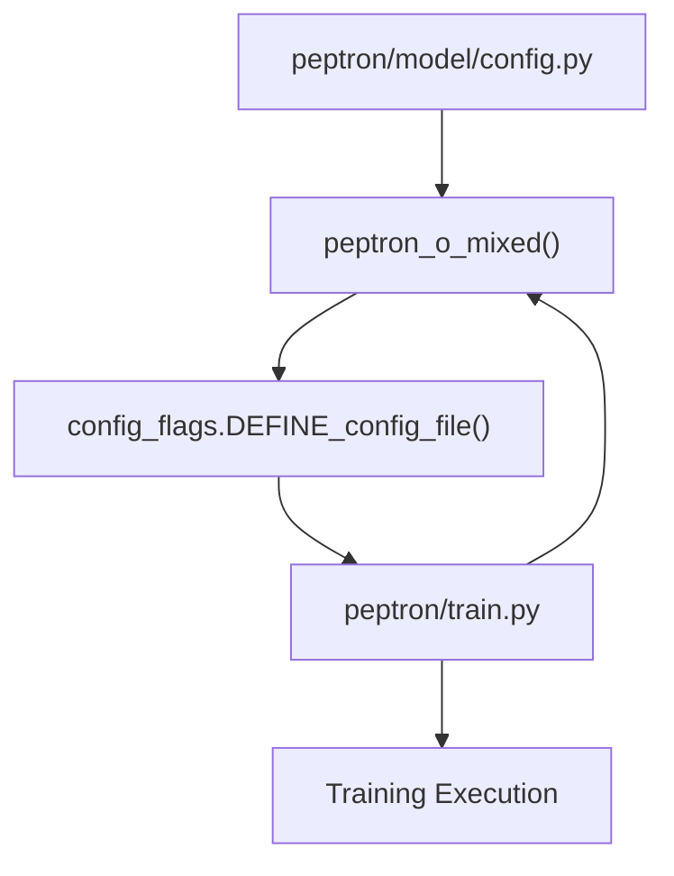
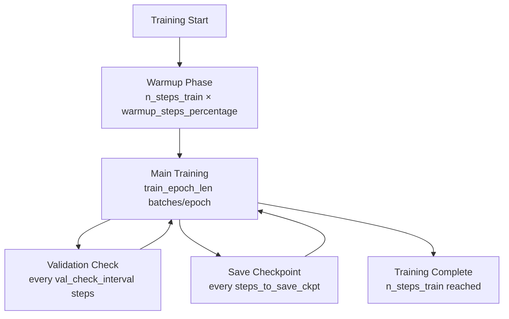
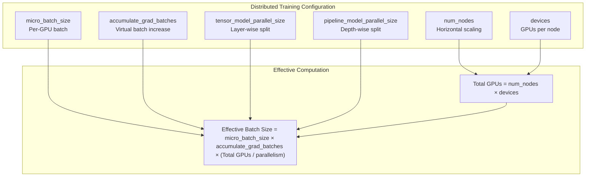
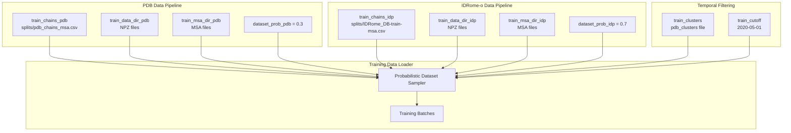
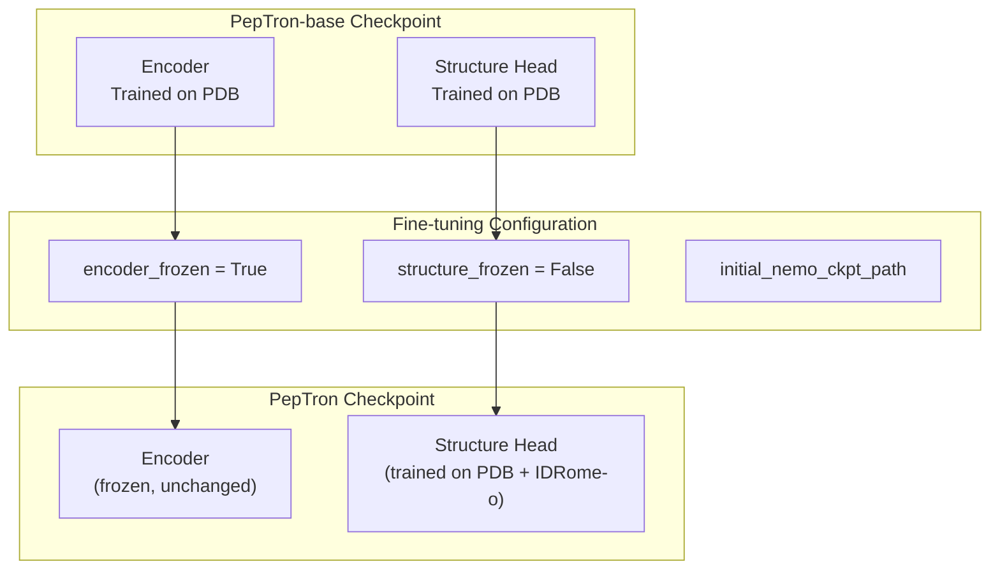
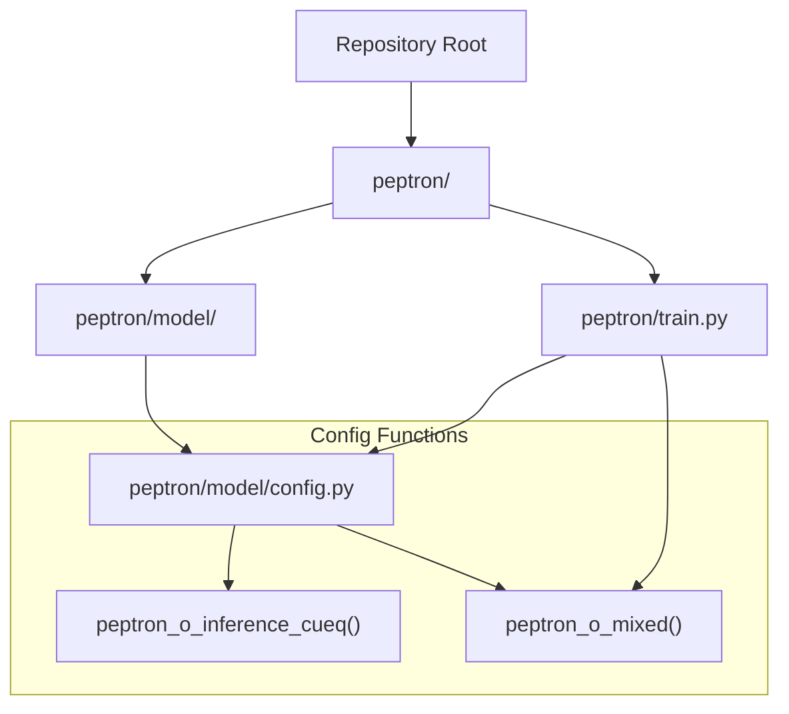

# Training Configuration

> **Relevant source files**
> * [README.md](https://github.com/PeptoneLtd/PepTron/blob/8123ab15/README.md?plain=1)

## Purpose and Scope

This page provides comprehensive documentation of all training configuration parameters defined in `peptron/model/config.py`. These parameters control the training process, including learning schedules, distributed training setup, data paths, and model freezing strategies.

For information about the data mixing strategy and dataset probabilities, see [Data Mixing Strategy](/PeptoneLtd/PepTron/5.2-data-mixing-strategy). For guidance on executing distributed training with these configurations, see [Distributed Training Setup](/PeptoneLtd/PepTron/5.3-distributed-training-setup). For a broader overview of the configuration system architecture, see [Configuration System](/PeptoneLtd/PepTron/3.1-configuration-system).

---

## Configuration File Structure

The training configuration is centrally managed in [peptron/model/config.py](https://github.com/PeptoneLtd/PepTron/blob/8123ab15/peptron/model/config.py)

 and loaded by [peptron/train.py](https://github.com/PeptoneLtd/PepTron/blob/8123ab15/peptron/train.py)

 using the Abseil flags library. The configuration system uses named config functions that return dictionaries of parameters.

### Configuration Loading Mechanism



**Sources:** [README.md L108-L113](https://github.com/PeptoneLtd/PepTron/blob/8123ab15/README.md?plain=1#L108-L113)

 [README.md L41-L46](https://github.com/PeptoneLtd/PepTron/blob/8123ab15/README.md?plain=1#L41-L46)

The training script specifies which configuration to use:

```
EXEC_CONFIG = config_flags.DEFINE_config_file('config', 'peptron/model/config.py:peptron_o_mixed')
```

This syntax loads the `peptron_o_mixed()` function from the config file, which is the recommended configuration for training on mixed structured and disordered protein data.

**Sources:** [README.md L110-L113](https://github.com/PeptoneLtd/PepTron/blob/8123ab15/README.md?plain=1#L110-L113)

---

## Training Schedule Parameters

These parameters control the training duration, learning rate warmup, and validation frequency.

| Parameter | Type | Description | Typical Value |
| --- | --- | --- | --- |
| `n_steps_train` | int | Total number of training steps | 2500 |
| `warmup_steps_percentage` | float | Percentage of steps for learning rate warmup | 0.10 (10%) |
| `train_epoch_len` | int | Number of batches per training epoch | 80000 |
| `val_epoch_len` | int | Number of batches per validation epoch | 5 |
| `val_check_interval` | int | Training steps between validation runs | 100 |
| `limit_val_batches` | int | Maximum validation batches to run | 3 |
| `steps_to_save_ckpt` | int | Training steps between checkpoint saves | 100 |

**Sources:** [README.md L118-L137](https://github.com/PeptoneLtd/PepTron/blob/8123ab15/README.md?plain=1#L118-L137)

### Training Schedule Flow



**Sources:** [README.md L123-L137](https://github.com/PeptoneLtd/PepTron/blob/8123ab15/README.md?plain=1#L123-L137)

The warmup phase gradually increases the learning rate from zero to the configured maximum, preventing early training instability. Validation checks occur periodically during training but are limited to a small number of batches (`limit_val_batches`) to avoid excessive validation overhead.

---

## Distributed Training Parameters

PepTron leverages NVIDIA NeMo for distributed training across multiple GPUs and nodes. These parameters configure parallelism strategies.

| Parameter | Type | Description | Default Value |
| --- | --- | --- | --- |
| `num_nodes` | int | Number of compute nodes for distributed training | 1 |
| `devices` | int | Number of GPUs per node | 8 |
| `micro_batch_size` | int | Batch size per GPU | 8 |
| `tensor_model_parallel_size` | int | Tensor parallelism degree (splits model layers) | 1 |
| `pipeline_model_parallel_size` | int | Pipeline parallelism degree (splits model depth) | 1 |
| `accumulate_grad_batches` | int | Number of gradient accumulation steps | 1 |
| `precision` | str | Training precision mode | "bf16-mixed" |

**Sources:** [README.md L126-L137](https://github.com/PeptoneLtd/PepTron/blob/8123ab15/README.md?plain=1#L126-L137)

### Parallelism Strategy



**Sources:** [README.md L129-L135](https://github.com/PeptoneLtd/PepTron/blob/8123ab15/README.md?plain=1#L129-L135)

The effective batch size determines the actual number of samples processed before a weight update. With default settings (`tensor_model_parallel_size=1`, `pipeline_model_parallel_size=1`, `accumulate_grad_batches=1`), the effective batch size is simply `micro_batch_size × num_nodes × devices`. Model parallelism reduces the effective number of GPUs available for data parallelism.

**Memory Considerations:** The `micro_batch_size` must be kept small enough to fit model activations, gradients, and optimizer states in GPU memory. For PepTron training, `micro_batch_size=8` is typically safe, though this may need adjustment based on `crop_size` and available GPU memory.

---

## Data Configuration

These parameters specify the locations of training and validation datasets, along with temporal splitting criteria.

### Dataset Path Parameters

| Parameter | Type | Description |
| --- | --- | --- |
| `train_data_dir_pdb` | str | Directory containing PDB NPZ files for training |
| `val_data_dir_pdb` | str | Directory containing PDB NPZ files for validation |
| `train_msa_dir_pdb` | str | Directory containing MSA files for PDB training data |
| `val_msa_dir_pdb` | str | Directory containing MSA files for PDB validation data |
| `train_data_dir_idp` | str | Directory containing IDRome-o NPZ files for training |
| `train_msa_dir_idp` | str | Directory containing MSA files for IDRome-o training data |
| `mmcif_dir` | str | Directory containing original mmCIF files (optional reference) |

**Sources:** [README.md L140-L153](https://github.com/PeptoneLtd/PepTron/blob/8123ab15/README.md?plain=1#L140-L153)

### Chain Index Files

| Parameter | Type | Description |
| --- | --- | --- |
| `train_chains_pdb` | str | CSV file listing PDB training chains |
| `valid_chains_pdb` | str | CSV file listing PDB validation chains |
| `train_chains_idp` | str | CSV file listing IDRome-o training chains |

Default values:

* `train_chains_pdb`: `"splits/pdb_chains_msa.csv"`
* `valid_chains_pdb`: `"splits/cameo2022_msa.csv"`
* `train_chains_idp`: `"splits/IDRome_DB-train-msa.csv"`

**Sources:** [README.md L147-L151](https://github.com/PeptoneLtd/PepTron/blob/8123ab15/README.md?plain=1#L147-L151)

### Dataset Mixing and Temporal Splitting

| Parameter | Type | Description | Default Value |
| --- | --- | --- | --- |
| `dataset_prob_pdb` | float | Probability of sampling from PDB dataset | 0.3 (30%) |
| `dataset_prob_idp` | float | Probability of sampling from IDRome-o dataset | 0.7 (70%) |
| `train_clusters` | str | Path to sequence cluster file for train/val split | - |
| `train_cutoff` | str | Temporal cutoff date (YYYY-MM-DD) for train/val split | "2020-05-01" |

**Sources:** [README.md L154-L157](https://github.com/PeptoneLtd/PepTron/blob/8123ab15/README.md?plain=1#L154-L157)

### Data Flow Architecture



**Sources:** [README.md L140-L157](https://github.com/PeptoneLtd/PepTron/blob/8123ab15/README.md?plain=1#L140-L157)

The `train_clusters` file contains sequence similarity clustering information at 40% identity, used to ensure that training and validation sets do not contain similar sequences. The `train_cutoff` date ensures temporal separation: structures deposited before this date are eligible for training, while newer structures (like those in `cameo2022_msa.csv`) are reserved for validation.

---

## Model Freezing and Transfer Learning

PepTron supports transfer learning by selectively freezing components of the pre-trained model during fine-tuning.

| Parameter | Type | Description | Default Value |
| --- | --- | --- | --- |
| `encoder_frozen` | bool | Freeze the sequence encoder during training | True |
| `structure_frozen` | bool | Freeze the structure prediction head during training | False |
| `initial_nemo_ckpt_path` | str | Path to initial checkpoint for transfer learning | "" |
| `pretrained_structure_head_path` | str | Path to pre-trained structure head weights | "" |

**Sources:** [README.md L159-L162](https://github.com/PeptoneLtd/PepTron/blob/8123ab15/README.md?plain=1#L159-L162)

### Transfer Learning Configuration



**Sources:** [README.md L159-L162](https://github.com/PeptoneLtd/PepTron/blob/8123ab15/README.md?plain=1#L159-L162)

 [README.md L28-L33](https://github.com/PeptoneLtd/PepTron/blob/8123ab15/README.md?plain=1#L28-L33)

The typical training workflow for PepTron follows this strategy:

1. **PepTron-base Training**: Train the full model (encoder + structure head) on PDB data
2. **PepTron Fine-tuning**: Load PepTron-base checkpoint via `initial_nemo_ckpt_path`, set `encoder_frozen=True` and `structure_frozen=False`, then train on mixed PDB and IDRome-o data

This approach allows the structure head to adapt to disordered protein ensembles while preserving the encoder's learned sequence representations from structured proteins.

---

## Experiment Tracking Parameters

PepTron integrates with Weights & Biases (WandB) for experiment tracking and uses local directories for checkpoint storage.

| Parameter | Type | Description |
| --- | --- | --- |
| `experiment_dir` | str | Root directory for storing checkpoints and logs |
| `wandb_project` | str | WandB project name for experiment tracking |
| `experiment_name` | str | Name for the specific training run |

**Sources:** [README.md L121-L123](https://github.com/PeptoneLtd/PepTron/blob/8123ab15/README.md?plain=1#L121-L123)

Checkpoints are saved to `{experiment_dir}/checkpoints/` at intervals specified by `steps_to_save_ckpt`. Training logs, validation metrics, and configuration snapshots are also stored under `experiment_dir`.

---

## Advanced Flow Matching Parameters

Beyond the main training configuration, PepTron uses flow matching parameters that control the diffusion process during training.

| Parameter | Path | Description | Notes |
| --- | --- | --- | --- |
| `noise_prob` | `flow_matching.noise_prob` | Probability of adding noise during training | Controls stochasticity |
| `self_cond_prob` | `flow_matching.self_cond_prob` | Self-conditioning probability | Improves sample quality |
| `crop_size` | `crop_size` | Maximum sequence length for input cropping | Memory management |

**Sources:** [README.md L196-L198](https://github.com/PeptoneLtd/PepTron/blob/8123ab15/README.md?plain=1#L196-L198)

The `crop_size` parameter is particularly important for memory management. Longer sequences require proportionally more memory for attention computations and structure predictions. If encountering CUDA out-of-memory errors, reducing `crop_size` can help, though it requires processing longer sequences in multiple crops.

---

## Configuration File Location Reference



**Sources:** [README.md L108-L113](https://github.com/PeptoneLtd/PepTron/blob/8123ab15/README.md?plain=1#L108-L113)

 [README.md L41-L46](https://github.com/PeptoneLtd/PepTron/blob/8123ab15/README.md?plain=1#L41-L46)

---

## Typical Configuration Workflow

When setting up a new training run:

1. **Clone and modify configuration**: Copy `peptron/model/config.py` or edit the `peptron_o_mixed()` function directly
2. **Set data paths**: Update all `*_data_dir_*` and `*_msa_dir_*` parameters to point to your preprocessed datasets
3. **Configure experiment tracking**: Set `experiment_dir`, `wandb_project`, and `experiment_name`
4. **Adjust training schedule**: Modify `n_steps_train`, `micro_batch_size`, and checkpoint intervals based on your resources
5. **Set up transfer learning** (optional): Specify `initial_nemo_ckpt_path` and configure freezing parameters
6. **Configure distributed training**: Set `num_nodes` and `devices` based on your compute cluster
7. **Run training**: Execute via [run_peptron_train.sh](https://github.com/PeptoneLtd/PepTron/blob/8123ab15/run_peptron_train.sh)  or [run_peptron_distributed_train.sh](https://github.com/PeptoneLtd/PepTron/blob/8123ab15/run_peptron_distributed_train.sh)

**Sources:** [README.md L108-L173](https://github.com/PeptoneLtd/PepTron/blob/8123ab15/README.md?plain=1#L108-L173)

---

## Configuration Parameter Summary Table

| Category | Key Parameters | Related Page |
| --- | --- | --- |
| Training Schedule | `n_steps_train`, `warmup_steps_percentage`, `val_check_interval` | This page |
| Distributed Training | `num_nodes`, `devices`, `micro_batch_size`, `precision` | [Distributed Training Setup](/PeptoneLtd/PepTron/5.3-distributed-training-setup) |
| Data Paths | `train_data_dir_pdb`, `train_data_dir_idp`, `*_msa_dir_*` | [Data Mixing Strategy](/PeptoneLtd/PepTron/5.2-data-mixing-strategy) |
| Dataset Mixing | `dataset_prob_pdb`, `dataset_prob_idp` | [Data Mixing Strategy](/PeptoneLtd/PepTron/5.2-data-mixing-strategy) |
| Model Freezing | `encoder_frozen`, `structure_frozen`, `initial_nemo_ckpt_path` | [Model Checkpoints](/PeptoneLtd/PepTron/3.2-model-checkpoints) |
| Experiment Tracking | `experiment_dir`, `wandb_project`, `experiment_name` | This page |
| Flow Matching | `flow_matching.noise_prob`, `crop_size` | This page |

**Sources:** [README.md L118-L163](https://github.com/PeptoneLtd/PepTron/blob/8123ab15/README.md?plain=1#L118-L163)

 [README.md L196-L198](https://github.com/PeptoneLtd/PepTron/blob/8123ab15/README.md?plain=1#L196-L198)