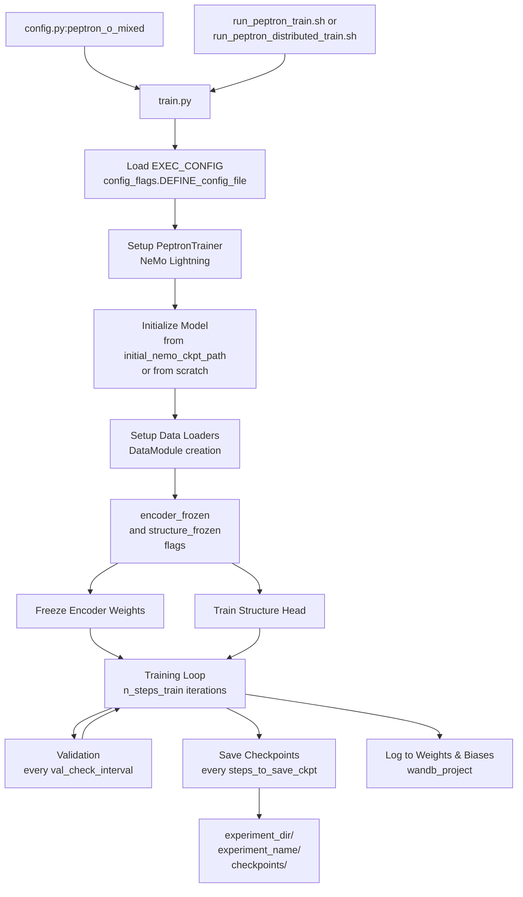
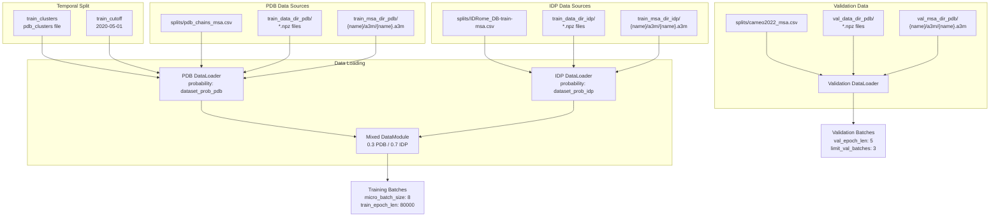
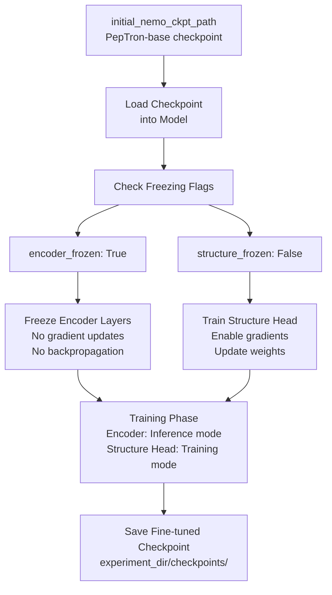
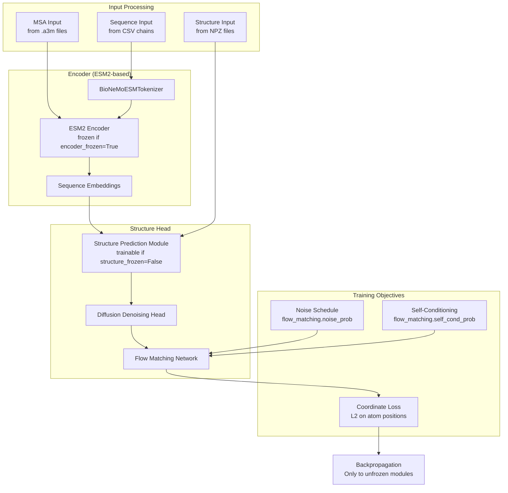

# Training

> **Relevant source files**
> * [README.md](https://github.com/PeptoneLtd/PepTron/blob/8123ab15/README.md?plain=1)

This document provides a comprehensive guide to training PepTron models from scratch or fine-tuning existing checkpoints. It covers the complete training pipeline, including data preparation prerequisites, configuration management, execution, and monitoring.

For detailed information about training configuration parameters, see [Training Configuration](/PeptoneLtd/PepTron/5.1-training-configuration). For the data mixing strategy and cluster-based splitting, see [Data Mixing Strategy](/PeptoneLtd/PepTron/5.2-data-mixing-strategy). For distributed training execution, see [Distributed Training Setup](/PeptoneLtd/PepTron/5.3-distributed-training-setup). For data preparation requirements, see [Data Preparation Pipeline](/PeptoneLtd/PepTron/4-data-preparation-pipeline).

**Sources:** [README.md L75-L174](https://github.com/PeptoneLtd/PepTron/blob/8123ab15/README.md?plain=1#L75-L174)

## Training Overview

PepTron training uses the NVIDIA NeMo framework to train a diffusion-based protein structure prediction model. The training system supports:

* **Transfer learning** with frozen encoder and trainable structure head
* **Multi-dataset training** with configurable mixing ratios between PDB and IDRome-o datasets
* **Distributed training** across single or multiple nodes with data and model parallelism
* **Experiment tracking** via Weights & Biases
* **Temporal validation** using cluster-based dataset splits

The training pipeline is orchestrated through `peptron/train.py`, configured via `peptron/model/config.py`, and executed using shell scripts.

**Sources:** [README.md L75-L174](https://github.com/PeptoneLtd/PepTron/blob/8123ab15/README.md?plain=1#L75-L174)

## Training Execution Flow

The following diagram illustrates the complete training execution flow from configuration to checkpoint output:



**Sources:** [README.md L75-L174](https://github.com/PeptoneLtd/PepTron/blob/8123ab15/README.md?plain=1#L75-L174)

 [README.md L110-L163](https://github.com/PeptoneLtd/PepTron/blob/8123ab15/README.md?plain=1#L110-L163)

## Prerequisites

Before starting training, ensure the following data preparation steps are completed:

| Requirement | Description | Reference |
| --- | --- | --- |
| **PDB Dataset** | mmCIF files unpacked to NPZ format with `pdb_mmcif_msa.csv` index | [PDB Dataset Processing](/PeptoneLtd/PepTron/4.1-pdb-dataset-processing) |
| **IDRome-o Dataset** | Ensemble trajectories processed to NPZ format with MSA indices | [IDRome-o Dataset Processing](/PeptoneLtd/PepTron/4.2-idrome-o-dataset-processing) |
| **MSA Files** | Multiple sequence alignments in `.a3m` format for all training entries | [MSA Generation](/PeptoneLtd/PepTron/4.3-multiple-sequence-alignment-(msa)-generation) |
| **Cluster File** | `pdb_clusters` file at 40% sequence similarity for temporal splitting | [README.md L93](https://github.com/PeptoneLtd/PepTron/blob/8123ab15/README.md?plain=1#L93-L93) |
| **Validation Split** | CAMEO2022 validation set with MSAs | [README.md L94](https://github.com/PeptoneLtd/PepTron/blob/8123ab15/README.md?plain=1#L94-L94) |
| **Docker Environment** | BioNeMo 2.3 container with GPU support | [Installation](/PeptoneLtd/PepTron/2.1-installation-and-environment-setup) |

**Sources:** [README.md L75-L107](https://github.com/PeptoneLtd/PepTron/blob/8123ab15/README.md?plain=1#L75-L107)

## Training Configuration Entry Point

The training process begins by specifying the configuration in `peptron/train.py`:

```
EXEC_CONFIG = config_flags.DEFINE_config_file('config', 'peptron/model/config.py:peptron_o_mixed')
```

The `peptron_o_mixed` configuration key in `config.py` defines the training parameters. Key configuration sections include:

| Section | Purpose | File Reference |
| --- | --- | --- |
| `training` | Experiment paths, training hyperparameters, data paths, freezing flags | [peptron/model/config.py L118-L163](https://github.com/PeptoneLtd/PepTron/blob/8123ab15/peptron/model/config.py#L118-L163) |
| `flow_matching` | Noise scheduling and self-conditioning parameters | Referenced in [README.md L196-L198](https://github.com/PeptoneLtd/PepTron/blob/8123ab15/README.md?plain=1#L196-L198) |
| `model` | Model architecture parameters | Referenced in config system |
| `data` | Batch sizes, crop sizes, data loading settings | Referenced in config system |

**Sources:** [README.md L110-L113](https://github.com/PeptoneLtd/PepTron/blob/8123ab15/README.md?plain=1#L110-L113)

## Training Data Pipeline

The following diagram shows how training data flows from disk into the model during training:



**Sources:** [README.md L118-L163](https://github.com/PeptoneLtd/PepTron/blob/8123ab15/README.md?plain=1#L118-L163)

## Training Parameters Structure

The training configuration in `peptron/model/config.py` contains the following key parameter groups:

### Experiment Management

```yaml
experiment_dir: str           # Root directory for experiment outputs
wandb_project: str            # Weights & Biases project name
experiment_name: str          # Unique identifier for this training run
```

### Training Schedule

```yaml
n_steps_train: int            # Total number of training steps (default: 2500)
warmup_steps_percentage: float # Fraction of steps for learning rate warmup (default: 0.10)
train_epoch_len: int          # Number of batches per training epoch (default: 80000)
val_epoch_len: int            # Number of batches per validation epoch (default: 5)
```

### Hardware Configuration

```yaml
num_nodes: int                # Number of compute nodes (default: 1)
devices: int                  # Number of GPUs per node (default: 8)
tensor_model_parallel_size: int     # Tensor parallelism degree (default: 1)
pipeline_model_parallel_size: int   # Pipeline parallelism degree (default: 1)
```

### Batch Configuration

```yaml
micro_batch_size: int         # Per-GPU batch size (default: 8)
accumulate_grad_batches: int  # Gradient accumulation steps (default: 1)
precision: str                # Training precision (default: "bf16-mixed")
```

### Checkpointing

```yaml
steps_to_save_ckpt: int       # Save checkpoint every N steps (default: 100)
val_check_interval: int       # Validate every N steps (default: 100)
limit_val_batches: int        # Number of validation batches to run (default: 3)
initial_nemo_ckpt_path: str   # Path to initial checkpoint for transfer learning
```

**Sources:** [README.md L118-L163](https://github.com/PeptoneLtd/PepTron/blob/8123ab15/README.md?plain=1#L118-L163)

## Data Paths Configuration

The training configuration requires the following data path parameters:

### PDB Dataset Paths

```python
"train_data_dir_pdb": "/path/to/pdb_mmcif_npz_dir"      # NPZ files from unpack_mmcif"val_data_dir_pdb": "/path/to/pdb_mmcif_npz_dir"        # Same directory for validation"train_msa_dir_pdb": "/path/to/pdb_msa_dir"             # MSAs for training PDB chains"val_msa_dir_pdb": "/path/to/cameo2022_msa_dir"         # MSAs for CAMEO2022 validation"train_chains_pdb": "splits/pdb_chains_msa.csv"         # Training chain index"valid_chains_pdb": "splits/cameo2022_msa.csv"          # Validation chain index
```

### IDRome-o Dataset Paths

```python
"train_data_dir_idp": "/path/to/IDRome_train_dir"       # NPZ files from prep_idrome"train_msa_dir_idp": "/path/to/IDRome_train_msa_dir"    # MSAs for IDRome-o chains"train_chains_idp": "splits/IDRome_DB-train-msa.csv"    # IDP chain index
```

### Additional Paths

```markdown
"mmcif_dir": "/path/to/pdb_mmcif_dir"                   # Original mmCIF files directory"train_clusters": "/path/to/pdb_clusters"               # Cluster file for temporal split
```

**Sources:** [README.md L140-L157](https://github.com/PeptoneLtd/PepTron/blob/8123ab15/README.md?plain=1#L140-L157)

## Dataset Mixing Strategy

PepTron uses a probabilistic mixing strategy to combine structured and disordered protein data during training:

```python
"dataset_prob_pdb": 0.3    # 30% probability of sampling from PDB dataset"dataset_prob_idp": 0.7    # 70% probability of sampling from IDRome-o dataset
```

This 30/70 split ensures the model learns both structured protein folding and intrinsically disordered protein behavior. The mixing is implemented at the batch sampling level, where each training batch is randomly selected from either the PDB or IDRome-o dataset according to these probabilities.

### Temporal Validation Split

To prevent data leakage, the training uses a temporal cutoff for PDB data:

```markdown
"train_cutoff": "2020-05-01"    # Only structures deposited before this date are used for training
```

The `train_clusters` file provides sequence similarity clustering at 40% identity, ensuring validation structures are not too similar to training structures.

**Sources:** [README.md L154-L157](https://github.com/PeptoneLtd/PepTron/blob/8123ab15/README.md?plain=1#L154-L157)

 [README.md L93](https://github.com/PeptoneLtd/PepTron/blob/8123ab15/README.md?plain=1#L93-L93)

## Transfer Learning and Model Freezing

PepTron supports transfer learning through selective layer freezing:



### Freezing Configuration

```markdown
"encoder_frozen": True           # Freeze sequence encoder (ESM2-based)"structure_frozen": False        # Train structure prediction head"pretrained_structure_head_path": ""  # Optional: Load pre-trained structure head
```

**Typical Training Scenarios:**

| Scenario | encoder_frozen | structure_frozen | Use Case |
| --- | --- | --- | --- |
| **Fine-tuning (Recommended)** | `True` | `False` | Start from PepTron-base, adapt structure head to IDP data |
| **Full Training** | `False` | `False` | Train both encoder and structure head from scratch |
| **Encoder-only Training** | `False` | `True` | Fine-tune sequence representations only |

The default configuration (`encoder_frozen=True, structure_frozen=False`) is used to produce the final PepTron checkpoint from PepTron-base by fine-tuning only the structure prediction head on the mixed PDB/IDRome-o dataset.

**Sources:** [README.md L159-L162](https://github.com/PeptoneLtd/PepTron/blob/8123ab15/README.md?plain=1#L159-L162)

## Training Execution

### Single-Node Training

For training on a single node with multiple GPUs:

```
sh run_peptron_train.sh
```

The shell script executes the training with the configured number of devices. Ensure `num_nodes=1` and `devices` is set to the number of available GPUs in your configuration.

### Multi-Node Distributed Training

For distributed training across multiple nodes:

```
sh run_peptron_distributed_train.sh
```

Multi-node training requires:

* `num_nodes` set to the total number of nodes
* Proper network configuration for inter-node communication
* NeMo's distributed training environment properly configured

**Sources:** [README.md L166-L173](https://github.com/PeptoneLtd/PepTron/blob/8123ab15/README.md?plain=1#L166-L173)

## Training Outputs and Checkpointing

The training process generates outputs in the configured `experiment_dir`:

```
experiment_dir/
└── experiment_name/
    ├── checkpoints/
    │   ├── step_100.ckpt
    │   ├── step_200.ckpt
    │   └── step_N.ckpt
    ├── logs/
    └── tensorboard/
```

### Checkpoint Saving

Checkpoints are saved at regular intervals controlled by:

```markdown
"steps_to_save_ckpt": 100    # Save every 100 training steps
```

Each checkpoint contains:

* Model weights (encoder and structure head)
* Optimizer state
* Training step counter
* Learning rate scheduler state

### Experiment Tracking

Training metrics are logged to Weights & Biases:

```markdown
"wandb_project": "peptron-stable"      # W&B project name"experiment_name": "your-experiment-name"  # W&B run name
```

Logged metrics include:

* Training loss
* Validation loss
* Learning rate
* Gradient norms
* System metrics (GPU utilization, memory)

**Sources:** [README.md L121-L138](https://github.com/PeptoneLtd/PepTron/blob/8123ab15/README.md?plain=1#L121-L138)

## Model Components During Training

The following diagram shows the key model components and their roles during training:



**Sources:** [README.md L196-L198](https://github.com/PeptoneLtd/PepTron/blob/8123ab15/README.md?plain=1#L196-L198)

## Training Hyperparameters Summary

Key hyperparameters that affect training behavior:

| Parameter | Default | Description |
| --- | --- | --- |
| `n_steps_train` | 2500 | Total training steps |
| `warmup_steps_percentage` | 0.10 | Learning rate warmup fraction |
| `micro_batch_size` | 8 | Batch size per GPU |
| `train_epoch_len` | 80000 | Batches per training epoch |
| `val_epoch_len` | 5 | Batches per validation epoch |
| `accumulate_grad_batches` | 1 | Gradient accumulation steps |
| `val_check_interval` | 100 | Steps between validation runs |
| `limit_val_batches` | 3 | Number of validation batches |
| `precision` | "bf16-mixed" | Mixed precision training mode |
| `dataset_prob_pdb` | 0.3 | PDB sampling probability |
| `dataset_prob_idp` | 0.7 | IDP sampling probability |

Additional important parameters in the `flow_matching` configuration:

| Parameter | Description |
| --- | --- |
| `noise_prob` | Probability of adding noise during training |
| `self_cond_prob` | Self-conditioning probability for iterative refinement |

**Sources:** [README.md L118-L163](https://github.com/PeptoneLtd/PepTron/blob/8123ab15/README.md?plain=1#L118-L163)

 [README.md L196-L198](https://github.com/PeptoneLtd/PepTron/blob/8123ab15/README.md?plain=1#L196-L198)

## Common Training Issues

### Out of Memory Errors

Keep `micro_batch_size=1` and adjust based on available GPU memory. The model's memory footprint scales with:

* Sequence length (controlled by `crop_size`)
* Batch size
* Number of ensemble samples during validation

**Sources:** [README.md L215](https://github.com/PeptoneLtd/PepTron/blob/8123ab15/README.md?plain=1#L215-L215)

### Training Convergence Issues

Verify:

* All data paths in configuration are correct and accessible
* CSV files have the correct format (`name,seqres` or similar)
* NPZ files are properly generated from `unpack_mmcif.py` or `prep_idrome.py`
* MSA files exist for all entries in the CSV indices

**Sources:** [README.md L218](https://github.com/PeptoneLtd/PepTron/blob/8123ab15/README.md?plain=1#L218-L218)

### Checkpoint Loading Errors

Ensure:

* `initial_nemo_ckpt_path` points to a valid NeMo checkpoint directory
* Model configuration is compatible with the checkpoint being loaded
* Checkpoint was created with the same or compatible NeMo version

**Sources:** [README.md L217](https://github.com/PeptoneLtd/PepTron/blob/8123ab15/README.md?plain=1#L217-L217)

## Training from Scratch vs Fine-tuning

### Training from Scratch (PepTron-base)

To train PepTron-base from scratch on PDB data:

1. Set `initial_nemo_ckpt_path: ""` (empty string)
2. Set `encoder_frozen: False` and `structure_frozen: False`
3. Use only PDB data: `dataset_prob_pdb: 1.0, dataset_prob_idp: 0.0`
4. Train for sufficient steps to convergence

### Fine-tuning (PepTron)

To fine-tune PepTron-base to create PepTron:

1. Set `initial_nemo_ckpt_path: "/path/to/PepTron-base"`
2. Set `encoder_frozen: True` and `structure_frozen: False`
3. Use mixed data: `dataset_prob_pdb: 0.3, dataset_prob_idp: 0.7`
4. Train for the configured `n_steps_train`

This is the recommended approach as it leverages the pre-trained knowledge from PepTron-base.

**Sources:** [README.md L32-L33](https://github.com/PeptoneLtd/PepTron/blob/8123ab15/README.md?plain=1#L32-L33)

 [README.md L159-L162](https://github.com/PeptoneLtd/PepTron/blob/8123ab15/README.md?plain=1#L159-L162)