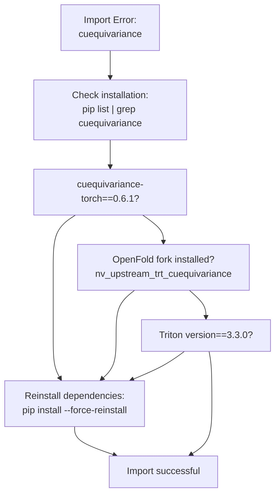
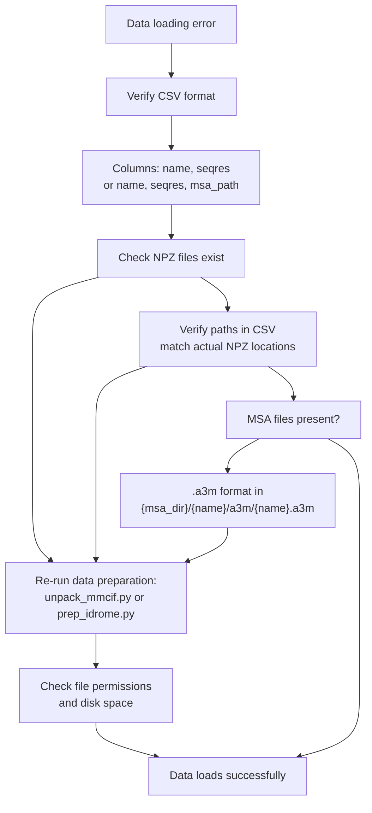
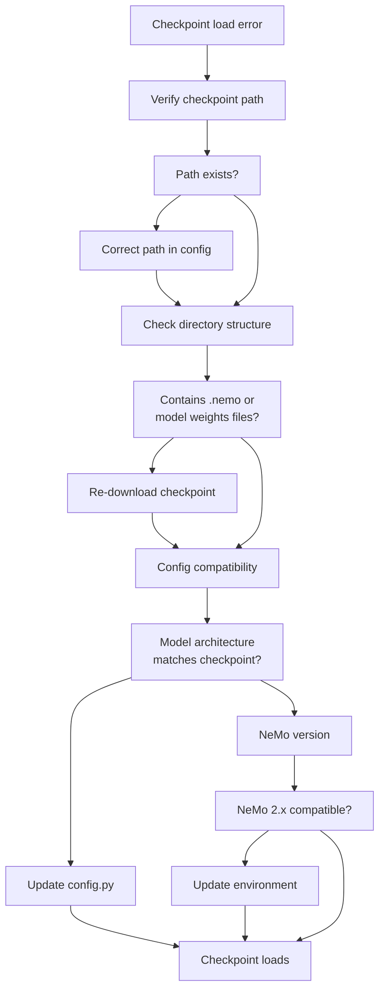
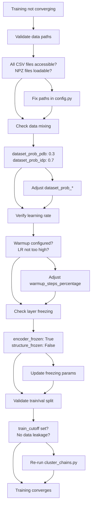
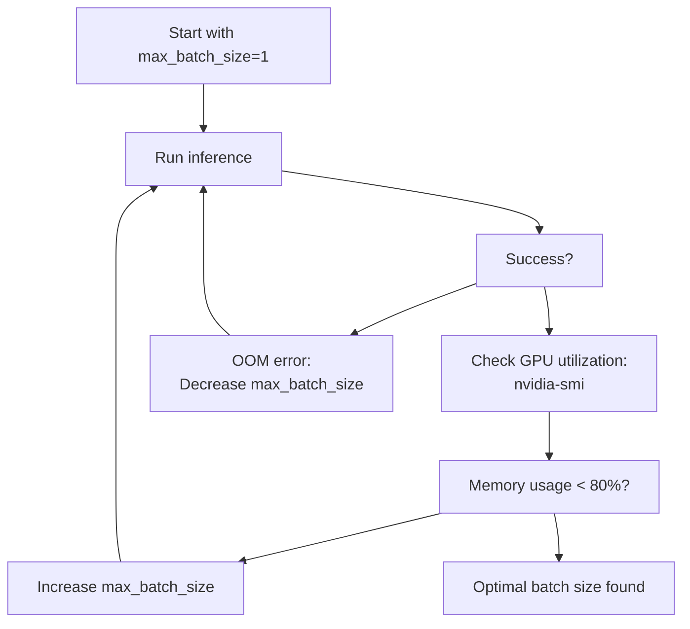

# Troubleshooting

> **Relevant source files**
> * [README.md](https://github.com/PeptoneLtd/PepTron/blob/8123ab15/README.md?plain=1)

This page provides solutions to common issues encountered when using PepTron for training and inference. It covers memory management, dependency conflicts, checkpoint handling, data preparation errors, and runtime failures. For detailed parameter configuration, see [Configuration System](/PeptoneLtd/PepTron/3.1-configuration-system). For training-specific setup, see [Training](/PeptoneLtd/PepTron/5-training). For inference configuration, see [Inference](/PeptoneLtd/PepTron/6-inference).

---

## Memory Management Issues

### Inference Out-of-Memory Errors

PepTron generates protein structure ensembles using diffusion-based sampling, which has significant GPU memory requirements that scale with sequence length and ensemble size.

**Symptoms:**

* `RuntimeError: CUDA out of memory` during inference
* Process killed without error message
* GPU memory allocation failures

**Solutions:**

| Parameter | Location | Recommended Action |
| --- | --- | --- |
| `max_batch_size` | [peptron/model/config.py](https://github.com/PeptoneLtd/PepTron/blob/8123ab15/peptron/model/config.py) | Reduce to 1 for sequences >500 residues |
| `samples` | [peptron/model/config.py](https://github.com/PeptoneLtd/PepTron/blob/8123ab15/peptron/model/config.py) | Generate ensembles in multiple runs if needed |
| `num_gpus` | [peptron/model/config.py](https://github.com/PeptoneLtd/PepTron/blob/8123ab15/peptron/model/config.py) | Increase to distribute load across GPUs |
| `crop_size` | [peptron/model/config.py](https://github.com/PeptoneLtd/PepTron/blob/8123ab15/peptron/model/config.py) | Not applicable for inference (training only) |

**Memory scaling relationship:**

```
GPU Memory ≈ sequence_length × max_batch_size × samples/num_gpus × model_size
```

For a 1000-residue protein with default settings (samples=10, max_batch_size=1), expect ~20-30GB per GPU.

**Diagnostic steps:**

```markdown
# Check GPU memory before runningnvidia-smi # Monitor GPU usage during inferencewatch -n 1 nvidia-smi # Test with minimal settings first# In peptron/model/config.py:peptron_o_inference_cueq"samples": 1,"max_batch_size": 1,"num_gpus": 1,
```

**Sources:** [README.md L186-L190](https://github.com/PeptoneLtd/PepTron/blob/8123ab15/README.md?plain=1#L186-L190)

 [README.md L215](https://github.com/PeptoneLtd/PepTron/blob/8123ab15/README.md?plain=1#L215-L215)

### Training Out-of-Memory Errors

Training memory consumption is dominated by batch size, sequence crop size, and gradient accumulation.

**Symptoms:**

* OOM errors during training initialization
* Crashes during backward pass
* Inconsistent memory failures

**Critical parameters:**

| Parameter | Location | Safe Value | Notes |
| --- | --- | --- | --- |
| `micro_batch_size` | [peptron/model/config.py L119-L163](https://github.com/PeptoneLtd/PepTron/blob/8123ab15/peptron/model/config.py#L119-L163) | 1-8 | Primary memory control |
| `crop_size` | [peptron/model/config.py](https://github.com/PeptoneLtd/PepTron/blob/8123ab15/peptron/model/config.py) | ≤384 | Sequences cropped to this length |
| `accumulate_grad_batches` | [peptron/model/config.py L133](https://github.com/PeptoneLtd/PepTron/blob/8123ab15/peptron/model/config.py#L133-L133) | 1-4 | Simulates larger batches |
| `tensor_model_parallel_size` | [peptron/model/config.py L131](https://github.com/PeptoneLtd/PepTron/blob/8123ab15/peptron/model/config.py#L131-L131) | 1-8 | Splits model across GPUs |

**Memory optimization strategy:**

```
Effective Batch Size = micro_batch_size × accumulate_grad_batches × num_gpus
```

To maintain training dynamics while reducing memory:

1. Keep `micro_batch_size=1`
2. Increase `accumulate_grad_batches` to compensate
3. Monitor validation loss for training stability

**Sources:** [README.md L215](https://github.com/PeptoneLtd/PepTron/blob/8123ab15/README.md?plain=1#L215-L215)

 [README.md L119-L163](https://github.com/PeptoneLtd/PepTron/blob/8123ab15/README.md?plain=1#L119-L163)

---

## Environment and Dependency Issues

### Docker Container Issues

**Container fails to build:**

```markdown
# Error: CUDA version mismatchERROR [stage-1 5/10] RUN pip install cuequivariance-torch==0.6.1
```

**Solution:**
Ensure Docker has access to NVIDIA runtime:

```php
# Verify NVIDIA Docker runtimedocker run --rm --gpus all nvidia/cuda:12.0-base nvidia-smi # If failed, install nvidia-container-toolkitdistribution=$(. /etc/os-release;echo $ID$VERSION_ID)curl -s -L https://nvidia.github.io/nvidia-docker/gpgkey | sudo apt-key add -curl -s -L https://nvidia.github.io/nvidia-docker/$distribution/nvidia-docker.list | \  sudo tee /etc/apt/sources.list.d/nvidia-docker.listsudo apt-get update && sudo apt-get install -y nvidia-container-toolkitsudo systemctl restart docker
```

**Container exits immediately:**

Check GPU availability inside container:

```
docker run --gpus all -it peptron:latest nvidia-smi
```

**Sources:** [README.md L14-L26](https://github.com/PeptoneLtd/PepTron/blob/8123ab15/README.md?plain=1#L14-L26)

 Dockerfile reference

### cuEquivariance Import Errors

**Symptom:**

```javascript
ImportError: cannot import name 'cuequivariance' from 'openfold'ModuleNotFoundError: No module named 'cuequivariance_torch'
```

**Root cause:** Version mismatch between OpenFold fork and cuequivariance library.

**Diagnostic diagram:**



**Solution:**

```javascript
# Inside container, verify versionspip show cuequivariance-torch  # Should be 0.6.1pip show triton  # Should be 3.3.0 # Check OpenFold installationpython -c "from openfold.utils import cuequivariance; print('OK')" # If errors persist, reinstall in orderpip uninstall -y cuequivariance-torch tritonpip install triton==3.3.0pip install cuequivariance-torch==0.6.1
```

**Note:** TorchDynamo warnings about cuequivariance can be safely ignored. They do not affect functionality.

**Sources:** [README.md L216](https://github.com/PeptoneLtd/PepTron/blob/8123ab15/README.md?plain=1#L216-L216)

 Dockerfile dependencies

### ESM2 Tokenizer Issues

**Symptom:**

```yaml
KeyError: 'esm2_tokenizer not found in registry'AttributeError: 'BioNeMoESMTokenizer' object has no attribute 'vocab_size'
```

**Related components:**

* [peptron/model/esm2/tokenizer.py](https://github.com/PeptoneLtd/PepTron/blob/8123ab15/peptron/model/esm2/tokenizer.py)  - `BioNeMoESMTokenizer` class
* [peptron/model/esm2/data.py](https://github.com/PeptoneLtd/PepTron/blob/8123ab15/peptron/model/esm2/data.py)  - Token handling in `ESMDataset`
* [peptron/model/esm2/config.py](https://github.com/PeptoneLtd/PepTron/blob/8123ab15/peptron/model/esm2/config.py)  - ESM2 configuration

**Solution:**

Ensure tokenizer is properly registered before use:

```javascript
# Pattern from peptron/model/esm2/tokenizer.pyfrom nemo.collections.common.tokenizers.tokenizer_spec import TokenizerSpec # Tokenizer must be registered in NeMo's tokenizer registry# Check registration in config initialization
```

**Sources:** peptron/model/esm2/ module

---

## Data Preparation Issues

### Data Pipeline Error Resolution



### CSV Format Errors

**Inference CSV requirements:**

```
name,seqresprotein1,MKTAYIAKQRQISFVKSHFSRQLEERLGLIEVQAprotein2,MSHHWGYGKHNGPEHWHKDFPIAKGERQSPVDID
```

**Training CSV requirements (PDB):**

```
name,seqres,msa_path,chain_path5abc_A,MKTAYIAK...,/msa/5abc_A/a3m/5abc_A.a3m,/npz/5abc_A.npz
```

**Training CSV requirements (IDRome):**

```
name,seqres,msa_path,chain_pathIDR_001,MSHHWGYG...,/msa/IDR_001/a3m/IDR_001.a3m,/npz/IDR_001.npz
```

**Common errors:**

| Error | Cause | Solution |
| --- | --- | --- |
| `KeyError: 'seqres'` | Column name mismatch | Check header exactly matches `name,seqres` |
| `ValueError: malformed CSV` | Hidden characters, encoding | Re-save as UTF-8, Unix line endings |
| `FileNotFoundError` in training | Invalid paths in `chain_path` or `msa_path` | Use absolute paths or verify relative paths |

**Sources:** [README.md L50-L55](https://github.com/PeptoneLtd/PepTron/blob/8123ab15/README.md?plain=1#L50-L55)

 [dataprep/unpack_mmcif.py](https://github.com/PeptoneLtd/PepTron/blob/8123ab15/dataprep/unpack_mmcif.py)

 [dataprep/prep_idrome.py](https://github.com/PeptoneLtd/PepTron/blob/8123ab15/dataprep/prep_idrome.py)

### NPZ File Issues

**Symptom:**

```yaml
ValueError: Failed to load NPZ fileKeyError: 'aatype' not found in NPZ
```

**NPZ file structure (PDB):**
Created by [dataprep/unpack_mmcif.py](https://github.com/PeptoneLtd/PepTron/blob/8123ab15/dataprep/unpack_mmcif.py)

Expected keys:

* `aatype`: Amino acid type indices
* `atom_positions`: 3D coordinates (N, CA, C, O)
* `atom_mask`: Valid atom indicators
* `residue_index`: Residue numbering
* `b_factors`: Temperature factors

**NPZ file structure (IDRome):**
Created by [dataprep/prep_idrome.py](https://github.com/PeptoneLtd/PepTron/blob/8123ab15/dataprep/prep_idrome.py)

Expected keys:

* `aatype`: Amino acid type indices
* `all_atom_positions`: Full ensemble coordinates
* `all_atom_mask`: Per-frame atom masks
* `num_frames`: Number of ensemble conformations

**Validation script:**

```javascript
import numpy as np # Check NPZ integritynpz_file = np.load('/path/to/protein.npz')print("Keys:", list(npz_file.keys()))print("aatype shape:", npz_file['aatype'].shape)print("positions shape:", npz_file.get('atom_positions', npz_file.get('all_atom_positions')).shape)
```

**Re-generation:**

```markdown
# For PDB datapython -m dataprep.unpack_mmcif --mmcif_dir [DIR] --outdir [DIR] --num_workers 4 # For IDRome datapython -m dataprep.prep_idrome --split splits/IDRome_DB-train.csv \    --ensemble_dir [DIR] --outdir [DIR] --num_workers 4
```

**Sources:** [README.md L84-L94](https://github.com/PeptoneLtd/PepTron/blob/8123ab15/README.md?plain=1#L84-L94)

 [README.md L100-L106](https://github.com/PeptoneLtd/PepTron/blob/8123ab15/README.md?plain=1#L100-L106)

### MSA Generation Failures

**ColabFold API errors:**

```
requests.exceptions.HTTPError: 503 Server Error
```

**Solutions:**

1. **Rate limiting:** Add delays between requests
2. **Server downtime:** Switch to local MMseqs2 search
3. **Large sequences:** May timeout; use local search

**Local MSA generation setup:**

```markdown
# Download databases (requires ~2TB space)# Following https://github.com/sokrypton/ColabFold/blob/main/setup_databases.shwget https://wwwuser.gwdg.de/~compbiol/colabfold/uniref30_2302.tar.gztar -xzf uniref30_2302.tar.gz wget https://wwwuser.gwdg.de/~compbiol/colabfold/colabfold_envdb_202108.tar.gztar -xzf colabfold_envdb_202108.tar.gz # Run local searchpython -m scripts.mmseqs_search_helper \    --split [PATH_TO_SPLIT_CSV] \    --db_dir [DATABASE_DIR] \    --outdir [OUTPUT_DIR]
```

**MSA path structure validation:**

```
msa_dir/
├── protein1/
│   └── a3m/
│       └── protein1.a3m
├── protein2/
│   └── a3m/
│       └── protein2.a3m
```

**Sources:** [README.md L87-L89](https://github.com/PeptoneLtd/PepTron/blob/8123ab15/README.md?plain=1#L87-L89)

 dataprep/mmseqs_query.py, scripts/mmseqs_search_helper.py

---

## Checkpoint Issues

### Checkpoint Loading Errors



### Training Checkpoint Path Configuration

**For fine-tuning from PepTron-base:**

In [peptron/model/config.py L138](https://github.com/PeptoneLtd/PepTron/blob/8123ab15/peptron/model/config.py#L138-L138)

:

```
"initial_nemo_ckpt_path": "/path/to/peptron-base-checkpoint",
```

**For training from scratch:**

```markdown
"initial_nemo_ckpt_path": "",  # Empty string
```

**Checkpoint directory structure:**

```
peptron-checkpoint/
├── model_config.yaml
├── model_weights.ckpt
├── mp_rank_00/
└── ...
```

### Inference Checkpoint Configuration

Specified via environment variable in [run_peptron_infer.sh](https://github.com/PeptoneLtd/PepTron/blob/8123ab15/run_peptron_infer.sh)

:

```javascript
export CKPT_PATH="/path/to/peptron-checkpoint"
```

**Configuration reference in [peptron/infer.py L45](https://github.com/PeptoneLtd/PepTron/blob/8123ab15/peptron/infer.py#L45-L45)

:**

```
EXEC_CONFIG = config_flags.DEFINE_config_file(    'config',     'peptron/model/config.py:peptron_o_inference_cueq')
```

### Model-Checkpoint Compatibility

**Compatibility matrix:**

| Checkpoint | Configuration | Use Case |
| --- | --- | --- |
| PepTron | `peptron_o_inference_cueq` | Full proteome inference |
| PepTron-base | `peptron_o_inference_cueq` | Structured proteins only |
| PepTron | `peptron_o_mixed` (training) | Fine-tuning on custom data |
| PepTron-base | `peptron_o_mixed` (training) | Transfer learning |

**Verification:**

```javascript
# Check checkpoint configurationimport yamlwith open('/path/to/checkpoint/model_config.yaml') as f:    ckpt_config = yaml.safe_load(f)    print("Model architecture:", ckpt_config.get('model', {}).get('name'))    print("Hidden size:", ckpt_config.get('model', {}).get('hidden_size'))
```

**Sources:** [README.md L28-L34](https://github.com/PeptoneLtd/PepTron/blob/8123ab15/README.md?plain=1#L28-L34)

 [README.md L57-L62](https://github.com/PeptoneLtd/PepTron/blob/8123ab15/README.md?plain=1#L57-L62)

 [README.md L138](https://github.com/PeptoneLtd/PepTron/blob/8123ab15/README.md?plain=1#L138-L138)

 [README.md L218](https://github.com/PeptoneLtd/PepTron/blob/8123ab15/README.md?plain=1#L218-L218)

---

## Training Issues

### Training Convergence Problems

**Symptoms:**

* Loss does not decrease after initial steps
* NaN or Inf in loss values
* Validation metrics diverge from training

**Diagnostic checklist:**



### Data Path Validation

**Required paths in [peptron/model/config.py L140-L157](https://github.com/PeptoneLtd/PepTron/blob/8123ab15/peptron/model/config.py#L140-L157)

:**

| Parameter | Type | Purpose |
| --- | --- | --- |
| `train_data_dir_pdb` | Directory | PDB NPZ files |
| `val_data_dir_pdb` | Directory | Validation NPZ files |
| `train_msa_dir_pdb` | Directory | PDB MSA files |
| `val_msa_dir_pdb` | Directory | Validation MSA files |
| `train_chains_pdb` | CSV file | Training entries (pdb_mmcif_msa.csv) |
| `valid_chains_pdb` | CSV file | Validation entries (cameo2022_msa.csv) |
| `train_data_dir_idp` | Directory | IDRome NPZ files |
| `train_msa_dir_idp` | Directory | IDRome MSA files |
| `train_chains_idp` | CSV file | IDRome entries (IDRome_DB-train-msa.csv) |
| `train_clusters` | File | Cluster assignments (pdb_clusters) |
| `mmcif_dir` | Directory | Original mmCIF files |

**Validation script:**

```javascript
import osimport pandas as pd config_paths = {    'train_data_dir_pdb': '/path/to/pdb_npz',    'train_chains_pdb': 'splits/pdb_mmcif_msa.csv',    # ... other paths} for name, path in config_paths.items():    if not os.path.exists(path):        print(f"ERROR: {name} not found at {path}")    elif path.endswith('.csv'):        df = pd.read_csv(path)        print(f"OK: {name} has {len(df)} entries")    else:        print(f"OK: {name} exists")
```

**Sources:** [README.md L140-L162](https://github.com/PeptoneLtd/PepTron/blob/8123ab15/README.md?plain=1#L140-L162)

 [README.md L218](https://github.com/PeptoneLtd/PepTron/blob/8123ab15/README.md?plain=1#L218-L218)

### Data Mixing Strategy Issues

**Configuration in [peptron/model/config.py L154-L155](https://github.com/PeptoneLtd/PepTron/blob/8123ab15/peptron/model/config.py#L154-L155)

:**

```markdown
"dataset_prob_pdb": 0.3,  # 30% structured proteins"dataset_prob_idp": 0.7,  # 70% disordered proteins
```

**Symptoms of incorrect mixing:**

* Model overfits to structured proteins (too much PDB)
* Poor performance on folded domains (too much IDRome)
* Unbalanced training dynamics

**Recommended ratios:**

| Target Application | PDB % | IDP % | Rationale |
| --- | --- | --- | --- |
| Full proteome | 30 | 70 | Default, balanced |
| Structure-focused | 70 | 30 | More globular proteins |
| Disorder-focused | 10 | 90 | IDPs and flexible regions |

**Sources:** [README.md L154-L155](https://github.com/PeptoneLtd/PepTron/blob/8123ab15/README.md?plain=1#L154-L155)

 Section 5.2 reference

### Distributed Training Issues

**Multi-node training failure:**

```markdown
# Error: Connection timeout between nodesRuntimeError: NCCL error in: ...
```

**Configuration in [peptron/model/config.py L129-L132](https://github.com/PeptoneLtd/PepTron/blob/8123ab15/peptron/model/config.py#L129-L132)

:**

```markdown
"num_nodes": 1,  # Number of machines"devices": 8,    # GPUs per node"tensor_model_parallel_size": 1,  # Tensor parallelism"pipeline_model_parallel_size": 1,  # Pipeline parallelism
```

**Network configuration requirements:**

1. All nodes must be on the same network
2. Port 29500 (default PyTorch DDP port) must be open
3. SSH access between nodes required
4. Shared filesystem or synchronized checkpoints

**Debugging distributed training:**

```javascript
# Test NCCL communicationpython -c "import torch; print(torch.cuda.nccl.version())" # Test multi-GPU on single node first# In config.py:"num_nodes": 1,"devices": 2,  # Start with 2 GPUs # Monitor withwatch -n 1 "ps aux | grep python"
```

**Sources:** [README.md L129-L132](https://github.com/PeptoneLtd/PepTron/blob/8123ab15/README.md?plain=1#L129-L132)

 [README.md L168-L173](https://github.com/PeptoneLtd/PepTron/blob/8123ab15/README.md?plain=1#L168-L173)

---

## Inference Issues

### Physical Filtering

**Post-processing script:** [peptron/pt_to_structure.py](https://github.com/PeptoneLtd/PepTron/blob/8123ab15/peptron/pt_to_structure.py)

 includes `filter_unphysical_traj` function

**Filtering criteria:**

1. **Bond length validation:** C-N peptide bonds within 1.2-1.5 Å
2. **Clash detection:** No atoms closer than van der Waals radii
3. **Geometry constraints:** Valid backbone angles

**Output directories:**

```markdown
results_path/
├── ensembles/              # All generated structures
│   ├── protein1_0.pdb
│   ├── protein1_1.pdb
│   └── ...
└── physical_ensembles/     # Filtered structures
    ├── protein1_0.pdb
    ├── protein1_3.pdb      # Some frames removed
    └── ...
```

**If all structures filtered:**

```markdown
# Error indicator: Empty physical_ensembles/ directory
```

**Solutions:**

1. Increase `steps` parameter (more denoising steps)
2. Increase `samples` to get more candidates
3. Review input sequence for non-standard residues
4. Disable filtering for visual inspection of issues

**Sources:** [README.md L66-L73](https://github.com/PeptoneLtd/PepTron/blob/8123ab15/README.md?plain=1#L66-L73)

 peptron/pt_to_structure.py

### Batch Size Tuning for Inference

**Interactive tuning process:**



**Tuning table:**

| Sequence Length | GPU Memory | Recommended max_batch_size | Notes |
| --- | --- | --- | --- |
| <200 | 24GB | 4-8 | Can process multiple samples simultaneously |
| 200-500 | 24GB | 2-4 | Moderate memory usage |
| 500-1000 | 24GB | 1-2 | High memory per sample |
| >1000 | 24GB | 1 | Maximum memory pressure |
| Any | 40GB+ | 2× above values | A100 or similar |

**Sources:** [README.md L183-L190](https://github.com/PeptoneLtd/PepTron/blob/8123ab15/README.md?plain=1#L183-L190)

---

## Debugging Strategies

### Logging and Monitoring

**Weights & Biases integration:**

Training automatically logs to W&B when configured in [peptron/model/config.py L122](https://github.com/PeptoneLtd/PepTron/blob/8123ab15/peptron/model/config.py#L122-L122)

:

```
"wandb_project": "peptron-stable","experiment_name": "your-experiment-name",
```

**Key metrics to monitor:**

* `train_loss`: Should decrease steadily
* `val_loss`: Should track train_loss
* `learning_rate`: Check warmup and decay schedule
* GPU utilization: Should be >80% during training

**Log file locations:**

```
experiment_dir/
├── logs/
│   ├── train.log
│   ├── val.log
│   └── error.log
├── checkpoints/
└── tensorboard/
```

### Common Error Patterns

**Error pattern resolution table:**

| Error Message | Component | Solution |
| --- | --- | --- |
| `KeyError: 'aatype'` | NPZ loading | Re-run data preparation |
| `RuntimeError: CUDA out of memory` | GPU memory | Reduce batch sizes |
| `FileNotFoundError: .a3m` | MSA loading | Generate MSAs or fix paths |
| `ValueError: Invalid checkpoint` | Model loading | Verify checkpoint compatibility |
| `ImportError: cuequivariance` | Dependencies | Reinstall cuequivariance-torch |
| `NCCL error` | Distributed training | Check network configuration |
| `NaN in loss` | Training dynamics | Check learning rate, data validity |

### Validation Scripts

**End-to-end validation:**

```javascript
# Validate complete setupimport osimport pandas as pdimport numpy as np def validate_setup():    # Check paths    assert os.path.exists('splits/pdb_mmcif_msa.csv'), "PDB CSV missing"    assert os.path.exists('splits/IDRome_DB-train-msa.csv'), "IDRome CSV missing"        # Check CSV format    pdb_df = pd.read_csv('splits/pdb_mmcif_msa.csv')    assert 'name' in pdb_df.columns, "CSV missing 'name' column"    assert 'seqres' in pdb_df.columns, "CSV missing 'seqres' column"        # Check NPZ files (sample)    if 'chain_path' in pdb_df.columns:        sample_npz = pdb_df.iloc[0]['chain_path']        data = np.load(sample_npz)        assert 'aatype' in data, "NPZ missing 'aatype'"        print(f"Validation passed. Sample NPZ shape: {data['aatype'].shape}")        print("Setup validation complete!") validate_setup()
```

**Sources:** Multiple files across dataprep/ and peptron/ modules

---

## Getting Additional Help

### Support Resources

1. **GitHub Issues:** [https NaN-NaN](https://github.com/PeptoneLtd/PepTron/blob/8123ab15/https#LNaN-LNaN) * Search existing issues for similar problems * Include error messages, config snippets, and environment details
2. **Configuration Reference:** [peptron/model/config.py](https://github.com/PeptoneLtd/PepTron/blob/8123ab15/peptron/model/config.py) * Review all available configurations * Compare against working examples
3. **Community Resources:** * PeptoneBench evaluation framework: [https NaN-NaN](https://github.com/PeptoneLtd/PepTron/blob/8123ab15/https#LNaN-LNaN) * IDP-o related tools: [https NaN-NaN](https://github.com/PeptoneLtd/PepTron/blob/8123ab15/https#LNaN-LNaN)

### Information to Include in Bug Reports

When reporting issues, include:

1. **Environment:** * Docker image version * GPU type and driver version (`nvidia-smi` output) * CUDA version
2. **Configuration:** * Relevant config.py section * Command used to run (training or inference)
3. **Error Details:** * Complete error traceback * Log files from experiment directory
4. **Reproducibility:** * Minimal example that reproduces the issue * Sample data if applicable (sequences, not full datasets)

**Sources:** [README.md L220-L224](https://github.com/PeptoneLtd/PepTron/blob/8123ab15/README.md?plain=1#L220-L224)