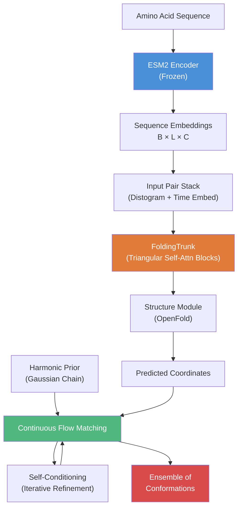

---
slug:1-overview
blog_type:normal
---


PepTron 是一个**序列到集合的生成模型**，能够预测蛋白质在整个有序-无序连续体上的结构集合。与单结构预测器（AlphaFold2, ESMFold）不同，PepTron 为每条序列生成多个构象，从而捕捉多结构域蛋白质和固有无序蛋白质（IDPs）的内在柔性——这是现代治疗药物中最常见的靶标类别。


来源: [README.md](/README.md#L1-L10)

## PepTron 解决的问题

传统结构预测器只能生成**单一静态构象**，这对于具有显著无序性的蛋白质而言是远远不够的。PepTron 通过将冻结的 **ESM2 蛋白质语言模型编码器**、可训练的**折叠主干**以及**连续流匹配**引擎相结合来解决此问题；该引擎将调和先验样本去噪为符合物理现实的构象。最终结果是：仅凭氨基酸序列，PepTron 便能生成包含多种多样且合理的三维结构的集合——在推理时无需 MSA 或模板。

| 能力 | 单结构预测器 | PepTron |
|---|---|---|
| 输出 | 单一静态构象 | 构象集合 |
| 有序结构域 | ✓ | ✓ |
| 无序区域 | ✗ (坍缩或缺失) | ✓ (物理多样的样本) |
| 多结构域蛋白质 | 部分 | ✓ (全覆盖无序性) |
| 输入要求 | MSA + 模板 (通常) | 仅序列 |

来源: [README.md](/README.md#L8-L11), [peptron/model/flow.py](/peptron/model/flow.py#L42-L69)

## 架构概览

PepTron 的架构是一个三阶段的流水线：**序列编码** → **成对表示 + 主干** → **流匹配推理**。该模型继承自 NVIDIA 的 BioNeMo ESM2 实现，并通过流匹配结构生成对其进行了扩展。



**阶段 1 — 序列编码**：ESM2 蛋白质语言模型（48 层，15B 参数级别）生成每个残基的嵌入。在 PepTron 训练期间，该编码器被**冻结**——仅训练结构头——从而实现了从预训练 PDB 检查点进行高效微调。

**阶段 2 — 折叠主干**：ESM2 嵌入被投影到序列（`c_s = 384`）和成对（`c_z = 128`）状态维度。`FoldingTrunk` 应用**三角自注意力块**（三角注意力 + 乘法更新）来更新这两种表示，随后通过 OpenFold 的 `StructureModule` 进行原子级坐标预测。

**阶段 3 — 流匹配引擎**：在推理时，PepTron 从**调和先验**（一种弹簧常数调整为主链键长约 3.8Å 的高斯链模型）中初始化样本，然后通过学习到的速度场，在 `steps` 积分步骤中对其进行迭代去噪，并可选择使用**自条件化**（将先前的预测作为输入反馈回去）。

来源: [peptron/model/model.py](/peptron/model/model.py#L56-L99), [peptron/model/trunk.py](/peptron/model/trunk.py#L70-L110), [peptron/model/flow.py](/peptron/model/flow.py#L42-L69), [peptron/model/flowmoco.py](/peptron/model/flowmoco.py#L72-L82)

## 项目结构

```
PepTron/
├── peptron/                    # 核心模型和训练逻辑
│   ├── model/
│   │   ├── config.py           # 所有模型/训练/推理配置
│   │   ├── model.py            # ESMFoldSeqModel + StructureHead
│   │   ├── trunk.py            # FoldingTrunk (三角注意力 + 结构模块)
│   │   ├── flow.py             # 带手动 HarmonicPrior 的流匹配
│   │   ├── flowmoco.py         # 通过 BioNeMo MoCo 框架实现的流匹配
│   │   ├── tri_self_attn_block.py  # TriangularSelfAttentionBlock
│   │   ├── input_stack.py      # 用于成对特征的 InputPairStack
│   │   ├── loss.py             # 多头损失函数
│   │   └── layers.py           # GaussianFourierProjection, Attention 等
│   ├── data/                   # 数据加载、管道和特征处理
│   ├── train.py                # 训练入口点
│   ├── infer.py                # 推理入口点
│   └── utils/                  # 回调、日志记录、张量工具
├── esm2/                       # ESM2 模型、分词器和训练脚本
├── dataprep/                   # 数据准备 (MSA 生成, PDB/IDRome 处理)
├── splits/                     # 训练/验证集划分的 CSV 文件 (IDRome + CAMEO2022)
├── run_peptron_train.sh        # 单节点训练脚本
├── run_peptron_distributed_train.sh  # 多节点训练脚本
└── run_peptron_infer.sh        # 推理脚本
```

来源: [peptron/model/config.py](/peptron/model/config.py#L1-L30), [peptron/train.py](/peptron/train.py#L1-L53), [peptron/infer.py](/peptron/infer.py#L1-L63)

## 核心技术栈

| 组件 | 技术 | 角色 |
|---|---|---|
| 语言模型 | ESM2 (通过 BioNeMo) | 冻结的序列编码器 |
| 折叠引擎 | OpenFold | 结构模块 + 三角基元 |
| 流匹配 | BioNeMo MoCo | 连续流匹配 + 调和先验 |
| 分布式训练 | NVIDIA Megatron + NeMo2 | 张量/流水线并行 |
| 精度 | bf16-mixed | 硬件高效的混合精度 |
| 等变性 | cuEquivariance 0.8.0 | SE(3)-等变注意力/乘法更新 |
| 容器 | NVIDIA Clara BioNeMo 2.7.1 | 基础 Docker 镜像 |

<CgxTip>PepTron 的流匹配使用两个可互换的后端：`flow.py` 手动实现了 `HarmonicPrior` 和插值，而 `flowmoco.py` 则委托给 BioNeMo 的 `ContinuousFlowMatcher` 和 `LinearHarmonicPrior`。基于 MoCo 的后端（`flowmoco.py`）是生产训练和推理的默认选项。</CgxTip>

<CgxTip>`peptron_o_mixed` 训练预设方案在 PDB (30%) 和 IDRome (70%) 混合数据上进行训练，其中 `noise_prob=0.5` 且 `self_cond_prob=0.5`，这对于同时学习有序和无序构象至关重要。</CgxTip>

来源: [Dockerfile](/Dockerfile#L1-L40), [peptron/model/flowmoco.py](/peptron/model/flowmoco.py#L72-L82), [peptron/model/config.py](/peptron/model/config.py#L125-L132)

## 两个预训练检查点

PepTron 在 [Zenodo](https://zenodo.org/records/17306061) 上提供了两个检查点：

- **PepTron-base**：仅在 PDB 上预训练。将其作为自定义微调的起点。
- **PepTron**：在混合的 PDB + IDRome-o 数据集上微调。**在整个蛋白质组上表现最佳**——这是推荐大多数用户使用的检查点。

来源: [README.md](/README.md#L33-L37)

## 后续步骤

从实际的环境设置开始，然后深入了解你感兴趣的架构概念：

1. **[快速开始](2-quick-start)** — 安装、配置并运行你的首次推理
2. **[预训练模型](3-pre-trained-models)** — 下载并使用官方检查点
3. **[架构概览](4-architecture-overview)** — 端到端的数据流和模块交互
4. **[连续流匹配](5-continuous-flow-matching)** — PepTron 如何生成多样的集合
5. **[调和先验采样](6-harmonic-prior-sampling)** — 基于物理启发的噪声分布
6. **[自条件化与推理调度](7-self-conditioning-and-inference-schedule)** — 推理时的迭代优化
7. **[ESM2 序列编码器](8-esm2-sequence-encoder)** — 冻结的语言模型表示
8. **[混合 PDB-IDRome 训练策略](12-mixed-pdb-idrome-training-strategy)** — 在有序 + 无序数据上进行训练
9. **[配置参考](16-configuration-reference)** — 完整的配置参数参考