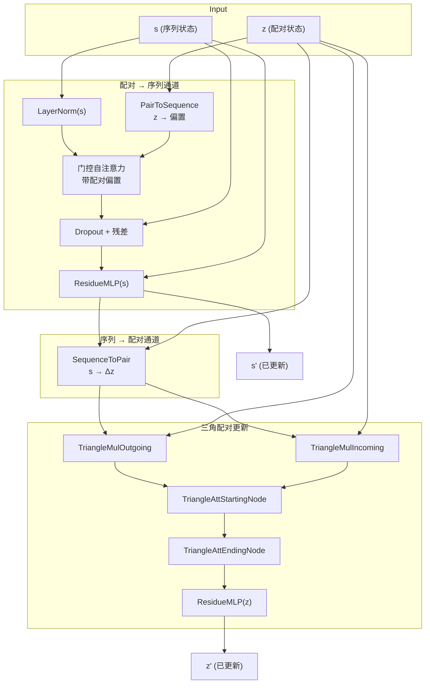

---
slug:10-triangular-self-attention-blocks
blog_type:normal
---

**TriangularSelfAttentionBlock** 是 PepTron `FoldingTrunk` 的核心迭代原语——一种双状态 Transformer 块，它通过交叉融合、三角推理和残差转换的精巧循环，联合优化逐残基的序列表示和残基对的几何表示。该模块默认堆叠 48 层，构成深度推理引擎，将 ESM2 嵌入与流匹配噪声条件转换为结构确定的配对表示，以供 OpenFold 的 `StructureModule` 使用。

## 双状态表示

每个块处理两个编码截然不同几何信息的耦合张量。**序列状态** `s ∈ ℝ^{B×L×C_s}` 携带逐残基特征——融合了 ESM2 语言模型表示、流匹配时间嵌入和循环结构信号。**配对状态** `z ∈ ℝ^{B×L×L×C_z}` 编码每对残基之间的关系信息——距离先验、相对位置嵌入和循环距离图信号。这两种表示并非独立处理；相反，块的架构确保了它们之间持续的双向信息流。

| 表示 | 符号 | 形状 | 默认维度 | 语义内容 |
|---|---|---|---|---|
| 序列状态 | `s` | B × L × C_s | 1024 | 逐残基嵌入 (ESM2 + 流时间 + 循环) |
| 配对状态 | `z` | B × L × L × C_z | 128 | 残基对几何特征 (距离 + 相对位置 + 距离图) |

来源: [tri_self_attn_block.py](peptron/model/tri_self_attn_block.py#L26-L50), [config.py](peptron/model/config.py#L599-L608)

## 块架构与信息流

前向传播遵循严格的顺序，建立了**配对→序列→配对**的信息循环。此顺序并非任意设定——它确保配对几何上下文在更新后的序列状态广播回配对表示之前，能够调制序列级注意力。单个块内的完整数据流如下：

`forward` 方法在运行时强制保持形状不变量：序列状态必须是 3 维，配对状态必须是 4 维，且两个输入的序列长度维度必须一致。布尔掩码 `B × L` 通过外积扩展为三角操作的轴向掩码 `B × L × L`：`tri_mask = mask.unsqueeze(2) * mask.unsqueeze(1)`。

来源: [tri_self_attn_block.py](peptron/model/tri_self_attn_block.py#L113-L193)

## 配对 → 序列：PairToSequence 与带偏置的注意力

第一阶段从配对表示中提取**配对注意力偏置**，并将其注入序列的标准多头自注意力中。`PairToSequence` 模块对 `z` 应用 `LayerNorm`，然后进行线性投影 `ℝ^{C_z} → ℝ^{H_s}`，其中 `H_s` 为序列注意力头数。这会生成形状为 `B × L × L × H_s` 的张量，直接加到注意力 logits 上，使结构/几何上下文能够调节残基间的注意力分配。

序列注意力本身是带有外部偏置机制的**门控多头自注意力**。给定投影的查询、键和值（通过单个 `Linear(C_s, 3·C_s)` 得到），注意力 logits 计算为 `a = (q · k^T) / √d + bias`。在 softmax 和值聚合后，输出被门控：`y = σ(g_proj(x)) ⊙ o_proj(attn_output)`，其中 `g_proj` 是一个已学习的线性门控，初始化时使其产生近似 1 的 sigmoid 值。此门控机制提供了梯度稳定性，并允许网络动态抑制注意力贡献。

| 参数 | 公式 | 默认值 |
|---|---|---|
| 序列头数 (H_s) | C_s / sequence_head_width | 1024 / 32 = **32** |
| 序列头宽度 | — | **32** |
| 配对偏置维度 | = H_s | **32** |

来源: [tri_self_attn_block.py](peptron/model/tri_self_attn_block.py#L146-L152), [layers.py](peptron/model/layers.py#L31-L92), [layers.py](peptron/model/layers.py#L156-L174)

## 序列 → 配对：SequenceToPair

在序列状态通过带偏置的自注意力和残差 MLP 更新后，`SequenceToPair` 模块将优化后的逐残基信息广播到配对表示中。这是通过**乘积与差分**机制实现的，该机制捕获残基对之间的乘法交互和加法差异：

1. 应用 `LayerNorm` 并投影：`s' = Linear(s) ∈ ℝ^{B×L×2·C_{inner}}`，其中 `C_{inner} = C_z / 2`
2. 拆分为两半：`q, k = chunk(s', 2)`
3. 计算外积与差分：`prod = q[:, None, :, :] ⊙ k[:, :, None, :]`，`diff = q[:, None, :, :] - k[:, :, None, :]`
4. 拼接并投影：`Δz = Linear(cat([prod, diff])) ∈ ℝ^{B×L×L×C_z}`

**乘积**项捕获协同交互（例如，相关的结构偏好），而**差分**项捕获非对称关系（例如，沿链的方向依赖）。随后配对状态更新为 `z ← z + Δz`。

来源: [layers.py](peptron/model/layers.py#L118-L153), [tri_self_attn_block.py](peptron/model/tri_self_attn_block.py#L155)

## 三角乘法更新

随着配对表示融入了序列级信息，两个**三角乘法更新**操作根据 3D 空间固有的几何约束重构配对特征。正是这些操作赋予了该模块其名称及最具特色的计算特性。

**出边**更新（`TriangleMultiplicationOutgoing`）沿 L×L 矩阵的一个轴处理配对表示，而**入边**更新（`TriangleMultiplicationIncoming`）沿转置轴处理。两者共同实施了一种**传递性**：若残基 *i* 接近 *k*，且残基 *k* 接近 *j*，则 (i, j) 配对表示应受此传递路径的影响。这对于将局部结构约束传播至全局折叠决策至关重要。

两个操作均从 OpenFold 的实现中导入，并支持可选的 **cu-equivariance** 加速后端（`use_cuequivariance_multiplicative_update`）。行结构与列结构化的 Dropout（`2 × dropout` 率）独立应用于每次更新，Dropout 掩码在整行或整列共享，以保持配对表示的轴向结构。

来源: [tri_self_attn_block.py](peptron/model/tri_self_attn_block.py#L157-L172), [tri_self_attn_block.py](peptron/model/tri_self_attn_block.py#L61-L68)

## 三角注意力

两次**三角注意力**操作紧随乘法更新之后，为配对表示提供了已学习的轴向注意力机制。`TriangleAttentionStartingNode` 沿 L×L 配对矩阵的行执行注意力（固定“起始”残基索引），而 `TriangleAttentionEndingNode` 沿列执行注意力（固定“结束”残基索引）。来自 OpenFold 的三角注意力模块使用配对状态本身构建**三角偏置**——一种依赖位置的注意力调制形式，其中位置 (i, j, k) 的偏置取决于 (i, k) 和 (k, j) 处的配对特征，进一步强化了几何传递性。

| 参数 | 公式 | 默认值 |
|---|---|---|
| 配对头数 (H_z) | C_z / pairwise_head_width | 128 / 32 = **4** |
| 配对头宽度 | — | **32** |
| 无穷值钳位 (inf) | — | **1e9** |

与乘法更新类似，三角注意力支持 **cu-equivariance** 加速后端（`use_cuequivariance_attention`），并包装了轴向 Dropout（起始节点按行，结束节点按列）。`chunk_size` 参数控制内存高效的分块计算，将长序列的内存占用从 O(L²) 降至约 O(L)。

来源: [tri_self_attn_block.py](peptron/model/tri_self_attn_block.py#L173-L188), [tri_self_attn_block.py](peptron/model/tri_self_attn_block.py#L69-L80)

## 残差 MLP 与输出

序列和配对状态均通过 `ResidueMLP` 转换层进行定稿——这是带有预归一化、ReLU 激活和残差连接的双层前馈网络：`x ← x + Dropout(ReLU(LayerNorm(x) · W₁) · W₂)`。两者的内部维度均为 `4 × embed_dim`，提供了 Transformer 架构中常见的标准 4× 扩展因子。序列 MLP 按残基操作（在 `B × L × C_s` 的最后一个维度上），配对 MLP 按配对操作（在 `B × L × L × C_z` 的最后一个维度上），两者共享同一个 `ResidueMLP` 类。

来源: [layers.py](peptron/model/layers.py#L177-L190), [tri_self_attn_block.py](peptron/model/tri_self_attn_block.py#L82-L83), [tri_self_attn_block.py](peptron/model/tri_self_attn_block.py#L190-L193)

## 零初始化：渐进式解锁模式

一个关键的架构细节是块内**所有输出投影的零初始化**。每个贡献残差更新的模块——序列注意力输出投影、`SequenceToPair` 输出、`PairToSequence` 线性层、两个三角乘法更新的 `linear_z` 投影、两个三角注意力的 `linear_o` 投影，以及两个 MLP 的最终线性层——在构造时其权重和偏置均被显式设为零。

这意味着在初始化时，每个 `TriangularSelfAttentionBlock` 的行为等同于**恒等函数**：`s' = s`，`z' = z`。梯度流立即开始，但网络从堆叠块不施加任何变换的状态起步。这是一项成熟的技术（有时被称为“渐进式解锁”或“零初始化残差”），它通过防止深度堆叠的随机初始化模块产生破坏性的巨大更新来稳定早期训练。因此，48 层堆叠可以在不受梯度爆炸问题困扰的情况下进行训练，而此类深度通常会引发该问题。

下表列举了所有零初始化的参数及其作用：

| 模块 | 零初始化参数 | 作用 |
|---|---|---|
| `tri_mul_in` | `linear_z.weight`, `linear_z.bias` | 入边乘法更新初始为恒等 |
| `tri_mul_out` | `linear_z.weight`, `linear_z.bias` | 出边乘法更新初始为恒等 |
| `tri_att_start` | `mha.linear_o.weight`, `mha.linear_o.bias` | 起始节点注意力初始为恒等 |
| `tri_att_end` | `mha.linear_o.weight`, `mha.linear_o.bias` | 结束节点注意力初始为恒等 |
| `sequence_to_pair` | `o_proj.weight`, `o_proj.bias` | 序列→配对广播初始为恒等 |
| `pair_to_sequence` | `linear.weight` | 配对→序列偏置初始为恒等 |
| `seq_attention` | `o_proj.weight`, `o_proj.bias` | 序列注意力初始为恒等 |
| `mlp_seq` | `mlp[-2].weight`, `mlp[-2].bias` | 序列 MLP 初始为恒等 |
| `mlp_pair` | `mlp[-2].weight`, `mlp[-2].bias` | 配对 MLP 初始为恒等 |

来源: [tri_self_attn_block.py](peptron/model/tri_self_attn_block.py#L90-L107)

## 结构化轴向 Dropout

该块采用三种不同的 Dropout 机制，每种旨在保持表示的几何结构：

- **标准 Dropout**（`self.drop`）：以 `dropout` 概率应用于序列注意力输出。在所有位置共享。
- **行级 Dropout**（`self.row_drop`）：以 `2 × dropout` 概率应用，掩码沿维度 2（L×L 配对矩阵的“列”索引）共享。给定行中的所有位置接受相同的 Dropout 决策。
- **列级 Dropout**（`self.col_drop`）：以 `2 × dropout` 概率应用，掩码沿维度 1（“行”索引）共享。给定列中的所有位置接受相同的 Dropout 决策。

此轴向 Dropout 策略对三角操作至关重要：沿某轴共享掩码可确保沿该轴计算的乘法更新或注意力看到配对表示的一致子集，而非独立丢弃条目从而破坏轴向计算结构。轴向 Dropout 的加倍概率补偿了掩码共享造成的有效 Dropout 概率降低。硬断言（`dropout < 0.4`）防止加倍的轴向概率超过 0.8。

来源: [tri_self_attn_block.py](peptron/model/tri_self_attn_block.py#L85-L88), [layers.py](peptron/model/layers.py#L95-L115)

## cu-Equivariance 加速

两个可选的优化后端可替换三角操作的标准 PyTorch 实现：

| 标志 | 替换对象 | 后端 |
|---|---|---|
| `use_cuequivariance_attention` | `TriangleAttentionStartingNode`, `TriangleAttentionEndingNode` | `cuequivariance-torch` |
| `use_cuequivariance_multiplicative_update` | `TriangleMultiplicationOutgoing`, `TriangleMultiplicationIncoming` | `cuequivariance-torch` |

这些标志可在构造时设置，或通过 `peptron.cueq_override` 中的模块级变量 `_CUEQ_ATTN_OVERRIDE` 和 `_CUEQ_MUL_OVERRIDE` 全局覆盖。全局覆盖机制专门用于处理**检查点加载**：已保存的模型在其配置中可能包含 `use_cuequivariance=False`，但推理可能从加速后端中受益。当设为非 `None` 值时，覆盖优先生效，从而允许在不修改检查点的情况下进行运行时切换。

来源: [tri_self_attn_block.py](peptron/model/tri_self_attn_block.py#L109-L131), [cueq_override.py](peptron/cueq_override.py#L15-L28)

## FoldingTrunk 中的配置与部署

`FoldingTrunk` 将 `num_blocks` 个相同的 `TriangularSelfAttentionBlock` 模块实例化为 `nn.ModuleList`，每个块接收相同的超参数。PepTron 主干的默认配置如下：

| 配置键 | 默认值 | 导出量 |
|---|---|---|
| `num_blocks` | 48 | — |
| `sequence_state_dim` (C_s) | 1024 | — |
| `pairwise_state_dim` (C_z) | 128 | — |
| `sequence_head_width` | 32 | H_s = 32 头 |
| `pairwise_head_width` | 32 | H_z = 4 头 |
| `position_bins` | 32 | 相对位置嵌入范围 |
| `dropout` | 0 | 轴向 Dropout = 0 |
| `chunk_size` | None | 无分块（完全物化） |

这些块在 `trunk_iter` 中顺序执行，由 OpenFold 的 `checkpoint_blocks` 工具以 `blocks_per_ckpt=1` 包装以进行梯度检查点化——用每个块的一次额外前向传播换取约 48 倍的峰值激活内存降低。来自 `RelativePosition` 的配对位置嵌入在块执行前被加到 `z` 中，提供三角操作随后优化的初始距离感知偏置。

<CgxTip>当设置 `chunk_size`（例如 128）时，每个轴向注意力在 128 长度的序列块上计算，将峰值内存从 O(L²) 降至 O(L·chunk_size)。这对于超过约 500 个残基的序列推理至关重要。</CgxTip>

<CgxTip>零初始化模式意味着在初始化时增加更多块不会造成负面影响——一个全新初始化的 48 块堆叠在功能上等同于 0 块堆叠。这使得无需逐层学习率调度即可稳定训练极深的配对堆叠。</CgxTip>

来源: [config.py](peptron/model/config.py#L599-L628), [trunk.py](peptron/model/trunk.py#L70-L98), [trunk.py](peptron/model/trunk.py#L149-L158)

## 接下来去哪

三角自注意力块是结构预测前的最终变换。要了解其输入是如何组装的，请参阅 [Structure Head and FoldingTrunk](9-structure-head-and-foldingtrunk)。关于训练这 48 个块的损失情况，请查阅 [Loss Functions and Validation Metrics](13-loss-functions-and-validation-metrics)。关于使训练 48 个深度块成为可行的分布式基础设施，请参阅 [Megatron Distributed Training](14-megatron-distributed-training)。