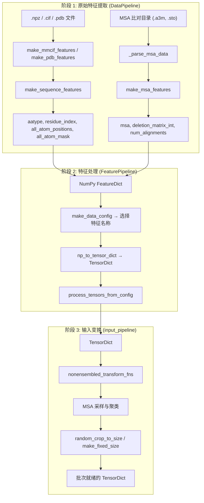

---
slug:11-data-pipeline-and-feature-processing
blog_type:normal
---

PepTron 的数据流水线将原始蛋白质结构——包括折叠的 PDB 条目和无序的 IDRome 构象系综——转换为流匹配引擎和 ESM2 序列编码器所需的张量特征。该流水线被组织为三阶段架构：**原始特征提取** (`DataPipeline`)、**特征处理与张量化** (`FeaturePipeline`) 以及 **输入变换与裁剪** (`input_pipeline`)。每个阶段相互解耦且可组合，支持混合的 PDB-IDRome 训练策略，在该策略下，无序构象系综和晶体结构流经相同的处理路径，并采用特定模式的增强。

来源: [data_pipeline.py](/peptron/data/data_pipeline.py#L1-L131), [feature_pipeline.py](/peptron/data/feature_pipeline.py#L1-L131), [input_pipeline.py](/peptron/data/input_pipeline.py#L1-L322)

## 流水线架构概述

端到端的数据流从磁盘上的结构文件出发，经过 NumPy 特征字典，转化为带有位置编码和掩码的 PyTorch 张量，最后经过裁剪和填充，生成适合 Megatron 分布式训练的固定大小批次。

`DataPipeline` 类作为阶段 1 的编排器，将异构特征组装为统一的 `FeatureDict`（即 `Mapping[str, np.ndarray]`）。`FeaturePipeline` 类封装了阶段 2 和阶段 3，接收原始 NumPy 字典并输出完全变换后的 PyTorch 张量。这种分离确保了原始特征可以被缓存到磁盘（以 `.npz` 文件形式），而阶段 3 中的随机变换则在每个 epoch 重新应用。

来源: [data_pipeline.py](/peptron/data/data_pipeline.py#L409-L616), [feature_pipeline.py](/peptron/data/feature_pipeline.py#L115-L131)

## 阶段 1: 原始特征提取

### 序列特征

每个蛋白质条目都以 `make_sequence_features` 开始，该函数从原始氨基酸字符串构建残基级表示。该函数在特征字典中生成六个键：

| 特征键 | 形状 | 描述 |
|---|---|---|
| `aatype` | `[num_res, 21]` | 20 种标准残基 + X（未知）的独热编码 |
| `between_segment_residues` | `[num_res]` | 填零的片段边界指示符 |
| `domain_name` | `[1]` (对象) | 编码的 PDB ID + 链标识符 |
| `residue_index` | `[num_res]` | 整数残基位置（从 0 开始索引） |
| `seq_length` | `[num_res]` | 每个残基重复的总序列长度 |
| `sequence` | `[1]` (对象) | 编码的原始序列字符串 |

独热映射使用 `restype_order_with_x`，它映射所有 20 种标准氨基酸加上一个未知 token。这是下游 `target_feat` 和 `msa_feat` 变换所使用的规范表示。

来源: [data_pipeline.py](/peptron/data/data_pipeline.py#L30-L49)

### 结构特征 (mmCIF 和 PDB 路径)

两条并行的提取路径处理不同的结构来源。`make_mmcif_features` 处理由 OpenFold 的 `mmcif_parsing` 模块解析的 mmCIF 对象，为 37 原子表示提取 `all_atom_positions`（形状为 `[num_res, 37, 3]`）和 `all_atom_mask`（形状为 `[num_res, 37]`），以及元数据字段 `resolution` 和 `release_date`。对于 mmCIF 条目（实验结构），`is_distillation` 标志被设置为 `0.0`。

`make_pdb_features` 处理由 PDB 解析的 `Protein` 对象，并引入**基于置信度的掩码**：当 `is_distillation=True` 时，`b_factors` 低于 `confidence_threshold`（默认为 50）的残基会将其原子掩码置零。这确保了低置信度的蒸馏集预测不会贡献于监督损失项——这是自蒸馏训练数据质量的关键机制。

来源: [data_pipeline.py](/peptron/data/data_pipeline.py#L52-L141)

### MSA 特征

`make_msa_features` 将多序列比对转换为整数编码的数组。它对所有提供的 MSA 中的序列进行去重，将每个残基转换为其 `HHBLITS_AA_TO_ID` 整数索引，并产生三个输出键：

| 特征键 | 形状 | 描述 |
|---|---|---|
| `msa` | `[num_alignments, num_res]` | 整数编码的 MSA 行 |
| `deletion_matrix_int` | `[num_alignments, num_res]` | 每个位置的删除计数 |
| `num_alignments` | `[num_res]` | 每个残基的总比对深度 |

MSA 数据从 `.a3m` 文件（通过 `parse_a3m`）和 `.sto` Stockholm 文件（通过 `parse_stockholm`）中解析，两者均由 `AlignmentRunner` 生成。如果未找到 MSA 数据，则会插入一个仅包含查询序列的**虚拟 MSA** 作为后备，确保流水线在面对没有外部比对的序列时绝不会失败。

来源: [data_pipeline.py](/peptron/data/data_pipeline.py#L143-L176), [data_pipeline.py](/peptron/data/data_pipeline.py#L522-L561)

### IDRome 构象系综处理

一条独特的预处理路径处理来自 IDRome 数据库的内在无序蛋白质构象系综。`prep_idrome.py` 脚本使用 MDTraj 加载分子动力学轨迹（具有 `.pdb` 拓扑的 `.xtc` 文件），遍历各帧，并将所有构象的 `all_atom_positions` 堆叠成一个形状为 `[num_frames, num_res, 37, 3]` 的单一数组。这种堆叠表示被保存为压缩的 `.npz` 文件，为流匹配训练目标保留了完整的构象系综，在该目标中模型学习从结构分布中进行采样。

来源: [prep_idrome.py](/dataprep/prep_idrome.py#L148-L182)

## 阶段 2: 特征处理与张量化

### 配置驱动的特征选择

`make_data_config` 根据模式（`train`、`eval`、`predict`）和配置标志来解析需要提取的特征。特征名称列表由三个来源组装而成：

1. **无监督特征** (`cfg.common.unsupervised_features`)：始终包含——序列、MSA 和结构掩码特征
2. **模板特征** (`cfg.common.template_features`)：仅在 `cfg.common.use_templates` 为真时包含
3. **监督特征** (`cfg.supervised.supervised_features`)：仅在 `cfg[mode].supervised` 为真时包含——真实位置、帧和扭转角

如果 `mode_cfg.crop_size` 为 `None`，则会被动态设置为实际序列长度，意味着不进行裁剪（用于预测模式）。

来源: [feature_pipeline.py](/peptron/data/feature_pipeline.py#L51-L70)

### NumPy 到张量的转换

`np_to_tensor_dict` 执行从 NumPy 到 PyTorch 的桥接，仅转换选择列表中命名的特征，并丢弃所有其他特征。这种过滤对内存效率至关重要：原始特征字典可能包含大型 MSA 数组和在某些模式下不必要的模板特征。在此阶段，`deletion_matrix_int` 键被重命名为 `deletion_matrix` 并转换为 `float32`，以符合下游的期望。

来源: [feature_pipeline.py](/peptron/data/feature_pipeline.py#L30-L48)

### 钳位 FAPE 控制

张量处理后，`np_example_to_features` 注入 `use_clamped_fape` 张量——这是 FAPE 损失的二元控制信号。在训练期间，每个样本以 `cfg.supervised.clamp_prob` 的概率随机钳位 FAPE，生成形状为 `[max_recycling_iters + 1]` 的张量。在评估期间，钳位始终被禁用（全为零）。这种随机钳位是从 AlphaFold2 继承的关键正则化技术。

来源: [feature_pipeline.py](/peptron/data/feature_pipeline.py#L73-L112)

## 阶段 3: 输入变换流水线

变换流水线将一系列精心排序的可组合函数应用于张量字典。这些函数分为**非系综变换**（每个样本应用一次），并由 `nonensembled_transform_fns` 编排。

### 变换执行顺序

变换按照尊重数据依赖的严格顺序执行：

| 阶段 | 变换 | 目的 |
|---|---|---|
| **类型转换与校正** | `cast_to_64bit_ints`, `correct_msa_restypes`, `squeeze_features` | 类型归一化与 MSA 残基校正 |
| **掩码** | `randomly_replace_msa_with_unknown(0.0)`, `make_seq_mask`, `make_msa_mask` | 构建序列和 MSA 的布尔掩码 |
| **特征分析** | `make_hhblits_profile` | 从 MSA 计算位置特异性评分矩阵 |
| **模板** | `fix_templates_aatype`, `make_template_mask`, `make_pseudo_beta("template_")` | 处理模板特征（条件执行） |
| **监督** | `make_atom14_positions`, `atom37_to_frames`, `atom37_to_torsion_angles`, `make_pseudo_beta`, `get_backbone_frames`, `get_chi_angles` | 真实结构特征（条件执行） |
| **MSA 采样** | `sample_msa`, `make_masked_msa`, `nearest_neighbor_clusters`, `summarize_clusters` | MSA 子采样与聚类特征计算 |
| **裁剪** | `crop_extra_msa`, `random_crop_to_size` | 空间和 MSA 维度缩减 |
| **填充** | `make_fixed_size` | 填充至固定张量维度以进行批处理 |

来源: [input_pipeline.py](/peptron/data/input_pipeline.py#L146-L285)

### 随机裁剪

`random_crop_to_size` 沿残基维度执行随机空间裁剪。给定 `crop_size` 参数，它选择一个连续的残基窗口，根据其形状模式将相同的裁剪应用于所有特征张量。模板特征被特殊处理：当启用 `subsample_templates` 时，模板在裁剪前被随机置换，以近似均匀的模板子采样。当 `use_clamped_fape` 处于活动状态时，裁剪锚点是确定性的（右锚定），确保同一裁剪的钳位和非钳位版本对齐。

来源: [input_pipeline.py](/peptron/data/input_pipeline.py#L25-L106)

### 固定大小填充

`make_fixed_size` 将所有张量填充至批量 GPU 计算所需的统一维度。填充由 `shape_schema` 引导，该模式将每个特征键映射到符号形状（使用 `NUM_RES`、`NUM_MSA_SEQ`、`NUM_EXTRA_SEQ`、`NUM_TEMPLATES` 占位符）。每个维度都被填充到配置的最大值，默认填充值为零。`extra_cluster_assignment` 键被明确排除在填充之外，以避免向加速器进行不必要的数据传输。

来源: [input_pipeline.py](/peptron/data/input_pipeline.py#L110-L143)

## 数据集类与采样

### OpenFoldSingleDataset

主要数据集类从磁盘加载预处理的 `.npz` 文件。其 `__getitem__` 方法执行两阶段检索：(1) 从 `.npz` 文件加载结构特征，可选择对 IDRome 构象系综进行构影子采样，(2) 通过 `DataPipeline._process_msa_feats` 从比对目录加载 MSA 特征。这两个特征字典在传递给 `FeaturePipeline` 之前进行合并。

对于 `all_atom_positions` 形状为 `[num_confs, num_res, 37, 3]` 的 IDRome 数据，有两种子采样策略可用：`subsample_pos=True` 在每次访问时随机选择一个构象（随机增强），而 `num_confs=N` 确定性地索引构象，通过系综基数扩展有效数据集大小。

来源: [data.py](/peptron/data/data.py#L42-L211)

### OpenFoldDataset (随机过滤)

`OpenFoldDataset` 使用 AlphaFold2 风格的随机过滤封装多个组成数据集。应用两种过滤器类型：

- **确定性过滤器** (`deterministic_train_filter`)：基于分辨率 > 9 Å 或单氨基酸比例 > 0.8 的硬拒绝
- **随机过滤器** (`get_stochastic_train_filter_prob`)：与簇大小（去重）和序列长度（长度平衡采样）成反比的概率接受

每个 epoch，数据集通过根据配置的 `probabilities`（例如，PDB 与蒸馏混合比例）采样数据集索引来“重掷”，然后对每个候选样本应用两种过滤器类型。

来源: [data.py](/peptron/data/data.py#L214-L347)

### OpenFoldBatchCollator

整理器通过将每个张量维度填充到批次中观察到的最大大小，来处理批次中的变长蛋白质。它使用 `dict_multimap` 模式递归地将 `pad_and_stack` 应用于每个张量叶节点，采用零填充和一致的秩验证。这至关重要，因为在预测模式下 `crop_size` 可能等于原生序列长度，从而产生无法简单堆叠的不同大小张量。

来源: [data.py](/peptron/data/data.py#L349-L397)

## 数据模块与分布式集成

### ESMFoldDataModule

`ESMFoldDataModule` 继承自 NVIDIA NeMo/BioNeMo 框架的 `MegatronDataModule`，将 PepTron 的数据流水线与 Megatron 的分布式数据并行相集成。它将数据集封装在 `MultiEpochDatasetResampler` 和 `IdentityMultiEpochDatasetWrapper` 中，以实现高效的多 epoch 迭代，而无需重新洗牌的开销。

`structure_data_step` 函数实现了**流水线阶段感知的键过滤**：只有 `input_ids` 和元数据键被路由到第一个流水线阶段（ESM2 编码器），而完整的结构特征集（原子位置、刚体组、MSA 特征、流匹配输入）被路由到最后一个流水线阶段。这最大限度地减少了流水线并行训练中的阶段间通信。

来源: [datamodule.py](/peptron/data/datamodule.py#L38-L131), [datamodule.py](/peptron/data/datamodule.py#L133-L297)

### 按流水线阶段的特征路由

数据步骤将特征分类为与 Megatron 流水线并行阶段对齐的三组：

| 阶段 | 特征 |
|---|---|
| **第一阶段** (ESM2 编码器) | `input_ids`, `name`, `resolution` |
| **最后阶段** (结构头) | `aatype`, `residue_index`, `atom_mask`, `seq_length`, `seq_mask`, `bert_mask`, `target_feat`, atom14/atom37 掩码与映射, `use_clamped_fape` |
| **最后阶段** (真实值) | `all_atom_positions`, `all_atom_mask`, `atom14_gt_positions`, `atom14_alt_gt_positions`, 刚体组帧, `backbone_rigid_tensor`, `chi_angles_sin_cos`, `ref_prot` |
| **最后阶段** (CFM 输入) | `msa_mask`, `msa_row_mask`, `pseudo_beta`, `extra_msa`, `extra_has_deletion`, `extra_deletion_value`, `msa_feat` |

像 `name` 这样的字符串值键在 GPU 传输之前通过 `str_to_ascii` 转换为 ASCII 整数张量，因为 Megatron 的通信原语需要数值张量。

来源: [datamodule.py](/peptron/data/datamodule.py#L60-L130)

## 蛋白质表示

`peptron/data/protein.py` 中的 `Protein` 数据类提供了贯穿推理和评估过程使用的规范内存中表示。它存储 `atom_positions` (`[num_res, 37, 3]`)、`aatype` (`[num_res]`)、`atom_mask` (`[num_res, 37]`)、`residue_index`、`b_factors` 以及用于多链预测的可选 `chain_index`。工厂函数 `from_pdb_string`、`from_mmcif_string` 和 `from_dict` 提供从各种输入格式的构建，而 `output_to_protein` 将模型输出字典转换回 `Protein` 实例，用于 PDB 序列化和度量计算。

来源: [protein.py](/peptron/data/protein.py#L31-L112)

## 序列编码工具

`misc.py` 模块提供 `encode_sequence` 和 `batch_encode_sequences`，用于带链连接器的多链序列编码。当存在多条链时（在序列字符串中由 `:` 分隔），在链之间插入 25 个残基的甘氨酸连接器，并且每条链的 `residue_index` 偏移 512 以防止索引冲突。`linker_mask` 张量标记真实残基 (1.0) 与连接器残基 (0.0)，从而实现对人工连接器位置的损失掩码。`collate_dense_tensors` 函数处理变长批次填充，镜像了 `OpenFoldBatchCollator` 中的整理逻辑。

来源: [misc.py](/peptron/data/misc.py#L10-L82)

<CgxTip>在处理 IDRome 构象系综数据时，请注意 `.npz` 文件中的 `all_atom_positions` 存储为 `[num_confs, num_res, 37, 3]`。`OpenFoldSingleDataset` 上的 `subsample_pos=True` 标志在每次 `__getitem__` 调用时随机选择一个构象，在训练期间提供隐式数据增强——每个 epoch 都会看到来自每个系综的不同随机构象。</CgxTip>

<CgxTip>`structure_data_step` 函数是 PepTron 的 OpenFold 风格特征流水线与 Megatron 流水线并行训练之间的关键集成点。特征按流水线阶段显式划分：只有 `input_ids` 流向阶段 0 (ESM2)，而所有结构和 CFM 特征流向最后阶段。添加新特征键时，必须在相应的 `required_keys.update()` 块中注册它们，否则它们会在分布式训练期间被静默丢弃。</CgxTip>

## 延伸阅读

数据流水线直接馈入训练策略和损失计算。有关在训练期间控制如何混合这两个数据源的混合 PDB-IDRome 课程，请参阅[混合 PDB-IDRome 训练策略](12-mixed-pdb-idrome-training-strategy)。关于处理后的特征如何被损失函数消耗，特别是结构特征上的流匹配损失，请参阅[损失函数与验证指标](13-loss-functions-and-validation-metrics)。有关执行具有上述阶段感知特征路由的流水线并行训练的 Megatron 分布式基础设施，请参阅[Megatron 分布式训练](14-megatron-distributed-training)。