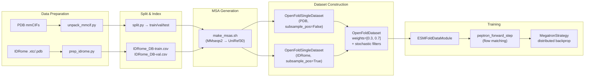

---
slug:12-mixed-pdb-idrome-training-strategy
blog_type:normal
---


PepTron的核心训练创新在于**将两个结构上异质的数据域进行概率混合**——即实验解析的PDB链和构象无序的IDRome系综——并将其整合至单一的训练循环中。该策略使得统一模型能够从共享的权重集中，同时学习折叠结构预测与内禀无序区（IDR）系综生成，这一过程受各数据集的采样概率和特定域的随机滤波器所控制。

## 双域数据组合

训练集由两个 `OpenFoldSingleDataset` 实例的**加权混合**构成，并在 `OpenFoldDataset` 容器下实现统一。每个域各自提供其数据目录、MSA比对目录和链元数据CSV，但共享相同的特征流水线与模型配置：

```python
pdb_trainset = OpenFoldSingleDataset(
    data_dir=config.training["train_data_dir_pdb"],
    alignment_dir=config.training["train_msa_dir_pdb"],
    pdb_chains=pdb_chains,
    config=config.data, mode='train',
    subsample_pos=config.training["sample_train_confs_pdb"],
)

idp_trainset = OpenFoldSingleDataset(
    data_dir=config.training["train_data_dir_idp"],
    alignment_dir=config.training["train_msa_dir_idp"],
    pdb_chains=idp_chains,
    config=config.data, mode='train',
    subsample_pos=config.training["sample_train_confs_idp"],
)

trainset = OpenFoldDataset(
    [pdb_trainset, idp_trainset],
    [config.training["dataset_prob_pdb"], config.training["dataset_prob_idp"]],
    config.training["train_epoch_len"]
)
```

默认混合权重为 **PDB = 0.3** 与 **IDRome = 0.7**，使训练偏向无序域。这反映出这样一个事实：IDRome样本提供了多重构象监督（系综层面的结构多样性），这对于流匹配目标至关重要；而PDB数据则提供了强劲的单结构锚点，用以稳定主链几何学习。

来源: [train.py](peptron/train.py#L265-L289), [config.py](peptron/model/config.py#L802-L803)

## 随机数据集融合：OpenFoldDataset

`OpenFoldDataset` 类通过三层随机操作实现融合机制，每个epoch产出 `epoch_len` 个总样本：

```mermaid
flowchart TD
    A["Epoch Start: <b>reroll()</b>"] --> B["torch.multinomial<br/>over dataset probabilities<br/>(PDB: 0.3, IDRome: 0.7)"]
    B --> C{"Dataset Index?"}
    C -->|"PDB (idx=0)"| D["looped_samples(0)<br/>PDB candidate cache"]
    C -->|"IDP (idx=1)"| E["looped_samples(1)<br/>IDRome candidate cache"]
    D --> F["Deterministic Filter<br/>resolution ≤ 9Å<br/>no single-AA dominance"]
    E --> F
    F --> G["Stochastic Filter<br/>cluster-size weighting<br/>length-dependent weighting"]
    G --> H["torch.multinomial<br/>accept/reject per candidate"]
    H --> I["Accepted sample →<br/>(dataset_idx, datapoint_idx)"]
    I --> J["Append to self.datapoints"]
    J --> K{epoch_len reached?}
    K -->|No| B
    KD -->|Yes| L["Epoch ready:<br/>__getitem__ dispatches to<br/>constituent dataset@]
```

**步骤 1 — 数据集选择** (`reroll`)：在epoch初始化时，`torch.multinomial` 根据数据集概率向量 `[0.3, 0.7]` 抽取 `epoch_len` 个样本，生成一个数据集索引序列。这决定了每个epoch中各域提供的样本数量。

**步骤 2 — 确定性滤波**：每个候选链必须通过 `deterministic_train_filter`，该滤波器会拒绝分辨率 > 9.0 Å 或单一氨基酸占比超过序列80%的条目。此预滤波过程会无差别地剔除低质量和退化序列，不论其属于哪个域。

**步骤 3 — 随机滤波** (`get_stochastic_train_filter_prob`)：通过初筛的候选样本将进一步接受基于两个乘性因子的概率性接受/拒绝判定： 对 **聚类规模反比加权** ——来自较大MMseqs2聚类（序列一致性阈值为0.4）的序列将被按比例降采样，以减少同源链的冗余； 对 **依赖长度的加权** ——计算公式为 `(max(min(L, 512), 256)) / 512`，该公式适度提升256–512残基范围内序列的权重，同时降低极短链的权重。

来源: [data.py](peptron/data/data.py#L258-L346), [data.py](peptron/data/data.py#L214-L255)

## 特定域的数据处理

这两个域在真实结构表示上存在根本差异，该差异通过不同的 `subsample_pos` 与 `num_confs` 策略进行处理：

| 方面 | PDB 域 | IDRome 域 |
|--------|-----------|---------------|
| **真实值** | 单一静态结构 | 多帧构象系综 |
| **存储格式** | `all_atom_positions` 形状为 `[N_res, 37, 3]` 的 `.npz` | `all_atom_positions` 形状为 `[N_frames, N_res, 37, 3]` 的 `.npz` |
| **`subsample_pos`** | `False` — 使用单一结构 | `True` — 每epoch随机采样一帧 |
| **训练样本** | 每条链确定 | 随机 — 每次访问生成不同构象体 |
| **数据准备** | 标准mmCIF → 通过OpenFold生成特征 | MD轨迹 (`.xtc`/`.pdb`) → 通过 `prep_idrome.py` 生成逐帧特征 |

当 `subsample_pos=True`（IDRome）时，`__getitem__` 通过 `np.random.randint(0, N)` 随机选择一个帧索引，对堆叠的 `all_atom_positions` 数组进行索引。这意味着**同一IDRome链在不同epoch中会产生不同的训练目标**，从而教导模型预测完整的构象分布而非单一结构。

在验证方面，当前默认采用**纯PDB验证**（CAMEO2022测试集）。可选的IDRome验证集（`idp_valset`）已定义但在训练循环中被注释掉，这表明基于PDB的结构指标（RMSD, GDT-TS）是主要的泛化信号。

来源: [data.py](peptron/data/data.py#L168-L196), [train.py](peptron/train.py#L291-L313), [prep_idrome.py](dataprep/prep_idrome.py#L148-L182)

## IDRome 数据准备流水线

IDRome域需要专门的预处理，以将分子动力学轨迹转换为兼容OpenFold的特征文件。`prep_idrome.py` 脚本驱动了该转换过程：

1. **输入**：由 `.pdb` 拓扑文件和 `.xtc` 轨迹文件（压缩的MD帧）定义的IDRome条目
2. **逐帧提取**：每一帧被保存至临时PDB中，随后被解析为 `Protein` 数据类，并通过 `make_protein_features`（OpenFold的标准特征提取器）进行特征化
3. **系综堆叠**：所有帧的 `all_atom_positions` 被堆叠至单一的 `[N_frames, N_res, 37, 3]` 张量中，替换原有的逐帧位置数组
4. **输出**：一个包含完整系综及标准OpenFold特征的压缩 `.npz` 文件

该过程遍历列于拆分CSV中的条目（例如，包含约20,159个条目的 `splits/IDRome_DB-train.csv`，以及包含约2,242个条目的 `splits/IDRome_DB-val.csv`），每个条目均标注了UniProt标识符、序列（`seqres`）及链长。

来源: [prep_idrome.py](dataprep/prep_idrome.py#L148-L182), [IDRome_DB-train.csv](splits/IDRome_DB-train.csv#L1-L10)

## 训练配置预设

`peptron_o_mixed` 预设（在训练入口点加载的默认配置）配置了混合训练机制：

```python
# peptron_o_mixed preset
c.model.template.enabled = False
c.data.common.max_recycling_iters = 0
c.data.common.use_templates = False
c.data.train.crop_size = 512
c.model.flow_matching.noise_prob = 0.5
c.model.flow_matching.self_cond_prob = 0.5
c.model.flow_matching.extra_input_prob = 0.5
```

这与用于后期微调的 `peptron_o_pdb_idrome` 预设形成对比，后者转向**更高的噪声条件化**（`noise_prob = 0.9`）并**禁用自条件化**（`self_cond_prob = 0.0`），体现了从均衡探索到聚焦去噪精修的课程学习过程：

| 预设 | `noise_prob` | `self_cond_prob` | `extra_input_prob` | 训练阶段 |
|--------|-------------|-----------------|-------------------|---------------|
| `peptron_o_mixed` | 0.5 | 0.5 | 0.5 | 初始混合训练 |
| `peptron_o_pdb_idrome` | 0.9 | 0.0 | 0.5 | 微调 |
| `peptron_o_pdb_idrome_violation` | 0.9 | 0.0 | 0.5 | 违反权重微调 |

**512的裁剪尺寸**在训练期间统一应用于两个域，确保了无论样本源自PDB还是IDRome，都能保持一致的内存占用。

来源: [config.py](peptron/model/config.py#L125-L149), [config.py](peptron/model/config.py#L691-L696)

## 链滤波与时间截断

对于PDB域，当 `filter_chains=True`（默认值）时，会应用额外的**时间截断滤波器**。在从MMseqs2生成的聚类文件中加载聚类信息后，PDB链将被滤波，以排除任何 `release_date >= train_cutoff`（默认值：`"2020-05-01"`）的链。此举可防止来自可能出现在验证集（CAMEO2022）中的结构的信息泄漏，并实现了基于时间的训练/测试拆分：

```python
if filter_chains:
    clusters = load_clusters(config.training["train_clusters"])
    pdb_chains = pdb_chains.join(clusters)
    pdb_chains = pdb_chains[pdb_chains.release_date < config.training["train_cutoff"]]
```

`load_clusters` 函数解析聚类文件，其中每行包含属于同一序列聚类的以空格分隔的链名称。聚类大小将连接至链元数据，以便在采样期间实现随机的聚类规模反比加权。

来源: [train.py](peptron/train.py#L260-L263), [train.py](peptron/train.py#L55-L62), [cluster_chains.py](dataprep/cluster_chains.py#L16-L35)

## 混合训练循环的架构

下图展示了双域数据如何流经完整的训练基础设施：



<CgxTip>0.3/0.7 的 PDB 与 IDRome 比例并非任意设定——它平衡了模型对解析良好的结构锚点的接触（用于教授精确的主链几何）与来自IDRome系综的丰富单样本监督（用于教授构象多样性）。在调整该比例时，应同时监测PDB结构的验证RMSD以及IDRome的系综层面指标，以检测域坍塌现象。</CgxTip>

<CgxTip>针对IDRome的 `subsample_pos=True` 标志是将确定性单结构训练目标转化为随机系综目标的关键机制。若无此标志，模型将过拟合于最先存储的IDRome帧，从而丢失令流匹配对无序区具有意义的分布信号。</CgxTip>

来源: [train.py](peptron/train.py#L254-L320), [config.py](peptron/model/config.py#L770-L818), [data.py](peptron/data/data.py#L258-L346)

## 下一步

在理解了数据混合策略之后，自然的推进方向是探究模型如何通过复合损失函数量化两个域的预测质量：[损失函数与验证指标](13-loss-functions-and-validation-metrics)。关于使该混合训练得以大规模实施的分布式基础设施，请参阅 [Megatron分布式训练](14-megatron-distributed-training)。