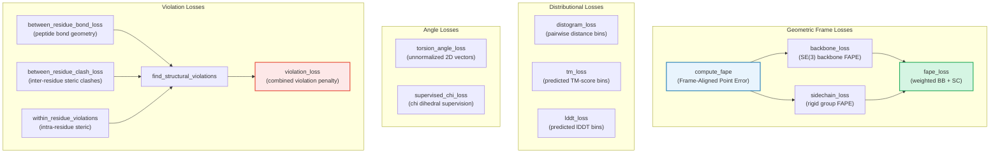
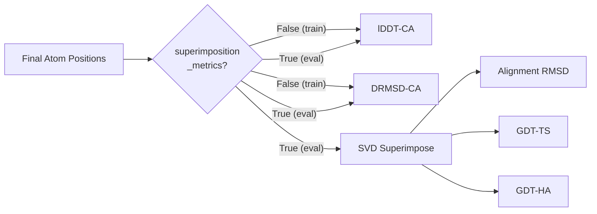

---
slug:13-loss-functions-and-validation-metrics
blog_type:normal
---


PepTron 的训练目标和评估框架继承了 AlphaFold/OpenFold 的多组件损失架构，同时整合了特定于流匹配的监督信号。损失模块将结构预测质量分解为**几何帧对齐**、**距离分布**、**扭转角**、**置信度校准**和**结构违规**五个通道——每个通道针对蛋白质几何的不同方面。验证指标则通过在流匹配推理输出上计算无参考 和有参考 (DRMSD, GDT-TS, GDT-HA) 分数来对这些损失进行补充。

来源: [loss.py](peptron/model/loss.py#L1-L40), [flow.py](peptron/model/flow.py#L1-L40)

## 损失架构概述

总训练损失聚合了六个独立加权的子损失，每个子损失作用于预测结构的不同几何表示。下图展示了它们的依赖层级及其所消耗的数据表示：



**fape_loss** 作为主要的几何监督信号，作用于 SE(3) 帧表示。**distogram_loss**、**tm_loss** 和 **lddt_loss** 通过将预测的 logit 分布与分桶的真实值进行比较，提供分布监督。**violation_loss** 作为正则化项，对物理上不可能的结构进行惩罚。

来源: [loss.py](peptron/model/loss.py#L43-L291), [loss.py](peptron/model/loss.py#L536-L582), [loss.py](peptron/model/loss.py#L1354-L1373)

## 帧对齐点误差 (FAPE)

**FAPE** 损失是 PepTron 的核心几何目标。它测量预测与真实原子位置之间的平均距离误差，此前两者均已通过骨干刚体变换被转换至共同的局部坐标系中。这种帧对齐特性使得 FAPE **对全局 SE(3) 变换保持不变**——这是结构预测的关键要求，因为绝对坐标系是任意的。

`compute_fape` 函数接收预测帧和真实帧（作为 `Rigid` 对象）、它们对应的位置、二进制掩码、用于归一化的 `length_scale`，以及用于截断异常值误差的可选 `l1_clamp_distance`：

```
FAPE = (1/N_frames * 1/N_pts) * Σ_i Σ_j clamp(||T_i^pred(x_j^pred) - T_i^gt(x_j^gt)||) / length_scale
```

其中 `T_i` 表示通过逆转帧 `i` 获得的局部帧变换，截断操作 防止因巨大对齐误差导致的梯度爆炸。该实现使用**对 FP16 友好的顺序求和**，而非单次除法，以避免混合精度训练中的数值问题。

来源: [loss.py](peptron/model/loss.py#L88-L159)

### 骨干与侧链 FAPE

`backbone_loss` 根据模型的 `traj` 输出（张量-7 表示：四元数 + 平移）构建预测刚体变换，并根据 4×4 齐次骨干张量构建真实变换。它通过 `use_clamped_fape` 支持可选的**截断/非截断 FAPE 插值**，该方法在截断版本（截断至 10Å）和非截断版本之间进行混合，以在稳定早期训练的同时保留预测良好区域的梯度信号。

`sidechain_loss` 作用于结构模块最后一次迭代的刚体组帧和原子位置。它通过根据 `alt_naming_is_better` 混合 `rigidgroups_gt_frames` 和 `rigidgroups_alt_gt_frames` 来处理**对称感知的真实值**，该标志为对称原子组（例如，末端羧基上的两个等价氧原子）选择最佳命名约定。

组合后的 `fape_loss` 应用可配置的权重：

```python
loss = config.backbone.weight * bb_loss + config.sidechain.weight * sc_loss
```

来源: [loss.py](peptron/model/loss.py#L162-L291)

## 扭转角损失

### 直接扭转角损失

`torsion_angle_loss` 作用于**未归一化的 2D 向量** (sin, cos) 而非原始角度，避免了 ±π 处的不连续性。给定预测角度 `a`、真实角度 `a_gt` 和替代真实角度 `a_alt_gt`（考虑 π 周期性），该损失选择最小平方距离：

```
l_torsion = mean(min(||a_norm - a_gt||², ||a_norm - a_alt_gt||²))
l_angle_norm = mean(|norm(a) - 1|)
loss = l_torsion + 0.02 * l_angle_norm
```

`l_angle_norm` 项惩罚偏离单位范数的情况，鼓励网络产生归一化良好的角度预测。权重 0.02 反映了相对于角度精度，归一化是次要关注点。

来源: [loss.py](peptron/model/loss.py#L64-L85)

### 监督 Chi 损失

`supervised_chi_loss`（源自 AlphaFold 的算法 27）将扭转监督扩展至 **chi 二面角**（侧链旋转异构体）。它通过计算直接误差和偏移误差并取最小值，来处理 π 周期性的 chi 角：

```
sq_chi_error = min(||true_chi - pred||², ||true_chi_shifted - pred||²)
```

偏移量计算为 `true_chi_shifted = (1 - 2 * chi_pi_periodic) * true_chi`，其中 `chi_pi_periodic` 是依赖于残基类型的指示符，用于标识具有 π 对称性的角度。该损失将经过掩码处理的 chi 误差与范数正则化项组合，两者分别由可配置的 `chi_weight` 和 `angle_norm_weight` 加权。

来源: [loss.py](peptron/model/loss.py#L294-L388)

## 分布损失

这些损失监督分桶几何量上的**预测概率分布**，训练模型在生成结构预测的同时产生校准良好的置信度估计。

### 距离图损失

`distogram_loss` 将成对的 Cβ–Cβ 距离离散化为 `no_bins=64` 个分桶，跨度为 `[2.3125, 21.6875]` Å，并计算预测 logits 与独热编码真实桶之间的 softmax 交叉熵。平方掩码 `pseudo_beta_mask[..., None] * pseudo_beta_mask[..., None, :]` 确保只有有效的残基对参与计算。

来源: [loss.py](peptron/model/loss.py#L536-L582)

### TM 损失

`tm_loss` 通过计算预测与真实骨干变换之间的平方帧对齐距离，对其进行分桶，并针对真实分布计算交叉熵，从而监督预测对齐误差 (PAE) 头。分辨率滤波器将损失门控为仅对 `[min_resolution, max_resolution]` 内的结构生效。`scale = 0.5` 因子提升了 FP16 训练的稳定性。

来源: [loss.py](peptron/model/loss.py#L678-L732)

### LDDT 损失

`lddt_loss` 使用**真实 lDDT-CA 分数**（与梯度断开）作为软目标：连续分数被离散化为 `no_bins=50` 个分桶，转换为独热分布，并通过 softmax 交叉熵与模型预测的 logits 进行比较。这训练了置信度头去预测局部结构质量，而无需通过 lDDT 计算本身进行微分。

来源: [loss.py](peptron/model/loss.py#L484-L533)

## 结构违规损失

违规损失作为**硬几何约束**——它们不教导模型将原子放置在何处，而是惩罚物理上不可能的构型。这对于流匹配生成至关重要，因为去噪过程可能会产生带有严重空间位阻冲突的中间结构。

### 残基间键损失

实现了**平底损失** (Jumper et al. 补充材料 第 1.9.11 节，公式 44–45)，仅当偏离理想肽键几何的程度超过容差阈值时才进行惩罚：

| 组件 | 理想值 | 惩罚对象 |
|-----------|-------------|-----------|
| C–N 键长 | 1.33 Å (脯氨酸为 1.32 Å) | 超过 `tolerance_factor_soft × σ` 的长度偏差 |
| ∠CA–C–N | 116.2° | 余弦角度偏差 |
| ∠C–N–CA | 121.7° | 余弦角度偏差 |

`relu` 激活函数创建了平底——容差内的误差产生零损失。单独的 `tolerance_factor_soft`（用于损失）和 `tolerance_factor_hard`（用于违规掩码）阈值允许梯度计算与违规计数具有不同的敏感度。

来源: [loss.py](peptron/model/loss.py#L735-L891)

### 残基间冲突损失

惩罚不同残基中非键合原子之间的**空间位阻冲突**。对于每个残基间原子对，它计算距离并将其与范德华半径之和进行比较。当 `distance < (r_i + r_j) - overlap_tolerance` 时，即检测到冲突。该实现显式地将连续残基间的骨干 C–N 键和二硫键 CYS–SG 桥接排除在冲突检测之外。

来源: [loss.py](peptron/model/loss.py#L894-L1038)

### 违规损失聚合

`violation_loss` 将所有违规项组合为单个标量：

```python
loss = bonds_c_n + angles_ca_c_n + angles_c_n_ca + l_clash / (num_atoms + ε)
```

其中 `l_clash` 对残基间和残基内冲突损失求和，并通过原子数量进行归一化。这种归一化确保了冲突项在不同长度的蛋白质间能适当地缩放。

来源: [loss.py](peptron/model/loss.py#L1354-L1373)

## 置信度预测指标

这些函数从模型的输出 logits 计算**结构质量估计**，在推理时提供逐残基和逐残基对的置信度分数。

### 预测 LDDT (pLDDT)

`compute_plddt` 函数通过计算 softmax 概率分布并对桶中心求期望，将距离图 logits 转换为预测的 lDDT 分数：

```
pLDDT = 100 × Σ_k P(bin_k) × center(bin_k)
```

乘以 100 将分数缩放至常规的 [0, 100] 范围。

来源: [loss.py](peptron/model/loss.py#L391-L402)

### 预测对齐误差 (PAE)

`compute_predicted_aligned_error` 函数根据 PAE 头的 logits 计算每个残基对的预期对齐距离误差，同时返回逐对误差矩阵和最大预测误差。

来源: [loss.py](peptron/model/loss.py#L604-L641)

### 预测 TM 分数

`compute_tm` 函数通过计算 softmax 分布、对每个桶应用 TM 分数核 `1/(1 + d²/d₀²)`，并选择具有最大加权分数的对齐方式，从 PAE logits 估计 TM 分数。`d₀` 参数随序列长度缩放，计算公式为 `1.24 × (N - 15)^(1/3) - 1.8`。

来源: [loss.py](peptron/model/loss.py#L644-L675)

## 验证指标管线

验证指标在 `FlowSteps._compute_validation_metrics` 方法中计算，该方法作用于流匹配推理轨迹生成的**最终原子位置**。该方法支持由 `superimposition_metrics` 标志控制的两种模式。

| 指标 | 类型 | 参考基准 | 范围 | 计算开销 |
|--------|------|-----------|-------|-----------------|
| **lDDT-CA** | 无参考 | 无 | [0, 1] | 低 (O(N²)) |
| **DRMSD-CA** | 无参考 | 真实结构 | [0, ∞) Å | 低 (O(N²)) |
| **Alignment RMSD** | 有参考 | 真实结构 | [0, ∞) Å | 中 (SVD) |
| **GDT-TS** | 有参考 | 叠合后 | [0, 1] | 中 |
| **GDT-HA** | 有参考 | 叠合后 | [0, 1] | 中 |

默认情况下，训练期间 `superimposition_metrics=False` 以避免高开销的 SVD 叠合，仅启用轻量级的 lDDT-CA 和 DRMSD-CA 计算。依赖叠合的指标 (RMSD, GDT-TS, GDT-HA) 保留用于完整评估运行。



来源: [flow.py](peptron/model/flow.py#L135-L183)

### lDDT-CA

基于 Cα 原子的**局部距离差异测试**测量在 0.5、1.0、2.0 和 4.0 Å 阈值内保留的成对距离的分数，并取等权平均。称其无参考的意义在于它不需要全局叠合——它直接比较局部距离模式，对结构域运动具有鲁棒性，特别适用于**本质无序蛋白质**，因为在这类蛋白质上全局 RMSD 具有误导性。

来源: [loss.py](peptron/model/loss.py#L405-L481)

### DRMSD-CA

基于 Cα 原子的**距离均方根偏差**计算成对距离矩阵而非坐标矩阵的均方根偏差。与 lDDT 类似，它避免了叠合，但捕获了全局拓扑一致性。它作为训练时 RMSD 的快速替代指标。

来源: [flow.py](peptron/model/flow.py#L160-L166)

### GDT-TS 与 GDT-HA

**全局距离测试**分数测量在最优叠合后位于距离阈值内的 Cα 原子的分数。GDT-TS 使用阈值 {1, 2, 4, 8} Å，而 GDT-HA 使用更严格的阈值 {0.5, 1, 2, 4} Å。这些是 CASP 结构预测评估的标准指标，但需要昂贵的基于 SVD 的叠合步骤。

来源: [flow.py](peptron/model/flow.py#L168-L181)

## 训练时损失与指标集成

`peptron_forward_step` 函数在 Megatron-NeMo 训练循环中编排完整的前向传播。在计算结构预测和验证指标之前，它集成了三种随机增强策略：

1. **调和噪声注入** (概率 `noise_prob`)：应用 `_add_noise` 方法，该方法通过 `noisy_beta = (1-t) * x1 + t * noisy` 在真实伪 beta 坐标和调和先验样本之间进行插值，然后根据加噪位置计算成对距离作为距离图输入。

2. **额外输入随机丢弃** (概率 `1 - extra_input_prob`)：移除 `extra_all_atom_positions` 特征，以训练对缺失模板信息的鲁棒性。

3. **自条件化** (概率 `self_cond_prob`)：执行初步的无梯度前向传播，将输出作为 `prev_outputs` 反馈至第二次前向传播——使模型能够迭代地精炼其自身的预测。

在模型前向传播之后，验证指标在 `torch.no_grad()` 下计算，并通过 `FlowSteps.log` 方法记录，该方法按阶段 (`train_*` 或 `val_*`) 和步数 (`iter_*`) 累积值。指标通过 `save_log_to_json` 持久化为 JSON。

<CgxTip>检查点监视器默认追踪 `val_loss`（在 `train_model` 的 `metric_to_monitor_for_checkpoints` 参数中配置）。当训练期间 `superimposition_metrics=False` 时，记录的 `lddt_ca` 和 `drmsd_ca` 是由单步模型输出计算的——而非来自完整的多步流匹配轨迹，后者会产生更准确但开销更大的估计。</CgxTip>

来源: [flow.py](peptron/model/flow.py#L280-L336), [train.py](peptron/model/train.py#L65-L200)

## 诊断用违规指标

除了标量违规损失外，`compute_violation_metrics` 还生成一个包含逐样本诊断指标的字典，用于量化结构违规的**严重程度和普遍性**：

| 指标键 | 描述 |
|------------|-------------|
| `violations_extreme_ca_ca_distance` | 连续 Cα–Cα 对超过理想值 + 1.5 Å 的比例 |
| `violations_between_residue_bond` | 逐残基键违规掩码的均值 |
| `violations_between_residue_clash` | 逐残基原子间冲突掩码的均值 |
| `violations_within_residue` | 逐残基原子内违规掩码的均值 |
| `violations_per_residue` | 组合的逐残基违规掩码（取所有违规的最大值） |

这些指标作为**事后质量过滤器**——具有高违规率的结构表明存在病态预测，可能需要过滤或重新推理。`utils` 模块中的 `filter_unphysical_traj` 工具使用这些指标进行轨迹剪枝。

来源: [loss.py](peptron/model/loss.py#L1258-L1335), [loss.py](peptron/model/loss.py#L1295-L1335)

## 损失函数总结

| 损失函数 | 输入表示 | 监督目标 | 关键参数 |
|---------------|---------------------|-------------------|----------------|
| `fape_loss` | SE(3) 帧 + 平移 | 骨干 + 侧链几何 | `backbone.weight`, `sidechain.weight`, `clamp_distance=10.0` |
| `distogram_loss` | 成对距离 logits | 分桶的 Cβ–Cβ 距离 | `min_bin=2.3125`, `max_bin=21.6875`, `no_bins=64` |
| `tm_loss` | PAE logits | 分桶的帧对齐误差 | `max_bin=31`, `no_bins=64` |
| `lddt_loss` | 置信度 logits | 分桶的真实 lDDT-CA | `no_bins=50`, `cutoff=15.0` |
| `supervised_chi_loss` | 角度 sin/cos 向量 | 真实 chi 二面角 | `chi_weight`, `angle_norm_weight` |
| `violation_loss` | 原子14位置 | 物理约束 | `violation_tolerance_factor`, `clash_overlap_tolerance` |

来源: [loss.py](peptron/model/loss.py#L270-L291), [loss.py](peptron/model/loss.py#L536-L582), [loss.py](peptron/model/loss.py#L678-L732), [loss.py](peptron/model/loss.py#L484-L533), [loss.py](peptron/model/loss.py#L294-L388), [loss.py](peptron/model/loss.py#L1354-L1373)

<CgxTip>违规损失使用**平底（基于 ReLU 的）惩罚**，当几何形状在容差范围内时产生零梯度。这意味着它们纯粹作为约束而非吸引子起作用——FAPE 损失提供朝向正确结构的吸引力，而违规损失仅在预测处于物理上不可能的区域时激活，以将其推离。这种设计对流匹配至关重要，因为中间去噪步骤可以自由探索扭曲的几何形状，而不会被违规项拉向真实结构。</CgxTip>

## 后续步骤

此处描述的损失函数通过 [配置参考](16-configuration-reference) 中定义的 `ConfigDict` 对象进行配置，并在 [Megatron 分布式训练](14-megatron-distributed-training) 中详述的分布式训练基础设施内执行。训练期间计算的验证指标为 [推理与集成生成](15-inference-and-ensemble-generation) 中讨论的集成过滤策略提供了依据。