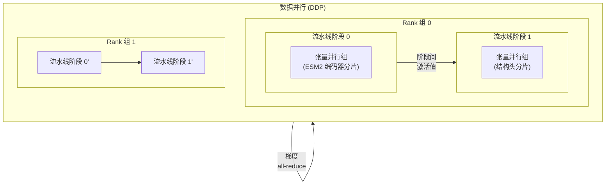
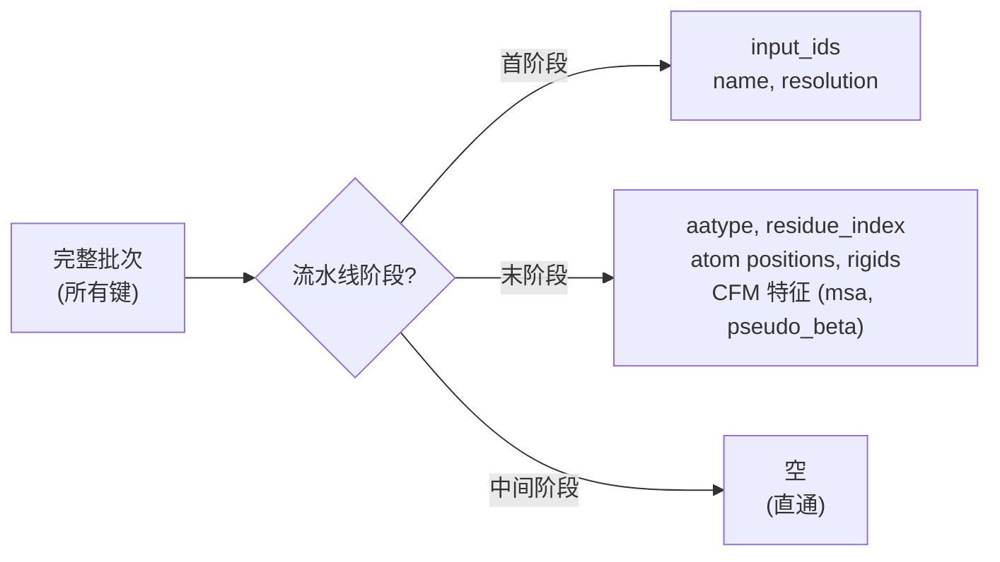

---
slug:14-megatron-distributed-training
blog_type:normal
---


PepTron 的训练基础设施基于 **NVIDIA NeMo2 + Megatron-LM** 构建，提供了一个三轴并行模型——张量并行（TP）、流水线并行（PP）和数据并行（DP）——并通过 PyTorch Lightning 进行编排。本页将介绍分布式训练架构、策略配置、流水线阶段间的数据路由，以及启动大规模多 GPU 训练所需的运行环境。

## 分布式训练启动

多 GPU 训练的标准入口点是 `run_peptron_distributed_train.sh`，它使用 `torchrun` 为每个 GPU 生成一个进程：

```bash
export TORCHDYNAMO_SUPPRESS_ERRORS=1
export CUDA_LAUNCH_BLOCKING=1
export PYTHONPATH=<path-to-peptron-repo>
export CUDA_DEVICE_MAX_CONNECTIONS=1

torchrun --nproc_per_node=8 -m peptron.train
```

有三个环境变量值得关注。**`CUDA_DEVICE_MAX_CONNECTIONS=1`** 串行化了 CUDA 流，这对于 Megatron-LM 的通信/计算核心重叠至关重要——将其设置为 1 可确保 all-gather 和 reduce-scatter 操作与前向/反向计算正确重叠。**`CUDA_LAUNCH_BLOCKING=1`** 强制同步执行 CUDA 以实现确定性调试。**`TORCHDYNAMO_SUPPRESS_ERRORS=1`** 则会抑制由 Megatron 的自定义 autograd 函数引发的 TorchDynamo 错误。相比之下，单节点的 `run_peptron_train.sh` 通过普通的 `python -m peptron.train` 启动，无需 `torchrun`，适用于单 GPU 调试或性能分析。

来源：[run_peptron_distributed_train.sh](/run_peptron_distributed_train.sh#L1-L8)，[run_peptron_train.sh](/run_peptron_train.sh#L1-L5)

## 并行架构

PepTron 通过 NeMo2 的 `MegatronStrategy` 组合了三个正交的并行维度。下图展示了训练批次在并行层次结构中的流动过程：



该策略在 `train_model()` 中实例化如下：

```python
strategy = nl.MegatronStrategy(
    tensor_model_parallel_size=tensor_model_parallel_size,
    pipeline_model_parallel_size=pipeline_model_parallel_size,
    ddp="megatron",
    find_unused_parameters=True,
    enable_nemo_ckpt_io=True,
)
```

`ddp="megatron"` 标志选择了 Megatron-LM 的自定义分布式数据并行实现，而非 PyTorch 的原生 DDP，这是与分布式优化器兼容所必需的。**`find_unused_parameters=True`** 是必要的，因为结构头在每次前向传递中并不会使用 ESM2 编码器的所有参数——具体而言，当 `encoder_frozen=True` 时，编码器梯度为零，但这些参数仍然参与计算图。**`enable_nemo_ckpt_io=True`** 激活了 NeMo2 的分布式检查点格式，该格式按并行 rank 存储分片，而非整体式检查点，从而大幅缩减了大规模场景下的检查点 I/O 时间。

来源：[peptron/train.py](/peptron/train.py#L112-L118)

## 并行配置默认值

`config.py` 中的默认配置设定了保守的单节点并行值，这些值可以在多节点集群中进行扩展：

| 参数 | 默认值 | 描述 |
|---|---|---|
| `tensor_model_parallel_size` | 1 | 模型张量分片所跨的 GPU 数量 |
| `pipeline_model_parallel_size` | 1 | 流水线阶段数（模型层在各 GPU 间拆分） |
| `devices` | 8 | 每节点的 GPU 数量 |
| `num_nodes` | 1 | 集群中的节点数 |
| `micro_batch_size` | 8 | 梯度累积前每个 GPU 的微批次大小 |
| `accumulate_grad_batches` | 1 | 优化器步进前需累积的微批次数量 |
| `precision` | `bf16-mixed` | 混合精度模式（bf16 或 fp16） |

**全局批次大小**并非直接设置——它由 `infer_global_batch_size()` 推断得出，其计算公式为：

> `global_batch_size = micro_batch_size × num_nodes × devices × accumulate_grad_batches ÷ (tensor_model_parallel_size × pipeline_model_parallel_size)`

这确保了全局批次能够在所有并行轴上均匀分配。使用默认值时（micro=8，1 个节点，8 个设备，TP=1，PP=1，accum=1），全局批次大小为 64。

来源：[peptron/model/config.py](/peptron/model/config.py#L770-L817)，[peptron/train.py](/peptron/train.py#L245-L252)

## 流水线阶段数据路由

Megatron 流水线并行的一个关键点是，不同的模型阶段在不同的 GPU rank 上执行，且每个阶段仅需要输入批次的一个子集。`structure_data_step()` 函数通过检查 Megatron-LM 的 `parallel_state` 实现了此路由逻辑：



**流水线首阶段**仅接收 `input_ids`（分词后的氨基酸）、`name` 和 `resolution`——这是 ESM2 编码器所需的最小输入。**流水线末阶段**接收完整的结构预测特征集：原子位置、刚体组帧、主干刚体、chi 角以及所有连续流匹配（CFM）输入（`msa_mask`、`pseudo_beta`、`msa_feat` 等）。当前阶段不需要的键被设置为 `None`，从而避免了不必要的 GPU 间数据传输。在键过滤之后，`get_batch_on_this_context_parallel_rank()` 会沿序列维度对批次进行切片，以支持**上下文并行**（第四种并行模式，将长序列划分到各 rank）。所有保留的张量均通过 `.cuda(non_blocking=True)` 移至 CUDA，以实现主机到设备传输的重叠。

来源：[peptron/data/datamodule.py](/peptron/data/datamodule.py#L38-L130)

## 分布式优化器与学习率调度

PepTron 使用了 Megatron-LM 的**分布式优化器**（`use_distributed_optimizer=True`），它将优化器状态（Adam 矩）在数据并行 rank 间进行分片。这将每 GPU 的内存消耗从 O(params × DP) 降低至 O(params)，对于 30 亿参数的 ESM2 主干网络而言，这是一项关键优化。

```python
optimizer = MegatronOptimizerModule(
    config=OptimizerConfig(
        lr=1e-4,
        optimizer="adam",
        use_distributed_optimizer=True,
        weight_decay=0.01,
        adam_beta1=0.9,
        adam_beta2=0.95,
        fp16=config.fp16,
        bf16=config.bf16,
    ),
    lr_scheduler=WarmupAnnealDecayHoldScheduler(
        warmup_steps=warmup_steps,
        max_steps=n_steps_train,
        max_lr=1e-4,
        min_lr=1e-6,
        anneal_percentage=0.15,
    )
)
```

**WarmupAnnealDecayHoldScheduler** 实现了三阶段调度：(1) 在 `warmup_steps`（默认为总步数的 10%）内从零线性预热至 `max_lr`；(2) 在剩余步数接下来的 15% 内，通过余弦退火降至 `min_lr`；(3) 在训练最后的 85% 期间保持在 `min_lr`。此调度策略在稳定流匹配速度场早期训练的同时，防止了后期的振荡。

来源：[peptron/train.py](/peptron/train.py#L158-L176)

## 训练器与混合精度

NeMo2 `Trainer` 通过 Megatron 专有插件封装了 PyTorch Lightning 的训练器：

```python
trainer = nl.Trainer(
    accelerator="gpu",
    devices="auto",
    strategy=strategy,
    limit_val_batches=limit_val_batches,
    val_check_interval=val_check_interval,
    max_steps=n_steps_train,
    num_nodes=num_nodes,
    log_every_n_steps=val_check_interval,
    callbacks=callbacks,
    plugins=nl.MegatronMixedPrecision(precision=precision),
)
```

**`MegatronMixedPrecision`** 并非 PyTorch Lightning 的标准混合精度——它委托给 Megatron-LM 的内部 `autocast` 实现，该实现处理了 fp16/bf16 类型转换与 Megatron 自定义通信原语之间的复杂交互。`devices="auto"` 标志会自动检测每个节点的可用 GPU，而 `num_nodes` 则控制多集群启动时的节点总数。每训练 `val_check_interval` 步（默认为 100）便会触发一次验证，并通过 `limit_val_batches` 限制验证批次的数量，以控制验证开销。

来源：[peptron/train.py](/peptron/train.py#L143-L154)

## 训练回调与检查点

训练循环注册了若干用于容错性和可观测性的回调：

| 回调 | 目的 |
|---|---|
| `RichModelSummary(max_depth=4)` | 在训练开始时打印层次化模型参数摘要 |
| `LearningRateMonitor()` | 每步将学习率记录到所有已配置的日志器中 |
| `PreemptionCallback()` | 在收到抢占信号（SIGTERM）时保存检查点，实现集群的优雅重新排队 |
| `TimingCallback()` | 记录来自 NeMo 实验管理器的 epoch 级计时指标 |
| `ModelCheckpoint` | 按 `val_loss` 保存前 20 个检查点，并每隔 `steps_to_save_ckpt` 步保存 `last` 检查点 |

`ModelCheckpoint` 使用 `always_save_context=True` 来启用 NeMo2 基于 SerDe 的检查点机制，其中所有 `IOMixin` 对象（数据采样器、优化器、日志器）均与模型权重一同序列化。检查点文件名包含 `{epoch}-{step}-{consumed_samples}` 以防文件名冲突。**自动恢复**通过 `resume.AutoResume(resume_if_exists=True, resume_ignore_no_checkpoint=True)` 进行配置，它会搜索 `-last` 检查点并恢复训练状态，包括优化器矩、数据采样器位置和全局步数。

来源：[peptron/train.py](/peptron/train.py#L136-L224)

## 数据并行与 MegatronDataSampler

`ESMFoldDataModule` 继承自 `MegatronDataModule`，并实例化了一个 `MegatronDataSampler` 来协调各并行 rank 间的批次分布：

```python
self.data_sampler = MegatronDataSampler(
    seq_len=max_seq_length,
    micro_batch_size=micro_batch_size,
    global_batch_size=global_batch_size,
    dataloader_type="single",
    rampup_batch_size=rampup_batch_size,
    output_log=predict_dataset is None,
)
```

`dataloader_type="single"` 选择了 `MegatronPretrainingRandomSampler`，该采样器维护了一个在检查点恢复后依然存在的已消耗样本计数器——确保重启后不会有训练样本被重复或遗漏。数据集使用 `IdentityMultiEpochDatasetWrapper` 封装在 `MultiEpochDatasetResampler` 中，它通过从底层 `OpenFoldDataset`（其本身根据配置的概率混合 PDB 和 IDRome 数据）中重复采样，创建了一个恰好包含 `max_train_steps × global_batch_size` 个样本的虚拟数据集。

来源：[peptron/data/datamodule.py](/peptron/data/datamodule.py#L192-L254)

## 面向分布式张量拼接的猴子补丁

`monkey_patch.py` 模块使用一个安全版本（`safe_batch_collator`）替换了 BioNeMo 的 `batch_collator` 函数，以处理分布式训练中出现的边缘情况：

- **标量张量**：对 0 维张量使用 `torch.stack` 而非 `torch.cat`
- **变长序列**：在沿批次维度拼接之前，沿序列维度将张量填充至最大长度
- **嵌套字典**：通过 `recursive_batch_collator` 进行递归整理
- **PassthroughLossReduction.reduce**：已打补丁以使用安全整理器，防止 Megatron 的损失归约在跨 rank 传递可变形状张量时发生崩溃

这些补丁是必要的，因为 Megatron 的流水线并行可能会在不同 rank 上产生具有不同张量形状的批次，而原始的 BioNeMo 整理器假定形状是统一的。这些补丁在导入时通过 `apply_monkey_patches()` 应用。

来源：[peptron/monkey_patch.py](/peptron/monkey_patch.py#L1-L196)

## 容器环境

分布式训练环境由 Dockerfile 定义，该文件扩展了 NVIDIA 的 BioNeMo 框架容器：

```
FROM nvcr.io/nvidia/clara/bionemo-framework:2.7.1
```

此基础镜像提供了 Megatron-LM、NeMo2、PyTorch 和 CUDA。PepTron 额外添加了 **cuequivariance**（`cuequivariance_torch==0.8.0` 和 `cuequivariance-ops-torch-cu12==0.8.0`）用于等变注意力原语，以及 **OpenFold**（从 `nv_upstream_trt_cuequivariance` 分支克隆）用于提供结构模块层。`bionemo-moco==0.0.2.2` 包提供了训练和推理期间使用的连续流匹配调度。

来源：[Dockerfile](/Dockerfile#L1-L40)

<CgxTip>当扩展至 8 个 GPU 以上时，请优先增加 `tensor_model_parallel_size`（对于 ESM2 编码器的注意力层，它具有最佳的通信计算比），然后再增加 `pipeline_model_parallel_size` 以应对结构头。务必验证 `global_batch_size` 能被 `TP × PP` 整除——否则 `infer_global_batch_size` 将在启动时抛出错误。</CgxTip>

<CgxTip>在所有分布式运行中设置 `CUDA_DEVICE_MAX_CONNECTIONS=1`。若无此设置，由于 NVIDIA Ampere+ GPU 上的流排序问题，Megatron-LM 的 all-gather/reduce-scatter 与前向计算的重叠将产生不正确的结果。</CgxTip>

## 扩展至多节点集群

对于多节点训练，启动命令会发生变化，通过集群的作业调度器（SLURM、Kubernetes 等）在各节点间分发 `torchrun`。每个节点运行带有 `--nnodes` 和 `--node_rank` 参数的相同命令。关键的配置更改包括：

1. 在训练配置中设置 `num_nodes` 以匹配集群的节点数
2. 设置 `devices` 为每节点的 GPU 数量（DGX 系统通常为 8）
3. 调整 `micro_batch_size` 和 `accumulate_grad_batches` 以维持所需的全局批次大小：`global = micro × nodes × devices × accum ÷ (TP × PP)`
4. 确保对 `experiment_dir` 具有共享文件系统访问权限，以便所有 rank 都能将检查点和日志写入同一路径

在共享集群中，`PreemptionCallback` 尤为重要——在发生抢占时，它会触发立即保存检查点；而在重新启动时，`AutoResume` 会自动从上次保存的步数继续，并完整恢复优化器和采样器的状态。

## 相关页面

- [数据流水线与特征处理](11-data-pipeline-and-feature-processing) — 有关 `OpenFoldSingleDataset` 和 `OpenFoldBatchCollator` 为分布式数据流水线提供数据的详情
- [混合 PDB-IDRome 训练策略](12-mixed-pdb-idrome-training-strategy) — 解释在 `MegatronDataSampler` 下运行的混合数据集采样
- [损失函数与验证指标](13-loss-functions-and-validation-metrics) — 涵盖 `ESMFoldLossReduction` 及损失在各并行 rank 间的归约方式
- [推理与集成生成](15-inference-and-ensemble-generation) — 分布式推理配置共享相同的并行原语
- [配置参考](16-configuration-reference) — 所有分布式训练参数的完整列表