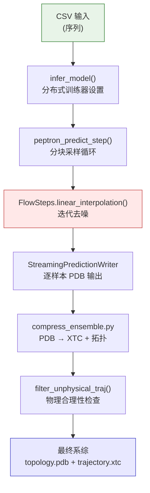
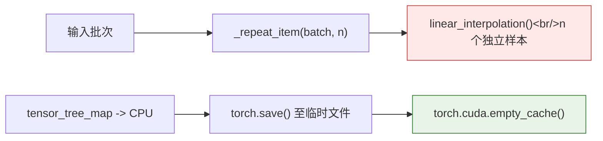
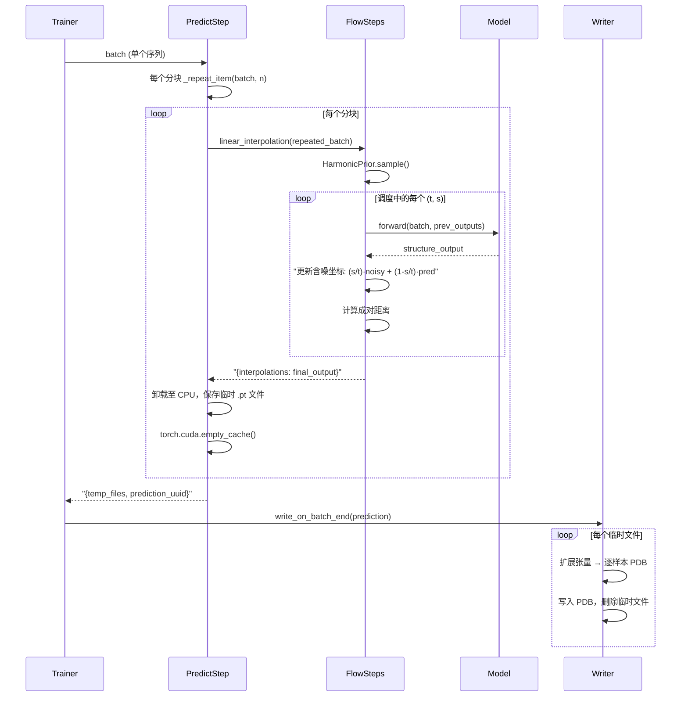

---
slug:15-inference-and-ensemble-generation
blog_type:normal
---


PepTron 的推理流水线将训练好的流匹配模型转换为**结构系综生成器**——通过从谐波先验的迭代去噪，为给定的蛋白质序列生成多个合理的 3D 构象。该流水线包含分布式模型加载、分块防 OOM 采样、流式 PDB 输出，以及带有物理合理性过滤的事后轨迹压缩。本页将剖析三个阶段：**推理编排**、**流匹配采样**和**系综压缩**。

来源: [infer.py](/peptron/infer.py#L1-L341), [run_peptron_infer.sh](/run_peptron_infer.sh#L1-L82)

## 推理流水线概述

端到端推理流水线经历三个不同阶段，由 shell 启动器和 Python 推理模块协同编排：



Shell 脚本 `run_peptron_infer.sh` 编排了这一完整生命周期：它首先使用可配置参数调用 `python -m peptron.infer`，然后遍历每个结果子目录以调用 `python -m peptron.compress_ensemble --filter-unphysical`，将逐样本的 PDB 文件转换为压缩的 XTC 轨迹，同时丢弃非物理的帧。

来源: [run_peptron_infer.sh](/run_peptron_infer.sh#L64-L81)

## 推理编排

### 入口点与配置

推理入口点为 `peptron.infer:main`，它加载 `peptron_o_inference` 配置预设，并覆盖多个运行时设置以使模型准备就绪进入预测模式。关键的是，推理过程禁用了循环 (`max_recycling_iters = 0`) 和模板 (`use_templates = False`)，并配置了梯度检查点和分块以优化内存效率：

| 覆盖项 | 值 | 依据 |
|---|---|---|
| `config.mode` | `"predict"` | 切换至预测通路 |
| `max_recycling_iters` | `0` | 推理期间无迭代精炼 |
| `use_templates` | `False` | 流匹配推理中不使用模板 |
| `blocks_per_ckpt` | `1` | 激进的梯度检查点以节省内存 |
| `chunk_size` | `None` | 推理时不进行注意力分块 |
| `offload_inference` | `False` | 将激活保留在 GPU 上 |

`main()` 函数还会将完整的推理配置序列化到结果目录的 `params.json` 文件中，确保每次系综运行的可复现性。

来源: [infer.py](/peptron/infer.py#L288-L338), [config.py](/peptron/model/config.py#L228-L232)

### 分布式推理设置

`infer_model()` 函数使用 NVIDIA 的 Megatron 策略构建 PyTorch Lightning 推理环境。全局批大小通过 `infer_global_batch_size()` 从并行配置中推断得出，该函数计算 `micro_batch_size × num_nodes × devices`。策略对象使用 Megatron 的自定义 DDP 实现，并设置 `find_unused_parameters=True`，以适应流匹配模型的条件计算路径：

```python
strategy = nl.MegatronStrategy(
    tensor_model_parallel_size=tensor_model_parallel_size,
    pipeline_model_parallel_size=pipeline_model_parallel_size,
    ddp="megatron",
    find_unused_parameters=True,
)
```

精度默认通过 `MegatronMixedPrecision` 设置为 **bf16-mixed**，从而在流 ODE 积分中保持数值稳定性的同时，启用 TF32 矩阵乘法和 cuDNN 以提高吞吐量。

来源: [infer.py](/peptron/infer.py#L72-L157)

### 模型与数据初始化

模型通过 `get_esmfoldconfig()` 构建，该函数加载检查点并配置 ESMFold 架构。流匹配引擎通过 `flow.init_flow_steps(cfg=esmfold_config, generator_seed=137)` 以单例形式初始化，前向步绑定至 `flow.peptron_forward_step`。预测数据集是从输入 CSV 加载的 `CSVDataset`，封装在具有可配置 `micro_batch_size` 和 `num_workers` 的 `ESMFoldDataModule` 中。

关键的一步是对 Lightning 模块的 `predict_step` 方法进行**运行时猴子补丁**。默认的预测步被替换为自定义的 `peptron_predict_step`，该步骤实现了分块且内存安全的系综生成：

```python
module.predict_step = MethodType(peptron_predict_step, module)
module._predict_cfg = { **predict_cfg, "samples": samples }
```

来源: [infer.py](/peptron/infer.py#L159-L285)

## 流匹配采样

### 推理调度构建

推理时间调度由两个面向用户的参数构建：**`steps`**（ODE 积分步数）和 **`tmax`**（积分起始时间）。当 `tmax = 1.0` 时，调度使用 `np.linspace(1.0, 0, steps + 1)` 跨越从纯噪声到清晰结构的完整范围。当 `0 < tmax < 1.0` 时，执行部分去噪——调度从 `t=1.0`（数据分布）开始，然后跳转至 `tmax` 并线性递减至零。这允许从部分含噪状态进行**热启动**：

| `tmax` 值 | 调度行为 |
|---|---|
| `1.0` | 完全去噪: `linspace(1.0, 0, steps+1)` |
| `0 < tmax < 1.0` | 部分去噪: `[1.0] + linspace(tmax, 0, steps+1)` |
| `≤ 0` | **错误** —— 无效值 |

来源: [infer.py](/peptron/infer.py#L190-L196)

### 分块系综生成

`peptron_predict_step` 方法以**内存安全的分块**方式生成 `samples` 个构象，以防止长序列发生 OOM。每个分块通过 `_repeat_item()`（沿维度 0 交错张量）将输入批次重复 `n` 次，然后调用 `flow._FLOW_STEPS.linear_interpolation()` 以生成 `n` 个独立的结构样本：



每个分块立即被卸载至一个临时 `.pt` 文件中，该文件标记有**全局秩**和每次预测调用的**唯一 UUID**，随后显式释放 GPU 缓存。该方法返回一个包含 `{temp_files, prediction_uuid}` 的字典，供 `StreamingPredictionWriter` 回调使用，以将分块合并为最终的 PDB 输出。

来源: [infer.py](/peptron/infer.py#L209-L264)

### 线性插值 (ODE 求解器)

核心采样算法为 `FlowSteps.linear_interpolation()`，它实现了流匹配 ODE 从 `t=1`（谐波先验）到 `t=0`（数据分布）的**欧拉积分**。算法流程如下：

1. **先验采样**：为序列长度 `N` 实例化一个 `HarmonicPrior`，并从高斯谐波分布中抽取 `batch_size` 个噪声样本
2. **调度迭代**：对于调度中的每个连续时间对 `(t, s)`，模型根据当前含噪状态预测结构
3. **自条件化**：若 `self_cond=True`，上一步的输出将作为 `prev_outputs` 馈入模型，使结构预测能基于自身先验估计进行精炼
4. **噪声更新**：每步之后，通过线性插值公式更新含噪坐标：`noisy = (s/t) * noisy + (1 - s/t) * pseudo_beta`，有效地沿流路径传输噪声
5. **距离特征**：重新计算更新后含噪坐标的成对距离，并将其作为 `noised_pseudo_beta_dists` 注入批次中，用于下一次模型前向传播

`no_diffusion` 标志会绕过整个 ODE 积分并执行单次模型前向传播——这对于**确定性的单结构预测**非常有用。`noisy_first` 标志会在首次模型调用之前，使用 `t=1` 时的先验噪声距离初始化批次。

来源: [flow.py](/peptron/model/flow.py#L206-L265)

### 推理时的谐波先验采样

`HarmonicPrior` 类预计算链刚度矩阵 **J**（具有弹簧常数 `a = 3/3.8²` 的三对角拉普拉斯矩阵）的特征分解，得到特征值 **D** 和特征向量 **P**。采样在特征基中抽取高斯噪声 `z ~ N(0, I)`，通过 `√(D⁻¹)` 缩放（滤除对应于平移的零模式），并通过 `P @ z` 旋转回原空间。这产生了**谐波分布**的样本——一种尊重链连接性的主链坐标上的高斯分布：

```python
class HarmonicPrior:
    def __init__(self, N=256, a=3/(3.8**2)):
        J = torch.zeros(N, N)
        for i, j in zip(np.arange(N-1), np.arange(1, N)):
            J[i,i] += a; J[j,j] += a; J[i,j] = J[j,i] = -a
        D, P = torch.linalg.eigh(J)
        D_inv = 1/D; D_inv[0] = 0  # 移除平移模式
        self.P, self.D_inv = P, D_inv
```

在 ODE 积分开始之前，先验通过 `rmsdalign()` 与数据对齐，确保噪声样本与目标结构在旋转上保持一致。

来源: [flow.py](/peptron/model/flow.py#L42-L69), [flow.py](/peptron/model/flow.py#L220-L224)

## 流式输出与系综写入

### StreamingPredictionWriter

`StreamingPredictionWriter` 回调（扩展自 Lightning 的 `BasePredictionWriter`）在 `write_interval="batch"` 时处理分块预测结果。在 `write_on_batch_end` 时，它：

1. **识别分块**：通过将 `prediction_uuid` 和全局秩与临时文件模式进行匹配：`_tmp_rank{rank}_predictid_{uuid}_part*.pt`
2. **流式 PDB 输出**：对于每个分块，`interpolations` 键通过 `expand_tensors_in_list()` 扩展为逐样本的独立字典，每个字典再通过 `protein.get_prot_pdb()` 和 `protein.prots_to_pdb()` 转换为 PDB 格式
3. **按序列组织**：每个样本被写入以蛋白质命名的子目录中，文件名编码了秩、批次索引和样本索引：`predictions_rank_{rank}_batch_{batch_idx}_{sample_idx}.pdb`
4. **清理**：处理完毕后删除临时 `.pt` 文件，防止磁盘空间累积

这种流式方法确保**在任何时候内存中驻留的结构不超过一个分块的数量**，无论请求的样本总数是多少。

来源: [callbacks.py](/peptron/utils/callbacks.py#L13-L77)

## 系综压缩与物理过滤

### PDB 至 XTC 转换

推理为每个序列生成包含单个 PDB 文件的目录后，`compress_ensemble.py` 将其转换为标准的分子动力学轨迹格式（XTC + 拓扑 PDB）。`pdb_dir_to_xtc()` 函数：

1. 从首个 PDB 创建 `MDAnalysis.Universe` 以提取拓扑
2. 写入包含原子结构模板的 `topology.pdb`
3. 使用 `MDAnalysis.Writer` 将每个 PDB 帧流式传输至单个 `trajectory.xtc` 文件中，可选择过滤非物理帧
4. 在成功纳入轨迹后删除单个 PDB 文件

与单个 PDB 文件相比，这种压缩通常可将磁盘使用量减少 **10-50 倍**，同时生成与标准 MD 分析工具（MDTraj、MDAnalysis、PyEMMA、VMD）兼容的格式。

来源: [compress_ensemble.py](/peptron/compress_ensemble.py#L12-L50)

### 物理合理性过滤

`filter_unphysical_traj()` 函数对每个采样构象应用三项几何完整性检查，丢弃违反基本物理约束的结构：

| 判据 | 阈值 | 依据 |
|---|---|---|
| **CA–CA 顺序距离** | < 4.5 Å | 相邻 Cα 原子必须在肽键几何范围内 |
| **C–N 顺序距离** | < 2.0 Å | 连续残基间的肽键长度 |
| **残基间原子冲突** | > 1.0 Å | 不同残基的任意两个原子不应重叠 |

每次检查都会在轨迹帧上生成一个布尔掩码；最终掩码为所有三个掩码的逻辑与。当 `strict=True` 时，断言确保至少有一个帧能通过过滤。该函数作用于 `mdtraj.Trajectory` 对象，并返回仅包含物理合理帧的切片轨迹。

来源: [filter_unphysical_traj.py](/peptron/utils/filter_unphysical_traj.py#L82-L106)

## 推理配置参考

所有推理参数嵌套在配置字典的 `config.inference` 下。下表汇总了每个参数及其默认值和作用：

| 参数 | 默认值 | 描述 |
|---|---|---|
| `chains_path` | `"/data/input"` | 包含序列的输入 CSV 路径 |
| `checkpoint_path` | `""` | 训练好的 PepTron 检查点路径 |
| `results_path` | `""` | PDB 系综的输出目录 |
| `msa_dir` | `""` | 包含 MSA 比对的目录 |
| `as_protein` | `False` | 返回 `Protein` 对象而非字典 |
| `no_diffusion` | `False` | 跳过 ODE 积分（单次前向传播） |
| `self_cond` | `False` | 跨 ODE 步启用自条件化 |
| `noisy_first` | `False` | 使用 t=1 时的先验噪声进行初始化 |
| `samples` | `100` | 要生成的系综构象数量 |
| `tmax` | `1.0` | ODE 积分的起始时间 |
| `steps` | `10` | 欧拉积分步数 |
| `precision` | `"bf16-mixed"` | 数值精度模式 |
| `num_gpus` | `1` | 每个节点的 GPU 数量 |
| `num_nodes` | `1` | 分布式节点数量 |
| `micro_batch_size` | `2` | 每设备批大小 |
| `max_batch_size` | `10` | 每分块最大样本数（OOM 控制） |
| `num_workers` | `16` | DataLoader 工作进程数 |
| `tensor_model_parallel_size` | `1` | Megatron 张量并行度 |
| `pipeline_model_parallel_size` | `1` | Megatron 流水线并行度 |
| `prediction_interval` | `"epoch"` | 写入回调间隔（`"epoch"` 或 `"batch"`） |
| `use_cuequivariance` | `True` | 为注意力/乘法操作启用 cuEquivariance |

<CgxTip>`max_batch_size` 参数是系综生成期间 GPU 内存消耗的主要控制项。它决定了每个分块中同时生成的样本数量。对于长序列（>300 个残基），将 `max_batch_size` 减小至 1-2，并增加 `steps` 以牺牲挂钟时间为代价换取更高质量的样本。</CgxTip>

来源: [config.py](/peptron/model/config.py#L822-L847)

## 运行推理

Shell 启动器 `run_peptron_infer.sh` 为完整的推理 + 压缩流水线提供了独立接口。它接受三个必选/可选标志：

```bash
./run_pepton_infer.sh \
    --input sequences.csv \
    --checkpoint /path/to/peptron-checkpoint \
    --results results/ \
    --filter-unphysical
```

该脚本设置了多个用于 NCCL 稳定性的环境变量（`NCCL_TIMEOUT=3600`、`TORCH_NCCL_ENABLE_MONITORING=0`），并通过 absl 配置标志传递推理参数。默认配置在单 GPU 上以 `tmax=1.0` 生成 **10 个样本**，并进行 **10 个 ODE 步**。推理完成后，脚本遍历所有蛋白质子目录，并在启用物理过滤的情况下将每个系综压缩为 XTC 格式。

<CgxTip>扩展至多 GPU 推理时，确保 `micro_batch_size` 能被 `num_gpus` 整除，并将 `max_batch_size` 设置为 `num_gpus` 的倍数。启动器脚本的头部注释记录了此约束：`max_batch_size = k × num_gpus`，其中 k 为正整数 ≤ N（数据集大小）。</CgxTip>

来源: [run_peptron_infer.sh](/run_peptron_infer.sh#L1-L82)

## 预测步架构

预测步架构展示了 PepTron 如何用感知流匹配的采样循环替代标准的 Lightning 预测循环：



来源: [infer.py](/peptron/infer.py#L209-L264), [flow.py](/peptron/model/flow.py#L206-L265), [callbacks.py](/peptron/utils/callbacks.py#L31-L77)

## 后续步骤

- 关于推理期间求解的流匹配 ODE 的数学基础，请参阅 [连续流匹配](5-continuous-flow-matching)
- 关于为采样过程提供种子的谐波先验分布的详细信息，请参阅 [谐波先验采样](6-harmonic-prior-sampling)
- 关于跨 ODE 步精炼样本的自条件化机制，请参阅 [自条件化与推理调度](7-self-conditioning-and-inference-schedule)
- 关于包含所有推理参数的完整配置架构，请参阅 [配置参考](16-configuration-reference)