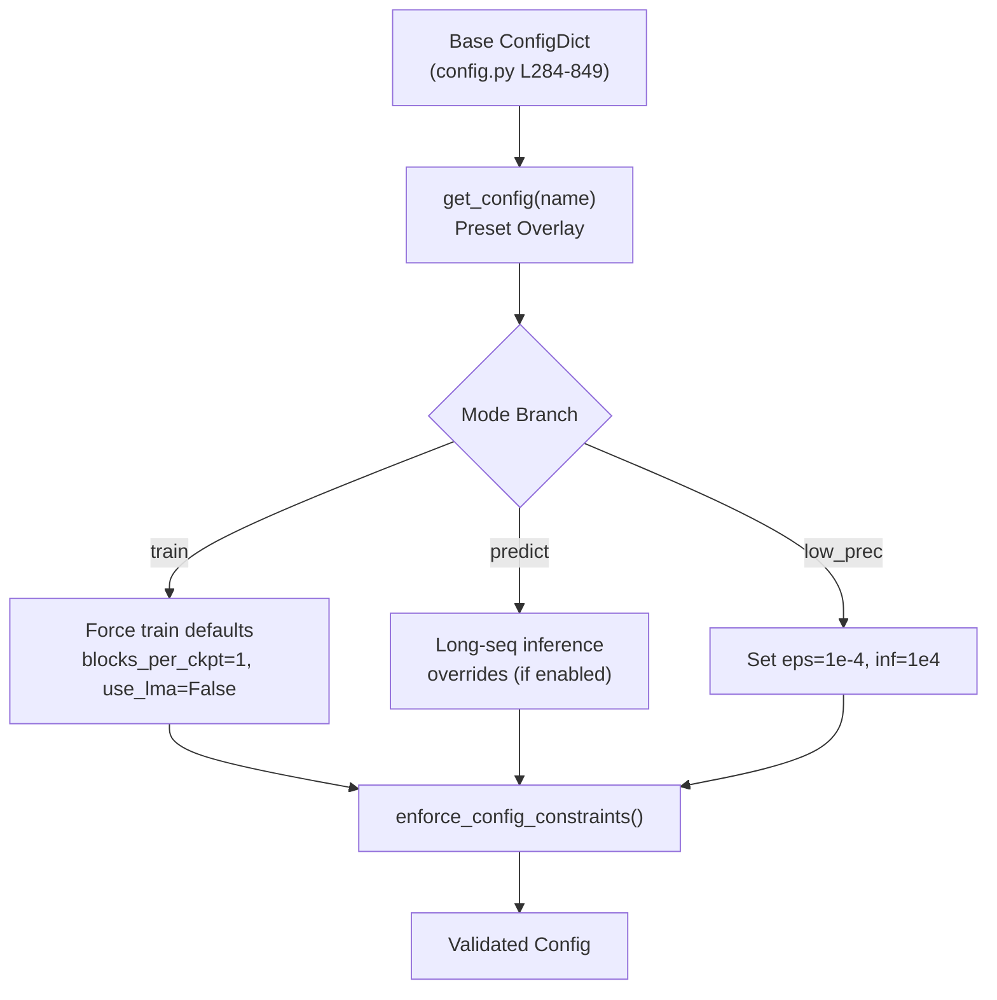

---
slug:16-configuration-reference
blog_type:normal
---

PepTron 的配置系统基于 `ml_collections.ConfigDict` 构建——这是一种分层的、默认不可变的字典，强制类型一致性，并支持用于全局参数绑定的字段引用。主配置在 [`peptron/model/config.py`](peptron/model/config.py#L284-L849) 中被定义为单一的整体字典，划分为七个顶级域：**`data`**、**`globals`**、**`model`**、**`relax`**、**`loss`**、**`ema`** 和 **`training`**/**`inference`**。通过 `get_config(name)` 选择的命名预设，在此基础配置上叠加了针对性的修改，将 AlphaFold 2 补充材料中记录的训练机制和推理配置，以及 PepTron 自身的流匹配特定机制进行了编码。本参考文档列出了每个参数、其默认值、其语义角色以及约束它们的规则。

来源: [config.py](peptron/model/config.py#L1-L261), [config.py](peptron/model/config.py#L264-L849)

## 配置架构

配置生命周期遵循三阶段流水线：**基础定义 → 预设覆盖 → 运行时强制执行**。基础 `config` 字典设定默认值。命名预设（例如 `peptron_o_mixed`）选择性地覆盖字段。最后，在配置被使用前，`enforce_config_constraints` 会验证互斥性和依赖规则。

<CgxTip>`ml_collections.FieldReference` 机制意味着在其定义位置 (L264) 修改 `c_z` 会传播到**所有**消费者——`input_embedder.c_z`、`evoformer_stack.c_z`、`structure_module.c_z`、`heads.distogram.c_z` 等。若要覆盖字段引用，需在构建字典*之前*重新赋值共享引用，或在构建之后覆盖各个消费者字段。</CgxTip>

来源: [config.py](peptron/model/config.py#L19-L25), [config.py](peptron/model/config.py#L67-L261), [config.py](peptron/model/config.py#L264-L278)

## 全局字段引用

几个架构通道维度被定义为 `FieldReference` 对象，实现了单点控制，可传播至每个使用该值的子模块。下表记录了每个引用、其默认值及其主要消费者。

| 字段引用 | 默认值 | 主要消费者 |
|---|---|---|
| `c_z` | 128 | `input_embedder`, `evoformer_stack`, `structure_module`, `heads.distogram`, `heads.tm`, `input_pair_stack`, `extra_msa.extra_msa_stack` |
| `c_m` | 256 | `input_embedder`, `evoformer_stack`, `recycling_embedder`, `heads.masked_msa` |
| `c_t` | 64 | `template.template_pair_embedder`, `template.template_pair_stack`, `template.template_pointwise_attention` |
| `c_e` | 64 | `extra_msa.extra_msa_embedder`, `extra_msa.extra_msa_stack` |
| `c_s` | 384 | `evoformer_stack`, `structure_module`, `heads.lddt`, `heads.experimentally_resolved` |
| `blocks_per_ckpt` | None | `evoformer_stack`, `template.template_pair_stack` |
| `chunk_size` | 4 | 全局注意力分块 |
| `aux_distogram_bins` | 64 | `heads.distogram.no_bins`, `heads.tm.no_bins` |
| `tm_enabled` | False | `heads.tm.enabled`, `loss.tm.enabled` |
| `templates_enabled` | True | `data.common.use_templates`, `model.template.enabled` |
| `eps` | 1e-8 | 所有损失和模型模块的数值稳定性 |
| `tune_chunk_size` | True | `evoformer_stack`, `extra_msa.extra_msa_stack`, `template.template_pair_stack` |

来源: [config.py](peptron/model/config.py#L264-L277)

## 数据配置

`data` 部分控制三种操作模式（`common`（共享）、`predict`、`eval` 和 `train`）的特征模式、MSA 处理、模板处理以及数据集加载。

### 通用数据设置

| 参数 | 默认值 | 描述 |
|---|---|---|
| `max_recycling_iters` | 3 | 循环迭代次数；PepTron 预设设为 **0** |
| `msa_cluster_features` | True | 使用 MSA 聚类特征 |
| `reduce_msa_clusters_by_max_templates` | False | 根据最大模板数减少 MSA 聚类 |
| `resample_msa_in_recycling` | True | 在循环期间重采样 MSA |
| `use_templates` | True (ref) | 启用模板特征；PepTron 预设禁用 |
| `use_template_torsion_angles` | True (ref) | 嵌入模板扭转角 |
| `masked_msa.profile_prob` | 0.1 | 基于轮廓的 MSA 掩码概率 |
| `masked_msa.same_prob` | 0.1 | 相同 token 的 MSA 掩码概率 |
| `masked_msa.uniform_prob` | 0.1 | 均匀 MSA 掩码概率 |

### 特定模式的数据设置

| 参数 | `predict` | `eval` | `train` |
|---|---|---|---|
| `fixed_size` | True | True | True |
| `subsample_templates` | False | False | True |
| `masked_msa_replace_fraction` | 0.15 | 0.15 | 0.15 |
| `max_msa_clusters` | 512 | 128 | 128 |
| `max_extra_msa` | 1024 | 1024 | 1024 |
| `max_template_hits` | 4 | 4 | 4 |
| `max_templates` | 4 | 4 | 4 |
| `crop` | False | True | True |
| `crop_size` | None | 512 | 256 |
| `supervised` | False | True | True |
| `uniform_recycling` | False | False | True |
| `shuffle_top_k_prefiltered` | — | — | 20 |
| `clamp_prob` | — | — | 0.9 |
| `max_distillation_msa_clusters` | — | — | 1000 |
| `distillation_prob` | — | — | 0.75 |

### 数据模块

| 参数 | 默认值 | 描述 |
|---|---|---|
| `use_small_bfd` | False | 使用精简的 BFD 数据库 |
| `data_loaders.batch_size` | 1 | 每个加载器的批大小 |
| `data_loaders.num_workers` | 16 | DataLoader 工作线程数 |
| `data_loaders.pin_memory` | True | 锁页内存以加速 GPU 传输 |

来源: [config.py](peptron/model/config.py#L286-L444)

## 模型配置

`model` 部分是最大的配置域，控制 ESM2 编码器、模板处理、额外 MSA 堆栈、Evoformer、主干网络、结构模块、预测头以及流匹配。

### ESM2 编码器

| 参数 | 默认值 | 描述 |
|---|---|---|
| `esm2.feats` | 2560 | ESM2 嵌入维度 (3B 模型) |
| `esm2.num_layers` | 36 | Transformer 层数 |
| `esm2.attention_heads` | 40 | 注意力头数 |
| `esm_type` | `"esm2_3B"` | ESM 模型变体标识符 |
| `fp16_esm` | True | ESM 推理使用 FP16 |
| `use_esm_attn_map` | False | 从 ESM 中提取注意力图 |
| `esm_ablate_pairwise` | False | 消融成对组件 |
| `esm_ablate_sequence` | False | 消融序列组件 |
| `esm_input_dropout` | 0 | ESM 输入的 Dropout |
| `embed_aa` | True | 嵌入氨基酸类型 |
| `bypass_lm` | False | 完全绕过语言模型 |
| `lddt_head_hid_dim` | 128 | pLDDT 头的隐藏维度 |

### 输入嵌入器

| 参数 | 默认值 | 描述 |
|---|---|---|
| `input_embedder.tf_dim` | 22 | 目标特征维度 |
| `input_embedder.msa_dim` | 49 | MSA 特征维度 |
| `input_embedder.relpos_k` | 32 | 相对位置编码窗口 |
| `input_pair_embedder.min_bin` | 3.25 | 最小距离分箱 (Å) |
| `input_pair_embedder.max_bin` | 50.75 | 最大距离分箱 (Å) |
| `input_pair_embedder.no_bins` | 39 | 距离分箱数 |
| `input_pair_embedder.time_emb_dim` | 256 | 流匹配的时间嵌入维度 |
| `recycling_embedder.min_bin` | 3.25 | 循环距离分箱最小值 |
| `recycling_embedder.max_bin` | 20.75 | 循环距离分箱最大值 |
| `recycling_embedder.no_bins` | 15 | 循环距离分箱数 |

### Evoformer 堆栈

| 参数 | 默认值 | 描述 |
|---|---|---|
| `c_m` | 256 (ref) | MSA 对维度 |
| `c_z` | 128 (ref) | 对表示维度 |
| `c_hidden_msa_att` | 32 | MSA 注意力的隐藏维度 |
| `c_hidden_opm` | 32 | 外积均值的隐藏维度 |
| `c_hidden_mul` | 128 | 乘法更新的隐藏维度 |
| `c_hidden_pair_att` | 32 | 对注意力的隐藏维度 |
| `no_heads_msa` | 8 | MSA 注意力头数 |
| `no_heads_pair` | 4 | 对注意力头数 |
| `no_blocks` | 48 | Evoformer 块数 |
| `transition_n` | 4 | 过渡层数 |
| `msa_dropout` | 0.15 | MSA Dropout 率 |
| `pair_dropout` | 0.25 | 对 Dropout 率 |

### FoldingTrunk (兼容 ESMFold)

| 参数 | 默认值 | 描述 |
|---|---|---|
| `trunk.num_blocks` | 48 | 主干块数 |
| `trunk.sequence_state_dim` | 1024 | 单一表示维度 |
| `trunk.pairwise_state_dim` | 128 | 对表示维度 |
| `trunk.sequence_head_width` | 32 | 序列注意力头宽度 |
| `trunk.pairwise_head_width` | 32 | 成对注意力头宽度 |
| `trunk.position_bins` | 32 | 位置编码分箱 |
| `trunk.dropout` | 0 | 主干 Dropout 率 |
| `trunk.layer_drop` | 0 | 层 Drop 率 |
| `trunk.cpu_grad_checkpoint` | False | CPU 梯度检查点 |
| `trunk.chunk_size` | None | 主干注意力分块大小 |

### 结构模块

| 参数 | 默认值 | 描述 |
|---|---|---|
| `c_s` | 384 (ref) | 单一表示维度 |
| `c_z` | 128 (ref) | 对表示维度 |
| `c_ipa` | 16 | IPA 隐藏维度 |
| `c_resnet` | 128 | ResNet 隐藏维度 |
| `no_heads_ipa` | 12 | IPA 注意力头数 |
| `no_qk_points` | 4 | 查询/键点数 |
| `no_v_points` | 8 | 值点数 |
| `no_blocks` | 8 | 结构模块块数 |
| `no_transition_layers` | 1 | 每个块的过渡层数 |
| `no_resnet_blocks` | 2 | 每次迭代的 ResNet 块数 |
| `no_angles` | 7 | 扭转角数 |
| `trans_scale_factor` | 10 | 平移缩放因子 |
| `dropout_rate` | 0.1 | 结构模块 Dropout |

### 模板配置

| 参数 | 默认值 | 描述 |
|---|---|---|
| `template.enabled` | True (ref) | 启用模板特征 |
| `template.embed_angles` | True (ref) | 嵌入模板扭转角 |
| `template.use_unit_vector` | False | 使用单位向量表示 |
| `template.average_templates` | False | 近似模板计算（节省内存） |
| `template.offload_templates` | False | 将模板卸载到 CPU（用于长序列） |
| `template.template_pair_stack.no_blocks` | 2 | 模板对堆栈块数 |
| `template.template_pair_stack.no_heads` | 4 | 模板对堆栈头数 |
| `template.template_pair_stack.dropout_rate` | 0.25 | 模板对堆栈 Dropout |
| `template.template_pointwise_attention.no_heads` | 4 | 模板逐点注意力头数 |

### 预测头

| 头 | 关键参数 | 默认值 |
|---|---|---|
| **lddt** | `no_bins=50`, `c_hidden=128` | pLDDT 置信度预测 |
| **distogram** | `c_z=128(ref)`, `no_bins=64(ref)` | 距离分布 |
| **tm** | `c_z=128(ref)`, `no_bins=64(ref)`, `enabled=False(ref)` | TM 分数预测 |
| **masked_msa** | `c_m=256(ref)`, `c_out=23` | 掩码 MSA 预测 |
| **experimentally_resolved** | `c_s=384(ref)`, `c_out=37` | 实验解析度预测 |

### 流匹配

`model.flow_matching` 子字典控制 PepTron 用于结构生成的连续流匹配引擎。

| 参数 | 默认值 | 描述 |
|---|---|---|
| `noise_prob` | 0.5 | 训练期间用噪声替换输入的概率 |
| `extra_input` | False | 启用到结构头的额外输入通道 |
| `extra_input_prob` | 0.5 | 启用时提供额外输入的概率 |
| `self_cond_prob` | 0.5 | 训练期间应用自条件的概率 |

这三个概率控制训练时的随机增强策略：`noise_prob` 控制模型看到全噪声输入的频率（相对于部分加噪的插值），`self_cond_prob` 控制自条件注入，而 `extra_input_prob` 控制辅助输入路径。不同的预设会联合调整这些概率——参见下方的[预设目录](#preset-catalogue)。

来源: [config.py](peptron/model/config.py#L466-L697)

## 全局配置

`globals` 部分控制内存-性能权衡和共享的数值参数。

| 参数 | 默认值 | 描述 |
|---|---|---|
| `blocks_per_ckpt` | None (ref) | 梯度检查点粒度；在训练模式下设为 1 |
| `chunk_size` | 4 (ref) | 用于减少内存的注意力分块大小 |
| `use_lma` | False | 低内存注意力 (Staats & Rabe)；**与 `use_flash` 互斥** |
| `use_flash` | False | FlashAttention；**与 `use_lma` 互斥** |
| `use_cuequivariance_attention` | False | 使用 cuEquivariance 进行注意力计算；需要 `cuequivariance-torch` |
| `use_cuequivariance_multiplicative_update` | False | 使用 cuEquivariance 进行乘法更新；需要 `cuequivariance-torch` |
| `offload_inference` | False | 推理期间将中间张量卸载到 CPU |
| `c_z` | 128 (ref) | 全局对通道维度 |
| `c_m` | 256 (ref) | 全局 MSA 通道维度 |
| `c_t` | 64 (ref) | 全局模板通道维度 |
| `c_e` | 64 (ref) | 全局额外 MSA 通道维度 |
| `c_s` | 384 (ref) | 全局单一表示维度 |
| `eps` | 1e-8 (ref) | 全局数值稳定性 epsilon |

<CgxTip>当启用 `long_sequence_inference` 时，系统会自动强制设置 `use_lma=True`、`use_flash=False`、`offload_inference=True`，并禁用所有堆栈的分块大小调整——这是针对超过 ~1000 个残基的序列的内存优化配置。</CgxTip>

来源: [config.py](peptron/model/config.py#L447-L465), [config.py](peptron/model/config.py#L235-L257)

## 损失配置

每个损失项都有一个独立的 `weight` 参数和特定于任务的配置。总训练损失是所有启用项的加权和。

| 损失项 | 权重 | 关键参数 |
|---|---|---|
| **distogram** | 0.3 | `min_bin=2.3125`, `max_bin=21.6875`, `no_bins=64` |
| **fape** (总计) | 1.0 | 参见骨架/侧链子权重 |
| &nbsp;&nbsp;fape.backbone | 0.5 | `clamp_distance=10.0`, `loss_unit_distance=10.0` |
| &nbsp;&nbsp;fape.sidechain | 0.5 | `clamp_distance=10.0`, `length_scale=10.0` |
| **plddt_loss** | 0.01 | `cutoff=15.0`, `no_bins=50`, `min_resolution=0.1`, `max_resolution=3.0` |
| **masked_msa** | 2.0 | 掩码 MSA token 上的交叉熵 |
| **supervised_chi** | 1.0 | `chi_weight=0.5`, `angle_norm_weight=0.01` |
| **violation** | 0.0 | `violation_tolerance_factor=12.0`, `clash_overlap_tolerance=1.5` |
| **experimentally_resolved** | 0.0 | `min_resolution=0.1`, `max_resolution=3.0` |
| **tm** | 0.0 | `max_bin=31`, `no_bins=64`; 仅当 `tm_enabled=True` 时启用 |

`idp_finetuning_no_templ` 预设为内在无序蛋白训练重新加权了这些损失：`distogram=0.2`、`fape.backbone=0.6`、`fape.sidechain=0.4`、`plddt=0.02`、`masked_msa=1.0`、`supervised_chi=0.50`。

来源: [config.py](peptron/model/config.py#L705-L768)

## 弛豫配置

推理后应用的 AMBER 弛豫设置（默认禁用，`max_iterations=0`）。

| 参数 | 默认值 | 描述 |
|---|---|---|
| `max_iterations` | 0 | 最大弛豫迭代次数 (0 = 禁用) |
| `tolerance` | 2.39 | 收敛容差 |
| `stiffness` | 10.0 | 约束刚度 |
| `max_outer_iterations` | 20 | 外循环迭代次数 |
| `exclude_residues` | [] | 从弛豫中排除的残基索引 |

来源: [config.py](peptron/model/config.py#L698-L704)

## 训练配置

`training` 部分控制训练循环、分布式并行、数据路径以及数据集混合比例。

### 优化器与调度

| 参数 | 默认值 | 描述 |
|---|---|---|
| `n_steps_train` | 2500 | 总训练步数 |
| `warmup_steps_percentage` | 0.10 | 学习率预热步数占比 |
| `steps_to_save_ckpt` | 100 | 检查点保存间隔（步数） |
| `val_check_interval` | 100 | 验证间隔（步数） |
| `limit_val_batches` | 3 | 验证批次数 |
| `precision` | `"bf16-mixed"` | 训练精度 |

优化器在 [`train.py`](peptron/train.py#L158-L176) 中以编程方式配置为 Adam，参数为 `lr=1e-4`、`weight_decay=0.01`、`β₁=0.9`、`β₂=0.95`，以及一个 `WarmupAnnealDecayHoldScheduler`，其 `max_lr=1e-4`、`min_lr=1e-6`、`anneal_percentage=0.15`。

### 分布式并行

| 参数 | 默认值 | 描述 |
|---|---|---|
| `micro_batch_size` | 8 | 每设备的微批次大小 |
| `num_nodes` | 1 | 计算节点数 |
| `devices` | 8 | 每节点 GPU 数 |
| `tensor_model_parallel_size` | 1 | 张量模型并行度 |
| `pipeline_model_parallel_size` | 1 | 流水线模型并行度 |
| `accumulate_grad_batches` | 1 | 梯度累积步数 |

### 数据路径与混合

| 参数 | 默认值 | 描述 |
|---|---|---|
| `train_data_dir_pdb` | (path) | PDB 训练数据目录 |
| `val_data_dir_pdb` | (path) | PDB 验证数据目录 |
| `train_data_dir_idp` | (path) | IDRome 训练数据目录 |
| `val_data_dir_idp` | (path) | IDRome 验证数据目录 |
| `train_msa_dir_pdb` | (path) | PDB 训练 MSA 目录 |
| `val_msa_dir_pdb` | (path) | PDB 验证 MSA 目录 |
| `train_msa_dir_idp` | (path) | IDRome 训练 MSA 目录 |
| `dataset_prob_pdb` | 0.3 | 混合数据集中的 PDB 采样概率 |
| `dataset_prob_idp` | 0.7 | 混合数据集中的 IDRome 采样概率 |
| `train_chains_pdb` | (path) | PDB 训练链 CSV |
| `valid_chains_pdb` | (path) | PDB 验证链 CSV (CAMEO2022) |
| `train_chains_idp` | (path) | IDRome 训练链 CSV |
| `filter_chains` | True | 对 PDB 链应用时间过滤 |
| `train_cutoff` | `"2020-05-01"` | PDB 训练数据的时间截止点 |
| `train_clusters` | (path) | 用于过滤的 PDB 聚类文件 |

### 采样与冻结

| 参数 | 默认值 | 描述 |
|---|---|---|
| `sample_train_confs_pdb` | False | 训练期间采样多个 PDB 构象 |
| `sample_train_confs_idp` | True | 训练期间采样多个 IDRome 构象 |
| `sample_val_confs_pdb` | False | 验证期间采样多个 PDB 构象 |
| `first_as_template` | False | 使用第一个构象作为模板 |
| `encoder_frozen` | True | 冻结 ESM2 编码器权重 |
| `structure_frozen` | False | 冻结结构头权重 |
| `pretrained_structure_head_path` | (path) | 预训练结构头检查点路径 |

来源: [config.py](peptron/model/config.py#L770-L818), [train.py](peptron/train.py#L158-L176)

## 推理配置

`inference` 部分控制预测时的流匹配采样。

| 参数 | 默认值 | 描述 |
|---|---|---|
| `chains_path` | `"/data/input"` | 包含链标识符的输入 CSV 路径 |
| `checkpoint_path` | `""` | 模型检查点路径 |
| `results_path` | `""` | 预测结果的输出目录 |
| `msa_dir` | `""` | MSA 目录（可选） |
| `as_protein` | False | 将输入视为原始蛋白序列 |
| `no_diffusion` | False | 禁用流匹配采样（确定性前向传播） |
| `self_cond` | False | 推理期间启用自条件 |
| `noisy_first` | False | 对第一步施加噪声 |
| `samples` | 100 | 生成的集成样本数 |
| `tmax` | 1.0 | 最大积分时间；(0, 1) 内的值启用从 t=1→tmax→0 的部分去噪 |
| `steps` | 10 | Euler 积分步数 |
| `precision` | `"bf16-mixed"` | 推理精度 |
| `num_gpus` | 1 | GPU 数量 |
| `num_nodes` | 1 | 计算节点数 |
| `micro_batch_size` | 2 | 每设备的微批次大小 |
| `max_batch_size` | 10 | 分块采样的最大批次大小 |
| `num_workers` | 16 | DataLoader 工作线程数 |
| `tensor_model_parallel_size` | 1 | 张量并行度 |
| `pipeline_model_parallel_size` | 1 | 流水线并行度 |
| `prediction_interval` | `"epoch"` | 写入间隔：`"epoch"` 或 `"batch"` |
| `config_class` | `"ESMFoldSeqConfig"` | 模型配置类：`"ESMFoldSeqConfig"` 或 `"ESM2Config"` |
| `use_cuequivariance` | True | 启用 cuEquivariance 进行注意力和乘法更新 |
| `pdb_id` | [] | 要预测的特定 PDB ID |
| `runtime_json` | `""` | 运行时 JSON 配置的路径 |

### 推理调度构建

流匹配积分的时间调度在 [`infer.py`](peptron/infer.py#L190-L196) 中构建：当 `tmax=1.0` 时，调度为 `linspace(1, 0, steps+1)`；当 `0 < tmax < 1` 时，调度为 `[1.0] + linspace(tmax, 0, steps+1)`，实现两阶段去噪：首先从 t=1 确定性映射到 t=tmax，然后从 tmax 积分到 0。

来源: [config.py](peptron/model/config.py#L822-L847), [infer.py](peptron/infer.py#L190-L207)

## 预设目录

`get_config(name)` 函数应用命名预设，这些预设编码了特定的训练和推理机制。下表记录了每个可用的预设及其相对于基础配置应用的关键覆盖。

### 训练预设

| 预设 | crop_size | noise_prob | self_cond_prob | extra_input_prob | templates | recycling | 备注 |
|---|---|---|---|---|---|---|---|
| `initial_training` | 256 | 0.5 | 0.5 | 0.5 | enabled | 3 | AF2 基线，无覆盖 |
| `finetuning` | 384 | 0.5 | 0.5 | 0.5 | enabled | 3 | 增加 MSA 聚类数，violation 权重=1 |
| `finetuning_ptm` | 384 | 0.5 | 0.5 | 0.5 | enabled | 3 | +TM 头，tm.weight=0.1 |
| `finetuning_no_templ` | 384 | 0.5 | 0.5 | 0.5 | **disabled** | 3 | 无模板 |
| `finetuning_no_templ_ptm` | 384 | 0.5 | 0.5 | 0.5 | **disabled** | 3 | 无模板 + TM 头 |
| `idp_finetuning_no_templ` | 384 | 0.5 | 0.5 | 0.5 | **disabled** | **0** | IDP 调整的损失权重 |
| `peptron_o_mixed` | **512** | 0.5 | 0.5 | 0.5 | **disabled** | **0** | 混合 PDB+IDRome 训练 |
| `peptron_o_pdb_idrome` | **512** | **0.9** | **0.0** | 0.5 | **disabled** | **0** | 高噪声，无自条件 |
| `peptron_o_pdb_idrome_violation` | **512** | **0.9** | **0.0** | 0.5 | **disabled** | **0** | +violation 权重=1 |

### 推理预设

| 预设 | 模板 | TM 头 | 额外 MSA | 备注 |
|---|---|---|---|---|
| `model_1` / `model_1_ptm` | enabled | ptm only | 5120 | 使用模板的模型 |
| `model_2` / `model_2_ptm` | enabled | ptm only | default | 使用模板，无额外 MSA 覆盖 |
| `model_3` / `model_3_ptm` | **disabled** | ptm only | 5120 | 无模板模型 |
| `model_4` / `model_4_ptm` | **disabled** | ptm only | 5120 | 无模板模型 |
| `model_5` / `model_5_ptm` | **disabled** | ptm only | default | 最小化无模板 |
| `peptron_o_pdb` | **disabled** | — | — | 无模板，无循环 |
| `peptron_o_idp` | **disabled** | — | — | noise_prob=0.9, self_cond_prob=0.0 |
| `peptron_o_pdb_last_steps` | **disabled** | enabled | — | +violation, +TM, +exp_resolved |
| `peptron_o_inference` | **disabled** | — | — | 默认推理预设 |

来源: [config.py](peptron/model/config.py#L67-L233)

## 配置约束与验证

`enforce_config_constraints` 函数在配置时验证以下规则：

| 约束 | 规则 | 错误 |
|---|---|---|
| 模板平均 vs. 卸载 | `average_templates` 和 `offload_templates` **互斥** | `ValueError` |
| LMA vs. FlashAttention | `use_lma` 和 `use_flash` **互斥** | `ValueError` |
| FlashAttention 可用性 | `use_flash=True` 需要安装 `flash_attn` 包 | `ValueError` |
| cuEquivariance 可用性 | `use_cuequivariance_*` 需要安装 `cuequivariance_torch` | `ValueError` |
| 推理卸载自动启用 | `offload_inference=True` 但没有 `average_templates=True` 会强制 `offload_templates=True` | 自动 |

此外，特定模式的约束在 `get_config` 中被强制执行：

- **训练模式**强制设置：`blocks_per_ckpt=1`、`chunk_size=None`、`use_lma=False`、`offload_inference=False`、`average_templates=False`、`offload_templates=False`
- **长序列推理**强制设置：`offload_inference=True`、`use_lma=True`、`use_flash=False`，并禁用所有堆栈的分块大小调整
- **低精度**模式设置：`eps=1e-4`、`inf=1e4`

来源: [config.py](peptron/model/config.py#L27-L58), [config.py](peptron/model/config.py#L235-L258)

## ESM2 预训练配置

ESM2 编码器拥有其独立的基于 Pydantic 的配置系统，定义在 [`esm2/run/config_models.py`](esm2/run/config_models.py#L40-L229) 中，与主 `ConfigDict` 层级结构分离。

### ESM2DataConfig

| 参数 | 默认值 | 描述 |
|---|---|---|
| `train_cluster_path` | (必填) | 训练聚类文件路径 |
| `train_database_path` | (必填) | 训练数据库路径 |
| `valid_cluster_path` | (必填) | 验证聚类文件路径 |
| `valid_database_path` | (必填) | 验证数据库路径 |
| `micro_batch_size` | 8 | 微批次大小 |
| `result_dir` | `"./results"` | 结果目录 |
| `min_seq_length` | 128 | 最小序列长度 |
| `max_seq_length` | 128 | 最大序列长度 |
| `random_mask_strategy` | `ALL_TOKENS` | 掩码策略枚举 |
| `num_dataset_workers` | 0 | 数据集工作线程数 |

### ExposedESM2PretrainConfig

| 参数 | 默认值 | 描述 |
|---|---|---|
| `use_esm_attention` | False | 使用 ESM2 自定义注意力（跳过 TE 加速） |
| `token_dropout` | True | 启用 token Dropout |
| `normalize_attention_scores` | False | 归一化注意力分数 |
| `variable_seq_lengths` | False | 启用可变序列长度 |
| `core_attention_override` | None | 覆盖注意力模块类 |

### ESM2 模型方案

[`esm2/run/recipes.py`](esm2/run/recipes.py#L39-L476) 中预定义的方案为特定模型大小配置了完整的 `MainConfig`：

| 方案 | 层数 | 隐藏层 | 头数 | FFN 隐藏层 | 序列长度 | 精度 |
|---|---|---|---|---|---|---|
| `esm2_8m` | 6 | 320 | 20 | 1280 | 1024 | bf16-mixed |
| `esm2_650m` | 33 | 1280 | 20 | 5120 | 1024 | bf16-mixed |

基础方案默认值：`optimizer="adam"`、`lr=4e-4`、`warmup_steps=2000`、`lr_scheduler="warmup_anneal"`、`tensor_model_parallel_size=1`、`pipeline_model_parallel_size=1`、`ddp="megatron"`。

来源: [config_models.py](esm2/run/config_models.py#L40-L229), [recipes.py](esm2/run/recipes.py#L39-L197)

## Shell 脚本配置

### 训练启动

[`run_peptron_train.sh`](run_peptron_train.sh#L1-L5) 设置 `TORCHDYNAMO_SUPPRESS_ERRORS=1` 和 `CUDA_LAUNCH_BLOCKING=1`，然后调用 `python -m peptron.train`。默认配置预设为 `peptron_o_mixed`（定义于 [`train.py`](peptron/train.py#L51) L51）。

[`run_peptron_distributed_train.sh`](run_peptron_distributed_train.sh#L1-L8) 添加 `CUDA_DEVICE_MAX_CONNECTIONS=1` 并通过 `torchrun --nproc_per_node=8` 启动。

### 推理启动

[`run_peptron_infer.sh`](run_peptron_infer.sh#L1-L82) 接受 CLI 标志并将其转发给 `python -m peptron.infer`，默认值如下：

| CLI 标志 | 默认值 | 映射至 |
|---|---|---|
| `--input` / `-i` | (必填) | `config.inference.chains_path` |
| `--checkpoint` / `-c` | (path) | `config.inference.checkpoint_path` |
| `--results` / `-r` | `"results"` | `config.inference.results_path` |
| `--filter-unphysical` / `-f` | `true` | 事后非物理轨迹过滤 |

随后，脚本应用以下推理覆盖：`num_nodes=1`、`num_gpus=1`、`tensor_model_parallel_size=1`、`pipeline_model_parallel_size=1`、`micro_batch_size=1`、`max_batch_size=1`、`num_workers=8`、`samples=10`、`steps=10`、`tmax=1`。推理完成后，它会使用 `--filter-unphysical` 在每个结果子目录上运行 [`peptron.compress_ensemble`](peptron/compress_ensemble.py)。

来源: [run_peptron_train.sh](run_peptron_train.sh#L1-L5), [run_peptron_distributed_train.sh](run_peptron_distributed_train.sh#L1-L8), [run_peptron_infer.sh](run_peptron_infer.sh#L1-L82)

## EMA 配置

| 参数 | 默认值 | 描述 |
|---|---|---|
| `ema.decay` | 0.999 | 模型权重的指数移动平均衰减 |

来源: [config.py](peptron/model/config.py#L769)

## 运行时模式标志

三个顶级布尔标志控制嵌套配置域之外的全局行为：

| 标志 | 默认值 | 效果 |
|---|---|---|
| `mode` | `"train"` | 设置操作模式；触发训练模式约束强制执行 |
| `low_prec` | False | 为 True 时，设置 `eps=1e-4` 和 `inf=1e4` 以兼容 FP16 数值 |
| `long_sequence_inference` | False | 为 True 时，强制使用内存优化的推理配置 (LMA、卸载、禁用 Flash) |

来源: [config.py](peptron/model/config.py#L819-L821)

## 配置文件规范

训练和推理入口点使用带有 `config_flags.DEFINE_config_file` 的 `absl.app`，以允许通过命令行标志进行运行时覆盖。配置文件路径遵循 `module_path:attribute_name` 语法：

- **训练**：`--config=peptron/model/config.py:peptron_o_mixed`（默认位于 [`train.py`](peptron/train.py#L51) L51）
- **推理**：`--config=peptron/model/config.py:peptron_o_inference`（默认位于 [`infer.py`](peptron/infer.py#L60) L60）

任何嵌套字段都可以在启动时使用 `--config.<path>.<field>=<value>` 语法进行覆盖，例如 `--config.training.micro_batch_size=4 --config.model.flow_matching.noise_prob=0.8`。

有关这些参数控制的架构组件的更多详细信息，请参阅[架构概述](4-architecture-overview)、[连续流匹配](5-continuous-flow-matching)、[自条件与推理调度](7-self-conditioning-and-inference-schedule)以及[损失函数与验证指标](13-loss-functions-and-validation-metrics)。