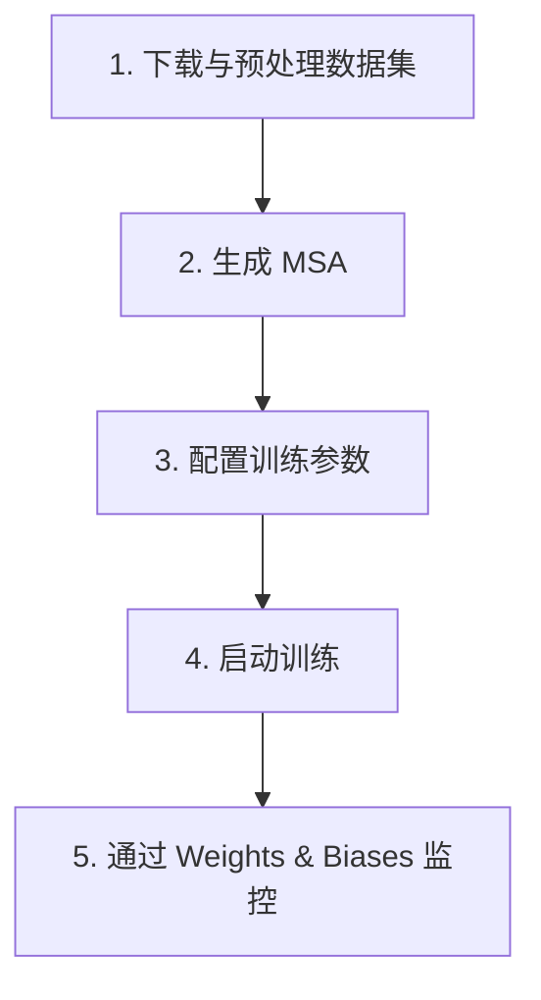

---
slug:2-quick-start
blog_type:normal
---


几分钟内让 PepTron 运行起来 —— 从 Docker 配置到生成你的第一个蛋白质结构系综。本指南将引导你完成三个核心工作流：**安装**、**推理**（从序列生成系综）和**训练**（在你的自有数据上进行微调）。


来源: [README.md](/README.md#L1-L12)

## 前提条件

PepTron 需要 NVIDIA GPU，并依赖于 BioNeMo 框架。在继续操作之前，请确保你的环境满足以下要求：

| 要求 | 规格 |
|---|---|
| **GPU** | 支持 CUDA 12 的 NVIDIA GPU |
| **Docker** | 已安装 NVIDIA Container Toolkit |
| **磁盘** | 约 50 GB（用于 Docker 镜像 + 检查点存储） |

来源: [Dockerfile](/Dockerfile#L1-L40)

## 步骤 1 — 安装 PepTron

PepTron 以 Docker 容器的形式发布，该容器基于 NVIDIA 的 BioNeMo 框架镜像构建。克隆仓库并构建容器：

```bash
# 克隆仓库
git clone https://github.com/PeptoneLtd/peptron.git
cd peptron

# 构建 Docker 容器
docker build -t peptron:latest .

# 运行容器并启用 GPU 访问
docker run --gpus all -it --rm peptron:latest
```

该 Dockerfile 基于 `nvcr.io/nvidia/clara/bionemo-framework:2.7.1` 构建，安装了 cuEquivariance (`0.8.0`)，并编译了支持 TRT cuEquivariance 的自定义 OpenFold 分支。构建过程还会下载结构模块所需的立体化学属性。

来源: [Dockerfile](/Dockerfile#L1-L40), [README.md](/README.md#L17-L29)

## 步骤 2 — 下载预训练检查点

预训练检查点托管在 Zenodo 上。请在运行推理之前下载并解压：

```bash
# 从 Zenodo 下载
wget https://zenodo.org/records/17306061/files/PepTron.tar.gz

# 解压 — 这将创建 peptron-checkpoint 目录
tar -xzf PepTron.tar.gz
```

提供了两个检查点：

| 检查点 | 描述 | 适用场景 |
|---|---|---|
| **PepTron** | 在整个蛋白质组上具有最佳性能 | 生产推理 |
| **PepTron-base** | 仅在 PDB 上预训练 | 微调的起点 |

来源: [README.md](/README.md#L32-L37)

## 步骤 3 — 准备你的输入序列

PepTron 通过 **CSV 文件** 接受蛋白质序列，该文件包含两列：`name` 和 `seqres`。创建你的输入文件：

```csv
name,seqres
protein1,MKTAYIAKQRQISFVKSHFSRQLEERLGLIEVQA
protein2,MSHHWGYGKHNGPEHWHKDFPIAKGERQSPVDID
```

`name` 列用作输出目录的标识符。`seqres` 列包含单字母编码的氨基酸序列。序列的数量或长度没有硬性限制，但较长的序列会消耗更多的 GPU 显存。

来源: [README.md](/README.md#L52-L58)

## 步骤 4 — 运行推理

推理管线遵循清晰的流程 — 从 CSV 输入，经过流匹配采样，到压缩的轨迹输出：


### 使用便捷脚本

`run_peptron_infer.sh` 脚本同时处理采样和后处理。通过命令行选项传递你的路径：

```bash
sh run_peptron_infer.sh \
  --input /path/to/sequences.csv \
  --checkpoint /path/to/peptron-checkpoint \
  --results /path/to/results \
  --filter-unphysical
```

### 底层运行机制

该脚本分两个阶段执行。**阶段 1** 使用 `peptron_o_inference` 配置预设调用 `peptron.infer`，这会禁用模板，将循环迭代次数设置为零，并运行连续流匹配采样器。**阶段 2** 遍历每个蛋白质结果目录，并运行 `petron.compress_ensemble` 将单个 PDB 文件转换为紧凑的 `topology.pdb` + `trajectory.xtc` 对，同时在此过程中过滤掉非物理帧（断裂的骨架几何结构、空间位阻冲突）。

来源: [run_peptron_infer.sh](/run_peptron_infer.sh#L1-L82), [peptron/infer.py](/peptron/infer.py#L58-L63), [peptron/compress_ensemble.py](/peptron/compress_ensemble.py#L12-L51)

### 推理参数

关键参数控制系综大小、采样质量和 GPU 利用率。你可以通过便捷脚本覆盖它们，或者编辑 `peptron/model/config.py`：

| 参数 | 默认值 | 描述 |
|---|---|---|
| `samples` | 10 | 要生成的系综构象数量 |
| `steps` | 10 | 流匹配去噪步数 |
| `max_batch_size` | 1 | 每个系综并行生成的结构数 |
| `num_gpus` | 1 | 要使用的 GPU 数量（必须 ≤ 输入序列的数量） |
| `tmax` | 1.0 | 采样调度终点（1.0 = 完整，<1.0 = 截断） |

<CgxTip>**显存管理**：`max_batch_size=1` 是避免 OOM（显存溢出）的安全默认值。仅在你的 GPU 显存和序列长度允许时才增加该值 — `max_batch_size × 序列长度` 的乘积决定了峰值 VRAM。对于长无序序列，请保持该值为 1。</CgxTip>

<CgxTip>**cuEquivariance 回退**：如果生成的结构未通过物理接受测试，请在 `config.py` 中设置 `use_cuequivariance=False` 来停用 cuEquivariance。这将回退到标准的注意力和乘法更新实现。</CgxTip>

来源: [peptron/model/config.py](/peptron/model/config.py#L822-L847), [run_peptron_infer.sh](/run_peptron_infer.sh#L64-L77), [README.md](/README.md#L183-L195)

### 输出结构

推理完成后，你的结果目录将为每个输入蛋白质包含一个子文件夹：

```
results/
├── protein1/
│   ├── topology.pdb          # 参考结构
│   └── trajectory.xtc        # 系综构象（已过滤）
├── protein2/
│   ├── topology.pdb
│   └── trajectory.xtc
└── params.json               # 完整的推理配置转储
```

每个 `trajectory.xtc` 保存物理上有效的构象。`params.json` 记录了用于可复现性的完整配置。

来源: [peptron/compress_ensemble.py](/peptron/compress_ensemble.py#L12-L50), [peptron/infer.py](/peptron/infer.py#L310-L312)

## 步骤 5 — 训练（可选）

训练 PepTron 同时需要 PDB 和 IDRome-o 数据集。这是一个高级工作流 — 完整详情请参阅专门的深入讲解页面。以下是高级流程：



### 数据集准备（摘要）

| 数据集 | 步骤 | 关键命令 |
|---|---|---|
| **PDB** | 下载 mmCIF → 提取 → 生成 MSA → 解压为 NPZ → 聚类 | `dataprep.unpack_mmcif`, `dataprep.cluster_chains` |
| **IDRome-o** | 从 Zenodo 下载 → 预处理轨迹 → 生成 MSA | `dataprep.prep_idrome` |

来源: [README.md](/README.md#L82-L109)

### 配置训练

编辑 `peptron/model/config.py` 中的 `training` 部分。`peptron_o_mixed` 预设配置了混合 PDB+IDRome 策略，其中 `dataset_prob_pdb=0.3`，`dataset_prob_idp=0.7`：

```python
# 在 peptron/model/config.py — training 部分
"training": {
    "experiment_dir": "/path/to/experiment",
    "experiment_name": "my-peptron-run",
    "n_steps_train": 2500,
    "micro_batch_size": 8,
    "devices": 8,
    "precision": "bf16-mixed",
    "dataset_prob_pdb": 0.3,
    "dataset_prob_idp": 0.7,
    # ... 数据路径 ...
}
```

来源: [peptron/model/config.py](/peptron/model/config.py#L770-L818), [README.md](/README.md#L111-L166)

### 启动训练

```bash
# 单节点，8 GPU
sh run_peptron_train.sh

# 多节点分布式训练（请先编辑 PYTHONPATH）
sh run_peptron_distributed_train.sh
```

单节点脚本设置 `TORCHDYNAMO_SUPPRESS_ERRORS=1` 和 `CUDA_LAUNCH_BLOCKING=1` 以保证稳定性，然后运行 `python -m peptron.train`。分布式变体使用 `torchrun --nproc_per_node=8`。

来源: [run_peptron_train.sh](/run_peptron_train.sh#L1-L5), [run_peptron_distributed_train.sh](/run_peptron_distributed_train.sh#L1-L8), [peptron/train.py](/peptron/train.py#L51-L53)

## 故障排除

| 问题 | 原因 | 解决方案 |
|---|---|---|
| **CUDA 显存溢出** | 对于序列长度，`max_batch_size` 过大 | 设置 `max_batch_size=1`；减小 `micro_batch_size` |
| **cuEquivariance 导入错误** | 未安装 `cuequivariance-torch` | 忽略 torchdynamo 警告；或设置 `use_cuequivariance=False` |
| **检查点加载错误** | 路径不匹配或配置不兼容 | 验证检查点路径是否与模型配置预设匹配 |
| **非物理轨迹** | cuEquivariance 数值精度问题 | 在 `config.py` 中设置 `use_cuequivariance=False` |
| **训练收敛问题** | 数据路径或 CSV 格式错误 | 验证 `training` 部分中的所有路径；检查 CSV 是否包含 `name,seqres` 列 |

来源: [README.md](/README.md#L216-L229), [peptron/utils/filter_unphysical_traj.py](/peptron/utils/filter_unphysical_traj.py#L82-L106)

## 接下来去哪

既然你已经能够生成系综，接下来可以探索架构和高级特性：

1. **[预训练模型](3-pre-trained-models)** — 详细的检查点规格与预期性能基准
2. **[架构概述](4-architecture-overview)** — ESM2、FoldingTrunk 和流匹配如何连接
3. **[连续流匹配](5-continuous-flow-matching)** — 系综采样背后的生成引擎
4. **[推理与系综生成](15-inference-and-ensemble-generation)** — 高级推理配置与多 GPU 策略
5. **[配置参考](16-configuration-reference)** — 所有配置部分的完整参数文档