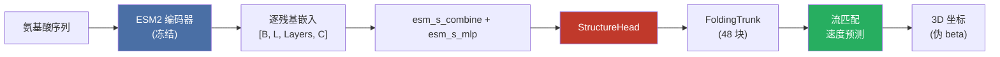
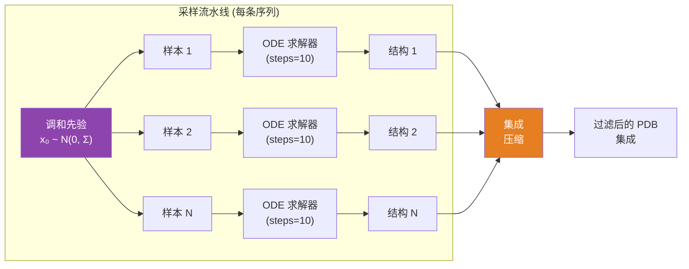

---
slug:3-pre-trained-models
blog_type:normal
---


PepTron 附带两类预训练检查点：**ESM2 序列编码器**（继承自 BioNeMo）和 **PepTron 结构模型**本身（带有流匹配头的 ESMFoldSeqModel）。在运行预测或微调之前，理解这些检查点如何组合成完整的推理流水线至关重要。

## 模型架构组合

每个 PepTron 检查点都是一个**两阶段架构**——一个冻结的 ESM2 骨干网络用于生成逐残基嵌入，随后是一个可训练的 `StructureHead`，通过连续流匹配将这些嵌入转换为 3D 坐标。该组合在 `ESMFoldSeqModel` 类中表达，它继承自 `ESM2Model` 并在后处理流水线阶段附加了结构头。



编码器**默认冻结**（`encoder_frozen: True`），意味着训练期间仅更新 `StructureHead` 的参数。此设计将序列理解（ESM2 的预训练知识）与结构生成（PepTron 学习到的流匹配动态）分离开来。

来源: [model.py](peptron/model/model.py#L56-L149), [config.py](peptron/model/config.py#L815-L817)

## ESM2 骨干网络变体

PepTron 基于 **ESM2-3B** 变体构建，但 BioNeMo 框架提供了三种 ESM2 预训练规模。每个变体在训练基础设施中被定义为一种配方（recipe），并决定了输入到 `StructureHead` 的序列嵌入维度。

| 变体 | 层数 | 隐藏层大小 | 注意力头数 | FFN 隐藏层 | 近似参数量 | 张量并行 |
|---------|--------|-------------|-----------------|------------|----------------|-----------------|
| **ESM2-8M** | 6 | 320 | 20 | 1,280 | ~8M | 1 |
| **ESM2-650M** | 33 | 1,280 | 20 | 5,120 | ~650M | 1 |
| **ESM2-3B** | 36 | 2,560 | 40 | 10,240 | ~3B | 2 |

**ESM2-3B** 是 PepTron 中使用的默认骨干网络，如模型配置 `model.esm2` 中的设置：`feats: 2560`、`num_layers: 36`、`attention_heads: 40`。此变体在分布式训练时至少需要为 2 的张量模型并行度。配置中的 `esm_type` 字段被设置为 `"esm2_3B"`。

<CgxTip>加载 PepTron 检查点时，ESM2 编码器权重从同一检查点文件中加载——无需提供单独的 ESM2 检查点。训练配置中的 `initial_ckpt_path` 指向包含编码器和结构头权重的单个 `.nemo` 或 Megatron 检查点。</CgxTip>

来源: [recipes.py](esm2/run/recipes.py#L115-L227), [config.py](peptron/model/config.py#L571-L578)

## PepTron 配置预设

`peptron/model/config.py` 中的 `get_config()` 函数定义了命名预设，用于为不同的训练机制和推理配置模型。每个预设都会修改基础 `config` 字典，以设置模板使用方式、流匹配概率、裁剪大小和损失权重。

### 训练预设

| 预设 | 模板 | 裁剪大小 | 噪声概率 | 自条件概率 | 额外输入概率 | 用途 |
|--------|-----------|-----------|------------|----------------|------------------|---------|
| `initial_training` | ✅ | 256 | 0.5 | 0.5 | 0.5 | 基础 AF2 风格初始化 |
| `finetuning` | ✅ | 384 | 0.5 | 0.5 | 0.5 | 带冲突损失的标准微调 |
| `finetuning_ptm` | ✅ | 384 | 0.5 | 0.5 | 0.5 | 启用 TM 头的微调 |
| `idp_finetuning_no_templ` | ❌ | 384 | 0.5 | 0.5 | 0.5 | 侧重 IDP 的微调，无模板 |
| `peptron_o_mixed` | ❌ | 512 | 0.5 | 0.5 | 0.5 | **混合 PDB+IDRome 训练** |
| `peptron_o_pdb_idrome` | ❌ | 512 | 0.9 | 0.0 | 0.5 | 高噪声 PDB+IDRome |
| `peptron_o_pdb_idrome_violation` | ❌ | 512 | 0.9 | 0.0 | 0.5 | 上述 + 冲突损失 |

### 推理预设

| 预设 | 模板 | 循环迭代次数 | 用途 |
|--------|-----------|-----------------|---------|
| `peptron_o_inference` | ❌ | 0 | **标准 PepTron 推理** |
| `peptron_o_pdb` | ❌ | 0 | 仅 PDB 推理 |
| `peptron_o_idp` | ❌ | 0 | 仅 IDP 推理 (noise_prob=0.9, self_cond=0.0) |
| `peptron_o_pdb_last_steps` | ❌ | 0 | 带冲突 + TM 损失的 PDB 推理 |

**默认训练预设**为 `peptron_o_mixed`（在 `peptron/train.py` 中引用），**默认推理预设**为 `peptron_o_inference`（在 `peptron/infer.py` 中引用）。所有 PepTron 预设均禁用模板（`template.enabled: False`）并设置 `max_recycling_iters: 0`，这体现了 PepTron 的流匹配设计，即用基于 ODE 的采样替代迭代循环。

来源: [config.py](peptron/model/config.py#L67-L261), [train.py](peptron/train.py#L51), [infer.py](peptron/infer/infer.py#L60)

## 流匹配推理参数

使用预训练的 PepTron 检查点运行推理时，流匹配 ODE 求解器由三个关键参数控制，它们决定了生成结构的质量和多样性：

| 参数 | 默认值 | 描述 |
|-----------|---------|-------------|
| `samples` | 10 | 每条序列的独立结构采样数 |
| `steps` | 10 | 每个样本的 ODE 离散化步数 |
| `tmax` | 1.0 | 最大积分时间；控制从噪声到结构的调度 |

推理调度被构建为 `np.linspace(tmax, 0, steps + 1)`，从 `tmax` 到 0 进行反向积分。当 `0 < tmax < 1.0` 时，会在 `t=1.0` 处前置一个热启动步，允许模型先从纯噪声进行预测，然后再从中间的 `tmax` 状态进行细化。



生成所有样本后，PepTron 会运行带有 `--filter-unphysical` 参数的 `peptron.compress_ensemble`，以移除具有非物理几何结构的结构，从而生成最终过滤后的集成结果。

来源: [infer.py](peptron/infer.py#L189-L196), [run_peptron_infer.sh](run_peptron_infer.sh#L64-L81)

## 使用预训练检查点运行推理

推理 shell 脚本 `run_peptron_infer.sh` 提供了运行预测的规范接口。它接受三个必需参数：

| 标志 | 描述 |
|------|-------------|
| `--input` / `-i` | 包含输入序列的 CSV 文件路径 |
| `--checkpoint` / `-c` | PepTron `.nemo` 检查点的路径 |
| `--results` / `-r` | 预测结构的输出目录 |
| `--filter-unphysical` / `-f` | 启用非物理轨迹过滤 |

**示例调用：**

```bash
./run_peptron_infer.sh \
    --input sequences.csv \
    --checkpoint /path/to/peptron-checkpoint \
    --results predictions/
```

在底层，这会使用以下默认并行度和采样设置调用 `python -m peptron.infer`：单节点单 GPU 推理，微批次大小为 1，每条序列 10 个样本，10 个 ODE 步数，以及 `tmax=1.0`。所有参数均可通过 `--config.*` 标志命名空间进行覆盖。

来源: [run_peptron_infer.sh](run_peptron_infer.sh#L1-L82), [infer.py](peptron/infer.py#L72-L97)

## 模型维度摘要

完整的 PepTron 模型具有以下关键维度参数，它们在配置中被定义为字段引用，以便在所有子模块中一致地传播：

| 符号 | 值 | 作用 |
|--------|-------|------|
| `c_z` | 128 | 成对（z-pair）状态维度 |
| `c_m` | 256 | MSA（m-pair）状态维度 |
| `c_s` | 384 | 单序列状态维度 |
| `c_e` | 64 | 额外 MSA 嵌入维度 |
| `c_t` | 64 | 模板嵌入维度 |

`FoldingTrunk` 在 48 个 Transformer 块中以 `sequence_state_dim: 1024` 和 `pairwise_state_dim: 128` 运行。`StructureHead` 通过学习的 `esm_s_combine` softmax 加权和 `esm_s_mlp` 投影（2560 → 1024）组合 ESM2 嵌入（来自 37 层的 2560 维），在进入主干网络之前，将序列表示与成对距离嵌入和高斯傅里叶时间投影相融合。

来源: [config.py](peptron/model/config.py#L264-L277), [config.py](peptron/model/config.py#L599-L629), [model.py](peptron/model/model.py#L181-L209)

## 检查点加载与配置类

PepTron 支持两种用于检查点加载的配置类，通过 `config.inference.config_class` 字段指定：

| 配置类 | 模块 | 用例 |
|-------------|--------|----------|
| `ESMFoldSeqConfig` | `peptron.model.model` | **完整 PepTron 模型**——加载 ESM2 编码器 + StructureHead + 流匹配 |
| `ESM2Config` | `esm2.model.model` | 仅 ESM2——仅加载序列编码器用于提取嵌入 |

默认为 `ESMFoldSeqConfig`。加载检查点时，`get_esmfoldconfig()` 函数会构建完整的模型配置，通过 `initial_ckpt_path` 传递检查点路径，并设置 `pretrained_structure_head_path` 以便在需要时单独加载特定于结构的权重。编码器权重在加载后被冻结（`encoder_frozen: True`），而结构头默认保持可训练（`structure_frozen: False`）。

<CgxTip>在推理期间，`initial_ckpt_skip_keys_with_these_prefixes` 参数默认设置为空列表，这意味着检查点中的所有键都会被加载。如果在从使用不同配置预设训练的检查点进行微调时遇到键不匹配的情况，你可以使用此参数跳过不兼容的键，而不是默默地失败。</CgxTip>

来源: [infer.py](peptron/infer.py#L66-L69), [infer.py](peptron/infer.py#L174-L182), [config.py](peptron/model/config.py#L844-L846)

## 下一步

现在你已经了解了预训练模型的全貌，可以进一步探索这些组件的具体工作原理：

- **[架构概述](4-architecture-overview)** —— 从序列到 3D 结构的端到端数据流
- **[ESM2 序列编码器](8-esm2-sequence-encoder)** —— 冻结骨干网络与嵌入提取的内部机制
- **[连续流匹配](5-continuous-flow-matching)** —— ODE 求解器如何从噪声生成结构
- **[推理与集成生成](15-inference-and-ensemble-generation)** —— 分布式推理、采样策略及集成过滤
- **[配置参考](16-configuration-reference)** —— 所有配置预设的完整参数参考