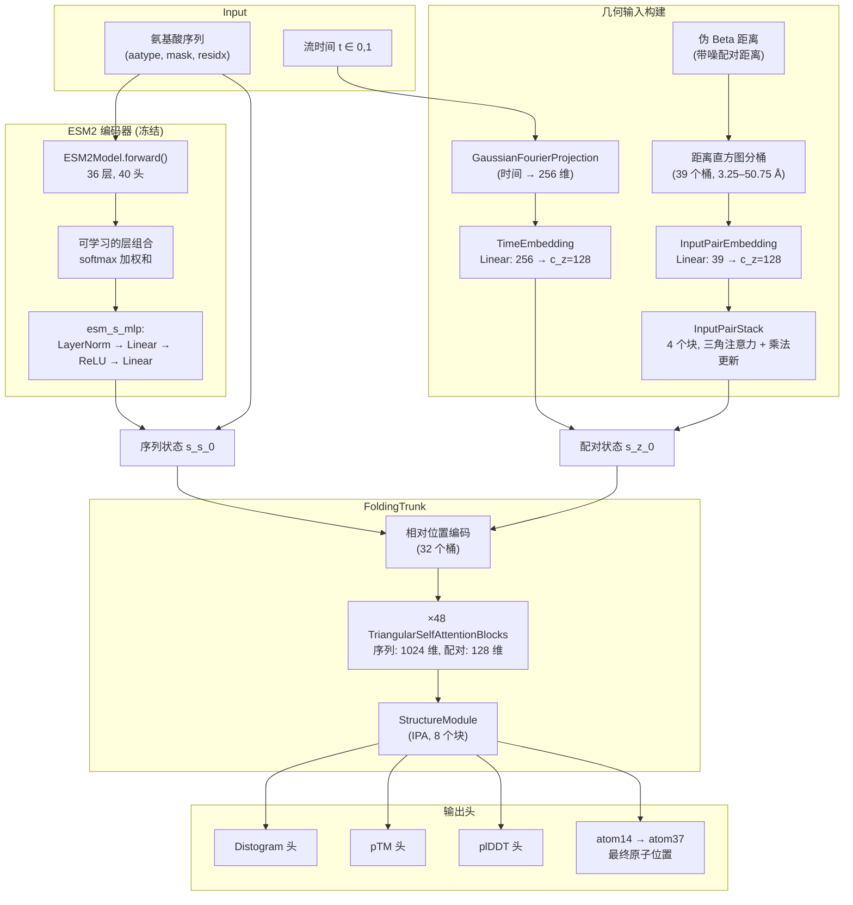

---
slug:4-architecture-overview
blog_type:normal
---


PepTron 是一个**基于流匹配的蛋白质结构预测系统**，它将冻结的 ESM2 序列编码器与可训练的结构头相结合，并由针对调和先验的连续流匹配机制所驱动。本页提供了顶层架构图——包括数据流、模块层次结构以及将它们绑定在一起的设计决策——将更深入的组件分析留给目录中的后续页面。

## 系统架构概览

完整的前向路径通过四个紧密耦合的阶段将氨基酸序列转换为 3D 原子坐标：**(1)** 通过 ESM2 进行序列编码，**(2)** 根据带噪坐标和流时间构建几何输入，**(3)** 经过 PairStack 细化后执行 FoldingTrunk 注意力计算，以及 **(4)** 通过结构模块解码为全原子位置。在训练期间，`FlowSteps` 控制器围绕此核心前向传递来编排噪声注入、自条件和指标记录。



来源: [model.py](peptron/model/model.py#L56-L149), [model.py](peptron/model/model.py#L152-L250), [model.py](peptron/model/model.py#L313-L500)

## 两级模型层次结构

PepTron 的模型被组织为**两个 `nn.Module` 类的组合**，它们将语言模型主干与结构预测头干净地分离，从而实现独立的冻结和 Megatron 流水线并行分阶段部署。

| 类 | 角色 | 可训练？ | 关键子模块 |
|---|---|---|---|
| `ESMFoldSeqModel` | 封装 ESM2 编码器；管理流水线并行拆分 | 编码器通过 `encoder_frozen` 标志冻结 | `ESM2Model` (父类), `StructureHead` |
| `StructureHead` | 从 ESM 嵌入到 3D 坐标的完整结构预测流水线 | 通过 `structure_frozen` 标志选择性冻结 | `esm_s_mlp`, `embedding`, `input_pair_embedding`, `input_pair_stack`, `input_time_projection`, `trunk` (FoldingTrunk), `distogram_head`, `ptm_head`, `lddt_head` |

在编码器产生隐藏状态后，`ESMFoldSeqModel.forward()` 完全委托给 `StructureHead`。编码器的多层隐藏状态被提取为 `[B, L, Layers, C]`，通过跨层的可学习 softmax 加权和进行组合，然后通过 MLP 投影。**BOS/EOS 标记处理**是不对称的：前置一个 BOS 标记，用 EOS 替换第一个填充位置，然后在最终表示中将两者都去除。

来源: [model.py](peptron/model/model.py#L56-L149), [model.py](peptron/model/model.py#L100-L143)

## StructureHead 前向传递 — 数据流细节

`StructureHead.forward()` 方法实现了核心计算图。以下是精确的操作序列，并附有张量形状的注释（其中 `B` = 批次大小，`L` = 序列长度）：

**阶段 1 — 序列表示。** ESM2 隐藏状态在层间进行 softmax 组合并投影：`esm_s` → `esm_s_mlp` → 形状为 `[B, L, c_s]` 的 `s_s_0`。添加氨基酸嵌入：`s_s_0 += embedding(aa)`。

**阶段 2 — 来自带噪几何的配对表示。** 如果批次中存在 `noised_pseudo_beta_dists`（流匹配模式），则将配对距离分桶到距离直方图中（39 个桶，跨度为 3.25–50.75 Å），通过 `input_pair_embedding` 进行嵌入，并通过 `InputPairStack`（4 个三角注意力 + 乘法更新块）进行细化。流时间 `t` 通过 `GaussianFourierProjection` → `Linear` 路径进行投影，并**广播加**到每个配对位置：`inp_z += time_emb[:, None, None]`。

**阶段 3 — 额外输入路径（可选）。** 当启用 `flow_matching.extra_input` 时，**第二条并行路径**通过 `extra_input_pair_embedding` + `extra_input_pair_stack` 处理真实值或辅助原子位置，并将结果加到配对状态：`inp_z += extra_inp_z`。这为模型在训练期间提供了结构性辅助信息。

**阶段 4 — 自条件化 / 循环。** 如果提供了 `prev_outputs`（来自先前的正向传递），则先前的序列状态、配对状态和距离直方图将被 LayerNorm 处理并作为残差连接添加。这实现了自条件化机制，从而支持迭代细化。

**阶段 5 — FoldingTrunk。** 序列和配对状态进入主干，应用相对位置编码、48 次 `TriangularSelfAttentionBlock` 迭代，最后通过 `StructureModule`（基于 IPA，8 个块）产生原子位置。

**阶段 6 — 输出头。** 主干输出馈入距离直方图、pTM、plDDT 和语言模型头。最终原子位置从 atom14 转换为 atom37 表示。

来源: [model.py](peptron/model/model.py#L313-L500), [input_stack.py](peptron/model/input_stack.py#L184-L303)

## 流匹配控制器 — FlowSteps

`FlowSteps` 类（存在两个变体：`flow.py` 和 `flowmoco.py`）是**编排层**，在训练和推理期间，它使用特定于流匹配的逻辑来封装模型的前向传递。

### 训练前向步骤 (`peptron_forward_step`)

`peptron_forward_step` 函数实现了一个具有三个随机门的概率训练机制，这些门由配置概率控制：

| 门 | 概率 | 动作 |
|---|---|---|
| **噪声注入** | `noise_prob` (默认 0.5) | 调用 `_add_noise(batch)` 以采样调和先验、插值，并将带噪距离 + 时间 `t` 注入批次 |
| **额外输入移除** | `1 - extra_input_prob` | 从批次中移除 `extra_all_atom_positions`，强制模型在没有结构辅助信息的情况下进行预测 |
| **自条件化** | `self_cond_prob` (默认 0.5) | 运行一次 `torch.no_grad()` 前向传递以获取 `prev_outputs`，并将其馈送到主前向传递 |

如果跳过了噪声注入（`noise_prob` 门失败），模型接收 `t=1`（纯数据信号），从而也有效地在确定性结构预测上进行训练。

### 噪声注入 (`_add_noise`)

核心训练噪声过程：(1) 从 `HarmonicPrior` 采样，(2) 将噪声与数据进行 RMSD 对齐，(3) 采样均匀时间 `t`，(4) 线性插值 `noisy_beta = (1-t) * x1 + t * noisy`，(5) 计算配对距离并注入批次。

来源: [flow.py](peptron/model/flow.py#L42-L133), [flow.py](peptron/model/flow.py#L268-L336), [flowmoco.py](peptron/model/flowmoco.py#L43-L118)

## 调和先验

`HarmonicPrior` 类实现了**主链坐标上的高斯分布**，其协方差是离散拉普拉斯（调和）矩阵 `J` 的伪逆。该矩阵编码了最近邻弹簧连接，刚度为 `a = 3/(3.8²)`，其中 3.8 Å 是特征的 Cα–Cα 键长。特征分解 `J = P D Pᵀ` 被预计算，采样按 `P · (D⁻ᐟ² · z)` 进行，其中 `z ~ N(0, I)`。该先验产生**物理上逼真的主链样构象**，作为流匹配的起点。

来源: [flow.py](peptron/model/flow.py#L42-L69)

## 推理 — 线性插值调度

在推理期间，`FlowSteps.linear_interpolation()` 实现了学习流的**欧拉式 ODE 积分**：

1. 从 `HarmonicPrior` 采样以获得初始带噪坐标
2. 按离散调度步进（默认：`[1.0, 0.75, 0.5, 0.25, 0.1, 0]`）
3. 在每一步：前向传播模型，提取预测的伪 beta，将噪声与预测进行 RMSD 对齐，通过线性插值或 MoCo 的 `cfm.step()` 更新噪声状态，重新计算下一步的距离和时间
4. 可选地馈送 `prev_outputs` 以实现跨步的自条件化

`flowmoco.py` 变体委托给 BioNeMo 的 `ContinuousFlowMatcher.step()` 进行更新，而 `flow.py` 使用直接线性公式：`noisy = (s/t) * noisy + (1 - s/t) * pseudo_beta`。

来源: [flow.py](peptron/model/flow.py#L206-L265), [flowmoco.py](peptron/model/flowmoco.py#L265-L336)

## 双流实现 — flow.py vs flowmoco.py

PepTron 提供了**两个可互换的流匹配后端**，它们共享相同的 `FlowSteps` 接口，但底层框架依赖不同：

| 方面 | `flow.py` | `flowmoco.py` |
|---|---|---|
| **先验** | 自定义 `HarmonicPrior` (手动特征分解) | BioNeMo `LinearHarmonicPrior` |
| **插值** | 直接: `(1-t)*x1 + t*noisy` | BioNeMo `ContinuousFlowMatcher.interpolate()` |
| **推理步** | 手动: `(s/t)*noisy + (1-s/t)*pred` | BioNeMo `ContinuousFlowMatcher.step()` |
| **时间约定** | `t=0` 是数据, `t=1` 是噪声 | MoCo 约定翻转: `t_moco = 1 - t` |
| **依赖** | 自包含 (仅 numpy, torch) | 需要 `bionemo.moco` |
| **推理附加项** | — | 用于熵调度的 `predictor_fn()`, `x_0_sampler_fn()`, `x_1_sampler_fn()` |

`flowmoco.py` 变体还暴露了 `predictor_fn()`，它将模型前向传递封装为可调用对象，以便与 BioNeMo 的 ODE 采样器和熵时间调度器集成。

来源: [flow.py](peptron/model/flow.py#L1-L336), [flowmoco.py](peptron/model/flowmoco.py#L1-L410)

## 分布式训练基础设施

PepTron 利用 **NVIDIA NeMo2 + Megatron** 进行分布式训练，通过 `peptron/train.py` 编排。关键集成点：

- **策略**: `MegatronStrategy`，具有可配置的张量和流水线模型并行
- **精度**: `MegatronMixedPrecision`，默认为 bf16-mixed
- **优化器**: 分布式 Adam 配合 `WarmupAnnealDecayHoldScheduler` (预热 → 退火 → 保持 min_lr)
- **前向步骤绑定**: `flow.init_flow_steps()` 创建单例 `FlowSteps`，然后 `flow.peptron_forward_step` 通过 `biobert_lightning_module(forward_step=...)` 注册为自定义前向步骤
- **数据步骤**: `structure_data_step` 处理结构预测的自定义批次整理

`ESMFoldSeqModel` 继承自 `ESM2Model` (BioNeMo)，实现了无缝的流水线并行拆分，其中编码器占据早期阶段，结构头占据最后阶段。

来源: [train.py](peptron/train.py#L65-L189)

## 配置架构

`config.py` 中的配置系统使用 `ml_collections.ConfigDict` 和 `FieldReference` 对象来处理共享的维度参数。架构通过 `get_config(name)` 暴露**命名预设**，这些预设将特定于预设的覆盖层叠在综合基础配置之上：

| 预设 | 用途 | 关键覆盖 |
|---|---|---|
| `peptron_o_mixed` | 混合 PDB + IDRome 训练 | `crop_size=512`, `noise_prob=0.5`, `self_cond_prob=0.5`, `extra_input_prob=0.5` |
| `peptron_o_pdb_idrome` | 具有重度噪声的 PDB+IDRome | `noise_prob=0.9`, `self_cond_prob=0.0` |
| `peptron_o_inference` | 推理模式 | 禁用模板，无循环 |
| `idp_finetuning_no_templ` | IDP 微调 | 调整损失权重 (距离直方图 0.2, FAPE 主链 0.6, pLDDT 0.02)，0 次循环迭代 |

基础配置定义了完整的模型几何结构：ESM2 具有 36 层 / 40 头 / 2560 特征，FoldingTrunk 具有 48 块 / 1024 序列状态维度 / 128 配对状态维度，InputPairStack 具有 4 块。

来源: [config.py](peptron/model/config.py#L67-L261), [config.py](peptron/model/config.py#L264-L697)

## 项目目录结构

```
PeptoneLtd/PepTron/
├── peptron/                          # 核心包
│   ├── model/
│   │   ├── config.py                 # 带有命名预设的 ConfigDict
│   │   ├── model.py                  # ESMFoldSeqModel + StructureHead
│   │   ├── flow.py                   # 流匹配 (独立后端)
│   │   ├── flowmoco.py               # 流匹配 (BioNeMo MoCo 后端)
│   │   ├── trunk.py                  # FoldingTrunk (TriSelfAttn → StructureModule)
│   │   ├── tri_self_attn_block.py    # TriangularSelfAttentionBlock
│   │   ├── input_stack.py            # InputPairStack (配对细化)
│   │   ├── layers.py                 # GaussianFourierProjection
│   │   └── loss.py                   # FAPE, 距离直方图, pLDDT, 违反损失
│   ├── data/
│   │   ├── data.py                   # 数据集类 (OpenFold, CSV)
│   │   ├── data_pipeline.py          # 从 mmCIF/PDB 构建特征
│   │   ├── datamodule.py             # Lightning DataModule
│   │   ├── feature_pipeline.py       # 特征变换
│   │   └── protein.py                # 蛋白质 ↔ 输出转换
│   ├── train.py                      # 训练入口 (NeMo2 + Megatron)
│   ├── infer.py                      # 推理入口
│   └── utils/                        # 回调, 张量工具, 日志
├── esm2/                             # ESM2 模型 (BioNeMo 封装)
│   ├── api.py                        # 公共配置 + 模型类
│   ├── model/                        # ESM2Model, 注意力, 嵌入
│   ├── data/                         # 分词器, 数据集, 数据模块
│   └── scripts/                      # 训练/推理脚本
├── dataprep/                         # 数据准备实用程序
│   ├── make_msas.sh                  # MSA 生成流水线
│   ├── preprocess.py                 # 特征预处理
│   ├── prep_idrome.py                # IDRome 数据集准备
│   └── ...
└── splits/                           # 训练/验证拆分 CSV
    ├── IDRome_DB-train.csv
    ├── IDRome_DB-val.csv
    └── cameo2022.csv
```

<CgxTip>PepTron 的架构最好被理解为**用流匹配生成过程替代 AlphaFold2 的 MSA+模板输入路径**：模型不是以进化耦合和结构同源物为条件，而是以带噪的配对距离和流时间为条件，学习从调和先验去噪到天然结构。这就是为什么在所有 PepTron 预设中 `max_recycling_iters=0` 和 `template.enabled=False` 的原因——迭代细化通过流步骤发生，而不是循环。</CgxTip>

<CgxTip>**自条件化机制** (`self_cond_prob`) 是流匹配中 AlphaFold 循环的类似物：以概率 `self_cond_prob`，一次 `torch.no_grad()` 前向传递产生 `prev_outputs`，其序列状态、配对状态和距离直方图作为残差输入馈送到主前向传递。这在*单个训练步骤内*创建了一个迭代细化循环，有别于多步推理调度。</CgxTip>

## 建议阅读顺序

现在你已了解了架构图，请按照目录中的逻辑依赖链继续阅读：

1. **[连续流匹配](5-continuous-flow-matching)** — 数学基础和训练目标
2. **[调和先验采样](6-harmonic-prior-sampling)** — 先验的构造方式及其重要性
3. **[自条件化与推理调度](7-self-conditioning-and-inference-schedule)** — 迭代细化机制
4. **[ESM2 序列编码器](8-esm2-sequence-encoder)** — 冻结的编码器和隐藏状态提取
5. **[结构头与 FoldingTrunk](9-structure-head-and-foldingtrunk)** — 核心预测流水线
6. **[数据流水线与特征处理](11-data-pipeline-and-feature-processing)** — 原始 PDB/IDRome 数据如何转化为模型输入