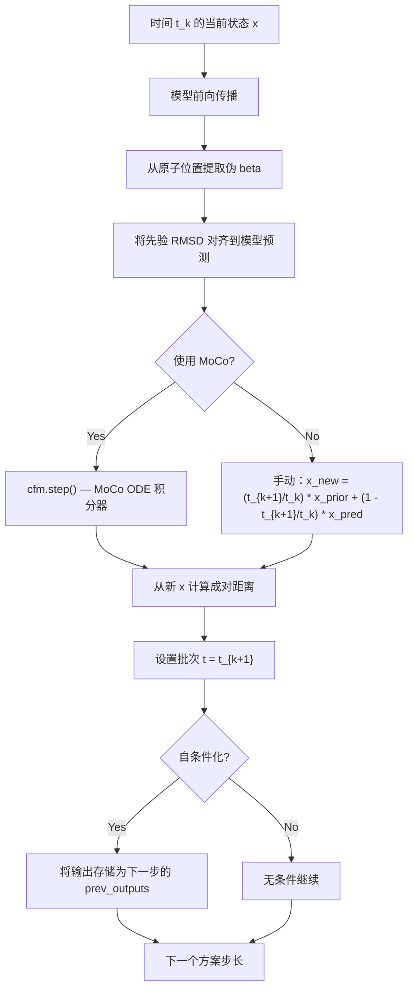
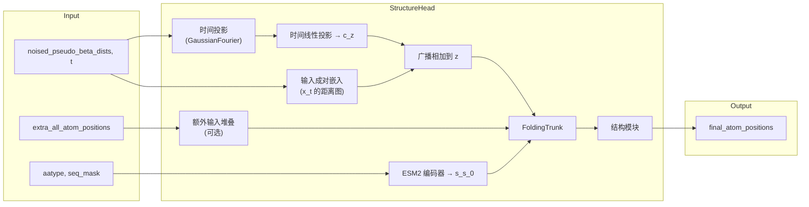

---
slug:5-continuous-flow-matching
blog_type:normal
---

PepTron 用**连续流匹配**引擎取代了 AlphaFold2 的迭代循环机制，该引擎将一个与结构无关的先验转换为具有物理依据的蛋白质构象。该模型并非从与聚合物链毫无物理关系的高斯噪声中进行去噪，而是从编码共价主链连接性的**谐链先验**出发，通过**受最优传输（OT）启发的线性插值**，流向真实的原子坐标。时间以**随机傅里叶特征嵌入**的形式注入到成对表示中，使得 FoldingTrunk 同时成为结构预测器和速度场。

## 数学基础

连续流匹配定义了一条随时间变化的概率路径 $p_t(x)$，将先验分布 $p_0$（噪声）与数据分布 $p_1$（真实结构）连接起来。PepTron 采用了**最优传输（OT）线性插值**：

$$x_t = (1 - t)\, x_1 + t\, x_0, \quad t \in [0, 1]$$

其中 $x_1$ 是真实的伪 beta 坐标张量，$x_0$ 抽取自谐链先验。模型被训练为直接预测 $x_1$（预测类型为 `data`），相应的速度场为：

$$v_t(x_t) = x_1 - x_0$$

这是一个恒定速度场——这是线性插值方案的直接结果，它在坐标空间中产生直线路径。训练目标简化为最小化 $\|v_\theta(x_t, t) - (x_1 - x_0)\|^2$，或者在数据预测下等价于 $\|x_\theta(x_t, t) - x_1\|^2$，其中 $x_\theta$ 是神经网络的输出。

来源：[flow.py](peptron/model/flow.py#L126-L132)，[flowmoco.py](peptron/model/flowmoco.py#L72-L82)

## 谐链先验

先验 $p_0$ 不是各向同性高斯分布。相反，PepTron 从**离散谐链模型**中采样，该模型捕捉了自由连接聚合物的涨落的高斯分布。刚度矩阵 $J$ 由弹簧常数 $a = 3 / 3.8^2$（其中 3.8 Å 是典型的 Cα–Cα 键长）构建：

$$J_{ij} = \begin{cases} 2a & \text{if } i = j \text{ (bulk)} \\ a & \text{if } i = j \text{ (boundary)} \\ -a & \text{if } |i - j| = 1 \\ 0 & \text{otherwise} \end{cases}$$

采样通过特征值分解 $J = P D P^\top$ 进行。由于 $J$ 是具有单一零特征值（平移不变性）的半正定矩阵，其逆矩阵被正则化为：$D^{-1}_{00} = 0$。样本抽取方式为 $x_0 = P \cdot (\sqrt{D^{-1}} \odot z)$，其中 $z \sim \mathcal{N}(0, I_{N \times 3})$，从而产生具有理想化主链正确协方差结构的坐标。

`flowmoco.py` 变体委托给 BioNeMo 的 `LinearHarmonicPrior`，它实现了相同的物理原理，但集成了 MoCo（分子粗粒化）库的 `ContinuousFlowMatcher`。

来源：[flow.py](peptron/model/flow.py#L42-L69)，[flowmoco.py](peptron/model/flowmoco.py#L22-L23)，[flowmoco.py](peptron/model/flowmoco.py#L72-L82)

## 先验样本的 RMSD 对齐

在插值之前，每个先验样本都会通过基于 SVD 的 RMSD 最小化进行**刚体对齐**，以对齐到真实结构。这一点至关重要：谐链先验具有平移和旋转不变性，因此如果不进行对齐，插值将浪费容量去学习简单的刚体运动。`rmsdalign` 函数计算最佳旋转 $R^*$ 和平移 $t^*$，使得 $\|R^* x_0 + t^* - x_1\|_{\text{RMSD}}$ 最小化，然后将变换应用于 $x_0$。如果 SVD 未能收敛，批次时间将被设置为 $t=1$（纯噪声），从而有效地跳过该样本。

来源：[flow.py](peptron/model/flow.py#L118-L123)，[flowmoco.py](peptron/model/flowmoco.py#L100-L106)

## 训练：噪声注入与前向步骤

训练前向步骤由 `peptron_forward_step` 统一调度，它在模型前向传播之前应用三个随机控制：

| 阶段 | 控制 | 概率 | 效果 |
|-------|---------|-------------|--------|
| 噪声注入 | `noise_prob` | 默认 0.5 | 采样 $t \sim \text{Uniform}(0,1)$，插值 $x_t$，将成对距离 + 时间注入批次 |
| 自条件化 | `self_cond_prob` | 默认 0.5 | 使用 `torch.no_grad()` 运行模型一次，将输出作为 `prev_outputs` 送入第二次传播 |
| 额外输入丢弃 | `extra_input_prob` | 默认 0.5 | 以 $1 - p$ 的概率从批次中移除 `extra_all_atom_positions` |

当跳过噪声注入时（概率为 $1 - \text{noise\_prob}$），批次不会收到 `noised_pseudo_beta_dists` 或 `t` 键，模型将回退到其零初始化路径（相当于 $t=0$，即纯数据预测）。这创建了一个**混合训练目标**，将流匹配去噪与标准结构预测交替进行，从而稳定学习过程。

噪声注入过程 `_add_noise`：
1. 采样 $x_0 \sim \text{HarmonicPrior}$
2. 通过 RMSD 将 $x_0$ 对齐到 $x_1$
3. 抽取 $t \sim \text{Uniform}(0, 1)$
4. 计算 $x_t = (1-t)\,x_1 + t\,x_0$
5. 将成对距离 $\|x_t^{(i)} - x_t^{(j)}\|$ 和时间 $t$ 写入批次

来源：[flow.py](peptron/model/flow.py#L106-L132)，[flowmoco.py](peptron/model/flowmoco.py#L84-L117)，[flow.py](peptron/model/flow.py#L280-L336)

## 时间条件化：从标量到成对表示

标量时间 $t$ 通过一个两阶段流水线嵌入到模型的成对状态 $z$ 中：

1. **高斯傅里叶投影**：$t \mapsto [\sin(2\pi W t),\, \cos(2\pi W t)]$，其中 $W \in \mathbb{R}^{128}$ 是一个冻结的随机频率矩阵（默认 `embedding_size=256`）。这会将标量 $t$ 映射到一个 256 维空间，以捕捉多尺度的时间结构。

2. **线性投影 + 广播**：傅里叶嵌入通过 `input_time_embedding` 投影到 $c_z = 128$ 维，然后在所有 $(i, j)$ 残基对上**进行广播相加**：`inp_z += time_emb[:, None, None, :]`。这确保了每个成对标记都接收到相同的时间信号，下游的 `InputPairStack` 和 `FoldingTrunk` 可以将其路由到依赖头部的调制中。

当批次中不存在噪声时（未注入噪声的训练，或在 $t=0$ 处的推理），模型仍会以零输入运行时间嵌入路径，以保持 DDP 兼容性——所有秩必须执行相同的操作。

来源：[layers.py](peptron/model/layers.py#L14-L28)，[model.py](peptron/model/model.py#L199-L206)，[model.py](peptron/model/model.py#L366-L381)

## 推理：使用欧拉步长的线性插值

在推理时，流通过 `linear_interpolation` 方法进行数值积分，该方法使用**类欧拉方案**离散化 ODE $dx/dt = v_t(x)$。默认方案是 `[1.0, 0.75, 0.5, 0.25, 0.1, 0]`，产生从纯噪声到数据的 5 个积分步长。

在每个步长 $(t_k, t_{k+1})$：

`flowmoco.py` 变体使用 `ContinuousFlowMatcher.step()`，它计算线性插值的精确解析步，而 `flow.py` 手动实现等效公式：$x_\text{new} = (s/t)\,x_\text{prior} + (1 - s/t)\,x_\text{pred}$。两者收敛于相同的轨迹——线性 ODE 允许精确的离散化。

自条件化将步骤 $k$ 的输出作为 `prev_outputs` 馈送到步骤 $k+1$，允许模型迭代地改进其预测。推理方案还可以通过 `tmax` 参数进行自定义：当 `tmax < 1.0` 时，部分去噪轨迹会前置一个初始 $t=1$ 步长，从而实现从部分噪声结构开始的**热启动推理**。

来源：[flow.py](peptron/model/flow.py#L206-L265)，[flowmoco.py](peptron/model/flowmoco.py#L265-L336)，[infer.py](peptron/infer.py#L190-L206)

## 两种实现变体

PepTron 提供了两个可互换的 `FlowSteps` 实现：

| 方面 | `flow.py`（独立） | `flowmoco.py`（BioNeMo MoCo） |
|--------|------------------------|-------------------------------|
| 先验 | 自定义 `HarmonicPrior` 类 | 来自 bionemo.moco 的 `LinearHarmonicPrior` |
| 插值 | 手动公式 `(1-t)*x1 + t*x0` | `ContinuousFlowMatcher.interpolate()` |
| 推理步 | 手动 `(s/t)*noisy + (1-s/t)*pred` | `ContinuousFlowMatcher.step()` |
| 时间采样 | `torch.rand()` | `torch.rand()`（MoCo 的 `sample_time` 被覆盖） |
| 依赖项 | 仅依赖 PyTorch | 需要 bionemo.moco |
| ODE 积分 | 带有解析线性步的欧拉法 | MoCo 的内置积分器 |

`flowmoco.py` 变体还提供了 `predictor_fn`、`x_0_sampler_fn` 和 `x_1_sampler_fn` 回调，旨在与 MoCo 的 `EntropicTimeScheduler` 集成，该调度器根据中间分布的熵调整步长。当前的推理入口点（`infer.py`）从 `flowmoco` 导入。

<CgxTip>这两个文件中的 `t` 约定不同：`flow.py` 使用 $t=0$ 表示数据，$t=1$ 表示噪声，而 MoCo 使用相反的约定（$t=0$ 表示噪声，$t=1$ 表示数据）。`flowmoco.py` 实现应用 `t_moco = 1 - t` 来弥合这一差距——这是在两种实现之间切换时容易出现细微错误的常见来源。</CgxTip>

来源：[flow.py](peptron/model/flow.py#L42-L69)，[flowmoco.py](peptron/model/flowmoco.py#L22-L82)，[flowmoco.py](peptron/model/flowmoco.py#L126-L191)，[infer.py](peptron/infer.py#L32)

## 配置预设

流匹配行为由 `model.flow_matching` 配置块控制，并按训练预设进行覆盖：

| 预设 | `noise_prob` | `self_cond_prob` | `extra_input_prob` | 使用场景 |
|--------|-------------|-----------------|-------------------|----------|
| `peptron_o_mixed` | 0.5 | 0.5 | 0.5 | 均衡的 PDB + IDRome 训练 |
| `peptron_o_pdb_idrome` | 0.9 | 0.0 | 0.5 | 偏重流的混合训练 |
| `peptron_o_pdb_idrome_violation` | 0.9 | 0.0 | 0.5 | 同上 + 启用违约损失 |
| `peptron_o_idp` | 0.9 | 0.0 | — | IDP 专属训练 |
| `peptron_o_pdb` | 0.5 (默认) | 0.5 (默认) | 0.5 (默认) | 仅 PDB 训练 |
| 默认 | 0.5 | 0.5 | 0.5 | 基线 |

较高的 `noise_prob` 值（0.9）表示一种强调流匹配路径的训练策略——模型在 90% 的时间里看到噪声中间体，只有 10% 的步骤在纯结构预测模式下运行。IDRome 预设禁用 `self_cond_prob` 反映了这样一个事实：本质上无序的蛋白质缺乏单一明确的结构供自条件化锚定。

<CgxTip>`noise_prob` 参数有效地控制了两种训练机制之间的混合比例：流匹配（带噪声）和直接预测（无噪声）。将 `noise_prob` 设置为 `0.0` 会将 PepTron 降级为标准的结构预测器，而 `noise_prob = 1.0` 使其成为纯流模型。0.5 的默认值平衡了两者，使模型能够在学习去噪的同时保持直接预测能力。</CgxTip>

来源：[config.py](peptron/model/config.py#L691-L696)，[config.py](peptron/model/config.py#L125-L148)，[config.py](peptron/model/config.py#L210-L219)

## 架构集成

流匹配引擎通过 `StructureHead.forward()` 方法中的两个注入点与更广泛的模型集成：

**带噪声的成对距离**通过与标准 ESMFold 用于其距离图输入相同的 `input_pair_embedding` 路径进入，但现在距离反映的是插值结构 $x_t$ 而不是模板。**时间嵌入**在成对堆栈之后被附加注入，提供全局时间上下文来调制主干处理带噪声成对信号的方式。这种设计确保 FoldingTrunk 能够在整个 $t \in [0, 1]$ 范围内无缝运行——在 $t=0$ 时它恢复为标准结构预测，在 $t=1$ 时它从谐链先验进行去噪。

来源：[model.py](peptron/model/model.py#L366-L399)，[model.py](peptron/model/model.py#L199-L209)

## 下一步

流匹配引擎依赖于几个单独记录的支持系统：

- **[谐链先验采样](6-harmonic-prior-sampling)** — 刚度矩阵、特征值分解和采样过程的详细推导
- **[自条件化与推理方案](7-self-conditioning-and-inference-schedule)** — 自条件化如何改进迭代预测以及推理方案的构建方式
- **[结构头与 FoldingTrunk](9-structure-head-and-foldingtrunk)** — 时间条件化的成对状态如何流经主干
- **[损失函数与验证指标](13-loss-functions-and-validation-metrics)** — 流匹配训练损失如何与 FAPE/距离图/违约损失相互作用