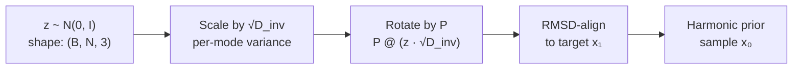
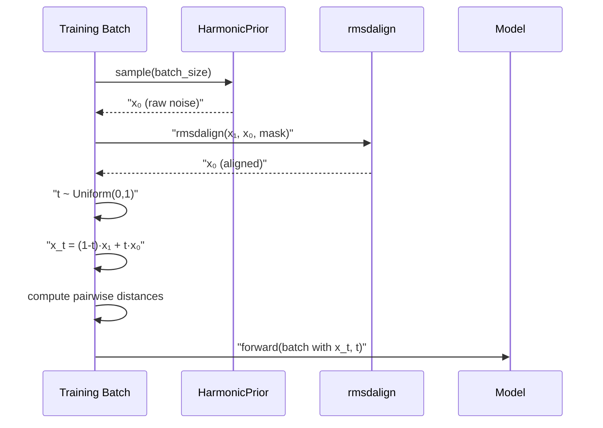

---
slug:6-harmonic-prior-sampling
blog_type:normal
---

PepTron 用**谐和先验**（harmonic prior）替换了流匹配中常用的各向同性高斯噪声——这是一种源自高斯链模型平衡态统计的分布。这一选择并非表面修饰：它将物理链连通性直接注入先验中，确保在习得的速度场起作用之前，采样得到的噪声构象已经遵循真实的残基间距（≈3.8 Å）。结果是推理时收敛更快、训练更稳定，并且从第一步去噪起，生成的结构即遵循聚合物物理。

来源：[flow.py](/peptron/model/flow.py#L42-L69), [flowmoco.py](/peptron/model/flowmoco.py#L72-L82)

## 高斯链模型

谐和先验建立在聚合物物理的一个经典结论之上。考虑一条包含 *N* 个残基的链，其中每一对相邻残基由刚度为 *a* 的谐和弹簧连接。构象 **x** = (x₁, …, xₙ) ∈ ℝ^(N×3) 的能量为：

$$E(\mathbf{x}) = \frac{a}{2} \sum_{i=1}^{N-1} \|\mathbf{x}_{i+1} - \mathbf{x}_i\|^2 = \frac{1}{2} \mathbf{x}^\top (\mathbf{J} \otimes \mathbf{I}_3) \mathbf{x}$$

其中 **J** ∈ ℝ^(N×N) 是**链连通性矩阵**——一个对称半正定三对角矩阵。PepTron 通过遍历所有相邻残基对来构造该矩阵，在对角线的 *(i, i)* 和 *(j, j)* 位置累加刚度 *a*，并在非对角线的 *(i, j)* 和 *(j, i)* 位置放置 −*a*。刚度常数设置为 **a = 3 / 3.8²**，其中 3.8 Å 是蛋白质中 Cα–Cα 键长的特征值。因子 3 源于三个空间维度，从而产生能够重现预期残基间距的逐维度方差。

来源：[flow.py](/peptron/model/flow.py#L43-L52)

## 特征分解与采样

在高斯能量下，平衡态分布为 **N(0, J⁺ ⊗ I₃)**，其中 **J⁺** 是 **J** 的 Moore–Penrose 伪逆。对于长链，**J⁺** 的直接计算是不稳定的，因此 PepTron 执行特征分解 **J = P D Pᵀ** 并构造逆谱 **D_inv = 1/D**，显式地将第一模式置零（**D_inv[0] = 0**），以消除对应于刚体平移的零特征值。采样随后按三个代数步骤进行：

1. **抽取白噪声**：z ~ N(0, I)，形状为 (B, N, 3)，在批次、残基和空间维度上彼此独立。
2. **逐模式缩放**：将每个模式乘以 √D_inv，将逆谱作为逐特征值标准差应用。广播模式 `[None, :, None] 在批次和空间轴上同等缩放。
3. **特征向量旋转**：通过批量矩阵乘法计算 **P** @ z_scaled，从特征基变换回残基坐标。

这产生的样本**在构造上即具有平移不变性**（零模式不携带方差），且其残基间距遵循 Rouse 链分布——一种对蛋白质主链几何具有物理意义的先验。

来源：[flow.py](/peptron/model/flow.py#L49-L69)

## RMSD 对齐与规范固定

谐和先验仅在一个全局 SO(3) 旋转范围内定义。为消除这种歧义，每个采样得到的噪声构象在插值前都会与真实数据坐标 **x₁** 进行 **RMSD 对齐**。`rmsdalign` 函数实现了 Kabsch 算法：通过加权均值将两个点云居中，计算互协方差矩阵，执行 SVD，并应用求得的最优旋转。如果 SVD 未能收敛（罕见的边缘情况），训练步骤将通过设置 *t = 1*（纯噪声）优雅降级，有效跳过该样本。

来源：[flow.py](/peptron/model/flow.py#L118-L123), [util.py](/peptron/utils/util.py#L41-L64)

## 两种实现变体

PepTron 提供了谐和先验的两种可互换实现，通过导入 `flow.py` 或 `flowmoco.py` 来选择：

| 方面 | `HarmonicPrior` (flow.py) | `LinearHarmonicPrior` (flowmoco.py) |
|---|---|---|
| **来源** | 自定义实现 | BioNeMo MoCo 框架 |
| **实例化** | `HarmonicPrior(N=256, a=3/3.8²)` | `LinearHarmonicPrior(length=512, device, rng_generator)` |
| **采样签名** | `.sample(batch_dims=(B,))` | `.sample(shape=(B, N, 3), device, rng_generator)` |
| **特征分解** | 显式 `torch.linalg.eigh` | BioNeMo 内部实现 |
| **时间采样** | `torch.rand` | MoCo 的 `UniformTimeDistribution` |
| **插值** | 手动 `(1-t)·x₁ + t·x₀` | `ContinuousFlowMatcher.interpolate` |
| **推理步** | 手动 `(s/t)·x₀ + (1−s/t)·x₁` | `ContinuousFlowMatcher.step` |

自定义的 `HarmonicPrior` 保持了数学运算的透明性和自包含性。MoCo 变体则委托给 BioNeMo 经过验证的 `ContinuousFlowMatcher` 流水线，后者在内部处理时间方向约定——这需要一个 `t_moco = 1 − t` 的翻转，以协调 PepTron 的约定（t=0 为数据，t=1 为噪声）与 MoCo 的相反约定。两种变体产生相同的分布；选择纯粹是架构层面的。

来源：[flow.py](/peptron/model/flow.py#L42-L69), [flowmoco.py](/peptron/model/flowmoco.py#L22-L82), [flowmoco.py](/peptron/model/flowmoco.py#L108-L117)

## 训练中的角色：噪声注入

在训练期间，`_add_noise` 方法编排了完整的腐败流水线。它实例化最大长度为 512 个残基的谐和先验，抽取一个噪声样本，将其与数据 RMSD 对齐，采样一个随机时间 *t* ∈ [0, 1]，并构造线性插值 **x_t = (1−t)·x₁ + t·x₀**。所得加噪的成对距离被存储为 `noised_pseudo_beta_dists`，并与 *t* 一起注入批次中。这种腐败是随机应用的——由 `noise_prob` 控制——因此模型能看到干净样本和加噪样本的混合，从而提高鲁棒性。

来源：[flow.py](/peptron/model/flow.py#L101-L133), [flowmoco.py](/peptron/model/flowmoco.py#L84-L117)

## 推理中的角色：线性插值调度

在推理时，`linear_interpolation` 驱动生成过程。它首先采样一个全新的谐和先验构象，然后在递减的时间调度上迭代（默认值：[1.0, 0.75, 0.5, 0.25, 0.1, 0]）。在每一步中，模型从当前加噪状态预测伪 beta 坐标；然后使用预测的结构通过流匹配步更新噪声，该步将构象向数据流形移动。自条件化将前一次预测作为 `prev_outputs` 反馈，允许模型精炼自身的中间估计。调度可通过 `tmax` 和 `steps` 参数自定义——当 `tmax < 1.0` 时，在从 `tmax` 线性下降至 0 之前，会前置一个 *t = 1.0* 的热启动步。

来源：[flow.py](/peptron/model/flow.py#L206-L265), [flowmoco.py](/peptron/model/flowmoco.py#L265-L336), [infer.py](/peptron/infer.py#L190-L196)

## 配置参考

谐和先验由配置中 `model.flow_matching` 下的参数控制：

| 参数 | 默认值 | 描述 |
|---|---|---|
| `noise_prob` | 0.5 | 训练期间注入谐和噪声的概率 |
| `self_cond_prob` | 0.5 | 训练期间执行自条件化传递的概率 |
| `extra_input` | False | 是否有额外的结构输入可用 |
| `extra_input_prob` | 0.5 | 启用时保留额外输入的概率 |

训练预设调整这些概率以匹配数据机制。`peptron_o_mixed` 预设（混合 PDB + IDRome）使用均衡的默认值（0.5/0.5/0.5），而 `peptron_o_pdb_idrome` 转变为 `noise_prob = 0.9` 和 `self_cond_prob = 0.0`，以在缺少结构模板的无序链上最大化噪声暴露。谐和先验长度目前在 `flow.py` 和 `flowmoco.py` 中均硬编码为 512 个残基（标记为 TODO，待改为配置驱动选择）。

来源：[config.py](/peptron/model/config.py#L691-L696), [config.py](/peptron/model/config.py#L125-L148), [flow.py](/peptron/model/flow.py#L103)

<CgxTip>刚度常数 a = 3/3.8² 并非任意选取——它是使谐和链中的平衡 Cα–Cα 距离与真实蛋白质中经验性的 3.8 Å 键长相匹配的唯一值。更改此值会将整个噪声分布偏移至偏离物理真实链统计的状态，从而降低训练稳定性和推理收敛性。</CgxTip>

<CgxTip>在 `flow.py` 和 `flowmoco.py` 之间切换时，切记时间方向约定的翻转：PepTron 使用 t=0→数据，t=1→噪声，而 BioNeMo MoCo 使用相反的约定。`flowmoco.py` 中的 `t_moco = 1 − t` 转换是必不可少的——省略它将导致模型在反向插值上训练，并产生退化的样本。</CgxTip>

## 数学总结

完整的谐和先验采样过程可以简明表述。给定链长 *N* 和刚度 *a = 3/3.8²*：

1. 构造 **J** ∈ ℝ^(N×N)：对角线为 2·a（边界除外），次/超对角线为 −a 的三对角矩阵
2. 特征分解：**J** = **P** **D** **P**ᵀ
3. 构造 **D⁺** = diag(1/d₁, …, 1/d_{N−1}, 0) —— 移除零模式的伪逆谱
4. 采样：**x₀** = **P** · diag(√**D⁺**) · **z**，其中 **z** ~ N(0, I_{N×3})
5. 对齐：**x₀** ← Kabsch(**x₁**, **x₀**, **mask**)

这产生 **x₀** ~ N(0, **J⁺** ⊗ **I₃**) 到旋转对齐规范的投影，提供了一个在习得参数介入之前即已尊重链连通性、平移对称性和旋转等价性的先验。

来源：[flow.py](/peptron/model/flow.py#L42-L69)

---

**下一步**：了解自条件化和推理调度如何与谐和先验协同工作以生成最终结构 → [自条件化与推理调度](7-self-conditioning-and-inference-schedule)