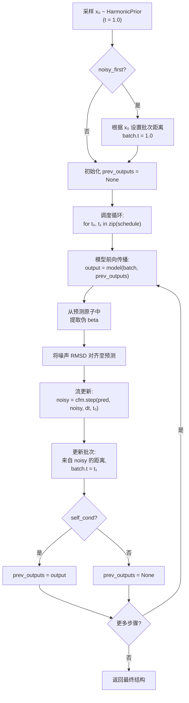

---
slug:7-self-conditioning-and-inference-schedule
blog_type:normal
---


PepTron 的推理流程通过离散的时间调度，完成了从谐波先验噪声到结构化原子坐标的连续流转换，而**自条件**将每一步的结构预测作为辅助输入反馈给下一步——创建了一个迭代优化循环，显著稳定了轨迹质量。本页剖析了这两种机制：训练期间使用的随机自条件协议，以及推理时控制采样的确定性迭代调度。

## 自条件：训练协议

在训练期间，自条件以**概率性**方式应用——以 `self_cond_prob` 的概率，模型执行一次无梯度的初步前向传播以产生 `prev_outputs`，随后将其注入到主前向传播（带梯度追踪）中。这教导模型利用自身的先前预测作为条件信号，映射其在推理时将执行的迭代优化。该机制由 `model.flow_matching` 下的三个配置参数控制：

| 参数 | 默认值 | 作用 |
|-----------|---------|------|
| `noise_prob` | `0.5` | 注入流匹配噪声的概率（对比 `t=1` 时的干净数据） |
| `self_cond_prob` | `0.5` | 执行自条件预传递的概率 |
| `extra_input_prob` | `0.5` | 保留额外的全原子位置输入的概率 |

`peptron_forward_step` 中的训练前向步骤将其实现为一个三阶段流程：(1) 以 `noise_prob` 为条件的噪声注入，(2) 可选的额外输入丢弃，以及 (3) 以 `self_cond_prob` 为条件的自条件预传递。当触发自条件时，一次 `torch.no_grad()` 前向传播产生 `prev`，它作为 `prev_outputs` 传递给主模型调用。当未触发时，`prev=None`，模型在没有循环结构信号的情况下运行。

来源: [flowmoco.py](peptron/model/flowmoco.py#L376-L395), [config.py](peptron/model/config.py#L691-L696)

## 自条件：推理优化循环

在推理时，自条件是**确定性**的——每个调度步骤都会将上一步的输出向前传递。`linear_interpolation` 方法初始化 `prev_outputs = None`，并在每个 ODE 步骤之后有条件地更新它：

```python
prev_outputs = None
for t0, t1 in zip(schedule[:-1], schedule[1:]):
    output = self.model(batch, prev_outputs=prev_outputs)
    ...
    if self_cond:
        prev_outputs = output
```

当 `self_cond=True`（典型设置）时，模型在每一步都会接收到逐步细化的结构上下文。当 `self_cond=False` 时，模型不接收循环信息，每一步的预测独立于先前的输出——这对于消融实验或当模型在未使用自条件进行训练时非常有用（例如，`peptron_o_pdb_idrome` 预设设置了 `self_cond_prob=0.0`）。

`ESMFoldSeqModel.forward` 将 `prev_outputs` 直接传递给 `StructureHead`，在那里它被循环嵌入器消耗以生成对表示和单一表示，从而增强模型的输入嵌入。这种架构路径与 AlphaFold2 的循环机制完全相同，但被重新用于流匹配的逐步条件设定。

来源: [flowmoco.py](peptron/model/flowmoco.py#L302-L326), [model.py](peptron/model/model.py#L145-L149)

## 推理调度构建

推理调度定义了评估 ODE 的离散时间点，从 `t=1`（纯噪声）遍历到 `t=0`（干净结构）。根据 `tmax` 参数，存在两种构建模式：

**完整调度**（`tmax = 1.0`）：从 1.0 降至 0.0 的均匀线性划分，包含 `steps + 1` 个点：
```
schedule = np.linspace(1.0, 0, steps + 1)  # 例如 [1.0, 0.9, 0.8, ..., 0.0]
```

**截断调度**（`0 < tmax < 1.0`）：一种两阶段调度，以 `t=1.0` 的初始噪声开始，然后跳至 `tmax` 进行 ODE 积分，创建一个从粗到细的划分：
```
schedule = [1.0] + list(np.linspace(tmax, 0, steps + 1))
```

截断调度具有重要意义，因为它允许第一步在纯噪声（`t=1.0`）下运行以进行初始结构幻象，然后跳转到结构已经部分解析的较晚时间点——以粒度换取计算效率。默认推理配置使用 `tmax=1.0` 和 `steps=10`，产生 11 个等距的评估点。

来源: [infer.py](peptron/infer.py#L190-L196), [config.py](peptron/model/config.py#L822-L847)

## ODE 积分步骤

每个调度间隔 `[t0, t1]` 执行一次完整的模型前向传播，随后进行流匹配坐标更新。`flowmoco.py` 中的实现使用了 BioNeMo 的 `ContinuousFlowMatcher.step()` 方法，这需要仔细的**时间约定处理**——MoCo 内部使用 `t_moco = 1 - t`，其中 `t_moco=0` 对应噪声，`t_moco=1` 对应数据。转换和步骤逻辑如下进行：

1. **模型预测**：运行 `self.model(batch, prev_outputs=prev_outputs)` 以获取当前结构输出并提取伪 beta 坐标
2. **RMSD 对齐**：通过 `rmsdalign(pseudo_beta, noisy)` 将噪声样本重新对齐到预测坐标，以保证旋转不变性
3. **时间转换**：计算 `moco_t0 = 1 - t0`，`moco_t1 = 1 - t1`，`dt = moco_t1 - moco_t0`
4. **流更新**：`noisy = self.cfm.step(pseudo_beta, noisy, dt, moco_t0)` 沿着预测的速度场推进噪声状态
5. **批次更新**：从更新后的 `noisy` 计算新的成对距离，并为下一次模型调用设置 `batch['t'] = t1`

`flow.py` 中的替代实现使用了显式的解析步骤：`noisy = (s/t) * noisy + (1 - s/t) * pseudo_beta`，这直接源自线性插值路径 `x(t) = (1-t) * x_1 + t * x_0` 及其导数。

来源: [flowmoco.py](peptron/model/flowmoco.py#L304-L323), [flow.py](peptron/model/flow.py#L246-L256)

## 完整推理循环图

下图展示了将自条件与 ODE 调度相结合的完整推理循环：



来源: [flowmoco.py](peptron/model/flowmoco.py#L265-L336), [infer.py](peptron/infer.py#L209-L264)

## 配置预设及其自条件策略

不同的训练预设采用不同的自条件策略，反映了训练稳定性与推理时优化能力之间的权衡：

| 预设 | `noise_prob` | `self_cond_prob` | `extra_input_prob` | 原理 |
|--------|-------------|-----------------|-------------------|-----------|
| `peptron_o_mixed` | 0.5 | 0.5 | 0.5 | 平衡：噪声/干净以及自条件/无自条件的机会均等 |
| `peptron_o_pdb_idrome` | 0.9 | 0.0 | 0.5 | 高噪声，无自条件：优先考虑多样化的 IDP 构象采样 |
| `peptron_o_pdb_idrome_violation` | 0.9 | 0.0 | 0.5 | 与上述相同，但启用了违规损失 |
| `peptron_o_idp` | 0.9 | 0.0 | — | 仅 IDP 训练，无自条件 |

`peptron_o_pdb_idrome` 预设完全禁用了自条件（`self_cond_prob=0.0`），因为本质上无序的蛋白质需要模型探索广泛的构象系综，而不是收敛到单一的优化结构。自条件的优化偏好会人为地消除这种多样性。相反，`peptron_o_mixed` 以 50% 的概率启用它，以保持与有序（PDB）和无序（IDRome）域的兼容性。

来源: [config.py](peptron/model/config.py#L125-L149), [config.py](peptron/model/config.py#L214-L219)

## 推理 CLI 参数

推理 shell 脚本和 `infer_model` 函数暴露了以下自条件和调度参数：

| 参数 | CLI 标志 | 默认值 | 描述 |
|-----------|----------|---------|-------------|
| `self_cond` | `--config.inference.self_cond` | `False` | 在推理时启用逐步自条件 |
| `noisy_first` | `--config.inference.noisy_first` | `False` | 在首次模型调用前使用噪声距离初始化批次 |
| `no_diffusion` | `--config.inference.no_diffusion` | `False` | 完全跳过流——在 `t=1` 时进行单次预测 |
| `steps` | `--config.inference.steps` | `10` | ODE 积分步骤数 |
| `tmax` | `--config.inference.tmax` | `1.0` | 调度的最大时间（如果 < 1.0 则截断） |
| `samples` | `--config.inference.samples` | `100` | 独立构象样本数 |

<CgxTip>当采样本质上无序的蛋白质时，设置 `self_cond=False` 并增加 `samples` 以捕获构象异质性。对于有序蛋白质，启用 `self_cond=True` 并设置 `steps=10` 以进行精细的单一结构预测。</CgxTip>

<CgxTip>`noisy_first=True` 选项在 `t=1.0` 时使用噪声派生的距离为初始批次提供种子，当模型期望带噪声的输入特征时，这可以改善首次模型调用的校准。若未启用，第一步将在未初始化的噪声距离上运行。</CgxTip>

来源: [infer.py](peptron/infer.py#L72-L118), [run_peptron_infer.sh](run_peptron_infer.sh#L64-L77), [config.py](peptron/model/config.py#L822-L847)

## 预测器函数接口

除了标准的 `linear_interpolation` 循环外，`flowmoco.py` 还暴露了一个 `predictor_fn`，它将模型评估与调度循环解耦。该函数接受任意时间 `t` 和坐标状态 `x`，从 `x` 计算成对距离，将它们注入批次，运行一次模型前向传播，并返回伪 beta 坐标：

```python
def predictor_fn(self, batch, t, x):
    b['t'] = t
    b['noised_pseudo_beta_dists'] = self._pairwise_dists(x)
    out = self.model(b)["structure_output"]
    pred_pbeta = pseudo_beta_fn(b['aatype'], out['final_atom_positions'], None)
    return pred_pbeta
```

该接口允许与高级 ODE 求解器（例如，自适应步长 Runge-Kutta）或需要可调用速度场的熵时间调度器进行集成。配套的 `x_0_sampler_fn` 和 `x_1_sampler_fn` 分别提供噪声先验和数据目标采样器，完善了 BioNeMo 的 `EntropicTimeScheduler` 所需的接口。